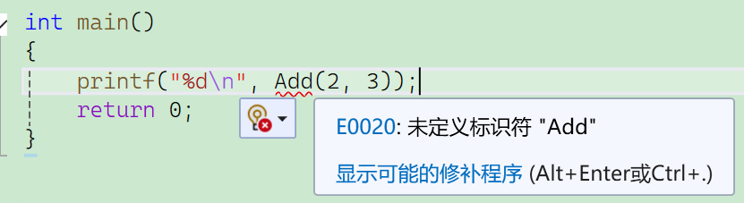
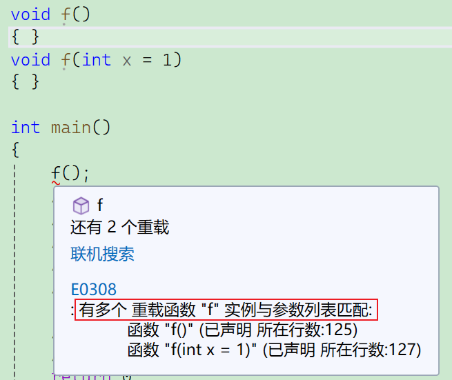
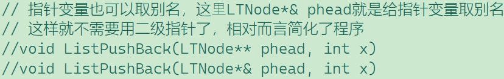
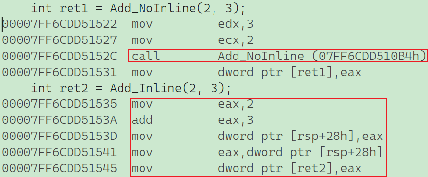
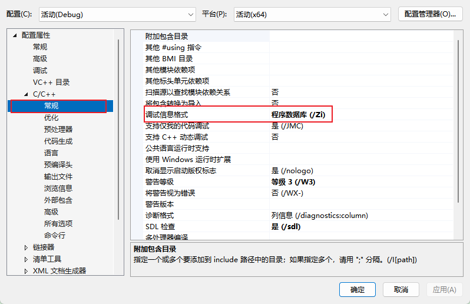
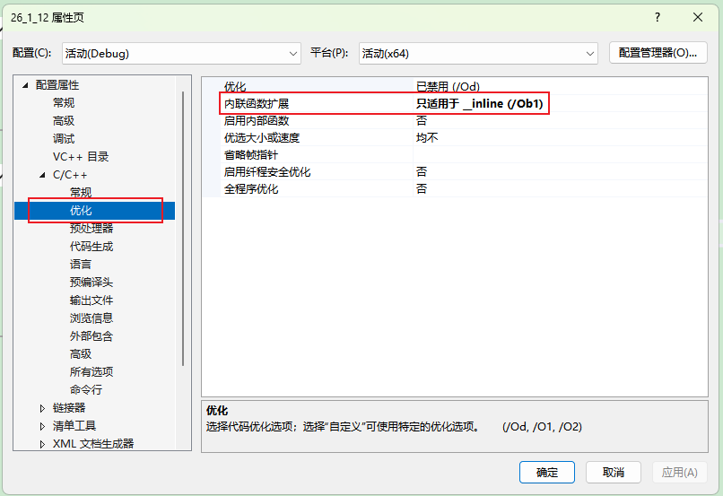
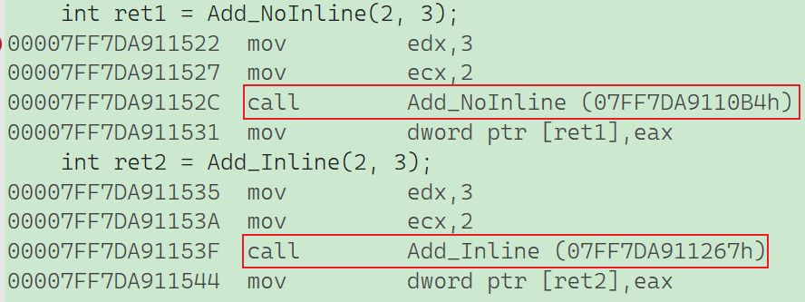

# 一、C++兼容C

​	`C++`兼容`C语⾔`绝⼤多数的语法，所以`C语⾔`实现的`hello world`依旧可以运⾏，`C++`中定义⽂件代码后缀为`.cpp`，**vs编译器**看到是`.cpp`就会调⽤**C++编译器**编译，`linux`下要⽤`g++`编译，不再是`gcc`。

```c
#include <stdio.h>
int main()
{
	printf("hello world!\n");
	return 0;
}
```

所以在`C++`文件中，上述`C语言`代码依旧可以执行，但`C++`版本是这样的：

```c++
#include<iostream>
using namespace std;
int main()
{
	cout << "hello world!" << endl;
	return 0;
}
```

# 二、namespace

​	上面出现了一些比较新的关键字，如`namespace`、`cout`。在`C/C++`中，变量、函数和后⾯要学到的类都是⼤量存在的，这些变量、函数和类的名称将都存在于全局作⽤域中，可能会导致很多冲突。使⽤命名空间的⽬的是对标识符的名称进⾏本地化，以避免命名冲突或名字污染，`namespace`关键字的出现就是针对这种问题的。

​	`c语⾔`中如果定义一个**与库函数名相同的变量**，就会出现`编译报错：error C2365: “rand”: 重定义；以前的定义是“函数”`的问题，而命名冲突是`C语言`普遍存在的问题，而`C++`引⼊`namespace`就是为了更好的解决这样的问题。

## 2.1 namespace定义

- 定义命名空间，需要使⽤到`namespace`关键字，后⾯跟命名空间的名字，然后接⼀对`{}`即可，`{}`中即为**命名空间的成员**。命名空间中可以定义**变量/函数/类型**等。
- `namespace`本质是定义出⼀个**域**，这个**域**跟**全局域各⾃独⽴**，不同的域可以定义同名变量，所以代码中定义的**与库函数名相同的变量**就不会存在编译报错，也就不再冲突了。
- `C++`中**域有函数局部域，全局域，命名空间域，类域**；域影响的是编译时语法**查找⼀个变量/函数/类型出处(声明或定义)的逻辑**，所有有了域隔离，名字冲突就解决了。**局部域和全局域**除了会影响编译查找逻辑，还会**影响变量的⽣命周期**，**命名空间域和类域不影响变量⽣命周期**。
- `namespace`只能定义在全局，也可以**嵌套定义**。
- 项⽬⼯程中多⽂件中定义的同名`namespace`会认为是⼀个`namespace`，不会冲突，且在不同文件的同一命名空间执行时会合并。
- `C++`标准库都放在⼀个叫`std(standard)`的**命名空间**中。

```c++
namespace marathon
{
    //嵌套定义extreme命名空间
	namespace extreme  
	{
        //各自命名空间的变量、函数不会出现编译报错
		int Add(int x, int y)
		{
			return x + y;
		}
		int rand = 300;
	}
	//当前命名空间的成员
	int Add(int x, int y)
	{
		return x + y;
	}
	int rand = 100;
}
```

## 2.2 命名空间使用

编译查找⼀个变量的声明/定义时，默认**只会在局部或者全局**查找，**不会到命名空间⾥⾯去查找**。所以程序会编译报错。



所以我们要使⽤命名空间中定义的变量/函数，有三种⽅式：

- **指定命名空间访问：** `命名空间::成员` (推荐在项目中使用) ，当域限定符左边什么都不写时，默认就是全局。

- **全展开：** `using namespace std;` (方便练习，但项目中不推荐，容易冲突) 。

- **部分展开：** `using std::cout;` (推荐常用成员展开) 。

```c++
//1.局部展开 using marathon::Add;
printf("%d\n", Add(2, 3));
//2.加上域限定 marathon::
printf("%d\n", marathon::Add(2, 3));
//3.全局展开 using namespace marathon;
printf("%d\n", Add(2, 3));
```

# 三、cin & cout

- `<iostream>` 是 `Input Output Stream` 的缩写，是标准的输⼊、输出流库，定义了标准的输入、输出对象。

- `std::cin` 是 `istream` 类的对象，它主要⾯向**窄字符**（narrow characters (of type char)）的标准输入流。

- `std::cout` 是 `ostream` 类的对象，它主要⾯向**窄字符**的标准输出流。

- `std::endl` 是⼀个函数，流插入输出时，相当于插入⼀个换⾏字符加刷新缓冲区。

- `<<`是**流插⼊运算符**，`>>`是**流提取运算符**。（注：C语⾔⽤这两个运算符做位运算左移/右移）

- 使⽤`cin、cout`输⼊输出更⽅便，不需要像`printf/scanf`输⼊输出时那样，需要**⼿动指定格式**，**C++的输⼊输出**可以**⾃动识别变量类型**(本质是通过**函数重载**实现的，这个以后会讲到)，其实最重要的是**C++的流**能**更好的⽀持⾃定义类型对象的输⼊输出**。

- `IO流`涉及类和对象，运算符重载、继承等很多**⾯向对象**的知识，这些知识还没有学，所以这⾥简单认识⼀下**C++ IO流**的⽤法。

- `cout/cin/endl`等都属于**C++标准库**，**C++标准库**都放在⼀个叫**std(standard)**的命名空间中，所以要通过命名空间的使⽤⽅式去⽤他们。

- ⼀般⽇常练习中可以全部展开`using namespace std`，实际项⽬开发中不建议全部展开。

- 这⾥没有包含`<stdio.h>`，也可以使⽤**printf和scanf**，是因为在包含`<iostream>`间接包含了。vs系列编译器是这样的，其他编译器可能会报错。

```c++
int main()
{
	int a = 0;
	double b = 0.1314;
	char c = 'c';
	cout << a << " " << b << " " << c << endl;
	std::cout << a << " " << b << " " << c << std::endl;
	//scanf("%d%lf", &a, &b);
	//printf("%d %lf\n", a, b);
	// 可以自动识别变量的类型
	cin >> a >> b >> c;
	cout << a << b << " " << c << endl;
	return 0;
}
```

> 这里发现`cin`输入时，根本不需要管输入之间的空格字符，就去了解了一下： 
>
> - **自动跳过空白：** `>>` 运算符在设计时被设定为：在开始读取有效数据之前，会**默认自动跳过**所有的空白字符（包括空格 `     `、换行符 `\n`、制表符`\t`）。
> - **作为分隔符：** 当 `cin` 读取完一个完整的数据（例如读完一个整数）后，如果遇到空格，它会认为当前数据读取结束。这个空格会被留在缓冲区中，作为两个数据之间的**分隔符**。
>
> 第二个 `>>` 自动跳过中间所有的空格，直接读取后续数据。

## I/O 加速

如果你在做算法题遇到 `Time Limit Exceeded` (TLE) 超时错误，且题目有几百万行的输入输出，加上这几行代码通常能救命。但在日常写工程代码时，建议不要加，以免影响交互体验或导致混用错误。

```c++
int main()
{
	ios_base::sync_with_stdio(false);
	cin.tie(nullptr);
	cout.tie(nullptr);
	
	return 0;
}
```

`ios_base::sync_with_stdio(false);`：**取消 C++ 流与 C 标准流的同步。**

- **背景：** 默认情况下，C++ 的 `cin/cout` 和 C 语言的 `scanf/printf` 是**同步**的。这意味着你可以混合使用它们，输出顺序也会被保证是正确的（例如先 `printf` 再 `cout`，屏幕上也会按顺序显示）。为了实现这种同步，C++ 的流必须时刻与 C 的缓冲区保持一致，这会消耗大量的时间，导致 `cin/cout` 比 `scanf/printf` 慢很多。
- **加速原理：** 将该开关设置为 `false` 后，C++ 的流就会拥有自己独立的缓冲区，不再去配合 C 语言的缓冲区。这样 `cin/cout` 的速度就能大幅提升，甚至接近或超过 `scanf/printf`。
- **Tips：** 一旦开启了这个选项，**严禁**在同一个程序中混合使用 `cout` 和 `printf`（或者 `cin` 和 `scanf`），否则会导致输出顺序混乱或乱码。

`cin.tie(nullptr);`：**解除 `cin` 与 `cout` 的绑定。**

- **背景：** 默认情况下，`cin` 是被绑定（`tied`）到 `cout` 上的。这意味着，每次你执行 `cin >> x;` 读取输入之前，编译器都会自动先执行一步 `cout.flush();`（清空输出缓冲区，把积攒的字符强制打印到屏幕上）。

- **原理：** 在算法竞赛中，只在乎最终结果，不在乎交互过程。设置 `cin.tie(nullptr)` 后，读取输入前不再强制刷新输出缓冲区。如果有大量交替进行的输入输出（例如读一个数，输出一个数，循环 100万次），这能节省大量反复刷新缓冲区的时间。

`cout.tie(nullptr);`：**解除 `cout` 的绑定（通常是防御性的）。**

- **原理：** 默认情况下 `cout` 并没有绑定到其他流上，所以这行代码在很多编译器环境下其实是多余的。但是为了保险起见（或者为了对称美），很多选手习惯写上，确保 `cout` 不会被其他流的操作意外触发刷新。

**总结与对比**

| **特性**     | **默认情况**              | **加上这三行代码后**          |
| ------------ | ------------------------- | ----------------------------- |
| **兼容性**   | 可以混用 `scanf`/`printf` | **不能**混用 `scanf`/`printf` |
| **缓冲区**   | 与 C 标准库同步 (慢)      | C++ 独享缓冲区 (快)           |
| **自动刷新** | `cin` 前会自动刷新 `cout` | `cin` 前**不**自动刷新 `cout` |
| **适用场景** | 日常开发、交互式程序      | **算法竞赛、海量数据读写**    |

# 四、缺省参数

- 缺省参数是声明或定义函数时为函数的参数指定⼀个缺省值。在调⽤该函数时，如果没有指定实参则采⽤该形参的缺省值，否则使⽤指定的实参，缺省参数分为全缺省和半缺省参数。（有些地⽅把缺省参数也叫默认参数）

- 全缺省就是**全部形参给缺省值**，半缺省就是**部分形参给缺省值**。C++规定**半缺省参数必须从右往左依次连续缺省，不能间隔跳跃给缺省值**。

- 带缺省参数的函数调⽤，C++规定必须**从左到右依次给实参，不能跳跃给实参**。

- 函数声明和定义分离时，缺省参数不能在函数声明和定义中同时出现，规定必须函数声明给缺省值。

```c++
void Func(int a = 10, int b = 20) 
{
	cout << a + b << endl;
}

int main() 
{
	Func();     // 使用默认值：10 + 20
	Func(1);    // a=1, b=20
	Func(1, 2); // a=1, b=2
	return 0;
}
```

# 五、函数重载

C++⽀持在同⼀作⽤域中出现同名函数，但是要求这些同名函数的形参不同，可以是参数个数不同或者类型不同。这样C++函数调⽤就表现出了多态⾏为，使⽤更灵活。C语⾔是不⽀持同⼀作⽤域中出现同名函数的。

**原理：** C++ 编译器在编译时会对函数名修饰（Name Mangling），将参数类型包含在最终的符号名中，从而区分不同的函数。C语言不支持此特性。

> **注意：** 返回值不同不能作为重载条件 。

那也就是参数列表的情况了，参数类型、个数、顺序不同皆可重载：

```c++
// 1、参数类型不同
int Add(int left, int right)
{
	cout << "int Add(int left, int right)" << endl;
	return left + right;
}
double Add(double left, double right)
{
	cout << "double Add(double left, double right)" << endl;
	return left + right;
}
// 2、参数个数不同
void f()
{
	cout << "f()" << endl;
}
void f(int a)
{
	cout << "f(int a)" << endl;
}
// 3、参数类型顺序不同
void f(int a, char b)
{
	cout << "f(int a,char b)" << endl;
}
void f(char b, int a)
{
	cout << "f(char b, int a)" << endl;
}
```

但是这两个函数构成函数重载吗？

```c++
void f()
{ }

void f(int x = 1)
{ }
```

答案是`NO!`，传参时当然没问题，但是空调用呢？两个函数都满足啊，编译器该调用哪个？



# 六、引用

## 6.1 概念、定义、特性、使用

引⽤不是新定义⼀个变量，⽽是给**已存在变量取了⼀个别名**，编译器不会为引⽤变量开辟内存空间，它和它引⽤的变量共⽤同⼀块内存空间。⽐如：⽔壶传中李逵，宋江叫"铁⽜"，江湖上⼈称"⿊旋⻛"；林冲，外号豹⼦头；

>C++中为了避免引⼊太多的运算符，会复⽤C语⾔的⼀些符号，⽐如前⾯的<< 和 >>，这⾥引⽤也和取地址使⽤了同⼀个符号&，⼤家注意使⽤⽅法⻆度区分就可以。

- **语法：** `类型& 别名 = 原变量;`
- **特性：**
  1. 定义时必须初始化 。
  2. 一个变量可以有多个引用。
  3. **引用一旦指向一个实体，就不能再改变指向**（这是与指针最大的区别）。
- **应用场景：**
  - **做参数：** 减少拷贝，提高效率（类似指针效果，但更安全方便）。
  - **做返回值：** 减少拷贝，可以直接修改返回对象（需确保返回对象出了函数作用域还在）。
- **使用：**
  - 引⽤在实践中主要是于引⽤传参和引⽤做返回值中减少拷⻉提⾼效率和改变引⽤对象时同时改变被引⽤对象。
  - 引⽤传参跟指针传参功能是类似的，引⽤传参相对更⽅便⼀些。
  - 引⽤和指针在实践中相辅相成，功能有重叠性，但是各有特点，互相不可替代。C++的引⽤跟其他语⾔的引⽤(如Java)是有很⼤的区别的，除了⽤法，最⼤的点，`C++`引⽤定义后**不能改变指向**，`Java`的引⽤可以**改变指向**。
  - 引⽤返回值的场景相对⽐较复杂，在这⾥简单了解⼀个场景：修改栈顶元素，还有⼀些内容后续继续学习。

在我们没学引用之前，修改栈顶元素可能有很多方式，但这些方式大概率离不开入栈出栈，学习引用之后，就可以优雅的修改栈顶元素：

```c++
int& STTop(ST & rs)
{
	assert(rs.top > 0);
	return rs.a[rs.top-1];
}
STTop(rs) = 20;
```

**普通返回 (`int STTop`)**: 如果函数返回类型是 `int`，它会把数组里的那个值拷贝一份返回。这个返回值是一个“临时值”（右值），你不能给一个临时值赋值。

**引用返回 (`int& STTop`)**: 函数返回的是 `rs.a[rs.top-1]` 这块内存空间的**别名** 。也就是说，`STTop(rs)` **就是** 数组中那个元素的本体。

> 链表部分使用引用也能简化代码：
>
> 

引用还有一些经典的错误使用场景，下面这个应用场景就是一个常见的错误使用：

```c++
int& Fun()
{
	int n = 0;
	return n;
}
```

这是一个非常典型的 C++ 错误，被称为 **“悬空引用” (Dangling Reference)** 或 **“野引用”**——返回对象是一个当前函数局部域的局部对象，函数结束就销毁了，那么使用引用返回是有问题的，这时的引用相当于一个**野引用**，类似一个**野指针**一样。一定要确保返回对象，在当前函数结束后还在，才能用引用返回。

## 6.2 const引用

**`const` 引用**（常引用）是指向常量的引用。

- **语法：** `const 类型& 别名 = 实体;`
- **含义：** 你通过这个“别名”只能读取数据，**不能修改**数据。
- **通俗理解：** 就像给一个“只读”的权限。不管原变量是否允许修改，只要你用了 `const` 引用这个身份，你就不能动它。

**理解 `const` 引用最关键的原则：权限规则——权限可以缩小，不能放大。**

**(1) 权限放大（报错）**：如果一个变量本身已经是 `const`（只读）的，你不能用一个普通的引用（可读可写）指向它。

```c++
const int a = 10; 
// int& ra = a;       // ❌ 编译报错：权限放大。a 只能读，ra 却想写，不允许。
const int& ra = a;    // ✅ 正确：大家都是只读。
```

**(2) 权限缩小（允许）**：如果一个变量是普通的（可读可写），你可以用一个 `const` 引用指向它。这意味着你通过这个别名只能读，但原变量自己还是可以改的。

```c++
int b = 20;
const int& rb = b;    // ✅ 正确：权限缩小。
// rb++;              // ❌ 报错：通过 rb 不能修改。
b++;                  // ✅ 正确：变量 b 自己可以修改。
```

### 6.2.1 难点：const 引用与临时对象

`const` 引用有一个极大的特权：**它可以绑定到临时对象（Temporary Object）上**，而普通引用不行。

**“所谓临时对象就是编译器需要一个空间暂存表达式的求值结果时临时创建的一个未命名的对象”**，并且 **“C++规定临时对象具有常性”**（即临时对象默认是 `const` 的）。

**(1) 表达式的结果**

```c++
int a = 10;
// int& ref = a * 3;      // ❌ 报错：a*3 的结果保存在临时对象中，是右值/常量，普通引用不能接。
const int& ref = a * 3;   // ✅ 正确：const 引用可以延长临时对象的生命周期。
```

**(2) 类型转换（隐式转换）**：这是一个非常经典的坑。


```c++
double d = 12.34;
// int& rd = d;           // ❌ 报错
const int& rd = d;        // ✅ 正确
```

**为什么 `int& rd = d` 会错？**

1. `d` 是 `double`，`rd` 是 `int`。
2. 赋值时，编译器不会直接把 `d` 变成 `int` 给 `rd`，而是产生一个**临时对象**（类型为 `int`，值为 `12`）。
3. 如果不加 `const`，`rd` 引用的是这个临时对象。这就产生了一个逻辑矛盾：如果你修改了 `rd`，你**修改的只是那个临时变量**，真正的 `d` 并没有变，这通常不是程序员想要的。
4. 因此 C++ 规定，**普通引用不能指向临时对象**。但 `const` 引用可以，因为它保证了你不会去试图修改那个“不存在”的临时对象。

**为什么加了 `const` 就可以？**

**消除了修改的风险**：`const` 承诺了“我只读，不改”。既然你不去修改那个临时的 `temp`，那么前面提到的“修改无意义”的逻辑漏洞就不存在了。

**生命周期延长**：这是 C++ 的一个特殊规则。**当一个临时对象被 `const` 引用绑定时，该临时对象的生命周期会自动延长，直到这个引用变量销毁为止**。

> 这意味着那个临时的 `temp` 不会立刻销毁，它会陪着 `rd` 一直活下去，你可以放心地通过 `rd` 读取它的值（12）。

### 6.2.2 实际应用场景

`const` 引用被大量使用，主要有两个目的：

- **提高效率（避免拷贝）**：在函数传参时，如果对象比较大（如自定义的类），传值会产生拷贝构造，消耗大。传引用可以避免拷贝。

- **保证安全（避免被修改）**：如果函数不需要修改传入的对象，**一定要加 `const`**。

**案例：拷贝构造函数**

```c++
Date(const Date& d)  // 必须是引用，且通常加 const
{
    _year = d._year;
    // ...
}
```

- 如果写成 `Date(Date d)`：会引发无穷递归（传参本身又要调用拷贝构造，这里学到类与对象时再详解）。
- 如果写成 `Date(Date& d)`：虽然不会递归，但如果想用一个临时对象（如 `Date(2023,1,1)`）来初始化新对象，或者拷贝一个 `const` 对象，就会因为“权限不能放大”或“无法绑定临时对象”而报错。
- **所以，`const T&` 是函数传参的“万能引用”，它既能接左值（普通变量），也能接右值（临时变量、字面量）。**

### 6.2.3 总结

| **原对象类型**          | **引用类型** | **是否合法** | **原因**                    |
| ----------------------- | ------------ | ------------ | --------------------------- |
| `int`                   | `int&`       | ✅            | 权限匹配                    |
| `int`                   | `const int&` | ✅            | **权限缩小** (只读视图)     |
| `const int`             | `int&`       | ❌            | **权限放大** (危险)         |
| `const int`             | `const int&` | ✅            | 权限匹配                    |
| `10` / `a+b` / `double` | `int&`       | ❌            | 临时对象具有常性            |
| `10` / `a+b` / `double` | `const int&` | ✅            | **const引用可绑定临时对象** |

学懂 `const` 引用，关键在于记住：**它是一种“只读”的万能接口，既安全又能接纳各种类型的参数。**

## 6.3 引用与指针的关系

C++中指针和引⽤就像两个性格迥异的亲兄弟，指针是哥哥，引⽤是弟弟，在实践中他们相辅相成，功能有重叠性，但是各有⾃⼰的特点，互相不可替代。

**总结对比表**

| **特性**     | **引用 (Reference)**  | **指针 (Pointer)**    |
| ------------ | --------------------- | --------------------- |
| **定义**     | 别名                  | 地址变量              |
| **符号**     | `&`                   | `*`                   |
| **空间**     | 不开空间                | 开空间                 |
| **初始化**   | 必须初始化            | 建议初始化，但语法上可以不初始化   |
| **指向更改** | 不可更改              | 可以更改              |
| **访问方式** | 直接访问引用对象        | 解引用间接访问指向对象          |
| **空值**     | 无空引用              | 可以为 `nullptr`      |
| **自增含义** | 实体值增加            | 指针向后偏移          |
| **sizeof**   | 实体类型大小          | 指针变量大小 (4/8)    |
| **多级**     | 无                    | 有 (`**p`)            |
| **安全性**   | 相对安全 (不易野引用) | 风险较高 (容易野指针) |

# 七、inline函数


## 7.1 为什么要有内联函数？（C语言宏的痛点）

在 C 语言中，为了提高代码执行效率，对于那些**短小且频繁调用**的函数（比如加法、交换数值），我们习惯用**宏函数（Macros）**来替代。

**宏的优势：**

- 不需要建立函数栈帧（Stack Frame），没有压栈、弹栈的开销，速度快。

**宏的劣势（C++ 为什么要抛弃它）：**

1. **容易出错：** 优先级问题极其恶心。
   - *例子：* `#define ADD(x, y) x + y`
   - *调用：* `ADD(1, 2) * 5` 变成 `1 + 2 * 5` = 11（原本想算 15）。
   - *修正：* 必须写成 `#define ADD(x, y) ((x) + (y))`，括号稍微少一个就错。
2. **无法调试：** 宏在预处理阶段就替换了，调试时你看不到宏内部的逻辑。
3. **没有类型安全检查：** 编译器不管你传的是 `int` 还是 `string`，容易引发奇怪的错误。

**C++ 的解决方案：** 引入 `inline` 关键字。它既保留了宏“不建立栈帧”的**速度**，又拥有了普通函数“可调试、有类型检查”的**安全**。

## 7.2 内联函数的原理

- **定义：** 以 `inline` 关键字修饰的函数。
- **编译机制：** 编译时，C++ 编译器会在**调用内联函数的地方**，直接把函数体“**展开**”（Copy-paste 进去），而不是去执行 `call` 指令跳转。

**对比图解：**

- **普通函数：** 代码执行到 `Call Func()` -> 跳到函数地址 -> 建立栈帧 -> 执行代码 -> 销毁栈帧 -> 跳回原处。（有路费开销）
- **内联函数：** 代码执行到这里 -> 直接执行函数里的代码。（省去了路费）



> 在默认的 Debug 模式下，`inline` 通常**不会生效**。
>
> - 因为如果代码展开了，就没有函数地址了，你就无法打断点、单步跟踪了。
> - Release 模式下会自动优化展开。
>
> 想打开需要进行两个设置：
>
> 
>
> 
>
> 打开着两个设置后，就可以将内联函数展开了。

## 7.3 使用规则与特性

**(1) 只是一个“建议”**：`inline` 对编译器来说只是一个**建议（Request）**，而不是命令。

- **编译器会采纳：** 函数体很小（代码少）、逻辑简单（没有复杂的循环或递归）。
- **编译器会拒绝：** 函数体很大（代码多）、包含递归、循环等复杂逻辑。
  - *理由：* 如果一个 100 行代码的函数在 100 个地方被调用，展开后代码体积会膨胀 100 倍，导致可执行程序过大（代码膨胀），反而导致内存命中率下降，得不偿失。

**(2) 空间换时间**：内联函数本质上是用**更多的内存空间**（代码段重复）来换取**更快的运行时间**（省去调用开销）。

> 如果这时候给我上面给出的内联函数多加一些代码，那么内联也就不展开了：
>
> 

**(3) 核心大坑：声明与定义分离（链接错误）**：**内联函数不要声明和定义分离，必须直接写在头文件（.h）中。**

**错误写法：**

```c++
// 头文件
inline void f(int i); // 声明
// 实现文件
void f(int i) // 定义
{       
    cout << i << endl;
}
//测试文件
#include "F.h"
int main() {
    f(10); // ❌ 链接错误 (LNK2019)
    return 0;
}
```

**为什么会报错？**

1. **编译阶段：**
   - `main.cpp` 包含 `F.h`，知道有 `f` 这个函数。编译器看它是 `inline`，想在这里展开它。
   - 但是`main.cpp` 只有声明，找不到函数体（函数体在 `F.cpp` 里），所以编译器无法展开。
   - 编译器心想：“好吧，那我就把它当成普通函数调用（call f）吧。”
2. **链接阶段：**
   - `F.cpp` 被编译时，编译器看到 `f` 是 `inline`。
   - **关键点：** 内联函数因为被设计为“直接展开”，所以编译器**不会**把它的地址**放进符号表**里给别人用。
   - 链接器试图把 `main.obj` 中的 `call f` 和 `F.obj` 中的 `f` 连起来，结果在 `F.obj` 的符号表里根本找不到 `f` 的地址。
   - **结果：** 链接错误 (unresolved external symbol)。

**正确写法：** 直接写在 `.h` 文件里，或者在类定义里直接写实现。

```c++
// F.h 声明和定义在一起
inline void f(int i) 
{ 
    cout << i << endl;
}
```

这样，每个包含 `F.h` 的 `.cpp` 文件都能直接拿到函数体代码进行展开。

**`inline` 内联函数使用指南**

| **维度**       | **适合使用 inline 的场景**            | **不适合 (或自动忽略) 的场景**    | **核心理由**                                                 |
| -------------- | ------------------------------------- | --------------------------------- | ------------------------------------------------------------ |
| **代码行数**   | **非常短小** (通常在 3-5 行以内)      | **代码很长** (几十行甚至上百行)   | 防止代码膨胀。如果大函数展开，可执行文件体积会爆炸。         |
| **调用频率**   | **极高** (例如在循环内部反复调用)     | **低频** (程序运行全程只调用几次) | 只有在高频调用时，省去的“开栈/清栈”时间的收益才明显。        |
| **逻辑复杂度** | **简单** (如简单的交换、取值)         | **复杂** (包含**递归**等)         | 复杂逻辑本身的执行时间远大于调用开销；且递归无法在编译期展开。 |
| **定义位置**   | **类内部** (在类里写的函数体默认内联) | **声明与定义分离**                | 编译器必须在调用时能看到函数体才能展开，否则会报链接错误。   |

**核心口诀 (一句话记法)：短小频繁用内联，声明定义不分家。**

# 八、nullptr

NULL实际是⼀个宏，在传统的C头⽂件(`stddef.h`)中，可以看到如下代码：

```c
#ifndef NULL
	#ifdef __cplusplus
		#define NULL 0
	#else
		#define NULL((void*)0)
	#endif
#endif
```

在 C 语言中，`void*` 可以隐式转换为任意类型的指针，所以用 `(void*)0` 表示空指针非常完美。

但是 C++ 的类型检查比 C 严格得多，**C++ 不允许 `void*` 隐式转换为其他指针**（例如 `int* p = (void*)0;` 在 C++ 中是错误的）。 为了兼容，C++ 编译器不得不把 `NULL` 定义为整数 0：

**这一妥协导致了一个巨大的 Bug —— 函数重载歧义。**：假设你有两个重载函数，一个接收整数，一个接收指针：

```c++
void f(int x) 
{
	cout << "f(int) 被调用" << endl;
}
void f(int* x) 
{
	cout << "f(int*) 被调用" << endl;
}
int main() 
{
	f(0);           // 调用 f(int) -> 合理
	f(NULL);        // 期望调用 f(int*)，但实际调用了 f(int)！
	f((int*)NULL);  // 必须强转才能调用指针版本 -> 麻烦
	return 0;
}
```

**解析：**

- 因为在 C++ 中 `NULL` 被宏替换成了 `0`，编译器看到 `f(0)`，当然优先匹配参数为 `int` 的函数。
- 这违背了程序员的直觉（传的是空指针，为什么要调整数函数？）。


为了解决这个问题，C++11 引入了 `nullptr` 关键字。

- **类型：** 它的类型是 `std::nullptr_t`。
- **特性：**
  1. 它可以隐式转换为**任意类型的指针**。
  2. 它**不能**隐式转换为整数。
  3. 它类似于 `(void*)0`，但是是类型安全的。

```c++
int main() 
{
    f(0);       // 调用 f(int)
    f(nullptr); // 明确调用 f(int*)，因为 nullptr 只能匹配指针
    return 0;
}
```

**总结对比表**

| **特性**       | **C语言中的 NULL** | **C++中的 NULL**      | **C++中的 nullptr** |
| -------------- | ------------------ | --------------------- | ------------------- |
| **本质**       | `(void*)0`         | 整数 `0`              | 关键字 (特殊类型)   |
| **类型**       | `void*` 指针       | `int`                 | `std::nullptr_t`    |
| **隐式转换**   | 转为任意指针       | 转为 `int` (导致歧义) | 转为任意指针        |
| **重载安全性** | N/A (C无重载)      | **不安全**            | **安全**            |
| **推荐指数**   | C语言推荐          | **不推荐**            | **强烈推荐**        |

**一句话总结：** 在 C++ 代码中，看到 `NULL` 就把它当成整数 `0`；如果要表示空指针，只用 `nullptr`——忘记`NULL`。

