## 1. 继承语法与基本概念

继承（Inheritance）是面向对象编程（OOP）的三大特性之一，它允许我们在既有类的基础上创建新类。是⾯向对象程序设计使代码可以复⽤的最重要的⼿段，它允许我们在保持原有类特性的基础上进⾏扩展，增加⽅法(成员函数)和属性(成员变量)，这样产⽣新的类，称为派⽣类。继承呈现了⾯向对象程序设计的层次结构，体现了由简单到复杂的认知过程。以前我们接触的函数层次的复⽤，继承是类设计层次的复⽤。

### 1.1 基本语法

```C++
class Derived : access-specifier Base 
{
    // 子类新增成员
};
```

- **Base**: 基类（父类）
- **Derived**: 派生类（子类）
- **access-specifier**: 继承方式（`public`, `protected`, `private`）

### 1.2 访问权限表

C++的继承访问权限由两部分共同决定：**基类成员本身的访问限定符**和**继承方式**。

<table>
  <thead>
    <tr>
      <th>类成员/继承方式</th>
      <th style="background-color: lightblue;">public继承</th>
      <th>protected继承</th>
      <th>private继承</th>
    </tr>
  </thead>
  <tbody>
    <tr style="background-color: lightyellow;">
      <td style="background-color: lightblue;">基类的public成员</td>
      <td style="background-color: lightblue;">派生类的public成员</td>
      <td>派生类的protected成员</td>
      <td>派生类的private成员</td>
    </tr>
    <tr  style="background-color: lightyellow;">
      <td style="background-color: lightblue;">基类的protected成员</td>
      <td style="background-color: lightblue;">派生类的protected成员</td>
      <td>派生类的protected成员</td>
      <td>派生类的private成员</td>
    </tr>
    <tr>
      <td>基类的private成员</td>
      <td>在派生类中不可见</td>
      <td>在派生类中不可见</td>
      <td>在派生类中不可见</td>
    </tr>
  </tbody>
</table>

- 基类 `private` 成员在派生类中**无论以什么方式继承都是不可见的**。这里的不可见是指基类的**私有成员仍然被继承到了派生类对象**中，但是**语法上限制派生类对象不管在类里面还是类外面都不能去访问它**。
	- 但是可以间接使用——只能通过基类的 `public` 或 `protected` 接口间接访问——如果基类里面某个函数对私有成员进行调用，且函数可以被继承下来，那么派生类就可以根据函数间接调用到私有。
- 基类 `private` 成员在派生类中是**不能被访问**，如果**基类成员不想在类外直接被访问**，但需要**在派生类中能访问**，就定义为 `protected`。可以看出保护成员限定符是因继承才出现的。**保护成员（protected）**：设计的初衷就是“对子类开放，对外界隐藏”。
- 实际上面的表格我们进行一下总结会发现，**基类的私有成员在派生类都是不可见**。**基类的其他成员在派生类的访问方式** == **`Min(成员在基类的访问限定符，继承方式)`**，**其中 `public` > `protected` > `private`**。
- 使用关键字 **`class` 时默认的继承方式是 `private`**，使用 **`struct` 时默认的继承方式是 `public`**，不过**最好显式地写出继承方式**。
- 在实际运用中一般使用的都是 `public` 继承，几乎**很少使用 `protected`/`private` 继承**，也**不提倡使用 `protected`/`private` 继承**，因为 `protected`/`private` 继承下来的成员都只能在派生类的类里面使用，实际中扩展维护性不强。

### 1.3 按需实例化

当你定义一个模板类时，编译器并不会立即生成所有成员函数的代码。只有当你真正**调用**某个函数时，该函数才会被实例化。

- **特性**：如果派生类是一个模板，且继承自另一个模板，编译器在处理派生类模板时，并不会去解析基类模板内部的成员。

- **两阶段查找（Two-phase lookup）**：
  1. 第一阶段：解析不依赖模板参数的名字。
  2. 第二阶段：在实例化时解析依赖模板参数的名字。
- **解决方法**：在子类模板中访问父类成员，必须使用 `this->` 或 `Base<T>::` 显式指明，否则编译器会因为“按需实例化”找不到符号而报错。

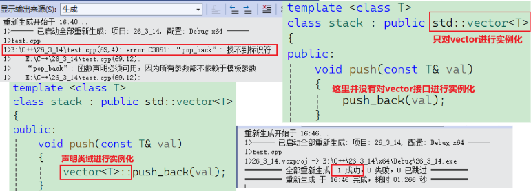

**按需实例化的坑：C++ 类模板的按需实例化是一把“延迟满足”的双刃剑——它允许你在模板中编写潜在错误的代码（只要不调用就不报错），但在继承体系下会由于“惰性编译”导致子类无法直接识别父类成员，必须通过 `this->` 或显式作用域声明来手动“唤醒”编译器对基类名字的查找。**

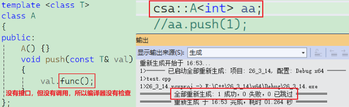

## 2. 公有继承前提：对象切片


- **`public`继承**的**派生类对象**可以赋值给**基类的对象 / 基类的指针 / 基类的引用**。这里有个形象的说法叫**切片或者切割**。寓意**把派生类中基类那部分切出来**，**基类指针或引用指向的是派生类中切出来的基类那部分**。
- **基类对象不能赋值给派生类对象**。
- **无类型转换：** 这种行为在编译器眼中不是常规的类型转换，而是**原生支持的兼容性规则**。
- **注意：** 反过来是不行的（父类不能直接赋给子类），因为子类可能包含父类没有的额外成员。


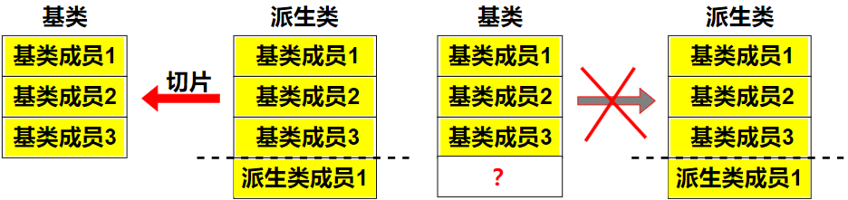

> 基类的指针或者引用可以通过强制类型转换赋值给派生类的指针或者引用。但是必须是基类的指针是指向派生类对象时才是安全的。这里基类如果是多态类型，可以使用RTTI(Run-Time Type Information)的dynamic_cast来进行识别后进行安全转换。（ps：这个后面学习到类型转换再专门讲解，这里先留一下）

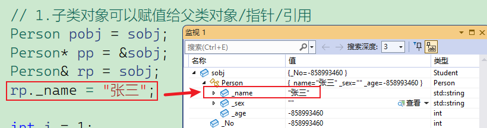

## 3. 继承中的作用域与隐藏

**隐藏规则：**

1. 在继承体系中**基类和派生类都有独立的作用域**。

2. 派生类和基类中有**同名成员**，**派生类成员将屏蔽基类对同名成员的直接访问**，这种情况叫隐藏。（在派生类成员函数中，可以使用 **基类::基类成员** 显式访问）

3. 需要注意的是**如果是成员函数的隐藏**，**只需要函数名相同就构成隐藏**。

  - ```c++
	class A { 
	public:
		 void fun() { cout << "func()" << endl; }
	};
	class B : public A {
	public:
		void fun(int i) { cout << "func(int i)" << i << endl; }
	};
	
	int main()
	{
		B b;
		b.fun(10);
		b.fun();
		return 0;
	};

  - 这两个 `fun` 函数是**隐藏（Hide）关系**，不是重载（overload）也不是重写（override）。派生类的函数隐藏了基类的同名函数，只要函数名相同就构成隐藏，不管参数列表是否相同。这里 `B::fun(int i)` 隐藏了 `A::fun()`，由于隐藏，在 `B` 的作用域内，`A::fun()` 不可见，无法直接调用。

  - 虽然 `B` 继承自 `A`，但由于隐藏，`b.fun()` 只能在 `B` 的作用域中查找 `fun()`，而 `B` 中只有 `fun(int)`，没有无参版本，因此编译失败。

4. 注意在实际中在继承体系里面最好不要定义同名的成员。

> 如果子类定义了与父类同名的成员（变量或函数），父类的同名成员在子类作用域内会被**隐藏**。C++ 中，函数隐藏只看名字，不看参数。即使参数不同，只要名字相同，父类同名函数也会被隐藏（这与重载不同）。
>
> 使用作用域解析符 `Base::member` 即可访问。

## 4. 子类的默认成员函数

子类不会继承父类的构造函数、析构函数和赋值运算符，但会调用它们。

### 4.1 4个常见默认成员函数

6个默认成员函数，**默认的意思就是指我们不写，编译器会帮我们自动生成一个，那么在派生类中，这几个成员函数是如何生成的呢？**

- 派生类的构造函数**必须调用基类的构造函数初始化基类的那一部分成员**。如果**基类没有默认的构造函数**，则**必须在派生类构造函数的初始化列表阶段显式调用**。

- 派生类的**拷贝构造函数必须调用基类的拷贝构造完成基类的拷贝初始化**。

- 派生类的`operator=`必须要调用基类的`operator=`完成基类的复制。需要注意的是派生类的`operator=`隐藏了基类的`operator=`，所以显式调用基类的`operator=`，需要指定基类作用域。

- 派生类的析构函数会在被调用完成后自动调用基类的析构函数清理基类成员。因为这样才能保证派生类对象先清理派生类成员再清理基类成员的顺序。

- 派生类对象初始化**先调用基类构造**再**调用派生类构造**。

- 派生类对象析构清理**先调用派生类析构**再**调用基类的析构**。

- 因为多态中一些场景析构函数需要构成重写，重写的条件之一是函数名相同（这个多态会学）。那么编译器会对析构函数名进行特殊处理，处理成`destructor()`，所以基类析构函数不加`virtual`的情况下，**派生类析构函数和基类析构函数构成隐藏关系**。

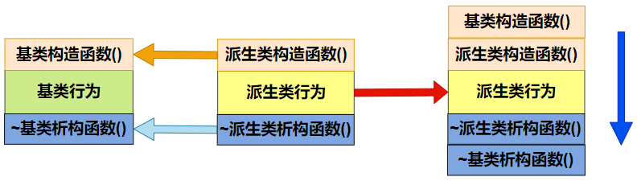

> 这里就只需要记住，把基类成员看做一个整体对象，要求调用基类的默认构造，如果派生类里有一个资源就需要自己写拷贝构造了，需要深拷贝。
>
> 所以一般说子类的构造需要自己写，拷贝构造，赋值，析构一般不需要自己写。（子类有资源除外）

### 4.2 默认函数初始化顺序 

#### 4.2.1 拷贝构造

```c++
// 严格说Student拷贝构造默认生成的就够用了
// 如果有需要深拷贝的资源，才需要自己实现
Student(const Student& s)
    :Person(s)
    ,_num(s._num)
    ,_addrss(s._addrss)
{ cout << "Student(const Student& s)" << endl; }
```

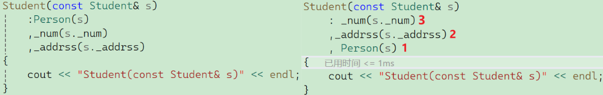

初始化列表跟你写代码的顺序无关，跟声明的顺序有关，所以就可以理解为把基类继承过来后，当做一个整体进行先声明。如果你不写显式调用父类的拷贝构造，那么编译器会调用父类的默认构造，此时虽然编译可以通过，但是结果可能不满足你的要求。

#### 4.2.2 赋值重载

```c++
Student& operator=(const Student& s)
{
    cout << "Student& operator= (const Student& s)" << endl;
    if (this != &s)
    {
        // 父类和子类的operator=构成隐藏关系
        Person::operator=(s);
        _num = s._num;
        _address = s._address;
    }
    return *this;
}
```

这里有几个需要注意的地方，如果处理不好，会导致**数据丢失、无限递归或基类成员未初始化**。

**隐藏关系导致的“无限递归”陷阱（最需警惕）**

在 C++ 中，基类的 `operator=` 和派生类的 `operator=` 名字完全相同。如果不显式指定作用域，就会发生**同名屏蔽**。

- 如果你直接写成 `operator=(s);` 而没有显式指定前缀 `Person::`，编译器会根据“就近原则”在 `Student` 作用域内查找，结果找到了**这个函数自己**。然后程序会陷入死循环（无限递归），最终导致栈溢出（Stack Overflow）奔溃。
- 必须像代码中那样，显式调用 `Person::operator=(s);`。

**赋值兼容规则与“自动切片”**

`Person::operator=` 需要的是 `const Person&`，而代码传入的是 `const Student& s`。

- **原理**：这里利用了**赋值兼容规则（Object Slicing/Upcasting）**。子类引用可以直接赋值给父类引用，且不需要类型转换。
- 编译器会自动从 `s` 中“切”出属于 `Person` 的那部分数据，传递给父类的赋值函数。这是 C++ 语言层面提供的原生支持，确保了父类成员能够被正确处理。

- **核心准则**：**派生类的 `operator=` 必须调用基类的 `operator=`，负责基类部分的成员拷贝。** 这样才能保证整个对象（父类部分 + 子类部分）都被完整更新。

#### 4.2.3 析构函数

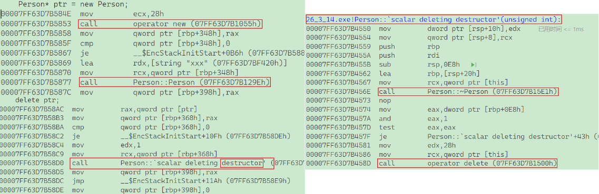

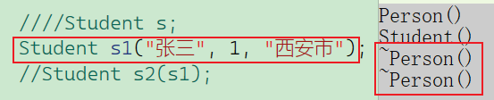

这里可以看见析构函数被调用了两次，其实析构不需要自己显式调用。当一个派生类对象生命周期结束时，析构函数的调用遵循**“先构造后析构，后构造先析构”**的栈式原则：

1. **执行派生类（子类）的析构函数主体**。
2. **执行派生类中成员对象变量的析构函数**。
3. **执行基类（父类）的析构函数**。

在赋值重载中，需要手动调用 `Person::operator=`，但在析构函数中，**绝对不能**写 `Person::~Person()`。

- 原因 A：编译器自动生成的“隐式调用”——编译器在处理子类析构函数时，会自动在子类析构函数的最后一行代码之后，插入调用父类析构函数的指令。
	- **底层逻辑**：这是由编译器强制保证的。无论你是否写了子类析构函数，编译器都会确保父类的析构被触发，以回收父类部分的资源。

- 原因 B：防止重复释放——如果你手动显式调用了父类析构，而编译器随后又自动调用了一次，会导致父类资源被**析构两次**。
	- 如果父类析构函数里有 `delete` 内存或关闭文件的操作，第二次调用就会导致**野指针操作**或**程序崩溃**。

- 原因 C：遵循对象生命周期模型——在 C++ 设计中，子类对象是“包裹”在父类对象之上的。销毁过程必须是从外向内剥离。这种自动调用机制保证了清理过程的完整性和顺序性。

虽然不需要显式调用，但有一个前提条件你必须满足，否则父类析构可能根本**不会执行**。当出现以下场景时：

```C++
Person* ptr = new Student();
delete ptr; 
```

- **如果 `Person` 的析构函数不是 `virtual`**：编译器会根据指针类型（`Person*`）只调用 `Person` 的析构函数，而**跳过** `Student` 的析构函数。这会导致子类特有的资源（如 `Student` 里的堆内存）发生泄漏。
- **如果 `Person` 的析构函数是 `virtual`**：编译器会根据实际指向的对象类型，先调用 `Student` 的析构，再由系统自动触发 `Person` 的析构。

> **核心准则**：只要一个类可能被继承，它的析构函数就应该声明为 `virtual`。

### 4.3 总结

编译器会自动为子类生成 6 个默认成员函数（构造、拷贝、析构等），但它们的行为遵循特定规则：

1. **构造函数：** 子类必须调用父类的构造函数来初始化父类部分。如果父类没有默认构造函数，子类必须在初始化列表中显式调用。
2. **拷贝构造：** 调用父类的拷贝构造完成父类部分的拷贝。
3. **赋值重载：** 调用父类的 `operator=` 完成父类部分的赋值。
4. **析构函数：** 子类析构函数执行完后，会**自动**调用父类的析构函数。这保证了清理顺序：**先子后父**（与构造顺序相反）。

## 5. 实现一个不能被继承的类

### 5.1 C++98

基类的构造函数私有，派⽣类的构成必须调⽤基类的构造函数，但是基类的构成函数私有化以后，派⽣类看不见就不能调⽤了，那么派⽣类就⽆法实例化出对象。

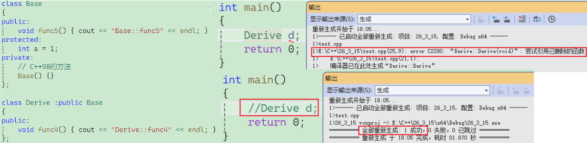

但这个方法就有上述这个弊端，当你不定义派生类对象，编译器压根就不报错。

### 5.2 C++11——`final`

而在 C++ 11之后引入了一个关键字——`final`，只要基类被修饰为`final`，不管定义不定义派生类对象，都会报错。

```c++
class Base final { ... };
```

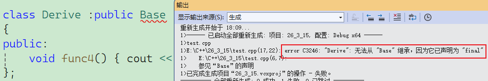

## 6. 友元与继承

> `tips`：编译器有什么报很奇怪的错误，这时候就只能用语法知识解决了，编译器遇到一个东西会向上查找，这是为了编译速度，但是`Student`类在下面，所以找不到，但是`Student`又依赖`Person`，所以需要加一个前置声明。

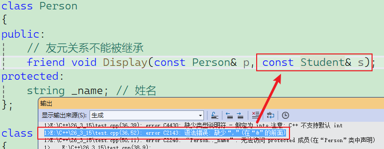

```c++
// 前置声明
class Student;
class Person { ...... };
class Student : public Person { ...... };
```

**友元关系不能继承。**——也就是说基类友元不能访问派⽣类私有和保护成员 。

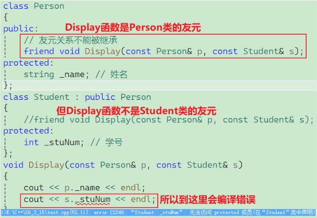

只需要把两个类里都添加友元声明就可以。

## 7. 静态成员与继承

### 7.1 静态成员唯一性

在 C++ 继承体系中，静态成员（`static`）的规则非常特殊。它不像普通成员变量那样“每个对象一份”，而是遵循**整个继承体系共用一份**的原则。在基类中定义的静态成员，无论派生出多少个子类，也无论实例化了多少个对象，在整个程序运行期间，**该静态成员在内存中只有唯一的一份实体**。

- **普通成员**：子类对象会完整包含父类的普通成员，内存随对象而生。
- **静态成员**：独立于任何对象，存储在全局/静态区。子类并不“拥有”它，而是拥有对它的**访问权**。

虽然静态成员只有一份，但它在子类和父类中都是**可见**的。你可以通过多种方式访问同一个静态变量：

1. **基类名**：`Base::_count`
2. **派生类名**：`Derived::_count`
3. **基类对象**：`baseObj._count`
4. **派生类对象**：`derivedObj._count`

**本质：** 以上四种方式指向的都是同一个内存地址。

```C++
class Person
{
public:
	string _name;
	static int _count;
};
int Person::_count = 0;
class Student : public Person {};

int main()
{
	Person p;
	Student s;
	// 这里的运行结果可以看到非静态成员_name的地址是不一样的，说明子类继承下来了，父子类对象各有一份
	cout << &p._name << endl;
	cout << &s._name << endl;
	// 这里的运行结果可以看到静态成员_count的地址是一样的，说明子类和父类共用同一份静态成员
	cout << &p._count << endl;
	cout << &s._count << endl;
	// 公有的情况下，父子类指定类域都可以访问静态成员
	cout << Person::_count << endl;
	cout << Student::_count << endl;
	Person::_count++;
	cout << p._count << endl;
	cout << s._count << endl;
	return 0;
}
```

```
运行结果：
0059FC50
0059FC28
00FDE47C
00FDE47C
0
0
1
1
```

### 7.2 静态成员的继承与隐藏

静态成员同样遵循**同名隐藏**规则。如果子类定义了一个与父类同名的静态成员，父类的静态成员在子类作用域内会被屏蔽。

- **场景**：`Student` 类也定义了 `static int _count`。
- **结果**：此时 `Student::_count` 访问的是子类自己的静态变量，而 `Person::_count` 访问的是父类的。它们在内存中是两个不同的变量。

此时必须显式增加域名限定符访问：

```c++
Person::_count
Student::Person::_count
```

### 7.3 静态成员函数与继承

```c++
class Person {
public:
    static void Print() { cout << "Person" << endl; }
};
class Student : public Person {
public:
    static void Print() { cout << "Student" << endl; }
};
int main() {
    Student::Print();         // 输出 Student
    Student::Person::Print(); // 输出 Person（通过子类域名连续推导）
    Person::Print();          // 输出 Person
}
```

静态成员函数也可以被继承，但它有以下几个硬性约束：

1. **不能是虚函数（virtual）**：静态成员函数不属于任何对象，没有 `this` 指针，因此无法通过虚函数表实现动态绑定。
2. **受访问权限控制**：如果基类的静态成员是 `private`，子类虽然在逻辑上“继承”了它，但无法直接访问。
3. **重写问题**：子类可以定义与父类同名的静态函数，但这不叫“重写（Override）”，而是“隐藏（Hiding）”。

### 7.4 经典面试题

统计类及其子类一共创建了多少个对象？——利用继承中静态成员唯一的特性，我们可以轻松实现：

```C++
class Base 
{
public:
    Base() { ++_count; }
    // 拷贝构造也需要自增
    Base(const Base&) { ++_count; }
    static int _count;
};
int Base::_count = 0;
class Derived : public Base {};
// 无论创建 Base 还是 Derived 对象，都会调用 Base 的构造函数，从而增加同一个 _count
```

## 8. 继承模型

这是 C++ 内存布局中最复杂的部分。C++ 的继承模型是一个从**简单线性堆叠**到**多维复合排列**，再到**指针偏移寻址**的演进过程。其核心目标是在内存中既要保留父类的特征，又要能灵活处理多重身份带来的资源冲突。

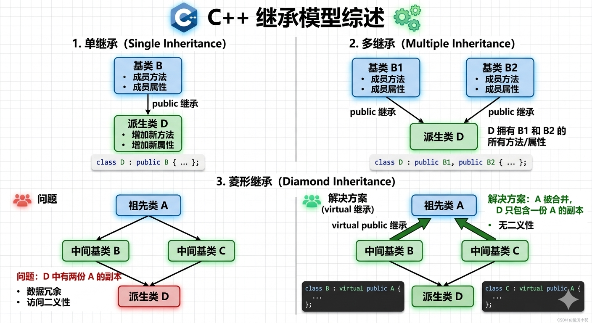

### 8.1 单继承

单继承是继承体系中最基本的形式，体现了严格的“父与子”关系。

- **模型特征**：子类只有一个直接父类。
- **内存分布**：父类成员排布在低地址，子类成员排布在高地址。子类对象在内存布局上完全包含父类。
- **查找效率**：最高。由于偏移量在编译期固定，访问父类成员与访问本类成员效率几乎一致。
- **评价**：这是面向对象设计中最推崇的模型，逻辑简单，耦合度低。

### 8.2 多继承

多继承允许一个子类拥有多个父类的属性，类似于现实中一个人既是“学生”又是“员工”。

- **模型特征**：一个子类拥有多个直接父类。
- **内存分布**：编译器按照继承列表中的声明顺序，在子类对象中依次排列各父类的子对象。
- **关键点：指针偏移**
	- 当你把子类对象赋值给第二个父类的指针时，指针会自动向后偏移，指向属于该父类的起始位置。
	- **坑点**：如果多个父类有同名成员，子类访问时会报“二义性”错误，必须显式调用（如 `s.Base2::func()`）。

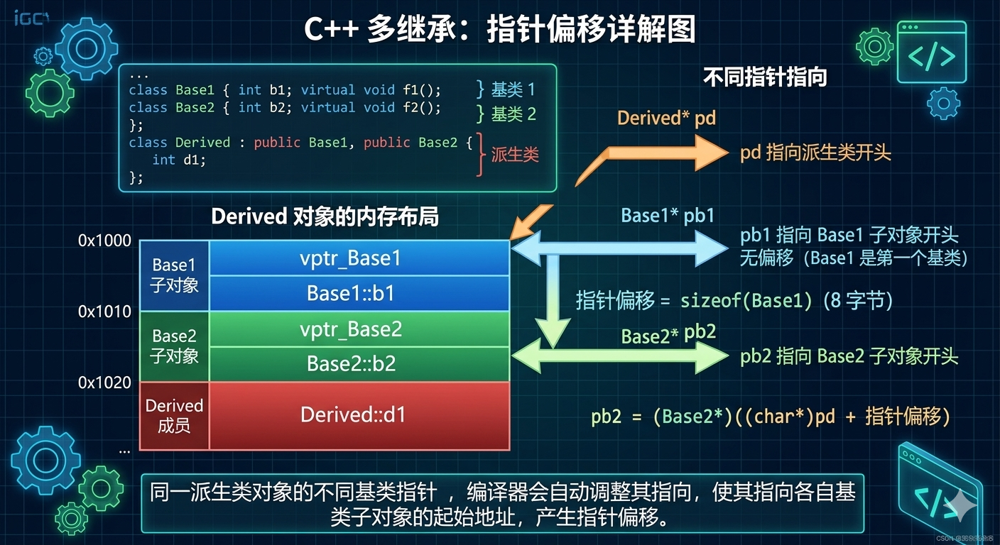

```c++
class Base1 { public: int _b1 = 1; };
class Base2 { public: int _b2 = 2; };
class Derive : public Base2, public Base1 { public: int _d = 3; };
int main()
{
	Derive d;
	Base1* p1 = &d;
	Base2* p2 = &d;
	Derive* p3 = &d;
	return 0;
}
```

类声明在前，在内存中也就先放，是从低地址指向高地址，所以：$p1 == p3 != p2$

> 如果此时先继承`base2`，那么在物理内存中也就先放`base2`，这道题答案也就变成了$p2 == p3 != p1$。
>
> 在多继承的世界里，**“谁在冒号后面排第一，谁就占领内存的最前端”**。这不仅决定了地址值，也决定了谁先被构造。

### 8.3 菱形继承

菱形继承是多继承的一种特例，因其逻辑结构形如菱形而得名（A -> B/C -> D）。

- **核心病灶：数据冗余与路径歧义**
	- 在非虚继承下，孙子类 D 的对象内部会含有**两份**祖先类 A 的成员。
	- 这不仅导致内存浪费，更严重的是**数据不一致性**：通过 B 路径修改了 A 的成员，通过 C 路径看到的 A 成员依然是旧值。
- **评价**：这是 C++ 继承设计中的“暗雷”，除非特殊场景，否则在工程中应极力避免。

### 8.4 虚继承

虚继承是 C++ 专门为解决菱形继承问题而设计的复杂机制——**解题思路**：将公共祖先类从子类中“抽离”出来，放在一个公共区域。

- **模型变革：引入 vbptr（虚基类表指针）**
	1. 子类对象中不再包含完整的祖先类，而是包含一个 **vbptr** 指针。
	2. 这个指针指向一张 **vbtable（虚基类表）**。
	3. 表中记录了当前位置到公共祖先类成员内存地址的**偏移量**。
- **最终效果**：无论经过多少条继承路径，公共祖先类在 D 对象中永远只占一份内存。

> 不要写菱形继承，会被喷死！！！

## 9. 继承 vs 组合

在 C++ 的架构设计中，**is-a**（继承）和 **has-a**（组合）是两种截然不同的“血缘”逻辑。如果不加区分地使用，代码很快就会变成一团难以维护的乱麻。

### 9.1 身份绑定 vs 工具占有

**is-a（继承）** 是一种**身份契约**。当你声明 `Student` 继承自 `Person` 时，你是在向编译器和世界宣告：“`Student` 从此背负了 `Person` 的所有特征。” 这种关系是**强耦合**的。子类无法挑选父类的遗产，哪怕父类里有一个它完全不需要的巨大数组，它也必须继承下来。这是一种“生而为人，身不由己”的沉重。

**has-a（组合）** 是一种**占有关系**。比如 `Car` 包含 `Engine`（汽车有引擎）。`Car` 并不是 `Engine`，它只是把 `Engine` 当作一个好用的工具箱放在自己家里。这种关系是**松耦合**的。`Car` 可以随时把这个 `Engine` 换成高性能版的，或者换成电池，而不需要改变 `Car` 自身的身份属性。这是一种“我虽然用你，但我依然是我”的洒脱。

### 9.2 白盒可见性 vs 黑盒保护

**is-a（继承）** 往往会破坏**封装性**，我们称之为“白盒复用”。作为子类，你通常能看到父类的 `protected` 成员，甚至能感受到父类实现的细节。这种“透明感”虽然方便了功能扩展，但也意味着如果父类的底层逻辑变了，子类可能会像多米诺骨牌一样连锁崩溃。

**has-a（组合）** 则是彻头彻尾的“黑盒复用”。`Car` 类完全不知道 `Engine` 内部是怎么点火的，它只能通过 `Engine` 提供的 `Start()` 接口来交互。这种隔离保护了内部细节，哪怕引擎从内燃机改成了电机，只要接口还是 `Start()`，汽车的代码一行都不用改。

### 9.3 多态的差异

这是两者最本质的区别。

**is-a** 拥有**向上转型（Upcasting）**的超能力。这意味着你可以把一个 `Student` 当作 `Person` 传给任何函数。由于虚函数（`virtual`）的存在，当这个 `Person` 说话时，它能发出 `Student` 的声音。这种“变色龙”般的动态切换是实现多态、构建可扩展框架（如你正在做的神经网络模型基类）的灵魂。

**has-a** 没有任何向上转型的能力。一个包含引擎的汽车，在任何时候都不能被当作引擎来使用。如果你需要根据不同的场景切换不同的引擎，你只能在 `Car` 内部通过指针手动切换不同的对象，这叫**委派（Delegation）**，虽然灵活，但无法在类型层面上享受多态带来的优雅。

### 9.4 使用选择

如果纠结怎么选，可以问自己一个问题：**“我需要把这个类当成另一个类来用吗？”**

- 如果答案是 **YES**（例如你的 `Mamba` 网络必须被当作一个通用的 `Module` 来进行训练），那就用 **is-a（继承）**。
- 如果答案是 **NO**，你只是想偷懒复用别人的功能（例如你的 `Module` 需要一个 `Timer` 来计时），那就用 **has-a（组合）**。

**工程界的共识是：** **“优先使用组合，慎用继承。”** 因为继承一旦写深了（超过 3 层），整个代码树就会变得极其脆弱且难以理解。

**优先使⽤组合，⽽不是继承**。实际尽量**多去⽤组合**，**组合的耦合度低**，**代码维护性好**。不过也不太那么绝对，**类之间的关系就适合继承(is-a)**那就⽤继承，另外**要实现多态，也必须要继承**。类之间的关系**既适合⽤继承(is-a)也适合组合(has-a)，就⽤组合**。

在软件工程和系统架构中，“耦合度”（Coupling）是衡量两个模块之间**依赖强弱**的指标。如果说继承和组合是构建代码的手段，那么“降低耦合度”就是所有设计模式的终极灵魂。耦合度可以用一句话概括：**“当一个地方的代码被修改或崩塌时，它会引起多少个其他地方发生地震。”**

耦合度不是单纯的“有没有连接”，而是“连接的方式有多深”。

- **高耦合（紧耦合）**：模块之间互为“连体婴儿”。你中有我，我中有你。如果你想把其中一个模块拆下来用到另一个项目里，你会发现由于它依赖了太多的环境，根本拆不动。
- **低耦合（松耦合）**：模块之间互为“乐高积木”。它们通过标准的接口连接。即便你把蓝色的积木换成红色的，只要接口凹槽一致，整个系统依然稳如泰山。

降低耦合度的黄金法则——**内聚性**。

- **高内聚**：一个类只做一件事，并且做得极其精简（例如：`Softmax` 类只管归一化）。
- **低耦合**：不同类之间通过极其窄的通道交互。

> **我的理解**：最好的代码结构就像**现代化的军队**。每个士兵（类）各司其职（高内聚），但他们之间通过无线电（接口）沟通，而不是手拉手冲锋。即便一个士兵受伤，也不会把整排人拽倒。
