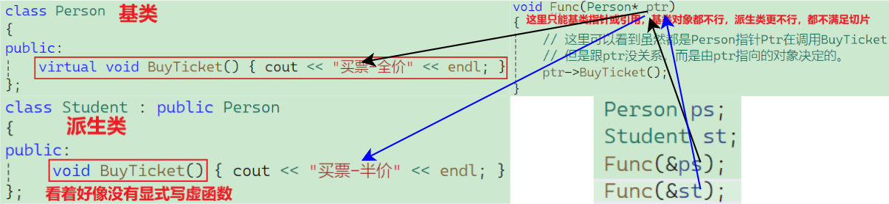
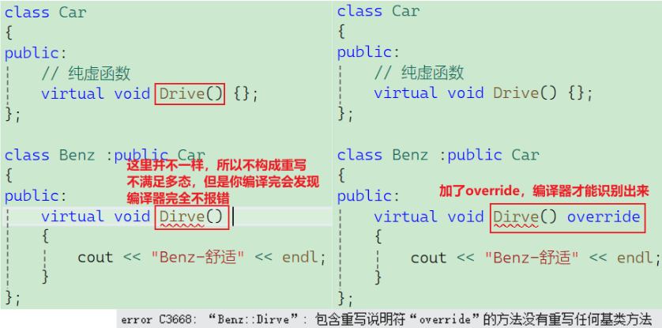
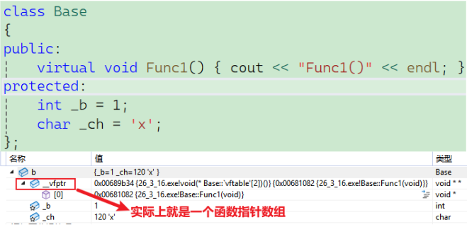
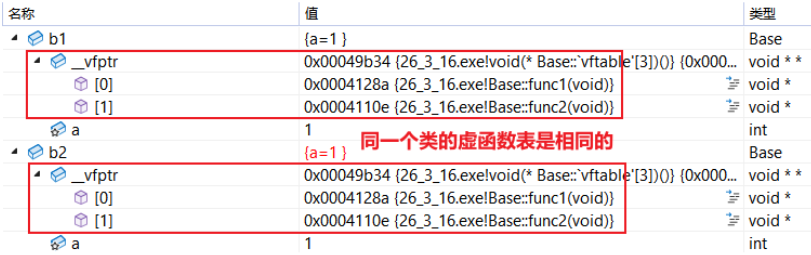
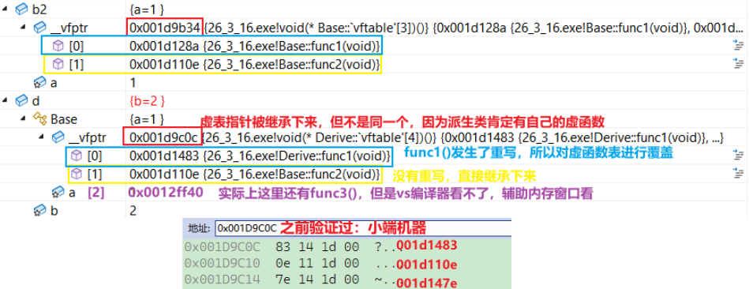
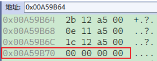
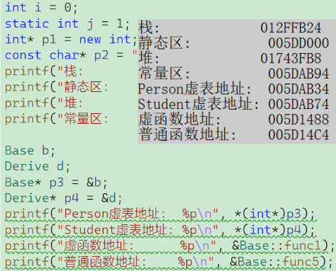
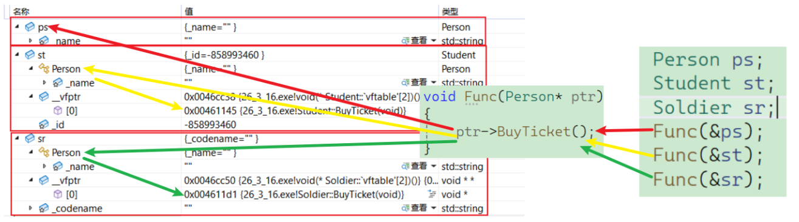
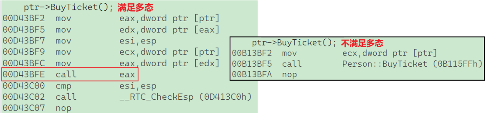

# 一、多态分类

在 C++ 中，多态的本质是“同一个接口，不同的实现”。根据**决定调用哪个函数的时机**，多态被严格划分为**静态多态**（编译时决定）和**动态多态**（运行时决定）。

## 1.1 静态多态

静态多态也称为**编译时多态**或**早绑定（Early Binding）**。意思是：编译器在**编译代码的阶段**，就已经明确知道到底该调用哪一段具体的函数代码了。它主要通过**函数重载（Overloading）**和**模板（Templates）**来实现。

- **函数重载**：同名函数，根据传入参数的类型和数量，编译器决定调用哪个版本。
- **模板（泛型编程）**：编写一份通用代码，编译器根据传入的具体类型，自动生成对应的专属代码。

- **优点（性能极高）**：因为在编译阶段就已经绑定了具体的函数地址，运行时**没有任何额外的性能开销**（不需要查表）。
- **缺点（灵活性低，代码膨胀）**：编译器会为每一种用到的类型都生成一份单独的代码，可能导致最终的可执行文件体积变大（代码膨胀）。此外，它无法在程序运行期间动态改变行为。

## 1.2 动态多态

动态多态也称为**运行时多态**或**晚绑定（Late Binding）**。意思是：编译器在编译时不知道到底要调用哪个函数，只有当**程序真正跑起来时**，根据对象的实际类型去动态查找并调用对应的函数。动态多态的实现必须同时满足三个条件：

1. **继承关系**：存在基类和派生类。
2. **虚函数重写**：基类声明 `virtual` 函数，派生类 `override` 重写它。
3. **多态调用**：必须通过**基类的指针或引用**来调用这个虚函数。

- **优点（极度灵活）**：完美支持面向对象的“开闭原则”。你可以预先写好框架（使用父类指针），未来如果有新的子类加入，框架代码一行都不用改，直接就能调用新子类的逻辑。非常适合做插件系统或复杂的业务架构。
- **缺点（性能开销）**：
	1. **内存开销**：每个包含虚函数的类都有一个**虚函数表**（**vtable**），每个对象实例都多一个**虚表指针**（**vptr**）。
	2. **时间开销**：调用虚函数时，需要“通过 **vptr** 找到 **vtable ->** 从 vtable **取出**函数地址 -> 跳转执行”，多了一次寻址操作，且会影响 CPU 的流水线预测（分支预测惩罚）。


## 1.3 核心对比

| **对比维度** | **静态多态 (Static Polymorphism)**      | **动态多态 (Dynamic Polymorphism)**                          |
| ------------ | --------------------------------------- | ------------------------------------------------------------ |
| **绑定时机** | 编译时 (Compile-time)                   | 运行时 (Run-time)                                            |
| **绑定机制** | 早绑定 (Early Binding)                  | 晚绑定 (Late Binding)                                        |
| **实现手段** | 函数重载、模板                          | 继承、虚函数 (virtual)、父类指针/引用                        |
| **运行性能** | **极高**（直接调用函数地址，无开销）    | **略低**（需要通过 vptr 查询虚函数表）                       |
| **内存占用** | 易产生代码膨胀 (Code Bloat)             | 对象带有 vptr，类带有 vtable                                 |
| **灵活性**   | 较低（运行时不能改变对象的行为）        | **极高**（支持运行时基于对象类型动态切换逻辑）               |
| **适用场景** | 追求极致性能的底层库、泛型算法 (如 STL) | 业务逻辑多变、需要高度解耦的系统架构 (如 UI 框架、游戏引擎对象) |

# 二、多态实现

## 2.1 必须存在继承关系

多态的基础是“不同的子类表现出不同的形态”。因此，必须有一个基类（父类）和至少一个派生类（子类）。继承关系建立了一种 **“is-a”** 的逻辑，例如：“猫是一种动物”。

- **作用**：让不同类型的事物拥有统一的分类，从而可以使用统一的类型（基类）来接收它们。

## 2.2 必须有虚函数的重写

仅仅有继承是不够的。基类中想要表现出多态特性的函数，必须被声明为 **`virtual`（虚函数）**。同时，派生类必须**重写（Override）**这个虚函数。

- **重写的要求**：派生类中的函数名称、参数列表、返回值类型（协变返回类型除外）必须与基类中的虚函数**完全一致**。
- **作用**：`virtual` 关键字是在告诉编译器：“这个函数的具体实现可能会在子类中改变，请在运行时再去查表找真正的函数地址，不要现在就绑定。”




> *要实现多态效果*
>
> *第⼀必须是基类的指针或引⽤，因为只有基类的指针或引⽤才能既指向基类对象⼜指向派⽣类对象；*
>
> *第⼆派⽣类必须对基类的虚函数完成重写/覆盖，重写或者覆盖了，基类和派⽣类之间才能有不同的函数，多态的不同形态效果才能达到。*

虚函数的重写/覆盖：**派生类中有一个跟基类完全相同的虚函数**（即派生类虚函数与基类虚函数的**返回值类型、函数名字、参数列表完全相同**），称派生类的虚函数重写了基类的虚函数。

> 这里的参数列表相同指的是参数类型相同就行，但是如果有缺省参数呢？（为什么派生类不写`vitual`也能构成重写呢？这时候派生类虚函数可以理解为编译器是用基类的函数声明加派生类的函数体组合来的，下面这道题看看）

**注意**：在重写基类虚函数时，派生类的虚函数在不加`virtual`关键字时，虽然**也可以构成重写**（**因为继承后基类的虚函数被继承下来了在派生类依旧保持虚函数属性**），但是该种写法不是很规范，**不建议这样使用**，不过在考试选择题中，经常会故意埋这个坑，让你判断是否构成多态。

> 只要基类把一个函数声明为 `virtual`，这个属性就像基因一样，会顺着继承链一直遗传下去。这时候，编译器会非常聪明地“推断”出：你这是在做多态的**重写（Override）**。于是，即便你在派生类没写 `virtual`，编译器也会**隐式地**把派生类的 `speak()` 当作虚函数来处理，并自动更新派生类的虚函数表（`vtable`）。

**一个坑题：**

```c++
class A
{
public:
	virtual void func(int val = 1) { std::cout << "A->" << val << std::endl; }
	virtual void test() { func(); }
};
class B : public A
{
public:
	void func(int val = 0) { std::cout << "B->" << val << std::endl; }
};
int main(int argc, char* argv[])
{
	B* p = new B;
	p->test();
	return 0;
}
```

正确答案是 **B: B->1**。

第一步：调用 `test()`——代码中 `B* p = new B;` 创建了一个子类 B 的对象。接着执行 `p->test();`。因为子类 B 并没有重写 `test()` 方法，所以这里顺着继承链，调用的是父类 A 的 `A::test()`。

第二步：分析 `A::test()` 内部的 `this` 指针——进入 `A::test()` 的作用域后，内部执行了 `func();`。这行代码的完整形态其实是 `this->func();`。

这里的关键点在于：因为我们正处于类 A 的成员函数中，所以在编译器的视角里，不管 B 调用还是 A 调用，**这个 `this` 指针的静态类型是 `A*`**（尽管它在运行时实际指向的是一块 B 对象的内存）。

第三步：多态触发（决定执行哪段代码）——`func()` 是一个 `virtual` 虚函数。当通过指针（这里的 `this`）调用虚函数时，会触发**动态多态**。程序在运行时会去查虚函数表（vtable），发现这个对象实际上是个 `B` 对象。因此，**最终执行的是子类 `B::func()` 的代码逻辑**。这就是为什么输出的前半段会打印出 `B->`。

第四步：默认参数替换（决定传入什么值）——这是整道题最大的陷阱：**在 C++ 中，虚函数的调用是动态绑定的，但虚函数的“默认参数”却是静态绑定（编译期决定）的，（派生类虚函数可以理解为编译器是用基类的函数声明加派生类的重写组合来的，重写的本质就是重写虚函数的实现，所以派生类的虚函数可以不加`vitual`）**。默认参数的值，完全取决于调用该函数时所使用的指针或引用的**静态类型**。

回到第二步，我们明确了在此处上下文中 `this` 的静态类型是 `A*`。因此，在编译阶段，编译器会直接去类 A 中寻找 `func` 的默认参数，发现是 `val = 1`，并把它硬编码填了进去。

代码在运行时发生了极其“缝合”的一幕：

1. **函数主体**走了动态绑定，定位到了 `B::func`。
2. **默认参数**走了静态绑定，拿到了 `A::func` 里的 `1`。

合在一起，相当于执行了 `B::func(1)`，最终在控制台输出：`B->1`。

> 在 C++ 经典著作《Effective C++》中，条款 37 明确警告过：**绝不重新定义继承而来的缺省参数值**。这道题完美展示了如果违反这条铁律，会产生多么反直觉且难以排查的 Bug。

如果改成`p->func()`呢？答案是**B->0**

关于 `p->test()`：这其实是普通的继承——在 `main` 中，`p` 的指针类型是 `B*`，它指向一个 `B` 对象。当你调用 `p->test()` 时，因为子类 `B` 根本没有重写 `test()` 虚函数，所以它只能顺着继承链，去执行父类 `A::test()` 的代码。这里并没有发生“同名函数重写后的动态决议”，所以它更多体现的是**继承机制**。

`test()` 内部的 `this->func()`（真正的多态案发现场）——当我们进入 `A::test()` 的代码块时，里面调用了 `func()`，这段代码的完整形态是 `this->func()`。

- **指针的静态类型（编译期）**：因为这行代码写在类 `A` 的成员函数里，所以编译器认定 `this` 指针的类型是 `A*`。编译器根据 `A*` 去找默认参数，强行把参数写死为 `1`。

- **对象的动态类型（运行期）**：这个 `this` 指针实际绑定的，是我们在 `main` 里 `new` 出来的那个 `B` 对象。

- **多态完美触发**：这里存在“父类指针（`A*`）调用虚函数，且指向子类对象（`B`）”，完全满足多态条件！所以运行时查虚表，执行了子类的 `B::func` 的逻辑。

	**结果**：父类的默认参数 `1` + 子类的函数体 `B::func` = `B->1`。

假设直接在 main 里调 `p->func()` 会怎样？——输出结果会变成正常的 **`B->0`**。

- **静态类型**：`p` 声明的是 `B*`，编译器一看，类 `B` 里的 `func` 默认参数是 `0`，于是把参数定为 `0`。
- **动态类型**：`p` 指向 `B` 对象，运行时查表，执行 `B::func()` 的逻辑。

在这种情况下，指针的静态类型（`B*`）和实际指向的动态对象类型（`B`）**完全一致**。所以默认参数和实际执行的函数逻辑完美匹配，没有构成父子类之间的冲突。

**总结来说**：要想展现出多态那种“根据实际对象动态变化”的特性（或者说陷阱），**必须用父类的指针去调用子类重写的方法**。在 `test()` 内部的 `this->func()` 做到了这一点，而直接写 `p->func()` 因为 `p` 本身已经是子类指针，所以没有展现出这种反差。

#### 2.2.1 虚函数重写的协变

在 C++ 的动态多态中，派生类重写（Override）基类虚函数时，函数签名（名字、参数列表、返回值类型）必须完全一致。但是，**“协变返回类型”是 C++ 允许的唯一一个关于返回值类型的特例。**

协变——简单来说，**当基类的虚函数返回一个基类的指针或引用时，派生类重写该虚函数，可以返回一个派生类的指针或引用。**—— 这种返回值类型随着类的派生而向下改变的机制，就叫协变。

**构成协变的严格条件：**

1. **必须是引用或指针**：返回值不能是对象按值传递（不能返回 `Base` 和 `Derived`，必须是 `Base*`/`Base&` 和 `Derived*`/`Derived&`）。
2. **存在继承关系**：派生类返回的指针/引用类型，必须是基类返回的指针/引用类型的派生类。

```c++
class A {};
class B : public A {};
// 协变
class Person 
{
public:
	virtual A* BuyTicket()
	{
		cout << "买票-全价" << endl;
		return nullptr;
	}
};

class Student : public Person 
{
public:
	virtual B* BuyTicket()
	{
		cout << "买票-打折" << endl;
		return nullptr;
	}
};

void Func(Person* ptr){ ptr->BuyTicket(); }
int main()
{
	Person ps;
	Student st;
	Func(&ps);
	Func(&st);
	return 0;
}
```

#### 2.2.2 析构函数的重写

为了支持多态，编译器会**把所有类的析构函数在内部统一重命名（通常命名为类似 `destructor()` 的名字）**。因此，只要基类的析构函数加了 `virtual` 关键字，派生类的析构函数就会自动与它构成重写。

在动态多态中，我们经常使用**基类指针去指向派生类对象**。当我们使用 `delete` 释放这个基类指针时，如果基类的析构函数不是虚函数（没有发生重写），就会引发灾难。普通虚函数被重写后，只要调用了派生类的版本，基类的版本就不管了。**但析构函数完全不同！**基类析构函数执行完之后，**紧接着又自动执行了 派生类析构**。

- **机制**：当派生类的析构函数执行完毕后，编译器会自动插入代码去调用基类的析构函数。
- **原因**：派生类对象不仅包含了派生类自己新增的成员，还包含了从基类继承来的成员。派生类的析构函数只负责清理它自己的那部分，清理完之后，必须让基类的析构函数把基类的那部分也清理干净，这是一个**自下而上的拆解过程**。

关于虚析构函数，在 C++ 领域有一条绝对的原则（来自《Effective C++》条款 07）：

> **如果一个类被设计用来作为基类（即它包含至少一个虚函数），那么它的析构函数就必须是虚函数。**
>
> 如果一个类不包含任何虚函数（说明它不打算作为基类被多态使用），就不应该将其析构函数声明为虚函数（因为虚函数表会无端增加对象的内存开销）。

一个场景：

```c++
class A{
public:
	virtual ~A() { cout << "~A()" << endl; }
};

class B : public A {
public:
	~B()
	{
		cout << "~B()->delete:" << _p << endl;
		delete _p;
	}
protected:
	int* _p = new int[10];
};

int main()
{
	A* p1 = new A;
	A* p2 = new B;
	// 析构底层顺序：p1->destructor() + operator delete 
	delete p1;
	delete p2;
	return 0;
}
```

在 `main` 函数中，`p2` 的静态类型是 `A*`（基类指针），但它在运行时实际指向的是 `new B`（派生类对象）。当执行 `delete p2;` 时，由于基类 `A` 的析构函数被声明为了 `virtual`，编译器会触发**动态绑定**，执行以下完美流程：

1. **查表定位（多态生效）**：编译器发现 `~A()` 是虚函数，于是通过 `p2` 指向对象的虚函数表指针（vptr），找到了真实对象 `B` 的析构函数 `~B()`。
2. **执行派生类析构**：调用 `~B()`。此时控制台输出 `~B()->delete: ...`，并且**最关键的一步发生了**——`delete[] _p;` 被执行（注意：你代码里是 `delete _p;`，对于数组最好用 `delete[] _p;`，不过对于基础类型 `int` 不会引发严重崩溃，只是习惯问题）。子类在堆区申请的 10 个 `int` 的内存被成功释放。
3. **自动向上调用基类析构**：`B` 的析构函数执行完毕后，编译器会自动安插代码，顺着继承链向上调用基类 `A` 的析构函数 `~A()`。控制台输出 `~A()`。
4. **释放对象外壳**：最后，调用 `operator delete`，把 `p2` 指向的这块 `B` 对象的内存本身还给操作系统。

如果去掉 `virtual` 会引发什么灾难？——把 `class A` 里的 `virtual ~A()` 改成普通的 `~A()`，`delete p2;` 的执行流就会变成**静态绑定**：

1. 编译器只看指针类型，认定 `p2` 是 `A*`。
2. 直接调用 `A::~A()`，输出 `~A()`。
3. 释放对象外壳。

**灾难结果：**

派生类的析构函数 `~B()` **被完全跳过了！这意味着 `_p` 所指向的那 10 个 `int` 的堆内存（40 字节）永远不会被释放，成为了游离在程序控制之外的“幽灵内存”。在长期运行的服务器程序中，这种内存泄漏**会慢慢吃光机器的所有内存，导致程序崩溃。

**只要一个类可能被其他类继承，且可能通过基类指针去操作（释放）派生类对象，它的析构函数就必须是 `virtual` 的。**

#### 2.2.3 `override`和`final`

 C++11 标准中引入的两个关键字

在没有 `override` 的时代，重写虚函数是一件“如履薄冰”的事情。因为只要你手滑打错一个字母，或者参数类型少写了一个 `const`，编译器**不会报错**，而是会默默地在派生类里创建一个**全新的隐藏函数**。多态就这样在不知不觉中悄悄失效了。

`override` 的核心作用就是：**强制编译器替你检查函数签名，确保你真的重写了基类的虚函数。**



如果说 `override` 是为了确保连接成功，那么 `final` 就是为了**彻底切断连接**。它有两个截然不同的应用场景：修饰虚函数，以及修饰整个类。

**修饰虚函数**——当你在某个派生类中实现了一个虚函数，并且认为这个实现已经是“最终版本”，不希望更底层的子类再去修改它的逻辑时，可以在函数末尾加上 `final`。

```C++
class Animal {
public:
    virtual void makeNoise() { cout << "动物叫" << endl; }
};
class Dog : public Animal {
public:
    // Dog 重写了该函数，并宣告这是最终版本
    void makeNoise() override final {  cout << "汪汪汪！" << endl;  }
};
class ShibaInu : public Dog {
public:
    // 编译报错！因为 Dog::makeNoise 已经被标记为 final，柴犬类无法再重写它。
    // void makeNoise() override { cout << "嘤嘤嘤！" << endl; }
};
```

**修饰整个类**——如果你设计了一个极其底层、或者涉及到内存安全、或者是类似于工具类的 Class，不希望任何人通过继承它来魔改其行为，可以直接在类名后面加 `final`。

```C++
// String 类被标记为 final，彻底封死继承之路
class String final {
    // ... 核心字符串操作逻辑
};
// 编译直接报错！无法从 final 类继承
// class MyString : public String { };
```

| **关键字**     | **作用目标**     | **核心功能**                                       | **解决的痛点**                                               |
| -------------- | ---------------- | -------------------------------------------------- | ------------------------------------------------------------ |
| **`override`** | 派生类的虚函数   | 强制编译器检查是否成功重写了基类的虚函数。         | 杜绝因拼写错误、参数不匹配导致的“意外隐藏（Shadowing）”Bug。 |
| **`final`**    | 虚函数 或 类本身 | 终止继承链：修饰函数则禁止重写；修饰类则禁止继承。 | 防止核心业务逻辑被子类恶意或无意篡改，明确架构设计边界。     |

> `final` 关键字不仅是设计层面上的约束，它还能带来**性能优化**。当编译器看到 `final` 时，它知道这个函数/类绝对不会再有子类了，因此在调用该函数时，编译器可以直接进行**去虚化（Devirtualization）**，也就是把原本需要在运行时查虚函数的动态调用，直接优化成类似静态绑定的直接跳转，从而省去了查表的开销。

## 2.3 必须通过基类的指针或引用来调用

这是最容易出错的一个条件。**绝对不能通过对象的值传递**来实现多态，必须使用指向基类的**指针 (`Base*`)** 或者**引用 (`Base&`)**，去指向或绑定一个派生类的对象，然后通过这个指针/引用去调用虚函数。

- **为什么不能传值？** 如果通过传值（按值拷贝）将子类对象赋给父类对象，会发生**“对象切片”（Object Slicing）**。子类特有的部分会被“切掉”，只剩下父类的部分，编译器会直接调用父类的函数，多态彻底失效。
- **作用**：指针或引用只是一个“地址标签”。基类指针指向子类对象时，它能通过该对象内部隐藏的**虚函数表指针（vptr）**，正确找到子类自己的虚函数表（vtable）。

## 2.4 重载、重写 / 覆盖、隐藏

重载发生在**同一个作用域**（比如同一个类中，或者同一个命名空间中）。它允许你使用相同的函数名，只要这些函数的**参数列表不同**即可。

- **核心条件**：
	1. 必须在**同一个作用域**内。
	2. 函数名**必须相同**。
	3. 参数列表**必须不同**（参数个数、类型或顺序不同）。
	4. 与 `virtual` 关键字无关。
	5. 返回值类型不能作为重载的区分依据。
- **绑定机制**：静态绑定（编译时决议）。

```c++
class Printer 
{
public:
    // 以下三个函数构成重载 (发生在同一个类 Printer 中)
    void print(int i) { cout << "打印整数: " << i << endl; }
    void print(double d) { cout << "打印浮点数: " << d << endl; }
    void print(string s) { cout << "打印字符串: " << s << endl; }
};
```

重写（覆盖）发生在**父类与子类之间**。它是子类重新定义父类中有 `virtual` 关键字的函数，目的是为了实现动态多态。

- **核心条件**：
	1. 分别位于**基类和派生类**中（不同的作用域）。
	2. 函数名**必须相同**。
	3. 参数列表**必须完全相同**。
	4. 返回值类型**必须相同**（或满足协变规则）。
	5. 基类的函数**必须有 `virtual` 关键字**。
- **绑定机制**：动态绑定（运行时通过查虚函数表决议）。

```c++
class Base 
{
public:
    virtual void show(int x) { cout << "Base show: " << x << endl; }
};

class Derived : public Base 
{
public:
    // 构成重写（覆盖），完全替换了父类在虚表中的函数地址
    void show(int x) override { cout << "Derived show: " << x << endl; } 
};
```

隐藏同样发生在**父类与子类之间**。它指的是派生类的函数屏蔽了基类的同名函数。在 C++ 的名字查找机制中，**编译器一旦在当前作用域（子类）找到了名字匹配的函数，就会停止向外层作用域（父类）查找**。这就导致了父类的同名函数被“隐藏”了。

- **核心条件（满足其一即构成隐藏）**：
	- **情况 A（参数不同）**：只要函数名相同，但**参数列表不同**，无论基类有没有 `virtual` 关键字，基类的函数都会被隐藏。（注意：这不叫重载，因为重载必须在同一个作用域）。
	- **情况 B（没加 virtual）**：函数名相同，参数列表也相同，但是基类函数**没有 `virtual` 关键字**。此时基类函数被隐藏。（如果有 `virtual`，那就是重写了）。
- **绑定机制**：静态绑定（编译时决议，取决于指针或引用的静态类型）。

```C++
class Base {
public:
    virtual void func1(int x) { cout << "Base func1" << endl; }
    void func2(int x) { cout << "Base func2" << endl; }
};

class Derived : public Base {
public:
    // 隐藏情况 A：名字相同，参数不同（即使父类有 virtual，也构成隐藏）
    void func1(double x) { cout << "Derived func1 (隐藏了父类的 func1)" << endl; }

    // 隐藏情况 B：名字相同，参数相同，但父类没有 virtual
    void func2(int x) { cout << "Derived func2 (隐藏了父类的 func2)" << endl; }
};

// 调用测试
Derived d;
d.func1(10); // 编译报错或警告！父类的 func1(int) 被隐藏了，编译器只能看到 func1(double)
d.Base::func1(10); // 必须显式指明作用域才能调用被隐藏的父类函数
```

为了方便记忆，可以通过这张表快速区分：

| **机制**                 | **作用域**       | **函数名** | **参数列表**                      | **基类是否需要 virtual**              | **多态性**         |
| ------------------------ | ---------------- | ---------- | --------------------------------- | ------------------------------------- | ------------------ |
| **重载 (Overload)**      | **同一个作用域** | 相同       | **必须不同**                      | 无关                                  | 静态（编译时）     |
| **重写/覆盖 (Override)** | **基类与派生类** | 相同       | **必须完全相同**                  | **必须有**                            | **动态（运行时）** |
| **隐藏 (Hide)**          | **基类与派生类** | 相同       | 不同则必然隐藏 相同则看 `virtual` | （若参数相同，无 `virtual` 即为隐藏） | 静态（无多态）     |

# 三、纯虚函数与抽象类

在 C++ 中，**纯虚函数（Pure Virtual Function）** 和 **抽象类（Abstract Class）** 是用来定义“接口”和“强制契约”的核心机制。

如果说普通的虚函数是基类给子类提供的一个“默认选项”（你可以用我的，也可以自己重写），那么纯虚函数就是基类给子类下达的**“强制命令”**（你必须自己实现，我这里没有默认逻辑）。

## 3.1 纯虚函数

纯虚函数是一种特殊的虚函数，它在基类中只声明，不提供具体的实现逻辑（通常情况下），并且在声明的末尾加上 `= 0`。

- **语法格式**：`virtual 返回值类型 函数名(参数列表) = 0;`
- **核心含义**：它告诉编译器：“这个函数我只定义了它的输入输出规范，具体的业务逻辑我不知道，**任何继承我的子类都必须自己去实现它**。”

## 3.2 抽象类

**只要一个类中包含了至少一个纯虚函数，这个类就自动成为了“抽象类”。**抽象类在 C++ 中有着极其严格的语法限制和鲜明的设计目的：

1. **绝对禁止实例化**：你不能创建抽象类的对象（不能在栈上声明，也不能 `new`）。因为它内部有未实现的函数，如果允许创建对象并调用那个纯虚函数，程序就崩溃了。
2. **作为指针或引用使用**：虽然不能实例化，但你可以声明抽象类的**指针或引用**，用来指向实现了这些纯虚函数的具体派生类对象（这就是多态的核心用法）。
3. **强制子类“还债”**：派生类继承了抽象类后，**必须重写（实现）基类中所有的纯虚函数**。哪怕漏掉了一个，这个派生类也会连带着变成抽象类，同样无法实例化。

## 3.3 代码示例

假设我们正在开发一个用于行为识别（Activity Recognition）的深度学习推理框架。不同的模型提取特征的方式完全不同，我们需要定义一个统一的模型接口。

```C++
// 抽象类（接口） 
class ActivityModel 
{
public:
    // 纯虚函数：强制所有继承的子类必须实现具体的特征提取逻辑
    virtual void extractFeatures() = 0; 
    // 普通虚函数：提供一个默认实现，子类可选重写
    virtual void preprocess() { cout << "执行基础数据清洗和归一化..." << endl; }
    // 极其重要：作为多态基类，析构函数必须是虚函数！
    virtual ~ActivityModel() { cout << "~ActivityModel() 析构" << endl; }
};
// 派生类 A
class MambaModel : public ActivityModel 
{
public:
    // 必须重写纯虚函数，否则 MambaModel 也会变成抽象类，无法创建对象
    void extractFeatures() override { cout << "使用 Mamba 网络提取时序状态空间特征..." << endl; }
};
// 派生类 B
class ConvNeXtModel : public ActivityModel 
{
public:
    void extractFeatures() override { cout << "使用 ConvNeXt V2 提取空间视觉特征..." << endl; }
};
int main() 
{
    // 编译报错 ActivityModel 是抽象类，不能实例化，不能new
    // ActivityModel baseModel; 
    // ActivityModel* p = new ActivityModel();
    
    // 使用基类指针指向具体的派生类对象
    ActivityModel* model1 = new MambaModel();
    ActivityModel* model2 = new ConvNeXtModel();
    // 触发多态，执行各自具体的特征提取逻辑
    model1->extractFeatures(); 
    model2->extractFeatures();
    delete model1;
    delete model2;
    return 0;
}
```

## 3.4 抽象类 vs 普通基类

在进行架构设计时，选择把一个类设计成普通基类还是抽象类，取决于你的**业务逻辑**：

| **维度**     | **普通基类 (包含普通虚函数)**                  | **抽象类 (包含纯虚函数)**                                    |
| ------------ | ---------------------------------------------- | ------------------------------------------------------------ |
| **概念定位** | 它本身是一个可以存在的实体。例如 `class 人`。  | 它只是一个概念或标准，无法独立存在。例如 `class 形状`、`class 飞行物`。 |
| **实例化**   | 可以直接创建对象 (`new Base()`)。              | **严禁创建对象**，编译直接拦截。                             |
| **子类约束** | 子类可以重写，也可以直接偷懒用父类的默认逻辑。 | 子类**必须**自己写一份实现，没有任何退路（除非它也不想被实例化）。 |
| **设计意义** | 代码复用为主，多态为辅。                       | **定义接口标准**，强制架构规范，实现极致解耦。               |

> **深入思考**：纯虚函数虽然等于 0，但 C++ 其实是**允许你为纯虚函数提供函数体的**。但这极少使用，通常只用于给子类提供一种“必须显式调用的保底逻辑”。

# 四、多态原理

## 4.1 虚表

### 4.1.1 虚函数表（Virtual Table，vtable）

可以把虚函数表理解为**类的一张“专属地图”**，它指明了针对这个类，各个虚函数到底该去哪里找。

- **它是什么**：本质上，它是一个**函数指针数组**。数组里的每一个元素，都是一个指向该类虚函数具体实现的内存地址。
- **它属于谁**：vtable 属于**类（Class）**，而不属于某个具体的对象实例。也就是说，无论你用这个类 `new` 出了 1 个对象还是 1000 个对象，内存中**永远只有这一张**属于该类的虚函数表。但是每个类都有单独的虚函数表
- **生成时机**：在**编译阶段**，编译器就会为每一个包含了至少一个 `virtual` 函数的类，静态生成这张表。
- **存储位置**：通常存储在可执行文件的**只读数据段**中，因为在程序运行期间，这张表的内容是不允许被修改的。



> 如果一个类有虚函数，就会有一个虚函数表。如果有多个虚函数，虚函数表中就会有多个元素（函数指针），但虚函数表本身只有一个，每个对象也只有一个虚函数表指针指向它。懒了，不想截图了。

```c++
class Base {
public:
	virtual void func1() { cout << "Base::func1" << endl; }
	virtual void func2() { cout << "Base::func2" << endl; }
	void func5() { cout << "Base::func5" << endl; }
protected:
	int a = 1;
};

class Derive : public Base
{
public:
	// 重写基类的func1
	virtual void func1() { cout << "Derive::func1" << endl; }
	virtual void func3() { cout << "Derive::func1" << endl; }
	void func4() { cout << "Derive::func4" << endl; }

protected:
	int b = 2;
};
```


- 基类对象的虚函数表中存放基类所有虚函数的地址。**同类型的对象共用同一张虚表**，**不同类型的对象各自有独立的虚表**，所以基类和派生类有各自独立的虚表。

	- 

- 派生类由两部分构成，继承下来的基类和自己的成员，一般情况下，**继承下来的基类中有虚函数表指针，自己就不会再生成虚函数表指针**。但是要注意的这里**继承下来的基类部分虚函数表指针和基类对象的虚函数表指针不是同一个**，就像基类对象的成员和派生类对象中的基类对象成员也是独立的。

- **派生类中重写了基类的虚函数**，**派生类的虚函数表中对应的虚函数就会被覆盖成派生类重写的虚函数地址**。

- 派生类的虚函数表中包含：**基类的虚函数地址**、**派生类重写的虚函数地址（完成覆盖）**、**派生类自己的虚函数地址**这三个部分。
  - 
  - 那个`0x12ff40`是我捏的，下面这个通过内存窗口看的，下面这个大概率就是真实的(几乎90%可以确定就是虚函数表的`func3()`地址)。

- 虚函数表本质是一个存储虚函数指针的指针数组，一般情况这个数组最后面放了一个`0x00000000`标记。（这个C++并没有进行规定，各个编译器自行定义的，VS系列编译器会在后面放个`0x00000000`标记，g++系列编译器不会放）

	- 

	- 类似字符串结尾的`'\0'`，作为一个结束标识，只是vs这么搞了。

- 虚函数存在哪的？**虚函数和普通函数一样的**，编译好后是一段指令，**都是存在代码段的**，**只是虚函数的地址又存到了虚表中**。

- 虚函数表存在的吗？这个问题严格说并没有标准答案，**C++标准并没有规定**，我们写下面的**代码可以对比验证一下**。**VS下是存在代码段（常量区）**。

```c++
int i = 0;
static int j = 1;
int* p1 = new int;
const char* p2 = "xxxxxxxx";
printf("栈:             %p\n", &i);
printf("静态区:          %p\n", &j);
printf("堆:             %p\n", p1);
printf("常量区:          %p\n", p2);

Base b;
Derive d;
Base* p3 = &b;
Derive* p4 = &d;
printf("Person虚表地址:  %p\n", *(int*)p3);
printf("Student虚表地址: %p\n", *(int*)p4);
printf("虚函数地址:      %p\n", &Base::func1);
printf("普通函数地址:    %p\n", &Base::func5);
```

在包含虚函数的对象内存中，**最开始的位置（偏移量为 0 的地方）存放的就是虚表指针（`vptr`）**。 也就是说，对象首地址所在的那块内存，里面装的数据就是虚函数表的地址。

拿到对象首地址——`p3` 是一个 `Base*` 类型的指针，它里面存放的是对象 `b` 的起始内存地址（比如 `0x00AABBCC`）。

`(int*)p3`——在 C++ 中，指针的类型决定了“你一次能读取多少个字节”。 因为我们知道，在 32 位系统中，指针本身占 4 个字节。所以为了刚好把这前 4 个字节里的 `vptr` 完整读出来，我们把原本指向一整个对象的 `Base*` 指针，**强制转换成了 `int*` 指针**。 这相当于告诉编译器：“别管这块内存里装的是什么复杂的对象了，把它当成一个普通的 `int` 来看待，等会儿只给我读 4 个字节！”

`*(int*)p3`——最前面的 `*` 号是**解引用操作符**。 它顺着刚才那个 `int*` 指针，去对象最开始的 4 个字节内存里，把里面的数据读了出来。 读出来的数据是什么？正是**虚表指针（`vptr`）的值**！ 而虚表指针的值，就等于**虚函数表（vtable）的首地址**。

最后，通过 `printf("%p", ...)` 将这个读出来的整数值以十六进制地址



以下是以 `Person` 虚表地址（`0x005DAB34`）为基准，计算各大内存区域与之距离的详细对比表：

| **内存区域**            | **实际运行地址** | **与 Person 虚表的差值 (Hex)** | **与 Person 虚表的差值 (十进制)** | **相对距离评估**       |
| ----------------------- | ---------------- | ------------------------------ | --------------------------------- | ---------------------- |
| **常量区 (只读数据)**   | `0x005DAB94`     | `0x60`                         | **96 字节**                       | **极近（紧挨着）**     |
| **静态区 (全局数据)**   | `0x005DD000`     | `0x24CC`                       | 9,420 字节                        | 较远                   |
| **栈区 (局部变量)**     | `0x012FFB24`     | `0xD24FF0`                     | 约 13.7 MB                        | 极远（完全不在一个段） |
| **堆区 (动态分配内存)** | `0x01743FB8`     | `0x1169484`                    | 约 18.2 MB                        |                        |

通过计算差值可以极其清晰地看到，**Person 虚表和 Student 虚表与常量区（存放只读字符串 `"xxxxxxxx"` 的地方）的地址距离仅仅只有几十个字节！** 它们不仅处于同一个内存大段（都在 `005DAB..` 范围内），而且紧紧挨在一起。因此，在vs编译器的结论是：**C++ 中的虚函数表（vtable）存放在常量区（常量数据段 / `.rodata` 段）。**

> **生命周期全局性**：虚表属于“类”本身，而不是某一个具体的对象。只要程序在运行，这个类对应的虚表就必须存在，所以它不能放在栈上或堆上。
>
> **绝对的安全与只读**：虚表里存放的是函数指针，决定了多态的走向。如果在运行期间，某个越界指针或者恶意代码修改了虚表里的地址，整个程序的逻辑就会彻底崩塌（这也是黑客进行漏洞利用的经典手段之一）。将其放在常量区（操作系统的只读内存页），可以在硬件级别获得内存保护（一旦尝试写入就会触发段错误 `Segmentation Fault`）。


### 4.1.2 虚函数表指针（Virtual Pointer，vptr）

如果说 vtable 是地图，那么虚表指针就是**对象手里的“指南针”**，它负责在运行时告诉对象：“去看哪一张地图”。

- **它是什么**：它是一个隐藏的指针变量（在 64 位系统下占 8 个字节）。
- **它属于谁**：vptr 属于**具体的对象实例（Object）**。当你实例化一个包含虚函数的对象时，编译器会在该对象内存布局的最前端（通常是起始位置，偏移量为 0），偷偷塞入这个指针。
- **生成时机**：在**运行阶段**。当对象的**构造函数**被调用时，编译器安插的隐藏代码会把该对象的 vptr 初始化，使其指向当前类所属的 vtable。

### 4.1.3 二者如何协同



在图的右侧绿色代码块中，有：

- **三个不同的对象**：`ps`（Person 父类）、`st`（Student 子类）、`sr`（Soldier 子类）。
- **一个统一的调用接口**：`void Func(Person* ptr)`。不管传入什么对象，最终都会执行 `ptr->BuyTicket();` 这行一模一样的代码。

问题来了：编译器看到 `ptr->BuyTicket();` 时，它其实不知道 `ptr` 到底指向谁。它是怎么在运行时做到“见人下菜碟”的？秘密全在左侧的内存监视窗口里。

当执行 `Func(&st);` 时（跟着**黄色箭头**走）：

1. **传入对象地址**：`ptr` 指针现在拿到了对象 `st` 的内存地址。
2. **寻找虚表指针（`__vfptr`）**：程序通过 `ptr` 访问对象 `st` 的内存。如左图 `st` 的展开项所示，在 `st` 继承自 `Person` 的子对象内存块中，编译器偷偷安插了一个隐藏成员：**`__vfptr`**（Visual Studio 对 vptr 的命名）。
3. **顺藤摸瓜找虚表（`vftable`）**：看图中 `st` 的 `__vfptr` 的值是 `0x0046cc58`。监视窗口明确标出，这个地址指向的是 **`Student::'vftable'`（学生类的虚函数表）**。
4. **取出真实函数地址并执行**：展开 `__vfptr` 下的 `[0]` 索引，里面存放的值是 `0x00461145`，对应的真实函数是 **`Student::BuyTicket(void)`**。程序拿到这个地址，直接跳转执行。
	- **结果**：买到了“学生半价票”。

当执行 `Func(&sr);` 时（跟着**绿色箭头**走）：

1. **传入对象地址**：`ptr` 此时拿到了对象 `sr` 的内存地址。
2. **寻找虚表指针（`__vfptr`）**：在 `sr` 对象的内存中，同样存在一个 `__vfptr`。
3. **指向了不同的虚表**：**这是多态最核心的一步！** 注意看图中 `sr` 的 `__vfptr` 的值是 `0x0046cc50`。它和 `st` 的虚表地址完全不同！它指向的是专属的 **`Soldier::'vftable'`（军人类的虚函数表）**。
4. **取出真实函数地址并执行**：展开 `[0]`，里面存放的是 `0x004611d1`，对应 **`Soldier::BuyTicket(void)`**。
	- **结果**：买到了“军人优先票”。

虽然图中 `ps` (**红色箭头**)没有展开 `__vfptr`，但逻辑完全一致。当执行 `Func(&ps);` 时，`ptr` 会找到 `ps` 内部的 `__vfptr`，这个指针指向的是 `Person::'vftable'`，从而执行 `Person::BuyTicket(void)`（买到全价票）。

这张图完美印证了二者协同的底层原理：

- 代码 `ptr->BuyTicket();` 在编译后，变成了一条**查表指令**：去 `ptr` 指向的内存里找 `__vfptr`，然后去对应的表里拿第 0 个函数的地址来执行。
- **多态之所以能成立，是因为不同的对象，肚子里装着不同的 `__vfptr`，指向了属于各自类的不同版本的“说明书”（vftable）。**

**在深入了解了这种对象内存布局后，你想看看如果在多态基类中添加了普通成员变量，对象的整体内存大小和 `__vfptr` 的位置会发生什么微妙的变化吗？这可是大厂面试常考的 `sizeof(对象)` 陷阱。**

### 4.1.4 构造函数可以是虚函数吗？

答案是：**绝对不行**。

C++ 的动态多态本质上是通过“晚绑定”实现“同一接口，多种形态”的解耦机制，其表层严格依赖于**继承关系**、**虚函数重写（`override`）**以及**基类指针或引用**的调用规范；在底层物理层面，编译器为带有虚函数的类静态生成一张记录真实函数地址的**虚函数表（vtable）**，并在对象实例化阶段向其内存头部注入一个**虚表指针（vptr）**，使得程序能在运行时动态查表并精准跳转执行实际对象的逻辑；在这套体系中，为了保障对象的完整销毁与内存安全，多态基类的**析构函数必须为虚函数**，而负责在源头初始化 `vptr` 的**构造函数则因存在逻辑死锁而绝对不能为虚函数**。

> 从 vptr 的初始化机制就能推导出来：vptr 是在**对象的构造函数执行期间**才被赋值指向当前类的 vtable 的。如果构造函数本身是个虚函数，那就陷入了“死锁”——想要调用虚构造函数，就必须查 vtable；但想要查 vtable，就必须先有 vptr；而 vptr 偏偏又要等构造函数执行完毕才会被正确初始化。

## 4.2 静态绑定和动态绑定



### 4.2.1 静态绑定：编译期的“硬编码”

看截图右侧**“不满足多态”**的代码块。这种情况通常发生在调用的函数**不是虚函数**，或者**没有通过指针/引用调用**时。

```
00B13BF2 mov  ecx, dword ptr [ptr]
00B13BF5 call Person::BuyTicket (0B115FFh)
```

- **`mov ecx, dword ptr [ptr]`**：这是 C++ 经典的 `__thiscall` 调用约定。它把对象指针（`this` 指针）放入 `ecx` 寄存器中，准备传递给函数。
- **`call Person::BuyTicket (0B115FFh)`**：**这是静态绑定的核心。** 编译器在编译阶段就已经“看死”了指针 `ptr` 的字面类型是 `Person*`。因为它不需要管多态，所以直接把目标函数的真实内存地址（`0B115FFh`）**硬编码**到了 `call` 指令中。

**总结**：静态绑定就像是“直达高铁”。在程序还没运行之前，目标站点的坐标就已经固定死在车票上了，执行时没有任何查表的额外开销，**性能极高**。

### 4.2.2 动态绑定：运行时的“按图索骥”

看截图左侧**“满足多态”**的代码块。这种情况发生在**通过基类指针调用虚函数**时。编译器在编译时不知道 `ptr` 到底指向哪个子类，所以它无法硬编码地址，只能生成一段**“查表寻址”**的汇编逻辑。

```
00D43BF2 mov eax, dword ptr [ptr] 
```

- **找对象**—— 将指针 `ptr` 里面存放的地址放入 `eax` 寄存器。现在 `eax` 指向了堆/栈中那个真实的实例对象（比如 `Student` 或 `Soldier`）。

```
00D43BF5 mov edx, dword ptr [eax] 
```

- **取 vptr** ——解引用对象的首地址（`[eax]`），取出前 4 个字节（32位系统下）的内容放入 `edx`。对象内存模型的最前端存放的就是**虚表指针（`vptr`）**。现在 `edx` 里装的就是虚函数表（`vtable`）的首地址。

```
00D43BF9 mov ecx, dword ptr [ptr]
```

- **准备 `this` 指针**—— 同样遵循 `__thiscall` 约定，把对象指针放入 `ecx`，作为隐藏参数传给即将调用的函数。

```
00D43BFC mov eax, dword ptr [edx]
```

- **从 vtable 取函数地址**—— `edx` 指向虚表首地址，`[edx]` 表示取虚表中的第一个条目（偏移量为 0 的位置，即 `BuyTicket` 函数的地址），并将其放入 `eax` 寄存器。

```
00D43BFE call eax
```

- **动态跳转** ——**这是动态绑定与静态绑定的根本区别！** 这里的 `call` 后面跟的不再是一个写死的绝对地址，而是一个**寄存器 `eax`**。直到程序运行到这一步，CPU 才知道到底该跳到哪里去执行。

**总结**：动态绑定就像是“根据锦囊行动”。编译器只给你写了“打开锦囊拿地址”的步骤代码，直到运行时，CPU 才会根据实际传入的对象，摸到对应的 `vptr`，翻出对应的 `vtable`，查出真实的函数地址并执行。

### 4.2.3 核心机制对比

| **对比维度** | **静态绑定**              | **动态绑定**                                  |
| ------------ | ------------------------- | --------------------------------------------- |
| **决议时机** | 编译期 (Compile-time)     | 运行期 (Run-time)                             |
| **调用指令** | 直接调用：`call 绝对地址` | 间接调用：`call 寄存器`                       |
| **执行步骤** | 2 步指令                  | 至少 5 步指令（找指针->拿vptr->拿地址->call） |
| **依赖机制** | 变量的声明类型 (静态类型) | 对象的虚函数表机制 (vptr + vtable)            |
