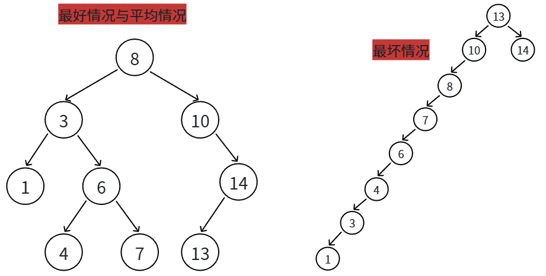
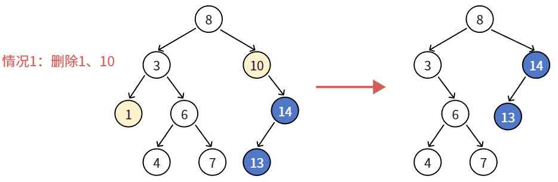
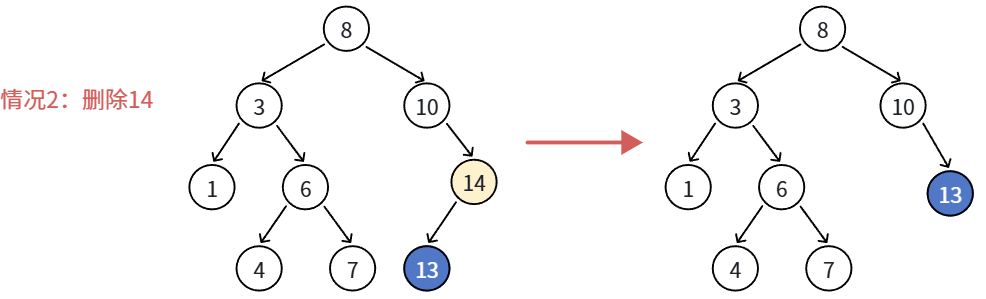
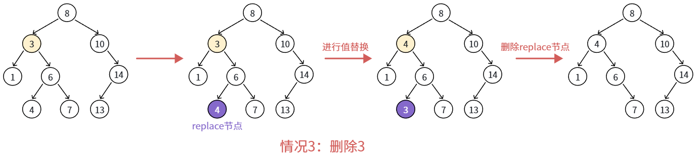

## 1. 二叉搜索树概念

二叉搜索树（Binary Search Tree，简称 BST），也被称为二叉查找树或二叉排序树。理解它的概念，最核心的是要明白**它为了解决什么问题而生**，以及**它遵循什么严格的规则**。

在数据结构中，我们经常需要在“查找”和“增删”之间做权衡：

- **有序数组**：使用二分查找非常快，时间复杂度是 $O(\log n)$。但是，如果你想在中间插入或删除一个元素，必须把后面的所有元素都移动一位，效率极低，时间复杂度是 $O(n)$。
- **链表**：插入和删除极其迅速（只需修改指针），时间复杂度是 $O(1)$。但是，你想在链表中找一个特定的数字，只能从头到尾挨个看，极其缓慢，时间复杂度是 $O(n)$。

**二叉搜索树就是为了“鱼与熊掌兼得”而发明的。** 它巧妙地将二分查找的逻辑融入到了树形的链式结构中，使得**查找、插入、删除**在理想情况下都能达到 $O(\log n)$ 的极高效率。

一棵树如果想被称为“二叉搜索树”，它要么是一棵空树，要么必须严格遵守以下“三大定律”：

1. **左小**：如果任意节点的左子树不为空，那么左子树上**所有节点**的值，都严格小于该节点的值。
2. **右大**：如果任意节点的右子树不为空，那么右子树上**所有节点**的值，都严格大于该节点的值。
3. **递归性**：任意节点的左子树和右子树，本身也必须分别是一棵二叉搜索树。
4. ⼆叉搜索树中**可以⽀持插⼊相等的值**，**也可以不⽀持插⼊相等的值**，具体看使⽤场景定义，后续学习`map`、`set`、`multimap`、`multiset`系列容器底层就是⼆叉搜索树，其中`map`、`set`**不⽀持插⼊相等值**，`multimap`、`multiset`**支持插⼊相等值**。

*(注：通常基础的二叉搜索树中不包含键值相等的节点。如果有重复值，可以通过在节点中增加一个计数器字段来解决，或者**约定相等的值统一放在左边或右边**。)*

因为“左 < 根 < 右”的结构特性，二叉搜索树拥有一个非常漂亮且实用的数学性质：

**如果你对一棵二叉搜索树进行中序遍历（访问顺序：左子树 $\rightarrow$ 根节点 $\rightarrow$ 右子树），你一定会得到一个从小到大完全递增的有序序列。**

这也是它被称为“二叉排序树”的原因。在很多算法题中，只要提到二叉搜索树，第一反应往往就是利用它的中序遍历特性。

虽然概念很完美，但基础的二叉搜索树有一个致命缺陷：**它对数据的插入顺序非常敏感。**

- **理想情况（树形饱满平衡）**：此时就像完美的二分查找，查找效率是 $O(\log n)$。
- **最坏情况（退化成链表）**：如果你依次插入一组已经排好序的数据（比如：1, 2, 3, 4, 5），这棵树就会一直向右长，完全变成一根“冰糖葫芦”（单向链表）。此时，它的层数等于节点数 $n$，查找和删除的效率会瞬间跌落回 $O(n)$。

为了克服这个弱点，计算机科学家们在二叉搜索树的概念之上，加入了“自动旋转平衡”的机制，衍生出了**AVL树**和**红黑树**（Red-Black Tree）。后续 C++ STL 中使用的 `std::set` 和 `std::map`，其底层核心就是一棵带有自平衡能力的二叉搜索树（红黑树）。

## 2. 性能分析

二叉搜索树（BST）的性能分析，归根结底是在讨论一个核心指标：**树的高度（Height，通常记为 $h$）**。

无论是查找、插入还是删除，BST 的操作本质上都是从根节点沿着某一条路径向下“走”。因此，**这三个核心操作的时间复杂度，都严格等于 $O(h)$。**



### 2.1 最好情况与平均情况

**场景：** 数据以相对随机的顺序插入。

**形态：** 树的左右子树节点数量大致相等，形态饱满，像一个完美的金字塔。

**高度 $h$：** 在这种情况下，树的高度 $h$ 与节点总数 $n$ 的关系是对数级别的，即 $h \approx \log_2(n)$。

- **查找（Search）：** 每次比较都能排除掉大约一半的节点（类似二分查找）。时间复杂度为 **$O(\log n)$**。
- **插入（Insert）：** 寻找到正确的叶子节点位置需要往下走 $\log n$ 层。时间复杂度为 **$O(\log n)$**。
- **删除（Delete）：** 寻找到目标节点并找到其前驱或后继节点，最多也只需走 $\log n$ 层。时间复杂度为 **$O(\log n)$**。

**结论：** 在平衡状态下，BST 极其高效。即使有一百万个节点（$n = 1,000,000$），最多也只需要约 20 次比较就能找到目标。

### 2.2 最坏情况：树退化为链表

**场景：** 数据以**完全有序**（升序或降序）的顺序插入。例如，依次插入 `1, 2, 3, 4, 5`。

**形态：** 每一个节点都只有右孩子（或只有左孩子），树完全失去分叉，变成了一根“糖葫芦”（单向链表）。

**高度 $h$：** 此时，树的高度 $h$ 等于节点总数 $n$。

- **查找（Search）：** 找最大值时，必须从头走到尾。时间复杂度退化为 **$O(n)$**。
- **插入（Insert）：** 每次插入比当前所有值都大的新节点时，都要走到链表末尾。时间复杂度退化为 **$O(n)$**。
- **删除（Delete）：** 同样需要遍历去寻找节点。时间复杂度退化为 **$O(n)$**。

**结论：** 这是基础 BST 的致命缺陷。一旦数据规律性太强，它就失去了作为“树”的优势，性能大打折扣。

| **操作**          | **平均时间复杂度** | **最坏时间复杂度 (退化为链表)** | **空间复杂度 (仅考虑节点存储)** |
| ----------------- | ------------------ | ------------------------------- | ------------------------------- |
| **查找 (Search)** | $O(\log n)$        | $O(n)$                          | $O(n)$                          |
| **插入 (Insert)** | $O(\log n)$        | $O(n)$                          | $O(n)$                          |
| **删除 (Delete)** | $O(\log n)$        | $O(n)$                          | $O(n)$                          |

### 2.3 空间复杂度分析

除了时间，我们还要关注内存开销：

- **存储空间：** 无论树长什么样，存储 $n$ 个节点都需要 $O(n)$ 的堆内存空间。
- **调用栈空间（递归实现）：** 如果你的增删查改是用**递归**写的，每一次函数调用都会消耗栈空间。最大栈深度等于树的高度 $h$。
	- 最好情况：栈空间占用 $O(\log n)$。
	- 最坏情况：栈空间占用 $O(n)$。如果 $n$ 很大，极易引发**栈溢出（Stack Overflow）**。
- **调用栈空间（非递归实现）：** 就像非递归 `Erase` 函数，只使用了几个指针变量（`cur`, `parent` 等），额外的空间复杂度是严格的 **$O(1)$**。这也是为什么在工程中，C++ STL 容器通常偏爱非递归或迭代器实现。

## 3. 二叉搜索树的插入

二叉搜索树的插入操作相对删除来说要简单得多。它的核心思想非常纯粹：**新插入的节点，永远都会成为这棵树的叶子节点**（即没有子节点的末端节点）。不需要像删除那样去改变现有树的拓扑结构，只需要“顺藤摸瓜”找到合适的位置，然后把它挂上去即可。

插入操作可以分为三个明确的步骤：

1. **处理空树：** 如果当前树是空的（`_root == nullptr`），那么直接用新值创建一个节点，并让它成为根节点，插入结束。
2. **寻找插入位置（向下遍历）：** * 使用两个指针：`cur` 用于向下遍历，`parent` 用于在后面紧跟 `cur`，记录它的父节点。
	- 如果目标值 `x` 大于 `cur->_val`，说明应该插入到右子树，`cur = cur->_right`。
	- 如果目标值 `x` 小于 `cur->_val`，说明应该插入到左子树，`cur = cur->_left`。
	- 如果相等，说明树中已经有这个值了。标准的 BST 通常不允许键值重复（类似于 C++ 的 `std::set`），此时直接返回 `false` 表示插入失败。
3. **链接新节点：** 当 `cur` 走到空（`nullptr`）时，循环结束。此时的 `parent` 指针恰好停留在**未来新节点的父节点**上。我们只需要比较一下 `x` 和 `parent->_val` 的大小，决定把新节点挂在 `parent` 的左边还是右边即可。

```C++
bool insert(const K& key)
{
	// 如果树为空，直接作为根节点插入
	if (_root == nullptr)
	{
		_root = new Node(key);
		return true;
	}
	// 树非空，寻找合适的空位
	Node* parent = nullptr;
	Node* cur = _root;
	while (cur)
	{
		if (key > cur->_key)
		{
			parent = cur;
			cur = cur->_right;   // 向右找
		}
		else if (key < cur->_key)
		{
			parent = cur;
			cur = cur->_left;   // 向左找
		}
		else
		{
			return false;       // 找到了相同的值，拒绝插入（保持 BST 元素唯一性）
		}
	}
	// 此时 cur 为 nullptr，已经找到了插入位置，parent 是新节点的父节点
	cur = new Node(key);
	// 判断新节点应该作为 parent 的左孩子还是右孩子
	if (key > parent->_key)
		parent->_right = cur;
	else
		parent->_left = cur;
	return true;
}
```

### 3.1 关键点与复杂度分析

- **为什么需要 `parent` 指针？**

	初学者在写插入时常犯的错误是直接操作 `cur`（例如想着把 `cur` 赋值为 `new Node(x)`）。但 `cur` 只是一个局部指针变量，当它走到 `nullptr` 时，它和树的结构已经失去了联系。通过维护 `parent`，才能在找到空位后，把新节点真正“缝合”到树的指针链条中。

- **时间复杂度：** 和查找一样，插入的时间开销完全取决于要走多深。最好/平均情况下是 **$O(\log n)$**；最坏情况下（例如按 `1, 2, 3, 4` 顺序插入，树退化成单向链表）是 **$O(n)$**。

- **空间复杂度：** 非递归写法只使用了几个指针，额外空间复杂度是 **$O(1)$**，非常高效。

## 4. 二叉搜索树的删除

二叉搜索树（BST）的删除操作是其所有基础操作中最复杂的一个。原因在于：插入和查找只需要“顺藤摸瓜”，而删除不仅要去掉一个节点，还必须**完美地修补树的结构**，确保删除后整棵树依然严格满足“左小右大”的 BST 性质。

### 情况一：被删除的节点是叶子节点

**场景：** 这是最简单的情况，该节点位于树的最底层。

**处理逻辑：**

由于它没有任何子节点，直接删除它不会影响其他任何节点的连结。

1. 找到它的父节点（Parent）。
2. 将父节点指向它的指针（左指针或右指针）修改为 `nullptr`。
3. 释放该节点的内存。



### 情况二：被删除的节点只有一个子节点

**场景：** 该节点像一个“单行道”，它自己被删除了，但它的下方还拖着一串子树。

**处理逻辑：**

这种情况下，我们只需要进行**“托孤”**（Bypass）。

1. 找到待删除节点的父节点。
2. 将待删除节点唯一的那个子树，直接“提上来”，挂载到父节点原本指向待删除节点的位置。
3. 释放该节点的内存。*（简单来说，就是让爷爷节点直接牵住孙子节点的手，然后把中间的爸爸节点删掉。）*



### 情况三：被删除的节点有两个子节点

**场景：** 待删除节点像一个“十字路口”，既有左子树又有右子树。如果直接删掉它，左右两棵子树就会变成“孤儿”，且无法直接接到父节点上（因为父节点只有一个空位）。

**处理逻辑：**不能直接破坏树的拓扑结构，而是使用**“替身法”（替换删除法）**。

1. **寻找替身：** 我们需要在树中找一个节点来顶替被删除节点的位置。为了保持“左小右大”的性质，替身只能是：
	- **左子树中的最大值节点**（前驱节点）：往左走一步，然后一路向右走到黑。
	- **右子树中的最小值节点**（后继节点）：往右走一步，然后一路向左走到黑。*(通常工程中习惯使用后继节点)*。
2. **值替换：** 找到后继节点后，**不要改变节点的物理连接**，而是直接把后继节点里的“值（Value）”复制、覆盖到待删除的节点中。
3. **删除替身：** 此时，真正多余的节点变成了那个“后继节点”。因为后继节点是一路向左走到黑找到的，所以**它绝对没有左子节点**。这意味着，删除这个替身节点的问题，被完美**降维打击**成了“情况一（无子节点）”或“情况二（只有一个右子节点）”。我们只需要把这个替身删掉即可。



**递归实现**

```C++
TreeNode* deleteNode(TreeNode* root, int key) 
{
    // 没找到节点，或者树为空
    if (root == nullptr) return nullptr;

    // 寻找待删除的节点
    if (key < root->val)
        root->left = deleteNode(root->left, key);   // 去左子树删，并更新左指针
    else if (key > root->val)
        root->right = deleteNode(root->right, key); // 去右子树删，并更新右指针 
    // 找到了目标节点 root
    else 
    {
        // 情况 1/2：左为空，或者右为空（涵盖了全为空的叶子节点情况）
        if (root->left == nullptr) 
        {
            TreeNode* temp = root->right; // 暂存右子树
            delete root;                  // 释放当前节点
            return temp;                  // 返回右子树，让上一层接住
        } 
        else if (root->right == nullptr) 
        {
            TreeNode* temp = root->left;
            delete root;
            return temp;
        }

        // 情况 3：左右子树都不为空 找右子树的最小值节点（后继节点）
        TreeNode* successor = root->right;
        while (successor->left != nullptr) 
            successor = successor->left;
        // 用后继节点的值覆盖当前节点
        root->val = successor->val;
        // 在右子树中，递归调用自己，删掉那个替身（此时替身的值就是 root->val）
        root->right = deleteNode(root->right, root->val);
    }
    return root; // 返回当前节点，维持树的连结
}
```

**非递归实现**

```c++
bool erase(const K& key)
{
    // parent 始终紧跟 cur，用于在删除 cur 后，把 cur 的子树重新连结到树上
    Node* parent = nullptr;
    Node* cur = _root;
    // 寻找待删除的节点
    while (cur)
    {
        if (key > cur->_key)
        {
            parent = cur;        // 往下走之前，先记录当前节点为父节点
            cur = cur->_right;   // 目标值偏大，向右子树找
        }
        else if (key < cur->_key)
        {
            parent = cur;
            cur = cur->_left;    // 目标值偏小，向左子树找
        }
        else // key == cur->_key，找到了待删除节点 进入第二阶段：执行删除
        {
            // 情况 1：左孩子为空
            // 涵盖了两种情况：1. cur 是叶子节点（左右皆空） 2. cur 只有右孩子
            if (cur->_left == nullptr)
            {
                // 边界情况：如果被删的是根节点，由于没有 parent，直接换根
                if (cur == _root)
                    _root = cur->_right; 
                // 常规情况：让 parent 直接连上 cur 的右子树（跨过 cur）
                else
                {
                    // 必须判断 cur 原本是 parent 的左孩子还是右孩子
                    if (parent->_left == cur)
                        parent->_left = cur->_right;
                    else
                        parent->_right = cur->_right;
                }
                delete cur;  
                return true; // 成功删除，必须 return 退出循环
            }
            
            // 情况 2：右孩子为空
            // 此时 cur 只有左孩子，逻辑与情况 1 完全对称
            else if (cur->_right == nullptr)
            {
                if (cur == _root)
                    _root = cur->_left; // 这里 _root 就是 cur，所以等价于 _root = cur->_left
                else
                {
                    if (parent->_left == cur)
                        parent->_left = cur->_left;
                    else
                        parent->_right = cur->_left;
                }
                delete cur;
                return true;
            }
            
            // 情况 3：左右孩子都不为空（最复杂的“十字路口”节点）
            // 使用“替换法”：找右子树中最小的节点（最左节点）来顶替 cur 的位置
            else
            {
                Node* replaceparent = cur;
                Node* replace = cur->_right; // 从 cur 的右子树开始找
                
                // 一路向左走到黑，寻找右子树的最小值（后继节点）
                while (replace->_left)
                {
                    replaceparent = replace;
                    replace = replace->_left;
                }
                
                // 值替换 不改变树的指针拓扑结构，直接把替身的值覆盖给待删除节点
                cur->_key = replace->_key;
                
                // 任务变成了：删除失去利用价值的 replace 节点。
                // 因为 replace 是最左节点，所以它【绝对没有左孩子】。这就退化成了“情况1”。
                // 只需要把 replace 的右子树（可能有，也可能没有）接给 replaceparent。

                // 边界陷阱判断：如果 while 循环进去了，replace 一定是 replaceparent 的左孩子。
                if (replaceparent->_left == replace)
                    replaceparent->_left = replace->_right;
                // 如果 while 循环压根没进去（cur->_right 自身就没有左孩子），
                // 此时 replace 就是 replaceparent 的右孩子！
                else
                    replaceparent->_right = replace->_right;
                delete replace; // 真正被物理销毁的是替身节点
                return true;
            }
        }
    }
    // 如果 while 循环结束（cur 变成 nullptr），说明树里根本没有这个 key
    return false;
}
```

## 5. K / KV 模型

在实际的软件开发中，使用二叉搜索树（BST）及其进化版（如红黑树）时，通常会根据业务需求将其分为两种经典的应用模型：**Key 模型（K模型）**和 **Key/Value 模型（KV模型）**。

这两种模型底层的树形结构和比较逻辑完全一样，唯一的区别在于**节点里存了什么数据**以及**我们拿它来解决什么具体问题**。

### 5.1 Key 模型（纯粹的集合）

K 模型的树节点中只存储一个关键码（Key）。

这棵树存在的唯一目的，就是为了回答一个简单粗暴的是非题：**“这个 Key 在不在树里？”**

> 在 C++ STL 中，`std::set` 的底层就是典型的 K 模型。

**节点结构示意**

```C++
template<class K>
struct BSTNode {
    K _key;
    BSTNode<K>* _left;
    BSTNode<K>* _right;
};
```

**典型使用场景**——K 模型适用于所有**只需判断存在性，不需要附加信息**的场景：

- **拼写检查器（Spell Checker）：**将整本英文词典里所有的合法单词全存入一棵搜索树中（Key = 单词）。当用户输入一个词时，程序去树中查找。如果 `Search(word)` 返回 `true`，说明拼写正确；返回 `false`，说明是个错别字，底下画红波浪线。
- **门禁/黑白名单系统：**小区的门禁系统里存了一棵包含所有业主门禁卡号（Key）的树。你刷卡时，系统去树里找你的卡号。找到就开门，找不到就报警。不需要知道你叫什么名字，只需要知道你的卡号“在不在”白名单里。
- **敏感词过滤：**将所有违规词汇存入树中。审核文章时，提取词汇去树中匹配，命中则打码或驳回。

### 5.2 Key/Value 模型（KV 模型 / 字典映射）

KV 模型的树节点中不仅存储用于比较和排序的关键码（Key），还额外附带了一个与之绑定的值（Value）。

这棵树存在的目的是为了回答一个寻址题：**“通过这个特定的 Key，我能查到什么对应的 Value？”**

在构建树、比较大小、寻找位置时，**永远只看 Key，不看 Value**。Value 只是一个“顺手带过去”的有效载荷（Payload）。

> 在 C++ STL 中，`std::map` 的底层就是典型的 KV 模型。

**节点结构示意**

```C++
template<class K, class V>
struct BSTNode {
    K _key;      // 用于比较大小、构建树结构
    V _value;    // 附带的有效数据
    BSTNode<K, V>* _left;
    BSTNode<K, V>* _right;
};
```

**典型使用场景**——KV 模型适用于所有**需要通过一个唯一标识去查找对应详细数据**的场景：

- **中英互译字典：**Key 存英文单词（例如 `"apple"`），Value 存中文释义（例如 `"苹果"`）。用户输入 `apple`，系统通过二叉搜索树快速找到 Key 为 `"apple"` 的节点，然后把它的 `_value` 打印出来。
- **频次统计（Word Count）：**这是最经典的面试题场景。比如统计一篇文章中每个单词出现的次数。Key 存单词，Value 存出现次数。遍历文章，每读到一个词：
	- 如果在树中找不到这个 Key，就插入一个新节点 `{Key: 词, Value: 1}`。
	- 如果在树中找到了这个 Key，就直接把该节点的 Value 加 1（`cur->_value++`）。
- **DNS 域名解析：**Key 存域名（如 `www.google.com`），Value 存 IP 地址（如 `142.250.190.4`）。浏览器通过域名查找 IP，就是一次典型的 KV 查找。
- **学生成绩查询/玩家信息查询：**Key 存学号（或游戏 UID），Value 存该学生的全部详细信息（包含姓名、各科成绩等组成的一个结构体）。只要知道 UID，就能瞬间拉取该玩家的全部存档数据。

### 5.3 总结与对比

| **维度**         | **Key 模型 (K)**         | **Key/Value 模型 (KV)**           |
| ---------------- | ------------------------ | --------------------------------- |
| **核心提问**     | “在不在？” (True/False)  | “是什么？” (Get Value by Key)     |
| **排序依据**     | 仅按 Key 排序            | 仅按 Key 排序（Value 不参与比较） |
| **C++ STL 对应** | `std::set`               | `std::map`                        |
| **典型应用**     | 门禁系统、拼写检查、去重 | 字典翻译、词频统计、数据库索引    |

```c++
#pragma once

#include<iostream>
using namespace std;

namespace key
{
	template <class K>
	struct BSTNode
	{
		K _key;
		BSTNode<K>* _left;
		BSTNode<K>* _right;
		BSTNode(const K& k)
			:_left(nullptr)
			,_right(nullptr)
			,_key(k)
		{}
	};

	template<class K>
	class BSTree
	{
		using Node = BSTNode<K>;
	public:
		bool insert(const K& key)
		{
			if (_root == nullptr)
			{
				_root = new Node(key);
				return true;
			}
			Node* parent = nullptr;
			Node* cur = _root;
			while (cur)
			{
				if (key > cur->_key)
				{
					parent = cur;
					cur = cur->_right;
				}
				else if (key < cur->_key)
				{
					parent = cur;
					cur = cur->_left;
				}
				else
				{
					return false;
				}
			}
			cur = new Node(key);
			if (key > parent->_key)
				parent->_right = cur;
			else
				parent->_left = cur;
			return true;
		}

		bool Find(const K& key)
		{
			Node* cur = _root;
			while (cur)
			{
				if (cur->_key < key)
					cur = cur->_right;
				else if (cur->_key > key)
					cur = cur->_left;
				else
					return true;
			}
			return false;
		}

		bool erase(const K& key)
		{
			Node* parent = nullptr;
			Node* cur = _root;

			while (cur)
			{
				if (key > cur->_key)
				{
					parent = cur;
					cur = cur->_right;
				}
				else if (key < cur->_key)
				{
					parent = cur;
					cur = cur->_left;
				}
				else
				{
					//左空
					if (cur->_left == nullptr)
					{
						if (cur == _root)
							_root = cur->_right;
						else
						{
							if (parent->_left == cur)
								parent->_left = cur->_right;
							else
								parent->_right = cur->_right;
						}
						delete cur;
						return true;
					}
					else if (cur->_right == nullptr)
					{
						if (cur == _root)
							_root = cur->_left;
						else
						{
							if (parent->_left == cur)
								parent->_left = cur->_left;
							else
								parent->_right = cur->_left;
						}
						delete cur;
						return true;
					}
					else
					{
						// 找右子树最左节点
						Node* replaceparent = cur;
						Node * replace = cur->_right;
						while (replace->_left)
						{
							replaceparent = replace;
							replace = replace->_left;
						}
						cur->_key = replace->_key;
						if (replaceparent->_left == replace)
							replaceparent->_left = replace->_right;
						else
							replaceparent->_right = replace->_right;
						delete replace;
						return true;
					}
				}
			}
			return false;
		}
		void InOrder()
		{
			_InOrder(_root);
			cout << endl;
		}
	private:
		void _InOrder(Node* root)
		{
			if (root == nullptr)
			{
				return;
			}

			_InOrder(root->_left);
			cout << root->_key << " ";
			_InOrder(root->_right);
		}
	private:
		Node* _root = nullptr;
	};
}

namespace key_value
{
	template<class K, class V>
	struct BSTNode
	{
		K _key;
		V _value;

		BSTNode<K, V>* _left;
		BSTNode<K, V>* _right;

		BSTNode(const K& key, const V& value)
			:_key(key)
			, _value(value)
			, _left(nullptr)
			, _right(nullptr)
		{ }
	};

	template<class K, class V>
	class BSTree
	{
		using Node = BSTNode<K, V>;
	public:
		BSTree() = default;

		BSTree(const BSTree& t)
		{
			_root = Copy(t._root);
		}

		BSTree& operator=(BSTree tmp)
		{
			swap(_root, tmp._root);
			return *this;
		}

		~BSTree()
		{
			Destroy(_root);
			_root = nullptr;
		}

		bool Insert(const K& key, const V& value)
		{
			if (_root == nullptr)
			{
				_root = new Node(key, value);
				return true;
			}

			Node* parent = nullptr;
			Node* cur = _root;

			while (cur)
			{
				if (cur->_key < key)
				{
					parent = cur;
					cur = cur->_right;
				}
				else if (cur->_key > key)
				{
					parent = cur;
					cur = cur->_left;
				}
				else
				{
					return false;
				}
			}

			cur = new Node(key, value);
			if (parent->_key < key)
				parent->_right = cur;
			else
				parent->_left = cur;
			return true;
		}

		Node* Find(const K& key)
		{
			Node* cur = _root;
			while (cur)
			{
				if (cur->_key < key)
					cur = cur->_right;
				else if (cur->_key > key)
					cur = cur->_left;
				else
					return cur;
			}
			return nullptr;
		}

		bool Erase(const K& key)
		{
			Node* parent = nullptr;
			Node* cur = _root;

			while (cur)
			{
				if (cur->_key < key)
				{
					parent = cur;
					cur = cur->_right;
				}
				else if (cur->_key > key)
				{
					parent = cur;
					cur = cur->_left;
				}
				else
				{
					// 删除
					// 左为空
					if (cur->_left == nullptr)
					{
						if (cur == _root)
							_root = cur->_right;
						else
						{
							if (parent->_left == cur)
								parent->_left = cur->_right;
							else
								parent->_right = cur->_right;
						}
						delete cur;

					}
					else if (cur->_right == nullptr)
					{
						if (cur == _root)
							_root = cur->_left;
						else
						{
							// 右为空
							if (parent->_left == cur)
								parent->_left = cur->_left;
							else
								parent->_right = cur->_left;
						}
						delete cur;
					}
					else
					{
						// 左右都不为空
						// 右子树最左节点
						Node* replaceParent = cur;
						Node* replace = cur->_right;
						while (replace->_left)
						{
							replaceParent = replace;
							replace = replace->_left;
						}
						cur->_key = replace->_key;
						if (replaceParent->_left == replace)
							replaceParent->_left = replace->_right;
						else
							replaceParent->_right = replace->_right;
						delete replace;
					}
					return true;
				}
			}
			return false;
		}
		void InOrder()
		{
			_InOrder(_root);
			cout << endl;
		}
	private:
		void _InOrder(Node* root)
		{
			if (root == nullptr)
				return;
			_InOrder(root->_left);
			cout << root->_key << ":" << root->_value << endl;
			_InOrder(root->_right);
		}
		void Destroy(Node* root)
		{
			if (root == nullptr)
				return;
			Destroy(root->_left);
			Destroy(root->_right);
			delete root;
		}
		Node* Copy(Node* root)
		{
			if (root == nullptr)
				return nullptr;
			Node* newRoot = new Node(root->_key, root->_value);
			newRoot->_left = Copy(root->_left);
			newRoot->_right = Copy(root->_right);
			return newRoot;
		}
	private:
		Node* _root = nullptr;
	};
}
```

