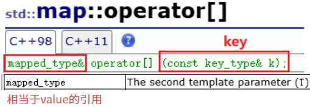
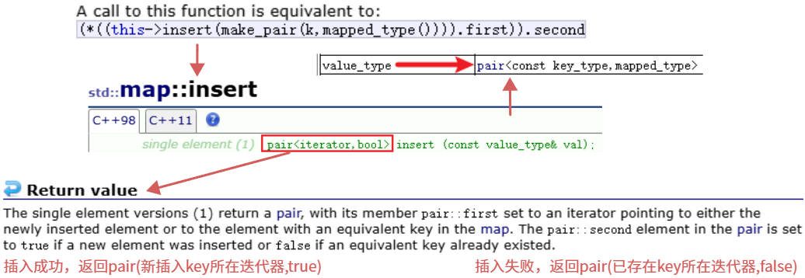

# 一、序列式容器、关联式容器

在 C++ STL 中，容器主要分为**序列式容器**（Sequence Containers）和**关联式容器**（Associative Containers）。从计算机科学的底层设计来看，**序列式容器**与**关联式容器**的本质区别在于：**数据的物理/逻辑顺序是如何被定义的**。

## 1.1 序列式容器

序列式容器的特点是：**元素排列的次序取决于插入的时机和位置**。它们关注的是数据的“前后关系”。序列式容器的核心特征是**线性映射**。

- **定义准则**：元素的排列顺序由**插入的位置和时间**决定。容器本身不关心元素的值是多少，它只负责维护一个从 $0$ 到 $n-1$ 的位置索引。
- **物理组织**：通常在内存中表现为连续存储（如 `vector`）或逻辑上的链式存储（如 `list`）。
- **核心语义**：
	- **位置相关性**：每个元素都有一个确定的物理序号或逻辑先后关系。
	- **非排序性**：除非人为进行 `std::sort`，否则容器内部不会根据元素大小自动重排。
	- **扩容机制**：对于连续内存容器，涉及动态分配与数据迁移（Copy/Move）。

## 1.2 关联式容器

关联式容器的特点是：**元素排列的次序取决于其“键 (Key)”的大小**。它们关注的是数据的“逻辑查找”。核心特征是**非线性映射（键值映射）**。

- **定义准则**：元素的排列顺序由**元素本身的键 (Key)** 决定。容器内部通过特定的算法（如平衡树或哈希函数）自动管理位置。
- **物理组织**：通常表现为高度复杂的树状结构红黑树（Red-Black Tree）或散列表（Hash Table），而非简单的线性排列。
- **核心语义**：
	- **值相关性**：元素存储在哪里，取决于它“是谁”，而不是它“何时进入”。
	- **自动排序/组织**：容器始终维持一种高效的查找结构。标准关联容器（`map`/`set`）保证了严格的弱序关系（Strict Weak Ordering）。
	- **不可变键**：为了维持结构的稳定性，容器的“键”部分通常是只读的。

## 1.3 对比：序列 vs 关联


| **维度**       | **序列式 (Sequence)**         | **关联式 (Associative)**          |
| -------------- | ----------------------------- | --------------------------------- |
| **元素排列**   | 按插入先后或位置指定          | 按键 (Key) 的排序准则自动排列     |
| **访问方式**   | 迭代器偏移或下标索引          | 键查找 (Key Lookup)               |
| **主要复杂度** | 插入/删除可能导致大量数据移动 | 查找/插入通常为对数级 $O(\log n)$ |
| **底层结构**   | 数组、链表                    | 红黑树、哈希表                    |
| **迭代器行为** | 随机迭代器/双向迭代器         | 双向迭代器（通常不支持随机跳跃）  |

在实际编程中，选择容器的逻辑通常如下：

1. **默认选择**：除非有特殊需求，首选 `std::vector`。它的连续内存对 CPU 缓存最友好。
2. **需要查找**：如果你经常要问“这个值在不在？”或者“这个名字对应的电话是多少？”，请用 `std::set` 或 `std::map`。
3. **序列式容器**是“白纸”，你可以按照自己的意愿在上面写字（插入位置），它只负责按顺序记录。
4. **关联式容器**是“带索引的档案库”，当你把数据扔进去时，它会根据数据自身的属性将其归档到对应的位置，以便你后续通过属性（Key）瞬间找回。

> **注意**：序列式容器的迭代器在增删时容易失效（尤其是 `vector` 扩容），而关联式容器（红黑树版）的迭代器在插入删除时通常保持稳定。

# 二、set 的使用和详解

## 2.1 核心概念与底层机制

C++ STL 中的 `std::set` 是一个非常强大且常用的**关联容器（Associative Container）**。它的主要作用是存储不重复的元素，并且这些元素在插入时会自动进行排序。

**元素的唯一性**——`set` 中不允许存在重复的元素。如果你尝试插入一个已经存在的值，插入操作会被忽略。

- **应用场景**：非常适合用来做数据去重，例如统计一篇文章中出现了多少个不同的单词。

**自动排序**——当你向 `set` 中插入元素时，它会根据特定的排序规则（默认是使用 `<` 运算符进行升序排列）自动将元素放在合适的位置。

- **自定义排序**：你可以通过传入自定义的比较函数（Functor 或 Lambda 表达式）来改变排序规则，比如改为降序排列。

**元素的只读性**——在 `set` 中，元素的值既是数据（Value），也是用于排序和查找的键（Key）。因此，**你不能直接修改 `set` 中的元素**。

- **原因**：如果允许直接修改，改变后的值可能会破坏容器内部的严格排序结构。
- **正确做法**：如果需要修改某个元素，必须先将旧元素 `erase`（删除），然后再 `insert`（插入）新元素。

`set`**默认要求T⽀持⼩于⽐较**，如果不⽀持或者想按⾃⼰的需求⾛可以**⾃⾏实现仿函数传给第⼆个模版参数**。

`std::set` 能够高效地维持“有序”和“唯一”这两个特性，归功于它背后的数据结构——红黑树

几乎所有主流的 C++ 标准库实现（如 GCC 的 libstdc++、LLVM 的 libc++）底层都采用**红黑树**来实现 `set`（以及 `map`）。

红黑树是一种**自平衡二叉查找树（Self-balancing Binary Search Tree）**。它具有以下关键特性，决定了 `set` 的性能：

- **节点结构**：每个节点除了存储你的数据外，还需要存储额外的元数据：颜色、父节点指针、左子节点指针和右子节点指针。这带来了**一定的内存开销**。
- **自平衡**：在每次插入或删除元素后，红黑树通过“变色”和“旋转”操作，确保树的高度始终保持在 $O(\log n)$ 的范围内。它不像 AVL 树那样要求绝对平衡，因此在插入和删除时的性能开销更小。

## 2.2 构造函数和迭代器

`std::set` 提供了多种构造方式，以适应不同的初始化场景。值得注意的是，所有的构造函数都可以额外接收**自定义比较器（Compare）**和**分配器（Allocator）**，这里主要聚焦于最常用的核心形态。

### 2.1.1 常见构造方式概览

| **构造类型**           | **语法示例**                               | **说明与时间复杂度**                                         |
| ---------------------- | ------------------------------------------ | ------------------------------------------------------------ |
| **默认构造**           | `std::set<int> s;`                         | 创建一个空容器。时间复杂度：$O(1)$。                         |
| **列表初始化 (C++11)** | `std::set<int> s = {3, 1, 4, 1, 5};`       | 用花括号列表初始化，自动去重和排序（结果为 1, 3, 4, 5）。时间复杂度：$O(N \log N)$。 |
| **区间构造**           | `std::set<int> s(vec.begin(), vec.end());` | 从另一个容器的迭代器区间 `[first, last)` 拷贝数据。**重点**：如果区间数据已排序，复杂度优化为 $O(N)$；否则为 $O(N \log N)$。 |
| **拷贝构造**           | `std::set<int> s2(s1);`                    | 复制另一个同类型 `set` 的所有元素。时间复杂度：与元素数量成正比 $O(N)$。 |

> **自定义比较器：**默认情况下，`std::set<T>` 等价于 `std::set<T, std::less<T>>`。如果你想改变排序规则（比如改为降序），可以在构造时指定类型：`std::set<int, std::greater<int>> s;`。

### 2.1.2 迭代器的核心分类与方法

`std::set` 的迭代器属于**双向迭代器（Bidirectional Iterator）**。理解 `set` 的迭代器，核心在于理解它如何与底层的红黑树交互。可以通过迭代器向前（`++`）或向后（`--`）遍历 `set`，遍历的顺序严格遵守 `set` 的排序规则。

| **迭代器类型**         | **获取方法**                                 | **行为特征**                                                 |
| ---------------------- | -------------------------------------------- | ------------------------------------------------------------ |
| **正向迭代器**         | `begin()`, `end()`                           | `begin()` 指向最小元素，`end()` 指向最大元素**之后**的虚拟位置。执行 `++` 会移动到下一个更大的元素。 |
| **逆向迭代器**         | `rbegin()`, `rend()`                         | `rbegin()` 指向最大元素，`rend()` 指向最小元素**之前**的虚拟位置。执行 `++` 会移动到下一个更小的元素（常用于降序遍历）。 |
| **常量迭代器 (C++11)** | `cbegin()`, `cend()`, `crbegin()`, `crend()` | 带有 `c` 前缀的方法明确返回只读迭代器。                      |

在 C++ 文档的定义中，`std::set` 的键（Key）和值（Value）是同一个实体。

**核心机制**：为了防止用户通过迭代器直接修改元素从而破坏红黑树的排序结构，`std::set` 的普通 `iterator` 和 `const_iterator` **都只允许对元素进行读操作**。

```c++
std::set<int> s = {1, 2, 3};
auto it = s.begin();
// *it = 10; // 编译错误！(Compile Error): assignment of read-only location
```

### 2.1.3 迭代器失效

得益于底层采用节点式的树形结构，`std::set` 在迭代器稳定性方面表现极佳：

- **插入元素**：**不会**使任何现有的迭代器失效。
- **删除元素**：**只**会使指向被删除元素的那个迭代器失效，其他迭代器依然完全有效。（对比之下，`std::vector` 在中间删除元素会导致后续迭代器全部失效）。

```c++
// empty (1) 无参默认构造
explicit set(const key_compare & comp = key_compare(),
	const allocator_type & alloc = allocator_type());
// range (2) 迭代器区间构造
template < class InputIterator>
set(InputIterator first, InputIterator last,
	const key_compare & comp = key_compare(),
	const allocator_type & = allocator_type());

// copy (3) 拷⻉构造
set(const set & x);

// initializer list (5) initializer 列表构造
set(initializer_list<value_type> il,
	const key_compare & comp = key_compare(),
	const allocator_type & alloc = allocator_type());

// 迭代器是⼀个双向迭代器
iterator->a bidirectional iterator to const value_type

// 正向迭代器
iterator begin();
iterator end();
// 反向迭代器
reverse_iterator rbegin();
reverse_iterator rend();
```

## 2.3 增删查接口详解

在 C++ 的 `std::set` 中，增（Insert）、删（Delete）、查（Search）是使用频率最高的核心接口。由于底层红黑树的特性，**这三类操作的平均和最坏时间复杂度都稳定在 O(log N)**。

### 2.3.1 增

向 `set` 中添加元素时，核心在于理解它是如何处理“重复”的。

| **接口名称**              | **语法与返回值**                 | **适用场景与细节**                                           |
| ------------------------- | -------------------------------- | ------------------------------------------------------------ |
| **`insert(value)`**       | 返回 `std::pair<iterator, bool>` | **最常用**。尝试插入 `value`。如果元素已存在，`bool` 为 `false`，迭代器指向已存在的元素；如果插入成功，`bool` 为 `true`，迭代器指向新元素。 |
| **`emplace(args...)`**    | 返回 `std::pair<iterator, bool>` | **C++11 引入，性能更高**。直接在 `set` 内部的内存节点上原地构造对象，省去了对象的拷贝或移动开销。常用于存放复杂对象（如自定义结构体）的 `set`。（C++ 11 再学） |
| **`insert(hint, value)`** | 返回 `iterator`                  | 提供一个“提示”迭代器（`hint`）。如果你大概知道新元素应该插入在哪个位置附近，提供正确的 `hint` 可以将插入的时间复杂度从 O(log N) 优化为 **O(1)**。 |

> **实战技巧：利用返回值检查去重逻辑**
>
> ```C++
> std::set<int> s = {1, 2};
> auto result = s.insert(2); 
> // result.second 将是 false，因为 2 已经存在。
> // result.first 将是一个指向容器中元素 2 的迭代器。
> ```

### 2.3.2 删

`set` 提供了多种维度的删除方式，无论是按值删除还是按位置删除都很方便。

| **接口名称**             | **语法与返回值**     | **适用场景与细节**                                           |
| ------------------------ | -------------------- | ------------------------------------------------------------ |
| **`erase(value)`**       | 返回 `size_t` (整数) | **按值删除**。如果存在该元素并成功删除，返回 `1`；如果不存在，返回 `0`。你可以直接用返回值来判断是否删除了东西。 |
| **`erase(iterator)`**    | 返回 `iterator`      | **按位置删除**。删除迭代器指向的元素。**注意**：在 C++11 之后，它会返回被删除元素**下一个元素**的迭代器，这对于在遍历时进行条件删除非常重要。 |
| **`erase(first, last)`** | 返回 `iterator`      | **区间删除**。删除 `[first, last)` 范围内的所有元素。        |
| **`clear()`**            | 无返回值 (`void`)    | **清空集合**。销毁所有元素，`set` 的 `size()` 变为 0。       |

### 2.3.3 查

查找不仅限于“是否存在”，还包括“找边界”，这在处理范围问题时非常强大。

| **接口名称**           | **语法与返回值** | **适用场景与细节**                                           |
| ---------------------- | ---------------- | ------------------------------------------------------------ |
| **`find(value)`**      | 返回 `iterator`  | **精确查找**。找到则返回指向该元素的迭代器；找不到则严格返回 `end()`。判断元素存在的最经典方法：`if (s.find(x) != s.end())`。 |
| **`count(value)`**     | 返回 `size_t`    | **统计次数**。在 `set` 中，返回值只能是 `0`（不存在）或 `1`（存在）。对于 `set` 来说，它的作用和 `find` 类似，但代码写起来更简洁：`if (s.count(x))`。 |
| **`lower_bound(val)`** | 返回 `iterator`  | **找下界**。返回第一个 **大于或等于 ( $\ge$ )** `val` 的元素的迭代器。 |
| **`upper_bound(val)`** | 返回 `iterator`  | **找上界**。返回第一个 **严格大于 ( $>$ )** `val` 的元素的迭代器。 |

在 `set` 中处理“区间问题”（比如查找或删除某个数值范围内的所有元素），核心武器是 **`lower_bound`** 和 **`upper_bound`**。千万不要用普通的循环去从头遍历寻找边界，那会浪费红黑树的 $O(\log N)$ 查找优势！

在 C++ 标准库中，几乎所有的区间操作都遵循 **左闭右开 `[first, last)`** 的原则。`set` 的这两个成员函数简直是为此量身定制的：

- **`lower_bound(A)`**：找下界。返回指向第一个 **$\ge A$** 的元素的迭代器。它就是区间的起点 `first`。
- **`upper_bound(B)`**：找上界。返回指向第一个 **$> B$** 的元素的迭代器。它刚好是区间的终点 `last`（即你要处理的最后一个元素的下一个位置）。

通过组合它们，可以精准截取出闭区间 `[A, B]` 内的所有元素。

下面这个测试案例模拟了一个常见的场景：我们有一组玩家的分数，需要清理掉不合格的分数段。

```C++
set<int> scores = { 50, 20, 60, 10, 30, 40, 25 };
printSet(scores, "初始所有分数");

// 遍历输出区间 [25, 45] 内的分数
// 定位起点：第一个 >= 25 的元素 (这里是 25)
auto it_start = scores.lower_bound(25);
// 定位终点：第一个 > 45 的元素 (这里是 50)
auto it_end = scores.upper_bound(45);
// 从 it_start 遍历到 it_end (不包含 it_end)
for (auto it = it_start; it != it_end; ++it)
    cout << *it << " "; // 预期输出: 25 30 40
cout << "\n";

// 删除区间 [15, 35] 内的所有分数
// 同样的方法，精准定位要删除的区间边界
auto erase_first = scores.lower_bound(15); // 第一个 >= 15 的元素是 20
auto erase_last = scores.upper_bound(35);  // 第一个 > 35 的元素是 40
// 调用 erase 的区间重载版本：erase(first, last)
// 注意：这里删除的是 [erase_first, erase_last) 范围内的元素
scores.erase(erase_first, erase_last);
printSet(scores, "删除 [15, 35] 后的剩余分数"); // 预期剩余: 10 40 50 60
```

1. **极速定位边界**：

	当你调用 `scores.lower_bound(25)` 和 `scores.upper_bound(45)` 时，`set` 内部通过红黑树分别进行了两次二分查找。寻找这两个边界的时间复杂度是 $O(\log N) + O(\log N)$，即使数据量上百万也是毫秒级。

2. **安全高效的区间删除**：

	`scores.erase(erase_first, erase_last)` 这个接口非常高效。它不仅帮你在底层释放了指定区间内所有节点的内存，还会自动完成红黑树的重新平衡。它的时间复杂度大致是 $O(\log N + K)$，其中 $K$ 是被删除的元素个数。这比你用一个 `for` 循环挨个调用 `erase(value)` 要高效安全得多。

3. **避免了迭代器失效的坑**：

	在普通的 `for` 循环中边遍历边删除很容易导致程序崩溃（因为被删节点的迭代器会失效）。但使用 `erase(first, last)` 这种区间操作，标准库在内部妥善处理了指针的转移，完美避开了迭代器失效的问题。

### 2.3.4 `find` 混淆

**为什么不用 `std::find` 算法？**——C++ 标准库在 `<algorithm>` 中也有一个全局的 `std::find`。但**绝对不要**把全局的 `std::find` 用在 `set` 上！全局算法是线性遍历 O(N)，而 `set` 自己的成员函数 `s.find()` 是利用红黑树查找，复杂度是极快的 O(log N)。

这是一个非常经典且极其重要的问题！在 C++ 开发中，混淆全局 `std::find` 和 `set` 的成员函数 `find` 是最常见的性能陷阱之一。

| **特性**            | **std::find (全局算法)**                              | **std::set::find (成员函数)**            |
| ------------------- | ----------------------------------------------------- | ---------------------------------------- |
| **头文件**          | `<algorithm>`                                         | `<set>`                                  |
| **调用语法**        | `std::find(s.begin(), s.end(), value)`                | `s.find(value)`                          |
| **底层机制**        | **线性查找 (Linear Search)**                          | **树形查找 (Tree Search)**               |
| **时间复杂度**      | $O(N)$                                                | $O(\log N)$                              |
| **适用范围**        | 所有支持迭代器的容器（如 `vector`, `list` 等）        | 仅限该 `set` 对象                        |
| **对 `set` 的态度** | 把 `set` 当成普通的线性序列，**无视其内部的有序性**。 | 充分利用底层的红黑树结构，**极速定位**。 |

全局 `std::find` 是一个模板函数，它的设计理念是**通用性**。只要你给它一个起点迭代器、一个终点迭代器和一个目标值，它就能帮你找。

**工作原理：**它就像一个极其老实的人，从 `begin()` 开始，一步一步向后执行 `++it`，并用 `==` 运算符检查当前元素是否等于目标值。

- **优点**：万物皆可查。无论是 `vector`、`list` 还是原生的 C 语言数组，它都能完美适配。
- **致命缺点（作用于 `set` 时）**：全局 `std::find` **根本不知道 `set` 底层是排好序的红黑树**。它只会把 `set` 当成一条单行道，逐个遍历。如果你的 `set` 里有 100 万个元素，且你要找的元素刚好在最后，它就要傻傻地对比 100 万次。时间复杂度退化为 $O(N)$。

作为 `set` 自己的成员函数，`s.find()` 对自己底层的红黑树结构了如指掌。

**工作原理：**它利用了二叉查找树的天然优势（左子树 < 根节点 < 右子树）。当你要查找某个值时，它从树的根节点开始向下“导航”：

1. 如果目标值**小于**当前节点，直接去**左子树**找，瞬间抛弃右边一半的数据。
2. 如果目标值**大于**当前节点，直接去**右子树**找，瞬间抛弃左边一半的数据。
3. 直到找到该值，或者走到树的尽头（返回 `end()`）。

- **绝对优势**：极度高效。即使 `set` 里有 100 万个元素，它最多只需要对比约 20 次就能得出结果（因为 $2^{20} \approx 1,000,000$）。时间复杂度被严格控制在 $O(\log N)$。

## 2.4 `multiset`、`set` 

`multiset` 和 `set` 就像是一对双胞胎兄弟。它们的底层数据结构完全一样（都是**红黑树**），时间复杂度也一模一样（增删查改都是 $O(\log N)$），并且都会自动对元素进行排序。

它们之间**唯一且最核心的区别就在于：对“重复元素”的容忍度**。`set` 是绝对的不允许有重复；而 `multiset` 则**允许存在多个值相同的元素**。

因为这个底层设定的改变，导致它们在几个常用接口的返回值和行为上产生了极其重要的差异。以下是详细对比：

### 2.4.1 接口行为对比

在处理相同的方法时，`multiset` 的逻辑必须兼顾“可能有多个相同元素”的情况。

| **接口/操作**          | **set (唯一)**                       | **multiset  (允许重复)**                        | **核心差异解析**                                             |
| ---------------------- | ------------------------------------ | ----------------------------------------------- | ------------------------------------------------------------ |
| **`insert(val)`**      | 返回 `pair<iterator, bool>`          | 返回 `iterator`                                 | `set` 可能会因为元素已存在而插入失败，所以需要返回 `bool` 告诉你结果；`multiset` **永远插入成功**，所以直接返回新插入元素的迭代器即可。 |
| **`count(val)`**       | 返回 `0` 或 `1`                      | 返回 `0` 到 `N`（具体个数）                     | `multiset` 中的 `count` 会真正去遍历树中所有等于 `val` 的节点，返回实际的重复数量。 |
| **`erase(val)`**       | 删除找到的唯一元素，返回 `0` 或 `1`  | **删除所有等于 `val` 的元素**，返回被删除的个数 | **这是最大的踩坑点！** 如果你用 `multiset`，调用 `erase(val)` 会把同名的元素**全部连根拔起**。 |
| **`equal_range(val)`** | 用途不大，返回的区间最多包含一个元素 | **极其核心的接口**                              | 返回一个 `pair`，包含 `lower_bound` 和 `upper_bound` 的结果。它可以一次性把所有等于 `val` 的重复元素区间提取出来。 |

下面这段代码直接展示了 `multiset` 中最容易写出 Bug 的地方——**如何正确删除重复元素**。

```C++
// 初始化一个 multiset，故意放入多个 10
multiset<int> ms = {10, 20, 10, 30, 10};

for (int val : ms) 
    cout << val << " "; // 输出: 10 10 10 20 30 (自动排序，且保留了三个 10)
cout << "\n\n";

cout << "当前 10 的个数: " << ms.count(10) << endl; // 输出: 3

// 危险操作：按值删除 erase(value)
// ms.erase(10); 
// 如果你执行这句，树里面的三个 10 会瞬间被全部清空！如果只想删除其中一个 10，绝对不能这么写。
// 只想删除“一个”重复元素怎么做？
// 先用 find 找到第一个 10 的迭代器
auto it = ms.find(10);// 这里是找到中序遍历的第一个10这个节点
// 然后检查是否找到了，然后用 erase(iterator) 按位置删除
if (it != ms.end()) 
    ms.erase(it); // 仅仅删除迭代器指向的那一个节点

for (int val : ms) 
    cout << val << " "; // 预期输出: 10 10 20 30 (还剩下两个 10)
cout << "\n\n";

// 利用 equal_range 提取所有相同的元素
auto range = ms.equal_range(10); // range 是一个 pair
// range.first 等价于 lower_bound(10)
// range.second 等价于 upper_bound(10)
for (auto i = range.first; i != range.second; ++i)
    cout << "找到重复元素: " << *i << endl;
```

虽然平时开发中 `set` 用得更多（因为大多数场景是为了去重），但在以下场景中 `multiset` 是不可替代的神器：

1. **滑动窗口求极值/中位数**：在算法题中，窗口滑动时会有元素进出，窗口内可能有重复数字，你需要动态维护这些数字的有序状态，`multiset` 是绝佳选择。
2. **多重事件调度**：比如系统里有很多定时任务，不同任务可能在同一个时间戳触发（允许时间重复），你需要按时间先后顺序列出所有任务。

# 三、`pair`类

在 C++ 的世界里，`pair`（对组）虽然不属于像 `vector` 或 `set` 那样的标准容器，但它是 STL 中最不可或缺的**基础设施**之一。如果说容器是用来装数据的“箱子”，那么 `pair` 就是一把“强力胶”，它的唯一职责就是**把两个可能完全不同类型的数据，强行绑定成一个整体**。之前 `set` 的 `insert()` 返回值和 `multiset` 的 `equal_range()` 返回值时，都已经频繁见到了它的身影。

## 3.1 核心概念与数据结构

`pair` 定义在 `<utility>` 头文件中。它的底层实现极其简单，本质上就是一个包含两个公有成员变量的模板结构体（`struct`）。源码理解：

```c++
typedef pair<const Key, T> value_type;

template <class T1, class T2>
struct pair
{
    typedef T1 first_type;
    typedef T2 second_type;

    T1 first;
    T2 second;

    pair()
        : first(T1())
        , second(T2())
    {}
    
    pair(const T1& a, const T2& b)
        : first(a)
        , second(b)
    {}
    
    template<class U, class V>
    pair (const pair<U,V>& pr)
        : first(pr.first)
        , second(pr.second)
    {}
};

template <class T1, class T2>
inline pair<T1,T2> make_pair (T1 x, T2 y)
{
    return ( pair<T1,T2>(x,y) );
}
```


可以把它在脑海中简化成这样：

```C++
template <class T1, class T2>
struct pair 
{
    T1 first;  // 第一个数据
    T2 second; // 第二个数据
};
```

正因为它是一个纯粹的 `struct` 且成员是公开的（public），我们**可以直接通过 `.first` 和 `.second` 来访问或修改它的数据**，没有任何访问限制。

## 3.2 构造与创建

随着 C++ 版本的迭代，创建 `pair` 的方式越来越优雅。

| **创建方式**            | **语法示例**                            | **说明**                                                     |
| ----------------------- | --------------------------------------- | ------------------------------------------------------------ |
| **显式构造**            | `pair<int, string> p(1, "Alice");`      | 最传统的方式，需要显式写出两个数据的类型。                   |
| **`make_pair` (C++98)** | `auto p = make_pair(2, "Bob");`         | 利用模板参数推导，**极其常用**。编译器会根据传入的值自动推导出 `int` 和 `const char*`。 |
| **列表初始化 (C++11)**  | `pair<int, string> p = {3, "Charlie"};` | 现代 C++ 最推荐的做法，语法最简洁，直接用花括号包裹两个值即可。 |


## 3.3 pair 的比较规则：字典序

`pair` 内部重载了所有的比较运算符（`==`, `!=`, `<`, `>`, `<=`, `>=`）。它的比较规则严格遵循**“字典序”**，逻辑如下：

1. **先比老大**：首先比较两者的 `.first`。如果 `first` 不相等，那么 `first` 的比较结果就是整个 `pair` 的比较结果。
2. **再比老二**：只有当 `.first` 完全相等时，才会去比较 `.second`。

但是并没有重载流插入、流提取运算符，所以不能直接通过`*it`来获得键值对，必须进行解耦（现在只会用指针解引用访问），通过重载的`->`运算符或得键值对：

```c++
//map<string, string> dict;
map<string, string> dict = { {"left", "左边"}, {"right", "右边"}, {"insert", "插入"},{ "string", "字符串" } };

//pair<string, string> kv1("first", "第一个");
//map<string, string> dict = {kv1, pair<string, string>("second", "第二个")};

pair<string, string> kv1("first", "第一个");
dict.insert(kv1);
dict.insert(pair<string, string>("second", "第二个"));
dict.insert(make_pair("sort", "排序"));

// C++11
dict.insert({ "auto", "自动的" });

// 插入时只看key，value不相等不会更新
dict.insert({ "auto", "自动的xxxx" });

map<string, string>::iterator it = dict.begin();
while (it != dict.end())
{
    // 可以修改value，不支持修改key
    //it->first += 'x';
    it->second += 'x';

    //cout << (*it).first <<":"<< (*it).second<< endl;
    cout << it->first << ":" << it->second << endl;
    //cout << it.operator->()->first << ":" << it.operator->()->second << endl;
    ++it;
}
```

```C++
dict.insert({ "auto", "自动的" });
```

在 C++11 之前，`insert` 只能接收一个完整构造的 `std::pair` 对象（比如前面写的 `kv1` 或 `make_pair`）。

引入 C++11 后，花括号 `{}` 触发了**列表初始化（List Initialization）**。`map` 的内部定义中，存放元素的真正类型叫做 `value_type`。

对于 `map<string, string>` 来说，它的 `value_type` 是 **`std::pair<const string, string>`**。

当写下 `{"auto", "自动的"}` 时，编译器会在底层自动帮你隐式调用 `pair` 的构造函数，生成一个临时对象传给 `insert`。这极大地简化了代码，是现代 C++ 最推荐的写法——也就是隐式类型转换。

> 在 C++11 的官方术语体系中，它有一个更精确、更底层的名字：**隐式列表初始化（Implicit List Initialization）**。在 C++11 中，花括号 `{}` 赋予了隐式转换更强大的能力：**编译器可以直接利用 `{}` 中的多个参数，去隐式匹配并调用目标类型的多参数构造函数。** 这也是为什么现代 C++ 极力推荐 `{}` 初始化的原因，它让代码极其简洁。

```C++
dict.insert({ "auto", "自动的" });
// 插入时只看key，value不相等不会更新
dict.insert({ "auto", "自动的xxxx" });
```

这是无数新手踩过坑的地方！`map::insert` 的底层逻辑是：**“先查找，后插入。若存在，则放弃。”**

当执行第二句 `insert` 时，红黑树发现键 `"auto"` 已经存在，它会**立刻终止插入操作**，绝不会拿 `"自动的xxxx"` 去覆盖原来的值。

- **如何证明？** `insert` 其实有一个返回值，类型是 `pair<iterator, bool>`。第二次插入时，返回的 `bool` 值会是 `false`，代表插入失败。
- **如果我想强行覆盖怎么办？** 必须使用重载的方括号：`dict["auto"] = "自动的xxxx";`。

```C++
// 可以修改value，不支持修改key
//it->first += 'x';
it->second += 'x';
```

 `key` 是只读的——就像在 `set` 中讲过的一样，`map` 的底层是一棵红黑树，而这棵树是**严格按照 `key` 的大小关系（字典序）来构建和平衡的**。如果你能通过迭代器直接把 `key` 从 `"auto"` 改成 `"bauto"`，这个节点在树中的位置就完全错了，整棵红黑树的查找逻辑会瞬间崩溃。为了从语法层面杜绝这种灾难，C++ 标准库在定义 `map` 时，强制把它的元素类型声明为 `pair<const Key, Value>`。**那个 `const` 就是红黑树结构的护城河。**

```C++
cout << it->first << ":" << it->second << endl;
//cout << it.operator->()->first << ":" << it.operator->()->second << endl;
```

这句 `it.operator->()->first` 堪称整段代码中最体现 C++ 功底的一句！它揭露了迭代器箭头操作符 `->` 的底层真相。

1. **迭代器不是真指针**：`it` 是一个类的对象，它只是**重载**了 `->` 运算符，模拟了指针的行为。

2. **`operator->` 的特殊语法**：在 C++ 中，`->` 运算符的重载有一个极其特殊的规则——**递归解析**。

	当你写下 `it->first` 时，编译器在底层会做如下翻译：

	- 第一步：调用迭代器的成员函数 `it.operator->()`，这个函数返回了一个**真正的底层指针**（指向那个 `pair` 对象的内存地址）。
	- 第二步：拿到真实指针后，编译器**自动再补上一个 `->`**，去访问 `pair` 的 `first` 成员。

所以，`it->first` 完整的显式展开正是：`( it.operator->() ) -> first`。这展示了 C++ 运算符重载背后强大的语法糖机制。

# 四、map 的使用及详解

## 4.1 map类介绍

`std::map` 是 C++ 标准模板库（STL）中最核心的**关联容器（Associative Container）**之一。你可以把它理解为一本**“自带自动排序功能的超强字典”**。

在 `<map>` 头文件中，`map` 类的完整模板原型其实长这样（包含 4 个模板参数）：

```C++
template < class Key,                                     // 键 (Key) 的类型
           class T,                                       // 值 (Value / Mapped type) 的类型
           class Compare = less<Key>,                     // 比较规则 (默认是升序 <)
           class Alloc = allocator<pair<const Key, T> >   // 内存分配器
           > class map;
```

**参数详解（面试常考点）：**

1. **`Key` (键)**：用于索引和排序的关键字。在一个 `map` 中，`Key` 必须是**唯一**的。
2. **`T` (值)**：与键绑定的实际数据。在 C++ 标准文档中，它通常被称为 `mapped_type`。
3. **`Compare` (仿函数比较器)**：这是 `map` 能够自动排序的灵魂。默认使用 `std::less<Key>`（即 `<` 运算符）。**红黑树完全依赖这个规则来决定节点放在左边还是右边。** 这意味着，如果你用自定义结构体作为 `Key`，你必须重载 `<` 运算符，或者显式提供一个仿函数。
4. **`Alloc` (分配器)**：负责在堆内存中为红黑树的节点动态分配和释放空间。绝大多数情况下我们不需要关心它，使用默认的即可。注意它的类型是专门为 `pair<const Key, T>` 分配内存的。

基于上面的模板定义，`map` 类衍生出了以下四个不可动摇的特质：

**键值绑定与“键”的绝对保护**——`map` 将 `Key` 和 `T` 强行绑定在一起，形成了一个新的内部类型，名为 `value_type`：

```C++
typedef pair<const Key, T> value_type;
```

**特质表现**：`Key` 被硬性加上了 `const` 修饰符。一旦一个键值对被插入 `map`，永远无法修改它的 `Key`，只能修改它的 `T` (Value)。这保护了底层红黑树的二叉查找性质不被破坏。

**键的唯一性**——在同一个 `map` 对象中，不可能存在两个 `Key` 相同的元素。如果你尝试插入一个已存在的 `Key`，`insert` 操作会被静默忽略；如果你使用 `[]` 操作符，则会覆盖旧的 `Value`。

**严格的元素有序性**——无论你以什么顺序向 `map` 中插入数据，当你使用迭代器（`begin()` 到 `end()`）遍历 `map` 时，输出的结果**永远是按照 `Key` 排好序的**。这使得 `map` 非常适合处理需要随时输出排行榜、时间线等有序数据的业务。

**稳定的对数级复杂度**——由于底层是自平衡的红黑树：

- **查找 (`find`, `count`)**：时间复杂度稳定在 O(log N)。

- **插入 (`insert`, `emplace`)**：时间复杂度稳定在 O(log N)。

- **删除 (`erase`)**：时间复杂度稳定在 O(log N)。

> 即使面对百万级别的数据，这三种核心操作也只需约 20 次左右的比较，性能非常优异且不会像哈希表那样出现极端的哈希冲突导致性能退化。

为了适应不同的需求，C++ 以 `map` 为基石，提供了一个完整的家族：

| **容器名称**             | **底层结构** | **键是否唯一** | **是否有序** | **适用核心场景**                                             |
| ------------------------ | ------------ | -------------- | ------------ | ------------------------------------------------------------ |
| **`std::map`**           | 红黑树       | 唯一           | 有序         | 绝大多数需要键值映射，且需要按键排序的场景。                 |
| **`std::multimap`**      | 红黑树       | 允许重复       | 有序         | 字典、词典（一个单词有多个释义），或按时间戳记录同一时刻发生的多个事件。 |
| **`std::unordered_map`** | 哈希表       | 唯一           | 无序         | 不关心顺序，只追求极致的 O(1) 查找和插入速度（如高频缓存）。 |

## 4.2 map的构造

在 C++ 中，`std::map` 提供了非常丰富的构造函数。每一次调用 `map` 的构造函数，本质上都是在**内存中从零搭建一棵红黑树，或者对已有红黑树进行拷贝/搬运**。

| **构造方式**           | **语法形态**                                 | **底层行为与时间复杂度**                                     |
| ---------------------- | -------------------------------------------- | ------------------------------------------------------------ |
| **默认构造**           | `map<int, string> m;`                        | 构造一棵没有任何节点的空红黑树。时间复杂度：$O(1)$。         |
| **列表初始化 (C++11)** | `map<int, string> m = {{1, "A"}, {2, "B"}};` | **现代 C++ 最常用**。直接用嵌套的花括号传入多个键值对（`pair`）。时间复杂度：$O(N \log N)$。 |
| **区间构造**           | `map<int, string> m(first, last);`           | 接收另外一个容器的两个迭代器，将区间 `[first, last)` 内的数据逐个插入。**隐藏细节**：如果传入的区间数据已经是按 Key 排好序的，复杂度会从 $O(N \log N)$ 优化为 $O(N)$。 |
| **拷贝构造**           | `map<int, string> m2(m1);`                   | 深度拷贝 `m1` 的整棵红黑树给 `m2`。不仅拷贝结构，还拷贝所有节点数据。时间复杂度：$O(N)$。 |
| **移动构造 (C++11)**   | `map<int, string> m2(move(m1));`             | **性能怪兽**。不拷贝任何节点，直接把 `m1` 的根节点指针“偷”给 `m2`，然后把 `m1` 置空。时间复杂度：极速的 $O(1)$。 |

到这可能会觉得 `map` 的构造函数和 `pair` 看起来是两个独立的东西，为什么在初始化 `map` 的时候总是绕不开 `pair`？

在 C++ 标准库的源码中，`map` 类内部有一行极其重要的 `typedef`（类型别名定义）：

```C++
template <class Key, class T, ...>
class map {
public:
    // 这行代码是万物之源！
    typedef pair<const Key, T> value_type; 
    // ... 其他代码
};
```

这行代码意味着：对于 `map` 来说，它的世界里根本没有孤立的“键”或“值”，**它红黑树上的每一个节点，装的实体数据就是一个 `pair` 对象**。

因此，无论调用 `map` 的哪种构造函数（只要是往里面塞数据的），**本质上都在向构造函数投喂 `pair`**。

看看最常用的**列表初始化构造函数**，它是怎么和 `pair` 牵连起来的。

```C++
map<int, string> m = { {1, "A"}, {2, "B"} };
```

**编译器在底层的真实视角：**

1. **确认需求**：`map` 的列表初始化构造函数，要求接收一个 `std::initializer_list<value_type>`。
2. **类型代入**：根据第一层讲的基因，`value_type` 就是 `pair<const int, string>`。所以构造函数实际上要的是：`std::initializer_list< pair<const int, string> >`。
3. **匹配与隐式构造**：编译器看到你写的内层花括号 `{1, "A"}`，发现这是一个包含了两个参数的初始化列表。于是，它**自动调用了 `pair` 的构造函数**，把 `{1, "A"}` 变成了隐式的临时对象 `pair<const int, string>(1, "A")`。

**结论**：你以为你传的是两个独立的字面量，但在进入 `map` 构造函数的大门之前，编译器已经把它们打包成了 `pair`。

当使用**区间构造函数**从其他容器（比如 `vector` 或 `list`）把数据搬运到 `map` 中时，这种中间的要求就变成了**硬性强制要求**。

区间构造函数的原型类似于：

```c++
template <class InputIterator> map(InputIterator first, InputIterator last);
```

它要求：**传入的迭代器解引用后，必须能够转换为 `map` 的 `value_type`（即 `pair`）**。

看下面这个极端的对比案例：

```C++
// 案例 A：完美契合 (vector 里装的是 pair)
vector<pair<int, string>> vec_correct = {{1, "A"}, {2, "B"}};
// 成功！因为 vec_correct 的迭代器解引用后是 pair，完美喂给 map 的构造函数
map<int, string> m1(vec_correct.begin(), vec_correct.end());

// 案例 B：编译报错 (vector 里装的是自定义 struct)
struct MyNode { int k; string v; };
vector<MyNode> vec_wrong = {{3, "C"}, {4, "D"}};

// 失败！直接编译报错。
// map<int, string> m2(vec_wrong.begin(), vec_wrong.end());
// 报错原因：MyNode 类型无法隐式转换为 pair<const int, string>
```

通过案例 B 可以看出，`map` 的构造函数是非常“挑食”的，如果不把它要的数据包装成 `pair`（或者提供能转换为 `pair` 的途径），构造函数就会直接罢工。

> 在 C++ 严苛的强类型系统中，即使你的自定义结构体在数据成员上与 `std::pair` 极其相似，编译器也会因为它们属于完全独立的类型而拒绝直接转换(因为已经进行实例化了)；不同于无具体类型的初始化列表 `{}` 可以被编译器顺手捏造成 `pair`(因为没有进行实例化)，已经实例化的自定义对象必须拥有一条明确的“转换通道”，因此想要把自定义结构体批量塞进 `map`，要么通过循环手动拆解拼装，要么在结构体内部定义一个隐式类型转换操作符（`operator pair()`）来主动打破类型壁垒。

`map` 的构造函数和 `pair` 的牵连，源于 C++ 的强类型设计：

1. `map` 规定了自己的元素类型必须是 `pair<const Key, Value>`。
2. 构造函数只是负责接收这些 `pair` 并把它们挂到红黑树的节点上。
3. 你平时感受不到 `pair` 的存在，是因为 C++11 的 `{}` 列表初始化帮你把构建 `pair` 的繁琐代码给隐藏（隐式转换）了。

代码实战：构造方式详解

```c++
// 默认构造
map<int, string> m1; 
m1[1] = "Apple";     // 构造后再逐个插入

// 列表初始化 (Initializer list - C++11)
// 外层 {} 代表 map，内层 {} 会隐式转换为 pair
map<int, string> m2 = { {1, "Apple"}, {2, "Banana"}, {3, "Cherry"} };

// 区间构造
// 假设我们有一个装满 pair 的 vector
vector<pair<int, string>> vec = {{4, "Dog"}, {5, "Cat"}};
// 把 vector 的区间 [begin, end) 直接喂给 map
map<int, string> m3(vec.begin(), vec.end());

// 拷贝构造
// m4 现在拥有了一棵和 m2 结构、数据完全一样的独立红黑树
map<int, string> m4(m2); 
```

我们在之前的 `map` 类介绍中提到过，`map` 默认使用 `std::less<Key>`（也就是 `<` 运算符）来升序排列。

其实，**构造函数还允许你在创建 map 时，显式地改变这棵红黑树的排序规则**。

**如何让 `map` 默认降序排列**——可以通过模板参数**传入 `std::greater<Key>`**，在调用默认构造函数或列表初始化时，这棵红黑树的搭建逻辑就瞬间反转了

> **注意：** `map<int, string>` 和 `map<int, string, greater<int>>` 在 C++ 编译器看来，是**两个完全不同的类型**。你不能把一个降序的 `map` 赋值给一个升序的 `map`。

## 4.3 `operator[]`重载



在 C++ 的 `std::map` 中，`operator[]`（方括号运算符）把“查找”、“插入”和“修改”三个动作糅合在了一个符号里。



`insert`插入一个`pair<key, T>`对象

- 如果`key`已经在`map`中，插入失败，则返回一个`pair<iterator, bool>`对象，返回`pair`对象，`first`是`key`所在结点的迭代器，`second`是`false`。

- 如果`key`不在在`map`中，插入成功，则返回一个`pair<iterator, bool>`对象，返回`pair`对象，`first`是新插入`key`所在结点的迭代器，`second`是`true`。

也就是说**无论插入成功还是失败，返回`pair<iterator, bool>`对象的`first`都会指向`key`所在的迭代器**，那么也就意味着`insert`插入失败时充当了查找的功能，正是因为这一点，`insert`可以用来实现`operator[]`。

> 需要注意的是这里有**两个`pair`，不要混淆了**，一个是`map`底层红黑树节点中存的`pair<key, T>`，另一个是`insert`返回值`pair<iterator, bool>`

```c++
// operator的内部实现
mapped_type& operator[](const key_type& k)
{
    pair<iterator, bool> ret = insert({ k, mapped_type() });
    iterator it = ret.first;
    return it->second;
}
```

- 如果`k`不在`map`中，`insert`会插入`k`和`mapped_type`默认值，同时`[]`返回结点中存储`mapped_type`值的引用，那么可以通过引用修改映射值。所以`[]`具备了插入+修改功能
- 如果`k`在`map`中，`insert`会插入失败，但是`insert`返回`pair`对象的`first`是指向`key`结点的迭代器，返回值同时`[]`返回结点中存储`mapped_type`值的引用，所以`[]`具备了查找+修改的功能

**核心结论：`operator[]` 永远不会失败（抛出异常）。如果键存在，它返回旧值；如果键不存在，它会“无中生有”地创建一个新键值对，并返回新值的引用。**

### 4.3.1 两大陷阱（踩坑必看）

享受便利的同时，必须承担它带来的副作用。

**陷阱 1：幽灵般的“脏数据”插入**

如果你只想**检查**某个键对应的值，但又不小心用了 `[]`，你会在不知不觉中污染你的数据。

```C++
map<string, string> dict;
dict["A"] = "Apple";

// 错误示范：我想看看字典里有没有 "B"
if (dict["B"] == "Banana") { 
    // ...
}
cout << "字典大小: " << dict.size() << endl; 
// 震惊！输出是 2。
// 虽然 if 条件不成立，但 dict["B"] 这一步已经强行把 {"B", ""} 塞进树里了！
```

**解药**：单纯查询判存，**永远**使用 `find()`、`count()` 或 C++20 的 `contains()`。

**陷阱 2：Value 类型必须拥有“默认构造函数”**

这是在使用自定义结构体时遇到的诡异编译错误。因为 `[]` 在找不到 Key 时，需要“无中生有”地造一个 Value 出来，它依赖于 Value 类型的**无参默认构造函数**。

```c++
struct Student 
{
    int id;
    // 注意：这里显式定义了带参构造，导致编译器不再自动生成默认无参构造
    Student(int i) : id(i) {} 
};

map<string, Student> m;
// m["Alice"] = Student(1); 
// 这行代码会直接引发编译报错！ 因为如果 "Alice" 不存在，m["Alice"] 试图去偷偷执行 Student() 占位，但 Student 没有无参构造！
```

**解药**：要么给 `Student` 补上一个无参构造函数 `Student() = default;`，要么老老实实改用 `m.insert()` 或 `m.emplace()`。

## 4.4 map的增删查

`map` 的底层是红黑树，所以请始终在脑海里保持一个概念：**这三大类操作的时间复杂度，全都是极其稳定的 $O(\log N)$。**

### 4.4.1 增

在 `map` 中添加数据，主要有四种流派。它们在性能和行为上有着决定性的差异：

| **接口名称**                 | **返回值**             | **核心行为与适用场景**                                       |
| ---------------------------- | ---------------------- | ------------------------------------------------------------ |
| **`insert(pair)`**           | `pair<iterator, bool>` | **保守派**。尝试插入键值对。如果 Key 已存在，**绝对不覆盖**，返回的 `bool` 为 `false`。适用场景：严格要求不能破坏已有数据的初始化插入。 |
| **`emplace(key, value)`**    | `pair<iterator, bool>` | **性能怪兽 (C++11)**。行为和 `insert` 一样（不覆盖），但它不需要你在外部先组装一个 `pair`。它直接把参数带进底层内存**原地构造**，省去了拷贝开销。**现代 C++ 强烈推荐的首选插入方式。** |
| **`operator[]`**             | `Value&` (值的引用)    | **激进派**。就像在“Top K 单词”题里写的 `countMap[e]++`。如果 Key 不存在，它会帮你新建一个默认值；如果 Key 存在，它会**覆盖**旧值。**缺点：如果 Value 类型没有无参构造函数，会直接编译报错。** |

### 4.4.2 查

因为 `map` 是严格按照 Key 排序的二叉树，查找操作的核心就是**利用树形结构快速寻路**，**绝对不要用全局的 `std::find` 去线性遍历！**

| **接口名称**                                  | **返回值**            | **最佳实践与避坑**                                           |
| --------------------------------------------- | --------------------- | ------------------------------------------------------------ |
| **`find(key)`**                               | `iterator`            | **获取数据的标准做法**。找到返回迭代器，找不到返回 `end()`。 |
| **`count(key)`**                              | `size_t` (`0` 或 `1`) | **纯判存的极简写法**。在不支持 C++20 的老项目里，只关心“在不在”而不关心“值是多少”时最常用：`if (m.count(key))`。 |
| **`lower_bound(key)`** **`upper_bound(key)`** | `iterator`            | **区间查询神器**。找下界（$\ge$）和上界（$>$），常用于提取某个范围内的所有键值对（比如截取 2023 到 2024 年的日志记录）。 |

> **⚠️ 致命陷阱提示**：千万不要用 `if (m[key] == value)` 来“试探”某个键在不在！因为 `[]` 发现键不存在时，会**悄悄把这个键作为脏数据插入到树里**。

###  4.4.3 删

当你调用删除接口时，`map` 底层会自动进行极其复杂的“左旋、右旋、变色”来维持红黑树的平衡，但暴露给我们的接口非常干净：

| **接口名称**          | **返回值** | **适用场景与细节**                                           |
| --------------------- | ---------- | ------------------------------------------------------------ |
| **`erase(key)`**      | `size_t`   | **按键精准狙击**。直接传入要删的 Key。如果成功删除了返回 `1`，如果树里本来就没这个 Key，安全地返回 `0`。 |
| **`erase(iterator)`** | `iterator` | **按位置删除（遍历清理必备）**。传入一个迭代器，删除该节点。**注意：C++11 起，它会返回被删节点的下一个有效迭代器。** |
| **`clear()`**         | `void`     | **格式化清空**。瞬间释放整棵红黑树的所有节点内存，`size()` 归零。 |

**如何在遍历 `map` 时安全删除？**如果你想在 `for` 循环中根据某些条件删除元素（比如删除所有 Value 小于 60 的及格线数据），直接删除会导致迭代器失效并引发程序崩溃。**标准的 C++11 安全写法如下：**

```C++
map<string, int> scores = {{"Alice", 80}, {"Bob", 45}, {"Tom", 90}};
for (auto it = scores.begin(); it != scores.end(); /* 注意这里不写 ++it */ ) 
{
    if (it->second < 60)
        it = scores.erase(it); // erase 会删除当前节点，并自动返回下一个节点的迭代器交给 it
    else 
        ++it; // 只有不删除时，才手动前进
}
```

## 4.5 multimap和map的差异

`std::multimap` 和 `std::map` 就像是一对双胞胎，它们的底层数据结构完全一样（都是**红黑树**），时间复杂度也完全一样（增删查改稳定在 $O(\log N)$），甚至连存储的元素类型都是一模一样的 `std::pair<const Key, Value>`。

它们之间**唯一且致命的区别在于：对“键（Key）”的重复容忍度**。

- **`map`**：一个 Key 只能对应一个 Value。
- **`multimap`**：一个 Key 可以对应多个不同的 Value。

因为底层的这一项规则放宽，导致它们在 API 接口和行为上产生了极其巨大的差异。

这是初学者转用 `multimap` 时最不习惯的地方：**`multimap` 根本没有提供 `[]` 运算符和 `at()` 方法！**

- **为什么 `map` 有？** 因为在 `map` 中，Key 是唯一的。当你写 `m["Alice"]` 时，编译器明确知道你找的就是唯一的那个 Value。
- **为什么 `multimap` 没有？** 假设你的 `multimap` 里存了三个键为 `"Alice"` 的记录（比如 Alice 有三个不同的电话号码）。当你写 `m["Alice"]` 时，编译器该返回哪一个号码给你？是第一个？最后一个？还是全部？因为**存在严重的语义歧义**，C++ 标准委员会干脆直接在 `multimap` 中删除了这两个方法。

**结论**：在 `multimap` 中，你不能用 `m[key] = value` 来强行覆盖或插入数据，只能老老实实地调用 `insert` 或 `emplace`。

在处理相同的方法时，`multimap` 的逻辑必须兼顾“可能有多个相同 Key”的情况。这和 `set` 与 `multiset` 的差异高度一致。

| **接口/操作**      | **map  (唯一键)**                 | **multimap (允许重复键)**              | **核心差异解析**                                             |
| ------------------ | --------------------------------- | -------------------------------------- | ------------------------------------------------------------ |
| **`insert(pair)`** | 返回 `pair<iterator, bool>`       | **返回 `iterator`**                    | `map` 可能因为 Key 已存在而插入失败（返回 `false`）；但 `multimap` **永远插入成功**，所以直接返回指向新节点的迭代器即可。 |
| **`count(key)`**   | 返回 `0` 或 `1`                   | **返回 `0` 到 `N`**                    | `multimap` 会真正去遍历树，找出所有等于这个 Key 的节点总数。 |
| **`erase(key)`**   | 删除唯一的键值对，返回 `0` 或 `1` | **删除所有匹配的键值对**，返回删除数量 | **极度危险的踩坑点！** 如果你调用 `m.erase("Alice")`，树里面**所有**叫 Alice 的记录会被瞬间连根拔起。 |
| **`find(key)`**    | 返回唯一的那个元素的迭代器        | **返回其中一个匹配元素的迭代器**       | 如果有多个相同的 Key，`find` 只保证返回其中某一个（通常是底层树结构中碰到的第一个），**不保证**是按插入顺序的第一个。 |

既然 `find()` 只能找出一个，`[]` 又不能用，那我们在 `multimap` 中到底该怎么把同一个 Key 对应的所有 Value 都提取出来呢——**`equal_range()` 神器**。

下面这段代码模拟了一个常见的场景：一个英文单词对应多个中文释义（比如 "bank" 可以是“银行”，也可以是“河岸”）。

```c++
// 1. 初始化 multimap
multimap<string, string> dict;

// 2. 插入数据 (只能用 insert 或 emplace)
dict.insert({"bank", "银行"});
dict.insert({"bank", "河岸"});
dict.insert({"bank", "血库"});
dict.insert({"apple", "苹果"});

cout << "单词 'bank' 的释义有 " << dict.count("bank") << " 个。\n\n";

// 3. 核心查询：提取同一个 Key 的所有 Value
// equal_range 返回一个 pair，里面装着两个迭代器：
// pair.first  -> 指向第一个 "bank" (等价于 lower_bound)
// pair.second -> 指向最后一个 "bank" 的下一个位置 (等价于 upper_bound)
auto range = dict.equal_range("bank");

// 遍历这个左闭右开区间 [first, second)
for (auto it = range.first; it != range.second; ++it) 
    cout << it->first << " : " << it->second << endl; // it->first 是键 ("bank")，it->second 是值

// 4. 精准删除：只想删掉 "河岸" 这个释义怎么办？
// 绝对不能用 dict.erase("bank"); 否则三个释义都没了！
// 正确做法：在区间内手动寻找并删除
for (auto it = range.first; it != range.second; ++it) {
    if (it->second == "河岸") {
        dict.erase(it); // 按迭代器精准删除这一个节点
        break;          // 删完就跑，防止迭代器失效
    }
}

// 再次验证
cout << "删除后，'bank' 还有 " << dict.count("bank") << " 个释义。" << endl;
```

日常开发中，`map` 的出场率占了 90% 以上，因为大多数映射关系都是一对一的（比如 `学号 -> 姓名`，`身份证号 -> 个人信息`）。

但在以下场景中，`multimap` 是不可替代的利器：

1. **字典/词典应用**：一词多义。
2. **事件调度系统**：以“时间戳”为 Key，以“任务/事件”为 Value。同一个时间点完全可能需要触发多个不同的并发任务。
3. **日志聚类**：以“错误代码”或“模块名”为 Key，存储多条具体的报错日志。

## 4.6 两个OJ

### 4.6.1 [随机链表的复制](https://leetcode.cn/problems/copy-list-with-random-pointer/)

```c++
class Solution {
public:
    Node* copyRandomList(Node* head) 
    {
        map<Node*, Node*> NodeMap;
        Node* cur = head;
        Node* copyhead = nullptr;
        Node* copytail = nullptr;
        while(cur)
        {
            if(copyhead == nullptr) copyhead = copytail = new Node(cur->val);
            else
            {
                copytail->next = new Node(cur->val);
                copytail = copytail->next;
            }
            NodeMap.insert({cur,copytail});
            cur = cur->next;
        }
        cur = head;
        Node* copy = copyhead;
        while(cur)
        {
            if(cur->random == nullptr) copy->random = nullptr;
            else copy->random = NodeMap[cur->random];
            copy = copy->next;
            cur = cur->next;
        }
        return copyhead;
    }
};
```

```c++
copy->random = NodeMap[cur->random];
```

之所以产生这个困惑，是因为被 `random` 这个名字给“骗”了。来打破这个错觉：**`cur->random` 并不是什么神秘的新东西，它的本质，就是老链表里某一个“原有节点”的内存地址！**在第一阶段，我们把所有节点都克隆了一遍，并存入了 `NodeMap`。假设老链表有三个节点：节点 A、节点 B、节点 C。在 C++ 的底层，指针就是一个内存地址（一串十六进制的数字）。此时，你的 `NodeMap`（键值对）里存的真实内容是这样的：

| **老链表节点地址 (Key)** | **新链表克隆节点地址 (Value)** |
| ------------------------ | ------------------------------ |
| `0x100` (老节点 A)       | `0x800` (新节点 A')            |
| `0x108` (老节点 B)       | `0x808` (新节点 B')            |
| `0x110` (老节点 C)       | `0x810` (新节点 C')            |

现在，我们进入第二阶段，开始接 `random` 指针。假设老链表中的**老节点 A**，它的 `random` 指针指向了**老节点 C**。在代码层面，这就意味着：`A->random` 这个变量里存放的值，就是老节点 C 的地址，也就是 **`0x110`**。当代码运行到处理节点 A 的时候：

```C++
// 此时 cur 指向老节点 A (0x100)
// copy 指向新节点 A' (0x800)
copy->random = NodeMap[cur->random];
```

**把这行代码展开：**

1. `cur->random` 是多少？因为老 A 指向老 C，所以 `cur->random` 的值是 **`0x110`**。
2. 代码变成了：`copy->random = NodeMap[0x110];`
3. 去我们刚才建好的 `NodeMap` 密码本里查一下：Key 为 `0x110` 的 Value 是多少？
4. 查到了！是 **`0x810`**（也就是新节点 C' 的地址）。
5. 最后一步赋值：`copy->random = 0x810;`。

**大功告成！** 新节点 A' 的 `random` 指针，完美地指向了新节点 C'。之所以传进去一个 `random` 指针能找到映射，就是因为 **`random` 指针里面装的值，刚好就是某一个原有节点的地址，它必然存在于 Map 的 Key 之中。**我们拿着老地址去 Map 里“翻译”一下，就能得到对应的新地址，然后把这个新地址牵给新节点，链表就被完美地织起来了。

### 4.6.2 [前K个高频单词]([692. 前K个高频单词 - 力扣（LeetCode）](https://leetcode.cn/problems/top-k-frequent-words/description/))

1. **第一步：词频统计（并白嫖了一次字典序排序）**

	```C++
	map<string, int> countMap;
	for(auto& e : words) countMap[e]++;
	```

	这里利用了 `map` 的 `[]` 运算符来进行词频统计。**隐藏细节**：因为 `map` 底层是红黑树，当统计完成时，`countMap` 里的元素**已经自动按照 `string` 的字母顺序（字典序）从小到大排好序了**。

2. **第二步：数据搬家（为排序做准备）**

	```C++
	vector<pair<string, int>> v(countMap.begin(), countMap.end());
	```

	为什么要把 `map` 里的数据倒腾到 `vector` 里？因为 `std::sort` 要求底层容器必须支持**随机访问迭代器**。`map` 的迭代器是双向的，不能直接用 `std::sort`。搬到 `vector` 后，现在我们有了一个装满 `pair` 的数组，且目前它依然是按字母顺序排列的。

3. **第三步：自定义排序与提取 Top K**

	利用仿函数 `KVCompare` 重新对 `vector` 排序，然后抽出前 `k` 个结果返回。

```C++
struct KVCompare {
    bool operator()(const pair<string, int>& kv1, const pair<string, int>& kv2) {
        return kv1.second > kv2.second || (kv1.second == kv2.second && kv1.first < kv2.first);
    }
};
```

**1. 什么是仿函数？**

仿函数本质上是一个**重载了 `()` 运算符的类或结构体**。在 C++ 编译器看来，当你实例化这个结构体并调用 `()` 时（例如 `KVCompare()(a, b)`），它的行为表现得就像一个普通函数一样。

在传给 `sort` 时，我们传入了 `KVCompare()`，这是创建了一个匿名的临时对象，`sort` 内部会疯狂调用这个对象的 `operator()` 来决定元素的位置。

**2. 核心比较逻辑剖析**

在 C++ 的 `sort` 中，返回 `true` 代表**“第一个参数 `kv1` 应该排在第二个参数 `kv2` 的前面”**。

这行极其精炼的代码 `return kv1.second > kv2.second || (kv1.second == kv2.second && kv1.first < kv2.first);` 包含了两个维度的裁判规则：

- **第一优先级（词频降序）**：`kv1.second > kv2.second`

	如果 `kv1` 的频率大于 `kv2` 的频率，返回 `true`，让频率高的排在前面。

- **第二优先级（字母升序）**：`kv1.second == kv2.second && kv1.first < kv2.first`

	**只有当频率完全相等时**，才去比较字符串。如果 `kv1` 的字母顺序小于 `kv2` 的字母顺序（比如 "apple" < "banana"），返回 `true`，让字母顺序小的排在前面。

如果这两个条件都不满足，返回 `false`，说明 `kv1` 不该排在前面。

**进阶与优化：换用 `stable_sort` (稳定排序)**——**如果不用 `sort`，换成 `stable_sort` 会怎样？**

**1. 什么是稳定排序？**

- 普通的 `std::sort`（底层通常是内省排序 Introsort）是**不稳定**的。这意味着，如果两个元素的频率相等，`sort` 在倒腾的过程中，可能会打乱它们原本的相对顺序。所以我们才必须在仿函数里强行加上字母比较逻辑。
- `std::stable_sort`（底层是归并排序 Merge Sort）是**稳定**的。它的核心特性是：**对于值相等的元素，排序后依然能保持它们在排序前的相对位置。**

**2. 魔法在哪里？**

还记得我们在第一步说的“隐藏细节”吗？当我们把数据从 `map` 拷贝到 `vector` 时，**`vector` 里的单词已经天生是按字母升序排列的了！**如果此时我们使用 `stable_sort`，我们**只需要告诉它“按频率降序排”就够了**。因为当遇到频率相等的两个单词时，`stable_sort` 会保留它们在 `vector` 中原本的相对顺序（也就是字母升序），完美契合题目要求！

**3. `stable_sort` 改造后的代码详解：**

```C++
class Solution 
{
public:
    // 改造后的仿函数：极度精简！只比频率，不管字符串！
    struct StableKVCompare 
    {
        bool operator()(const pair<string, int>& kv1, const pair<string, int>& kv2) 
        {
            // 只需要频率降序。如果频率相等，返回 false。
            return kv1.second > kv2.second; 
        }
    };

    vector<string> topKFrequent(vector<string>& words, int k) 
    {
        map<string, int> countMap;
        for(auto& e : words)
            countMap[e]++;
        
        vector<pair<string, int>> v(countMap.begin(), countMap.end());
        
        // 【关键改变】：换成 stable_sort，配合极简的仿函数
        stable_sort(v.begin(), v.end(), StableKVCompare());
        
        vector<string> ret;
        for(int i = 0; i < k; i++)
            ret.push_back(v[i].first);
        return ret;
    }
};
```

**对比总结：**

- **用 `sort`**：必须在仿函数里写明所有维度的比较规则（频率降序 + 字母升序），因为原有的顺序可能会被破坏。
- **用 `stable_sort`**：可以充分利用 `map` 提供的初始字母顺序，仿函数只需要处理“频率降序”这一个维度即可，逻辑更清晰。
