# 一、AVL树的概念

AVL 树（Adelson-Velsky and Landis Tree）是计算机科学中最早被发明的**自平衡二叉搜索树**。它的核心思想是通过“旋转”操作，确保树的高度始终维持在 $O(\log n)$，从而避免普通二叉搜索树在极端情况下退化成链表。

## 1.1 核心定义

**AVL 树**（由 Adelson-Velsky 和 Landis 命名）是一种特殊的**二叉搜索树（BST）**。它在满足 BST 基础性质（左小右大）的同时，增加了一个强制性的平衡限制：

- **高度平衡性质**：对于树中的每一个节点，其左子树和右子树的高度差（Height Difference）的绝对值最大为 **1**。
- **递归定义**：它的左右子树也必须分别是 AVL 树。

## 1.2 关键机制：平衡因子

为了量化和监控这种平衡状态，我们引入了**平衡因子（BF）**：

- **计算公式**：$\text{BF} = \text{Height}(\text{RightSubtree}) - \text{Height}(\text{LeftSubtree})$
- **取值范围**：在合法的 AVL 树中，所有节点的 $\text{BF} \in \{-1, 0, 1\}$。
- **风向标作用**：
	- 如果 $\text{BF} = 0$，说明该节点左右完全等高。
	- 如果 $\text{BF} = 2$ 或 $-2$，则说明该节点已失去平衡，必须通过**旋转（Rotation）**操作进行修复。

## 1.3 设计哲学

这是一个基于数学现实的折中设计：

- **理想状态**：高度差为 $0$（即满二叉树或完全二叉树）。
- **物理限制**：当节点总数为 $2, 4, 6$ 等偶数时，数学上不可能构建出高度差为 $0$ 的二叉树。
- **结论**：将标准放宽至 $\le 1$，既保证了树的形态接近完全二叉树，又使得在插入和删除时，通过有限次的旋转即可恢复平衡。

## 1.4 性能与优势

AVL 树的结构分布与完全二叉树高度相似，这带来了极高的执行效率：

| **特性**     | **表现**                 | **意义**                                                 |
| ------------ | ------------------------ | -------------------------------------------------------- |
| **高度控制** | 始终维持在 $O(\log N)$   | 避免了普通二叉搜索树 `BST` 退化成 $O(N)$ 链表的风险      |
| **查询效率** | $O(\log N)$              | 搜索性能极其稳定，是搜索树中的佼佼者                     |
| **操作成本** | 增删查改均为 $O(\log N)$ | 相比普通二叉搜索树 `BST`，在大规模数据下有本质的性能提升 |

## 1.5 节点定义

```c++
template<class K, class V>
struct AVLTreeNode
{
    pair<K, V> _kv;
    AVLTreeNode<K, V>* _left;
    AVLTreeNode<K, V>* _right;
    // 需要parent指针，后续更新平衡因子需要用到
    AVLTreeNode<K, V>* _parent;
    int _bf;

    AVLTreeNode(const pair<K, V>& kv)
        :_kv(kv)
        , _left(nullptr)
        , _right(nullptr)
        , _parent(nullptr)
        , _bf(0)
    { }
};
```

> 一些 `AVLTree`的示例：
>
> 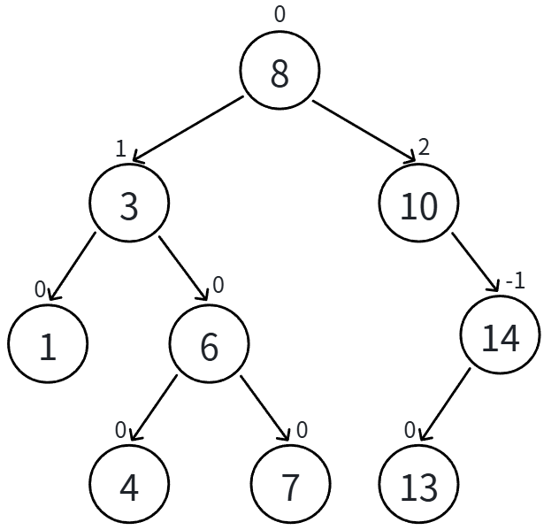
> 
> 这里的平衡因子就是根据左右子树的高度差算出来的，后续为了实现自平衡旋转机制，将平衡因子存起来会方便很多。后续还要进行修改

# 二、AVL树的结构

在已有节点的定义下，给出树的定义，其实就是一个模板：

```c++
template<class K, class V>
class AVLTree
{
    using Node = AVLTreeNode<K, V>;
public:
	//相关接口
private:
    Node* _root = nullptr;
};
```

# 三、AVL树的插入

## 3.1 AVL树插入一个值的大概过程

1. 插入一个值按二叉搜索树规则进行插入。

2. 新增结点以后，只会影响**祖先结点**的位置，也就是**可能会影响部分祖先结点的平衡因子**，所以**更新从新增结点到根结点的平衡因子**，实际上是最坏情况下要更新到根，**有些情况更新到中间就可以停止了**。

3. 更新平衡因子过程中**没有出现问题，则插入结束**。

4. 更新平衡因子过程中**出现不平衡，对不平衡子树旋转**，旋转后本质调整平衡的同时，本质降低了子树的高度，不会再影响上一层，所以插入结束。

## 3.2 平衡因子更新阶段

新节点的加入必然会增加它所在路径的局部高度。这种高度的变化可能会向上传递，影响祖先节点的平衡状态。因此，我们需要从新增节点开始，沿着 `parent` 指针一路向上更新平衡因子。

**更新原则：**

- 如果新增节点插入在 `parent` 的**右子树**，则 `parent->bf++`。
- 如果新增节点插入在 `parent` 的**左子树**，则 `parent->bf--`。

更新 `parent` 的平衡因子后，根据 `parent->bf` 的**新值**，会衍生出以下三种截然不同的处理路径：

### 3.2.1 更新后 `parent->bf == 0`

- **状态变化**：`parent->bf` 从 $1 \rightarrow 0$ 或 $-1 \rightarrow 0$。
- **原理解析**：这说明在插入前，`parent` 的子树是一边高一边低的。而我们恰好把新节点插在了**较矮**的那一边。
- **结果**：高低被填平了！`parent` 所在子树的**总高度并没有发生变化**。既然总高度没变，自然就不会影响更上层祖先的平衡因子。
- **操作**：更新结束，插入完成。

### 3.2.2 更新后 `parent->bf == 1` / `-1`

- **状态变化**：`parent->bf` 从 $0 \rightarrow 1$ 或 $0 \rightarrow -1$。
- **原理解析**：这说明在插入前，`parent` 的左右子树是一样高的（完美平衡）。现在插入了一个新节点，导致其中一边变高了。
- **结果**：虽然 `parent` 本身依然符合 AVL 树的规则（绝对值不超过 1），但 `parent` 所在子树的**总高度实打实地增加了 1**。这个高度的增加必然会影响爷爷节点（`parent` 的 `parent`）的平衡因子。
- **操作**：将当前的 `parent` 视为新的起始点，继续向上层祖先循环更新。
- **极端情况**：这种向上传递可能会一直持续，直到更新到**根节点**（此时根节点的 BF 变为 $1$ 或 $-1$），此时整棵树的高度增加了一层，更新结束。

### 3.2.3 更新后 `parent->bf == 2` / `-2`

- **状态变化**：`parent->bf` 从 $1 \rightarrow 2$ 或 $-1 \rightarrow -2$。
- **原理解析**：这说明在插入前，`parent` 的子树已经是一边高一边低了，而我们偏偏又把新节点插在了**较高**的那一边，彻底压垮了平衡。
- **结果**：`parent` 所在的子树违反了 AVL 树的性质，必须立即进行**旋转调整**。
- **旋转的双重目的**：
	1. 让这棵失衡的子树重新恢复平衡（BF 绝对值 $\le 1$）。
	2. **降低这棵子树的高度**，使其恢复到插入新节点之前的高度。
- **操作**：执行相应的旋转（LL、RR、LR 或 RL）。因为旋转后子树的高度恢复了原状，所以它不会再影响更上层祖先的平衡因子。**旋转完毕后，更新彻底结束。**

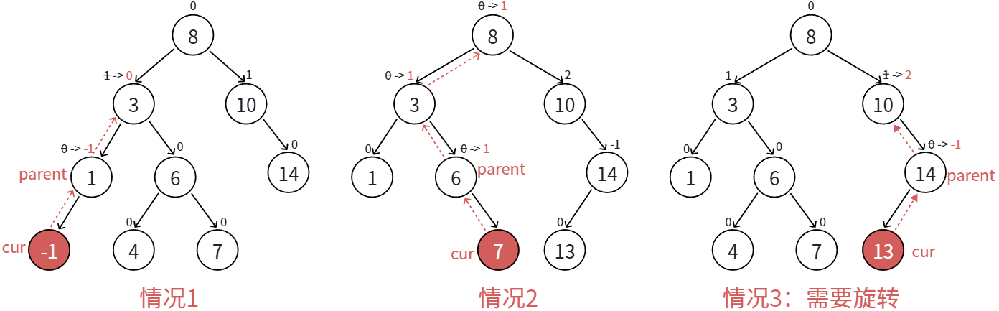

> 红色节点为插入节点。

### 3.2.4 代码实现

```c++
bool Insert(const pair<K, V>& kv)
{
	// 第一阶段：处理空树的特判
	if (_root == nullptr)
	{
		_root = new Node(kv);
		return true; // 树为空时直接插入作为根节点，插入成功
	}

	// 第二阶段：按照二叉搜索树(BST)规则寻找插入位置
	Node* cur = _root;
	Node* parent = nullptr; // parent 始终紧跟 cur，用于记录最终新节点的父节点位置
	while (cur)
	{
		if (kv.first > cur->_kv.first)
		{
			parent = cur;
			cur = cur->_right; // 插入值比当前节点大，去右子树找空位
		}
		else if (kv.first < cur->_kv.first)
		{
			parent = cur;
			cur = cur->_left;  // 插入值比当前节点小，去左子树找空位
		}
		else
		{
			return false; // 找到了相同的键值，AVL树不允许重复键值插入，插入失败
		}
	}

	// 第三阶段：新建节点并建立链接关系
	// 此时 cur 必定为空，parent 指向待插入位置的父节点
	cur = new Node(kv); 
	
	// 判断新节点应该挂在 parent 的左边还是右边
	if (kv.first > parent->_kv.first)
		parent->_right = cur;
	else
		parent->_left = cur;
		
	// 因为是三叉链表结构，必须更新新节点的 _parent 指针，实现双向绑定
	cur->_parent = parent;

	// 第四阶段：向上回溯，更新平衡因子（AVL的核心灵魂）
	// 从新增节点开始，沿着 parent 指针一路向上更新，直到到达根节点(parent为空)或触发停止条件
	while (parent)
	{
		// 1. 先根据新节点插入的位置，更新当前 parent 的平衡因子
		// 规定公式：平衡因子(_bf) = 右子树高度 - 左子树高度
		if (cur == parent->_left)
			parent->_bf--; // 插入在左边，左子树变高，bf 减小
		else
			parent->_bf++; // 插入在右边，右子树变高，bf 增大

		// 2. 根据 parent 更新后的平衡因子新值，决定后续的动作
		if (parent->_bf == 0)
		{
			// 【情况 A：完美内部消化，高度不变】
			// 说明插入前 parent 的 bf 是 1 或 -1（子树一边高一边低），
			// 而新节点恰好插在了“较矮”的那一边，把高度坑填平了。
			// 结论：parent 所在子树的总高度没有发生变化，自然不会影响更上层祖先的平衡。
			break; // 更新结束，直接跳出循环
		}
		else if (parent->_bf == -1 || parent->_bf == 1)
		{
			// 【情况 B：高度实打实增加，风险向上传递】
			// 说明插入前 parent 的 bf 是 0（左右子树完美等高），插入后导致某一边变高了。
			// 虽然 parent 自身还没有失衡（绝对值仍 <=1），但 parent 所在子树的整体高度增加了 1。
			// 这个高度增加必然会影响祖父节点的平衡状态，必须继续往上汇报！
			cur = cur->_parent;       // cur 往上爬一层
			parent = parent->_parent; // parent 跟着往上爬一层，进入下一轮循环检查
		}
		else if (parent->_bf == -2 || parent->_bf == 2)
		{
			// 【情况 C：打破平衡，必须立即施展旋转魔法】
			// 说明插入前 parent 的 bf 已经是 1 或 -1 了，树本来就有点歪，我们偏偏又把新节点插在了“较高”的那一边，成为了压死骆驼的最后一根稻草。
			// parent 所在的子树彻底失衡！
			// 接下来需要判断 cur 和 parent 的 bf 符号，执行对应的 LL、RR、LR、RL 旋转。
			// 旋转不仅能恢复平衡，还能把这棵子树的高度“压”回插入前的高度。
			// 既然高度恢复了，就不会再影响上层，所以旋转完毕后直接 break 即可。
			
			// TODO: 开始旋转代码的逻辑（目前暂未整合进来，所以用 break 跳出）
			break;
		}
		else
		{
			// 如果 bf 出现了比如 3, -3 等情况，
			// 说明在本次插入之前，这棵树就已经不是一棵合格的 AVL 树了。
			cout << "平衡因子出现绝对值大于2的情况，说明插入前树结构已经损坏" << endl;
			assert(false); // 遇到绝对不可能发生的逻辑错误，直接断言让程序崩溃，方便开发者定位 Bug
		}
	}
	
	return true; // 无论经历了内部消化、向上传递还是旋转修复，插入最终大功告成
}
```

# 四、AVL树的四种旋转

当我们在 AVL 树中插入或删除节点导致失衡时，根据失衡节点与其子节点的关系，分为四种旋转场景：

## 4.1 LL 型：左左超载 $\rightarrow$ 右单旋

- **触发条件**：新节点插入在 `parent`（节点 10）的左孩子 `subL`（节点 5）的左子树 `a` 上，导致子树 `a` 的高度从 $h$ 增加到 $h+1$。此时，`subL` 的平衡因子由 0 变为 -1，`parent` 的平衡因子由 -1 变为 -2，彻底打破平衡。
- **旋转逻辑**：单纯的左边太重了，需要以 `parent` 为轴心，将整棵树向右“掰”一下。
	1. 让 `subL` 的右子树 `subLR`（子树 b，高度为 $h$）变成 `parent` 的左子树。因为 `subLR` 上的值都大于 `subL` 且小于 `parent`，挂在 `parent` 的左边完全符合二叉搜索树（BST）规则。
	2. 让 `parent` 降级，变成 `subL` 的右孩子。
	3. `subL` 晋升为这棵子树的新根节点。
- **结果**：旋转后，`parent` 和 `subL` 的平衡因子双双清零（变为 0）。**最关键的是**，整棵子树的高度恢复到了插入前的高度（即 $h+2$），因此不需要再向上层祖先节点更新平衡因子，插入操作顺利结束。

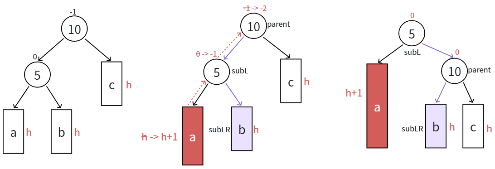

- 本图展示的是10为根的树，有a/b/c抽象为三棵高度为h的子树（h ≥ 0），a/b/c均符合AVL树的要求。10可能是整棵树的根，也可能是一个整棵树中局部的子树的根。这里a/b/c是高度为h的子树，是一种概括抽象表示，他代表了所有右单旋的场景，实际右单旋形态有很多种——就是a/b/c变换为相同的高度。

- 在a子树中插入一个新结点，导致a子树的高度从h变成h+1，不断向上更新平衡因子，导致10的平衡因子从-1变成-2，10为根的树左右高度差超过1，违反平衡规则。10为根的树左边太高了，需要往右边旋转，控制两棵树的平衡。

- 旋转核心步骤，因为5 < b子树的值 < 10，将b变成10的左子树，10变成5的右子树，5变成这棵树新的根，符合搜索树的规则，控制了平衡，同时这棵的高度恢复到插入之前的h+2，符合旋转原则。如果插入之前10整棵树的一个局部子树，旋转后不会再影响上一层，插入结束了。

> **注：这里虽然看着很简单，但旋转完不仅需要更改子树，还要修改`parent`指针，以及平衡因子。**

```c++
void RotateR(Node* parent)
{
    // 核心节点获取：parent为失衡节点(图中的10)，subL为其左孩子(图中的5)，subLR为左孩子的右子树(图中的子树b)
    Node* subL = parent->_left;
    Node* subLR = subL->_right;

    // --- 第一步：将 subLR 托付给 parent 的左孩子位置 ---
    // 因为 subL 即将上位，它的右边要腾出来给 parent，所以先把 subL 的右子树(subLR)挂到 parent 的左边
    parent->_left = subLR;
    // 如果 subLR 不为空（h=0时子树b可能为空），需要向上更新其父节点指针指向 parent
    if(subLR)
        subLR->_parent = parent;

    // --- 第二步：提前保存祖父节点 ---
    // 因为 parent 即将被降级，它的 _parent 指针会被修改，所以必须提前保存它原来的父节点(pParent)
    Node* pParent = parent->_parent;

    // --- 第三步：parent 降级，subL 上位 ---
    // 让 parent 成为 subL 的右孩子，完成核心的“右旋”动作
    subL->_right = parent;
    parent->_parent = subL;

    // --- 第四步：将上位后的 subL 重新接入整棵树 ---
    if (parent == _root)
    {
        // 情况 A：如果 parent 原本就是整棵树的根节点，那么旋转后 subL 成为新的全局根节点
        _root = subL;
        subL->_parent = nullptr;
    }
    else
    {
        // 情况 B：如果 parent 只是局部的一棵子树，需要将其接回到祖父节点 pParent 下
        // 判断 parent 原来在祖父的哪一边，就把 subL 接在相应的哪一边
        if (pParent->_left == parent)
            pParent->_left = subL;
        else
            pParent->_right = subL;
        
        // 更新 subL 的父指针，建立完整的双向链接
        subL->_parent = pParent;
    }

    // --- 第五步：更新平衡因子 ---
    // 右旋完成后，LL 型失衡被完美修复，高度恢复到插入前，两者的平衡因子双双归零
    subL->_bf = parent->_bf = 0;
}
```

## 4.2 RR 型：右右超载 $\rightarrow$ 左单旋

- **触发条件**：新节点插入在 `parent`（节点 10）的右孩子 `subR`（节点 15）的右子树 `a` 上，导致子树 `a` 的高度从 $h$ 增加到 $h+1$。此时，`subR` 的平衡因子由 0 变为 1，`parent` 的平衡因子由 1 变为 2，彻底打破平衡。
- **旋转逻辑**：单纯的右边太重了，需要以 `parent` 为轴心，将整棵树向左“掰”一下。
	1. 让 `subR` 的左子树 `subRL`（子树 b，高度为 $h$）变成 `parent` 的右子树。因为 `subRL` 上的值都大于 `parent` 且小于 `subR`，将它挂在 `parent` 的右边完全符合二叉搜索树（BST）的规则。
	2. 让 `parent` 降级，变成 `subR` 的左孩子。
	3. `subR` 晋升为这棵子树的新根节点。
- **结果**：旋转后，`parent` 和 `subR` 的平衡因子双双清零（变为 0）。**最核心的是**，整棵子树的高度恢复到了插入前的高度（即 $h+2$），因此不需要再向上层祖先节点更新平衡因子，插入操作顺利结束。

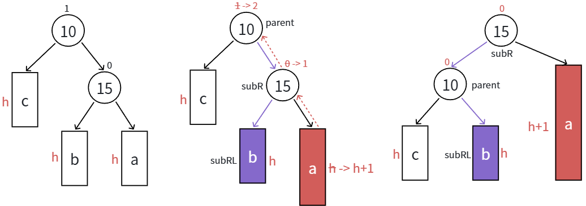

- 本图展示的是10为根的树，有a/b/c抽象为三棵高度为h的子树（h ≥ 0），a/b/c均符合AVL树的要求。10可能是整棵树的根，也可能是一个整棵树中局部的子树的根。这里a/b/c是高度为h的子树，是一种概括抽象表示，他代表了所有左单旋的场景，实际左单旋形态有很多种——就是a/b/c变换为相同的高度。

- 在a子树中插入一个新结点，导致a子树的高度从h变成h+1，不断向上更新平衡因子，导致10的平衡因子从1变成2，10为根的树左右高度差超过1，违反平衡规则。10为根的树右边太高了，需要往左边旋转，控制两棵树的平衡。

- 旋转核心步骤，因为10 < b子树的根值 < 15，将b变成10的右子树，10变成15的左子树，15变成这棵树新的根，符合搜索树的规则，控制了平衡，同时这棵的高度恢复到了插入之前的h+2，符合旋转原则。如果插入之前10整棵树的一个局部子树，旋转后不会再影响上一层，插入结束了。

> 这里跟左旋类似，也就是注意一些细节，把节点的指针情况考虑清楚即可。

```c++
void RotateL(Node* parent) 
{
    // 核心节点获取：parent为失衡节点(图10)，subR为其右孩子(图15)，subRL为右孩子的左子树(图子树b)
    Node* subR = parent->_right;
    Node* subRL = subR->_left;

    // --- 第一步：将 subRL 托付给 parent 的右孩子位置 ---
    // 因为 subR 即将上位，它的左边要腾出来给 parent，所以先把 subR 的左子树(subRL)挂到 parent 的右边
    parent->_right = subRL;
    // 如果 subRL 不为空（h=0时子树b可能为空），需要向上更新其父节点指针指向 parent
    if (subRL)
        subRL->_parent = parent;

    // --- 第二步：提前保存祖父节点 ---
    // 因为 parent 即将被降级，它的 _parent 指针会被修改，所以必须提前保存它原来的父节点(pParent)
    Node* pParent = parent->_parent;

    // --- 第三步：parent 降级，subR 上位 ---
    // 让 parent 成为 subR 的左孩子，完成核心的“左旋”动作
    subR->_left = parent;
    parent->_parent = subR;

    // --- 第四步：将上位后的 subR 重新接入整棵树 ---
    // 修正2：判断 parent 本身是否为根节点，而不是 pParent 是否为根节点
    if (parent == _root) 
    {
        // 情况 A：如果 parent 原本就是整棵树的根节点，那么旋转后 subR 成为新的全局根节点
        _root = subR;
        subR->_parent = nullptr;
    }
    else
    {
        // 情况 B：如果 parent 只是局部的一棵子树，需要将其接回到祖父节点 pParent 下
        // 判断 parent 原来在祖父的哪一边，就把 subR 接在相应的哪一边
        if (pParent->_left == parent)
            pParent->_left = subR;
        else
            pParent->_right = subR;
        
        // 更新 subR 的父指针，建立完整的双向链接
        subR->_parent = pParent;
    }

    // --- 第五步：更新平衡因子 ---
    // 左旋完成后，RR 型失衡被完美修复，高度恢复到插入前，两者的平衡因子双双归零
    subR->_bf = parent->_bf = 0;
}
```

## 4.3 分辨单旋 / 双旋

前面的单旋（LL 和 RR）处理的是“直线”型的超载。而双旋处理的则是**“折线”型**的超载。

在代码中，我们是通过判断**失衡节点 (`parent`)** 和它**引发失衡的孩子节点 (`cur`)** 的平衡因子（bf）的**正负号**来分辨的：

1. **符号相同 $\rightarrow$ “直线型”，用单旋**
	- `parent` 为 -2，`cur` 为 -1（左边重，左孩子的左边重）：LL 型，**右单旋**。
	- `parent` 为 2，`cur` 为 1（右边重，右孩子的右边重）：RR 型，**左单旋**。
2. **符号相反 $\rightarrow$ “折线型”，用双旋**
	- `parent` 为 -2，`cur` 为 1（左边重，但左孩子的**右边**重）：**LR 型，左右双旋**。
	- `parent` 为 2，`cur` 为 -1（右边重，但右孩子的**左边**重）：**RL 型，右左双旋**。

**为什么不能用单旋解决“折线型”**——假设我们遇到 **LR 型（左孩子的右边重）**，如果你强行对 `parent` 进行一次右单旋，你会发现原来的左孩子被提上去了，但左孩子那颗沉重的右子树会挂到 `parent` 的左边，导致树变成**右边重**，依然不平衡！

所以，“折线”必须先被“拉直”，这就是双旋的意义。

## 4.4 LR 型：左右超载 $\rightarrow$ **左右双旋**

下面我们将 $a/b/c$ 子树抽象为高度 $h$ 的 AVL 子树进行分析。另外，我们需要把 $b$ 子树的细节进一步展开为 **8** 和左子树高度为 $h-1$ 的 **$e$** 和 **$f$** 子树，因为我们要对 $b$ 的父亲 **5** 为旋转点进行**左单旋**，左单旋需要动 $b$ 树中的左子树。$b$ 子树中新增结点的位置不同，平衡因子更新的细节也不同，通过观察 **8 的平衡因子**不同，这里我们要分三个场景讨论：

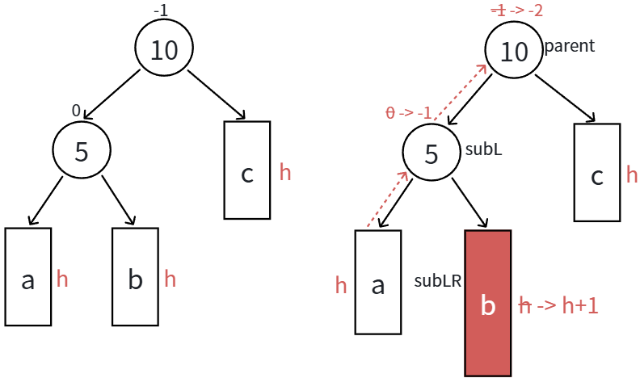

### 4.4.1 场景 1：$h = 0$ 时，$a/b/c$ 都是空树

这是最基础的情况，发生在树的底层叶子节点位置。

- **初始状态**：`subLR`(8) 本身就是新插入的节点（或者原本 5 和 10 都是叶子）。
- **平衡因子**：`parent`(10) bf=-1，`subL`(5) bf=0。插入节点 8 后：`subL`(5) bf=1, `parent`(10) bf=-2。**核心关键：此时 `subLR`(8) 的初始 bf 为 0。**
- **旋转过程**：
	1. 对节点 5 进行左单旋（8 上位成 5 的父节点，5 成为 8 的左孩子）。
	2. 对节点 10 进行右单旋（8 继续上位成 10 的父节点，10 成为 8 的右孩子）。
- **最终 BF 分配**：
	- `subL`(5) 左右均无孩子：**bf = 0**。
	- `parent`(10) 左右均无孩子：**bf = 0**。
	- `subLR`(8) 晋升为新根，左右完美平衡：**bf = 0**。

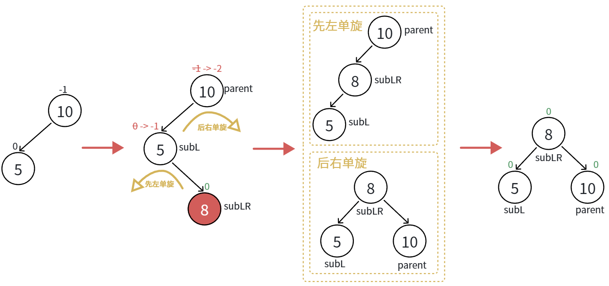

### 4.4.2 场景2：$h \ge 1$ 时，新增结点插入在 $e$ 子树

这是“折线”型失衡最经典的展现。

- **核心前提**：如图所示，`subLR`(8) 的左子树 `e` 增高了 1 层（高度变为 $h$），而其右子树 `f` 高度仍为 $h-1$。

- **此时平衡因子（旋转前）**：

	- `parent`(10) bf = -2。
	- `subL`(5) bf = 1。
	- **核心关键：由于插在 e，`subLR`(8) 的初始 bf 为 -1**（左高右低）。

- **旋转过程（结合图中的指针变化盒）**：

	- **步骤 1 (先左单旋 subL)**：`subLR`(8) 上位。它原本的左子树 `e`(h) 会断开，重新挂在降级后的 `subL`(5) 的右孩子位置。
	- **步骤 2 (后右单旋 parent)**：`subLR`(8) 继续上位。它原本的右子树 `f`(h-1) 会断开，重新挂在降级后的 `parent`(10) 的左孩子位置。

- **最终 BF 演算（决定 BF 更新的关键）**：

	根据最终生成的树（最右图）：

	- **`subL`(5)**：它的左边是原本高度为 $h$ 的 `a` 子树，旋转后它的右边接手了 `subLR`(8) 的原本高度为 $h$ 的 **`e` 子树**。

		$$\text{BF}(5) = \text{Right}(h) - \text{Left}(h) = 0$$

	- **`parent`(10)**：它的左边接手了 `subLR`(8) 的引发失衡的、高度为 $h-1$ 的 **`f` 子树**，它的右边是原本高度为 $h$ 的 `c` 子树。

		$$\text{BF}(10) = \text{Right}(h) - \text{Left}(h-1) = 1$$

	- **`subLR`(8)**：成为新的根节点，两边完美平衡。**bf = 0**。

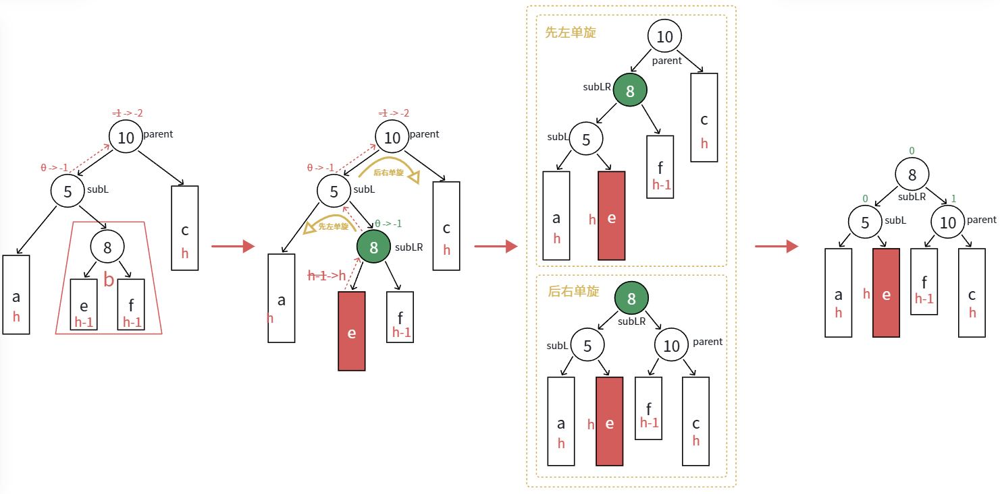

###  4.4.3 场景 3：$h \ge 1$ 时，新增结点插入在 $f$ 子树

这是场景 2 的镜像逻辑。

- **核心前提**：如图所示，新节点插在了 `subLR`(8) 的右子树 `f` 上。导致 `f` 高度为 $h$，`e` 高度仍为 $h-1$。

- **此时平衡因子（旋转前）**：

	- `parent`(10) bf = -2。
	- `subL`(5) bf = 1。
	- **核心关键：由于插在 f，`subLR`(8) 的初始 bf 为 1**（右高左低）。

- **最终 BF 演算（决定 BF 更新的关键）**：

	指针断开与重连的逻辑与场景 2 完全一样，唯一的不同是 `e` 和 `f` 的高度对调了。根据最终生成的树（最右图）：

	- **`subL`(5)**：左边是 `a`(h)，右边接手了高度为 $h-1$ 的 **`e` 子树**。$$\text{BF}(5) = \text{Right}(h-1) - \text{Left}(h) = -1$$
	- **`parent`(10)**：左边接手了引发失衡的、高度为 $h$ 的 **`f` 子树**，右边是 `c`(h)。$$\text{BF}(10) = \text{Right}(h) - \text{Left}(h) = 0$$
	- **`subLR`(8)**：成为新的根节点。**bf = 0**。

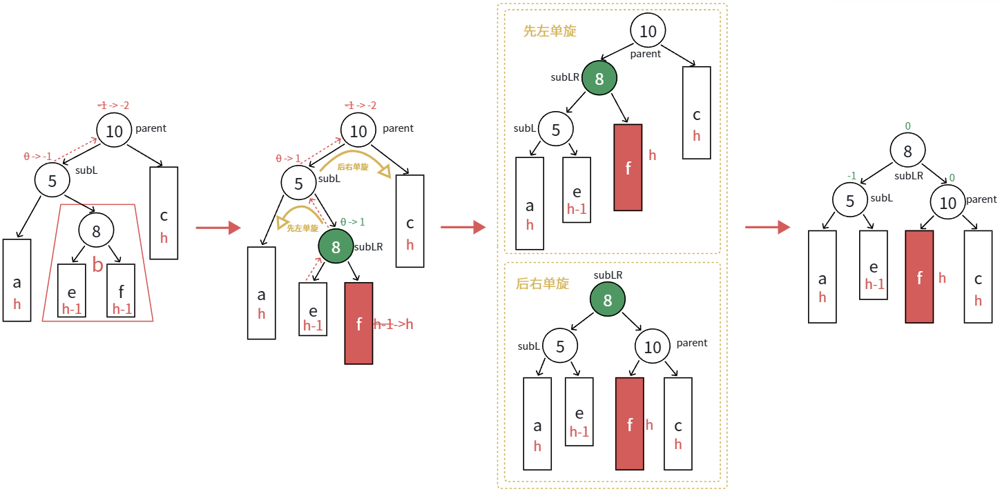

```c++
void RotateLR(Node* parent)
{
	// 获取三个核心节点的指针
	Node* subL = parent->_left;    // 图中的节点 5
	Node* subLR = subL->_right;    // 图中的节点 8 (即将连续上位两次的核心)

	// 记录节点 8 初始的平衡因子。这是判断新节点到底插在 e 还是 f 的唯一线索！
	// 必须在调用单旋前记录，否则会被单旋函数内部强制清 0。
	int bf = subLR->_bf;

	// 执行“双旋连招”修改物理指针连接
	RotateL(subL);   // 局部左旋：以 5 为轴，拉直折线，8 成为 5 的父节点
	RotateR(parent); // 整体右旋：以 10 为轴，恢复平衡，8 成为 10 的父节点

	// 此时指针已经全部连对，但 bf 被单旋函数改错了，我们需要根据刚才保存的线索修正
	if (bf == -1)
	{
		// 对应图解中的情况 2：新节点插在 8 的左子树 (e 子树)
		// 5 的右边接手了变高的 e，所以 5 完美平衡；10 的左边接手了较矮的 f，所以 10 右边偏重。
		subL->_bf = 0;
		parent->_bf = 1;
		subLR->_bf = 0; // 8 作为新根，永远是 0
	}
	else if (bf == 1)
	{
		// 对应图解中的情况 3：新节点插在 8 的右子树 (f 子树)
		// 5 的右边接手了较矮的 e，所以 5 左边偏重；10 的左边接手了变高的 f，所以 10 完美平衡。
		subL->_bf = -1;
		parent->_bf = 0;
		subLR->_bf = 0; // 8 作为新根，永远是 0
	}
	else if (bf == 0)
	{
		// 8 本身就是那个新插入的叶子节点。旋转后 5 和 10 都没有子树，全员完美平衡。
		subL->_bf = 0;
		parent->_bf = 0;
		subLR->_bf = 0;
	}
	else
	{
		// 异常拦截：如果走到这里，说明在插入这个新节点之前，这棵树就已经不是 AVL 树了。
		// 比如 bf 出现了 2 或 -2，这是逻辑上的灾难，直接断言报错。
		cout << "旋转前非平衡（bf为绝对值大于1的脏数据）" << endl;
		assert(false);
	}
}
```

为什么还需要继续更新平衡因子：

一句话解释：**因为底层的单旋函数（`RotateL` 和 `RotateR`）是“盲目”的，它们会把正确的平衡因子粗暴地覆盖掉。**

1. **单旋的局限性**：当你单独调用 `RotateR(parent)` 来解决纯粹的 LL 型失衡时，整棵子树确实完美平衡了，所以我们在单旋代码的最后写了 `subL->_bf = parent->_bf = 0;`。单旋函数只负责它眼前的这几个节点，它并不知道自己此刻是作为“双旋连招”的一部分被调用的。
2. **双旋的全局观**：在 LR 双旋中，节点 8（`subLR`）的左右子树是被**拆分**开的（左边给了 5，右边给了 10）。这就导致最终节点 5 和节点 10 的高度并不一定完美相等（也就是我们刚才推导的 $1$ 和 $-1$ 的情况）。
3. **覆盖惨案**：如果你在 `RotateLR` 里只写 `RotateL(subL); RotateR(parent);`，那么在这两次单旋结束时，它们内部的代码会强制把节点 5、8、10 的 `_bf` **全部变成 0**。这掩盖了树的真实高度差！

**所以，解决办法就是：** 在被单旋函数把现场“破坏”（清零）之前，我们先用 `int bf = subLR->_bf;` **把现场的真实情况保存下来**。等单旋函数执行完，我们再根据保存的线索，**手动把正确的平衡因子覆盖回去**。

## 4.5 RL 型：右左超载 $\rightarrow$ **右左双旋**

跟左右双旋类似，下⾯我们将$a/b/c$⼦树抽象为⾼度$h$的AVL⼦树进⾏分析，另外我们需要把$b$⼦树的细节进⼀步展开为**12**和左⼦树⾼度为 $h-1$ 的 $e$ 和 $f$ ⼦树，因为我们要对 $b$ 的⽗亲**15**为旋转点进⾏**右单旋**，右单旋需要动 $b$ 树中的右⼦树。$b$ ⼦树中新增结点的位置不同，平衡因⼦更新的细节也不同，通过观察**12的平衡因⼦**不同，这⾥我们要分三个场景讨论:

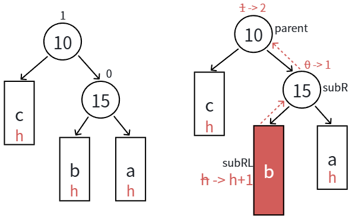


### 4.5.1 场景 1：$h == 0$ 时，a/b/c 都是空树

这是最基础的底层情况。

- **核心前提**：此时子树的高度为 0，`b` 自己就是那个刚刚被插入的新增结点（即 `subRL`(12)）。

- **此时平衡因子（旋转前）**：

	- `parent`(10) bf = 2。
	- `subR`(15) bf = -1。
	- **核心关键**：由于自身是新增叶子节点，`subRL`(12) 的初始 **bf 为 0**。

- **最终 BF 演算（决定 BF 更新的关键）**：

	大家都没有额外的子树。节点 12 上位后，把 10 挂在左边，15 挂在右边。根据最终生成的树（最右图）：

	- `parent`(10)：左右皆为空。$\text{BF}(10) = 0 - 0 = 0$
	- `subR`(15)：左右皆为空。$\text{BF}(15) = 0 - 0 = 0$
	- `subRL`(12)：成为新的根节点。**bf = 0**。

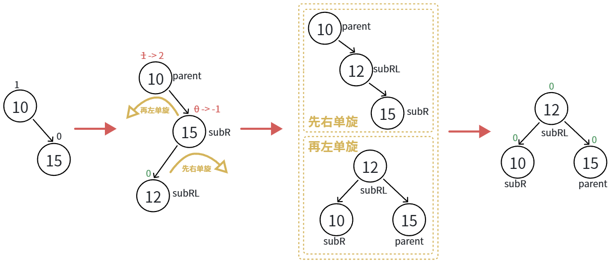


### 4.5.2 场景 2：$h \ge 1$ 时，新增结点插入在 $e$ 子树

这是最典型的折线失衡场景之一。

- **核心前提**：如图所示，新节点插在了 `subRL`(12) 的左子树 `e` 上。导致 `e` 高度为 $h$，`f` 高度仍为 $h-1$。

- **此时平衡因子（旋转前）**：

	- `parent`(10) bf = 2。
	- `subR`(15) bf = -1。
	- **核心关键**：由于插在 `e`，`subRL`(12) 的初始 **bf 为 -1**（左高右低）。

- **最终 BF 演算（决定 BF 更新的关键）**：

	在 RL 双旋中，节点 12 连续上位，将其左子树 `e` 交给 10 当右孩子，将其右子树 `f` 交给 15 当左孩子。根据最终生成的树（最右图）：

	- `parent`(10)：左边是原有的 `c`($h$)，右边接手了变高的高度为 $h$ 的 `e` 子树。$\text{BF}(10) = \text{Right}(h) - \text{Left}(h) = 0$
	- `subR`(15)：左边接手了高度为 $h-1$ 的 `f` 子树，右边是原有的 `a`($h$)。$\text{BF}(15) = \text{Right}(h) - \text{Left}(h-1) = 1$
	- `subRL`(12)：成为新的根节点。**bf = 0**。


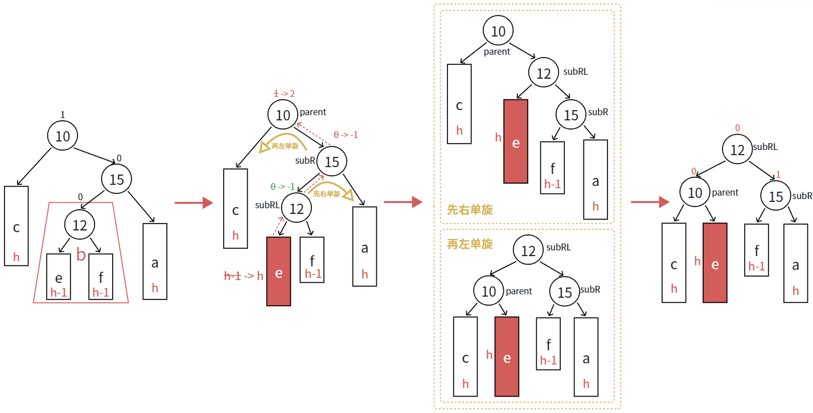


### 4.5.3 场景 3：$h \ge 1$ 时，新增结点插入在 $f$ 子树

这是场景 2 的镜像逻辑。

- **核心前提**：如图所示，新节点插在了 `subRL`(12) 的右子树 `f` 上。导致 `f` 高度为 $h$，`e` 高度仍为 $h-1$。

- **此时平衡因子（旋转前）**：

	- `parent`(10) bf = 2。
	- `subR`(15) bf = -1。
	- **核心关键**：由于插在 `f`，`subRL`(12) 的初始 **bf 为 1**（右高左低）。

- **最终 BF 演算（决定 BF 更新的关键）**：

	指针断开与重连的逻辑与场景 1 完全一样，唯一的不同是 `e` 和 `f` 的高度对调了。根据最终生成的树（最右图）：

	- `parent`(10)：左边是原有的 `c`($h$)，右边接手了高度为 $h-1$ 的 `e` 子树。$\text{BF}(10) = \text{Right}(h-1) - \text{Left}(h) = -1$
	- `subR`(15)：左边接手了引发失衡的、高度为 $h$ 的 `f` 子树，右边是原有的 `a`($h$)。$\text{BF}(15) = \text{Right}(h) - \text{Left}(h) = 0$
	- `subRL`(12)：成为新的根节点。**bf = 0**。

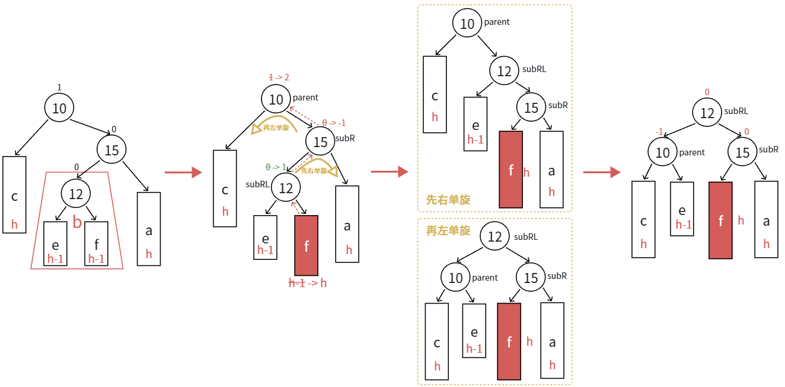

这里代码跟 LR 基本一致，无非就是先怎么旋转的问题，还有最后平衡因子的处理细节不一致：

```c++
void RotateRL(Node* parent)
{
	// 获取三个核心节点的指针 以刚才的图解为例：parent是10，subR是15，subRL是12
	Node* subR = parent->_right;
	Node* subRL = subR->_left;

	// 记录节点 12 (subRL) 初始的平衡因子。
	// 这是判断新节点到底插在 e(左边) 还是 f(右边) 的唯一线索！
	// 必须在调用单旋前记录，否则会被单旋函数内部的 _bf = 0 强制覆盖。
	int bf = subRL->_bf;

	// 核心过继法则：旋转后，10(parent) 的右边一定挂着 e；15(subR) 的左边一定挂着 f。
	RotateR(subR);   // 局部右旋：以 15 为轴，拉直折线 ( > 型变成 \ 型 )，12 成为 15 的父节点
	RotateL(parent); // 整体左旋：以 10 为轴，恢复平衡，12 成为 10 的父节点

	// 此时底层指针已经连对，我们根据保存的初始 bf，覆盖掉单旋造成的错误 0
	if (bf == -1)
	{
		// 对应场景 2：新节点插在 12 的左子树 (e 子树)，此时 e 高度为 h，f 高度为 h-1
		// 10 的右边接手了变高的 e，所以 10 完美平衡；15 的左边接手了较矮的 f，所以 15 右边偏重。
		subR->_bf = 1;      // 15 右边偏重
		subRL->_bf = 0;     // 12 作为新根，永远是 0
		parent->_bf = 0;    // 10 完美平衡
	}
	else if (bf == 1)
	{
		// 对应场景 3：新节点插在 12 的右子树 (f 子树)，此时 f 高度为 h，e 高度为 h-1
		// 10 的右边接手了较矮的 e，所以 10 左边偏重；15 的左边接手了变高的 f，所以 15 完美平衡。
		subR->_bf = 0;      // 15 完美平衡
		subRL->_bf = 0;     // 12 作为新根，永远是 0
		parent->_bf = -1;   // 10 左边偏重
	}
	else if (bf == 0)
	{
		// 对应场景 1：h = 0
		// 12 本身就是那个新插入的叶子节点。大家都没有多余的子树，全员完美平衡。
		subR->_bf = 0;
		subRL->_bf = 0;
		parent->_bf = 0;
	}
	else
	{
		// 异常拦截：理论上绝对走不到这里，除非插入前这棵树就已经不是合法的 AVL 树了
		cout << "旋转前非平衡（bf为绝对值大于1的脏数据）" << endl;
		assert(false);
	}
}
```

# 五、AVL树的查找、平衡检测

## 5.1 查找

```c++
Node* Find(const K& key)
{
	//从整棵树的根节点开始往下搜索
	Node* cur = _root;

	// 只要当前节点不为空，就继续顺着树干往下找
	while (cur)
	{
		// 如果目标 key 比当前节点的 key 大 说明目标如果存在，一定在当前节点的右子树中
		if (key > cur->_kv.first)
			cur = cur->_right; // 向右边走
		// 如果目标 key 比当前节点的 key 小 说明目标如果存在，一定在当前节点的左子树中
		else if (key < cur->_kv.first)
			cur = cur->_left;  // 向左边走
		// 既不大于也不小于，说明恰好相等
		else
			return cur; // 找到了 直接返回当前节点的指针
	}
	// 循环结束了（cur 变成了 nullptr） 说明找遍了整条路径都没找到相等的 key，也就是这棵树里没有这个值
	return nullptr;
}
```

就是简单的二叉搜索树的查找而已

## 5.2 平衡检测

```c++
bool _IsBalanceTree(Node* root)
{
	// 递归的终止条件：空树也是一种完美的平衡树
	if (root == nullptr)
		return true;
		
	// 分别计算当前节点左子树和右子树的真实高度
	int leftheight = _Height(root->_left);
	int rightheight = _Height(root->_right);
	
	// 计算真实的高度差（规定：右子树高度 - 左子树高度）
	int diff = rightheight - leftheight;

	// 检查真实结构是否符合 AVL 树的硬性规定 如果绝对值 >= 2，说明树在物理结构上已经倾斜失衡了
	if (abs(diff) >= 2)
	{
		cout << root->_kv.first << " 高度差异常 (真实高度差: " << diff << ")" << endl;
		return false;
	}

	// 检查我们手动维护的逻辑变量 (_bf) 是否正确 就算树的物理结构是平衡的，如果之前旋转时 _bf 写错了，这里也会被揪出来！
	if (root->_bf != diff)
	{
		cout << root->_kv.first << " 平衡因子异常 (记录的_bf: " << root->_bf << ", 真实的差值: " << diff << ")" << endl;
		return false;
	}

	// 如果当前节点完美通过测试，则继续递归检查它的左孩子和右孩子 必须左子树和右子树都是 AVL 树，整体才算是 AVL 树
	return _IsBalanceTree(root->_left) && _IsBalanceTree(root->_right);
}
```

虽然上面的代码逻辑正确，但存在一个经典的性能陷阱：**重复计算高度**。

- 当你在根节点调用 `_IsBalanceTree` 时，`_Height` 函数会把整棵树遍历一遍。
- 当递归检查到根节点的左孩子时，`_Height` 函数又会把左子树全部遍历一遍。
- ...以此类推。越是底层的节点，被 `_Height` 重复访问的次数就越多。

这会导致这棵树在最坏情况下的时间复杂度退化为 $O(N^2)$。作为高度优化的 AVL 树，用来检测平衡的函数性能这么差显然是不完美的。

优化的核心思路是**“后序遍历”（Bottom-Up）**——我们在求高度的同时，顺便把平衡状态也检查了。如果底层的子树已经不平衡了，直接向上返回一个错误标志（比如 `-1`），上层节点收到 `-1` 后直接熔断退出，不再做无用功。

这种方法只需要把整棵树遍历**一次**，时间复杂度降为绝对的 $O(N)$。

```c++
// 对外暴露的公有接口：判断整棵树是否是一棵合法的 AVL 树
bool IsBalanceTreeOpt()
{
	// 如果底层检测返回的不是 -1（即返回了正常的树高），说明整棵树没问题，返回 true
	// 如果收到了底层的 -1 报错信号，说明树已经坏了，返回 false
	return _CheckHeightAndBalance(_root) != -1;
}
// 私有核心功能函数：采用“后序遍历”（左 -> 右 -> 根）
// 一边自底向上计算高度，一边验证物理高度差和逻辑 _bf 是否匹配
int _CheckHeightAndBalance(Node* root)
{
	// 递归终止条件（到达叶子节点的下一层）  空节点的高度是 0，且绝对平衡
	if (root == nullptr)
		return 0;
	// 深入左子树，索要左子树的真实高度
	int leftHeight = _CheckHeightAndBalance(root->_left);
	// 如果左子树已经发现异常并扔出了 -1，当前节点什么都不用算，直接把 -1 继续往上抛，直接中断整棵树的检查
	if (leftHeight == -1)
		return -1;
	// 深入右子树，索要右子树的真实高度
	int rightHeight = _CheckHeightAndBalance(root->_right);
	// 同理，右子树异常，立刻往上抛 -1
	if (rightHeight == -1)
		return -1;
	// 当代码走到这里，说明左右子树不仅都算出了高度，而且它们内部都是完全健康的 AVL 树！
	// 现在开始核对当前节点 root 自己的账本：
	int diff = rightHeight - leftHeight;
	// 物理结构核对（右高度 - 左高度，绝对值不能超过 1）
	if (abs(diff) >= 2)
	{
		cout << "节点 " << root->_kv.first << " 高度差异常 (真实高度差: " << diff << ")" << endl;
		return -1; // 发现物理失衡，立即向父节点发射 -1 错误信号
	}
	// 逻辑账本核对 即使物理上看起来没问题，但如果你之前旋转时把 _bf 写错了，也必须揪出来！
	if (root->_bf != diff)
	{
		cout << "节点 " << root->_kv.first << " 平衡因子异常 (记录的_bf: " << root->_bf << ", 真实的差值: " << diff << ")" << endl;
		assert(false); // _bf 记错是极其严重的逻辑漏洞，直接断言报错，让程序在此处崩溃，方便你 Debug
	}
	// 当前节点完美通关所有测试  计算并向上一层（父节点）汇报自己的真实高度：左右子树中较高的那个高度 + 1（自己这一层）
	return (leftHeight > rightHeight ? leftHeight : rightHeight) + 1;
}
```

# 六、AVL树的性能

AVL 树的所有复杂设计（平衡因子、四种旋转），本质上都是为了达成一个终极目标：**绝对的高度控制**。

## 6.1 性能基石

在普通的二叉搜索树（BST）中，最坏情况（如顺序插入）下，树会退化成链表，高度变为 $N$。

而在 AVL 树中，由于严格要求任意节点的左右子树高度差绝对值 $\le 1$，它的形态极其接近完全二叉树。

在数学上，一棵包含 $N$ 个节点的 AVL 树，其最大高度 $h$ 被严格限制在： $$h \approx 1.44 \log_2(N + 2)$$

这意味着，即便你的树里有 **10 亿**个节点，树的高度也仅仅在 **30 层**左右。这个 $O(\log N)$ 的高度，就是 AVL 树极速性能的物理保障。

## 6.2 核心操作复杂度

| **操作**          | **平均时间复杂度** | **最坏时间复杂度** | **性能剖析**                                                 |
| ----------------- | ------------------ | ------------------ | ------------------------------------------------------------ |
| **查找 (Find)**   | $O(\log N)$        | $O(\log N)$        | **极速且稳定**。最多只需比较“树的高度”次，即使在最极端情况下也不会退化。 |
| **插入 (Insert)** | $O(\log N)$        | $O(\log N)$        | 包含两步：向下查找位置 $O(\log N)$ + 向上更新平衡因子 $O(\log N)$。**精妙之处在于**：插入操作引发的失衡，最多只需要 **1 次单旋或 1 次双旋**（耗时 $O(1)$）即可彻底恢复整棵树的平衡，不需要一直旋转到根节点。 |
| **删除 (Erase)**  | $O(\log N)$        | $O(\log N)$        | **代价最高的操作**。查找和删除节点耗时 $O(\log N)$。但与插入不同，删除一个节点可能会导致整棵子树的高度降低，这种“高度降低”可能会向上传递，导致其父节点、祖父节点接连失衡。因此，删除操作在最坏情况下，**可能需要一路旋转到根节点**，最多执行 $O(\log N)$ 次旋转。 |

## 6.3 空间复杂度

- **节点存储**：存储 $N$ 个元素，必然需要 $O(N)$ 的空间。
- **附加消耗**：为了维持平衡，每个节点除了存储数据（键值对）和左右指针外，还必须额外存储：
	1. **平衡因子 (`_bf`)** 或高度值（通常占 4 字节的 `int`）。
	2. **父指针 (`_parent`)**（在三叉链实现中，占 8 字节），用于向上回溯。
- **总结**：空间复杂度为 $O(N)$，但常数项比普通 BST 略大（每个节点多消耗了 12 字节左右的控制信息）。