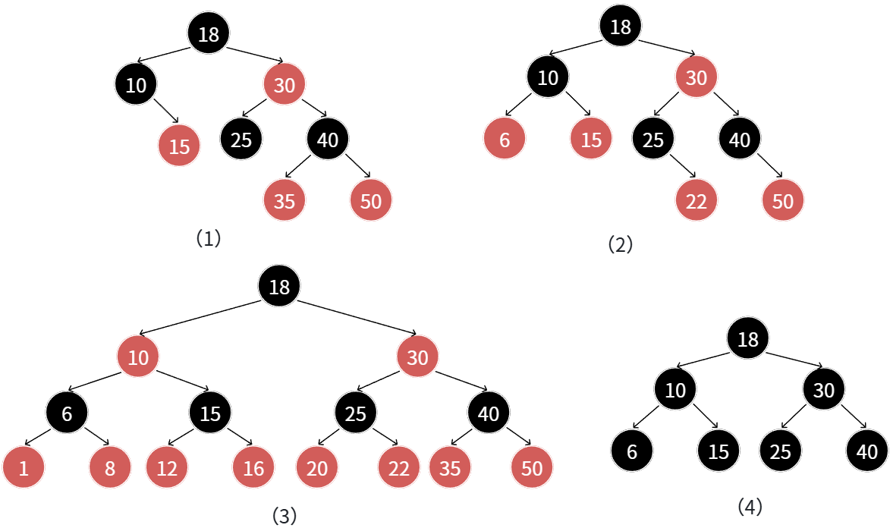
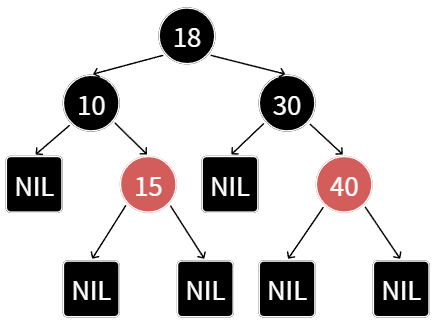
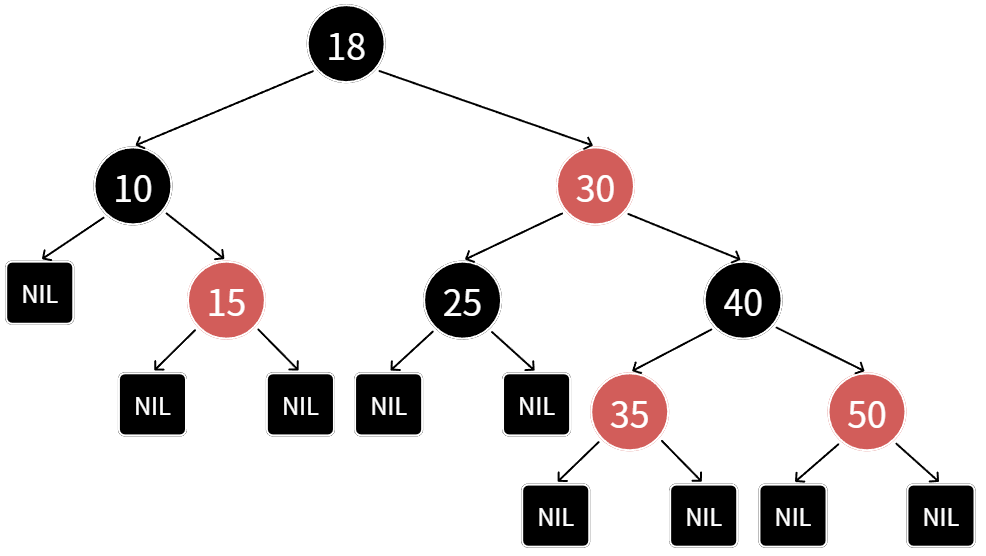
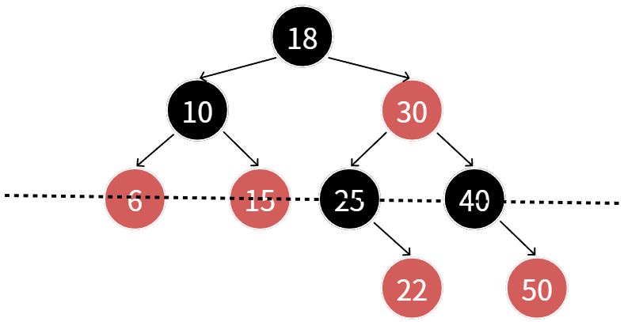
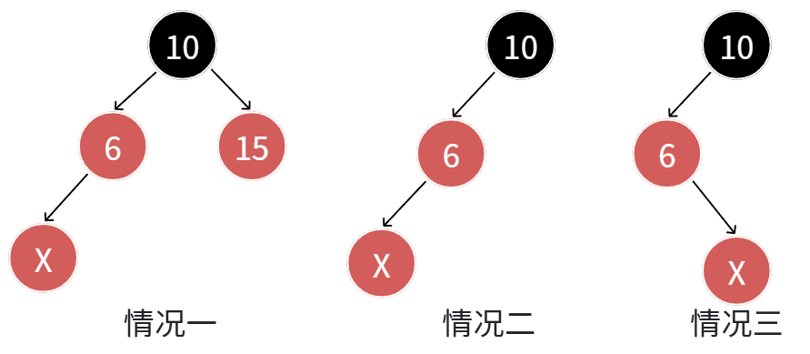
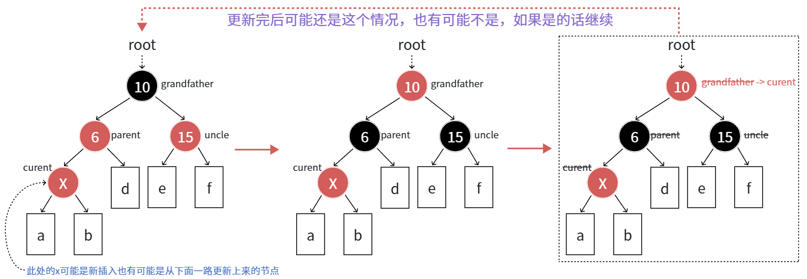
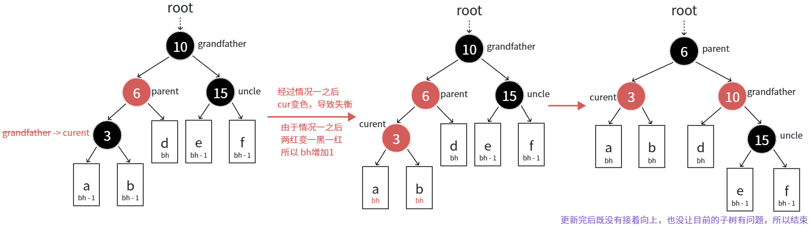
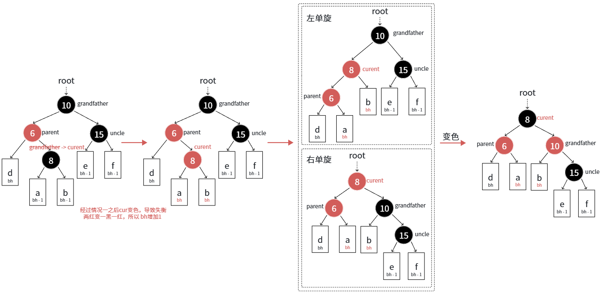

# 一、红黑树的概念

红黑树（Red-Black Tree）是计算机科学中一种经典的**自平衡二叉搜索树**。在实际应用中，它被广泛用于 C++ 的 STL（如 `map`, `set`）中。相比于追求极致平衡的 AVL 树，红黑树通过一种“弱平衡”策略，在保持高效查找的同时，大幅降低了插入和删除时的调整成本。

## 1.1 红黑树的概念和性质

红黑树（red-black tree）是这样的一棵二叉搜索树：树中的每一个结点的颜色不是黑色就是红色。可以把一棵红黑树视为一棵扩充二叉树，用外部结点表示空指针。其特性描述如下：

- **特性 1：** 根结点和所有外部结点的颜色是黑色。（**根外黑**）
- **特性 2：** 从根结点到外部结点的途中没有连续两个结点的颜色是红色。（**不红红**）
- **特性 3：** 所有从根到外部结点的路径上都有相同数目的黑色结点。（**黑路同**）

从红黑树中任一结点 $x$ 出发（不包括结点 $x$），到达一个**外部结点**的任一路径上的**黑结点个数**叫做结点 $x$ 的**黑高度**，亦称为结点的**阶（rank）**，记作 $bh(x)$。红黑树的黑高度定义为其根结点的黑高度。

这里给出一些符合红黑树的图：



上面描述为到外部节点的路径，其实就是到空节点的路径中黑色节点的个数为相同的，这里也给出一个包含外部节点的红黑树的例子：



## 1.2 核心规则

红黑树之所以能自动平衡，全靠这五条铁律。如果一个二叉搜索树满足以下性质，它就是红黑树：

1. **节点非红即黑**：每个节点要么是红色，要么是黑色。
2. **根节点是黑色**。
3. **叶子节点（NIL节点）是黑色**：这里的叶子是指为空（NULL）的末端节点。
4. **红色节点不连续**：红色节点的子节点必须是黑色（即**不能有两个连续的红节点**）。
5. **黑高平衡**：从任一节点到其每个**外部节点**的**所有简单路径**，包含**相同数目的黑色节点**。

这五条规则共同作用，产生了一个至关重要的数学效果：

> **结论：最长路径不超过最短路径的两倍。**

- **最短路径**：全是黑色节点组成的路径（路径长度 = $r$）。
- **最长路径**：由黑色和红色节点交替组成的路径（因为红不能连红，所以最多有 $r$ 个黑和 $r$ 个红，路径长度 = $2r$）。

**由于所有路径的黑节点数必须相等，因此红色节点只能在黑色节点之间“插缝”。只要满足上述规则，这棵树就永远处于“弱平衡”状态，不会退化成链表。**

## 1.3 几何约束：2 倍

红黑树通过**规则 4（不红红）**和**规则 5（黑高平衡）**的组合，在数学上产生了一个极其精妙的几何约束。要理解这个“2倍”结论，我们需要对比红黑树中可能出现的**极端路径情况**。

### 1.3.1 抽象理解

**黑高度**——根据规则 5：**从根节点到每个叶子节点的所有路径，必须包含相同数量的黑色节点。**假设这个固定的黑色节点数量为 $r$（即黑高度）。这意味着，无论哪条路径，其“骨架”都是由这 $r$ 个黑节点构成的。

**最短路径（全黑路径）**——在满足规则的前提下，最短的路径必须全部由黑色节点组成。路径构成：黑 → 黑 → 黑 ... (共 $r$ 个)，**路径长度 = $r$**。

**最长路径（黑红相间路径）**——为了让路径尽可能长，我们需要在黑色节点之间插入尽可能多的红色节点。但此时受到了**规则 4（红色节点不能连续）**的限制：两个红色节点之间必须至少隔着一个黑色节点。路径的最末端（外部节点）必须是黑色（规则 3）。

因此，最长的情况是：**黑 → 红 → 黑 → 红 → 黑...** 这种交替结构。在这种交替结构中，红色节点的数量最多只能等于黑色节点的数量（即 $r$ 个）。**路径长度 = $r$（黑） + $r$（红） = $2r$**。

### 1.3.2 数学证明与结论

对于红黑树中的任意两条路径 $P$ 和 $Q$：

- 所有路径的黑节点数都是 $r$。
- 任何路径 $L$ 的长度 $PL(L)$ 范围必然在：$r \le PL(L) \le 2r$。
- 由此可得，最长路径 $PL_{max} = 2r$，最短路径 $PL_{min} = r$。
- **结论：$PL_{max} = 2 \times PL_{min}$**

> **直观理解**：黑色节点就像是树的“脊椎”，规定了树的基础高度。红色节点像是“填充物”，但规则规定你不能连续塞入填充物。既然每条路径的脊椎（黑节点）数量一样多，而填充物（红节点）最多只能和脊椎一样多，那么最长的路径自然也就不会超过最短路径的两倍。

### 1.3.3 设计意义

这种“两倍”的约束被称为**弱平衡**。

- **对比 AVL 树**：AVL 树要求高度差绝对不超过 1（强平衡）。
- **红黑树的优势**：虽然它的搜索效率比 AVL 略低（因为树可能更高一点），但它在**插入和删除**时，由于平衡要求没那么苛刻，触发旋转调整的次数大大减少。

### 1.3.4 举例



**计算黑高度**——根据红黑树规则：从根节点到每个叶子节点（NIL）的黑色节点数量必须相等。我们随机选几条路径观察：

- **路径 1**：18(黑) → 10(黑) → NIL(黑) = **3 个黑节点**
- **路径 2**：18(黑) → 30(红) → 25(黑) → NIL(黑) = **3 个黑节点**
- **路径 3**：18(黑) → 30(红) → 40(黑) → 35(红) → NIL(黑) = **3 个黑节点**

在这棵树中，**黑高度 $r = 3$**。黑色节点支撑起了树的基本高度。

**寻找“最短路径”**——最短路径是那种**红色节点最少**（甚至没有）的路径。

- **具体路径**：根节点 `18` 到左侧的 `NIL`。
- **路径组成**：18(黑) → 10(黑) → NIL(黑)。
- **指针长度**（边数）：**2**。
- **特点**：没有任何红色节点，完全由“脊椎”组成。

**寻找“最长路径”**——最长路径是那种**红色节点最多**的路径。由于规则限制“红色不能连续”，所以红色节点只能在黑色节点之间交替出现。

- **具体路径**：根节点 `18` 到右下角的 `NIL`（经过 35 或 50）。
- **路径组成**：18(黑) → 30(红) → 40(黑) → 50(红) → NIL(黑)。
- **指针长度**（边数）：**4**。
- **特点**：黑色和红色交替，达到了红色节点数量的极限。

我们把这棵图中的数据带入公式：

1. **黑高度限制**：每条路径必须有 3 个黑节点（包含 NIL）。
2. **红色干扰**：在 3 个黑节点之间，最多只能插入 2 个红节点（18 和 30 之间，30 和 40 之间，以此类推，但不能连红）。
3. **计算结果**：
	- **最短路径长度** = $3 - 1 = 2$ （即 2 条边）。
	- **最长路径长度** = $(3 + 2) - 1 = 4$ （即 4 条边）。

**结论**：即使在图中右侧路径由于存在 `30`、`35`、`50` 等红节点显得比左侧“茂盛”很多，但由于它必须遵守“黑高一致”和“红不连续”，它最长也只能达到 4 个层级，刚好是左侧最短路径（2 个层级）的 2 倍。

## 1.4 效率分析

**红黑树是对“平衡程度”与“调整成本”的极致折中。**

### 1.4.1 时间复杂度

红黑树确保了没有任何一条路径会比其他路径长出 2 倍以上。基于这一特性，其核心操作的时间复杂度如下：

| **操作**          | **平均复杂度** | **最坏复杂度** | **备注**                                                     |
| ----------------- | -------------- | -------------- | ------------------------------------------------------------ |
| **查找 (Search)** | $O(\log n)$    | $O(\log n)$    | 与普通 BST 相同，但由于树高受限，最坏情况也极快。            |
| **插入 (Insert)** | $O(\log n)$    | $O(\log n)$    | 包含查找位置的时间 $O(\log n)$ 和修正平衡的时间（常数次旋转）。 |
| **删除 (Delete)** | $O(\log n)$    | $O(\log n)$    | 包含查找和调整。调整过程最多需要 3 次旋转。                  |

**为什么是 $O(\log n)$？**



参考图中的标注和描述：

- **$N$**：红黑树中的总节点数量。
- **$h$**：最短路径的长度（即黑高度，也就是图中黑色节点支撑起的基本层数）。

我们要证明的是：在黑高度固定的情况下，节点数 $N$ 有一个上下界。

**A. 下界（最少节点数）：$2^h - 1$**——当红黑树中**全由黑色节点**组成时（没有红色节点），它就是一棵满二叉树。此时，$N$ 达到最小值。$N \ge 2^h - 1$。由此推出：$h \le \log_2(N+1)$，即最短路径是 $\log N$ 级别的。

**B. 上界（最多节点数）：$2^{2h} - 1$**——当红黑树达到最长路径时，根据“红不连红”规则，路径是**黑红交替**的。这意味着最长路径的长度大约是最短路径（黑高）的 **2 倍**。如果一棵高度为 $2h$ 的树是满的，其节点数公式为：$N < 2^{2h} - 1$。

由此可得出：$$2^h - 1 \le N < 2^{2h} - 1$$ *(注：左边是全黑的情况，右边是黑红交替填满的情况)*

从左侧不等式可知：$h \approx \log_2 N$。这意味着：**最短路径的长度是对数级别的。**由于红黑树最长路径不超过最短路径的 2 倍（即 $2h$），那么最长路径 $\approx 2 \times \log_2 N$。无论增删查改，在红黑树中走过的最长路径也就是 $2 \log N$ 步。

在算法复杂度分析中，常数项 $2$ 被忽略，因此：**时间复杂度 = $O(\log N)$**。

### 1.4.2 空间复杂度

红黑树的空间效率极高：

- **额外存储**：每个节点只需要多出 **1 bit** 的空间来存储颜色（红或黑）。
- **整体空间**：$O(n)$，用于存储 $n$ 个节点。

### 1.4.3 插入与删除的调整

这是红黑树在实际工程中击败 AVL 树的关键原因——**旋转次数的上限**。

- **插入操作**：红黑树在插入节点后，最多只需要 **2 次旋转** 就能恢复平衡。
- **删除操作**：最多只需要 **3 次旋转** 就能恢复平衡。

相比之下，AVL 树为了追求“严格平衡”（左右高度差不超过 1），在删除节点时可能需要 $O(\log n)$ 次旋转，即一直回溯到根节点进行调整。

### 1.4.4 红黑树 vs AVL 树

红黑树被称为“弱平衡”树，而 AVL 树是“强平衡”树。

| **特性**     | **红黑树 (Red-Black Tree)**        | **AVL 树**             |
| ------------ | ---------------------------------- | ---------------------- |
| **平衡要求** | 最长路径 $\le$ 2 $\times$ 最短路径 | 左右子树高度差 $\le$ 1 |
| **树的高度** | 较高 (约 $2\log n$)                | 较低 (约 $1.44\log n$) |
| **查找效率** | **略低** (路径稍长)                | **最高**               |
| **维护成本** | **低** (旋转次数少)                | **高** (频繁触发旋转)  |

**结论：**

- 如果你的应用场景是**读多写少**，**AVL 树**更高效。
- 如果你的应用场景是**读写频繁**，**红黑树**的综合效率远超 AVL 树。

# 二、红黑树的实现

## 2.1 基础节点结构 (`RBTNode`)

在代码中，红黑树的最小单元是 `RBTNode` 结构体。它不仅存储数据，还包含了维护红黑树特性的物理属性：

- **数据存储 (`_kv`)**: 采用 `std::pair<K, V>` 存储键值对，这符合搜索树（BST）的基本要求。
- **颜色标志 (`_col`)**: 使用枚举类型 `Colour`（`RED` 或 `BLACK`），这是红黑树规则落地的核心。
- **三叉链结构**:
	- `_left` 和 `_right` 指向左右子节点。
	- **`_parent`**: 指向父节点。这在红黑树的平衡调整中至关重要，因为我们需要频繁回溯到祖父节点（Grandfather）和叔叔节点（Uncle）进行变色或旋转。

```c++
enum Colour { RED, BLACK };
template<class K, class V>
struct RBTNode
{
	pair<K, V> _kv;
	RBTNode<K, V>* _left;
	RBTNode<K, V>* _right;
	RBTNode<K, V>* _parent;
	Colour _col;

	RBTNode(const pair<K, V>& kv)
		:_kv(kv)
		, _left(nullptr)
		, _right(nullptr)
		, _parent(nullptr)
	{ }
};
```

## 2.2 红黑树的逻辑组织 (`RBTree`)

`RBTree` 类封装了树的操作，其结构体现了红黑树的自平衡逻辑：

- **根节点管理 (`_root`)**: 树的入口。代码在 `Insert` 中严格保证：如果树为空，新节点作为根并强制设为黑色。
- **插入新节点逻辑**:
	- **初始颜色**: 插入的新节点 `cur` 默认设为 **`RED`**。这是因为插入红节点可能违反“不红红”规则，但绝不会违反“黑高一致”规则，调整起来代价更小。
	- **寻找位置**: 遵循二叉搜索树规则，根据 `kv.first` 的大小决定向左还是向右遍历直到为空。
	- **修复红黑树：**
		- **情况 1：叔叔节点存在且为红**
		- **情况 2：叔叔不存在或为黑，且为“直线”型**
		- **情况 3：叔叔不存在或为黑，且为“之字”型**

- **平衡修复的核心：**旋转

	- 右单旋 (`RotateR`)

	- 左单旋 (`RotateL`)

```c++
template<class K, class V>
class RBTree
{
	using Node = RBTNode<K, V>;
public:
	void RotateR(Node* parent) { ... }
	void RotateL(Node* parent) { ... }
	bool Insert(const pair<K, V>& kv) { ... }
private:
	Node* _root = nullptr;
};
```

## 2.3 插入

红黑树的插入逻辑可以分为两个阶段：**查找插入位置**和**插入后的平衡维护**。其核心目标是在引入新节点后，通过最小的代价修复可能被破坏的红黑树性质。

### 2.3.1 查找与初步插入阶段

红黑树的插入首先遵循二叉搜索树（BST）的规则：

- **从根开始比较**：将新节点的键值与当前节点比较，小则向左，大则向右。
- **确定位置**：直到找到合适的叶子节点位置进行插入。
- **默认着色**：新插入的节点必须设定为**红色**。
	- **原因**：插入黑色节点一定会破坏“黑高一致”规则（性质5），而插入红色节点只可能破坏“不红红”规则（性质4）。修复性质4的成本通常比修复性质5低得多。



### 2.3.2 维护与平衡修复逻辑

插入红节点后，如果其父节点是黑色，则无需任何操作。但如果**父节点也是红色**，就违反了“不红红”性质，必须进入维护流程。维护逻辑主要依据**“叔叔节点（Uncle）”**的颜色和位置分为上述三种情况，以下对上述三种情况进行详解：

#### 情况 1：叔叔节点为红色

这种情况最简单，不需要改变树的物理结构，只需要通过**变色**将红色冲突向上传递。

- **场景描述**：`cur` 为红，`parent` 为红，且**存在且为红色的 `uncle`**。
- **维护逻辑（变色）**：
	1. 将 `parent` 和 `uncle` 设为 **黑色 (BLACK)**。
	2. 将 `grandfather` 设为 **红色 (RED)**。
- **后续动作（向上追溯）**： 由于 `grandfather` 变成了红色，如果 `grandfather` 的父节点也是红色，又会产生新的冲突。因此，需要将 `cur` 指向 `grandfather`，把它当作新插入的红色节点，继续在 `while` 循环中向上检查。 



```c++
parent->_col = uncle->_col = BLACK; // 父亲和叔叔变黑
grandfather->_col = RED;            // 祖父变红
// 将当前节点指向祖父，继续向上层循环检查是否还有“红红冲突”
cur = grandfather;
parent = cur->_parent;
```

#### 情况 2：叔叔节点为黑色（或不存在），且呈“直线”形

当叔叔节点无法通过变色来“吸收”红色冲突时，必须通过**旋转**来降低局部树高，并恢复平衡。

- **场景描述**：`parent` 为红，`uncle` 为黑（或为空）。且 `cur`、`parent`、`grandfather` 形成一条**直线**。 *(例如：`parent` 是 `grandfather` 的左孩子，`cur` 也是 `parent` 的左孩子)*
- **维护逻辑（单旋 + 变色）**：
	1. **单旋**：以 `grandfather` 为轴，向冲突的反方向旋转。*(若全在左侧，则对 `grandfather` 进行**右旋 (RotateR)**)*。
	2. **变色**：旋转后，原 `parent` 成为了子树的新根，将其设为 **黑色 (BLACK)**；原 `grandfather` 被降级为孩子，将其设为 **红色 (RED)**。
- **后续动作（维护完成）**： 此时该局部子树的根节点变成了黑色，且各路径的黑节点数量与插入前保持一致，不会再向上影响。直接退出循环 (`break`)。




```c++
RotateR(grandfather);     // 以祖父为轴进行一次右单旋
parent->_col = BLACK;     // 旋转后，原父亲成了新的子树根，变黑
grandfather->_col = RED;  // 原祖父降级为孩子，变红
```

#### 情况 3：叔叔节点为黑色（或不存在），且呈“之”字形

此时无法直接通过一次旋转解决问题，需要先进行一次局部旋转，将其“拉直”成情况 2，再进行处理。

- **场景描述**：`parent` 为红，`uncle` 为黑（或为空）。且 `cur`、`parent`、`grandfather` 形成一个**折线（之字形）**。 *(例如：`parent` 是 `grandfather` 的左孩子，但 `cur` 是 `parent` 的右孩子)*
- **维护逻辑（双旋 + 变色）**：
	1. **局部转化**：先以 `parent` 为轴，向 `cur` 所在的反方向旋转。*(若 `cur` 在右，则对 `parent` 进行**左旋 (RotateL)**)*。旋转后，`cur` 升了上去，变成了直线形。
	2. **全局旋转**：再以 `grandfather` 为轴，进行**右旋 (RotateR)**。
	3. **变色**：最终处于子树根位置的节点（原本的 `cur`）设为 **黑色 (BLACK)**；原 `grandfather` 设为 **红色 (RED)**。
- **后续动作（维护完成）**： 与情况 2 类似，局部平衡已完美恢复，直接退出循环 (`break`)。



```c++
RotateR(parent);          // 第一步：对父亲右旋，转化为直线型
RotateL(grandfather);     // 第二步：对祖父左旋
cur->_col = BLACK;        // 新根变黑
grandfather->_col = RED;  // 旧根变红
```

> 这里统一举例的为左边的情况，实际右边的情况跟左边就是镜像。

### 2.3.3 代码实现

```c++
bool Insert(const pair<K, V>& kv)
{
	// 处理空树的情况
	if (_root == nullptr)
	{
		_root = new Node(kv);
		_root->_col = BLACK; // 规则2：根节点必须是黑色
		return true;
	}
	Node* cur = _root;
	Node* parent = cur->_parent; // 初始化 parent（此时为空）
	// 按照二叉搜索树（BST）的规则寻找插入位置
	while (cur)
	{
		if (kv.first > cur->_kv.first)
		{
			parent = cur;
			cur = cur->_right;
		}
		else if (kv.first < cur->_kv.first)
		{
			parent = cur;
			cur = cur->_left;
		}
		else
		{
			// 如果 key 已经存在，插入失败（红黑树通常不允许键值重复）
			return false;
		}
	}

	// 创建新节点并进行链接
	cur = new Node(kv);
	if (parent->_kv.first < kv.first)
		parent->_right = cur;
	else
		parent->_left = cur;

	cur->_parent = parent;
	cur->_col = RED; //新插入的节点默认设为红色，因为这不会破坏“黑高一致”规则

	// 触发条件：父节点存在，且父节点也是红色（违反了“红红不能相连”的规则）
	while (parent && parent->_col == RED)
	{
		Node* grandfather = parent->_parent; // 既然 parent 是红色的，grandfather 一定存在且必定为黑色

		// 第一大类：父节点是祖父节点的左孩子
		if (grandfather->_left == parent)
		{
			Node* uncle = grandfather->_right; // 叔叔节点在右边

			// 情况 1：叔叔节点存在且为红色
			// 策略：只变色，不旋转，将红色冲突向上传递
			if (uncle && uncle->_col == RED)
			{
				parent->_col = uncle->_col = BLACK; // 父亲和叔叔变黑
				grandfather->_col = RED;            // 祖父变红

				// 将当前节点指向祖父，继续向上层循环检查是否还有“红红冲突”
				cur = grandfather;
				parent = cur->_parent;
			}
			// 情况 2 & 3：叔叔节点不存在，或者存在且为黑色
			// 策略：必须通过旋转来降低局部高度
			else
			{
				// 情况 2：直线型（LL型）
				//        g (黑)
				//      p(红)   u (黑/空)
				//    c(红)
				if (parent->_left == cur)
				{
					RotateR(grandfather);     // 以祖父为轴进行一次右单旋
					parent->_col = BLACK;     // 旋转后，原父亲成了新的子树根，变黑
					grandfather->_col = RED;  // 原祖父降级为孩子，变红
				}
				// 情况 3：之字形（LR型）
				//        g (黑)
				//      p(红)   u (黑/空)
				//        c(红)
				else
				{
					RotateL(parent);          // 第一步：先对父亲左旋，转化为情况 2 的直线型
					RotateR(grandfather);     // 第二步：再对祖父右旋
					cur->_col = BLACK;        // 旋转后，cur 成了新的子树根，变黑
					grandfather->_col = RED;  // 原祖父降级为孩子，变红
				}
				// 旋转并变色后，该局部子树的根变成了黑色，且黑高度没有变化，完美恢复平衡
				break;
			}
		}
		// 第二大类：父节点是祖父节点的右孩子 (与上面完全镜像对称)
		else
		{
			Node* uncle = grandfather->_left; // 叔叔节点在左边

			// 情况 1：叔叔节点存在且为红色
			if (uncle && uncle->_col == RED)
			{
				//    g (黑)
				//  u(红)   p(红)
				//            c(红)
				parent->_col = uncle->_col = BLACK; // 父亲和叔叔变黑
				grandfather->_col = RED;            // 祖父变红

				cur = grandfather;                  // 继续向上迭代
				parent = cur->_parent;
			}
			// 情况 2 & 3：叔叔节点不存在，或者存在且为黑色
			else
			{
				// 情况 2：直线型（RR型）
				//    g (黑)
				//  u(黑/空)   p(红)
				//               c(红)
				if (parent->_right == cur)
				{
					RotateL(grandfather);     // 以祖父为轴进行一次左单旋
					parent->_col = BLACK;     // 新根变黑
					grandfather->_col = RED;  // 旧根变红
				}
				// 情况 3：之字形（RL型）
				//    g (黑)
				//  u(黑/空)   p(红)
				//           c(红)
				else
				{
					RotateR(parent);          // 第一步：对父亲右旋，转化为直线型
					RotateL(grandfather);     // 第二步：对祖父左旋
					cur->_col = BLACK;        // 新根变黑
					grandfather->_col = RED;  // 旧根变红
				}
				break; // 调整完毕，跳出循环
			}
		}
	}

	// 无论中间怎么变色和向上传递，强制把根节点涂黑，稳稳守住规则2
	_root->_col = BLACK;
	return true;
}
```

## 2.4 查找

红黑树的查找过程与普通**二叉搜索树 (BST)** 完全一致：

1. 从根开始，若目标值小于当前值，往左走。
2. 若目标值大于当前值，往右走。
3. 相等则命中，走到 NIL 则未找到。

```c++
// 查找指定的 key，返回对应的节点指针。如果没找到，则返回 nullptr
Node* Find(const K& key)
{
	// 从整棵树的根节点开始往下找
	Node* cur = _root;
	// 只要当前节点不为空（还没走到树的最底端），就继续查找
	while (cur)
	{
		// 如果当前节点的 key 小于我们要找的 key 说明目标值如果存在，一定在当前节点的右子树
		if (cur->_kv.first < key)
			cur = cur->_right; // 向右下走一步
		// 如果当前节点的 key 大于我们要找的 key 说明目标值如果存在，一定在当前节点的左子树
		else if (cur->_kv.first > key)
			cur = cur->_left; // 向左下走一步
		// 既不大于也不小于，说明正好相等
		else
			return cur; // 查找成功！直接返回当前节点的指针
	}
	// 如果 while 循环结束了（cur 变成了 nullptr） 说明已经找遍了整条路径走到“黑”了都没遇到相等的 key，说明该元素不存在
	return nullptr; 
}
```

## 2.5 验证红黑树

验证一棵红黑树是否合法，核心是检查它是否严格遵守了红黑树的五大性质。可以将验证过程分为**宏观基准测定**和**微观递归校验**两个阶段。

### 第一阶段：宏观检查与设立基准 (`IsBalance`)

这个函数是验证的入口，负责处理边界情况，并为后续的严格校验计算出一个“标准答案”。

1. **空树特判**：

	```C++
	if (_root == nullptr) return true;
	```

	一棵空树天然满足所有红黑树性质，直接返回 `true`。

2. **验证规则 2（根节点为黑）**：

	```C++
	if (_root->_col == RED) return false;
	```

	这是最容易检查的硬性规定，如果根节点是红的，一票否决。

3. **测定基准黑高度 (`refNum`)**：

	```C++
	Node* cur = _root;
	int refNum = 0;
	while (cur) {
	    if (cur->_col == BLACK) refNum++;
	    cur = cur->_left;
	}
	```

	- **逻辑深度剖析**：根据红黑树规则 5，**任意一条**从根到叶子的路径，其黑色节点数量必须相同。既然都相同，我们随便挑一条路径走到底数一数就行。
	- **代码实现**：**一直往左走 (`cur = cur->_left`)**，并记录下这条路径上的黑色节点总数，存入 `refNum`（Reference Number，基准值）。这个值就是整棵树必须共同遵守的“黑高标准”。

### 第二阶段：微观递归校验 (`Check`)

这个函数通过深度优先遍历（DFS），检查每一条路径是否都符合规矩。它接收三个参数：当前节点 `root`、当前路径已累计的黑节点数 `blackNum`，以及标准黑高 `refNum`。

1. **验证规则 4（红不连红）**：

	```C++
	if (root->_col == RED && root->_parent->_col == RED)
	    return false;
	```

	在遍历过程中，如果发现当前节点是红色，且它的父节点也是红色，说明出现了连续的红节点，直接判定不合法。

	- *注：这里不用担心 `root->_parent` 为空，因为如果是根节点，前面的 `IsBalance` 已经确保根是黑色的了，根本不会进这个 if 条件。*

2. **累计路径黑高度**：

	```C++
	if (root->_col == BLACK)
	    blackNum++;
	```

	只要当前节点是黑色的，当前路径的“黑节点计数器”就加 1。

	- **核心设计精髓**：注意 `blackNum` 是按**值传递**（传值拷贝）而不是按引用传递的。这意味着递归进入左子树和右子树时，它们各自拥有一份独立的 `blackNum` 副本，互不干扰。这完美契合了“计算各自路径黑高度”的需求。

3. **到达叶子，验证规则 5（黑高一致）**：

	```C++
	if (root == nullptr) 
	{
	    if (blackNum != refNum) return false;
	    return true;
	}
	```

	当递归走到 `nullptr`（即到达外部叶子节点）时，这条路径就走完了。此时，核对这条路径的 `blackNum` 是否等于我们在第一阶段算出的 `refNum`。只要有一条路径对不上，直接返回 `false`。

4. **全树放行**：

	```C++
	return Check(root->_left, blackNum, refNum) && Check(root->_right, blackNum, refNum);
	```

	只有当左子树和右子树的检查都返回 `true` 时，这棵树才算是真正的红黑树。

```c++
// 验证红黑树是否合法（是否满足红黑树的所有性质）
bool IsBalance()
{
    // 空树特判 节点非红即黑（空树不违反任何规则，视为平衡）
    if (_root == nullptr)
        return true;
    // 验证性质2：根节点必须是黑色
    if (_root->_col == RED)
        return false;
    // 找基准黑高度 (Reference Number)
    // 根据性质5：从任意节点到其每个叶子的所有简单路径，都包含相同数目的黑色节点。既然大家都一样，我们随便挑一条路径走到底，算出它的黑节点个数作为“基准值”。
    Node* cur = _root;
    int refNum = 0; 
    
    // 选择最简单的一条路：一直往左走
    while (cur)
    {
        if (cur->_col == BLACK)
            refNum++;      // 遇到黑节点就 +1
        cur = cur->_left;
    }
    // 开启全树递归校验 传入根节点、当前已统计的黑节点数（初始为0）、以及刚才算出的基准值 refNum
    return Check(_root, 0, refNum);
}
// 递归校验函数：检查“不能有连续红节点”以及“所有路径黑高度一致”
// 注意：blackNum 是按值传递（传值拷贝），这意味着递归进入不同分支时，
// 它们各自拥有一份独立的 blackNum，互不干扰，完美契合“记录各条路径黑高度”的需求。
bool Check(Node* root, int blackNum, const int refNum)
{
    // 递归的终止条件：走到了外部叶子节点（NIL空指针） 此时一条完整的路径已经走完，开始核对“账本”
    if (root == nullptr)
    {
        // 验证性质5：核对当前路径的黑节点数，是否等于我们一开始算出的基准值 refNum
        if (blackNum != refNum)
        {
            cout << "发现黑高度不一致的路径！" << endl;
            return false;
        }
        return true; // 这条路径没问题，放行
    }
    // 验证性质4：如果一个节点是红色的，则它的子节点必须是黑色的（不能有连续的红节点）
    // 这里采用了一种非常聪明的自下而上查法：当前节点是红，并且它的父节点也是红，就直接报错。 \
    //（不用担心 root->_parent 为空，因为根节点是黑的，进不来这个 if）
    if (root->_col == RED && root->_parent->_col == RED)
    {
        cout << "发现连续的红色节点！违反红黑树性质！" << endl;
        return false;
    }
    // 统计当前路径的黑高度
    if (root->_col == BLACK)
        blackNum++; // 如果当前节点是黑色，当前路径的黑节点计数器加 1
    // 递归检查左右子树 只有当左子树和右子树都完全符合规矩（都返回 true）时，这棵树才是真正的红黑树。
    return Check(root->_left, blackNum, refNum) && Check(root->_right, blackNum, refNum);
}
```