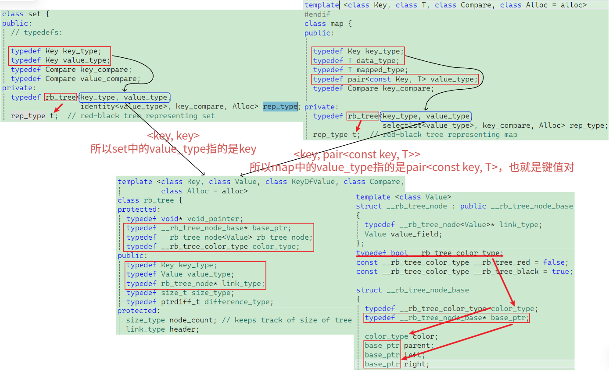
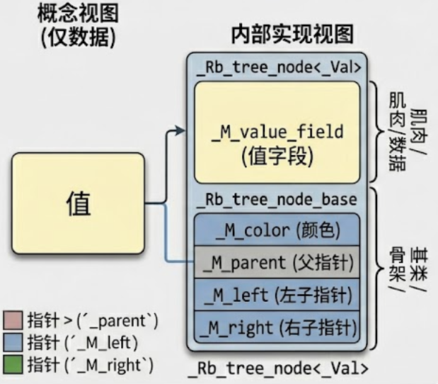
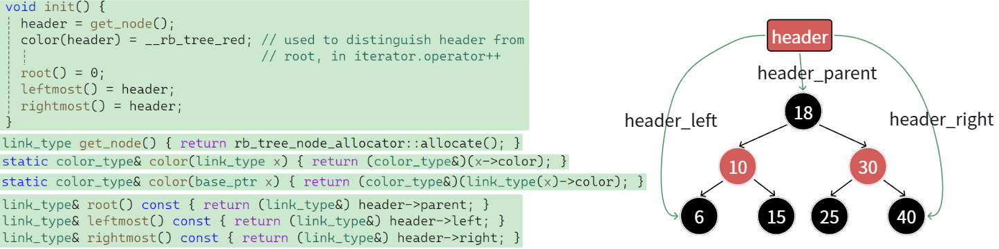
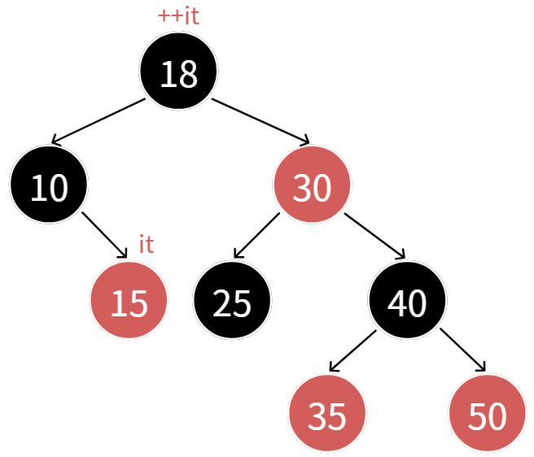
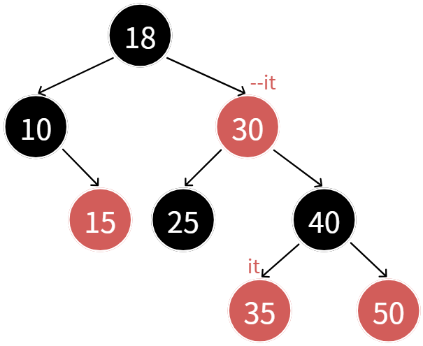
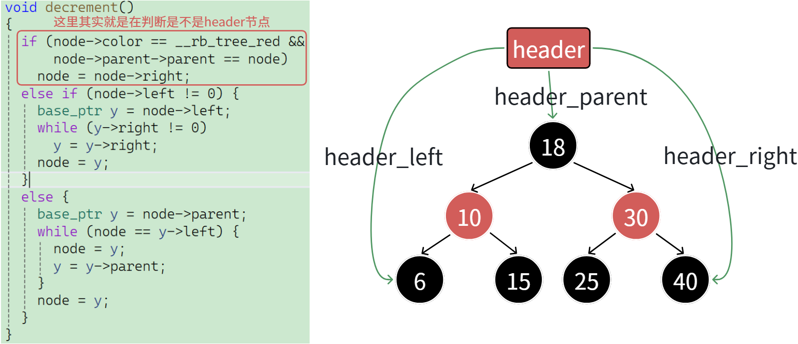
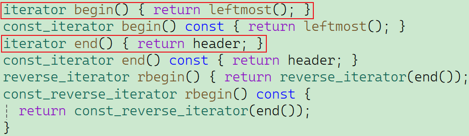

# 一、源码阅读



## 1.1 节点的结构

在 `stl_tree.h` 中，节点被拆分为两个主要部分：

| **源码名字 (命名风格)**                                    | **功能描述**                 | **包含内容**                                                 | **形象比喻**                                                 |
| ---------------------------------------------------------- | ---------------------------- | ------------------------------------------------------------ | ------------------------------------------------------------ |
| **`_Rb_tree_node_base`** (Base)                            | **节点的“骨架”**             | 颜色(`_M_color`)、父指针(`_M_parent`)、左子指针(`_M_left`)、右子指针(`_M_right`)。 | **只有关节和骨头。** 它只知道树的连接结构和颜色。            |
| **`template <typename _Val> struct _Rb_tree_node`** (Node) | **节点的“肌肉”（包含数据）** | **完全继承自“骨架”(`_Base`)**，并增加了一个关键字段：数据值(`_M_value_field`)。 | **完整的身体。** 既能连接，又带着数据（比如 `set` 的键值，`map` 的键值对）。 |

- **直白理解：** 所有涉及查找、遍历、旋转的操作，只用“骨架”（指针和颜色）就能完成。只有在需要读取或写入真正的数据时，才会转换为完整的“肌肉节点”。



## 1.2 Header节点

这是整个源码中最令人困惑的地方。你可能以为树的根节点（Root）是整个数据结构的核心入口，**其实不是。**源码中使用了一个特殊的哨兵节点（Dummy Node），称为 **Header**。

| **源码成员 (在 _Rb_tree 类中)**  | **直白理解 (管理器成员)**       | **包含内容**                                                 | **功能描述 (指向逻辑的关键！)**                              |
| -------------------------------- | ------------------------------- | ------------------------------------------------------------ | ------------------------------------------------------------ |
| **`_M_impl._M_header`** (Header) | **树的“超级管理员” (控制中心)** | 颜色始终是“红色” (以区别于普通节点)，并且不存储任何有效数据。 | 它是一个实体节点，但作用是作为所有操作的固定入口。它的指针指向树中最关键的几个位置。 |
| **`_M_impl._M_node_count`**      | **节点计数器**                  | 树中有效节点的数量。                                         |                                                              |



用表格和图直接对应，看懂 `Header` 节点到底怎么控制整棵树：

| **核心问题**| **源码中通过 Header 节点怎么找到？** |  **直白总结**   |
|---------- | ------------- |  ---------------------- |
| **真正的根节点 (Root) 在哪？**    | `_M_header->_M_parent`               |  管理员的“父”指针指向真正的顶部根。     |
| **树中最小的元素 (Begin) 在哪？** | `_M_header->_M_left`                 |  管理员的“左”指针永远指向最左侧的叶子节点（`std::set::begin()`）。 |
| **树中最大的元素 (Max) 在哪？**   | `_M_header->_M_right`                |  管理员的“右”指针永远指向最右侧的叶子节点。         |


- **空树的情况：** 如果树是空的，`Header` 节点仍然存在。它的 `parent` 是 null，但它的 `left` 和 `right` 指针通常指向它自己。

# 二、模拟实现

## 2.1 泛型红黑树的设计

泛型红黑树的设计是 C++ STL 源码中最令人惊叹的架构之一。代码必须完美复刻 SGI STL 的核心思想：**将数据存储、键值提取与树的结构控制彻底解耦**。

为了实现“一棵树同时撑起 `set` 和 `map`”的宏伟目标，需要在 `RBTree` 的三个不同的层次上进行了精妙的泛型设计。

### 2.1.1 第一层：节点设计 (`RBTNode`)

底层节点的定义是极度克制的：

```C++
template<class T>
struct RBTNode
{
	T _data;
	RBTNode<T>* _left;
	// ... 
};
```

- **数据类型的“无知性”**：`RBTNode` 只接受一个模板参数 `T`，并在内部声明了 `T _data;`。
- **解耦的核心**：节点本身**完全不知道**自己存的是单一的值（给 `set` 用），还是一个 `<Key, Value>` 键值对（给 `map` 用）。它只负责提供存储空间 `_data` 以及维护红黑树颜色和父子节点关系的指针。

### 2.1.2 第二层：参数设计 (`RBTree` 模板)

既然节点是“无知”的，那么如何告诉树该怎么去排序和查找呢？秘密全在 `RBTree` 类的三个模板参数中：

```C++
template<class K, class T, class KeyOfT>
class RBTree
```

这三个参数各司其职，构成了泛型红黑树的三大支柱：

1. **`K` (Key 键类型)**：红黑树是一棵二叉搜索树，它必须依赖某种“键”来进行大小比较。`K` 就是这个比较标准的类型（例如 `int` 或 `string`）。在你的 `Find(const K& key)` 方法中，用户传入的就是这个类型。
2. **`T` (Type 数据类型)**：这决定了树节点中 `_data` 到底是什么类型。对于 `set`，`T` 就是 `const K`；对于 `map`，`T` 就是 `pair<const K, V>`。
3. **`KeyOfT` (键值提取器)**：**这是整个泛型设计最伟大的魔法。** 因为红黑树底层拿到的只有类型 `T` 的数据，但比较大小需要用到类型 `K`，`KeyOfT` 就是一座桥梁，它是一个仿函数（Functor），负责从 `T` 中准确地剥离出 `K`。

### 2.1.3 第三层：仿函数应用

我们深入到 `RBTree::Insert` 和 `RBTree::Find` 的内部，看看泛型是如何运转的。在寻找插入位置或查找节点时：

```C++
KeyOfT kot;
// ...
if (kot(cur->_data) < kot(data))
{
    // ...
}
```

- **屏蔽差异**：底层代码根本不关心 `_data` 里到底是单个整数还是一个 `pair`。它统一实例化一个提取器对象 `kot`，然后调用 `kot(cur->_data)`。
- **上层赋能**：
	- 当这是 `Myset` 时，传入的 `SetKeyOfT` 会直接返回 `_data` 本身，完成比较。
	- 当这是 `Mymap` 时，传入的 `MapKeyOfT` 会返回 `_data.first`（即 `pair` 的 `first` 成员），然后再拿去比较大小。
- **结果**：同一套红黑树左旋、右旋、查找逻辑，一行不改，完美适配了两种截然不同的数据容器。

### 2.1.4 第四层：迭代器 (`RBTreeIterator`)

整个迭代器的核心框架与 `list` 的迭代器类似，都是**内部封装一个节点的指针，并通过重载运算符（如 `++`、`--`、`*`、`->`）来模拟指针的行为**。而它的遍历路径严格遵循二叉搜索树的**中序遍历（左子树 -> 根节点 -> 右子树）**。

#### 1. `begin()` 与 `end()` 的界定

- **`begin()`**: 因为是中序遍历，第一个被访问的节点一定是整棵树**最左下角的节点**，所以 `begin()` 返回的就是指向该节点的迭代器。
- **`end()`**: 当遍历到树的最大节点（最右节点）并继续执行 `++` 时，由于向上找不到任何“自己是父亲的左孩子”的祖先（最终父亲为空），节点指针会被置为 `nullptr`。因此，**用 `nullptr` 去充当 `end()` 是可行的**。*（注：标准 STL 源码中使用了一个与根节点互为父子的哨兵头节点，但使用 `nullptr` 也能实现相同的逻辑，只需在 `--end()` 时特殊处理，让其指回最右侧节点即可。）*

#### 2. 核心难点：`operator++` 的实现逻辑



迭代器 `++` 的精髓在于“**不看全局，只看局部**”，即只关心基于当前节点，中序遍历的“下一个”节点在哪里。图片将其分为了两种主要情况：

- **情况 A：当前节点的右子树不为空**
	- **思路**：说明当前节点已经访问完，接下来应该访问右子树中的元素。
	- **动作**：一棵树中序遍历的第一个节点是最左节点，因此直接去**找当前节点右子树的最左节点**即可。
- **情况 B：当前节点的右子树为空**
	- **思路**：说明当前节点访问完了，且它所在的整棵子树也访问完了。下一个要访问的节点一定在它的**祖先**里面。
	- **动作**：沿着父指针向上找。
		- **如果当前节点是父亲的左孩子**：说明左边走完了，根据“左->根->右”，下一个访问的节点就是**当前的父亲节点**。（如图片举例：25 是 30 的左孩子，25 访问完下一个就是 30）。
		- **如果当前节点是父亲的右孩子**：说明不但当前节点走完了，连同父亲所在的子树也全部走完了。此时必须**继续往祖先中去找，直到找到“孩子是父亲的左孩子”的那个祖先节点**，这个父亲节点就是下一个要访问的节点。

#### 3. `operator--` 的实现逻辑



`operator--` 的思路与 `++` **完全类似，仅仅是逻辑正好反过来**。

因为反向遍历的访问顺序是**右子树 -> 根节点 -> 左子树**：

- 如果左子树不为空，就找左子树的**最右节点**。
- 如果左子树为空，就向上找祖先，直到找到“孩子是父亲的**右孩子**”的那个祖先节点。

#### 4. 权限控制（`set` 与 `map` 的泛型复用）

为了保证红黑树的有序结构不被破坏，迭代器必须限制用户的修改权限：

- **对于 `set`**：迭代器完全不支持修改内容。实现方式是将第二个模板参数直接设为 `const K`（如：`RBTree<K, const K, SetKeyOfT>`）。
- **对于 `map`**：迭代器不支持修改 Key，但是**可以修改 Value**。实现方式是将存储的键值对中 Key 设为常量，即 `pair<const K, V>`（如：`RBTree<K, pair<const K, V>, MapKeyOfT>`）。

> 在底层红黑树中，第二个模板参数是数据类型，所以如果发生修改也就是在第二个模板参数里面，所以我们把第二个模板参数加上`const`修饰，但是在`map`中，实际不能修改的是`pair`类型的`key`，所以只给`key`加上`const`修饰。

泛型不仅仅是存储数据，还要考虑数据遍历时的安全与一致性。

```C++
template<class T, class Ref, class Ptr>
struct RBTreeIterator
{
	using Node = RBTNode<T>;
	using Self = RBTreeIterator<T, Ref, Ptr>;

	Node* _node;
	Node* _root;

	RBTreeIterator(Node* node, Node* root)
		:_node(node)
		,_root(root)
	{ }

	Self& operator++()
	{
		if (_node->_right)
		{
			Node* min = _node->_right;
			while (min->_left)
				min = min->_left;
			_node = min;
		}
		else
		{
			Node* cur = _node;
			Node* parent = _node->_parent;
			while (parent && cur == parent->_right)
			{
				cur = parent;
				parent = cur->_parent;
			}
			_node = parent;
		}
		return *this;
	}

	Self& operator--()
	{
		if (_node == nullptr)
		{
			Node* rightmost = _root;
			while (rightmost && rightmost->_right)
				rightmost = rightmost->_right;
			_node = rightmost;
		}
		else if (_node->_left)
		{
			Node* rightmax = _node->_left;
			while (rightmax->_right)
				rightmax = rightmax->_right;
			_node = rightmax;
		}
		else
		{
			Node* cur = _node;
			Node* parent = _node->_parent;
			while (parent && cur == parent->_left)
			{
				cur = parent;
				parent = cur->_parent;
			}
			_node = parent;
		}
		return *this;
	}

    Ref operator*() { return _node->_data; }
    Ptr operator->() { return &(_node->_data); }
    bool operator!=(const Self& s) const { return _node != s._node; }
    bool operator==(const Self& s) const { return _node == s._node; }
};
```

- **避免代码冗余**：如果不使用 `Ref`（引用）和 `Ptr`（指针）这两个模板参数，你需要为了普通迭代器写一个类，再为了 `const_iterator`（常数迭代器）复制粘贴一模一样的代码，仅仅是把返回值改成 `const T&` 和 `const T*`。

- **一键生成两套接口**：通过模板参数 `Ref` 和 `Ptr`，你在 `RBTree` 中只用两行 `using` 就同时生成了可读写的 `Iterator` 和只读的 `ConstIterator`：

	```C++
	using Iterator = RBTreeIterator<T, T&, T*>;
	using ConstIterator = RBTreeIterator<T, const T&, const T*>;
	```

	这极大地提高了代码的复用性和维护性。

### 2.1.5 `operator--`与源码区别

这里有个小插曲，可以发现`operator--`逻辑并不是严格是`++`的镜像，因为在源码中，底层对红黑树实现了一个`header`节点，源码做了这样一个特殊处理：



这里其实发现根节点好像也符合，但第一个判断节点是红色的时候就确定了判断的是`header`节点，这是别人专门设计的，因为他的`end()`迭代器也是也是指向`nullptr`，实际是`header`节点：



但是第一个遍历的节点一定是右子树的最右节点，所以他做了个特殊处理，那么我们为了方便实现，没有实现`header`节点，那就直接从`nullptr`入手，加上指向最右节点的逻辑：

```c++
if (_node == nullptr)
{
    Node* rightmost = _root;
    while (rightmost && rightmost->_right)
        rightmost = rightmost->_right;
    _node = rightmost;
}
```

## 2.2 `csa::set` 的封装解析

对 `set` 的封装完美体现了 C++ STL 中的**适配器模式（Adapter Pattern）**。`set` 本质上是对底层红黑树进行了一层极薄的“包装”和“权限限制”。

### 2.2.1 模板参数的映射

在 `Myset.h` 中，`set` 类内部声明了一个私有的红黑树对象 `_t`：

```C++
RBTree<K, const K, SetKeyOfT> _t;
```

这句代码是整个封装的灵魂，它向底层的泛型红黑树传递了三个决定命运的参数：

- **第一个参数 `K` (Key)**：告诉底层红黑树，这棵树的比较和查找基准是 `K` 类型。
- **第二个参数 `const K` (Value)**：告诉底层红黑树，节点里实际存放的也是 `K` 类型的数据。**这里的 `const` 必须加！**“`set` 的 `iterator` 也不支持修改，我们把 `set` 的第二个模板参数改成 `const K` 即可”。这就从物理存储层面彻底锁死了数据，防止用户通过迭代器修改节点的值从而破坏二叉搜索树的有序性。
- **第三个参数 `SetKeyOfT` (提取器)**：传入了一个专为 `set` 定制的仿函数类型，底层代码只会直接执行对`key`的比较，所以需要给一个仿函数获取`map/set`对应的`key`。

### 2.2.2 仿函数 `SetKeyOfT`

底层红黑树的节点是不知道自己存的是单一值还是键值对的，它每次比较大小都需要一个 `Key`。通过定义这个仿函数解决了身份识别问题：

```C++
struct SetKeyOfT
{
    const K& operator()(const K& key)
    {
        return key;
    }
};
```

- **思路解析**：对于 `set` 来说，**Key 就是 Value，Value 就是 Key**。当底层的 `RBTree::Insert` 或 `RBTree::Find` 需要提取 Key 进行比大小时，调用这个仿函数，它会原封不动地把收到的数据作为 Key 返回给底层去比较。这就是所谓“提取自身”的逻辑。

### 2.2.3 迭代器的声明

在 `set` 中，哪怕是普通的 `iterator`，其指向的内容也是不允许修改的（因为改了就会破坏红黑树规则）。

```C++
using iterator = typename RBTree<K, const K, SetKeyOfT>::Iterator;
using const_iterator = typename RBTree<K, const K, SetKeyOfT>::ConstIterator;
```

- **思路解析**：由于在实例化 `RBTree` 时，第二个参数传的是 `const K`。那么在底层 `RBTree.h` 中，迭代器 `RBTreeIterator<T, T&, T*>` 的 `T` 实际上就被替换成了 `const K`。
- 这意味着，无论是 `iterator` 还是 `const_iterator`，当你对它们解引用（`operator*`）时，拿到的都是 `const K&`。这就完美实现了 `set` 迭代器只读不写的特性。

### 2.2.4 方法委托机制

`set` 就像一个对外接客的“包工头”，它不干脏活累活，所有的具体操作全部委托给内部的私有红黑树 `_t`。

- **遍历接口**：`begin()` 和 `end()` 直接 `return _t.Begin();` 和 `_t.End();`。

- **插入接口**：

	```C++
	pair<iterator, bool> insert(const K& key)
	{
	    return _t.Insert(key);
	}
	```

	直接调用底层树的 `Insert` 方法。由于底层树处理了相同的 Key 不重复插入的逻辑（返回 `false`），所以 `set` 的元素唯一性也就天然达成了。

- **查找接口**：`find(const K & key)` 直接 `return _t.Find(key);`。

## 2.3 `csa::map` 的封装解析

`map`（映射/字典）存储的是 `<Key, Value>` 键值对。与 `set` 将 `Key` 和 `Value` 合二为一不同，`map` 的封装需要解决**“如何用 Key 排序，却同时携带 Value”**的问题。以下是深度解析：

### 2.3.1 模板参数与键值对存储

在 `Mymap.h` 中，`map` 类内部同样声明了一个私有的红黑树对象 `_t`，但传递的模板参数大有玄机：

```C++
RBTree<K, pair<const K, V>, MapKeyOfT> _t;
```

这三个参数完美定义了 `map` 的物理形态：

- **`K` (Key)**：告诉底层红黑树，这棵树的比较、查找基准依然是 `K` 类型。
- **`pair<const K, V>` (Type)**：这是 `map` 封装最核心的一步！它告诉底层红黑树，节点里实际存放的数据 `_data` 是一个 `pair`（键值对）。
	- **为何是 `const K`？** “`map` 的 iterator 不支持修改 key 但是可以修改 value，我们把 `map` 的第二个模板参数 `pair` 的第一个参数改成 `const K` 即可”。一旦 `Key` 被修改，红黑树的有序性就会彻底崩塌。加上 `const` 后，编译器会在物理层面上阻止任何人（**包括通过迭代器**）修改 `Key`。
	- **为何 `V` 不是 `const`？** 因为字典的值是允许随时更新的（比如 `dict["left"] = "左边，剩余"`）。

### 2.3.2 仿函数 `MapKeyOfT`

底层的泛型红黑树在执行插入或查找时，面对的是一个 `pair<const K, V>` 类型的整体数据 `_data`，它根本不知道怎么比大小。通过传入定制的仿函数 `MapKeyOfT` 解决了这个问题：

```C++
struct MapKeyOfT
{
    const K& operator()(const pair<K, V>& kv)
    {
        return kv.first;
    }
};
```

- **思路解析**：当底层的 `RBTree` 需要比较大小时，它会调用 `kot(cur->_data)`。此时，`MapKeyOfT` 会精准地把 `pair` 中的 `.first`（也就是 Key）提取出来，返回给底层去比较。这样，底层树依然是在纯粹地通过 Key 来维持红黑树的平衡和查找路径。

### 2.3.3 `operator[]` 的精妙实现

`map` 最强大、最常用的功能就是像数组一样通过方括号访问或修改元素。

```C++
V& operator[](const K& key)
{
    pair<iterator, bool> ret = insert({ key,V() });
    return ret.first->second;
}
```

- **思路深度拆解**：
	1. **盲目构造与插入**：遇到 `dict[key]` 时，直接构造一个键值对 `{ key, V() }`（Value 采取类型的默认构造，如 `int` 为 0，`string` 为空串），并强制调用 `insert`。
	2. **底层 `Insert` 的双重反馈**：底层的 `RBTree::Insert` 被设计为返回 `pair<Iterator, bool>`。
		- **情景 A（Key 不存在）**：新节点成功插入。底层返回 `<指向新节点的迭代器, true>`。
		- **情景 B（Key 已存在）**：红黑树拒绝重复插入。底层返回 `<指向已存在旧节点的迭代器, false>`。
	3. **提取并返回引用**：无论上述哪种情景，`ret.first` 拿到的必定是**树中该 Key 所在节点的迭代器**。随后通过 `->second` 拿到 Value，并以**引用 (`V&`)** 的形式返回。
- **结果**：如果用户写 `dict["insert"] = "插入";`，因为返回的是引用，这个赋值操作直接修改了树节点里面真实的 Value。如果是单纯读取 `cout << dict["insert"];`，也能完美拿到值。

### 2.3.4 权限与接口外包

- **迭代器权限**：在 `Mymap.h` 中通过 `using iterator = typename RBTree<...>::Iterator;` 暴露出去了迭代器。当用户在 `main` 函数中写 `it->first += 'x';` 时，编译器会直接报错拦截，因为 `T` 被你实例化为了 `pair<const K, V>`。而 `it->second += 'x';` 则是完全合法的。
- **接口委托**：和 `set` 一样，`map` 的 `begin()`、`end()`、`insert()`、`find()` 全部直接委托给 `_t` 对应的方法执行，自身只做一层“翻译”。

对 `map` 的封装，最绝妙的地方在于**“偷梁换柱”**。底层明明是一棵通用的二叉搜索树，只能存一种叫 `T` 的东西；你利用 `pair` 把键和值打包塞进去充当 `T`，又给树配了一把叫 `MapKeyOfT` 的“钥匙”，让它只看 Key 不看 Value，最后借助 `insert` 的返回值魔法般地实现了强大的 `operator[]`。这套机制使得一份 `RBTree` 代码完美适配了两种截然不同的容器业务。

# 三、实现代码

## 3.1 `RBTree.h`

```c++
#pragma once

#include<iostream>
using namespace std;

enum Colour { RED, BLACK };

template<class T>
struct RBTNode
{
	T _data;
	RBTNode<T>* _left;
	RBTNode<T>* _right;
	RBTNode<T>* _parent;
	Colour _col;

	RBTNode(const T& data)
		:_data(data)
		, _left(nullptr)
		, _right(nullptr)
		, _parent(nullptr)
	{ }
};

template<class T, class Ref, class Ptr>
struct RBTreeIterator
{
	using Node = RBTNode<T>;
	using Self = RBTreeIterator<T, Ref, Ptr>;

	Node* _node;
	Node* _root;

	RBTreeIterator(Node* node, Node* root)
		:_node(node)
		,_root(root)
	{ }

	Self& operator++()
	{
		if (_node->_right)
		{
			Node* min = _node->_right;
			while (min->_left)
				min = min->_left;
			_node = min;
		}
		else
		{
			Node* cur = _node;
			Node* parent = _node->_parent;
			while (parent && cur == parent->_right)
			{
				cur = parent;
				parent = cur->_parent;
			}
			_node = parent;
		}
		return *this;
	}

	Self& operator--()
	{
		if (_node == nullptr)
		{
			Node* rightmost = _root;
			while (rightmost && rightmost->_right)
				rightmost = rightmost->_right;
			_node = rightmost;
		}
		else if (_node->_left)
		{
			Node* rightmax = _node->_left;
			while (rightmax->_right)
				rightmax = rightmax->_right;
			_node = rightmax;
		}
		else
		{
			Node* cur = _node;
			Node* parent = _node->_parent;
			while (parent && cur == parent->_left)
			{
				cur = parent;
				parent = cur->_parent;
			}
			_node = parent;
		}
		return *this;
	}

	Ref operator*() { return _node->_data; }

	Ptr operator->() { return &(_node->_data); }

	bool operator!=(const Self& s) const { return _node != s._node; }

	bool operator==(const Self& s) const { return _node == s._node; }
};

template<class K, class T, class KeyOfT>
class RBTree
{
	using Node = RBTNode<T>;
public:
	using Iterator = RBTreeIterator<T, T&, T*>;
	using ConstIterator = RBTreeIterator<T, const T&, const T*>;

	Iterator Begin()
	{
		Node* cur = _root;
		while (cur && cur->_left)
			cur = cur->_left;
		return Iterator(cur, _root);
	}

	Iterator End()
	{
		return Iterator(nullptr, _root);
	}

	ConstIterator Begin() const
	{
		Node* cur = _root;
		while (cur && cur->_left)
			cur = cur->_left;
		return ConstIterator(cur, _root);
	}

	ConstIterator End() const
	{
		return ConstIterator(nullptr, _root);
	}

	RBTree() = default;

	~RBTree()
	{
		Destroy(_root);
		_root = nullptr;
	}

	void RotateR(Node* parent)
	{
		Node* subL = parent->_left;
		Node* subLR = subL->_right;

		parent->_left = subLR;
		if (subLR)
			subLR->_parent = parent;

		Node* pParent = parent->_parent;
		subL->_right = parent;
		parent->_parent = subL;
		if (pParent == nullptr)
		{
			_root = subL;
			subL->_parent = nullptr;
		}
		else
		{
			if (pParent->_left == parent)
				pParent->_left = subL;
			else
				pParent->_right = subL;
			subL->_parent = pParent;
		}
	}

	void RotateL(Node* parent)
	{
		Node* subR = parent->_right;
		Node* subRL = subR->_left;

		parent->_right = subRL;
		if (subRL)
			subRL->_parent = parent;

		Node* pParent = parent->_parent;
		subR->_left = parent;
		parent->_parent = subR;
		if (pParent == nullptr)
		{
			_root = subR;
			subR->_parent = nullptr;
		}
		else
		{
			if (pParent->_left == parent)
				pParent->_left = subR;
			else
				pParent->_right = subR;
			subR->_parent = pParent;
		}
	}

	pair<Iterator, bool> Insert(const T& data)
	{
		if (_root == nullptr)
		{
			_root = new Node(data);
			_root->_col = BLACK;
			return pair<Iterator, bool>(Iterator(_root, _root), true);
		}

		KeyOfT kot;
		Node* cur = _root;
		Node* parent = cur->_parent;

		while (cur)
		{
			if (kot(cur->_data) < kot(data))
			{
				parent = cur;
				cur = cur->_right;
			}
			else if (kot(data) < kot(cur->_data))
			{
				parent = cur;
				cur = cur->_left;
			}
			else
				return pair<Iterator, bool>(Iterator(cur, _root), false);
		}

		cur = new Node(data);
		Node* newnode = cur;
		if (kot(parent->_data) < kot(data))
			parent->_right = cur;
		else
			parent->_left = cur;
		
		cur->_parent = parent;
		cur->_col = RED;

		while (parent && parent->_col == RED)
		{
			Node* grandfather = parent->_parent;
			if (grandfather->_left == parent)
			{
				Node* uncle = grandfather->_right;
				if (uncle && uncle->_col == RED)
				{
					parent->_col = uncle->_col = BLACK;
					grandfather->_col = RED;

					cur = grandfather;
					parent = cur->_parent;
				}
				else
				{
					//        g
					//      p    u
					//    c
					if (parent->_left == cur)
					{
						RotateR(grandfather);
						parent->_col = BLACK;
						grandfather->_col = RED;
					}
					else
					{
						//        g
						//      p    u
						//        c
						RotateL(parent);
						RotateR(grandfather);
						cur->_col = BLACK;
						grandfather->_col = RED;
					}
					break;
				}
			}
			else
			{
				Node* uncle = grandfather->_left;
				if (uncle && uncle->_col == RED)
				{
					//    g
					//  u    p
					//         c
					parent->_col = uncle->_col = BLACK;
					grandfather->_col = RED;

					cur = grandfather;
					parent = cur->_parent;
				}
				else
				{
					if (parent->_right == cur)
					{
						RotateL(grandfather);
						parent->_col = BLACK;
						grandfather->_col = RED;
					}
					else
					{
						//    g
						//  u    p
						//     c
						RotateR(parent);
						RotateL(grandfather);
						cur->_col = BLACK;
						grandfather->_col = RED;
					}
					break;
				}
			}
		}
		_root->_col = BLACK;
		return { Iterator(newnode, _root), true };
	}

	Iterator Find(const K& key)
	{
		KeyOfT kot;
		Node * cur = _root;
		while (cur)
		{
			if (kot(cur->_data) < key)
				cur = cur->_right;
			else if (kot(cur->_data) > key)
				cur = cur->_left;
			else
				return Iterator(cur, _root);
		}
		return End();
	}

	int Height() { return _Height(_root); }
	int Size() { return _Size(_root); }

private:
	void Destroy(Node * root)
	{
		if (root == nullptr)
			return;
		Destroy(root->_left);
		Destroy(root->_right);
		delete root;
	}

	int _Height(Node* root)
	{
		if (root == nullptr)
			return 0;
		int leftHeight = _Height(root->_left);
		int rightHeight = _Height(root->_right);
		return (leftHeight > rightHeight ? leftHeight : rightHeight) + 1;
	}

	int _Size(Node* root)
	{
		if (root == nullptr)
			return 0;
		return _Size(root->_left) + _Size(root->_right) + 1;
	}

private:
	Node* _root = nullptr;
};
```

## 3.2 `Mymap.h`

```c++
#pragma once

#include"RBTree.h"

namespace csa
{
	template<class K, class V>
	class map
	{
		struct MapKeyOfT
		{
			const K& operator()(const pair<K, V>& kv) { return kv.first; }
		};
	public:
		using iterator = typename RBTree<K, pair<const K, V>, MapKeyOfT>::Iterator;
		using const_iterator = typename RBTree<K, pair<const K, V>, MapKeyOfT>::ConstIterator;

		iterator begin() { return _t.Begin(); }

		iterator end() { return _t.End(); }

		const_iterator begin() const { return _t.Begin(); }

		const_iterator end()  const { return _t.End(); }

		pair<iterator, bool> insert(const pair<K, V>& kv) { return _t.Insert(kv); }

		V& operator[](const K& key)
		{
			pair<iterator, bool> ret = insert({ key,V() });
			return ret.first->second;
		}

		iterator find(const K & key) { return _t.Find(key); }
	private:
		RBTree<K, pair<const K, V>, MapKeyOfT> _t;
	};
}
```

## 3.3 `Myset.h`

```c++
#pragma once

#include"RBTree.h"

namespace csa
{
	template<class K>
	class set
	{
		struct SetKeyOfT { const K& operator()(const K& key) { return key; } };
	public:
		using iterator = typename RBTree<K, const K, SetKeyOfT>::Iterator;
		using const_iterator = typename RBTree<K, const K, SetKeyOfT>::ConstIterator;

		iterator begin() { return _t.Begin(); }

		iterator end() { return _t.End(); }

		const_iterator begin() const { return _t.Begin(); }

		const_iterator end()  const { return _t.End(); }

		pair<iterator, bool> insert(const K& key) { return _t.Insert(key); }

		iterator find(const K & key) { return _t.Find(key); }
	private:
		RBTree<K, const K, SetKeyOfT> _t;
	};
}
```
