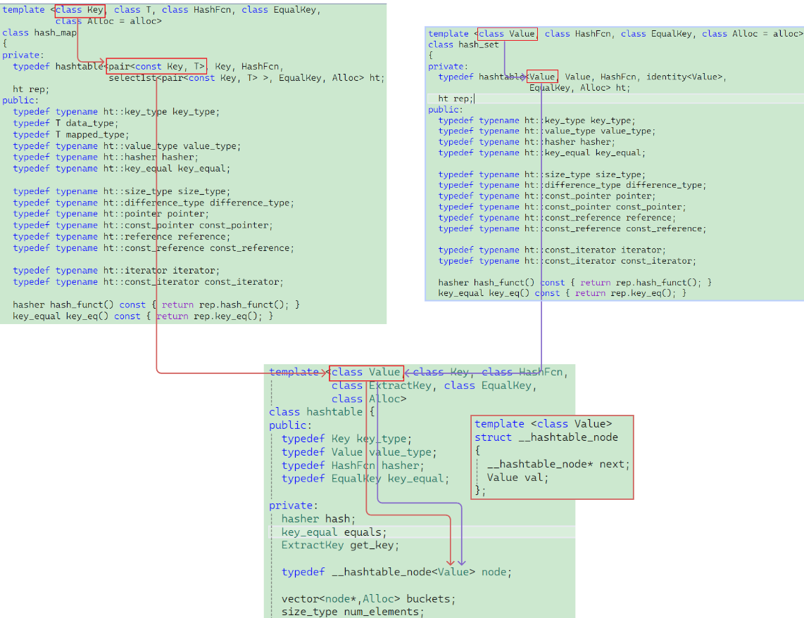
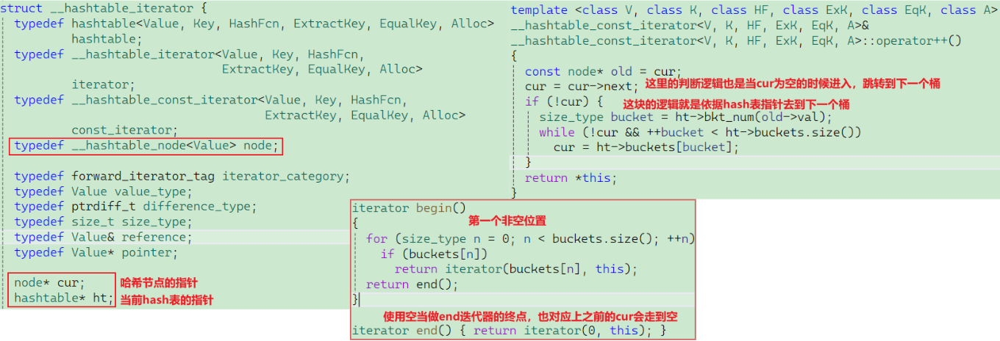
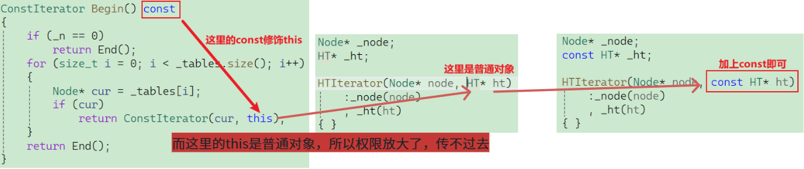

# 一、源码阅读



这里与红黑树封装`map` 、`set` 极其相似，底层哈希表的第一个参数是靠`unordered_map`  、`unordered_set`进行推导出来的。

# 二、封装

## 2.1 泛型哈希表的实现

### 2.1.1 节点设计

这里就不能写死为`pair`或者`key`了，必须是通过上层的使用传进来的进行推导，那就将节点修改为模板实现：

```c++
template<class T>
struct HashNode
{
    T _data;
    HashNode<T>* _next;
    HashNode(const T& data)
        :_data(data)
        , _next(nullptr)
    { }
};
```

### 2.1.2 哈希表设计

```c++
template<class K, class T, class KeyOfT, class Hash>
class HashTable
{
	using Node = HashNode<T>;
public:
	HashTable()
		:_tables(__stl_next_prime(0))
		,_n(0)
	{ }
    ~HashTable()
    {
        for (size_t i = 0; i < _tables.size(); i++)
        {
            Node* cur = _tables[i];
            while (cur)
            {
                Node* next = cur->_next;
                delete cur;
                --_n;
                cur = next;
            }
            _tables[i] = nullptr;
        }
    }
private:
	vector<Node*> _tables;
	size_t _n = 0;
};
```

这里就需要将之前写死的部分重新修改回来，比如参数部分，我们统一使用第二个模板参数当做`data`，既然已经是模板了，那么传进来之后就得去获取`data`的`key`，所以新增仿函数参数去求`key`：

### 2.1.3 仿函数KeyOfT

**unordered_map**

```c++
struct MapKeyOfT
{
    const K& operator()(const pair<K, V>& kv)
    {
        return kv.first;
    }
};
```

**unordered_set**

```c++
struct SetKeyOfT
{
    const K& operator()(const K& key)
    {
        return key;
    }
};
```

修改完参数模板后呢，那就必须对之前的一些接口进行修改，这里就不给出怎么修改了，大体流程就是实例化仿函数求当前`data`的`key`。

> 后续需要增加迭代器版本，所以代码就不给出写了。

### 2.1.4 迭代器

> [!NOTE]
>
> ### 源码阅读
>
> 

> [!IMPORTANT]
>
> ### 关于不可修改性（Const 的处理）
>
> `unordered_set` 和 `unordered_map` 对修改的不同约束，这直接影响了迭代器模板参数的传入：
>
> | **容器**          | **键（Key）是否可改**    | **值的实现思路**                                             |
> | ----------------- | ------------------------ | ------------------------------------------------------------ |
> | **unordered_set** | **不可改**               | 将迭代器的第二个模板参数设为 `const K`，确保通过迭代器无法修改数据。 |
> | **unordered_map** | **Key不可改，Value可改** | 将存储的数据类型设为 `pair<const K, V>`，这样 `key` 具有常量属性，但 `value` 依然可以被重新赋值。 |
>
> ### 代码框架
>
> ```c++
> template<class K, class T, class Ref, class Ptr, class KeyOfT, class Hash>
> struct HTIterator
> {
>  using Node = HashNode<T>;
>  using HT = HashTable<K, T, KeyOfT, Hash>;
>  using Self = HTIterator<K, T, Ref, Ptr, KeyOfT, Hash>;
> 
>  Node* _node;
>  const HT* _ht;
> 
>  HTIterator(Node* node, const HT* ht)
>      :_node(node)
>      , _ht(ht)
>  { }
> 
>  Ref operator*() { return _node->_data; }
>  Ptr operator->() { return &_node->_data; }
>  bool operator!=(const Self& s) { return _node != s._node; }
> 
>  Self& operator++()  {    }
> };
> ```
>
> ### 重点：operator++
>
> 这是迭代器最复杂的逻辑，需要处理两种场景：
>
> #### 场景 A：桶内还有节点
>
> - **逻辑**：如果 `_node->_next` 不为空，说明当前链表还没走完。
> - **操作**：直接让 `_node = _node->_next` 即可。
>
> #### 场景 B：当前桶已走完
>
> - **逻辑**：如果 `_node->_next == nullptr`，说明当前桶已经到底了。
> - **操作步骤**：
> 	1. **计算当前桶位置**：利用 `KeyOfT` 获取 key，再通过 `Hash` 仿函数计算哈希值，最后对表长取模，得到当前桶在 `vector` 中的索引 `hashi`。
> 	2. **向后探测**：执行 `++hashi`，开始遍历 `vector` 数组后面的位置。
> 	3. **寻找非空桶**：如果 `_ht->_tables[hashi]` 为空，继续往后找；如果找到一个不为空的桶，将 `_node` 指向该桶的第一个节点并跳出循环。
> 	4. **结束判定**：如果遍历完整个 `vector` 都没有找到非空桶，说明已经迭代到末尾，将 `_node` 置为 `nullptr`（即 `end()`）。
>
> ```c++
> Self& operator++()
> {
>     if (_node->_next) { _node = _node->_next; }
>     else
>     {
>         KeyOfT kot;
>         Hash hash;
>         size_t hashi = hash(kot(_node->_data)) % _ht->_tables.size();
>         ++hashi;
>         while (hashi < _ht->_tables.size())
>         {
>             _node = _ht->_tables[hashi];
>             if (_node)  break;
>             else  ++hashi;
>         }
>         if(hashi == _ht->_tables.size()) _node = nullptr;
>     }
>     return *this;
> }
> ```

在迭代器实现完成后，套入`hash`表：

```c++
using Iterator = HTIterator<K, T, T&, T*, KeyOfT, Hash>;
using ConstIterator = HTIterator<K, T, const T&, const T*, KeyOfT, Hash>;
```

> [!IMPORTANT]
>
> ### begin、end接口
>
> ```c++
> Iterator Begin()
> {
>     if (_n == 0) return End();
>     for (size_t i = 0; i < _tables.size(); i++)
>     {
>         Node* cur = _tables[i];
>         if (cur) return Iterator(cur, this);
>     }
>     return End();
> }
> 
> Iterator End() { return Iterator(nullptr, this); }
> 
> ConstIterator Begin() const
> {
>     if (_n == 0) return End();
>     for (size_t i = 0; i < _tables.size(); i++)
>     {
>         Node* cur = _tables[i];
>         if (cur) return ConstIterator(cur, this);
>     }
>     return End();
> }
> 
> ConstIterator End() const { return ConstIterator(nullptr, this); }
> ```

> [!WARNING]
>
> ### 问题一：
>
> 在实现完成上面所有的接口后，会出现一堆的编译错误，这里实际上是依赖的问题，因为迭代器依赖哈希表，那这时候就可能有两个办法：
>
> 1. 将哈希表的实现放在迭代器前面：这是绝对不可以的！！！因为哈希表里面你还封装了迭代器，编译器还是会向前寻找迭代器，还是会报错。
> 2. 那么就可以考虑第二个方法：前置声明，作用就是告诉编译器，哈希表的实现就是一个类模板
>
> ```c++
> //前置声明
> template<class K, class T, class KeyOfT, class Hash>
> class HashTable;
> ```
> > [!NOTE]
> > **类模板的前置声明，是不需要加缺省参数的。**
>
> 3. 这里还有一个办法也可以实现：就是我们不需要传入整个哈希表，只需要将底层的`vector`传进去就好了，但是我们现在是跟着库走的，所以暂不考虑。
>
> ### 问题二：
>
> 修改完上面的问题后，就会出现新的问题，因为迭代器访问了哈希表的私有属性，所以必须加上友元提示——类模板的友元和前置声明必须加上模板参数：
>
> ```c++
> //友元声明
> template<class K, class T, class Ref, class Ptr, class KeyOfT, class Hash>
> friend struct HTIterator;
> ```

### 2.1.5 ConstIterator 面临的挑战



**切记权限不能放大，但是可以缩小！！！**

## 2.2 csa::unordered_set 的封装解析

`unordered_set` 采用了典型的**适配器模式**，它将底层的 `hash_bucket::HashTable` 包装成了一个只允许存储唯一键且不可修改的容器。

### 2.2.1 模板参数的映射

在 `UnorderedSet.h` 中，`unordered_set` 内部声明了一个私有的哈希表对象 `_ht`：

```C++
hash_bucket::HashTable<K, const K, SetKeyOfT, Hash> _ht;
```

这一行代码通过四个参数定义了容器的特性：

- **第一个参数 `K` (Key)**：定义了哈希表查找和去重所依赖的键类型。
- **第二个参数 `const K` (Value/T)**：这是封装的核心。它告诉底层哈希桶，节点中存储的实际数据是 `const K`。这从编译器层面限制了用户通过迭代器修改元素，因为一旦修改，该元素在哈希桶中的位置（由哈希值决定）就会失效。
- **第三个参数 `SetKeyOfT` (提取器)**：这是一个定制的仿函数，用于告诉底层哈希表如何从存储的数据中提取出 Key。
- **第四个参数 `Hash`**：哈希函数，默认使用 `HashFunc<K>` 将键转化为可取模的整数。

### 2.2.2 仿函数 SetKeyOfT

由于底层 `HashTable` 是通用的，它不知道存储的是 `K` 还是 `pair`。`SetKeyOfT` 解决了这个问题：

```C++
struct SetKeyOfT 
{
    const K& operator()(const K& key) 
    {
        return key; 
    }
};
```

**思路解析**：对于 `set` 来说，值本身就是键。当底层的 `Insert` 方法执行 `kot(data)` 时，该仿函数直接返回数据本身，从而让哈希表能计算哈希位置。

### 2.2.3 迭代器的权限控制

为了保证 `unordered_set` 的元素不可被修改，其迭代器类型被定义为：

```C++
using iterator = typename hash_bucket::HashTable<K, const K, SetKeyOfT, Hash>::Iterator;
```

**思路解析**：由于实例化时 `T` 被传成了 `const K`，在 `HashTable.h` 中定义的迭代器 `HTIterator<..., T&, T*, ...>` 内部，其 `operator*` 返回的就是 `const K&`。这确保了用户在遍历 `set` 时只能读取，不能修改。

## 2.3 csa::unordered_map 的封装解析

`unordered_map` 的封装更加复杂，它需要同时处理键（Key）和值（Value），并提供独有的下标操作符。

### 2.3.1 模板参数的映射

在 `UnorderedMap.h` 中，内部哈希表对象定义如下：

```C++
hash_bucket::HashTable<K, pair<const K, V>, MapKeyOfT, Hash> _ht;
```

- **第二个参数 `pair<const K, V>`**：这是 `map` 的精髓。它告诉哈希桶节点存储的是键值对，且通过 `const K` 锁死了键，同时保留了 `V` 的可修改性。

### 2.3.2 仿函数 MapKeyOfT

```C++
struct MapKeyOfT 
{
    const K& operator()(const pair<K, V>& kv) 
    {
        return kv.first; // 只提取 pair 的第一个成员作为 Key
    }
};
```

**思路解析**：这实现了“根据 Key 计算位置，但存储整个 pair”的逻辑。哈希表在插入和查找时只会抓取 `kv.first`。

### 2.3.3 下标操作符 `operator[]` 的委托逻辑

这是 `unordered_map` 特有的功能：

```C++
V& operator[](const K& key)
{
    pair<iterator, bool> ret = insert({ key,V() });
    return ret.first->second;
}
```

**思路解析**：它利用了 `insert` 的返回值。如果 `key` 不存在，则插入一个新的键值对（值使用 `V()` 默认构造）；如果 `key` 存在，`insert` 返回已存在节点的迭代器（`ret.first`）。最后函数返回 `value` 的引用（`ret.first->second`，也就是迭代器中的`->`运算符重载，从而返回的就是`value`），支持了赋值操作。

## 2.4 封装细节

无论是 `set` 还是 `map`，它们的大部分公共接口都是直接向 `_ht` 进行任务委托：

- **插入**：`insert` 委托给 `_ht.Insert`。
- **查找**：`Find` 委托给 `_ht.Find`。
- **删除**：`Erase` 委托给 `_ht.Erase`。

| **细节**             | **csa::unordered_set** | **csa::unordered_map**              |
| -------------------- | ---------------------- | ----------------------------------- |
| **底层节点存储类型** | `const K`              | `pair<const K, V>`                  |
| **Key 提取方式**     | 返回元素本身           | 返回 `pair.first`                   |
| **修改权限**         | 元素完全不可改         | 键 (first) 不可改，值 (second) 可改 |
| **迭代器实现**       | 默认即为只读迭代器     | 支持修改 Value 的迭代器             |

> [!IMPORTANT]
>
> `hashfunc`现在我们是藏在了哈希表这个下层上，这是不合适的，因为平时使用的就是`unordered_map`、`unordered_set`。
>
> 区别是什么呢？区别就是我们需要把下层的缺省去掉，加在上层即可，这样我们使用`unordered_map`、`unordered_set`的时候就可以控制求哈希值了：
>
> ```c++
> template<class K, class V, class Hash = HashFunc<K>>
> class unordered_map;
> ```
>
> ```c++
> template<class K, class Hash = HashFunc<K>>
> class unordered_set;
> ```

# 三、源码

## 3.1 `HashTable.h`

```c++
#pragma once
#include<iostream>
#include<string>
#include<vector>
using namespace std;

enum State { EXIST, EMPTY, DELETE };

template <class K, class V>
struct HashData
{
	pair<K, V> _kv;
	State _state = EMPTY;
};

template<class K>
struct HashFunc
{
	size_t operator()(const K& key)
	{
		return (size_t)key;
	}
};

template<>
struct HashFunc<string>
{
	size_t operator()(const string& s)
	{
		size_t hash = 0;
		for (auto ch : s)
		{
			hash += ch;
			hash *= 131;
		}
		return hash;
	}
};

inline unsigned long __stl_next_prime(unsigned long n)
{
	// Note: assumes long is at least 32 bits.
	static const int __stl_num_primes = 28;
	static const unsigned long __stl_prime_list[__stl_num_primes] = {
		53, 97, 193, 389, 769,
		1543, 3079, 6151, 12289, 24593,
		49157, 98317, 196613, 393241, 786433,
		1572869, 3145739, 6291469, 12582917, 25165843,
		50331653, 100663319, 201326611, 402653189, 805306457,
		1610612741, 3221225473, 4294967291
	};
	const unsigned long* first = __stl_prime_list;
	const unsigned long* last = __stl_prime_list + __stl_num_primes;
	const unsigned long* pos = lower_bound(first, last, n);
	return pos == last ? *(last - 1) : *pos;
}


namespace hash_bucket
{
	template<class T>
	struct HashNode
	{
		T _data;
		HashNode<T>* _next;
		HashNode(const T& data)
			:_data(data)
			, _next(nullptr)
		{ }
	};

	//前置声明
	template<class K, class T, class KeyOfT, class Hash>
	class HashTable;

	template<class K, class T, class Ref, class Ptr, class KeyOfT, class Hash>
	struct HTIterator
	{
		using Node = HashNode<T>;
		using HT = HashTable<K, T, KeyOfT, Hash>;
		using Self = HTIterator<K, T, Ref, Ptr, KeyOfT, Hash>;

		Node* _node;
		const HT* _ht;

		HTIterator(Node* node, const HT* ht)
			:_node(node)
			, _ht(ht)
		{ }

		Ref operator*() { return _node->_data; }
		Ptr operator->() { return &_node->_data; }
		bool operator!=(const Self& s) { return _node != s._node; }
		Self& operator++()
		{
			if (_node->_next) { _node = _node->_next; }
			else
			{
				KeyOfT kot;
				Hash hash;
				size_t hashi = hash(kot(_node->_data)) % _ht->_tables.size();
				++hashi;
				while (hashi < _ht->_tables.size())
				{
					_node = _ht->_tables[hashi];
					if (_node) break;
					else ++hashi;
				}
				if(hashi == _ht->_tables.size())
					_node = nullptr;
			}
			return *this;
		}
	};

	template<class K, class T, class KeyOfT, class Hash>
	class HashTable
	{
		//友元声明
		template<class K, class T, class Ref, class Ptr, class KeyOfT, class Hash>
		friend struct HTIterator;

		using Node = HashNode<T>;

	public:
		HashTable()
			:_tables(__stl_next_prime(0))
			,_n(0)
		{ }

		~HashTable()
		{
			for (size_t i = 0; i < _tables.size(); i++)
			{
				Node* cur = _tables[i];
				while (cur)
				{
					Node* next = cur->_next;
					delete cur;
					--_n;
					cur = next;
				}
				_tables[i] = nullptr;
			}
		}

		using Iterator = HTIterator<K, T, T&, T*, KeyOfT, Hash>;
		using ConstIterator = HTIterator<K, T, const T&, const T*, KeyOfT, Hash>;

		Iterator Begin()
		{
			if (_n == 0)
				return End();
			for (size_t i = 0; i < _tables.size(); i++)
			{
				Node* cur = _tables[i];
				if (cur)
					return Iterator(cur, this);
			}
			return End();
		}

		Iterator End() { return Iterator(nullptr, this); }

		ConstIterator Begin() const
		{
			if (_n == 0)
				return End();
			for (size_t i = 0; i < _tables.size(); i++)
			{
				Node* cur = _tables[i];
				if (cur)
					return ConstIterator(cur, this);
			}
			return End();
		}

		ConstIterator End() const { return ConstIterator(nullptr, this); }

		pair<Iterator, bool> Insert(const T& data)
		{
			KeyOfT kot;
			Iterator it = Find(kot(data));
			if (it != End())
				return {it,false};

			Hash hash;
			if (_n == _tables.size())
			{
				vector<Node*> newtable(__stl_next_prime(_tables.size() + 1));
				//vector<Node*> newtable(_tables.size() * 2);
				for (size_t i = 0; i < _tables.size(); i++)
				{
					Node* cur = _tables[i];
					while (cur)
					{
						//直接拿下来
						Node* next = cur->_next;
						size_t hashi = hash(kot(cur->_data)) % newtable.size();
						cur->_next = newtable[hashi];
						newtable[hashi] = cur;
						cur = next;
					}
					_tables[i] = nullptr;
				}
				_tables.swap(newtable);
			}

			size_t hashi = hash(kot(data)) % _tables.size();
			Node* newnode = new Node(data);
			newnode->_next = _tables[hashi];
			_tables[hashi] = newnode;
			++_n;
			return { Iterator{newnode,this}, true };
		}

		Iterator Find(const K& key)
		{
			KeyOfT kot;
			Hash hash;
			size_t hashi = hash(key) % _tables.size();
			Node* cur = _tables[hashi];
			while (cur)
			{
				if (kot(cur->_data) == key)
					return Iterator{ cur, this };
				cur = cur->_next;
			}
			return End();
		}

		bool Erase(const K& key)
		{
			KeyOfT kot;
			Hash hash;
			size_t hashi = hash(key) % _tables.size();
			Node* prev = nullptr;
			Node* cur = _tables[hashi];
			while (cur)
			{
				if (kot(cur->_data) == key)
				{
					if (prev == nullptr)
					{
						_tables[hashi] = cur->_next;
					}
					else
					{
						prev->_next = cur->_next;
					}
					delete cur;
					cur = nullptr;
					--_n;
					return true;
				}
				else
				{
					prev = cur;
					cur = cur->_next;
				}
			}
			return false;
		}

	private:
		vector<Node*> _tables;
		size_t _n = 0;
	};
}
```

## 3.2 `UnorderedMap.h`

```c++
#pragma once
#include"HashTable.h"

namespace csa
{
	template<class K, class V, class Hash = HashFunc<K>>
	class unordered_map
	{
		struct MapKeyOfT
		{
			const K& operator()(const pair<K, V>& kv)
			{
				return kv.first;
			}
		};
	public:
		using iterator = typename hash_bucket::HashTable<K, pair<const K, V>, MapKeyOfT,Hash>::Iterator;
		using const_iterator = typename hash_bucket::HashTable<K, pair<const K, V>, MapKeyOfT, Hash>::ConstIterator;
		iterator begin() { return _ht.Begin(); }
		iterator end() { return _ht.End(); }
		const_iterator begin() const { return _ht.Begin(); }
		const_iterator end() const { return _ht.End(); }
		V& operator[](const K& key)
		{
			pair<iterator, bool> ret = insert({ key,V() });
			return ret.first->second;
		}
		pair<iterator, bool> insert(const pair<const K, V>& kv) { return _ht.Insert(kv); }
		iterator Find(const K& key) { return _ht.Find(key); }
		bool Erase(const K& key) { return _ht.Erase(key); }
	private:
		hash_bucket::HashTable<K, pair<const K, V>, MapKeyOfT,Hash> _ht;
	};
}
```

## 3.3 `UnorderedSet.h`

```c++
#pragma once
#include"HashTable.h"


namespace csa
{
	template<class K, class Hash = HashFunc<K>>
	class unordered_set
	{
		struct SetKeyOfT
		{
			const K& operator()(const K& key)
			{
				return key;
			}
		};
	public:
		using iterator = typename hash_bucket::HashTable<K, const K, SetKeyOfT, Hash>::Iterator;
		using const_iterator = typename hash_bucket::HashTable<K, const K, SetKeyOfT, Hash>::ConstIterator;
		iterator begin() { return _ht.Begin(); }
		iterator end() { return _ht.End(); }
		const_iterator begin() const { return _ht.Begin(); }
		const_iterator end() const { return _ht.End(); }
		pair<iterator, bool> insert(const K& key) { return _ht.Insert(key); }
		iterator Find(const K& key) { return _ht.Find(key); }
		bool Erase(const K& key) { return _ht.Erase(key); }
	private:
		hash_bucket::HashTable<K, const K, SetKeyOfT,Hash> _ht;
	};
}
```

