# 一、列表初始化

在C++11之前，C++的初始化语法非常混乱，有圆括号 `()`、等号 `=`、以及大括号 `{}`，并且它们在不同场景下适用规则各不相同。

为了解决这个问题，C++11 引入了**列表初始化（List Initialization）**，也常被称为**统一初始化（Uniform Initialization）**。它的核心理念就是：**无论初始化什么类型的对象，都可以使用大括号 `{}`。**

简单来说：**在 C++98 中，`{}` 被称为“聚合初始化（Aggregate Initialization）”，它是个“偏科生”，只能用在极其有限的场景；而在 C++11 中，`{}` 升级成了“统一初始化”，变成了“全能王”，并且加上了严格的安全限制。**

并且可以省略`=`，注意：只有`{}`进行初始化时，才能省略`=`。

## 1.1 核心优势

使用 `{}` 初始化主要有三大直接好处：

### 1.1.1 防止窄化转换

这是 `{}` 和 `=` 或 `()` 最大的区别。窄化转换指的是可能导致数据丢失的隐式类型转换。使用 `{}` 时，如果编译器检测到窄化转换，会直接报错，从而把潜在的 Bug 扼杀在编译阶段。

```C++
int a = 3.14;  // 传统写法：编译通过，a被截断为3
int b(3.14);   // 传统写法：编译通过，b被截断为3
// int c{3.14}; // C++11 列表初始化：编译报错！不能将 double 缩窄为 int

char c1 = 256; // 传统写法：编译通过，发生溢出
// char c2{256}; // C++11：编译报错！256 超出了 char 的表示范围
```

### 1.1.2 解决“最令人头疼的解析”

在C++中，如果你想调用默认构造函数创建一个对象，使用圆括号很容易被编译器误认为是一个**函数声明**。`{}` 完美避开了这个问题。

```C++
class Widget {
public:
    Widget() {} 
};

Widget w1(); // 警告：这实际上声明了一个名为 w1 的函数，返回值为 Widget，不接受任何参数！
Widget w2{}; // 正确：调用默认构造函数创建了一个 Widget 对象。
```

### 1.1.3 语法统一

你不再需要去记基本类型用什么、数组用什么、容器用什么，全部可以用 `{}`。

C++11 规定，无论对象是简单的结构体，还是拥有复杂构造函数的类，甚至是标准库容器，统统都可以使用 `{}` 初始化。这背后是编译器在底层将 `{}` 映射到了对应的构造函数上。

```C++
// C++11 的合法操作
class Widget {
public:
    Widget(int a, int b) {}
};

Widget w1 = {1, 2}; // 拷贝列表初始化：调用 Widget(int, int)
Widget w2{1, 2};    // 直接列表初始化：等同于上一句，但省略了等号
```
## 1.2 常见应用场景举例

### 1.2.1 基础内置类型

可以直接跟在变量名后面，也可以加个等号（加等号称为拷贝列表初始化，不加称为直接列表初始化，大多数情况下效果一样）。

```C++
int x{5};      
double y = {3.14};
bool flag{true};
```

### 1.2.2 数组和 POD结构体

POD 是 Plain Old Data 的缩写，是 C++ 定义的一类数据结构概念，比如 int、float 等都是 POD 类型的。Plain 代表它是一个普通类型，Old 代表它是旧的，与几十年前的 C 语言兼容，那么就意味着可以使用 [memcpy()](https://zhida.zhihu.com/search?content_id=9183303&content_type=Article&match_order=1&q=memcpy()&zhida_source=entity) 这种最原始的函数进行操作。两个系统进行交换数据，如果没有办法对数据进行语义检查和解释，那就只能以非常底层的数据形式进行交互，而拥有 POD 特征的类或者结构体通过二进制拷贝后依然能保持数据结构不变。**也就是说，能用 C 的 memcpy() 等函数进行操作的类、结构体就是 POD 类型的数据**。

C++98 也能用大括号初始化数组和结构体，但 C++11 **可以省去等号**。

```C++
int arr1[]{1, 2, 3, 4, 5}; 

struct Point {
    int x;
    int y;
};
Point p1{10, 20}; // x=10, y=20
```

### 1.2.3 STL 标准容器

这是 C++11 极大提升开发体验的地方。以前初始化一个包含几个特定数字的 `std::vector` 或者 `std::map` 非常繁琐，需要不断 `push_back` 或 `insert`。C++11 借助 `std::initializer_list` 实现了直接在大括号内填值。

这是大家在写代码时感知最明显的对比。因为 C++98 的 `{}` 无法传递给复杂的类，所以像 `std::vector` 或 `std::map` 这种极其常用的容器，初始化时只能先创建一个空容器，然后一个个塞进去，或者借助普通数组来辅助。

```C++
// C++98 初始化 vector
vector<int> v;
v.push_back(1);
v.push_back(2);
v.push_back(3);

// 或者借助数组（比较 Hack 的做法）
int temp[] = {1, 2, 3};
vector<int> v2(temp, temp + 3); 
```

C++11 引入了一个新的轻量级模板类 `initializer_list`。当编译器看到 `{1, 2, 3}` 时，会自动将其打包成一个 `initializer_list` 对象。所有的 STL 容器在 C++11 中都重载了接受该类型的构造函数。

```C++
// C++11 极其优雅的容器初始化
vector<int> v = {1, 2, 3}; // 自动匹配 vector(std::initializer_list<int>)
set<string> s{"apple", "banana"};

// Map 初始化（注意嵌套的 {} 表示键值对）
map<string, int> ages{ {"Alice", 25}, {"Bob", 30} };
```

### 1.2.4 动态内存与类的成员初始化

在使用 `new` 操作符时，也可以直接用 `{}` 初始化。

在 C++98 中，如果你在堆上 `new` 一个数组，你无法给它指定初始值（只能默认初始化或者清零）。同时，类的成员变量必须在构造函数的初始化列表中赋值。

```C++
// C++98 动态数组
int* p = new int[3]; // 值是未定义的随机数
// int* p2 = new int[3]{1, 2, 3}; // C++98 语法错误！

// C++98 类成员初始化
class MyClass {
    int x = 10; // C++98 语法错误！不能在类内直接赋值
};
```

C++11 的 `{}` 填补了这些语法空白，让语意变得一致。

```C++
// C++11 动态数组
int* p = new int[3]{1, 2, 3}; // 完美，分配内存并赋值

// C++11 类成员就地初始化 (NSDMI)
class MyClass {
    int x{10}; // 合法，清晰明了
    std::vector<int> v{1, 2, 3}; // 合法
};
```

### 1.2.5 函数返回值

如果函数的返回类型明确，你可以直接返回大括号包含的值，编译器会自动构造返回值。


```C++
struct Coordinate { int x; int y; };

Coordinate getCenter() {
    return {0, 0}; // 编译器知道要返回 Coordinate，自动用 {0, 0} 构造
}
```

> [!NOTE]
>
> 需要特别注意的陷阱虽然 `{}` 很好用，但它在与 `std::vector` 等容器的构造函数以及 `auto` 关键字结合时，有一些容易踩坑的地方。
>
> ### 陷阱一：`std::vector` 的构造函数匹配优先级
>
> 如果一个类既有普通的构造函数，又有一个接受 `std::initializer_list` 的构造函数，**大括号 `{}` 会优先强烈匹配 `std::initializer_list` 构造函数**。
>
> ```C++
> // 意图：创建一个包含 5 个元素，每个元素初始值都为 2 的 vector
> vector<int> v1(5, 2); // 正确：调用 vector(size_type count, const > > T& value)
>                      // v1 内容为: [2, 2, 2, 2, 2]
> // 意图相同，但如果误用了 {} 
> vector<int> v2{5, 2}; // 错误理解：这不是 5 个 2！
>                      // 实际行为：调用 std::initializer_list 构造函数。
>                      // v2 内容为: [5, 2] （只有两个元素）
> ```
> **总结规则：** 想要传递数值来决定容器大小和默认值时，请使用 `()`；想要给出具体的元素列表时，请使用 `{}`。
>
> > [!NOTE]
> >
> > ```c++
> > //构造+拷贝构造+优化
> > vector<int> v1 = {1,2,3,4};
> > vector<int> v2 = {10,20,30,40};
> > //也可以省略等号
> > vector<int> v1{1,2,3,4};
> > vector<int> v2{10,20,30,40};
> > 
> > //构造 匹配initializer_list的那个构造函数
> > vector<int> v3({1,2,3,4});
> > ```
> >
> 
>### 陷阱二：与 `auto` 的结合
> 
>当 `auto` 遇到 `=` 加 `{}` 时，会推导为 `std::initializer_list`，而不是推导为大括> 号里面元素的类型。
> 
>```C++
> auto a = 10;     // a 是 int
> auto b = {10};   // b 是 std::initializer_list<int>
> // auto c{10};   // c 是 int (C++17 引入的规则修正，C++11及14中这也是 >initializer_list)
> ```
> 
>总体来说，在 C++ 现代编程规范中，**强烈建议尽可能使用 `{}` 进行初始化**，因为它更安全、更统一。只需留心 `vector(n, val)` 这种特定场景的区别即可。

## 1.3 总结对比

| **特性维度**       | **C++98 的 {} (聚合初始化)**                | **C++11 的 {} (统一/列表初始化)**             |
| ------------------ | ------------------------------------------- | --------------------------------------------- |
| **设计初衷**       | 专为 C 风格数组和基础结构体设计             | 提供一种统一的、通用的初始化语法              |
| **适用对象**       | 仅限数组和 POD(Plain Old Data) 类型         | 万物皆可（基础类型、数组、复杂类、STL容器等） |
| **底层支持**       | 编译器硬编码规则，直接内存填充              | 编译器底层映射为函数调用或 `initializer_list` |
| **防窄化转换**     | 否（允许 double 隐式转 int 等，可能丢数据） | 是（严格禁止窄化，一旦发现直接编译报错）      |
| **`new` 动态数组** | 无法提供具体初始值                          | 支持 (`new int[3]{1,2,3}`)                    |
| **容器直接赋值**   | 极度繁琐                                    | 极其简洁 (`vector<int> v{1,2}`)               |

# 二、右值引用和移动语义

## 2.1 左值和右值

在 C++ 中，理解左值和右值最根本的目的，就是为了搞清楚**哪些数据是可以长期被引用的，哪些数据是“用后即弃”的**。在实际写代码时，区分左值和右值不需要背诵复杂的定义，只需要在脑海里问自己一个问题：**我能用 `&` 符号取出这玩意的内存地址吗？**

- **左值 (Lvalue - Locator Value)**：
	
	- **特征**：在内存中有明确的、持久的存储位置（也就是有确定的地址），并且通常有名字。它的生命周期较长，不会在当前这行代码执行完就立刻消失。
	- **常见例子**：变量名（`int a` 中的 `a`）、解引用的指针（`*p`）、返回引用的函数调用（如 `vector[0]`）。
- **右值 (Rvalue - Read Value)**：
	- **特征**：存在于寄存器中或内存的临时区域，没有固定的名字。它通常是一个表达式的“中间计算结果”或字面常数，**“用完马上就销毁”**（生命周期仅限于当前语句）。
	- **常见例子**：字面量（`10`, `true`, `3.14`，*注：字符串字面量 `"hello"` 除外，它是左值*）、算术表达式的结果（`a + b`）、返回非引用的函数调用（如 `int getNum()` 的返回值）。
	
	> [!NOTE]
	>
	> 在 C++ 中，**字符串字面量（String Literals）确实是字面量中的一个特例——它们是左值（lvalue）**。相比之下，其他的绝大多数整型、浮点型、字符型字面量（如 `42`, `3.14`, `'a'`）都是纯右值（prvalue）。
	>
	> 要彻底理解为什么 `"hello"` 是左值，我们需要从**内存布局**、**类型本质**以及**语言设计**三个维度来进行剖析。
	>
	> ### 1. 内存布局：它拥有持久的内存地址
	>
	> 左值（lvalue，Locator Value）最核心的本质是：**它代表一个在内存中占有确定位置（有地址）的对象**。
	>
	> - **普通字面量（右值）**：当你写下 `int x = 42;` 时，数字 `42` 通常会被编译器直接硬编码（Hardcode）到汇编指令中，或者存储在 CPU 的寄存器里。它不需要在内存中分配一个专门的地址来长期存储，因此你不能对它取地址（`&42` 是非法的）。
	> - **字符串字面量（左值）**：当你写下 `"hello"` 时，由于字符串的长度不固定且可能很长，编译器无法将其完全塞进一条机器指令中。因此，编译器会在编译期将这个字符串放入程序的**只读数据段（`.rodata` 段）**中。
	> 	- 这意味着，从程序启动到结束，`"hello"` 在内存中都有一个固定、真实的物理地址。
	> 	- 因为有了固定的内存地址，它完全符合左值的定义。
	>
	> ### 2. 类型本质：它是一个数组
	>
	> 在 C++ 中，字符串字面量 `"hello"` 的确切类型是 **大小为 6 的常量字符数组**，即 `const char[6]`（包含了结尾的空字符 `\0`）。
	>
	> 在 C++ 的类型系统中，**数组类型不能作为纯右值（prvalue）存在**。数组需要占用一块连续的内存空间，当你使用数组名或者字符串字面量时，语言的设计要求它们必须有地址支撑，以便发生**数组到指针的退化（Array-to-pointer decay）**。
	>
	> 如果你写 `const char* p = "hello";`，这里发生的事情是：
	>
	> 1. 编译器在只读数据区分配了具有确定地址的数组 `const char[6]`。
	> 2. 因为它是左值，编译器可以获取它的首地址。
	> 3. 该左值数组隐式退化为右值指针，赋值给 `p`。
	>
	> 如果 `"hello"` 是右值，它就没有地址，指针 `p` 也就无从指向了。
	>
	> ### 3. 代码层面的验证
	>
	> 因为 `"hello"` 是左值，我们可以对它执行左值专属的操作，这在代码中是可以明确验证的：
	>
	> #### A. 可以对其取地址
	>
	> ```C++
	> // 验证：对字面量取地址，并赋值给指向数组的指针
	> const char (*ptr)[6] = &"hello"; 
	> 
	> // 相比之下，对普通字面量取地址会报错：
	> // int* p = &42; // Error: lvalue required as unary '&' operand
	> ```
	>
	> #### B. 可以绑定到左值引用
	>
	> 在 C++ 中，非 const 的左值引用只能绑定到左值，const 左值引用可以绑定到左值和右值。但我们可以使用**数组引用**来清晰地证明它是左值：
	>
	> ```C++
	> // 验证：将字符串字面量绑定到常量左值引用
	> const char (&ref)[6] = "hello"; 
	> 
	> // 这是合法的，ref 现在是对内存中那块 .rodata 区域的直接引用
	> ```
	>
	> ### 4. C 与 C++ 的一个微小区别
	>
	> 值得一提的是，虽然在 C 和 C++ 中字符串字面量都是左值，但它们的**类型属性**有所不同：
	>
	> - **在 C 语言中**：`"hello"` 的类型是 `char[6]`（非 const）。虽然它是非 const，但如果你试图修改它（如 `"hello"[0] = 'H';`），会导致未定义行为（通常是段错误），因为它实际存储在只读段。
	> - **在 C++ 语言中**：为了类型安全，C++ 明确规定 `"hello"` 的类型是 `const char[6]`。这也是为什么你必须使用 `const char*` 而不是 `char*` 来指向它的原因。
	>
	> ### 总结
	>
	> 字符串字面量 `"hello"` 必须是左值，因为它本质上是一个持久存在于静态内存区（`.rodata`）的数组对象。没有它作为左值的特性，C/C++ 中极其核心的**指针操作**和**字符串寻址**机制将无法正常运作。

**代码直观对比：**

```C++
// 左值：可以取地址
// 以下的p、b、c、*p、s、s[0]就是常见的左值
int* p = new int(0);
int b = 1;
const int c = b;
*p = 10;
string s("111111");
s[0] = 'x';

// 右值：不能取地址
double x = 1.1, y = 2.2;
// 以下几个10、x + y、fmin(x, y)、string("11111")都是常见的右值
10;
x + y;
fmin(x, y);
string("11111"); 
```

## 2.2 纯右值与“将亡值”

在 C++11 之前，左值和右值的分类相对简单。但为了完美支持**移动语义**，C++11 标准委员会对表达式的值类别进行了极其严谨的重新定义。

现代 C++ 官方文档不再单纯地用“能不能取地址”或“在等号哪一边”来划分，而是基于表达式的**两个核心基本属性**来进行正交分类：

1. **是否有身份**：该表达式是否指向一个明确的、独一无二的对象或函数？（通俗理解：它在内存中是否有固定的位置/地址让你可以精准定位它？）
2. **是否可被移动**：绑定到该表达式的对象，其内部资源（如动态内存）能否被安全地“偷窃”或转移，而不需要深拷贝？

基于这两个属性的组合，C++11 官方定义了**三种基础类别**和**两种复合类别**。


这是最底层的三种不可分割的类别，任何一个 C++ 表达式都必然属于且仅属于其中之一。

### 2.2.1 左值 (lvalue)

- **属性组合**：**有身份，且不可被移动。**
- **官方释义**：指定了一个函数或一个对象，但你不能安全地把它的资源偷走，因为程序后面可能还要继续用它。
- **官方举例**：
	- 具名变量（如 `int a;` 中的 `a`）
	- 前置自增/自减表达式（`++i`, `--i`）
	- 返回类型为左值引用的函数调用（`std::cout << 1`，`vector[0]`）
	- 字符串字面量（`"hello"`，注意：只有字符串字面量是左值，其他字面量是纯右值）

### 2.2.2 纯右值 (prvalue)

- **属性组合**：**无身份，且可被移动。**
- **官方释义**：计算某个操作符的内置结果，或者用来初始化某个对象。它纯粹是一个计算出来的值，没有持久的内存位置，用完即弃，所以随便你怎么移动它的资源。
- **官方举例**：
	- 除字符串以外的字面量（`42`, `true`, `nullptr`）
	- 后置自增/自减表达式（`i++`, `i--`）
	- 算术表达式（`a + b`, `a && b`）
	- 返回类型为非引用的函数调用（`int func();` 返回的值）

> 前置 `++i` 直接在原变量上操作并返回**变量本身的引用**，它在内存中有持久的地址和身份，因此是**左值**；而后置 `i++` 为了返回修改前的旧值，必须在底层生成一个**临时副本**，它返回的是这个用完即毁、无法取地址的临时值，因此是**纯右值**（这也是为什么在不需要旧值时，强烈建议使用 `++i` 以避免创建临时副本带来的性能开销）。

### 2.2.3 将亡值 (xvalue) (C++11)

“将亡值”是 C++11 创造的一个全新维度。它介于传统的左值和右值之间。

**什么是将亡值？**——它原本是一个**左值**（有名字，有地址），但是通过某种手段，我们向编译器宣布：“这个对象的生命周期马上就要结束了，它里面占用的资源（比如堆内存、文件句柄）我不要了，你可以**直接抢走（移动）**！” 此时，这个即将死去的左值，在表达式中就被当成了“将亡值”（归类为右值的一种）。

**如何产生将亡值？**——最常见、最核心的手段就是使用 **`std::move()`** 函数。`std::move` 的本质其实就是一个强制类型转换，它并没有移动任何东西，它唯一的作用就是**把一个左值强行转换成将亡值（右值）**。

- **属性组合**：**有身份，且可被移动。**
- **官方释义**：它指定了一个对象（有身份），但该对象的生命周期即将结束（或者被程序员显式标记为可以被移动）。因此，你可以安全地窃取它的资源。
- **官方举例**：
	- 返回类型为右值引用 (`T&&`) 的函数调用，最典型的就是 **`std::move(x)`**
	- 转换为右值引用的转型表达式（`static_cast<int&&>(a)`）——也可以认为等价为`(int&&)a`。

> [!NOTE]
> `static_cast<int&&>(a)` 就是 **`std::move()` 的底层真身**，它在运行时**不搬运任何数据**，仅仅在编译期将一个持久的左值强行转换为“将亡值”（右值），以此向编译器发出信号，允许后续代码合法且安全地“偷窃”该对象的底层资源，从而无缝触发零拷贝的移动语义。

```C++
std::string str1 = "Hello World!"; // str1 是正儿八经的左值

// str1 虽然是左值，但加上 std::move 后，
// std::move(str1) 这个表达式的结果就是一个 "将亡值" (右值)。
// 这告诉编译器：str1 马上不用了，请直接把它的底层内存“偷”给 str2，不要做深拷贝！
std::string str2 = std::move(str1); 
```

**总结：**左值代表**持久**，右值代表**短暂**。C++11 之所以把右值拆出“将亡值”，就是为了给编译器发信号，允许代码“合法地偷窃”那些马上要销毁的对象的内部资源，从而实现程序性能的起飞。

### 2.2.4 两大复合类别

为了方便编写 C++ 标准文档的规则（比如说明某些操作符可以接受哪些类型的参数），官方又把上述三种基础类别两两组合，抽象出了两个更宏观的概念：

#### 1. 泛左值 (glvalue - Generalized Lvalue)

- **公式**：**glvalue = lvalue + xvalue**
- **共同特征**：**有身份**。
- **意义**：只要一个表达式指向了一个明确存在的对象或函数，不管它能不能被移动，它都是泛左值。泛左值体现了面向对象编程中“多态”的基础，因为你只能通过泛左值（指针或引用）去调用虚函数。

#### 2. 右值 (rvalue - Right Value)

- **公式**：**rvalue = prvalue + xvalue**
- **共同特征**：**可被移动**。
- **意义**：这正是 C++11 移动语义想要捕获的终极目标。只要一个表达式是右值，就意味着编译器可以毫无顾忌地将其资源移动给其他对象（优先匹配移动构造函数或移动赋值运算符），因为它要么是个临时的（prvalue），要么是马上就要死的（xvalue）。

| **类别名称**                               | **有身份 (Identity) ?** | **可被移动 (Movable) ?** |
| ------------------------------------------ | ----------------------- | ------------------------ |
| **lvalue** (左值)                          | ✅                       | ❌                        |
| **xvalue** (将亡值)                        | ✅                       | ✅                        |
| **prvalue** (纯右值)                       | ❌                       | ✅                        |
| *注：不存在既没有身份，又不能被移动的值。* |                         |                          |

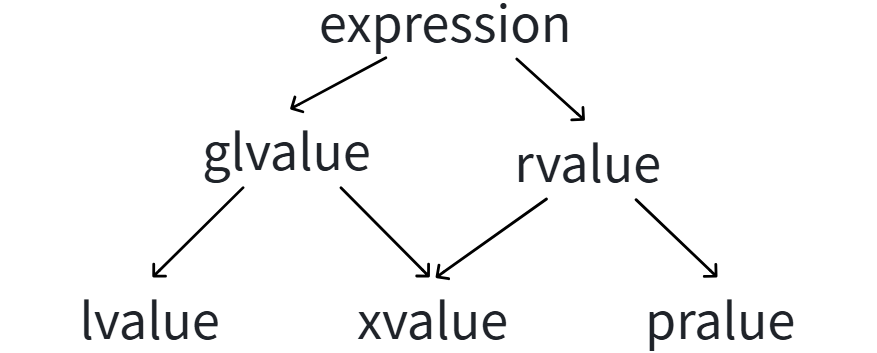

- **拥有身份且没有被移动的表达式被称作*左值 (lvalue)* 表达式；**
- **拥有身份且已经被移动的表达式被称作*将亡值 (xvalue)* 表达式；**
- **不拥有身份且可被移动的表达式被称作*纯右值 (prvalue)* 表达式；**

C++11 创造这一套繁杂但精密的分类，彻底厘清了“具名对象”（lvalue）与“匿名临时数据”（prvalue）的界限，并且通过“有名字但即将废弃的对象”（xvalue）在两者之间架起了一座桥梁，使得程序的运行效率得到了极大的释放。

## 2.3 左值引用和右值引用

在 C++ 中，“引用”的本质是给一段内存起个“别名”。在 C++11 之前，由于只有左值的概念占据主导，所以只有**左值引用**。但随着 C++11 引入了右值（纯右值和将亡值）的概念，为了能精准捕获这些“用后即弃”的临时对象，**右值引用**应运而生。

### 2.3.1 左值引用 (`&`)

左值引用是我们最熟悉的引用类型，它主要用于绑定那些“有明确内存地址、生命周期持久”的左值。

**核心语法与规则**

- **符号**：单取地址符 `&`。
- **基本规则**：**普通左值引用只能绑定到左值，绝对不能绑定到右值。**

```c++
// 左值引用给左值取别名
int& r1 = b;
int*& r2 = p;
int& r3 = *p;
string& r4 = s;
char& r5 = s[0];
```

### 2.3.2 常左值引用 (`const Type&`)

这是 C++ 中一个极其重要的特例。如果你在左值引用前面加上 `const`，它就变成了一个“海纳百川”的引用：**既能绑定左值，也能绑定右值。**

```c++
// 左值引用不能直接引用右值，但是const左值引用可以引用右值
const int& rx1 = 10;
const double& rx2 = x + y;
const double& rx3 = fmin(x, y);
const string& rx4 = string("11111");
```

**为什么 C++ 要开这个后门？**

在 C++11 之前，如果没有这个特例，像 `void print(const std::string& s)` 这样的函数就无法接受 `print("hello")` 这样的调用，因为 `"hello"` 隐式转换出的 `std::string` 是个右值。`const T&` 能够安全地绑定并**延长临时对象的生命周期**，同时 `const` 保证了你无法修改这个临时对象（修改一个马上就销毁的临时对象毫无意义）。

### 2.3.3 右值引用 (`&&`) 

右值引用是专门为了匹配和“榨干”右值（临时对象、将亡值）而诞生的。

**核心语法与规则**

- **符号**：双取地址符 `&&`。
- **基本规则**：**右值引用只能绑定到右值，绝对不能直接绑定到左值，但是右值引用可以引用move(左值)。**

```c++
// 右值引用不能直接引用左值，但是右值引用可以引用move(左值)
int&& rrx1 = move(b);
int*&& rrx2 = move(p);
int&& rrx3 = move(*p);
string&& rrx4 = move(s);
string&& rrx5 = (string&&)s;
```

为什么要费尽心机地去绑定一个右值？答案是：**为了安全地“偷”东西。**

当一个函数接受 `Type&&` 参数时，等于在告诉编译器：“传给我的对象一定是个马上要死掉的临时值。既然它要死了，那我就可以肆无忌惮地把它的内部资源（比如堆内存指针）直接据为己有，而不需要老老实实做深拷贝。” 这就是移动构造和移动赋值的基石。

> 避坑点：右值引用变量本身是一个“左值”！
>
> **虽然 `rref` 的类型是“右值引用”，但 `rref` 这个变量本身是有名字、有内存地址的，所以 `rref` 本身是一个左值！**
>
>```c++
// int&& rr1 = 10;
// 这里要注意的是，rr1的属性是左值，所以不能再被右值引用绑定，除非move一下
int& r6 = rr1;
// int&& rrx6 = rr1;    // 错误：不能直接绑定到左值
int&& rrx6 = move(rr1); // 但是可以引用move(左值)
>```

### 2.3.4 左值引用 vs 右值引用

| **特性**                 | **普通左值引用 (T&)**                            | **常左值引用 (const T&)**                                    | **右值引用 (T&&)**                                           |
| ------------------------ | ------------------------------------------------ | ------------------------------------------------------------ | ------------------------------------------------------------ |
| **能否绑定左值？**       | ✅ 能                                             | ✅ 能                                                         | ❌ 不能 (除非用 `std::move`)                                  |
| **能否绑定右值？**       | ❌ 不能                                           | ✅ 能                                                         | ✅ 能                                                         |
| **能否修改绑定的对象？** | ✅ 能                                             | ❌ 不能                                                       | ✅ 能 (为了偷资源必须能修改)                                  |
| **主要设计目的**         | 提供对象别名，避免按值传递的拷贝，允许修改入参。 | 接受任何类型的值（左/右）并保证只读，是 C++98 的万能传参方式。 | 专门捕获临时/将亡对象，转移资源所有权，实现极速的**移动语义**。 |

- **`T&`** 是用来**共享**和**修改**持久对象的。
- **`const T&`** 是用来**安全读取**任何对象的（兼容性极强）。
- **`T&&`** 是用来**掠夺**临时对象资源的（性能优化的核心）。

### 2.3.5 `std::move`

> [!IMPORTANT]
>
> `std::move` **绝对不会**改变原值的属性，它也**不能**移动任何东西。它的作用仅仅是**类型转换（Type Casting）**。
>
> ### 一、 `std::move` 到底做了什么？
>
> 在 C++ 标准库中，`std::move` 的本质是一个**无条件的静态类型转换（`static_cast`）**。
>
> 当你对一个变量 `x` 调用 `std::move(x)` 时，它只做了一件事：
>
> **将 `x` 从左值（lvalue）转换为右值引用（rvalue reference，具体来说是将亡值 xvalue）。**
>
> - **对内存的影响：无。** 它不会在内存中移动任何字节。
> - **对值的改变：无。** 变量 `x` 的值在调用 `std::move` 的这一刻，没有任何变化。
> - **对类型的改变：** 编译期类型转换，告诉编译器“我现在允许你把这个对象当作一个可以被夺走资源的对象（右值）来看待”。
>
> 你可以把 `std::move` 想象成一张**许可证书**：它对编译器说：“我保证后面不再需要这个对象原本的状态了，你可以大胆地把它的内部资源偷走。”
>
> ### 二、 那么，谁改变了原值的属性？
>
> 既然 `std::move` 只是开了个许可，那么到底是谁真正改变了原值（比如把指针置空、把长度置零）呢？
>
> 答案是：**移动构造函数** 或 **移动赋值运算符**。
>
> 让我们看一个具体的例子，假设我们有一个简单的 `MyString` 类：
>
> ```C++
> class MyString {
> public:
>     char* data;
>     // 普通构造函数
>     MyString(const char* p) {
>         data = new char[50];
>         // 假设这里进行了拷贝
>     }
> 
>     // 【关键】移动构造函数
>     MyString(MyString&& other) noexcept {
>         // 1. 偷取资源：把 other 的指针拿过来
>         this->data = other.data;
>         // 2. 破坏原对象：把 other 的指针置空
>         other.data = nullptr; 
>     }
> };
> 
> int main() {
>     MyString a("hello");
>     
>     // 仅仅调用 std::move(a)，此时 a 的内部毫无变化
>     // auto temp = std::move(a); // 假设只做了转换没赋值
>     // 真正的改变发生在这里：
>     MyString b(std::move(a)); 
>     // 1. std::move(a) 将 a 强转为右值引用。
>     // 2. 编译器看到右值引用，选择匹配了 MyString(MyString&& other) 这个构造函数。
>     // 3. 在移动构造函数内部，a 的 data 指针被赋给了 b，然后 a 的 data 被显式地置为 nullptr。
> }
> ```
>
> #### 拆解过程：
>
> 1. **发出许可：** `std::move(a)` 产生了一个绑定到 `a` 的右值引用。
> 2. **函数匹配：** 初始化 `b` 时，编译器寻找最匹配的构造函数。因为传入的是右值引用，所以它选中了**移动构造函数** `MyString(MyString&&)`，而不是拷贝构造函数 `MyString(const MyString&)`。
> 3. **执行偷窃：** 真正的移动操作是在 `MyString` 的移动构造函数内部编写的代码完成的。是这部分代码把原对象 `a` 的资源接管，并将 `a` 置于有效但未指定的状态（通常是指针置空）。
>
> ### 三、 如果只有 std::move，没有移动语义会怎样？
>
> 这是一个非常好的测试，可以证明 `std::move` 自己什么也干不了。
>
> 如果你对一个**基本类型**（如 `int`）或者一个**没有定义移动操作的类**使用 `std::move`：
>
> ```C++
> int x = 10;
> int y = std::move(x); 
> // x 依然是 10。对于基本类型，移动就是拷贝。
> ```
>
> 或者对于一个没有移动构造函数的旧类：
>
> ```C++
> struct OldStruct {
>     int data;
>     OldStruct(const OldStruct& other) { data = other.data; }
> };
> 
> OldStruct a;
> a.data = 100;
> OldStruct b(std::move(a)); 
> // a.data 依然是 100。
> ```
>
> 在上面的例子中，`std::move(a)` 成功将 `a` 转成了右值引用。但是编译器去寻找 `OldStruct` 的构造函数时，发现它没有 `OldStruct(OldStruct&&)`。
>
> 根据 C++ 规则，常量左值引用（`const OldStruct&`）是可以绑定到右值的。因此，它**退化成了普通的拷贝构造**。原值 `a` 毫发无损。
>
> ### 总结
>
> 1. `std::move` 的名字具有误导性，它**不移动**任何东西，仅仅是在编译期执行了**向右值引用的强制类型转换**。
> 2. 原值的属性和内部状态是否被改变，**完全取决于接收这个右值的函数**（通常是移动构造函数或移动赋值函数）**内部是怎么写的**。
> 3. 如果目标类型没有实现移动语义，即使使用了 `std::move`，最终执行的依然是拷贝，原值也不会被改变。

## 2.4 引用延长生命周期

当一个纯右值（临时对象）被绑定到一个 **`const` 左值引用** 或 **右值引用** 上时，这个临时对象的生命周期会被**延长**，直到这个引用本身的作用域结束为止。

- 如果没有引用绑定，临时对象在当前语句（分号）结束时就会被析构。
- 通过 `const T&` 或 `T&&` 绑定后，它就可以像普通局部变量一样存活，避免了不必要的立即销毁和重建。

在 C++ 中，“引用延长生命周期”是一个非常精妙且底层的机制。它打破了临时对象（右值）“用完即毁”的常识。

当你在 C++ 中调用一个函数（比如 `main()`），操作系统会在内存的“栈区”为这个函数分配一块专属的内存空间，这块空间就叫**栈帧**。

- **栈帧里有什么？** 存放着这个函数里所有的局部变量、函数参数、以及**隐藏的临时对象**。
- **栈帧的生死：** 只要函数还没执行完（或者没出大括号 `{}` 的作用域），这个栈帧就活着。一旦出了作用域，这块栈帧内存就会被瞬间回收（也就是所谓的“退栈”或“出栈”），里面的所有数据灰飞烟灭。

先看没有引用干预时，临时对象在栈帧里是怎么生存的：

```C++
class Widget {
public:
    Widget() { cout << "构造" << endl; }
    ~Widget() { cout << "析构" << endl; }
};

int main() {
    Widget(); // 产生一个临时对象（纯右值）
    cout << "分号后面的代码" << endl;
}
```

**栈帧视角执行过程：**

1. 执行到 `Widget();` 时，编译器会在当前 `main` 函数的栈帧里，临时开辟一块小内存来存放这个 `Widget` 对象。
2. **关键点：** 一旦遇到这行代码末尾的**分号（`;`）**，编译器认为这个完整表达式结束了。它会**立刻**调用析构函数，销毁这个临时对象，把这块小内存回收。
3. 所以输出顺序是：先“构造”，立刻“析构”，最后才打印“分号后面的代码”。

现在，我们用一个**常左值引用 (`const T&`)** 或者 **右值引用 (`T&&`)** 去绑定它。

```C++
int main() {
    const Widget& ref = Widget(); // 用 const 引用绑定临时对象
    // 或者: Widget&& ref = Widget(); 
    cout << "分号后面的代码" << endl;
}
```

**栈帧视角执行过程：**

1. 同样，编译器在栈帧里创建了这个临时对象。
2. **触发魔法：** 编译器看到你用 `const Widget& ref` 绑定了这个临时对象。编译器心想：“既然程序员给这个临时工发了一张‘长期通行证’（引用），那我就不能在分号处杀掉它了。”
3. **底层操作：** 编译器在底层其实做了一个转化，它偷偷把这个“临时对象”升级成了栈帧里的一个**“隐形局部变量”**。
4. **生命周期绑定：** 这个临时对象的寿命，现在完全和 `ref` 这个引用本身的寿命绑定在一起了。只要 `ref` 还没出大括号（**栈帧还没销毁**），这个临时对象就一直活着。
5. 所以输出顺序变成了：先“构造”，然后打印“分号后面的代码”，最后在 `main` 函数结束退栈时，才打印“析构”。

```C++
// Widget& ref = Widget(); // ❌ 编译报错！
```

为什么普通左值引用 `Widget&` 不具备续命能力？

这是 C++ 的安全设计决定的：普通左值引用意味着你不仅想引用它，还想**修改**它。但是，去修改一个没有名字的临时对象是毫无逻辑意义的（因为它马上就要消失，谁也看不到你的修改）。所以 C++ 标准强制规定，只有只读的 `const T&` 和专门接盘的 `T&&` 才有资格为其续命。

理解了栈帧，你就能一眼看穿 C++ 中最臭名昭著的 Bug：**返回局部变量的引用（悬垂引用 / Dangling Reference）**。很多人以为学了“引用延长生命周期”，就可以这么写：

```C++
const string& getTempString() { return string("I am a temporary string");  } // 危险！！！

const string& myRef = getTempString();  // 💥 灾难！myRef 绑定了一块死人的内存！
```

**为什么续命魔法在这里失效了？（栈帧级别的审判）：**

1. 调用 `getTempString()` 时，系统开辟了**函数 A 的栈帧**。
2. 在**函数 A 的栈帧**里，创建了临时的 `string` 对象。
3. 函数 A 把这个临时对象的内存地址（引用）当做返回值，扔给了 `main` 函数。
4. **致命时刻：** `getTempString()` 执行结束！它的**整个栈帧被系统毫不留情地一脚踹飞（退栈销毁）**！里面的那个临时 `string` 对象瞬间死亡，内存被回收。
5. 回到 `main` 函数（**函数 B 的栈帧**），你虽然用 `const string& myRef` 去接住了那个地址，但那个地址上的对象早已灰飞烟灭。

**核心总结：**

引用延长生命周期，**绝对无法跨越栈帧的生与死**。它只能在**当前栈帧内部**，把一个原本活不到下一行的临时对象，强行续命到当前作用域结束。一旦所在的栈帧被销毁，任何引用都无法起死回生。

## 2.5 左值和右值的参数匹配

在 C++ 中，当同一个函数有多个重载版本（分别接受不同类型的引用）时，编译器就像一个极其严格的交通警察。它会根据你传入的参数（实参）到底是左值还是右值，来决定把你“引流”到哪个具体的函数实现中。理解参数匹配的优先级，是掌握 C++11 移动语义和后续高级特性（如完美转发）的关键前提。

假设我们有一个名为 `process` 的函数，它有三个重载版本：

1. `void process(Type& x)` ：接受普通左值引用。
2. `void process(const Type& x)` ：接受常左值引用。
3. `void process(Type&& x)` ：接受右值引用。

```c++
void process(int& x)       { cout << "匹配到: 普通左值引用 (int&)" << endl; }
void process(const int& x) { cout << "匹配到: 常左值引用 (const int&)" << endl; }
void process(int&& x)      { cout << "匹配到: 右值引用 (int&&)" << endl; }
```

现在，我们来看看不同类型的参数传入时，编译器是如何进行匹配的。

当你传入一个普通的左值（有名字、能取地址的持久变量）时：

1. **第一志愿（完美匹配）**：**普通左值引用 `Type&`**。*理由*：这是天经地义的匹配，函数内部可以自由读取和修改这个持久变量。
2. **第二志愿（退而求其次）**：**常左值引用 `const Type&`**。*理由*：如果代码里没有写 `Type&` 的版本，编译器会认为：“虽然我不能让你修改它，但只读一下总没问题吧？”于是安全降级到 const 版本。
3. **绝对禁区**：**右值引用 `Type&&`**。*理由*：右值引用是专门用来“偷”资源的，左值还没死，你不能去偷它。编译器会直接报错拦截。

当你传入一个右值（纯右值字面量、临时对象，或 `std::move` 转换来的将亡值）时：

1. **第一志愿（完美匹配）**：**右值引用 `Type&&`**。*理由*：这是 C++11 为右值量身定制的 VIP 通道。编译器一看是右值，立刻优先送进这里，方便你在函数内部“榨干”它的剩余价值（移动语义）。
2. **第二志愿（历史遗留的避风港）**：**常左值引用 `const Type&`**。*理由*：**这是 C++ 最伟大的向后兼容设计之一。** 假设你用的是 C++98 时代写的旧库，那时候根本没有 `Type&&`。如果你传个临时变量进去，如果没有 `const Type&` 兜底接盘，所有旧代码就全废了。所以，如果找不到 `Type&&`，右值会安全地退化绑定到 `const Type&` 上（只读，且延长生命周期）。
3. **绝对禁区**：**普通左值引用 `Type&`**。*理由*：右值马上就要销毁了，如果你用 `Type&` 接住它并尝试修改它，修改一个即将消失的幽灵是没有任何意义的，编译器严禁这种行为。

一段简单的代码来验证上述规则：

```c++
int a = 10;
const int b = 20;

cout << "--- 传入左值 ---" << endl;
process(a);          // a 是普通左值 -> 匹配 int&
process(b);          // b 是常左值 -> 匹配 const int&

cout << "--- 传入右值 ---" << endl;
process(30);         // 30 是纯右值 -> 优先完美匹配 int&&
process(a + 5);      // a+5 是纯右值(临时结果) -> 优先完美匹配 int&&
process(std::move(a)); // std::move(a) 是将亡值 -> 优先完美匹配 int&&
```

**如果去掉右值引用版本：**

如果我们将上面代码中的 `void process(int&& x)` 这一行**注释掉**，然后再运行 `process(30);` 会发生什么？

**答案**：不会报错！它会触发“第二志愿”，向下退化，输出 `匹配到: 常左值引用 (const int&)`。

为了方便记忆，请查阅以下匹配优先级表（数字代表优先级，1 为最高，横线代表编译错误）：

| **实参类型 (传入的值)**            | **候选版本: Type&** | **候选版本: const Type&** | **候选版本: Type&&** |
| ---------------------------------- | ------------------- | ------------------------- | -------------------- |
| **普通左值** (如 `int a`)          | **1** (完美匹配)    | 2 (退化匹配)              | --- (编译报错)       |
| **常量左值** (如 `const int b`)    | --- (编译报错)      | **1** (完美匹配)          | --- (编译报错)       |
| **右值** (如 `10`, `std::move(a)`) | --- (编译报错)      | 2 (退化兜底匹配)          | **1** (优先完美匹配) |

**一句话总结：**

编译器在重载决议时极其聪明，**左值找左值引用，右值找右值引用**；如果找不到右值引用，右值会委屈一下自己，去找**常左值引用 (`const &`) 兜底**。

**重点**：右值引用版本的重载函数总是会优先“拦截”右值参数。

## 2.6 右值引用和移动语义的使用场景

这部分是 C++11 性能优化的核心。

### 2.6.1 左值引用主要使用场景

在 C++ 中，左值引用的主要使用场景集中在**传参提效**与**状态修改**两个方面：在函数传参时，通常使用常左值引用（`const T&`）来替代按值传递，从而在保证数据只读安全的同时彻底消除大型对象（如字符串、容器或复杂类）的深拷贝开销；在函数返回时，通过返回持久对象的普通左值引用（`T&`，如标准库容器的 `operator[]` 或赋值运算符 `operator=`），允许代码在外部直接修改对象内部状态或实现链式调用，但需严格遵守“绝不能返回局部变量的引用”以防触发内存崩溃。

在 C++98 中，左值引用的主要作用是：

1. **传参传引用**：如 `void func(const string& s)`，避免大对象按值传递时的昂贵深拷贝开销。

2. **函数返回引用**：如 `vector::operator[]`，返回引用允许修改容器内的元素。

	**痛点**：左值引用**绝对不能**返回局部变量的引用，因为局部变量在函数返回时就销毁了。如果要返回局部创建的大对象，必须传值返回，这就必然引发拷贝。

左值引⽤主要使⽤场景是**在函数中左值引⽤传参和左值引⽤传返回值时减少拷⻉**，**同时还可以修改实参和修改返回对象的价值**。左值引⽤已经解决⼤多数场景的拷贝效率问题，但是有些场景不能使⽤传左值引⽤返回，如之前力扣的addStrings和generate函数，C++98中的解决⽅案只能是被迫使⽤输出型参数解决。

那么C++11以后这⾥可以使⽤右值引⽤做返回值解决吗？显然是不可能的，因为这⾥的**本质是返回对象是⼀个局部对象，函数结束这个对象就析构销毁了，右值引⽤返回也无法概念对象已经析构销毁的事实。**

```c++
// 传值返回需要拷贝
string addStrings(string num1, string num2) 
{
    string str;
    int end1 = num1.size() - 1, end2 = num2.size() - 1;
    int next = 0;  // 进位
    while (end1 >= 0 || end2 >= 0)
    {
        int val1 = end1 >= 0 ? num1[end1--] - '0' : 0;
        int val2 = end2 >= 0 ? num2[end2--] - '0' : 0;
        int ret = val1 + val2 + next;
        next = ret / 10;
        ret = ret % 10;
        str += ('0' + ret);
    }
    if (next == 1)
        str += '1';
    reverse(str.begin(), str.end());
    return str;
}
```

### 2.6.2 移动构造和移动赋值

为了解决上述痛点，C++11 引入了移动语义。如果对象内部维护了动态内存（如指针）：

- **移动构造 (`T(T&& other)`)**：接收一个右值引用，直接把 `other` 内部的指针“偷”过来据为己有，然后把 `other` 的指针置空。开销从 $O(N)$ 变成了 $O(1)$。
- **移动赋值 (`T& operator=(T&& other)`)**：接收右值，先释放自己当前拥有的资源，然后“偷”走 `other` 的资源。

在 C++11 引入右值引用之后，**移动构造（Move Constructor）**和**移动赋值（Move Assignment Operator）**成为了 C++ 性能飞跃的绝对主力。

如果用一句话概括它们的核心思想，那就是：**“趁火打劫”**。当发现传入的对象是一个马上就要销毁的临时对象（右值/将亡值）时，不去费时费力地“克隆（深拷贝）”它的数据，而是直接把它的底层资源（如堆内存指针）**“偷”**过来据为己有。

在讲解移动语义之前，必须先看这个辅助函数：

```C++
void swap(string& ss)
{
    ::swap(_str, ss._str);
    ::swap(_size, ss._size);
    ::swap(_capacity, ss._capacity);
}
```

移动语义的本质是“偷资源”。怎么偷最快、最安全？**交换（Swap）**就是最好的偷窃方式。您的 `swap` 函数直接交换了底层的指针和大小，这就是实现 $O(1)$ 极速移动的基石。

在没有移动语义的 C++98 时代，如果我们写出这样的代码：

```C++
MyString createString() {
    MyString tmp("极其巨大的字符串数据...");
    return tmp;
}

MyString s = createString(); 
```

底层会发生极其凄惨的**深拷贝（Deep Copy）**：

1. `tmp` 在堆上分配了 100MB 内存。
2. 返回时，临时对象需要把这 100MB 数据**原封不动地复制**给 `s`。
3. 复制完之后，`tmp` 瞬间销毁，把它原本那 100MB 内存给释放掉。

刚建好就销毁，为了传数据又重新分配一次内存，这是极大的浪费。移动构造和移动赋值就是为了消除这种“无意义的深拷贝”而生的。

#### (1) 移动构造

**规定：**第一个参数必须是**该类类型的右值引用**。

**触发时机**：用一个右值（临时对象、`std::move` 产生的值）来**初始化**一个新对象时。

**核心逻辑**：直接接管右值对象的堆内存指针，然后把右值对象的指针置为空（防止它析构时把我们刚偷来的内存给释放了）。

> [!WARNING]
>
> **只有需要深拷贝的类型需要移动构造**
>
> 移动构造的本质是“资源所有权的掠夺”：对于深拷贝类型（如含有堆内存、文件句柄的对象），移动构造只需简单地“偷走”指针并让原对象置空，从而避开了开销巨大的内存申请与数据搬运；而对于浅拷贝类型（如基本数据类型），数据就存在对象本身，移动的过程物理上等同于拷贝字节，没有任何“捷径”可走，因此专门编写移动构造毫无性能收益。

```C++
class string
{
public:
	string(const char* str = "")
		:_size(strlen(str))
		, _capacity(_size)
	{
		//cout << "string(char* str)-构造" << endl;
		_str = new char[_capacity + 1];
		strcpy(_str, str);
	}

	// 拷贝构造
	string(const string& s)
		:_str(nullptr)
	{
		cout << "string(const string& s) -- 拷贝构造" << endl;
		reserve(s._capacity);
		for (auto ch : s)
			push_back(ch);
	}

	void swap(string& ss)
	{
		::swap(_str, ss._str);
		::swap(_size, ss._size);
		::swap(_capacity, ss._capacity);
	}

	// 移动构造
	// 右值引用的属性是左值 所以当swap函数的参数是左值引用时也能匹配右值引用
	string(string&& s)
	{
		cout << "string(string&& s) -- 移动构造" << endl;
		// 转移掠夺你的资源
		swap(s);
	}
private:
	char* _str = nullptr;
	size_t _size = 0;
	size_t _capacity = 0;
};
```

简而言之：**拷贝构造是“老老实实克隆”，而移动构造是“合法地偷窃”。**

```C++
string(const string& s)
	:_str(nullptr)
{
	cout << "string(const string& s) -- 拷贝构造" << endl;
	reserve(s._capacity);
	for (auto ch : s)
		push_back(ch);
}
```

**底层执行逻辑：**

1. **触发场景**：当您用一个已经存在且不想被破坏的对象（左值）来初始化新对象时触发，例如 `csa::string s2 = s1;`。
2. **开辟新天地**：首先将自身的指针初始化为 `nullptr`。然后调用 `reserve(s._capacity)`。这一步在底层会执行极其耗时的 `new char[n + 1]` 操作，向操作系统申请一块全新的、与 `s1` 一样大的堆内存。
3. **逐字抄写**：通过 `for` 循环和 `push_back`，将 `s1` 中的字符一个一个地复制到新申请的内存中。
4. **结局**：操作完成后，`s1` 和 `s2` 各自拥有一块独立的内存，里面的内容一模一样。修改 `s2` 绝不会影响 `s1`。

**性能代价**：极高。包含了一次昂贵的动态内存分配以及 $O(N)$ 复杂度的循环拷贝。

```C++
// 移动构造
// 右值引用的属性是左值 所以当swap函数的参数是左值引用时也能匹配右值引用
string(string&& s)
{
	cout << "string(string&& s) -- 移动构造" << endl;
	// 转移掠夺你的资源
	swap(s);
}
```

**底层执行逻辑：**

1. **触发场景**：当您用一个马上就要销毁的临时对象（右值/将亡值）来初始化新对象时触发，例如 `csa::string s2 = std::move(s1);` 或 `csa::string s2 = csa::string("temp");`。

2. **巧妙的初始状态**：请注意您在类末尾声明的私有成员：

	```C++
	char* _str = nullptr;
	size_t _size = 0;
	size_t _capacity = 0;
	```

	当进入移动构造函数的 `{}` 内部之前，当前新对象已经被**默认初始化**为了一个空壳（指针为空，大小为0）。

3. **极速替换 (`swap`)**：您直接调用了 `swap(s)`。此时发生了魔法：

	- 当前对象的 `nullptr` 指针，跟传入对象 `s` 拥有的那一整块堆内存指针**互换**了。
	- 瞬间，当前对象不费吹灰之力就拥有了 `s` 的所有数据。
	- 而传入对象 `s` 则被迫接管了当前对象的 `nullptr`。

4. **安全善后**：由于 `s` 是一个将亡值，移动构造函数执行完毕后，`s` 马上就会被销毁并调用析构函数 `~string()`。在析构函数中执行 `delete[] _str;` 时，因为此时 `s._str` 已经被换成了 `nullptr`，而 C++ 中 `delete[] nullptr` 是安全且不会做任何事的，完美避免了内存泄漏和崩溃。

**性能代价**：极低。没有内存分配，没有数据遍历，只有三个内部变量（指针和整数）的 $O(1)$ 极速交换。

| **维度**       | **拷贝构造 string(const string& s)** | **移动构造 string(string&& s)**            |
| -------------- | ------------------------------------ | ------------------------------------------ |
| **实参类型**   | 左值（持久存在的对象）               | 右值（临时对象、`std::move` 转换的值）     |
| **内存操作**   | 申请全新内存 (`new`) + 数据全量复制  | 无内存分配，直接**互换指针**               |
| **源对象状态** | 完好无损，数据依然存在且有效         | 被彻底掏空（指针变为 `nullptr`）           |
| **时间复杂度** | $O(N)$（与字符串长度成正比）         | $O(1)$（无论字符串多长，只需交换几个变量） |
| **核心目的**   | 保证数据的独立性和安全性             | 榨干临时对象的剩余价值，追求极致性能       |

#### (2) 移动赋值运算符

**核心逻辑**：除了要接管右值对象的资源、掏空右值对象之外，还必须**先清理自己现有的资源**。

```C++
// 移动赋值 
string& operator=(string&& s)
{
	cout << "string& operator=(string&& s) -- 移动赋值" << endl;
	swap(s);        // 核心魔法全在这里
	return *this;   // 支持链式赋值 (a = b = c)
}
```

**触发场景：** 当您要把一个右值（临时对象，或被 `std::move` 强转的对象）赋值给一个**已经存在**的对象时触发。例如：`str1 = std::move(str2);` 或者 `str1 = csa::string("new string");`。

假设 `str1` 原本已经包含了一段 **100MB 的旧数据**，现在我们执行 `str1 = std::move(str2);`，试图把 `str2`（带有新数据）移动给 `str1`。

当进入移动赋值函数的 `{}` 内部时，到底发生了什么？

执行 `swap(s);`——`str1`（即 `this`）原本指向那 100MB 旧内存的指针，和 `str2`（即参数 `s`）指向新数据的指针，进行了瞬间互换。`str1` 不费吹灰之力，没有申请一丁点新内存，就成功接管了 `str2` 的新数据。

互换指针之后，`str2`（参数 `s`）被迫接盘了 `str1` 原本那 **100MB 的废弃旧数据**。接下来，重点来了：

- `operator=` 函数执行完毕，准备 `return *this;`。
- 作为右值的 `str2`，由于它的生命周期（作为将亡值）即将结束，它会自动调用您的析构函数 `~string()`。
- 在析构函数中，它执行了 `delete[] _str;`。
- **结果**：`str2` 临死前，顺手把原本属于 `str1` 的、现在不需要的 100MB 旧内存给销毁得干干净净！

对比传统写法，如果不用 `swap`，传统的移动赋值我们通常得这么写（又长又繁琐）：

```C++
// 传统的笨重写法：
string& operator=(string&& s)
{
    // 1. 必须检查是否自己给自己赋值 (如 s = std::move(s))
    if (this != &s) 
    {
        // 2. 必须手动释放自己原来的内存，否则会内存泄漏
        delete[] _str; 

        // 3. 开始偷窃资源
        _str = s._str;
        _size = s._size;
        _capacity = s._capacity;

        // 4. 必须手动将源对象掏空，防止它析构时把刚偷来的内存释放掉
        s._str = nullptr;
        s._size = 0;
        s._capacity = 0;
    }
    return *this;
}
```

**再看看 `swap(s);`，这三个问题它是怎么解决的：**

1. **免去了释放旧内存的代码**：交给了临时对象的析构函数去自动完成（借刀杀人）。
2. **免去了掏空源对象的代码**：源对象的指针在 `swap` 后自然指向了安全的地方（要么是旧内存，要么是初始的 `nullptr`），可以直接安全析构。
3. **天然免疫自我赋值**：如果是 `str1 = std::move(str1);`，那么 `swap(s)` 就是自己和自己交换指针，什么都没改变。然后函数结束，因为 `str1` 是外部传进来的持久对象（只是被转型了），它并不会立刻销毁，所以旧内存依然安全存在。完美避开了传统写法中如果没有 `if (this != &s)` 就会导致自己把自己的内存 `delete` 掉的致命 Bug！

| **操作类型** | **触发场景**                    | **资源处理方式**                                             | **性能**      |
| ------------ | ------------------------------- | ------------------------------------------------------------ | ------------- |
| **拷贝构造** | `MyString s2 = s1;` (s1 是左值) | 开辟新内存 $\rightarrow$ 逐字节复制                          | 极慢 ($O(N)$) |
| **移动构造** | `MyString s2 = std::move(s1);`  | 偷取指针 $\rightarrow$ 掏空原对象                            | 极快 ($O(1)$) |
| **拷贝赋值** | `s2 = s1;` (s1, s2 均存在)      | 释放自身旧内存 $\rightarrow$ 开辟新内存 $\rightarrow$ 复制   | 极慢 ($O(N)$) |
| **移动赋值** | `s2 = std::move(s1);`           | 释放自身旧内存 $\rightarrow$ 偷取指针 $\rightarrow$ 掏空原对象 | 极快 ($O(1)$) |

### 2.6.3 右值引用和移动语义解决传值返回问题

这里我们分析一个返回自定义的对象（比如自定义的 `String`类）的函数：`csa::string addStrings(csa::string num1, csa::string num2){ }`

```c++
#include<vector>
#include<iostream>
#include<map>
#include<string>
#include<assert.h>
#include<string.h>
#include<algorithm>
using namespace std;

namespace csa
{
	class string
	{
	public:
		typedef char* iterator;
		typedef const char* const_iterator;
		iterator begin() { return _str; }
		iterator end() { return _str + _size; }
		const_iterator begin() const { return _str; }
		const_iterator end() const { return _str + _size; }
		string(const char* str = "")
			:_size(strlen(str))
			, _capacity(_size)
		{
			cout << "string(char* str)-构造" << endl;
			_str = new char[_capacity + 1];
			strcpy(_str, str);
		}

		// 拷贝构造
		string(const string& s)
			:_str(nullptr)
		{
			cout << "string(const string& s) -- 拷贝构造" << endl;
			reserve(s._capacity);
			for (auto ch : s)
			{
				push_back(ch);
			}
		}

		void swap(string& ss)
		{
			::swap(_str, ss._str);
			::swap(_size, ss._size);
			::swap(_capacity, ss._capacity);
		}
		string& operator=(const string& s)
		{
			cout << "string& operator=(const string& s) -- 拷贝赋值" <<
				endl;
			if (this != &s)
			{
				_str[0] = '\0';
				_size = 0;
				reserve(s._capacity);
				for (auto ch : s)
				{
					push_back(ch);
				}
			}
			return *this;
		}
		~string()
		{
			//cout << "~string() -- 析构" << endl;
			delete[] _str;
			_str = nullptr;
		}

		char& operator[](size_t pos)
		{
			assert(pos < _size);
			return _str[pos];
		}

		void reserve(size_t n)
		{
			if (n > _capacity)
			{
				char* tmp = new char[n + 1];
				if (_str)
				{
					strcpy(tmp, _str);
					delete[] _str;
				}
				_str = tmp;
				_capacity = n;
			}
		}

		void push_back(char ch)
		{
			if (_size >= _capacity)
			{
				size_t newcapacity = _capacity == 0 ? 4 : _capacity *
					2;
				reserve(newcapacity);
			}
			_str[_size] = ch;
			++_size;
			_str[_size] = '\0';
		}

		string& operator+=(char ch)
		{
			push_back(ch);
			return *this;
		}

		const char* c_str() const { return _str; }
		size_t size() const { return _size; }
	private:
		char* _str = nullptr;
		size_t _size = 0;
		size_t _capacity = 0;
	};
    
	// 传值返回需要拷贝
	csa::string addStrings(csa::string num1, csa::string num2) {
		csa::string str;
		int end1 = num1.size() - 1, end2 = num2.size() - 1;
		// 进位
		int next = 0;
		while (end1 >= 0 || end2 >= 0)
		{
			int val1 = end1 >= 0 ? num1[end1--] - '0' : 0;
			int val2 = end2 >= 0 ? num2[end2--] - '0' : 0;
			int ret = val1 + val2 + next;
			next = ret / 10;
			ret = ret % 10;
			str += ('0' + ret);
		}
		if (next == 1)
			str += '1';
		reverse(str.begin(), str.end());
		return str;
	}
};
```

**这段代码适用于场景一和场景三。**

```linux
g++ test.cc -std=c++11 -fno-elide-constructors -o test
```

```c++
#include<vector>
#include<iostream>
#include<map>
#include<string>
#include<assert.h>
#include<string.h>
#include<algorithm>
using namespace std;

namespace csa
{
	class string
	{
	public:
		typedef char* iterator;
		typedef const char* const_iterator;
		iterator begin() { return _str; }
		iterator end() { return _str + _size; }
		const_iterator begin() const { return _str; }
		const_iterator end() const { return _str + _size; }
		string(const char* str = "")
			:_size(strlen(str))
			, _capacity(_size)
		{
			cout << "string(char* str)-构造" << endl;
			_str = new char[_capacity + 1];
			strcpy(_str, str);
		}

		// 拷贝构造
		string(const string& s)
			:_str(nullptr)
		{
			cout << "string(const string& s) -- 拷贝构造" << endl;
			reserve(s._capacity);
			for (auto ch : s)
			{
				push_back(ch);
			}
		}

		void swap(string& ss)
		{
			::swap(_str, ss._str);
			::swap(_size, ss._size);
			::swap(_capacity, ss._capacity);
		}
		// 移动构造
		string(string&& s)
		{
			cout << "string(string&& s) -- 移动构造" << endl;
			// 转移掠夺你的资源
			swap(s);
		}

		string& operator=(const string& s)
		{
			cout << "string& operator=(const string& s) -- 拷贝赋值" <<
				endl;
			if (this != &s)
			{
				_str[0] = '\0';
				_size = 0;
				reserve(s._capacity);
				for (auto ch : s)
				{
					push_back(ch);
				}
			}
			return *this;
		}

		// 移动赋值
		string& operator=(string&& s)
		{
			cout << "string& operator=(string&& s) -- 移动赋值" << endl;
			swap(s);
			return *this;
		}
        
		~string()
		{
			//cout << "~string() -- 析构" << endl;
			delete[] _str;
			_str = nullptr;
		}

		char& operator[](size_t pos)
		{
			assert(pos < _size);
			return _str[pos];
		}

		void reserve(size_t n)
		{
			if (n > _capacity)
			{
				char* tmp = new char[n + 1];
				if (_str)
				{
					strcpy(tmp, _str);
					delete[] _str;
				}
				_str = tmp;
				_capacity = n;
			}
		}

		void push_back(char ch)
		{
			if (_size >= _capacity)
			{
				size_t newcapacity = _capacity == 0 ? 4 : _capacity *
					2;
				reserve(newcapacity);
			}
			_str[_size] = ch;
			++_size;
			_str[_size] = '\0';
		}

		string& operator+=(char ch)
		{
			push_back(ch);
			return *this;
		}

		const char* c_str() const { return _str; }
		size_t size() const { return _size; }
	private:
		char* _str = nullptr;
		size_t _size = 0;
		size_t _capacity = 0;
	};
    
	// 传值返回需要拷贝
	csa::string addStrings(csa::string num1, csa::string num2) {
		csa::string str;
		int end1 = num1.size() - 1, end2 = num2.size() - 1;
		// 进位
		int next = 0;
		while (end1 >= 0 || end2 >= 0)
		{
			int val1 = end1 >= 0 ? num1[end1--] - '0' : 0;
			int val2 = end2 >= 0 ? num2[end2--] - '0' : 0;
			int ret = val1 + val2 + next;
			next = ret / 10;
			ret = ret % 10;
			str += ('0' + ret);
		}
		if (next == 1)
			str += '1';
		reverse(str.begin(), str.end());
		return str;
	}
};
```

**这段代码适用于场景二和场景四。**

```c++
int main()//场景三和四的测试代码
{
	csa::string ret;
	ret = Solution().addStrings("11111111111111111111", "222222222222222222222222222");
	cout << ret.c_str() << endl;
	return 0;
}
int main()//场景一和二的测试代码
{
	csa::string ret= Solution().addStrings("11111111111111111111", "222222222222222222222222222");
	cout << ret.c_str() << endl;
	return 0;
}
```

#### 场景一：右值对象构造，只有拷贝构造，没有移动构造的场景

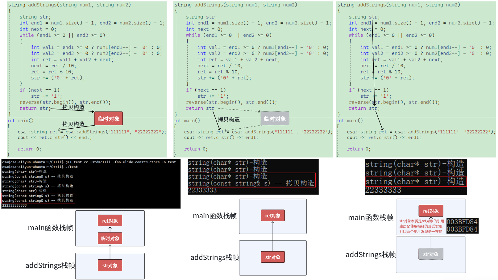

**一代优化：**

- **前两个构造是因为编译器将传参的两个string从构造+拷贝构造直接优化为构造。**

- **第三个构造是函数内部构造的str对象。**

- **最后传值返回应该是拷贝构造给临时对象+临时对象拷贝构造给ret对象也被直接优化成拷贝构造。**

**二代优化：**

- **前面两个构造是因为编译器将传参的两个string从构造+拷贝构造直接优化为构造。**

- **第三个构造是编译器将函数内部构造的str对象，然后拷贝构造给临时对象+临时对象拷贝构造给ret对象。**

- **这三个合三为一，相当于str对象其实是ret对象的别名。**

#### 场景二：右值对象构造，有拷贝构造，也有移动构造的场景

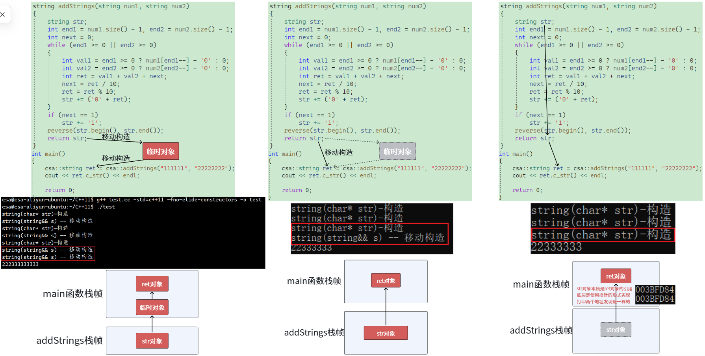

函数返回时，编译器发现 `tmp` 马上要销毁了（被视为将亡值），于是调用 **移动构造** 生成临时返回对象（偷指针，极快）。

用临时对象初始化 `s` 时，临时对象是右值，再次调用 **移动构造** 初始化 `s`（再次偷指针，极快）。全程没有发生任何内存级别的深拷贝操作。

**一代优化：**

- **前面两个构造是因为编译器将传参的两个string从构造+移动构造直接优化为构造。**
- **第三个构造是函数内部构造的str对象。**
- **最后传值返回本应该是移动构造给临时对象+临时对象移动构造给ret对象，但是在增加移动构造和移动赋值之后，str对象被定义为将亡值(右值)，所以直接移动构造，ret抢夺str资源。**

**二代优化：**

- **前面两个构造是因为编译器将传参的两个string从构造+移动构造直接优化为构造。**
- **第三个构造是编译器将函数内部构造的str对象，然后移动构造给临时对象+临时对象移动构造给ret对象，这三个合三为一，相当于str对象其实是ret对象的别名。**

#### 场景三：右值对象赋值，只有拷贝构造和拷贝赋值，没有移动构造和移动赋值的场景

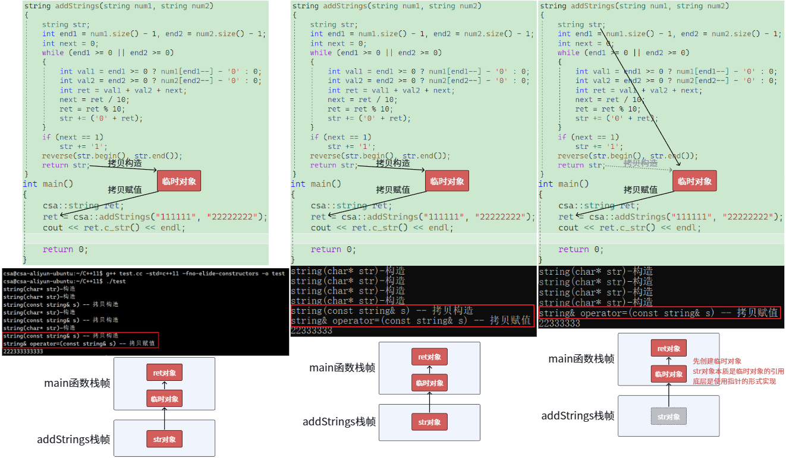

函数返回，拷贝构造产生临时对象。

执行 `=` 操作符，调用普通的 **拷贝赋值函数 `operator=(const MyString&)`**。这会销毁 `s` 原来的内存，重新分配内存，并把临时对象的内容一个个复制过来。开销极大。

**一代优化：**

- **第一个构造是ret对象构造。**
- **后面两个构造是因为编译器将传参的两个string从构造+拷贝构造直接优化为构造。**
- **第四个构造是函数内部构造的str对象。**
- **最后传值返回是拷贝构造给临时对象+临时对象拷贝赋值给ret对象。**

**二代优化：**

- **第一个构造是ret对象构造。**
- **后面两个构造是因为编译器将传参的两个string从构造+拷贝构造直接优化为构造。**
- **第四个构造相当于是函数值返回时构造的临时对象。**

- **最后传值返回应该是拷贝构造给临时对象+临时对象拷贝赋值给ret对象，编译器优化为直接拷贝赋值，也就是相当于先创建的临时对象，让str为这个临时对象的别名。**

#### 场景四：右值对象赋值，既有拷贝构造和拷贝赋值，也有移动构造和移动赋值的场景

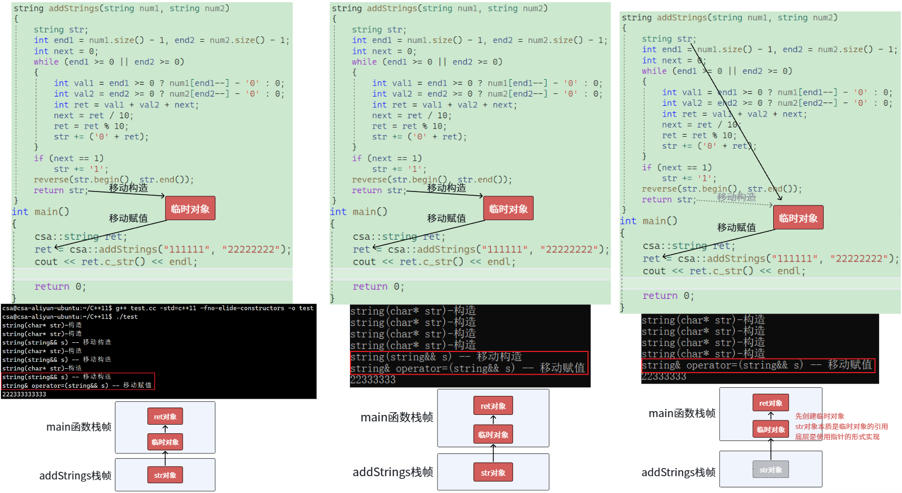

函数返回，移动构造产生临时对象。

执行 `=` 时，因为右边是临时对象（右值），编译器精准匹配到 **移动赋值函数 `operator=(MyString&&)`**。`s` 直接丢弃旧内存，接管临时对象的内存指针。效率拉满。

**一代优化：**

- **前面两个构造是因为编译器将传参的两个string从构造+移动构造直接优化为构造。**
- **第三个构造是函数内部构造的str对象。**
- **最后传值返回本应该是移动构造给临时对象+临时对象移动赋值给ret对象，但是在增加移动构造和移动赋值之后，str对象被定义为将亡值(右值)，所以直接移动赋值，ret抢夺str资源。**

**二代优化：**

- **第一个构造是ret对象构造。**
- **后面两个构造是因为编译器将传参的两个string从构造+移动构造直接优化为构造。**

- **第四个构造是相当于函数函数返回结果的临时对象。**

- **最后传值返回应该是str对象移动构造给临时对象+临时对象移动赋值给ret对象，编译器优化为直接移动赋值，也就是相当于先创建的临时对象，让str为这个临时对象的别名。**

### 2.6.4 右值引用和移动语义在传参中的提效

除了返回值，在给容器（如 `std::vector`）插入元素时，移动语义同样提效显著。

```C++
std::vector<string> vec;
string str = "large string data...";

// 场景 1：传入左值
vec.push_back(str); // 匹配 push_back(const T&)，必须在 vector 内部深拷贝一份 str

// 场景 2：传入右值 (临时对象或强行 move)
vec.push_back("temporary string"); // 匹配 push_back(T&&)
vec.push_back(std::move(str));     // 匹配 push_back(T&&)
// 在 vector 内部，直接调用 string 的移动构造函数，把指针偷过来，省去了一次庞大的深拷贝！
```

这就是为什么在 C++11 之后，标准库容器插入临时对象的速度变得非常快的原因。

## 2.7 左值引用和右值引用的价值

### 2.7.1 左值引用的价值 (`T&` 和 `const T&`)

> [!IMPORTANT]
>
> **核心隐喻：一把备用钥匙（给已存在、有持久生命周期的对象起别名）**
>
> 左值引用的出现主要是在 C++98 甚至更早的时代，它的核心价值在于**替代指针的部分功能，提供更安全、更符合直觉的语法**。
>
> #### 1. 避免高昂的拷贝代价（性能价值）
>
> 这是左值引用最日常的用途。当你向函数传递一个庞大的对象时，按值传递会触发深拷贝，导致极大的内存和时间开销。使用 `const T&`（常量左值引用），你可以让函数直接“看”到原对象，既避免了拷贝，又保证了原对象不会被意外修改。
>
> ```C++
> void printData(const std::vector<int>& data); // 零拷贝，只读
> ```
>
> #### 2. 实现原位修改与双向数据传递（语义价值）
>
> 指针虽然也能修改原值，但语法繁琐（需要解引用 `*` 和判空）。左值引用提供了一种“非空绑定”的机制，使得函数内部可以像操作普通变量一样，直接修改外部传入的参数。
>
> ```C++
> void swap(int& a, int& b) { // 直接操作原对象
>      int temp = a;
>      a = b;
>      b = temp;
> }
> ```
>
> > [!NOTE]
> >
> > 不支持c++11进行优化代码：如果一些编译器不支持c++11，那对于输出一个二维`vector`这样的情况，此时你想优化应该怎么搞？不支持c++11，表示编译器的优化没有那么好，那么就需要使用左值引用，作为输出型参数使用。
>
> #### 3. 支持运算符重载与级联调用（语法价值）
>
> 没有左值引用，C++ 的面向对象语法会非常别扭。比如赋值运算符 `=` 和输出流 `<<` 能够实现连续调用（`a = b = c;` 或 `cout << a << b;`），正是因为它们返回的是对象的左值引用。

### 2.7.2 右值引用的价值 (`T&&`)

> [!IMPORTANT]
>
> **核心隐喻：资源清道夫（精准锁定即将消亡的临时对象，榨干其剩余价值）**
>
> 右值引用是 C++11 引入的一场革命。它的出现直接让现代 C++ 的性能提升了一个维度。它的核心价值在于**解决 C++98 中长期存在的“无意义深拷贝”痛点**。
>
> #### 1. 开启“移动语义”（革命性的性能提升）
>
> 在 C++11 之前，如果你要把一个临时对象（比如函数返回的内部变量、或者匿名的临时字符串）赋值给另一个对象，编译器只能老老实实地重新开辟内存，把临时对象的数据一点点拷贝过去，然后再把临时对象销毁。这极其低效。
>
> 右值引用 `T&&` 能够**精准识别出那些“马上就要被销毁”的将亡值（xvalue）和纯右值（prvalue）**。
>
> 既然这个对象马上就要死了，我们为什么还要拷贝它的数据？直接**把它的内存指针“偷”过来**不就行了？
>
> 这就是移动构造函数的核心价值：将 $O(N)$ 复杂度的深拷贝，降维成 $O(1)$ 的指针交接。
>
> ```C++
> // 移动构造函数示例
> class String {
>    	char* data;
> public:
>        String(String&& other) { 
>            this->data = other.data; // 1. 偷走指针
>            other.data = nullptr;    // 2. 掏空原对象，防止析构时误删
>        }
> };
> ```
>
> #### 2. 完美转发（泛型编程的基石）
>
> 在编写模板函数（如智能指针的 `std::make_unique` 或容器的 `emplace_back`）时，我们需要将外层接收到的参数，原封不动地传递给内层的构造函数。
>
> “原封不动”不仅指数据的值，还包括数据的**值类别（它是左值还是右值？）**。
>
> 结合模板类型推导规则（万能引用 `T&&`）和 `std::forward`，右值引用使得 C++ 能够实现完美转发：传进来是左值，传给里层就是左值（触发拷贝）；传进来是右值，传给里层就是右值（触发移动）。这极大地简化了标准库的底层实现。

### 2.7.3 价值汇总与对比

| **维度**           | **左值引用 (T&)**                                          | **右值引用 (T&&)**                                           |
| ------------------ | ---------------------------------------------------------- | ------------------------------------------------------------ |
| **操作对象**       | 具名变量、生命周期持久的对象。                             | 匿名变量、临时对象、生命周期即将结束的对象。                 |
| **底层核心动作**   | **共享（Share / Alias）**                                  | **转移（Steal / Move）**                                     |
| **解决的核心痛点** | 避免函数传参时的对象拷贝开销；提供比指针更安全的引用语义。 | 消除临时对象赋值/返回时的无意义深拷贝；实现完美转发。        |
| **对原对象的影响** | 可能修改原对象的值（非 const 情况下），但原对象结构完整。  | 通常会**掏空（破坏）**原对象的内部资源，使其进入有效但未指定的状态。 |
| **时代意义**       | C++ 语法的基石之一（C++98 确立）。                         | 现代 C++（C++11 及以后）性能起飞的核心引擎。                 |

**一句话总结：**

左值引用是为了“不拷贝就能看/改”**，它维护了对象的共享权；右值引用是为了**“不拷贝直接抢”，它实现了资源的零成本转移。两者的结合，构成了现代 C++ 高效内存管理的基础。

## 2.8 引用折叠

可以说，如果没有引用折叠，C++11 的模板推导就会崩溃，大名鼎鼎的**“完美转发（Perfect Forwarding）”**和 `std::forward` 也就根本无法实现。

在 C++ 语法中，有一个硬性规定：**程序员不能直接在代码里写“引用的引用”**。

比如，你写出下面这样的代码，编译器会直接甩你一个语法错误：

```C++
int a = 10;
int& & ref = a; // ❌ 语法错误！不允许直接声明引用的引用
```

但是在使用了**模板（Template）**、**类型别名（`typedef`/`using`）**或者 **`auto` 类型推导**时，编译器在底层做类型替换的过程中，经常会“不小心”制造出引用的引用。

```C++
template <typename T>
void test(T v) {
    // 假设某次推导中，T 被推导成了 int&
    // 那么下面这行代码实例化后，就会变成 int& & ref = v;
    T& ref = v; 
}
```

通过模板或 typedef 中的类型操作可以构成引⽤的引⽤时，为了在这些底层自动生成的代码中合法地处理“引用的引用”，C++11 委员会制定了一套“消消乐”规则，这就是**引用折叠**。这时C++11给出了⼀个引⽤折叠的规则：右值引⽤的右值引⽤折叠成右值引⽤，所有其他组合均折叠成左值引⽤。

规则极其简单，就像乘法口诀一样。当编译器在底层遇到引用的引用时，它会按照以下规则将其“折叠”成一个单一的引用：

| **原始组合 (外层引用 + 内层引用)** | **折叠后的最终结果** |
| ---------------------------------- | -------------------- |
| `&` + `&`                          | **`&` (左值引用)**   |
| `&` + `&&`                         | **`&` (左值引用)**   |
| `&&` + `&`                         | **`&` (左值引用)**   |
| `&&` + `&&`                        | **`&&` (右值引用)**  |

**终极记忆口诀：“左值引用极其强势（具有传染性）”**

只要折叠的过程中出现了**哪怕一个左值引用（`&`）**，最终的结果必定是左值引用。

只有当**双方都是右值引用（`&&` + `&&`）**时，最终结果才是右值引用。

引用折叠在 C++ 中最大的舞台，就是结合模板推导产生的**万能引用（或称转发引用，Forwarding Reference）**。

当你写出一个这样的模板函数时：

```C++
template <typename T>
void func(T&& param) {
    // ...
}
```

这里的 `T&&` **绝对不是单纯的右值引用！** 当 `T` 是模板参数时，`T&&` 被称为万能引用，它既能接左值，也能接右值。它是如何做到的？全靠**引用折叠**！

**场景 1：传入左值时发生了什么？**

```C++
int x = 10;
func(x); // x 是普通的左值
```

1. 编译器看到你传入了一个左值 `x`。C++ 规定，当把左值传给万能引用时，模板参数 `T` 会被推导为**左值引用类型**，也就是 `int&`。
2. 将 `T` 替换回函数签名，函数变成了：`void func(int& && param)`。
3. **触发引用折叠**：遇到了 `&` + `&&`。根据黄金定律，含有左值引用，最终折叠为 `&`。
4. 最终实例化的函数为：`void func(int& param)`。**完美！它成功接受了左值，并没有发生拷贝。**

**场景 2：传入右值时发生了什么？**

```C++
func(20); // 20 是纯右值
```

1. 编译器看到你传入了一个右值 `20`。C++ 规定，把右值传给万能引用时，模板参数 `T` 会被推导为**非引用类型**，也就是 `int`。
2. 将 `T` 替换回函数签名，函数变成了：`void func(int && param)`。
3. 这里没有引用的引用，不需要折叠（或者你可以理解为 `T` 后面自带的 `&&` 保留了下来）。
4. 最终实例化的函数为：`void func(int&& param)`。**完美！它成功匹配了右值，可以继续执行移动语义。**

除了模板，我们在使用 `using` 或 `decltype` 时，也会触发这套机制。

```C++
using LvalueRef = int&;
using RvalueRef = int&&;

int a = 10;

// 1. & + & -> &
LvalueRef& r1 = a; // 最终类型是 int&
// 2. & + && -> &
LvalueRef&& r2 = a; // 最终类型是 int& (注意，这里虽然写了 &&，但由于 LvalueRef 是 &，折叠后成了左值引用，所以可以绑到 a)
// 3. && + & -> &
RvalueRef& r3 = a; // 最终类型是 int&
// 4. && + && -> &&
RvalueRef&& r4 = 20; // 最终类型是 int&&，绑定右值
```

**引用折叠**是 C++ 编译器在幕后进行类型擦除与重组的“数学公式”。它的核心法则是：**左值引用优先吸收一切，只有双右值引用才能维持右值身份**。正是这一底层法则，赋予了 `T&&` 万能接收的能力，从而奠定了整个现代 C++ 泛型编程与完美转发的基石。

## 2.9 完美转发

右值引用的“退化”现象，在前面的讨论中，我们得出了一个极其重要的结论：**右值引用变量本身是一个左值**（因为它有了名字，能取地址）。如果没有完美转发，当我们在函数调用链中传递参数时，移动语义会瞬间“断裂”。

假设没有使用完美转发，代码会变成这样：

```C++
// 假设这里接受了一个右值（比如临时的 string）
template<class X>
void push_back(X&& x) 
{
    // ⚠️ 灾难发生：
    // x 虽然类型是右值引用，但 x 属性是个左值！
    // 如果直接传给 insert，insert 接收到的就是一个左值。
    insert(end(), x); 
}
```

如果按照上面这种错误写法，无论外部传入的是左值还是右值，经过 `push_back` 这一层包装后，传给 `insert` 的统统变成了左值。最终在构造 `_data` 时，只能无奈地触发**拷贝构造**，之前的移动优化全部前功尽弃！

为了解决这种“层层传递导致右值退化为左值”的问题，C++11 引入了 `std::forward`。

**完美转发的定义：** 在编写泛型函数时，将参数原封不动地转发给内部调用的其他函数。**如果原来传进来的是左值，转发后依然是左值；如果原来传进来的是右值，转发后依然是右值。**

它必须和**万能引用——其实就是一个函数模板（`template<class X> / X&&`）**成对出现，缺一不可：

1. **万能引用 `X&&`**：负责在第一道关口，通过**引用折叠**准确记录下传入参数的真实身份（推导 `X` 为左值引用或非引用）。
2. **`std::forward<X>(x)`**：负责在向下传递时，根据 `X` 记录的真实身份，把已经退化成左值的变量 `x`，**重新强转回它原本的左右值属性**。

让我们以极其消耗资源的自定义对象为例，追踪一个临时对象（右值）是如何在您的代码中毫发无损地传递，最终触发移动构造的。

假设用户执行了：`myList.push_back(csa::string("temp"));`

**第一级：突破 `push_back` 防线**

```C++
template<class X>
void push_back(X&& x) // 接收右值，但x本身是左值
{
    // forward<X>(x) 查阅了 X 的推导记录，发现最初是个右值。
    // 于是它施展魔法（内部相当于 static_cast<X&&>），将左值 x 重新强转回右值！
    insert(end(), forward<X>(x)); 
}
```

**第二级：突破 `insert` 防线**

```C++
template<class X>
iterator insert(iterator pos, X&& x) // 再次接收右值，x 本身再次变成左值
{
    Node* cur = pos._node;
    Node* prev = cur->_prev;
    
    // forward<X>(x) 再次发力，把左值 x 强转回右值。
    // 然后将这个纯正的右值，传递给 Node 的构造函数。
    Node* newnode = new Node(forward<X>(x)); 

    // ... 链表指针操作 ...
    return newnode;
}
```

**第三级：突破 `list_node` 防线**

```C++
template<class X>
list_node(X&& data) // 数据 data 来到最后一关，依然是个左值
    // 最后一次 forward<X>(data)，强转回右值！
    :_data(forward<X>(data)) 
    , _next(nullptr)
    , _prev(nullptr)
{ }
```

**最终大结局：**在这个初始化列表 `_data(forward<X>(data))` 中，如果 `_data` 是 `csa::string` 类型，编译器看到传入的是一个右值（将亡值），它会毫不犹豫地**精确匹配到 `csa::string(string&& s)` 移动构造函数**！

整个过程中，临时对象 `"temp"` 穿透了三层函数调用（`push_back` -> `insert` -> `list_node`），它的右值属性被 `std::forward` 像护身符一样死死保住，最终实现了完美的零拷贝掠夺。

```c++
void push_back(const T& x) { insert(end(), x); }
void push_back(T&& x) { insert(end(), forward<T>(x)); }
```

如果不使用模板万能引用，您每写一个功能函数（`push_back`, `push_front`, `insert`），都必须手动维护两个版本（一个收 `const T&`，一个收 `T&&`）。如果函数有 2 个参数，就要写 $2^2 = 4$ 个重载版本，这简直是代码维护的噩梦。

而最终采用的方案：

```C++
template<class X>
void push_back(X&& x) { insert(end(), forward<X>(x)); }
```

仅仅用一行代码，配合 `forward`，就完美处理了所有左值和右值的传递场景。这不仅极大减少了代码冗余，更体现了现代 C++ 泛型编程的极致优雅。

# 三、可变参数模板

## 3.1 可变参数模板 VS 普通函数模板

C++11 引入的可变参数模板（Variadic Templates）是模板编程的一次重大飞跃。如果说普通模板让代码脱离了“特定类型”的束缚，那么可变参数模板就让代码脱离了“参数数量”的束缚。

> [!IMPORTANT]
>
> ## 1. 核心定义：从“一个”到“一群”
>
> ### 普通函数模板
>
> 普通模板通常要求你预先定义好参数的数量。即使使用了函数重载，你也必须为每种参数个数编写一个版本。
>
> ```C++
> template <typename T>
> void print(T value) {
>  std::cout << value << std::endl;
> }
> ```
>
> ### 可变参数模板
>
> 它引入了参数包（Parameter Packet）的概念，使用省略号 `...` 来表示“零个或多个”参数。
>
> ```C++
> template <typename... Args> // Args 是模板参数包
> void print(Args... args)    // args 是函数参数包
> {
>  // 处理逻辑...
> }
> ```
>
> ## 2. 关键差异对比
>
> | **特性**       | **普通函数模板**               | **可变参数模板**                                             |
> | -------------- | ------------------------------ | ------------------------------------------------------------ |
> | **参数数量**   | 固定（或通过重载实现有限变化） | 任意数量（0 到 编译器上限）                                  |
> | **类型灵活性** | 每个占位符对应一个类型         | 一个包可以包含多种混合类型                                   |
> | **处理方式**   | 直接访问参数名                 | 必须通过**递归**、**逗号表达式**或 **C++17 折叠表达式**来拆解 |
> | **典型应用**   | 通用数学函数、单一对象操作     | `std::format`、工厂函数（`make_unique`）、元编程             |
>
> ## 3. 一个例子
>
> 通过这个例子就基本可以看出二者之间的关系：
>
> 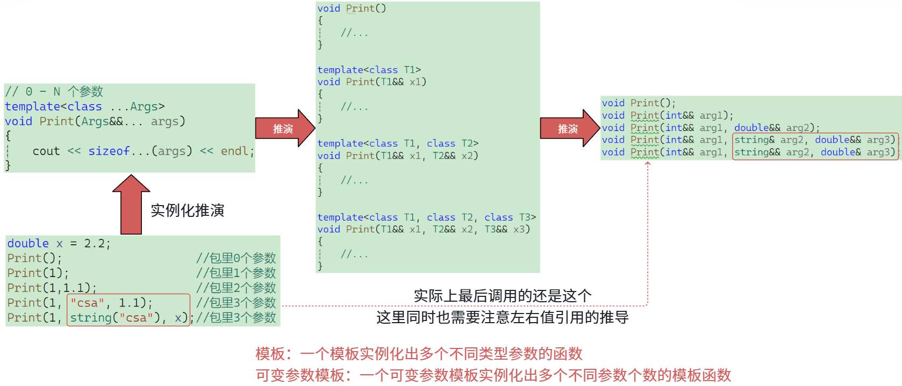
>
> 可以简单理解为一个可变参数模板就是模板函数的模板，每次调用可变参数模板时，编译器都会在编译时给你生成最符合你传参的那个普通函数去调用。

## 3.2  无处不在的 `...`

可变参数模板的标志性符号就是三个点 `...`，它被称为**参数包（Parameter Pack）**。根据位置不同，它分为两类：

```C++
// 1. 模板参数包 (Template Parameter Pack)
// 这里的 Args 是一个类型包，代表了 0 个或多个任意类型 （...在类型前面）
template <class... Args> 
// 2. 函数参数包 (Function Parameter Pack)
// 这里的 args 是一个值包，代表了 0 个或多个具体的参数变量 （...在对象前面）
void print(Args... args) 
{
    // 函数体
}
```

**最大的痛点**：你把参数打包传进去了，但在 C++ 中，**你不能直接用一个 `for` 循环或者数组下标去遍历这个 `args` 包**（因为包里的每一个参数类型可能都不一样，C++ 是强类型语言）。

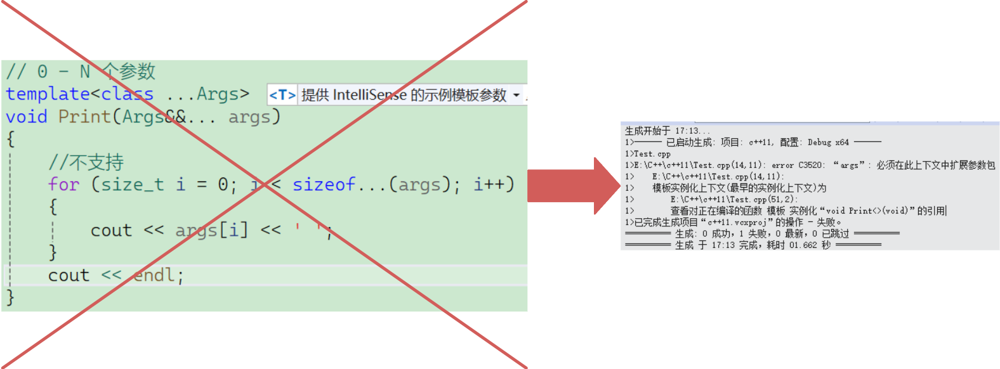

> [!CAUTION]
>
> 这个问题触及了 C++ 模板设计的核心哲学：**参数包（Parameter Packet）不是数组，也不是容器。**
>
> ## 1. 语法维度的缺失：包不是对象
>
> 在 C++ 中，`args` 被称为“参数包”。它仅仅是一个**语法层面的标记**，代表了一串用逗号分隔的序列。
>
> - **没有 `operator[]`：** 参数包本身并不是一个变量或对象，编译器没有为它定义下标运算符。
> - **无法随机访问：** 参数包里的元素在编译时是“捆绑”在一起的，你只能通过特定的语法（如 `...`）将整个包炸开进行一个一个访问，而不能像数组那样直接跳到第 N 个。
>
> ## 2. 类型维度的障碍：类型不统一
>
> 这是最根本的原因。`for` 循环通常要求循环体内的操作对每一次迭代都是通用的，但参数包里的每一项**类型可能完全不同**。
>
> 假设你的调用是 `ShowList(1, "hello", 3.14)`：
>
> - 第 1 次循环：`args[0]` 是 `int`。
> - 第 2 次循环：`args[1]` 是 `const char*`。
> - 第 3 次循环：`args[2]` 是 `double`。
>
> 在 C++ 的 `for` 循环里，`cout << args[i]` 这一行代码在编译时必须确定 `args[i]` 的类型。由于 `i` 是一个运行时的变量，编译器无法在编译阶段预知 `i` 是多少，也就无法确定应该调用哪种类型的 `cout` 重载函数。
>
> ## 3. 编译时 vs 运行时
>
> - **`for` 循环是运行时的控制流：** 循环多少次、当前是第几次，都是程序跑起来以后才知道的。
> - **模板实例化是编译时的行为：** 编译器在生成代码时，必须确切知道所有的类型和所有的函数调用。
>
> 如果你写 `args[i]`，编译器会抗议：“我怎么知道运行到这里时 `i` 是几？如果是 0，我要生成处理 `int` 的代码；如果是 1，我要生成处理 `string` 的代码。我没法在这一行代码里同时放进所有可能性的处理逻辑！”

## 3.3 `sizeof...()`

> [!NOTE]
>
> `sizeof...` 是 C++11 引入的一个非常实用且专门用于可变参数模板的运算符。它的作用很简单，但非常核心：**在编译期计算参数包中包含的元素个数。**
>
> ### 一、`sizeof...`
>
> `sizeof...` 的语法格式有两种，分别对应可变参数模板的两种参数包类型：
>
> 1. **类型参数包（Type Parameter Pack）**：
>
> ```c++
>template <typename... Args>
> void print_count() {
>    // 计算传入了多少个类型
> 	    constexpr std::size_t count = sizeof...(Args); 
>    std::cout << "传入了 " << count << " 个参数类型\n";
> }
> ```
> 
> 2. **函数参数包（Function Parameter Pack）**：
> 
> ```c++
> template <typename... Args>
> void process_args(Args... args) {
>    // 计算传入了多少个实际的参数值
>     constexpr std::size_t count = sizeof...(args);
>    std::cout << "接收到了 " << count << " 个实参\n";
> 	}
>```
> 
> **直观理解：**
> 
> 你可以把 `...` 想象成一个装满东西的袋子（参数包）。当你把 `sizeof` 后面跟上 `...` 和袋子的名字时，它并不是在称这个袋子有多重（不是计算字节大小），而是在**数袋子里装了多少件物品**，就是**展开**。
> 
> ### 二、 `sizeof...` 与普通 `sizeof` 的本质区别
> 
> 这是一个非常容易混淆的点：
>
> - **普通 `sizeof(T)`**：计算的是类型 `T` 或表达式结果在内存中占据的**字节数（Bytes）**。
>- **`sizeof...(Args)`**：计算的是参数包中元素的**个数（Count）**。它不关心这些参数是 `int`、`double` 还是一个几百兆的自定义结构体，它只返回数量。
> 
>```C++
> template<typename... Args>
>void demo(Args... args) {
>     // 假设调用: demo(1, 3.14, 'c');
>    // sizeof...(Args) 返回 3，因为有 3 个参数 (int, double, char)
>     // sizeof...(args) 也返回 3
>     // sizeof(args)... 是非法的语法，如果你想知道总字节数，需要用折叠表达式：
>    // (sizeof(Args) + ...) 返回 4 + 8 + 1 = 13 字节   所有类型的大小之和（13）
> }
>```
> 
> ### 三、 应用场景
> 
> `sizeof...` 在模板元编程和泛型编程中具有不可替代的作用，主要体现在以下几个方面：
>     
> #### 用于数组初始化
> 
>     在某些高级泛型编程技巧中，我们可以利用 `sizeof...` 来预先知道需要分配的数组大小。
> 
> ```C++
> template <typename... Args>
> void make_array(Args... args) {
>    // 根据参数包的大小在栈上分配一个固定大小的数组
>     int arr[sizeof...(args)] = { args... }; 
>    // 注意：这要求所有 args 都能隐式转换为 int
> }
>```
> 
>### 四、 进阶与细节注意点
> 
>1. **结果类型**：`sizeof...` 表达式的结果是一个 `std::size_t` 类型的**编译期常量**（prvalue）。因此它可以用于任何需要常量表达式的地方（如数组大小、模板非类型参数等）。
> 2. **空包处理**：如果传入的参数包为空（即零个参数），`sizeof...` 会正确返回 `0`。
>3. **不要漏掉点**：必须写成 `sizeof...(Args)` 或者 `sizeof...(args)`。省略 `...` 会导致编译错误，因为普通的 `sizeof` 无法处理参数包。
> 

## 3.4 解包

为了把包里的数据拿出来（术语叫**展开/解包 (Expansion)**），C++11 提供了几种非常独特的设计模式。

### 3.4.1 递归解包（最经典、最正统的方法）

这是 C++11 中最主流的解包方式。它的思想非常像“剥洋葱”：

每次只把参数包里的**第一个元素**剥离出来处理，然后把**剩下的参数包**递归传给下一个函数。当包被剥空时，调用一个没有参数的“终止函数”来结束递归。

我们要写一个类型安全的 `print` 函数，可以打印任意类型、任意数量的变量：

```C++
//包扩展
//参数包为0个时，匹配这个
void ShowList()
{
	cout << endl;
}
template<class T, class ...Args>
void ShowList(T x, Args&&... args)
{
	cout << x << ' ';
	//args是N个参数的参数包
	//调用ShowList，第一个参数传给x，剩下N-1个参数传给第二个参数包
	ShowList(args...);
}
// 0 - N 个参数
template<class ...Args>
void Print(Args&&... args)
{
	ShowList(args...);
}
```

> [!CAUTION]
>
> **编译器在底层的实例化过程（编译期生成的代码）：**
>
> 当你在代码中执行 `Print(1, 2.5, "Hello")` 时，编译器会像工厂流水线一样，依次生成并调用以下函数实例：
>
> ### 编译期生成的实例化函数链
>
> **第一步：入口函数实例化**
>
> 编译器首先根据 `Print` 模板生成一个处理三个参数的具体函数：
>
> ```C++
> // 1. 对应 Print(1, 2.5, "Hello")
> void Print(int&& arg1, double&& arg2, const char*&& arg3) {
>     ShowList(arg1, arg2, arg3); // 调用三个参数的 ShowList
> }
> ```
>
> **第二步：递归剥离第一个参数（剥洋葱开始）**
>
> 编译器发现 `ShowList(arg1, arg2, arg3)` 匹配 `template<class T, class... Args>`。
>
> 它将 `1` 赋给 `T x`，将剩下的 `2.5, "Hello"` 打包成 `Args... args`。
>
> ```C++
> // 2. 对应 ShowList(int, double, const char*)
> void ShowList(int x, double&& arg1, const char*&& arg2) {
>        cout << x << ' '; // 打印 1
>        ShowList(arg1, arg2); // 递归：剩下 2 个参数
> }
> ```
>
> **第三步：继续剥离**
>
> 此时 `T x` 变成了 `2.5`（double），剩下的包里只有 `"Hello"`。
>
> ```C++
> // 3. 对应 ShowList(double, const char*)
> void ShowList(double x, const char*&& arg1) {
>        cout << x << ' '; // 打印 2.5
>        ShowList(arg1); // 递归：剩下 1 个参数
> }
> ```
>
> **第四步：剥离最后一个业务参数**
>
> 此时 `T x` 是 `"Hello"`，剩下的 `Args... args` 是一个**空包**。
>
> ```C++
> // 4. 对应 ShowList(const char*)
> void ShowList(const char* x) {
>        cout << x << ' '; // 打印 Hello
>        ShowList(); // 递归：参数包长度为 0，尝试调用无参版本
> }
> ```
>
> **第五步：匹配终止函数（出口）**
>
> 编译器寻找不带参数的 `ShowList()`，正好匹配到你定义的那个非模板函数。
>
> ```C++
> // 5. 对应 ShowList()
> void ShowList() {
>        cout << endl; // 打印换行，递归彻底结束
> }
> ```
>
> ### 核心要点总结
>
> 1. **函数名的一致性**：在实例化过程中，编译器生成的函数签名必须与你代码中调用的名称完全匹配（例如代码里是 `ShowList` 而不是 `print`）。
> 2. **T 与 Args 的配合**：每一层递归，编译器都会精准地把**第一个**参数分配给 `T x`，把**剩下所有**参数塞进 `Args... args`。
> 3. **静态绑定**：这一切函数的生成和“谁调用谁”的对应关系，在程序运行之前就已经在 `.obj` 文件里写死了。

其中较为详细的流程如下所示：

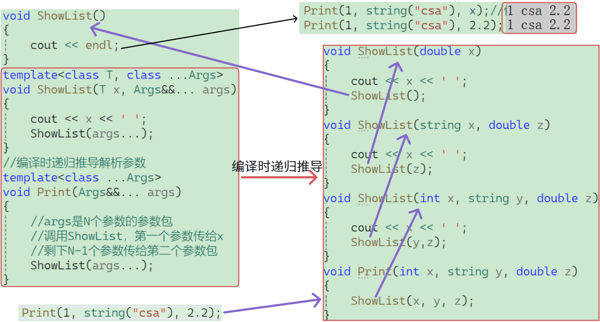

> [!CAUTION]
>
> 注意：这里写一个单独的终止函数有没有用？**答案是非常有用**，给个例子：
>
> 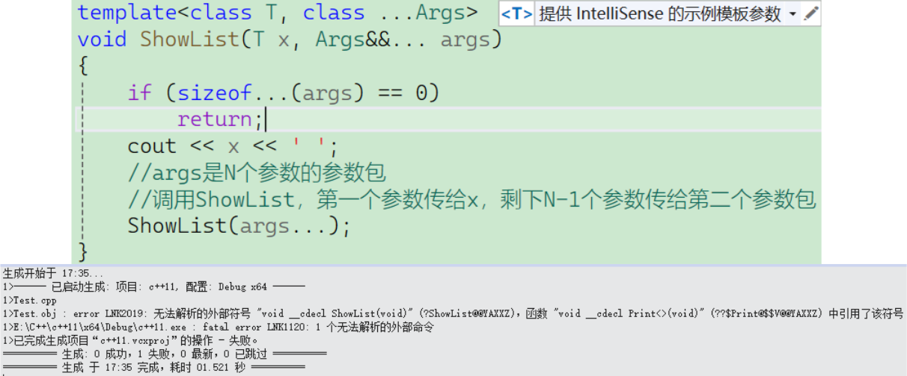
>
> 图中遇到的 `LNK2019` 错误，本质上是因为混淆了 **“运行时的条件判断”** 与 **“编译时的模板实例化”**。为什么 `if (sizeof...(args) == 0)` 挡不住编译错误。
>
> ## 1. 核心矛盾：运行时 vs 编译时
>
> ### 运行时的逻辑（代码想法）
>
> 在代码里，希望程序运行到最后，发现包空了，就通过 `if` 语句 `return` 掉。
>
> > **但是：** `if` 语句是在**程序运行**的时候才去判断的。
>
> ### 编译时的现实（编译器的逻辑）
>
> C++ 是强类型语言，模板在编译阶段必须能够完全“展开”。
>
> 当调用 `ShowList(1, 2)` 时，编译器会生成以下代码：
>
> 1. 实例化 `ShowList(int, int)`：打印 1，调用 `ShowList(2)`。
> 2. 实例化 `ShowList(int)`：打印 2，调用 `ShowList()`（空参数包）。
> 3. **关键点：** 编译器尝试寻找一个不带参数的 `ShowList()` 函数定义。
>
> 虽然你的 `if` 逻辑能保证运行到那里会返回，但编译器在**编译阶段**必须看到 `ShowList()` 的声明。由于没有提供无参的 `ShowList`，链接器就会报错：`无法解析的外部符号 ShowList(void)`。
>
> ## 2. 为什么不能像写普通递归那样写？
>
> 在普通递归（如阶乘）中，函数已经存在了，只是调用的问题。
>
> 但在模板递归中，**递归调用实际上是在产生新的函数实例**。
>
> 1. **无限实例化尝试：** 当编译器处理 `ShowList(args...)` 且包为空时，它必须生成一个对应的函数原型。
> 2. **死胡同：** 即使你在 `if` 里写了 `return`，编译器依然会去解析 `ShowList(args...)` 这一行。它发现这需要一个 `ShowList()` 版本，于是去代码里找，没找到，报错。
>
> ## 3. 正确的解决方案
>
> 你需要给编译器一个“出口”，让它在参数包变空（或剩最后一个）时，能找到对应的函数去调用。也就是提供一个同名的无参函数作为递归终止点：
>
> ```C++
> // 专门处理空包的情况（终止点）
> void ShowList() {
>     cout << endl;
> }
> 
> template<class T, class ...Args>
> void ShowList(T x, Args&&... args) {
>     cout << x << " ";
>     // 这里不再需要 sizeof... 的判断
>     ShowList(args...); 
> }
> ```

### 3.4.2 初始化列表解包

> [!IMPORTANT]
>
> **初始化列表解包法（Braced-init-list Expansion）** 是 C++11 中处理可变参数模板的一种高级技巧。它利用了 C++ 语言对于数组（或列表）初始化过程中的语法规则，巧妙地避开递归。
>
> 这种方法的本质是：**借用“初始化列表”这个合法的“外壳”，强迫编译器在编译期对参数包进行平铺式展开。**
>
> 要实现初始化列表解包，通常需要两个部分：一个处理单个元素的辅助函数，以及一个利用参数包展开的入口。
>
> ```C++
> template <class T>
> int GetArg(const T& x)
> {
> 	cout << x << " ";
> 	return 0;
> }
> 
> template <class ...Args>
> void Arguments(Args... args)
> { }
> 
> template <class ...Args>
> void Print(Args... args)
> {
> 	// 注意GetArg必须返回或者到的对象，这样才能组成参数包给Arguments
> 	Arguments(GetArg(args)...);
> }
> ```
>
> 这种解包方式在 C++ 社区有一个形象的称呼：**“借壳生蛋”**。利用了 **函数参数求值** 的过程来触发真正的逻辑。
>
> ## 1. 深度拆解：`Arguments(GetArg(args)...)` 发生了什么？
>
> 假设调用了 `Print(10, "Hello", 3.14);`。
>
> ### 第一阶段：模式展开（Pattern Expansion）
>
> 当编译器看到 `GetArg(args)...` 时，它识别出这是一个**参数包展开请求**。编译器会将 `GetArg` 这个“模式”应用到包里的每一个元素上。
>
> 编译器在底层生成的逻辑等价于：
>
> ```C++
> // 编译器展开后的伪代码
> Arguments(GetArg(10), GetArg("Hello"), GetArg(3.14));
> ```
>
> ### 第二阶段：函数求值与副作用
>
> 在调用 `Arguments` 之前，编译器必须先计算出它的每一个参数的值：
>
> 1. 计算第一个参数：调用 `GetArg(10)` $\rightarrow$ **屏幕打印 "10 "** $\rightarrow$ 返回 `0`。
> 2. 计算第二个参数：调用 `GetArg("Hello")` $\rightarrow$ **屏幕打印 "Hello "** $\rightarrow$ 返回 `0`。
> 3. 计算第三个参数：调用 `GetArg(3.14)` $\rightarrow$ **屏幕打印 "3.14 "** $\rightarrow$ 返回 `0`。
>
> ### 第三阶段：进入空壳函数
>
> 所有 `GetArg` 执行完毕后，最终执行的是：
>
> ```
> Arguments(0, 0, 0);
> ```
>
> 由于 `Arguments` 是个空函数，它接收了这三个 `0` 之后什么也不做，直接返回。
>
> ## 2. 核心问题：为什么不给一个接收函数就会报错？
>
> 如果你尝试直接写：
>
> ```C++
> template <class ...Args>
> void Print(Args... args) {
>     GetArg(args)...; // ❌ 报错：语法错误
> }
> ```
>
> 编译器会直接抛出错误（通常提示“此处不应出现省略号”）。原因如下：
>
> ### A. 语法语境限制
>
> 在 C++ 规定中，参数包的展开（即 `...` 的使用）**必须在特定的语法语境下**才能存在。合法的语境包括：
>
> - **函数调用**的参数列表：`func(args...)`
> - **初始化列表**：`int a[] = { args... }`
> - **模板参数列表**：`template <args...>`
> - **构造函数初始化列表**：`Class() : member(args...) {}`
>
> **参数包不是一个独立的变量**，它是一堆数据的集合。编译器不允许你在代码中让一堆数据“无家可归”地平铺在那。它必须被塞进某个能容纳多个元素的地方。
>
> ### B. 表达式的本质
>
> `GetArg(args)...` 展开后是一串由逗号分隔的表达式（如 `0, 0, 0`）。就比如你在 C++ 语句中，你不能直接写 `0, 0, 0;`。
>
> ## 3. 为什么 `Arguments` 函数必须能接收可变参数？
>
> `Arguments` 定义为：
>
> ```C++
> template <class ...Args> void Arguments(Args... args) { }
> ```
>
> - **匹配灵活性**：因为 `GetArg(args)...` 展开后的参数个数是不确定的（你传 2 个参数它就是 2 个，传 10 个它就是 10 个）。
> - **“黑洞”属性**：`Arguments` 作为一个可变参数模板函数，能够接收 **任意数量、任意类型** 的参数。它像一个黑洞，无论 `GetArg` 产生多少个返回值，它都能接住。
>
> ## 4. 这种思路的“神来之笔”
>
> 这种解包法的精髓在于：**我们并不真的想要调用 `Arguments`，我们只是在“利用”编译器为了调用 `Arguments` 而不得不去执行 `GetArg` 的那个过程。**
>
> | **组件**     | **角色** | **真实目的**                             |
> | ------------ | -------- | ---------------------------------------- |
> | `GetArg`     | 执行者   | 利用它的副作用（打印）处理数据。         |
> | `0` (返回值) | 门票     | 作为一个占位符，凑齐调用函数所需的参数。 |
> | `Arguments`  | 容器/壳  | 提供一个合法的语法环境，迫使包展开。     |

### 3.4.3 逗号表达式解包

> [!IMPORTANT]
>
> **逗号表达式解包**是 C++11 中最硬核、也最能体现模板黑客精神的技巧之一。它通常与**初始化列表**配合使用。
>
> 如果说“函数接收解包”是借个壳子，那么“逗号表达式解包”就是在这个壳子内部进行了一次**精准的手术**，让代码更健壮且不再依赖辅助函数的返回值。
>
> ## 1. 什么是逗号表达式？
>
> 在 C++ 中，逗号表达式的形式为 `(expression1, expression2)`。
>
> - **执行顺序**：先计算 `exp1`，再计算 `exp2`。
> - **返回值**：整个表达式的结果是 **最后一个表达式 (`exp2`) 的值**。
>
> **关键点**：无论 `exp1` 做了什么（打印、修改变量、甚至返回 `void`），只要 `exp2` 是个整数，整个括号里的结果就是一个整数。
>
> ## 2. 核心语法模型
>
> 在可变参数模板中，我们通常这样写：
>
> ```C++
> template <class T>
> void GetArg(const T& x) { cout << x << " "; }
> template <class ...Args>
> void Print(Args... args)
> {
> 	int a[sizeof...(args)] = { (GetArg(args),0)... };
> }
> ```
>
> ## `(GetArg(args), 0)...`
>
> 这段代码的核心发动机就是数组初始化行。我们将它拆解为四个关键组件：
>
> ```C++
> int a[sizeof...(args)] = { (GetArg(args), 0)... };
> ```
>
> - **`GetArg(args)`（左表达式）**：这是**真正的任务**。编译器会对包里的每个参数调用一次这个函数。
> - **`,`（逗号运算符）**：它的作用是“执行左边，丢弃结果，返回右边”。
> - **`0`（右表达式）**：这是**占位符**。因为 `GetArg` 返回 `void`，无法直接存入 `int` 数组，所以用 `0` 来充当数组的元素值。
> - **`...`（模式展开）**：它告诉编译器：“请把括号里的整套动作，对参数包里的每一个参数都重复一遍。”
>
> ## 3. 编译期的“平铺”逻辑
>
> 假设调用了 `Print(1, "A", 3.14)`，编译器在编译阶段并不会生成循环，而是直接将代码“平铺”展开。
>
> **编译器实际生成的机器码逻辑等价于：**
>
> ```C++
> // 编译器生成的具体实例
> void Print(int arg1, const char* arg2, double arg3) {
>     int a[3] = { 
>         (GetArg(arg1), 0),  // 第一步：打印 1，返回 0
>         (GetArg(arg2), 0),  // 第二步：打印 A，返回 0
>         (GetArg(arg3), 0)   // 第三步：打印 3.14，返回 0
>     };
> }
> ```
>
> 这种解包思路可以总结为：**借鸡生蛋**。
>
> - **“鸡”**：是数组初始化语境 `{...}`。
> - **“蛋”**：是逗号表达式返回的 `0`。
> - **真实的意图**：是在“生蛋”的过程中，利用逗号表达式左侧的 `GetArg` 调用，顺便把活儿（打印）给干了。
>
> ## 4. 为什么这种写法是“黑科技”？
>
> 这种写法巧妙地利用了 C++ 的三条硬性规定来达成目的：
>
> ### A. 解决“无处安放”的问题
>
> 在 C++ 中，你不能直接写 `GetArg(args)...;`。参数包展开必须出现在特定的“接收环境”里。**数组初始化列表 `{}`** 就是一个完美的合法接收环境。
>
> ### B. 解决“类型不匹配”的问题
>
> 你的 `GetArg` 返回的是 `void`，而 `int a[]` 需要的是 `int`。
>
> - 如果直接写 `{ GetArg(args)... }` $\rightarrow$ 编译报错（不能用 void 初始化 int）。
> - 使用了逗号表达式 `(void, 0)` $\rightarrow$ 成功将“动作”转化为了“数据（0）”。
>
> ### C. 解决“执行顺序”的问题
>
> 这是最关键的一点。C++ 标准规定：**初始化列表 `{}` 里的表达式必须严格按照从左往右的顺序求值。**
>
> 这保证了无论编译器如何优化，你的参数永远是按顺序打印的，不会出现先打印最后一个参数的情况。
>
> ## 5. 运行时的最终状态
>
> 当这一行 `int a[sizeof...(args)] = { ... };` 执行完毕后：
>
> 1. **副作用已完成**：屏幕上已经依次显示了 `1 A 3.14 `。
> 2. **数据已生成**：此时内存中存在一个名为 `a` 的数组，内容是 `{0, 0, 0}`。
> 3. **后续流程**：接下来的 `for` 循环遍历这个全是 `0` 的数组，打印出 `0 0 0 `，最后换行。
>
> ## 6. 终极进化：无需辅助函数的写法
>
> 利用逗号表达式，你可以把所有逻辑写在一行里，甚至不需要额外的 `GetArg` 函数：
>
> ```C++
> template <class... Args>
> void PerfectPrint(Args... args) {
>     // 这里利用 lambda 表达式 + 逗号表达式
>     // 甚至可以在解包过程中做更复杂的操作
>     int dummy[] = { ( [&](){ cout << "Value: " << args << endl; }(), 0)... };
> }
> ```
>
> **Lambda 表达式层 `[&](){ ... }()`**：
>
> - `[&]`：以引用的方式捕获外部变量（捕获参数包中的当前元素）。
> - `()`：靠前的`()`Lambda表达式的参数列表（空参数）。
> - `()`：靠后的`()`定义一个匿名函数并立即执行它。
> - **目的**：提供一个可以编写任意复杂逻辑（如多行打印、类型判断等）的局部环境。
>
> **逗号表达式层 `( Lambda, 0 )`**：
>
> - **左侧**：执行 Lambda 函数（执行你的 `cout` 逻辑）。
> - **右侧**：返回 `0`。
> - **目的**：由于 Lambda 返回 `void`，无法直接放入数组，逗号表达式强制将其结果转化为 `int`。
>
> **模式展开层 `...`**：
>
> - 作用于整个括号：`(Lambda, 0)`。
> - **目的**：对参数包里的每一个 `args` 复制并展开这一套“执行+返回0”的动作。

### 3.4.5 总结：解包进化的三个阶段

 | **阶段**     | **技术手段**       | **特点**                                                     |
 | ------------ | ------------------ | ------------------------------------------------------------ |
 | **第一阶段** | 递归展开           | 逻辑像剥洋葱，最正统但需要写终止函数，编译开销大。           |
 | **第二阶段** | 数组/函数解包      | 借壳生蛋，平铺展开。但受限于辅助函数的返回值类型。           |
 | **第三阶段** | **逗号表达式解包** | **万能解包**。不挑类型、保证顺序、代码极致精简，是 C++11/14 的最优解。 |

可变参数模板的核心就是**打包 (`Args... args`)** 和 **解包 (`args...`)**。它突破了函数参数数量的限制，并在编译期通过递归或展开完成类型推导。当它与**右值引用**和**完美转发**结合在一起时，就构成了现代 C++ (C++11及以后) 追求极致性能和泛型设计的究极利器。

## 3.5 `emplace`系列接口

简单来说，`push/insert`系列 是“搬运工”**，而 `emplace`系列 是**“建筑师”。

### 3.5.1 构造位置的不同

> [!IMPORTANT]
>
> ### `push_back` / `insert`（拷贝或移动）
>
> 这两个接口要求你先提供一个**完整的对象**。
>
> 1. 你需要在外部创建一个临时对象。
> 2. 容器内部会调用**拷贝构造**（如果是左值）或**移动构造**（如果是右值），将这个对象“复制”或“搬运”到容器管理的内存中。
> 3. 临时对象销毁。
>
> ### `emplace_back` / `emplace`（原位构造）
>
> 借助**可变参数模板**和**完美转发**，`emplace` 接收的是**构造对象所需的参数**，而不是对象本身。
>
> 1. 容器直接在它预留的内存地址上，调用该类型的构造函数。
> 2. **没有临时对象生成**，没有拷贝，也没有移动。

### 3.5.2 语法层面的实现对比

用代码和示例来看看可变参数模板在这里起到的关键作用：

> [!IMPORTANT]
>
> ### 单参数
>
> 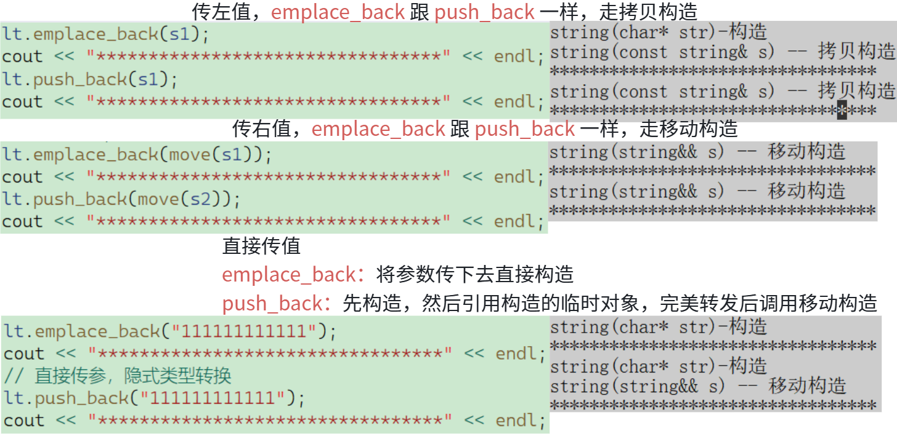
>
> ### 多参数
>
> 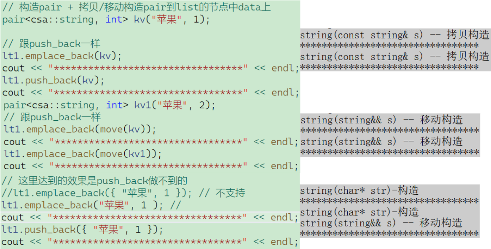
>
> > [!NOTE]
> >
> > ## 1. 传对象：`lt1.emplace_back(kv)`
> >
> > 当你把一个已经构造好的 `kv` 传给 `emplace_back` 时：
> >
> > - **传递逻辑**：`emplace_back` 接收到一个 `pair<string, int>&`（左值引用）。
> > - **向下转发**：可变参数包 `Args...` 被推导为 `pair<string, int>&`。通过 `std::forward` 传给底层时，底层发现这已经是一个完整的对象了。
> > - **结果**：它只能调用 `pair` 的**拷贝构造函数**。而 `pair` 的拷贝构造会触发其成员 `string` 的**拷贝构造**。
> > - **结论**：此时 `emplace` 和 `push` 没有任何区别，都是“搬运”。
> >
> > ## 2. 传移动对象：`lt1.emplace_back(move(kv))`
> >
> > - **传递逻辑**：`move` 将 `kv` 强转为右值。`emplace_back` 的万能引用接住它，`Args...` 被推导为 `pair<string, int>&&`。
> > - **向下转发**：完美转发保留了右值属性。底层调用 `pair` 的**移动构造函数**。
> > - **结果**：触发 `string` 的**移动构造**（资源窃取）。
> > - **结论**：这比拷贝快，但依然发生了“一次移动构造”的开销。
> >
> > ## 3. 传构造参数（核心亮点）：`lt1.emplace_back("苹果", 1)`
> >
> > 这是 `emplace` 真正发挥威力的地方，也是 `push_back` 做不到的。
> >
> > ### 详细的“向下传”逻辑：
> >
> > 1. **参数解耦**：你传进去的不是 `pair`，而是两个独立的参数：`const char*` 和 `int`。
> > 2. **包的捕获**：`emplace_back` 的可变参数模板 `Args&&... args` 将这两个原始素材捕获到包里。
> > 3. **深度转发**：这两个原始参数被一路向下转发，最终直接喂给了 `pair` 的构造函数：`pair(const K&, const V&)`。
> > 4. **结果**：
> > 	- `string` 成员直接根据 `"苹果"` 这个 `const char*` 进行初始化（调用 `string(char*)` 构造）。
> > 	- **全程没有产生 `pair` 临时对象，也没有移动构造 `pair` 的开销。**
> >
> > ## 4. 为什么 `push_back({ "苹果", 1 })` 会多一次移动？
> >
> > 你会发现 `push_back` 多了一行 `string(string&& s)`。
> >
> > - **原因**：`push_back` 的参数不是可变参数模板，它必须接收一个具体的 `T`（即 `pair`）。
> > - **逻辑链**：
> > 	1. 为了匹配 `push_back` 的参数，编译器必须先用 `{"苹果", 1}` 构造一个**隐式的临时 `pair` 对象**。
> > 	2. 在这个临时对象构造时，`string` 调用了**它的右值引用**（因为**临时对象具有常属性**）。
> > 	3. `push_back` 拿到这个临时 `pair`（右值），再通过**移动构造**将其搬运到容器节点内。
> > 	4. **多出的那一步**：就是将临时对象“移动”进容器的那一下。
> >
> > ## 总结：多参数向下传的本质
> >
> > | **接口**         | **传递的内容**                             | **底层动作**                                                 | **性能表现**                     |
> > | ---------------- | ------------------------------------------ | ------------------------------------------------------------ | -------------------------------- |
> > | **push_back**    | **对象**（无论是自建还是大括号隐式生成的） | 接收对象 $\rightarrow$ 拷贝/移动到目的地                     | 至少一次拷贝或移动               |
> > | **emplace_back** | **构造所需的原材料**（利用可变参数模板）   | 接收原材料 $\rightarrow$ **完美转发**原材料 $\rightarrow$ 在目的地直接开工构造 | **零拷贝、零移动**，直接原位生产 |

`emplace` 的强大依赖于你刚刚学到的 C++11 特性：

1. **可变参数模板 (`Args&&... args`)**：允许 `emplace` 接收任意数量、任意类型的参数，从而匹配目标类的任何构造函数。
2. **万能引用与完美转发 (`std::forward`)**：确保传入的参数（如字符串常量或临时变量）能以最原始的属性传给构造函数，保持性能。

虽然 `emplace` 理论上更快，但它并不总是能完全取代 `push`。

例如，如果容器内部空间不足触发了**扩容（Reallocation）**，`emplace` 依然会触发整个容器原有元素的搬运（移动或拷贝）。

此外，对于简单的**浅拷贝类型**（如 `int`），`push_back` 和 `emplace_back` 在生成的汇编指令上几乎没有区别，因为浅拷贝和移动对于这类类型是一样的。

**对比一下：**

- **传统 `push_back`**：你在外面构造一个临时对象（比如 `string("abc")`），把它传进去，内部触发一次移动构造或拷贝构造。
- **现代 `emplace_back`**：你把构造这个对象所需要的**原材料（参数）**直接传进去：`vec.emplace_back("abc")`。`emplace_back` 利用**可变参数模板**把这些原材料打包，再通过 **`std::forward`** 原封不动地转发给内部的构造函数**进行直接构造**。
- **结果**：少了一次临时对象的创建和销毁，极致榨干性能！

# 四、lambda 表达式

C++11 引入的 **Lambda 表达式** 是现代 C++ 的标志性特性之一。它本质上是一个**匿名函数对象（仿函数）**，允许你在需要函数的地方（如算法参数中）原地定义逻辑。

## 4.1 Lambda 的基本语法模型

一个完整的 Lambda 表达式包含以下五个部分：

$$[capture] (params) mutable exception -> return_type { body }$$

- **`[capture]`（捕获列表）**：定义 Lambda 可以访问外部作用域中的哪些变量，以及是以值还是引用方式访问。
- **`(params)`（参数列表）**：与普通函数参数一致。如果不需要参数，可以省略 `()`（但在某些标准下建议保留）。
- **`mutable`（可选）**：默认情况下，以值捕获的变量在 Lambda 内部是 `const` 的，加上 `mutable` 可以修改这些副本，相当于取消了`const`属性。
- **`-> return_type`（返回类型）**：通常可以省略，编译器会根据 `return` 语句自动推导。
- **`{ body }`（函数体）**：具体的逻辑实现。

## 4.2 捕获列表 `[]`

这是 Lambda 的灵魂，决定了它如何与周围环境交互。

| **捕获方式**  | **说明**                                           |
| ------------- | -------------------------------------------------- |
| **`[]`**      | 不捕获任何外部变量。                               |
| **`[x]`**     | 以**值传递**方式捕获变量 `x`（内部通过拷贝实现）。 |
| **`[&x]`**    | 以**引用传递**方式捕获变量 `x`。                   |
| **`[=]`**     | **隐式值捕获**：捕获所有外部变量的副本。           |
| **`[&]`**     | **隐式引用捕获**：捕获所有外部变量的引用。         |
| **`[=, &x]`** | 默认值捕获所有变量，但 `x` 以引用方式捕获。        |
| **`[&, x]`**  | 默认引用捕获所有变量，但 `x` 以值方式捕获。        |

> [!IMPORTANT]
>
> ### 隐式值捕获
>
> 这里的所有变量值实际上指的是在你的 lambda 内使用的变量，这里进行汇编层验证：
>
> ```c++
> auto functest = [=]()
>     {
>         int tmp1 = a;
>         int tmp2 = b;
>         int ret = tmp1 + tmp2;
>         return ret;
>     };
> ```
>
> 这里打开反汇编进行查看：
>
> ```asm
> 	auto functest = [=]()
> 00007FF690F51DA0  mov         qword ptr [rsp+18h],r8  
> 00007FF690F51DA5  mov         qword ptr [rsp+10h],rdx  
> 00007FF690F51DAA  mov         qword ptr [rsp+8],rcx  
> 00007FF690F51DAF  push        rbp  
> 00007FF690F51DB0  push        rdi  
> 00007FF690F51DB1  sub         rsp,0E8h  
> 00007FF690F51DB8  lea         rbp,[rsp+20h]  
> 00007FF690F51DBD  lea         rcx,[__EC9F2C3F_Test@cpp (07FF690F6307Fh)]  
> 00007FF690F51DC4  call        __CheckForDebuggerJustMyCode (07FF690F513F7h)  
> 00007FF690F51DC9  nop  
> 		{
> 			int tmp1 = a;
> 			int tmp2 = b;
> 			int ret = tmp1 + tmp2;
> 			return ret;
> 		};
> 00007FF690F51DCA  mov         rax,qword ptr [this]  
> 00007FF690F51DD1  mov         rcx,qword ptr [__a]  
> 00007FF690F51DD8  mov         ecx,dword ptr [rcx]  
> 00007FF690F51DDA  mov         dword ptr [rax],ecx  
> 00007FF690F51DDC  mov         rax,qword ptr [this]  
> 00007FF690F51DE3  mov         rcx,qword ptr [__b]  
> 00007FF690F51DEA  mov         ecx,dword ptr [rcx]  
> 00007FF690F51DEC  mov         dword ptr [rax+4],ecx  
> 00007FF690F51DEF  mov         rax,qword ptr [this]  
> 00007FF690F51DF6  lea         rsp,[rbp+0C8h]  
> 00007FF690F51DFD  pop         rdi  
> 00007FF690F51DFE  pop         rbp  
> 00007FF690F51DFF  ret 
> ```
>
> 从上面的汇编代码可以清楚看见lambda只捕获了`a`和`b`变量。
>
> ### 隐式引用捕获
>
> ```c++
> auto functest = [&]()
>     {
>         int ret = a + b;
>         return ret;
>     };
> ```
>
> 打开反汇编继续看：
>
> ```asm
> 	auto functest = [&]()
> 00007FF715331DA0  mov         qword ptr [rsp+18h],r8  
> 00007FF715331DA5  mov         qword ptr [rsp+10h],rdx  
> 00007FF715331DAA  mov         qword ptr [rsp+8],rcx  
> 00007FF715331DAF  push        rbp  
> 00007FF715331DB0  push        rdi  
> 00007FF715331DB1  sub         rsp,0E8h  
> 00007FF715331DB8  lea         rbp,[rsp+20h]  
> 00007FF715331DBD  lea         rcx,[__EC9F2C3F_Test@cpp (07FF71534307Fh)]  
> 00007FF715331DC4  call        __CheckForDebuggerJustMyCode (07FF7153313F7h)  
> 00007FF715331DC9  nop  
> 		{
> 			int ret = a + b;
> 			return ret;
> 		};
> 00007FF715331DCA  mov         rax,qword ptr [this]  
> 00007FF715331DD1  mov         rcx,qword ptr [__a]  
> 00007FF715331DD8  mov         qword ptr [rax],rcx  
> 00007FF715331DDB  mov         rax,qword ptr [this]  
> 00007FF715331DE2  mov         rcx,qword ptr [__b]  
> 00007FF715331DE9  mov         qword ptr [rax+8],rcx  
> 00007FF715331DED  mov         rax,qword ptr [this]  
> 00007FF715331DF4  lea         rsp,[rbp+0C8h]  
> 00007FF715331DFB  pop         rdi  
> 00007FF715331DFC  pop         rbp  
> 00007FF715331DFD  ret  
> ```
>
> 这里其实也能看见只捕获了`a`和`b`，另外一种验证，看结果变没变：
>
> 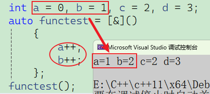
>
> 这里也能证明，就只捕获使用的变量。

## 4.3 底层原理——匿名仿函数

**lambda 不能递归**，**因为lambda生成仿函数的时候是在编译时**，如果在lambda内部调用自己，那个时候还没有编译好呢。

当你写下一个 Lambda 时，编译器实际上为你生成了一个**未命名的类**。

> [!IMPORTANT]
>
> ### 示例代码
>
> ```c++
> class Rate
> {
> public:
> 	Rate(double rate)
> 		: _rate(rate)
> 	{ }
> 	double operator()(double money, int year) { return money * _rate * year; }
> private:
> 	double _rate;
> };
> 
> int main()
> {
> 	double rate = 0.49;
> 	// lambda
> 	auto r2 = [rate](double money, int year) { return money * rate * year; };
> 	// 函数对象
> 	Rate r1(rate);
> 	r1(10000, 2);
> 	r2(10000, 2);
> 	return 0;
> }
> ```
>
> 然后通过汇编层来了解这个 `"类"` 是怎么一个规则
>
> ```asm
> 	// lambda
> 	auto r2 = [rate](double money, int year) {
> 		return money * rate * year;
> 	};
> // 捕捉列表的rate，可以看到作为lambda_1类构造函数的参数传递了，这样要拿去初始化成员变量 然后下⾯operator()中才能使⽤
> 00007FF66C325FAB  lea         rdx,[rate]  
> 00007FF66C325FAF  lea         rcx,[r2]  
> 00007FF66C325FB3  call        `main'::`2'::<lambda_1>::<lambda_1> (07FF66C321DE0h)  
> 00007FF66C325FB8  nop  
> 
> 	// 函数对象
> 	Rate r1(rate);
> 00007FF66C325FB9  movsd       xmm1,mmword ptr [rate]  
> 00007FF66C325FBE  lea         rcx,[r1]  
> 00007FF66C325FC2  call        Rate::Rate (07FF66C32149Ch)  
> 00007FF66C325FC7  nop  
> 	r1(10000, 2);
> 00007FF66C325FC8  mov         r8d,2  
> 00007FF66C325FCE  movsd       xmm1,mmword ptr [__real@40c3880000000000 (07FF66C32ABC8h)]  
> 00007FF66C325FD6  lea         rcx,[r1]  
> 00007FF66C325FDA  call        Rate::operator() (07FF66C3214A1h)  
> 00007FF66C325FDF  nop  
> // 汇编层可以看到r2 lambda对象调⽤本质还是调⽤operator()，类型是lambda_1,这个类型名的规则是编译器⾃⼰定制的，保证不同的lambda不冲突
> 	r2(10000, 2);
> 00007FF66C325FE0  mov         r8d,2  
> 00007FF66C325FE6  movsd       xmm1,mmword ptr [__real@40c3880000000000 (07FF66C32ABC8h)]  
> 00007FF66C325FEE  lea         rcx,[r2]  
> 00007FF66C325FF2  call        `main'::`2'::<lambda_1>::operator() (07FF66C321EA0h)  
> 00007FF66C325FF7  nop  
> ```

Lambda 的原理就是：**语法糖**。 它将“定义类”、“成员变量捕获”、“构造函数初始化”和“函数调用重载”这四个繁琐的步骤，压缩成了一个简洁的 `[](){}` 语法。

可以把 Lambda 看作是一个**捕获变量的仿函数**。

> [!WARNING]
>
> ## 示例：Lambda 的底层架构——匿名仿函数类
>
> 当我们定义一个 Lambda 时，编译器会自动生成一个唯一的、不重复的类名。
>
> ### 示例代码：
>
> ```C++
> int a = 10, b = 20;
> auto func = [a, &b](int x) { return a + b + x; };
> ```
>
> ### 编译器的后台操作：
>
> 编译器会将上面的代码转化为类似下面的结构：
>
> ```c++
> // 编译器生成的匿名类（闭包类）
> class __Lambda_unique_id {
> private:
>     int _a;      // 值捕获：作为成员变量拷贝一份
>     int& _b;     // 引用捕获：作为成员变量存储引用
> public:
>     // 构造函数：负责初始化捕获的变量
>     __Lambda_unique_id(int a, int& b) : _a(a), _b(b) {}
>     // 重载 operator()：Lambda 的主体逻辑
>     // 注意：默认是 const，除非加了 mutable
>     int operator()(int x) const {
>         return _a + _b + x;
>     }
> 
>     // C++11 禁止 Lambda 拷贝赋值（视具体编译器而定）
>     __Lambda_unique_id& operator=(const __Lambda_unique_id&) = delete;
> };
> // 实际调用处：
> __Lambda_unique_id func(a, b); // 实例化对象（闭包）
> func(5); // 调用 operator()(5)
> ```

## 4.4 为什么要用 Lambda？

在某些场景下，你只需要一个简单的函数用于 `std::sort` 或 `std::find_if`。如果使用普通函数，你需要去全局作用域定义它；如果使用 Lambda，逻辑可以紧贴调用处，代码更易读。

## 4.5 总结

- **性能**：Lambda 与函数对象性能一致，编译器可以进行内联优化，通常比函数指针更快。
- **生存期陷阱**：使用**引用捕获 `[&]`** 时，必须确保外部变量的生命周期比 Lambda 长，否则在执行 Lambda 时会发生非法内存访问（类似于野指针）。
- **值捕获的只读性**：除非标记 `mutable`，否则值捕获的变量在内部不可修改。

Lambda 表达式是 C++ 语法糖，它通过编译器自动生成的仿函数类，实现了既简洁又功能强大的匿名函数功能。

# 五、类的新功能

## 5.1 移动赋值/移动构造

C++11 之后，类的默认成员函数从 **4个** 变成了 **6个**。

- **新增：** 移动构造函数、移动赋值运算符。
- **规则变动：** 如果你手动实现了析构函数、拷贝构造或拷贝赋值中的任意一个，编译器通常**不会**再自动生成移动相关的函数。
- **影响：** 这一改动是为了配合移动语义，让类对象在作为右值传递（如 `return` 语句或 `std::move`）时，能够实现资源的高效“掠夺”而非沉重的深拷贝。

## 5.2 成员变量声明时给缺省值

这是 C++11 最实用的功能之一。可以在定义类成员变量时直接赋予初始值。

**逻辑解析：**

- **优先级：** 如果构造函数的初始化列表也给了值，**初始化列表的优先级更高**。
- **原理：** 编译器本质上是将这些缺省值“拷贝”到了每一个没有显示初始化该成员的构造函数中。

```C++
class Hero 
{
    int hp = 100; // 声明时给缺省值
    int mp = 50;
public:
    Hero() {} // hp=100, mp=50
    Hero(int m) : mp(m) {} // hp=100, mp使用参数m
};
```

## 5.3 `default` 和 `delete` 关键字

这两个关键字让你能够显式地告诉编译器：“我要这个函数”或“我不要这个函数”。

> [!IMPORTANT]
>
> ### `default`（显式默认）
>
> 如果你手动实现了析构函数、拷贝构造或拷贝赋值中的任意一个，编译器通常**不会**再自动生成移动相关的函数。这时候如果还要编译器进行默认生成就需要`dedault`关键字：
>
> ```c++
> class Person
> {
> public:
> 	Person(const char* name = "张三", int age = 1)
> 		:_name(name)
> 		, _age(age)
> 	{ }
> private:
> 	csa::string _name;
> 	int _age;
> };
> ```
>
> 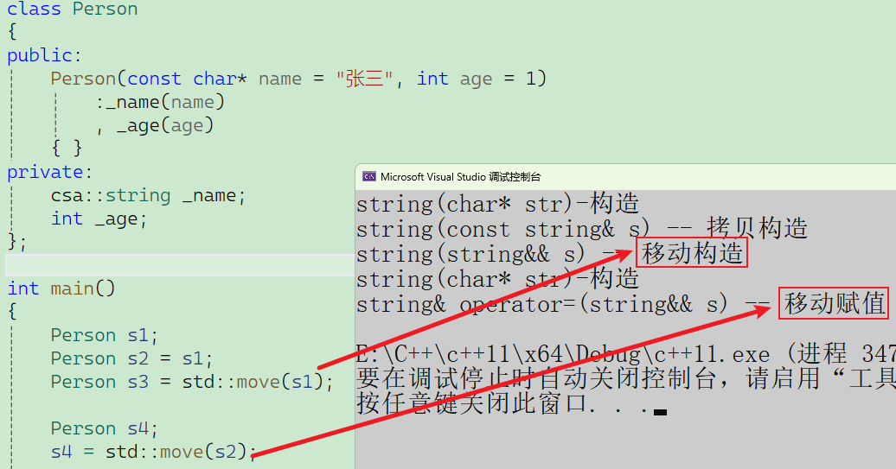
>
> 这时候你显式写出来析构函数，如果此时还需要移动系列的函数，还必须生成拷贝系列的函数：
>
> ```c++
> class Person
> {
> public:
> 	Person(const char* name = "张三", int age = 1)
> 		:_name(name)
> 		, _age(age)
> 	{ }
> 	Person(const Person& p) = default;
> 	Person(Person&& p) = default;
> 	Person& operator=(Person&& p) = default;
> 	Person& operator=(const Person& p) = default;
> 	~Person() {}
> private:
> 	csa::string _name;
> 	int _age;
> };
> ```
>
> 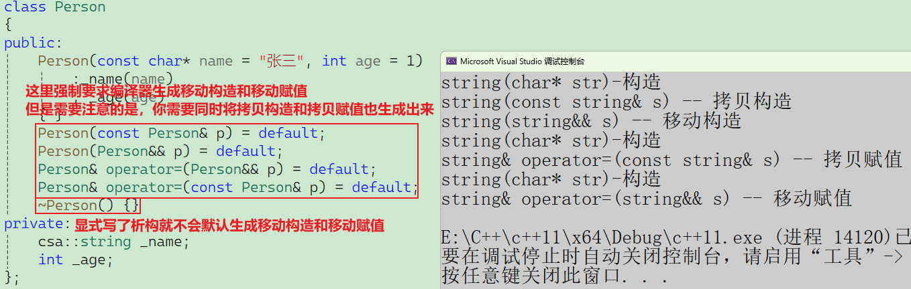
>
> > [!NOTE]
> >
> > **“如果你强制生成移动构造（或移动赋值），那么也必须手动实现（或用 `= default`）拷贝构造和拷贝赋值。”** 
> >
> > ### 1. 编译器的“避嫌”逻辑：Rule of Five (五则运算)
> >
> > C++ 编译器有一套非常复杂的自动生成规则。对于移动构造函数，编译器的态度是**极度谨慎**的：
> >
> > - **默认行为：** 如果你**什么都不写**，编译器会默认生成拷贝构造和拷贝赋值。
> > - **触发禁令：** 一旦你显式地写了（或用 `= default` 强制要求生成）**移动构造**或**移动赋值**，编译器就会认为：“这个类可能有非常特殊的资源管理逻辑（比如管理堆内存、文件句柄等）”。
> > - **结果：** 此时，编译器会自动禁用（delete）默认的拷贝构造和拷贝赋值。
> >
> > **原因：** 如果一个类需要特殊的“移动”逻辑，那么“拷贝”逻辑通常也需要特殊处理（比如深拷贝）。编译器担心默认的浅拷贝会导致内存多次释放等安全问题，所以干脆不帮你生成了。
> >
> > ### 2. 维持类的“完整功能性”
> >
> > 如果按照截图中的操作，你只写了移动构造而不写拷贝构造：
> >
> > - 你的类将变成一个“只能移动，不能拷贝”的类（类似于 `std::unique_ptr`）。
> > - 当你尝试执行 `T obj2 = obj1;`（拷贝左值）时，代码会直接**编译报错**。
> >
> > > 因为编译器为了防止发生“浅拷贝内存崩溃”，在写了移动构造后，自动把拷贝构造函数给delete了，导致 `obj1` 这个左值找不到合法的接收者。
> >
> > - **为什么要一起实现：** 大多数业务类（如你图中的 `string` 模拟实现）既需要支持高效的移动，也需要支持正常的拷贝。为了不让这个类在功能上“残疾”，必须手动把被编译器禁用的拷贝函数重新补回来。
> >
> > ### 3. 代码演变的视角
> >
> > 在 C++98 时代，只有 4 个默认函数。到了 C++11，为了兼容性和安全性，规则变成了这样：
> >
> > | **你的行为**         | **拷贝构造/赋值**     | **移动构造/赋值** |
> > | -------------------- | --------------------- | ----------------- |
> > | **什么都不写**       | 自动生成              | 自动生成          |
> > | **写了析构函数**     | 自动生成              | **不生成**        |
> > | **显式写了移动构造** | **自动禁用 (Delete)** | 按照你的要求生成  |
> > | **显式写了拷贝构造** | 按照你的要求生成      | **不生成**        |
> >
> > **所以，当你强制要求移动系列时，拷贝系列会被编译器自动收回。** 为了让你的 `list` 或 `string` 既能 `push_back` 临时变量（移动），又能 `push_back` 普通变量（拷贝），你必须把它们全都显式写出来。
> >
> > ### 4. 建议
> >
> > 当你发现自己需要手动实现其中任何一个（特别是涉及深拷贝的类）时，请遵循 **“Rule of Five”**：
> >
> > 1. 析构函数
> > 2. 拷贝构造
> > 3. 拷贝赋值
> > 4. 移动构造
> > 5. 移动赋值
> >
> > **要么全不写（依赖编译器），要么全写（或全用 `= default`），这样才能保证类行为的一致性和预期的性能。**

> [!IMPORTANT]
>
> ### `delete`（显式删除）
>
> 这是 C++11 之前通过 `private` 声明实现的“禁止拷贝”逻辑的正统替代方案。它可以用于**任何函数**。
>
> - **典型应用：** 禁止拷贝构造、禁止某些特定类型的隐式转换。
>
> ```c++
> class Singleton {
>     Singleton(const Singleton&) = delete; // 禁止拷贝
>     void func(double d);
>     void func(int i) = delete; // 禁止传入 int 类型调用该函数
> };
> ```
>
> 目前接触到的就是IO对象不可以被拷贝，只能传引用
>
> ```c++
> void func(ostream out)
> { }
> 
> func(cout);
> ```
>
> 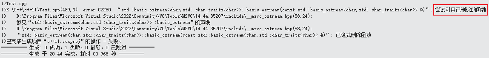
>
> 在c++11之后，IO流的构造函数就已经将拷贝构造给禁用了，只能通过引用进行使用：
>
> 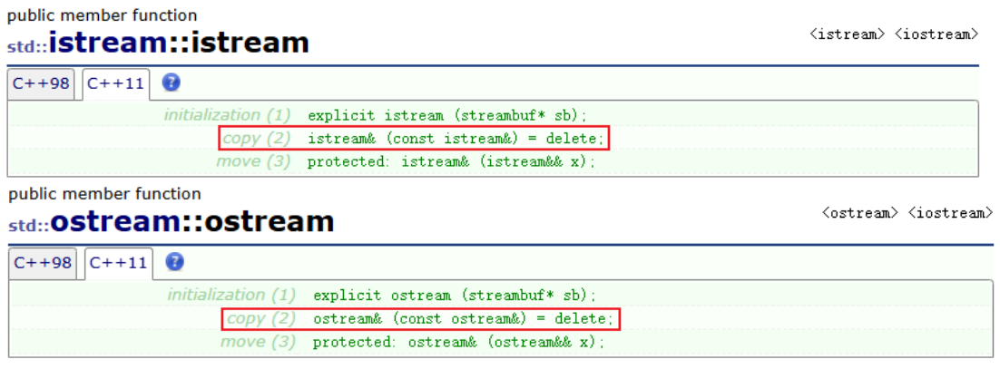

## 5.4 `final` 与 `override`

这两个关键字放在类或成员函数的末尾，专门用于管理**继承链**和**多态**，极大降低了逻辑错误。

**`final`**

- **修饰类：** 该类**禁止被继承**。
- **修饰虚函数：** 该虚函数在子类中**禁止被重写**。

```C++
class Base final {}; // 此类是“绝代”的，不能有子类
```

**`override`**

专门用于子类重写虚函数。它会强制编译器检查基类是否存在匹配的虚函数签名。

`override` 的核心作用就是：**强制编译器替你检查函数签名，确保你真的重写了基类的虚函数。**


这里忘了就回去看看第11节多态的笔记。

# 六、STL中的一些变化

C++11 被誉为“现代 C++”的开端，它对 STL（标准模板库）的改造是颠覆性的。这种变化不仅体现在“加了什么新东西”**，更体现在**“底层的效率发生了质变”。

## 6.1 新容器

C++11 引入了几类非常重要的容器，解决了旧标准中性能和功能上的缺失。

> [!IMPORTANT]
>
> ### A. 无序关联容器（哈希表）
>
> - **容器：** `unordered_set`, `unordered_map`, `unordered_multiset`, `unordered_multimap`
> - **变化：** 传统的 `std::map` 底层是**红黑树**（有序，$O(\log n)$），而 `unordered` 系列底层是**哈希表**（无序，平均 $O(1)$）。
> - **意义：** 在不需要元素有序的场景下，极大地提升了查找、插入的效率。
>
> ### B. 静态数组 `std::array`
>
> - **特性：** 对原生数组的封装。它是**固定大小**的，数据存储在栈（Stack）上。
> - **优势：** 比 `std::vector` 更轻量（无堆内存开销），比原生数组更安全（支持 `at()` 越界检查、迭代器、以及赋值操作）。
>
> ### C. 单向链表 `std::forward_list`
>
> - **特性：** 只有指向下一个节点的指针，没有指向前一个的指针。
> - **意义：** 追求极致的内存利用率。在不需要反向遍历时，它比 `std::list`（双向链表）节省了一个指针的空间，性能直逼 C 语言手写的链表。

## 6.2 新接口

> [!IMPORTANT]
>
> ### A. 极致性能：`emplace` 系列
>
> - **接口：** `emplace_back`, `emplace`, `emplace_hint` 等。
> - **原理：** 借助**可变参数模板**和**完美转发**，直接在容器内部构造对象，避免了临时对象的拷贝或移动开销。
> - **对比：** `push_back` 是“先造好再搬进去”，`emplace_back` 是“把材料运进去原地造”。
>
> ### B. 资源掠夺：移动语义支持
>
> - **变化：** 所有容器接口（如 `insert`, `push_back`）都增加了**右值引用**版本。
> - **意义：** 配合 `std::move`，容器在扩容或元素传递时，不再进行沉重的深拷贝，而是简单的指针交换。
>
> ### C. 边界检查与更安全的访问
>
> - **接口：** 更多的容器支持了 `cbegin()`, `cend()`, `crbegin()`, `crend()`。
> - **意义：** 强制返回 `const_iterator`，确保在只读遍历时不会误改数据，增强了代码的鲁棒性。
>
> ### D. 非成员函数接口
>
> - **接口：** 全局的 `std::begin()`, `std::end()`, `std::size()`, `std::empty()`。
> - **意义：** 统一了原生数组和 STL 容器的访问方式，使得编写通用的模板代码更加容易。

## 6.3 总结

| **需求**           | **推荐方式**              | **理由**                   |
| ------------------ | ------------------------- | -------------------------- |
| **添加新元素**     | **优先用 `emplace_back`** | 减少临时对象构造。         |
| **传递大型对象**   | **使用 `std::move`**      | 触发移动构造，避免深拷贝。 |
| **高速查找且无序** | **使用 `unordered_map`**  | 哈希表 $O(1)$ 的查找速度。 |

**一句话总结：**C++11 以后的 STL，通过**可变参数模板**实现了“原地建造”（emplace），通过**移动语义**实现了“资源掠夺”，通过**哈希容器**实现了“极速查找”。

# 七、包装器

C++11 引入的包装器主要指 **`std::function`** 和 **`std::bind`**。它们被包含在 `<functional>` 头文件中，核心目的是**统一各种“可调用对象”的调用形式**。

在 C++ 中，可调用对象多种多样（函数指针、仿函数、Lambda、成员函数），这给泛型编程带来了极大困扰。包装器的出现就像是一个“适配器”，把这些乱七八糟的形式归拢到一起。

## 7.1 function

> [!IMPORTANT]
>
> ## 1. 为什么需要包装器？（痛点分析）
>
> 假设我们有一个模板函数：
>
> ```C++
> template<class F, class T>
> T useF(F f, T x) {
>      static int count = 0;
>      cout << "count:" << ++count << endl;
>      return f(x);
> }
> ```
>
> 如果你分别传入一个**函数指针**、一个**仿函数对象**、一个**Lambda 表达式**，虽然它们的参数和返回值都一样，但由于它们的**类型不同**，编译器会实例化出 **3 份**不同的 `useF` 代码。
>
> 这会导致**模板效率低下**和**代码膨胀**。包装器 `std::function` 可以将这三者统一为同一种类型。
>
> ## 2. function——可调用对象的全能容器
>
> `std::function` 是一个类模板，它可以包装任何具有相同调用签名的可调用对象。
>
> **语法格式**
>
> ```c++
> std::function<返回值类型(参数类型1, 参数类型2, ...)>
> ```
>
> **详解代码示例**
>
> ```C++
> int func(int a, int b) { return a + b; }
> struct Functor { int operator()(int a, int b) { return a + b; } };
> int main() 
> {
>      // 1. 包装普通函数指针
>      std::function<int(int, int)> f1 = func;
>      // 2. 包装 Lambda 表达式
>      std::function<int(int, int)> f2 = [](int a, int b) { return a + b; };
>      // 3. 包装仿函数（函数对象）
>      std::function<int(int, int)> f3 = Functor();
> }
> ```
>
> 注意：这里需要包装器的参数返回值类型与包装的对象一致。
>
> ### 2.1 包装静态成员函数与非静态成员函数
>
> ```c++
> class Plus
> {
> public:
> 	Plus(int n = 10)
> 		:_n(n)
> 	{ }
> 	static int plusi(int a, int b) { return a + b; }
> 	double plusd(double a, double b) { return (a + b) * _n; }
> private:
> 	int _n;
> };
> ```
>
> #### 2.1.1 包装静态成员函数 (`f4`)
>
> ```cpp
> function<int(int, int)> f4 = &Plus::plusi;
> ```
>
> **详解：必须指定类域，但是可以不加`&`**取地址，但是建议加上。
>
> * **地址获取**：静态成员函数属于类而不属于某个具体的对象。获取其地址**必须加类域限制 `&Plus::plusi`**。虽然在某些编译器下不加 `&` 也能通过，但 **C++ 标准规定必须加 `&`** 以保持语法的严谨性。
> * `&` 的作用是：**突破类域的限制，将存储在类模板（代码区）中的函数逻辑提取出来，转化成一个可以被包装器存储和调用的“指针”**。
> * **签名匹配**：**静态成员函数的调用不依赖对象**，因此它的**参数列表就是单纯的 `(int, int)`**。这与普通的全局函数包装方式完全一致。
> * **底层原理**：编译器直接将静态函数的地址存入包装器，调用时直接跳转。
>
> #### 2.1.2 包装非静态成员函数 (`f5`, `f6`, `f7`)
>
> 这是包装器最复杂也最强大的部分。**包装非静态成员函数必须指定类域，也必须加上`&`取地址符。**
>
> 非静态成员函数的调用必须依赖一个对象**（即 `this` 指针）**，因此在包装时，**必须在参数列表的第一个位置预留给对象占位**。
>
> #### A. 使用指针调用 (`f5`)
>
> ```cpp
> function<double(Plus*, double, double)> f5 = &Plus::plusd;
> Plus pl;
> cout << f5(&pl, 1.111, 1.1) << endl;
> ```
> * **占位符类型**：`Plus*`。这最接近成员函数的本质——底层显式传递 `this` 指针，也就是**把实例化对象的内存地址作为 `this` 指针传给函数，所以类型为类类型的指针。**
> * **签名匹配**：**非静态成员函数的调用依赖对象**，因此它的**参数列表不是单纯的 `(int, int)`，而第一个参数隐含对象的`this`指针**。
> * **行为**：调用时传入对象的地址 `&pl`，包装器内部通过 `ptr->plusd(...)` 进行调用。
> * 包装器可以理解为**“我要执行存好的函数逻辑，这个逻辑告诉我它需要一个 `this` 指针。好吧，用户传给我的第一个参数 `&pl` 正好就是地址，我把它塞进 `this` 指针的寄存器里，然后跳转到函数代码区。”**
>
> #### B. 使用对象名/临时对象调用 (`f6`)
>
> ```cpp
> function<double(Plus, double, double)> f6 = &Plus::plusd;
> cout << f6(pl, 1.1, 1.1) << endl;      // 传对象
> cout << f6(Plus(), 1.1, 1.1) << endl; // 传匿名对象
> ```
> * **占位符类型**：`Plus`（传值）。
> * **适用性**：它可以接住**有名对象**，也可以接住**匿名对象**（临时对象）。
> * **神奇之处**：虽然 `plusd` 本质上需要指针，但 `std::function` 内部做了高度封装。如果你指定第一个参数是对象 `Plus`，它在调用时会内部拷贝一份对象或直接通过该对象调用。
>
> > 可以理解为，当你传一个对象指针的时候，就是通过指针去调，如果传的是对象本身，那就是通过对象本身去调，因为最后进行操作的一定是函数，跟你传什么没有关系，而且**函数调用this指针是不允许显式传递的**。
>
> > [!NOTE]
> >
> > 在 C++ 中，`.*` 被称为 **成员指针访问运算符**。它是 C++ 中最特殊、也是最接近底层内存布局的运算符之一。
> >
> > 当你已经拥有一个**成员函数指针**，并且想要通过一个**具体的对象实例**来调用它时，就必须用到这个运算符。
> >
> > `.*` 运算符的使用需要三个要素：
> >
> > 1. **对象实例**（Object）：一个具体的类对象。
> > 2. **运算符**：`.*`。
> > 3. **成员函数指针**（Pointer to member）：指向类中某个函数的指针。
> >
> > **公式：**
> >
> > ```
> > (对象 .* 成员函数指针)(参数列表);
> > ```
> >
> > 以之前的 `Plus` 类为例，来看看 `.*` 是如何工作的：
> >
> > ```c++
> > class Plus {
> > public:
> >     double plusd(double a, double b) { return a + b; }
> > };
> > 
> > int main() {
> >     // 1. 定义一个成员函数指针变量 pfunc
> >     // 语法：返回值类型 (类名::*指针名)(参数列表)
> >     double (Plus::*pfunc)(double, double) = &Plus::plusd;
> > 
> >     // 2. 实例化一个对象
> >     Plus pl;
> > 
> >     // 3. 使用 .* 运算符进行调用
> >     // 注意：一定要加外层的括号，因为 () 运算符的优先级高于 .*
> >     double result = (pl.*pfunc)(1.1, 2.2); 
> > 
> >     cout << result << endl;
> >     return 0;
> > }
> > ```
> >
> > ### 为什么要用 `.*`？
> >
> > #### A. 偏移量的逻辑
> >
> > 普通函数指针存储的是一个**绝对内存地址**。但成员函数指针存储的更像是一个“相对偏移量”或“逻辑地址”。
> >
> > - 因为成员函数代码在内存中只有一份，但它必须知道自己要操作哪一个对象的成员变量。
> > - `.*` 的作用就是：**将“对象地址”与“函数逻辑”强行绑定在一起。**
> >
> > #### B. `this` 指针的注入
> >
> > 当你执行 `(pl.*pfunc)(...)` 时，编译器在底层执行了以下精密操作：
> >
> > 1. 获取对象 `pl` 的首地址。
> > 2. 将这个地址作为 `this` 指针塞进寄存器。
> > 3. 跳转到 `pfunc` 所指向的代码区执行。
> >
> > ### 易错点分析
> >
> > #### ① 优先级问题（必须加括号）
> >
> > `.*` 的优先级比函数调用 `()` 低。
> >
> > - **错误：** `pl.*pfunc(1.1, 2.2);` —— 编译器会先尝试调用 `pfunc(1.1, 2.2)`，但这显然不对，因为 `pfunc` 不是普通函数。
> > - **正确：** `(pl.*pfunc)(1.1, 2.2);` —— 明确告诉编译器：先绑定，再调用。
> >
> > #### ② 静态成员函数不能用 `.*`
> >
> > 静态成员函数属于类，不属于对象。调用静态成员函数指针只需要用普通的函数调用语法，不需要 `.*`。
> >
> > ### 与 `->*` 的区别
> >
> > 这是配套的另一个运算符。
> >
> > - **`.*`**：用于 **对象**（如 `pl.*pfunc`）。
> > - **`->*`**：用于 **对象指针**（如 `Plus* ptr = &pl; (ptr->*pfunc)(...);`）。
> >
> > ```C++
> > function<double(Plus, double, double)> f6 = &Plus::plusd;
> > f6(pl, 1.1, 1.1);
> > ```
> >
> > **包装器 `f6` 的底层实现，其实就是在执行 `(pl.*pfunc)(1.1, 1.1)`。**
> >
> > 包装器把这种生涩的、必须加括号的底层运算符 `.*` 给封装起来了，转化成了我们更熟悉的 `f6(...)` 函数调用形式。
> >
> > **一句话总结：** `.*` 是 C++ 拨开语法糖、直接利用对象地址和成员函数偏移量进行“手动对接”的原始工具。
>
> #### C. 使用右值引用调用 (`f7`)
>
> ```cpp
> function<double(Plus&&, double, double)> f7 = &Plus::plusd;
> cout << f7(move(pl), 1.1, 1.1) << endl;
> ```
> * **占位符类型**：`Plus&&`。这通常用于明确表示“我将要使用一个即将销毁的对象”来执行操作。
> * **行为**：配合 `move` 或匿名对象使用。
>
> ## 3. 为什么非静态成员函数需要“对象占位”？
>
> 普通函数调用是 `func(a, b)`，而成员函数调用在底层是 `plusd(&obj, a, b)`。
>
> `std::function` 为了能包装成员函数，就必须把那个隐藏的 `this` 指针显式化。你的代码展示了三种显式化的手段：
> 1.  **指针方式**：`Plus*`（最直观）。
> 2.  **对象方式**：`Plus`（最通用，兼容有名和匿名对象）。
> 3.  **引用方式**：`Plus&&`（针对右值语义）。
>
> ## 4. 关键语法总结表
>
> | 类型               | 获取地址语法   | `function` 签名示例    | 调用时第一个参数        |
> | :----------------- | :------------- | :--------------------- | :---------------------- |
> | **静态成员函数**   | `&Plus::plusi` | `<int(int, int)>`      | 无需对象，直接传参数    |
> | **非静态成员函数** | `&Plus::plusd` | `<double(Plus*, ...)>` | 必须传对象地址 `&pl`    |
> | **非静态成员函数** | `&Plus::plusd` | `<double(Plus, ...)>`  | 传对象 `pl` 或 `Plus()` |
>
> **一句话总结你的代码：**
> 静态函数包装是“零开销”的直接映射，而非静态函数包装本质上是**将隐藏的 `this` 指针“参数化”**，从而让成员函数能够像普通函数一样被统一管理。

## 7.2 bind

`std::bind` 是一个函数模板，它就像是一个**参数绑定器**。它可以接受一个可调用对象，生成一个新的可调用对象，并可以**重新绑定参数**或**调整参数顺序**。

```C++
auto newCallable = std::bind(callable, arg_list);
```

- **`callable`**：被绑定的原始可调用对象（函数、成员函数、仿函数、Lambda 等）。
- **`arg_list`**：逗号分隔的参数列表。其中可以包含具体的**值**（固定参数），也可以包含**占位符**（`std::placeholders::_n`）。

> [!NOTE]
>
> **占位符（Placeholders）** 是实现“参数延迟绑定”的核心机制。它们本质上是预留在新函数里的“空位”，等真正调用时再填入数据。
>
> ### 1. 占位符的定义与位置
>
> 占位符定义在 `std::placeholders` 命名空间中，通常以 `_1, _2, _3...` 的形式出现。
>
> - **`_1`**：代表新生成的可调用对象在被调用时，传入的 **第一个** 参数。
> - **`_2`**：代表传入的 **第二个** 参数，以此类推。
>
> > **注意**：使用时通常需要 `using namespace std::placeholders;`，否则必须写全称 `std::placeholders::_1`。
>
> 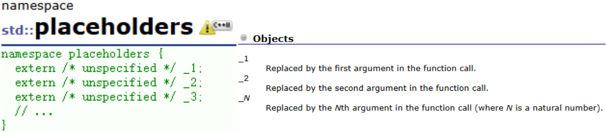
>
> ### 2. 核心逻辑：建立映射关系
>
> `std::bind` 的过程实际上是在建立一种 **“新函数参数”到“原函数参数”的映射表**。
>
> 假设有原函数：`void Func(int a, int b, int c);`
>
> 在包装器包装时候的参数列表是一一对应被包装的原始可调用对象的参数列表。
>
> 但是在你实际传参数的时候，你传入的实参，是严格对应包装器的占位符，第一个实参就对应`std::placeholders::_1`。
>
> **`_n` 永远代表新函数（调用时）的第 n 个参数，而不是原函数的第 n 个位置。**
>
> - **错误直觉**：认为 `_1` 必须放在第一个位置。
>
> - **正确理解**：`_1` 是一个“变量”，你可以把它放在原函数的任何参数位置上，甚至可以重复使用：
>
> 	```C++
> 	// 将新函数的第一个参数同时传给 Add 的两个参数
> 	auto square = std::bind(Add, _1, _1);
> 	cout << square(5); // 执行 Add(5, 5)，输出 10
> 	```

> [!IMPORTANT]
>
> 将`placeholders`命名空间的占位符展开：
>
> ```c++
> using placeholders::_1;
> using placeholders::_2;
> using placeholders::_3;
> ```
>
> ### A. 绑定固定参数
>
> 有时候一个函数需要 N 个参数，但你的回调接口只支持 $N-1$ 个参数，你可以用 `bind` 把其中一个参数“死掉”。
>
> ```C++
> int Sub(int a, int b) { return (a - b) * 10; }
> 
> // 调整参数个数 （常用）
> auto sub3 = bind(Sub, 100, _1);
> cout << sub3(5) << endl;
> ```
>
> ### B. 调整参数顺序
>
> 利用占位符 `std::placeholders::_n`，你可以改变参数的传递位置。
>
> ```C++
> auto sub2 = bind(Sub, _2, _1);
> cout << sub2(10, 5) << endl;
> ```
>
> 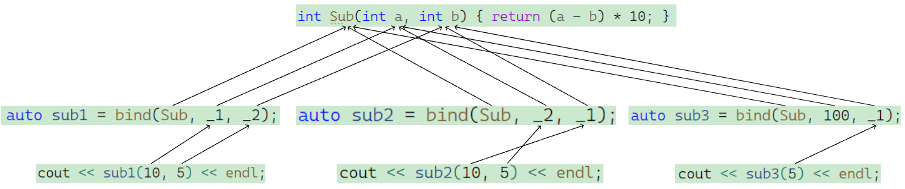
>
> 将图中的三个例子拆开看：
>
> #### 1. `sub1`：原样绑定
>
> - **写法**：`bind(Sub, _1, _2)`
> - **逻辑**：
> 	- `sub1(10, 5)`：`10` 对应 `_1`（第一个坑），`5` 对应 `_2`（第二个坑）。
> 	- 映射到 `Sub(a, b)`：`a` 拿到了 `_1` (10)，`b` 拿到了 `_2` (5)。
> - **结果**：执行 `Sub(10, 5)`。
>
> #### 2. `sub2`：交换顺序（重点）
>
> - **写法**：`bind(Sub, _2, _1)`
> - **逻辑**：
> 	- `sub2(10, 5)`：此时 `10` 依然是 `_1`，`5` 依然是 `_2`。
> 	- **关键点**：注意看图中的连线。映射到 `Sub(a, b)` 时，第一个参数 `a` 对应的位置放的是 `_2`，第二个参数 `b` 放的是 `_1`。
> - **结果**：执行 `Sub(5, 10)`。所以输出会是 `(5 - 10) * 10 = -50`。
>
> #### 3. `sub3`：固定参数与参数减少
>
> - **写法**：`bind(Sub, 100, _1)`
> - **逻辑**：
> 	- 原函数的第一个参数 `a` 被写死了，永远是 `100`。
> 	- 新函数 `sub3` 只需要传一个参数，这个参数对应 `_1`。
> 	- 调用 `sub3(5)`：`5` 填入 `_1` 的坑，对应的正是 `Sub` 的第二个参数 `b`。
> - **结果**：执行 `Sub(100, 5)`。输出 `(100 - 5) * 10 = 950`。
>
> ### C. 绑定成员函数（重要应用）
>
> 这是 `std::bind` 最常用的场景。调用类的成员函数必须通过对象（或指针），而 `bind` 可以把对象指针绑定进去，让成员函数看起来像普通函数。
>
> ```c++
> class Plus
> {
> public:
> 	Plus(int n = 10)
> 		:_n(n)
> 	{ }
> 	static int plusi(int a, int b) { return a + b; }
> 	double plusd(double a, double b) { return (a + b) * _n; }
> private:
> 	int _n;
> };
> ```
>
> **未绑定：**
>
> ```C++
> // 包装器签名中显式包含类名（或指针/引用），用来接收外部传入的对象
> // 这里的 Plus&& 对应调用时的 Plus()
> function<double(Plus&&, double, double)> f6 = &Plus::plusd;
> cout << f6(Plus(), 1.1, 1.1) << endl;
> ```
>
>  **绑定：**
>
> ```c++
> // 使用 bind 将对象 myObj 的地址直接“焊死”在第一个参数（this指针）上
> // 剩下的两个参数用占位符 _1, _2 预留
> // 此时包装器签名变成了 <double(double, double)>，不再需要 Plus
> Plus myObj(20); // 提前准备好一个对象
> function<double(double, double)> f6 = bind(&Plus::plusd, &myObj, _1, _2);
> cout << f6(1.1, 1.1) << endl;
> ```
>
> `std::bind` 本质上是一个**接口适配器**。它解决了“**我有一个函数，但它的签名（参数个数或顺序）不符合我的要求**”这一问题。
>
> - **`_1, _2...`** 是新函数的入口。
> - **固定值** 是旧函数的预填数据。
> - **`bind`** 是连接新旧接口的管道。

**包装器的重要性：**

1. **解耦**：函数调用者不需要关心被调用者是函数还是 Lambda，只需要知道签名匹配。
2. **统一类型**：允许我们将不同的可调用对象存储在同一个容器中（如 `vector<function<void()>>`），这在实现**任务队列**或**事件回调系统**时至关重要。
3. **参数适配**：`bind` 解决了函数接口不兼容的问题，是处理成员函数回调的利器。

**一句话总结：** `std::function` 解决了“类型不同”的问题，`std::bind` 解决了“参数个数/顺序不对”的问题。

## 7.3 bind vs Lambda 表达式

在 C++11 之后，Lambda 表达式几乎可以完成 `bind` 的所有工作，且语法更直观：

- **使用 bind**：`auto f = std::bind(Add, 10, _1);`
- **使用 Lambda**：`auto f = [](int x) { return Add(10, x); };`

**为什么还要学 bind？**

1. **成员函数绑定**：在处理复杂的成员函数回调时，`bind` 配合 `std::function` 依然非常简洁。
2. **代码复用**：如果你已经有了现成的函数指针，`bind` 可以快速进行适配。
3. **占位符灵活性**：在某些复杂的泛型编程场景下，动态调整参数顺序，`bind` 的表现更直接。
