# 一、类定义与封装体系

在 C 语言中，我们用 `struct` 定义结构体来存数据。而在 C++ 中，我们将 `struct` 升级成了 **`class`（类）**。类不仅能存**数据**（成员变量），还能存**行为**（成员函数）。

## 1.1 类的定义格式

**基本语法**：定义一个类，本质上是定义一个新的**数据类型**。

- **关键字：** `class`
- **类名：**通常首字母大写（如 `Stack`, `Date`）。
- **主体：** 花括号 `{}` 内包含成员变量和成员函数。
- **结尾：** **分号 `;` 不能省略**（和 `struct` 一样）。

```C++
class ClassName 
{
    // 类体：由成员函数和成员变量组成
public:
    // ... 公有成员（通常放函数）
    
private:
    // ... 私有成员（通常放变量）
    
}; // <--- 注意这里的分号！
```

**成员变量命名规范**：为了区分**成员变量**和函数的**参数**，习惯在成员变量名前（或后）加特殊标识。(注意：C++中这个**并不是强制的**，只是⼀些**惯例**)

- **常见习惯：** 加 `_` 前缀（如 `_year`）或 `m_` 前缀（`member`, 如 `m_year`）。
- **目的：** 避免 `year = year;` 这种自己给自己赋值的歧义。

C++中`struct`也可以定义类，C++兼容C中`struct`的⽤法，同时`struct`升级成了类，明显的变化是`struct`中**可以定义函数**，⼀般情况下还是推荐⽤`class`定义类。

```c++
struct ListNode // 1. 定义一个类，名字叫 ListNode
{
public:         // 2. 访问限定符：公有
	// 这是一个成员函数（方法）
	void Init(int x)
	{
		next = nullptr; // C++11 推荐用 nullptr 代替 NULL
		val = x;
	}  
private:        // 3. 访问限定符：私有
	// 这是成员变量（属性）
	ListNode* next; 
	int val;
};
```

当你定义 `struct ListNode { ... };` 时：

- 编译器既认识 **`struct ListNode`**。
- 编译器也自动认可 **`ListNode`** 直接作为类型名。

所以 C++ 允许你偷懒，省略 `struct` 关键字，直接定义。

**二者区别在于：**

| **关键字** |  **默认访问权限**  |
| :--------: | :----------------: |
| **class**  | **private** (私有) |
| **struct** | **public** (公有)  |

>定义在类⾯的成员函数默认为`inline`。

## 1.2 访问限定符

这是 C++ 实现 **“封装”**（Encapsulation）特性的关键。封装的本质就是：**把数据管起来，只给外界提供必要的接口。**

| **访问限定符**       | **类内部 (成员函数)** |  **类外部 (如 main)** | **主要用途**                          |
| -------------------- | :-------------------: | :---------------: | -------------------- |
| **public** (公有)    | 可访问                |  可访问               | **对外接口** (供外部调用的函数)       |
| **protected** (保护) | 可访问                |  不可访问             | **继承专用** (给子类用，不对外开放)   |
| **private** (私有)   | 可访问                |  不可访问             | **核心数据** (成员变量、内部实现细节) |

**作用域规则**

- 访问权限作用域**从该限定符出现的位置开始，直到下一个限定符出现或类结束 (`}`) 为止**。
- 如果类开头没有写限定符，`class` 默认为 `private`，`struct` 默认为 `public`。

> 也允许定义多个限定符，但是没必要。


## 1.3 类域

类定义了⼀个新的作⽤域，在类体 `{}` 里面定义的变量和函数，都属于这个类，在类体外定义成员时，需要使⽤ `::` 作⽤域操作符指明成员属于哪个类域。

**作用域限定符 `::`**：类域影响的是编译的查找规则，下⾯程序中`Init`如果不指定类域`Stack`，那么编译器就把`Init`当成全局函数，那么编译时，找不到`array`等成员的声明/定义在哪⾥，就会报错。指定类域`Stack`，就是知道`Init`是成员函数，当前域找不到的`array`等成员，就会到类域中去查找。

```c++
class Stack
{
public:
	// 成员函数
	void Init(int n = 4);
private:
	// 成员变量
	int* array;
	int capacity;
	int top;
};

// 声明和定义分离，需要指定类域
void Stack::Init(int n)
{
	array = (int*)malloc(sizeof(int) * n);
	if (nullptr == array)
	{
		perror("malloc");
		exit(-1);
	}
	capacity = n;
	top = 0;
}
```

> 当我们在**类外面**定义成员函数时，必须告诉编译器这个函数属于哪个类。这就像是你要找叫“张三”的人，必须说是“计算机系::张三”还是“土木系::张三”。

**两种定义成员函数的方式对比**

| **定义方式** | **方式一：声明和定义在类里**                                 | **方式二：声明在类里，定义在类外 (推荐)**                    |
| ------------ | ------------------------------------------------------------ | ------------------------------------------------------------ |
| **特点**     | 编译器会默认将其当做 **内联函数 (inline)** 处理。            | 这是工程中最**规范**的写法。 通常声明放在头文件，定义放在源文件。 |
| **适用场景** | 代码简短、逻辑简单的小函数（如 `Get` / `Set` 方法）。        | 代码较长、逻辑复杂的大函数； 或者需要保护源码不被泄露时。    |
| **关键语法** | 直接在类体 `{}` 中写函数体。                                 | **必须加作用域限定符 `::`** 格式：`返回值 类型::函数名(参数) {...}` |

这里也不需要担心`inlne`，它对编译器只是个建议，如果函数体非常复杂代码多的话，也不会当做内联展开。

# 二、实例化

## 2.1 概念

用类类型在物理内存中创建对象的过程，称为类实例化出对象 。

- **类 (Class)**：只是一个模型或设计图。它限定了类有哪些成员（变量和函数），但它**只声明，不分配实际内存空间** 。
- **对象 (Object)**：是根据类这个“模具”造出来的实物。只有实例化出了对象，系统才会真正**分配物理内存**来存储数据 。

- 一个类可以实例化出多个对象。

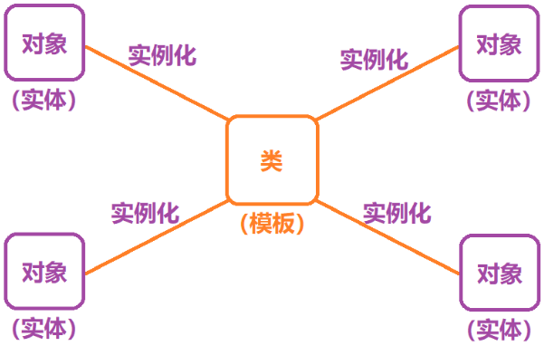

## 2.2 对象大小

**1. 核心原则**

- **只计算成员变量：** 对象的大小**只包含非静态成员变量的大小** 。
- **不计算成员函数：** **成员函数存储在公共代码段（Code Segment）**，不占用对象的空间 。
- **空类大小为 1：** 如果一个类没有成员变量（空类），编译器会给它分配 **1 字节**，用于占位，标识这个对象在内存中存在，确保每个对象都有唯一的地址 。

其实函数指针是不需要存储的，函数指针是⼀个**地址**，对普通(非虚)函数来说，这个地址在**链接阶段**就已经是一个绝对数字，指令里直接写死，调⽤函数被编译成汇编指令`[call 地址]`，编译器在**编译链接**时，就要**找到函数的地址**，既然地址已经硬编码进代码段，运行期就**不需要也不允许再到对象里取一次地址**，因此**对象本身不必保存任何与函数有关的信息**。只有动态多态是在运⾏时找，就需要存储函数地址，这个先简单了解一下。

**2. 内存对齐规则**

C++ 类对象的内存布局完全兼容 C 语言结构体的对齐规则。计算大小时必须满足以下 3 条规则 ：

- **首成员对齐：** 第一个成员变量存储在偏移量为 **0** 的地址处 。
- **中间成员对齐：** 其他成员变量要对齐到 **对齐数** 的整数倍地址处。
	- **对齐数 =** `min(编译器默认对齐数, 该成员大小)`。
	- *注：VS 环境默认对齐数为 8，Linux (gcc) 默认对齐数为 4* 。
- **总大小对齐：** 结构体（类）的总大小，必须是 **最大对齐数** 的整数倍。
	- **最大对齐数 =** 所有成员变量类型中最大的那个（如果是数组看元素类型）。

内存给类实例化对象开辟的空间时候，只给成员变量开辟了所占用的空间，类中的所有成员函数全部会放在公共代码区，并且会被此类域修饰；

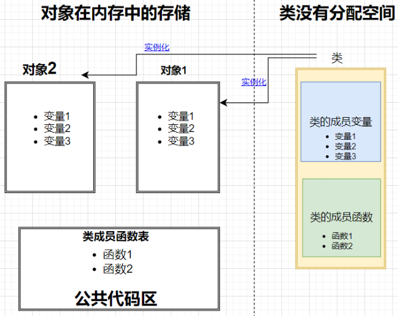

# 三、this指针

`this` 指针是 C++ 类和对象机制中一个看似隐形、实则无处不在的关键概念。

**为什么需要 `this` 指针？：** 类中的成员函数（代码指令）只有一份，存储在公共代码段。当多个对象（如 `d1` 和 `d2`）调用同一个函数（如 `Init`）时，函数怎么知道该操作 `d1` 的数据还是 `d2` 的数据？

**方案：** C++ 引入了 `this` 指针。

- **定义：** `this` 指针是一个隐含的指针，它指向**当前调用该成员函数的对象** 。
- **作用：** 在成员函数内部，所有对成员变量的访问，本质上都是通过 `this` 指针来完成的。

## 3.1 原理与底层机制

虽然你写的函数没参数，但编译器编译时，会自动在形参列表的**第一个位置**增加一个指针参数 。

**你写的代码：**

```C++
// d1调用
d1.Init(2024, 3, 31);
// 类定义
void Init(int year, int month, int day) 
{
    _year = year; 
}
```

**编译器眼中的代码（伪代码）：**

```C++
// 编译器自动传了 d1 的地址
Init(&d1, 2024, 3, 31); 
// 编译器加了一个 this 参数
void Init(Date* const this, int year, int month, int day) 
{
    this->_year = year; // 显式指向
}
```

这里可以通过底层汇编指令来看，每次调用当前对象的方法时，总会把当前对象对象地址放入**寄存器**中：

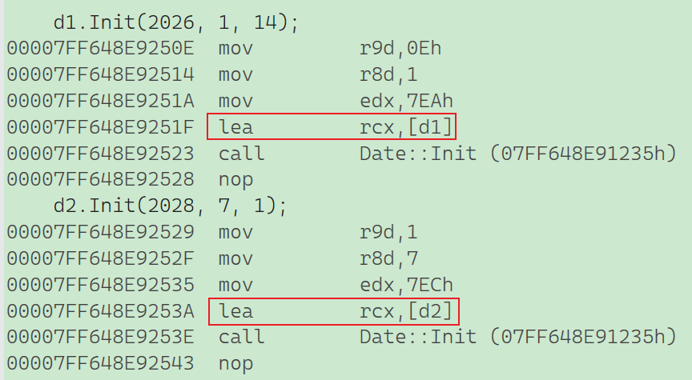

**`this` 指针的类型**：`类类型* const`，这意味着 `this` 指针**本身不能被修改**（你不能写 `this = nullptr;`），但它指向的内容（对象成员）可以修改。

**`this` 指针存在哪里？**

- 首先它一定不在对象里面，因为计算对象大小的时候，压根就没算`this`指针啊。
- `this` 指针是函数的**形参**。
	- 所以它通常存在**栈 (Stack)** 上（因为它就是个参数）。
	- 在某些编译器（如 VS）优化下，可能会通过 **寄存器 (ecx)** 自动传递，以提高效率。
	

**`this` 指针的使用场景**

虽然它是隐含的，但在以下场景你可以显式使用它：

- 类的成员函数中访问成员变量，本质都是通过`this`指针访问的，如`Init`函数中给`_year`赋值， `this->_year = year`（编译器会自己加，所以也不是很有必要）;

```c++
void Print()
{
    cout << this->_year << "-" << this->_month << "-" << this->_day << endl;
}
```

- 链式调用（返回 `*this`）：在赋值运算符重载 `operator=` 或其他需要**连续调用的函数**中，我们需要返回对象本身。


```c++
Date& operator=(const Date& d) 
{
    if (this != &d) 
    {   
        // 检查自赋值
        _year = d._year;
        // ...
    }
    return *this; // 返回对象本身，支持 d1 = d2 = d3;
}
```


## 3.2 `this` 指针可以是 `nullptr` 吗？

```C++
class A 
{ 
public:
    void Print() { cout << "Print()" << endl; } // 不访问任何成员
private:
    int _a;
};
int main() 
{
    A* p = nullptr;
    p->Print(); // 这里的 p 就是 this
}
```

**结果：正常运行**。**原因：** `p` 虽然是空指针，但调用 `Print` 函数不需要解引用（函数地址在编译时就确定了）。进入函数后，`this` 是 `nullptr`，但函数体内**没有访问**任何成员变量（没有 `this->_a`），所以不会报错。

```C++
class A 
{
public:
    void Print() { cout << _a << endl; } // 访问成员 _a
private:
    int _a;
};
int main()
{
    A* p = nullptr;
    p->Print();
}
```

**结果：运行崩溃**。**原因：** 这里 `cout << _a` 本质是 `cout << this->_a`。因为 `this` 是 `nullptr`，试图访问空指针的成员会导致空指针访问违规。

**总结表格**

|    **特性**    |                  **说明**                  |
| :------------: | :----------------------------------------: |
|    **本质**    |             指向当前对象的指针             |
|    **类型**    |    `ClassName* const` (指针本身不可改)     |
|  **存储位置**  |  **栈** 或 **寄存器** (作为隐式形参传递)   |
|  **对象大小**  |        **不包含** `this` 指针的大小        |
|  **显式使用**  | `return *this;` (链式调用), `this->member` |
| **空指针调用** |    可以调用函数，但**不能访问成员变量**    |

# 四、默认成员函数

​	默认成员函数就是**⽤户没有显式实现**，**编译器会⾃动⽣成**的成员函数称为默认成员函数。⼀个类，我们不写的情况下编译器会默认⽣成以下**6个默认成员函数**，需要注意的是这6个中最重要的是**前4个**，最后两个取地址重载不重要，稍微了解⼀下即可。其次就是C++11以后还会增加两个默认成员函数，**移动构造和移动赋值**，这个不是这次的重点。默认成员函数很重要，也⽐较复杂，重点关注两个方面：

- 第⼀：不写时，编译器默认⽣成的函数⾏为是什么，是否满⾜需求。

- 第⼆：编译器默认⽣成的函数不满⾜需求，需要⾃⼰实现，那么如何实现？


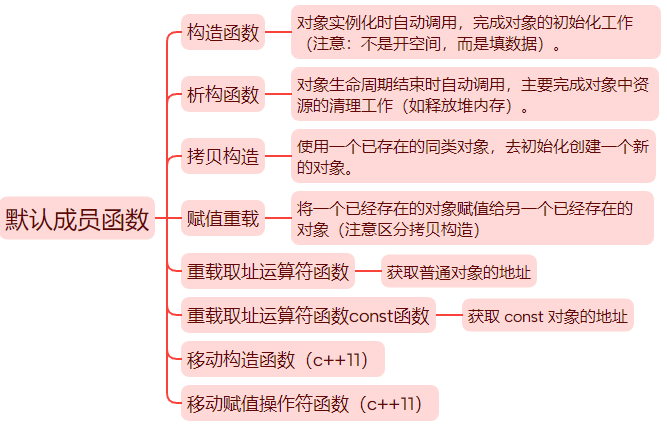

## 4.1 构造函数

​	构造函数是特殊的成员函数，需要注意的是，构造函数虽然名称叫构造，但是构造函数的主要任务**并不是开空间创建对**象(常使⽤的局部对象是栈帧创建时，空间就开好了)，而是**对象实例化时初始化对象**。构造函数的本质是要替代以前`Stack`和`Date`类中写的`Init`函数的功能，构造函数**⾃动调⽤**的特点就完美的替代的了`Init`。

**特征**

- **函数名与类名相同** 。
- **无返回值**（也不写 `void`）。
- **自动调用**：对象实例化时系统自动调用 。
- **支持重载**：可以有多个构造函数（如无参、带参）。
- 编译器默认生成的行为 ：如果你不写构造函数，编译器会自动生成一个无参的默认构造函数。它的行为如下：
	- **内置类型**（`int`, `char`, 指针等）：**不做处理**（值是随机的，未定义）。
	- **自定义类型**（`class`/`struct` 成员）：会自动调用该成员的**默认构造函数**。

- **⽆参构造函数**、**全缺省构造函数**、我们不写构造时**编译器默认⽣成的构造函数**，都叫做**默认构造函数**。但是**这三个函数有且只有⼀个存在**，**不能同时存在**。⽆参构造函数和全缺省构造函数虽然**构成函数重载**，但是**调⽤时会存在歧义**。要注意：很多人会认为默认构造函数是编译器默认⽣成那个叫默认构造，实际上⽆参构造函数、全缺省构造函数也是默认构造，总结⼀下就是**不传实参就可以调⽤的构造就叫默认构造**。

- 我们不写，编译器默认⽣成的构造，对**内置类型成员变量的初始化没有要求**，也就是说是**是否初始化是不确定的**，看编译器。对于⾃定义类型成员变量，要求调⽤这个成员变量的默认构造函数初始化。如果这个成员变量，没有默认构造函数，那么就会报错，要初始化这个成员变量，需要**初始化列表**才能解决。

>C++把类型分成**内置类型(基本类型)**和**⾃定义类型**。内置类型就是语⾔提供的原⽣数据类型，**如：int/char/double/指针等，⾃定义类型就是我们使⽤class/struct等关键字⾃⼰定义的类型**。

编译器自己写的话，内置类型是不会初始化的，而是会给随机值：

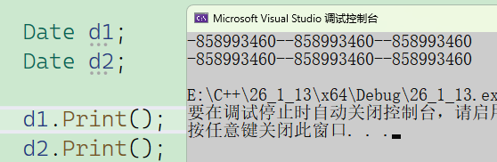

但还有这样一种情况：

```c++
// 两个Stack实现队列
class MyQueue
{
public:
	//编译器默认生成MyQueue的构造函数调用了Stack的构造，完成了两个成员的初始化
private:
	Stack pushst;
	Stack popst;
	int size;
};
```

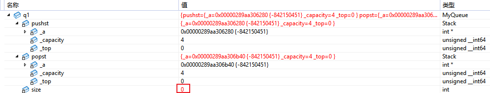

调试完后发现`size`被初始化成0了，所以内置类型完全看编译器，在 C++ 标准中，这属于**未定义行为**。在某些编译器或某些 Debug 优化设置下，**内存可能会被默认清零**，但**绝不能依赖这一点**。在 Release 模式或其他编译器下，它很可能就是一个**随机的乱码值**。后续理解就按照随机值理解，这里需要初始化列表缺省值解决

## 4.2 析构函数

​	析构函数与构造函数功能相反，析构函数不是完成对对象本⾝的销毁，⽐如局部对象是存在栈帧的，函数结束栈帧销毁，他就释放了，不需要我们管，C++规定**对象在销毁时会⾃动调⽤析构函数**，完成对象中**资源的清理释放**⼯作。析构函数的功能类⽐之前`Stack`实现的`Destroy`功能，⽽像`Date`没有`Destroy`，其实就是没有资源需要释放，所以严格说`Date`是不需要析构函数的。

**析构函数的特点：**

- 析构函数名是在类名前加上字符 `~`。

- ⽆参数⽆返回值。 (这⾥跟构造类似，也不需要加`void`)

- **⼀个类只能有⼀个析构函数**。若未显式定义，系统会**⾃动⽣成默认的析构函数**。

- 对象⽣命周期结束时，系统会**⾃动**调⽤析构函数。

- 跟构造函数类似，我们不写编译器⾃动⽣成的析构函数**对内置类型成员不做处理**，**⾃定类型成员会调⽤他的析构函数**。

- 还需要注意的是我们**显式写析构函数**，对于⾃定义类型成员**也会调⽤他的析构**，也就是说⾃定义类型成员⽆论什么情况都会⾃动调⽤析构函数。

- 如果类中**没有申请资源**时，**析构函数可以不写**，直接使⽤编译器⽣成的默认析构函数，如`Date`；如果默认⽣成的析构就可以⽤，也就不需要显⽰写析构，如`MyQueue`；但是**有资源申请**时，**⼀定要⾃⼰写析构**，否则会造成资源泄漏，如`Stack`。
- ⼀个局部域的多个对象，C++规定**后定义的先析构**。

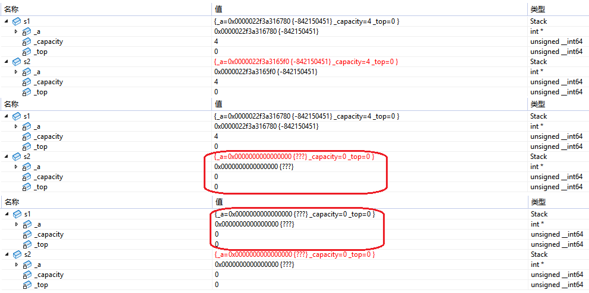

## 4.3 拷贝构造函数

​	如果⼀个构造函数的**第⼀个参数是⾃⾝类类型的引⽤**，且任何**额外的参数都有默认值**，则此构造函数也叫做拷⻉构造函数，也就是说拷⻉构造是⼀个特殊的构造函数。

- **拷贝构造函数是构造函数的一个重载**。
- **拷贝构造函数的第一个参数必须是类型对象的引用**，使用传值方式编译器直接报错，因为语法逻辑上会引发无穷递归调用。拷贝构造函数也可以多个参数，但是第一个参数必须是类型对象的引用，后面的参数必须有缺省值。
- **自定义类型对象进行拷贝行为必须调用拷贝构造函数**，所以自定义类型传递和赋值后都会调用拷贝构造函数完成。
- **若未显式定义拷贝构造函数，编译器会自动生成拷贝构造函数**。自动生成的拷贝构造函数对内置类型成员变量会完成**拷贝/浅拷贝**（一个字节一个字节的拷贝），对自定义类型成员变量会调用他的拷贝构造函数。
- 像 `Date` 这样的类成员变量全是内置类型且没有指向什么资源，编译器自动生成的拷贝构造函数就可以完成需要的拷贝，所以不需要我们显式实现拷贝构造函数。像 `Stack` 这样的类，虽然也是内置类型，但是 `_a` 指向了资源，编译器自动生成的拷贝构造函数完成的值拷贝/浅拷贝不符合我们的需求，所以需要我们自己实现深拷贝（对指向的资源也进行拷贝）。像 `MyQueue` 这样的类内部主要是自定义类型 `Stack` 成员，编译器自动生成的拷贝构造函数会调用 `Stack` 的拷贝构造函数，也不需要显式实现 `MyQueue` 的拷贝构造函数。
   **一个小技巧**：如果一个类显式实现了析构并释放资源，那么他就需要显式写拷贝构造函数，否则就不需要。
- 传值返回会产生一个临时对象调用拷贝构造函数，传值引用返回，返回的是返回对象的别名（引用），没有产生拷贝。但是如果返回对象是一个当前函数局部变量的局部对象，函数结束就销毁了，那么使用引用返回是有问题的，这时的引用相当于一个野引用，类似一个野指针一样。**传引用返回可以减少拷贝，但是一定要确保返回值对象，在当前函数结束后还在，才能用引用返回**。

C++规定**传值传参需要调用拷贝构造**：

```c++
class Date
{
public:
	Date(int year = 1, int month = 1, int day = 1)
	{
		_year = year;
		_month = month;
		_day = day;
	}
	void Print()
	{
		cout << _year << "-" << _month << "-" << _day << endl;
	}
	Date(const Date& d)
	{
		cout << "Date(const Date& d)" << endl;
		_year = d._year;
		_month = d._month;
		_day = d._day;
	}
private:
	int _year;
	int _month;
	int _day;
};
void func(Date d)
{
	cout << "void func(Date d)" << endl;
}
int main()
{
	Date d(2026, 1, 14);
	func(d);
	return 0;
}
```

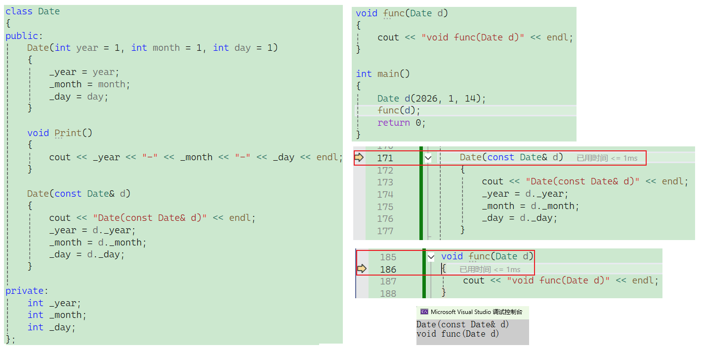

如果当拷贝构造函数的第一个参数不是自身类类型的引用，那么每次传值传参时都会调用一个新的拷贝构造函数，导致函数死递归。

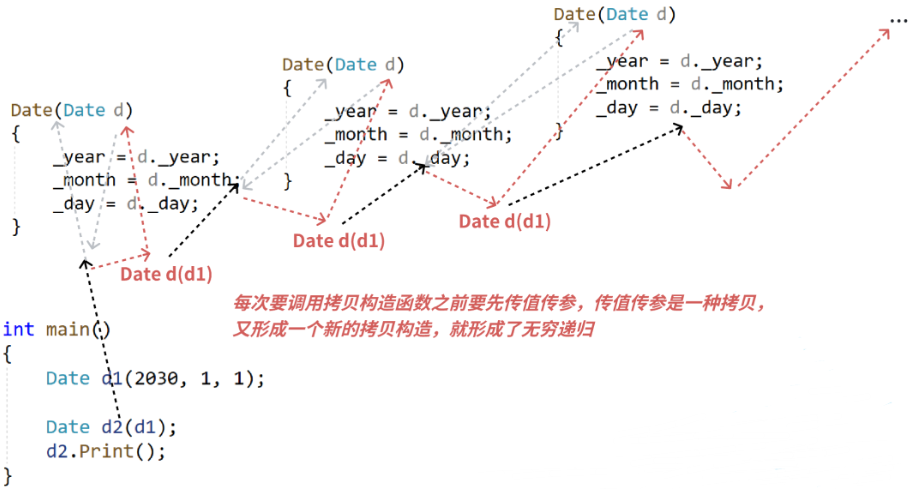

如果是类似`Stack`这类**有指向资源的成员变量**，假设你不自己显式实现拷贝构造函数，那么**浅拷贝**就会产生两个一模一样的对象，包括指向的空间，里面有效的元素，但着两个实例化对象互相还看不见彼此，最后就会导致数据机构大乱。遇到这种情况就需要我们显式实现拷贝构造函数，将成员变量一一进行**深拷贝**。

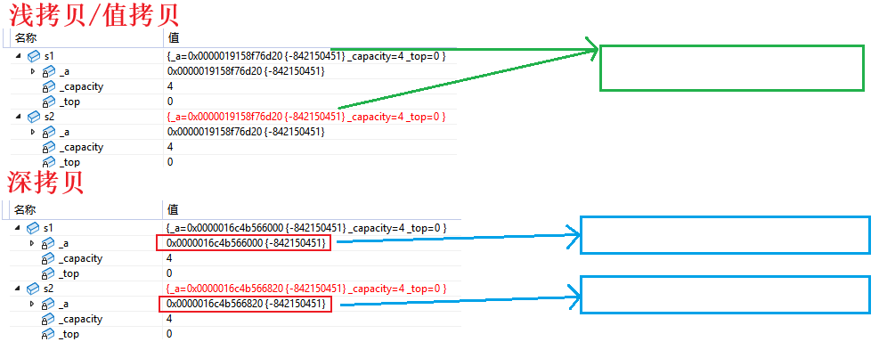

## 4.4 赋值运算符重载
### 4.4.1 运算符重载
- 当运算符被用于类类型的对象时，C++语言允许我们通过运算符重载的形式指定新的含义。C++规定类类型对象使用运算符时，必须转换成调用对应运算符重载，若没有对应的运算符重载，则会编译报错。

- 运算符重载是具有特殊名字的函数，它的名字是由 `operator` 和后面要定义的运算符共同构成。和其他函数一样，它也具有其返回类型和参数列表以及函数体。

- 重载运算符函数的参数个数和该运算符作用的运算对象数量一样多。一元运算符有一个参数，二元运算符有两个参数，二元运算符的左侧运算对象传给第一个参数，右侧运算对象传给第二个参数。

- 如果一个重载运算符函数是成员函数，则它的第一个运算对象默认传给隐式的 `this` 指针，因此运算符重载作为成员函数时，参数比运算对象少一个。

- 运算符重载以后，其他优先级和结合性与对应的内置类型运算符保持一致。

- 不能通过连接语法中没有的符号来创建新的操作符：比如 `operator@`。

- `.*`、`::`、`sizeof`、`?:` 和 `.`。注意以上5个运算符不能重载。（选择题里面常考）

- 重载操作符至少有一个类类型参数，不能通过运算符重载改变内置类型对象的含义，如：`int operator+(int x, int y)`

- 一个类需要重载哪些运算符，是看哪些运算符重载后有意义，比如 `Date` 类重载 `operator-` 就有意义，但是重载 `operator+` 就没有意义。

- 重载 `++` 运算符时，有前置 `++` 和后置 `++`，运算符重载函数名都是 `operator++`，无法很好的区分。C++规定，后置 `++` 重载时，增加一个 `int` 形参，跟前置 `++` 构成函数重载，方便区分。

- 重载 `<<` 和 `>>` 时，需要重载为全局函数，因为重载为成员函数，`this` 指针默认占用了第一个形参位置，第一个形参位置是左侧运算对象，调用时就变成了 `对象<<cout`，不符合使用习惯和可读性。重载为全局函数把 `ostream/istream` 放到第一个形参位置就可以了，第二个形参位置当类类型对象。

>既然写成了全局函数，它就不是类的“内部人员”了，无法访问类里面的 `private`（私有）成员变量（`_year`, `_month`, `_day`）。
>
>需要在类里面声明 `friend`，相当于 `Date` 类发了一张“通行证”给这个函数，允许它访问私有成员 。

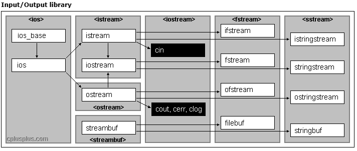

```c++
//类里面进行友元声明
friend ostream& operator<<(ostream& out, const Date& d);
friend istream& operator>>(istream& in, Date& d);
// 返回值 ostream&：为了支持连续输出 (cout << d1 << d2)
ostream& operator<<(ostream& out, const Date& d)
{
    // 这里的 out 就是 cout 的别名
    // 像打印普通变量一样打印成员变量
    out << d._year << "-" << d._month << "-" << d._day << endl;
    
    // 返回 out，让下一个 << 可以继续接在后面
    return out; 
}
// 返回值 istream&：为了支持连续输入 (cin >> d1 >> d2)
istream& operator>>(istream& in, Date& d)
{
    cout << "请依次输入年月日:>"; // 提示信息
    
    // 把输入的值写入到 d 的成员变量中
    in >> d._year >> d._month >> d._day;
    
    return in;
}
```

`.*`运算符：指针回调成员函数

```c++
class A
{
public:
	void func()
	{
		cout << "A::func()" << endl;
	}
};

typedef void(A::* PF)(); //成员函数指针类型

int main()
{
	A aa;
	// C++规定成员函数要加&才能取到函数指针
	// 对象调⽤成员函数指针时，使⽤.*运算符
	PF pf = &A::func;
	(aa.*pf)();
	return 0;
}
```

### 4.4.2 赋值运算符重载

赋值运算符重载是一个默认成员函数，用于完成两个已经存在的对象直接的拷贝赋值。这里要注意跟拷贝构造区分：拷贝构造用于一个对象拷贝初始化给另一个**要创建**的对象。

**赋值运算符重载的特点：**

- 赋值运算符重载是一个运算符重载，规定必须重载为成员函数。赋值运算符重载的参数建议写成 `const` 当前类类型引用，否则传值参数会有拷贝。

- 有返回值，且建议写成当前类类型引用，引用返回可以提高效率，有返回值目的是为了支持连续赋值场景。

- 没有显式实现时，编译器会自动生成一个默认赋值运算符重载。**默认赋值运算符重载行为跟默认拷贝构造函数类似**，对内置类型成员变量会完成值**拷贝/浅拷贝**（一个字节一个字节的拷贝），对自定义类型成员变量会调用它的赋值重载函数。

- 像 `Date` 这样的类成员变量全是内置类型且没有指向什么资源，编译器自动生成的赋值运算符重载就可以完成需要的拷贝，所以不需要我们显式实现赋值运算符重载。像 `Stack` 这样的类，虽然也都是内置类型，但是 `_a` 指向了资源，编译器自动生成的赋值运算符重载完成的拷贝/浅拷贝不符合我们的需求，所以需要我们自己实现深拷贝（对指向的资源也进行拷贝）。像 `MyQueue` 这样的类型内部主要是自定义类型 `Stack` 成员，编译器自动生成的赋值运算符重载会调用 `Stack` 的赋值运算符重载，也不需要我们显式实现 `MyQueue` 的赋值运算符重载。
   **一个小技巧：如果一个类显式实现了析构并释放资源，那么他就需要显式写赋值运算符重载，否则就不需要。**

连续赋值时，从后往前执行，那么我们重载的赋值，也需要实现连续赋值的功能，类似这样：

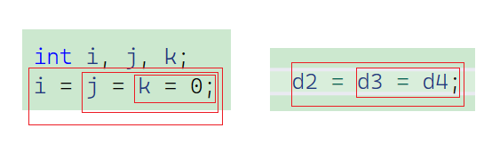

## 4.5 取地址运算符重载 

### 4.5.1 const成员函数
**const 成员函数**： 在成员函数的**参数列表后面**加上 `const` 关键字，这个函数就变成了 `const` 成员函数。**表面含义——** 承诺在这个函数内部，**不会修改** 类里面的任何成员变量。 

**本质原理：`this` 指针的“变身”**

我们知道，成员函数之所以能访问成员变量，是因为有一个隐含的 `this` 指针。

- **普通成员函数中：** `this` 的类型是 `Date* const this`。
	- `const` 修饰 `this` 本身，表示指针不能指别处，但指向的内容（对象成员）可以改。
	
- **const 成员函数中：** `const` 实际上修饰的是 `this` 指针所指向的内容。
- 类型变成了 **`const Date* const this`** 。
	
- **含义：** 我既不能改变指针指向，也**不能改变指针指向的对象数据**。

**为什么需要它？（权限规则）——权限只能缩小，不能放大**。

- 因为调用类成员方法时，对象不一定是普通对象还是`const`对象，但是类内部的隐含`this`指针，是 `Date* const this`类型，这时候传一个`const`类型对象，就是典型的权限放大问题，为了避免这个问题，只能对`this`指针下手，但C++明确规定不能显式写`this`指针参数，所以规定将`const`修饰的成员函数称之为`const`成员函数，`const`修饰成员函数放到成员**函数参数列表的后⾯**。类似：`void Print() const`。
- `const`实际修饰该成员函数隐含的`this`指针，表明在该成员函数中不能对类的任何成员进⾏修改。`const` 修饰`Date`类的`Print`成员函数，`Print`隐含的`this`指针由 `Date* const this` 变为 `const Date* const this`。

进行`const`修饰后，无论普通对象还是`const`对象，都可以调用类的成员方法。

### 4.5.2 取地址运算符重载

取地址运算符重载分为普通取地址运算符重载和`const`取地址运算符重载，⼀般这两个函数编译器⾃动⽣成的就可以够⽤了，不需要去显式实现。除⾮⼀些很特殊的场景，⽐如不想让别⼈取到当前类对象的地址，就可以⾃⼰实现⼀份，胡乱返回⼀个地址。

```c++
Date * operator&()
{
    return this;
    // return nullptr;
}
const Date * operator&()const
{
    return this;
    // return nullptr;
}
```

# 五、初始化列表

- 之前我们实现构造函数时，初始化成员变量主要使用函数体内赋值。构造函数初始化还有一种方式，就是**初始化列表**。初始化列表的使用方式是以一个冒号开始，接着是一个逗号分隔的数据成员列表，每个“成员变量”后面跟一个放在括号中的初始值或表达式。

```c++
// 构造函数
Date(int year, int month, int day)
    : _year(year)   // 初始化列表开始
    , _month(month)
    , _day(day)     // 初始化列表结束
{
    // 函数体内部 (这里叫赋值，不叫初始化)
}
```

- 每个成员变量在初始化列表中只能出现一次，语法理解上初始化列表可以认为是每个成员变量定义初始化的地方。

>如果是在函数体内： 成员变量已经定义好了（已经占好坑了），这里执行的是赋值操作。

- **引用成员变量**、**const成员变量**、**没有默认构造的自定义类型变量**，必须放在初始化列表位置进行初始化，否则会编译报错。

> 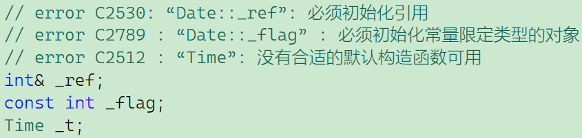

>- **引用成员变量**、**const成员变量**均需要在定义的地方给它进行初始化，const 变量必须在定义时就初始化，且一旦定义后就不能修改（不能赋值）。引用就是一个别名，必须在出生（定义）的时候就确认它是谁的别名，之后不能改嫁。
>-  如果成员是一个类对象（比如 `Stack`），且它没有无参的默认构造函数，你必须在初始化列表中显式调用它的带参构造函数。否则编译器走初始化列表的时候想去调`Stack`的默认构造函数却找不到，就会报错。

> 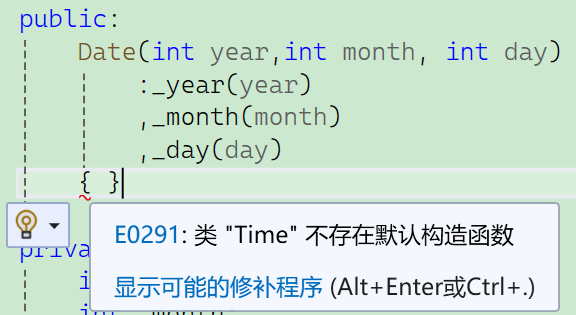

```c++
Date(int year,int month, int day)
    :_year(year)
    ,_month(month)
    ,_day(day)
    ,_t(1)  //必须显式传参调用构造函数
{ }
```

- C++11支持在成员变量声明的位置给缺省值，这个缺省值主要是给没有显式在初始化列表初始化的成员使用的。

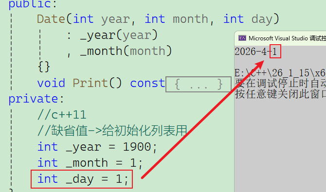

- 尽量使用初始化列表初始化，因为那些你不在初始化列表初始化的成员也会走初始化列表。如果这个成员在声明位置给了缺省值，初始化列表会用这个缺省值初始化。如果你没有给缺省值：
  - 对于没有显式在初始化列表初始化的**内置类型成员**是否初始化取决于编译器，C++并没有规定。
  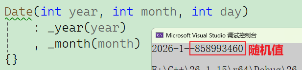
  - 对于没有显式在初始化列表初始化的**自定义类型成员**会调用这个成员类型的默认构造函数，如果没有默认构造函数编译器会报错。
  
  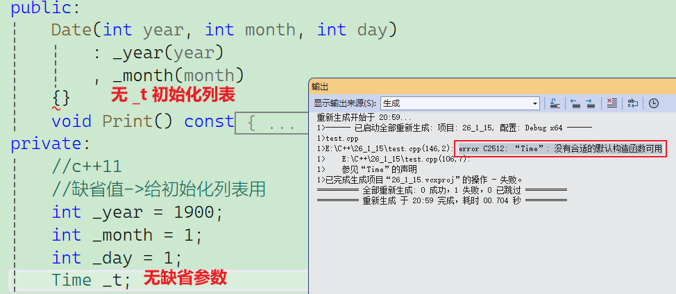

- 初始化列表中按照成员变量在类中**声明顺序**进行初始化，跟成员在初始化列表出现的先后顺序无关。建议声明顺序和初始化列表顺序保持一致。

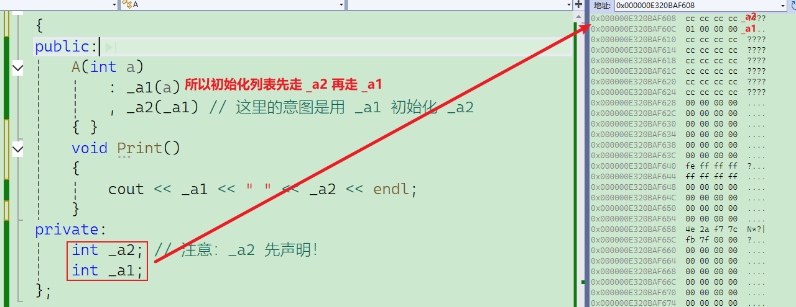

**初始化列表总结：**

- 无论是否显式写初始化列表，每个构造函数都有初始化列表；
- 无论是否在初始化列表显式初始化成员变量，每个成员变量都要走初始化列表初始化；

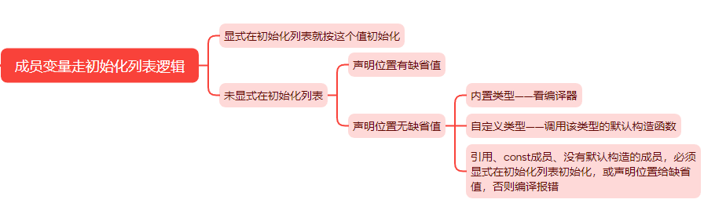

# 六、隐式类型转换

**隐式类型转换：**当你在代码中把一个类型 A 的值，赋值给类型 B 的变量时，如果两者类型不一样，编译器会自动尝试把你提供的值转换成目标类型。这个过程不需要你显式强转（如 `(int)a`），所以叫**隐式**。

## 6.1 单参数构造函数的隐式转换 (C++98)

**现象：**如果一个类有一个**单参数**的构造函数（或者其他参数都有默认值，只剩一个参数需要传），那么这个类的对象可以用这个参数的类型直接赋值。

```C++
class Date 
{
public:
    // 单参数构造函数
    Date(int year) 
    {
        _year = year;
        _month = 1;
        _day = 1;
    }
private:
    int _year;
    int _month;
    int _day;
};

int main() 
{
    Date d1(2024); // 1. 正常的构造调用
    // 2. 隐式类型转换发生在这里
    Date d2 = 2025; // 写法虽然像赋值，但本质是构造
    return 0;
}
```

**核心原理：临时对象 (重点)** 当编译器看到 `Date d2 = 2025;` 时，它会执行以下步骤：

1. **类型匹配：** 编译器发现 `2025` 是 `int`，而 `d2` 是 `Date`。
2. **寻找转换路径：** 编译器去 `Date` 类里找，发现有一个构造函数 `Date(int year)` 可以接受 `int`。
3. **构造临时对象：** 编译器先用 `2025` 调用构造函数，生成一个**临时的 `Date` 对象**。
4. **拷贝构造：** 再把这个临时对象，通过**拷贝构造函数**拷贝给 `d2`。

## 6.2 多参数构造函数的隐式转换 (C++11)

在 C++98 中，只有单参数构造函数支持隐式转换。但在 C++11 中，引入了 `{}` 初始化列表，使得**多参数**构造函数也支持隐式转换。

```C++
class Date 
{
public:
    // 多参数构造函数
    Date(int year, int month)
    {
        _year = year;
        _month = month;
        _day = 1;
    }
    // ...
};
int main() 
{
    // C++11 支持这种写法
    Date d1 = { 2024, 7 }; 
}
```

**原理：** 同样是先用 `{2024, 7}` 构造一个临时的 `Date` 对象，然后再拷贝构造给 `d1`（同样会被编译器优化）。

## 6.3 `explicit` 关键字

有时候，隐式转换虽然方便，但会降低代码的可读性，甚至引发 Bug。 比如：

```C++
class Stack 
{
public:
    Stack(int capacity) { ... } // 为了设置初始容量
};
int main() 
{
    Stack s = 100; // 这里的 100 是什么意思？压入元素100？还是容量100？
}
```

如果不看类定义，`Stack s = 100` 很容易让人误解为压入了一个数据 100，但实际上它是把栈的容量初始化为 100。

**解决方案：** 在构造函数前加上 **`explicit`** 关键字，就会**禁止**该构造函数参与隐式类型转换。

```C++
class Stack 
{
public:
    //禁止隐式转换
    explicit Stack(int capacity) { ... }
};

int main() 
{
    Stack s1(100); //  正确：显式调用构造
    // Stack s2 = 100; //  报错：无法从 int 转换为 Stack
}
```

## 6.4 隐式转换与引用的关系

结合之前讨论过的 `const` 引用，这里有一个非常经典的坑：

```C++
void func(const Date& d) { ... }
int main()
{
    // 场景 A：
    Date& r = 2024;       // 报错！
    
    // 场景 B：
    const Date& cr = 2024; // 正确！
}
```

**解析：**

1. `2024` 转换成 `Date` 时，会产生一个**临时对象**。
2. C++ 规定：**临时对象具有常性（视为 const）**。
3. **场景 A**：你试图用一个普通引用 `Date&` 去引用一个 `const` 的临时对象，这是**权限放大**，所以报错。
4. **场景 B**：你用 `const Date&` 去引用，**权限匹配**，所以正确。并且这会**延长临时对象的生命周期**。

|   **特性**   |                 **说明**                  |           **示例**            |
| :----------: | :---------------------------------------: | :---------------------------: |
| **单参转换** |             `int` -> `Class`              |       `Date d = 2024;`        |
| **多参转换** |            `{args}` -> `Class`            | `Date d = {2024, 7};` (C++11) |
| **底层原理** | 先构造**临时对象**，再拷贝构造 (常被优化) | `2024` -> `Tmp(2024)` -> `d`  |
| **禁止转换** |        使用 **`explicit`** 关键字         |  `explicit Date(int year);`   |
| **引用传参** |   必须加 **`const`** 才能接隐式转换的值   |  `void func(const Date& d);`  |

C++ 允许把构造函数的参数直接赋值给对象，这本质是编译器在后台偷偷帮你生成了一个临时对象，如果你不想让它偷偷转，就加上 `explicit`关键字。

# 七、static

## 7.1 概念总览

- 用 `static` 修饰的成员变量，称之为**静态成员变量**，静态成员变量**一定要在类外进行初始化**，也是类的成员，受 `public`、`protected`、`private` 访问限定符的限制。
- 用 `static` 修饰的成员函数，称之为**静态成员函数**，静态成员函数**没有 `this` 指针**，所以静态成员函数中可以访问其他的静态成员，但是**不能访问非静态成员**。
- 突破类域就可以访问静态成员，可以通过 `类名::静态成员` 或者 `对象.静态成员` 来访问静态成员变量和静态成员函数。
- 非静态的成员函数，可以访问任意的静态成员变量和静态成员函数。
- 静态成员变量**不能在声明位置给缺省值初始化**，因为**缺省值是给构造函数初始化列表**的，静态成员变量不属于某个对象，不走构造函数初始化列表。

- **普通成员变量：** 每个对象都有一份，互不干扰（你是你的，我是我的）。
- **static 成员变量：** 所有对象**共享**这一份，只有唯一的一个（大家共用一个）。
- **存储位置：** 普通成员在栈或堆（对象里面）；static 成员在**静态存储区**（对象外面）。

## 7.2 static 成员变量

**(1) 特性**

1. **共享性：** 无论实例化了多少个对象（甚至 0 个），`static` 变量只有一份。
2. **不占对象空间：** `sizeof(类)` 不包含 static 成员的大小。
3. **生命周期：** 随类一直存在，**程序结束才销毁**。

**(2) 定义与初始化**

- **声明：** 在类里面（加 `static`）。
- **定义：** 必须在**类外面**（全局作用域），**不能**在构造函数初始化列表中初始化。

```C++
class A 
{
private:
    // 1. 类中声明
    static int _count; 
};

// 2. 类外定义 + 初始化 (不需要加 static 关键字，但要加类域 A::)
int A::_count = 0; 
```

**(3) 访问方式**

- **方式 A：** 通过对象访问 `a._count`（虽然它不属于对象，但编译器允许这么写）。
- **方式 B：** 通过类名访问 `A::_count`（**推荐**，更能体现它属于类）。

## 7.3 static 成员函数

**(1) 为什么需要它？**

如果 `_count` 是私有的 (`private`)，我们在类外就无法直接通过 `A::_count` 访问。 这时候我们需要一个函数来获取它。如果写成普通成员函数，就必须先造一个对象 `a` 才能调用 `a.GetCount()`，太麻烦了。 我们需要一个**不需要对象就能调用**的函数 —— static 成员函数。

**(2) 核心特性：没有 `this` 指针**

因为 static 函数是属于类的，调用它的时候可能根本就没有对象实例，所以它**没有** `this` 指针。

**(3) 后果 (三不准)**

1. **不能访问非静态成员变量：** 因为非静态成员需要 `this` 指针才能找到。
2. **不能调用非静态成员函数：** 同理。
3. **不能是 const 函数：** `const` 修饰的是 `this` 指针，它连 `this` 都没有，何来 `const`？

```C++
class A 
{
public:
    static void Print() 
    {
        // cout << _a << endl; // 报错：_a 是非静态，需要对象才能访问
        cout << _count << endl; // 正确：_count 是静态，大家都一样
    }
    void Func() 
    {
        Print(); // 普通函数可以调静态函数
    }
private:
    int _a;
    static int _count;
};
```

## 7.4 经典应用场景：统计对象创建个数

这是面试题中的常客：**如何统计一个类在程序运行期间，累计产生了多少个对象？**

思路：对象产生必然会调用构造函数或拷贝构造函数。我们只要在这两个地方让计数器 ++ 即可。

```C++
class A 
{
public:
    A() { ++_n; }             // 普通构造
    A(const A& a) { ++_n; }   // 拷贝构造
    ~A() { --_n; }            // 析构 (如果你想统计当前存活个数)
    // 提供一个接口给外面看
    static int GetCount() 
    {
        return _n;
    }
private:
    // 声明：属于类，所有对象共享
    static int _n;
};
// 定义：必须在类外
int A::_n = 0;
int main() 
{
    A a1,a2;
    A a3(a1);
    cout << "当前对象个数: " << A::GetCount() << endl; // 输出 3
    return 0;
}
```

## 7.5 总结对比表

| **特性**         | **普通成员函数** | **static 成员函数**             |
| :--------------: | :--------------: | :---------------------------: |
| **this 指针**    | **有**           | **无**                          |
| **访问普通成员** | 可以           | **不可以**                    |
| **访问静态成员** | 可以           | 可以                          |
| **调用方式**     | `对象.函数()`    | `类名::函数()` 或 `对象.函数()` |
| **const 修饰**   | 可以           | **不可以**                    |

# 八、友元

- **友元**提供了一种突破类访问限定符封装的方式，友元分为：**友元函数**和**友元类**。在函数声明或者类声明的前面加 `friend`，并且把友元声明放到一个类的里面。

- 外部友元函数可访问类的私有和保护成员。友元函数仅仅是一种声明，**它不是类的成员函数**。

- 友元函数可以在类定义的任何地方声明，不受类访问限定符限制(一般就声明在最前面)。

- 一个函数可以是多个类的友元函数。

```c++
class A
{
	// 友元声明
	friend void func(const A& aa, const B& bb);
private:
	int _a1 = 1;
	int _a2 = 2;
};
class B
{
	// 友元声明
	friend void func(const A& aa, const B& bb);
private:
	int _b1 = 3;
	int _b2 = 4;
};
void func(const A& aa, const B& bb)
{
	cout << aa._a1 << endl;
	cout << bb._b1 << endl;
}
```

- 友元类中的成员函数都可以是另一个类的友元函数，都可以访问另一个类中的私有和保护成员。

- **友元关系是单向的**，不具有交换性，比如A类是B类的友元，但是B类不是A类的友元。

- **友元关系不能传递**，如果A是B的友元，B是C的友元，但是A不是C的友元。

- 友元有时提供了便利，但是友元会增加耦合度，破坏了封装，所以友元不宜多用。

```c++
// 前置声明，都则A的友元函数声明编译器不认识B
class B;
class A
{
	// 友元声明
	friend class B;
private:
	int _a1 = 1;
	int _a2 = 2;
};
class B
{
public:
	void func1(const A& aa)
	{
		cout << aa._a1 << endl;
		cout << _b1 << endl;
	}
	void func2(const A& aa)
	{
		cout << aa._a2 << endl;
		cout << _b2 << endl;
	}
private:
	int _b1 = 3;
	int _b2 = 4;
};
```

# 九、内部类

- 如果一个类定义在另一个类的内部，这个内部类就叫做**内部类**。内部类是一个**独立的类**，跟定义在全局相比，它只是受外部类类域限制和访问限定符限制，所以外部类定义的对象中**不包含内部类**。

- **内部类默认是外部类的友元类**，内部类可以直接访问外部类的私有和保护成员。

- 内部类本质也是一种封装，当A类跟B类紧密关联，A类实现出来主要就是给B类使用，那么可以考虑把A类设计为B的内部类。如果放到 `private`/`protected` 位置，那么A类就是B类的专属内部类，其他地方都用不了。

```c++
class A
{
public:
	class B // B默认就是A的友元
	{
	public:
		void foo(const A& a)
		{
			cout << _k << endl; 
			cout << a._h << endl; 
		}
	private:
		int _b = 1;
	};

private:
	static int _k;
	int _h = 1;
};
int A::_k = 1;
int main()
{
	cout << sizeof(A) << endl;
	A::B b;

	A aa;
	b.foo(aa);
	return 0;
}
```

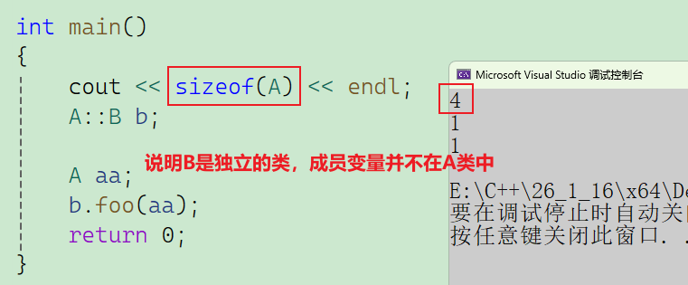

**总结**

| **特性**                | **说明**                                                     |
| ----------------------- | ------------------------------------------------------------ |
| **定义位置**            | 也是个类，只是定义在另一个类的 `{}` 里面。                   |
| **内存计算**            | **不参与**外部类的大小计算 (`sizeof(External)` 不含 `Internal`)。 |
| **访问权限 (内 -> 外)** | **极大**。内部类是外部类的**友元**，可直接访问外部类 `private/static`。 |
| **访问权限 (外 -> 内)** | **无**。外部类不能访问内部类的 `private`。                   |
| **作用域**              | 受外部类限制。外部使用时需要 `Outer::Inner`。                |

> 内部类就是外部类的“私家保姆”——它能随意用主人的东西（友元），但主人不占它的空间（独立内存），且外面的人可能根本不知道它的存在（封装）。

# 十、匿名对象

简单来说，匿名对象就是 **“一次性筷子”** —— 用完即扔，绝不占地。
什么是匿名对象？没有名字的实例化对象。语法： 直接调用构造函数，不接变量名。

- **有名对象：** `Date d1(2024, 1, 1);` （名字叫 `d1`）
- **匿名对象：** `Date(2024, 1, 1);` （没名字，只有类型和参数）


## 10.1 生命周期

这是面试和解题中最关键的区别：

- **有名对象：** 生命周期跟随**作用域**（Scope）。在当前函数或代码块 `{}` 结束时才销毁。
- **匿名对象：** 生命周期仅限**当前这一行**。下一行代码执行前，它就已经死了。

**代码实测**

```C++
class A 
{
public:
    A() { cout << "构造 A" << endl; }
    ~A() { cout << "析构 ~A" << endl; }
};
int main() 
{
    // === 场景 1：有名对象 ===
    cout << "--- 有名对象开始 ---" << endl;
    {
        A a1; 
        cout << "11111" << endl;
    } // a1 在这里（出了花括号）才死
    cout << "--- 有名对象结束 ---" << endl << endl;

    // === 场景 2：匿名对象 ===
    cout << "--- 匿名对象开始 ---" << endl;
    
    A(); // 这一行：创建 -> 构造 -> 这里的语句结束 -> 立即析构
    
    cout << "22222" << endl; // 此时对象早就没了
    cout << "--- 匿名对象结束 ---" << endl;

    return 0;
}
```

**运行结果：**

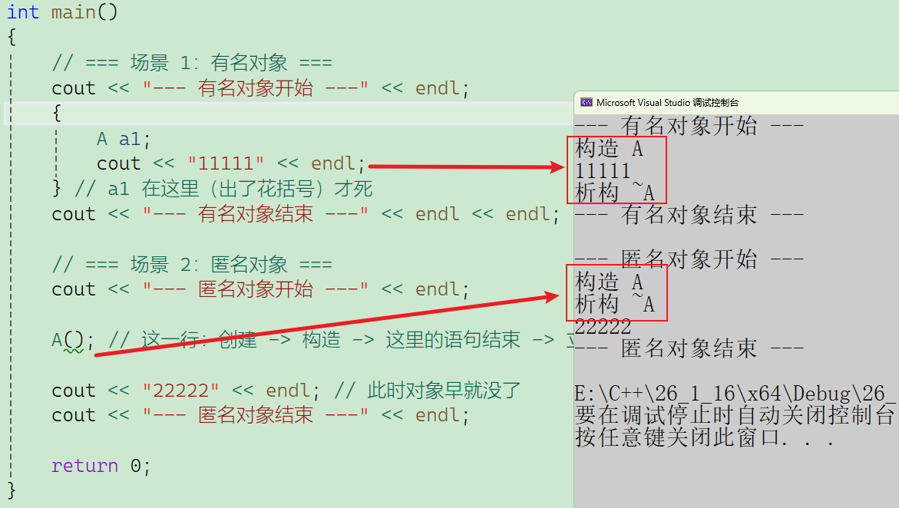

## 10.2 匿名对象有什么用？

你可能会问：“刚生出来就死，这有什么意义？”

其实非常有用，主要用于 “此时此刻我只需要用一次，不想专门起个名字” 的场景。

### 场景 A：LeetCode 刷题 (最常见)

在 LeetCode 中，你经常需要调用一个类的方法。

- **繁琐写法：**
	
	```C++
	Solution s;   // 先定义个对象，起名 s
	s.twoSum(nums, target); // 再调用
	```
- **匿名对象写法 (一行搞定)：**
	```C++
	Solution().twoSum(nums, target); 
	// 创建一个 Solution 的匿名对象，调完函数，马上释放。
	```

### 场景 B：函数传参

假设有一个函数需要接收一个对象：

`void func(Date d);`

- **繁琐写法：**
	
	```C++
	Date d1(2023, 10, 1);
	func(d1); // 为了传参专门定义个变量，以后还没用
	```
	
- **匿名对象写法：**
	
	```C++
	func(Date(2023, 10, 1)); // 传完即焚，干净利落
	```

### 场景 C：函数返回

```C++
Date GetDate() 
{
    // ... 计算 ...
    return Date(2023, 1, 1); // 直接返回一个匿名对象
}
```


## 10.3 匿名对象与引用的关系

这和我们之前讲的 **“隐式类型转换”** 中的引用规则一模一样。

**规则：** 匿名对象具有 **“常性” (const)**，且是临时对象。

```C++
class A {};
int main() 
{
    // 1. 错误写法:A& r = A(); 
    // 非 const 引用不能指向临时对象（匿名对象）。
    // 因为匿名对象马上要死了，你拿个普通引用指向它，万一想修改它，不安全。
    // 2. 正确写法：const 引用
    const A& r = A(); 
    // const 引用会“延长”匿名对象的生命周期！
    // 此时这个匿名对象会一直活到 r 离开作用域为止（变成了和有名对象一样长）。
    return 0;
}
```

## 10.4 总结对比表

| **特性**       | **有名对象 (A a;)**     | **匿名对象 (A();)**            |
| -------------- | ----------------------- | ------------------------------ |
| **是否有名字** | 有                      | 无                             |
| **生命周期**   | 当前作用域 `{}` 结束    | **当前行** (语句分号 `;`) 结束 |
| **主要用途**   | 需要多次使用该对象      | 只需要使用一次 (调方法/传参)   |
| **能否取地址** | 能 (`&a`)               | 不能 (或者是临时地址)          |
| **引用限制**   | `A&` 和 `const A&` 均可 | **只能用 `const A&`**          |

一句话总结：当你只需要用一次某个对象的方法，或者只是拿它来传参时，用匿名对象最省事；但要记得它**“活不过这一行”**。

# 十一、编译器优化

基于 C++ 的编译机制，**对象拷贝时的编译器优化**（通常称为 **Copy Elision**，拷贝省略）是一个非常核心的概念。它的目的是为了减少不必要的构造、拷贝构造和析构过程，从而极大地提高程序运行效率。

在现代编译器（特别是 C++11 及以后，甚至 C++98 的很多实现）中，这种优化非常激进。

- **现代编译器**会为了尽可能提高程序的效率，在不影响正确性的情况下会尽可能减少一些传参和传返回值的过程中可以省略的拷贝。
- **如何优化**C++标准并没有严格规定，各个编译器会根据情况自行处理。当前主流的相对新一点的编译器对于连续一个表达式步骤中的连续拷贝会进行合并优化，有些更新更“激进”的编译器还会进行跨行跨表达式的合并优化。

编译器优化的核心逻辑是：**如果中间产生的临时对象只是为了倒手传输数据，且传输完立刻销毁，那么编译器会直接跳过这个临时对象，直接构造最终目标。**

## 11.1 隐式类型转换

**代码示例**

```C++
class A
{
public:
	A(int a1 = 0, int a2 = 0)
		:_a1(a1)
		, _a2(a2)
	{ cout << "A(int a1 = 0, int a2 = 0)" << endl; }

	A(const A& aa)
		:_a1(aa._a1)
	{ cout << "A(const A& aa)" << endl; }
	~A(){ cout << "~A()" << endl; }
private:
	int _a1 = 1;
	int _a2 = 1;
};

int main()
{
	A aa1 = 1;
	const A& aa2 = 1;
	return 0;
}
```

**理论上的步骤（无优化，C++98 旧标准或关闭优化时）**

1. **构造临时对象：** 用 `1` 调用构造函数 `A(int)`, 生成一个匿名的临时对象。
2. **拷贝构造：** 用这个临时对象，调用拷贝构造函数 `A(const A&)`, 将数据拷贝给 `aa1`。
3. **析构临时对象：** 语句结束，销毁那个临时对象。
4. **隐式转换生成临时对象：** `1` 是 `int`，`aa2` 需要引用的类型是 `A`。编译器发现可以用 `1` 构造一个 `A`，于是隐式调用构造函数 `A(1)`，在栈上生成了一个**临时对象**。
5. **引用绑定：** `aa2` 直接绑定到这个临时对象上。这里**没有发生拷贝构造**，因为引用只是别名，不是创建新对象。
6. **生命周期延长：** 根据 C++ 规则，**被 const 引用绑定的临时对象，其生命周期会延长到与引用的生命周期一致**。也就是 `aa2` 活多久，这个临时对象就活多久。

**如果按这个流程，输出应该是：**

```
A(int a1 = 0, int a2 = 0)  <-- 临时对象构造
A(const A& aa)             <-- aa1 拷贝构造
A(int a1 = 0, int a2 = 0)  <-- aa2 绑定的临时对象构造 (无拷贝)
~A()                       <-- aa2 绑定的对象析构
~A()                       <-- aa1 析构
```

**实际优化的步骤（编译器默认开启）**

编译器通过 **拷贝省略 (Copy Elision)** 技术，直接将 `1` 传递给 `aa1` 的构造函数。**中间的临时对象被“抹除”了，拷贝构造函数完全没被调用。**

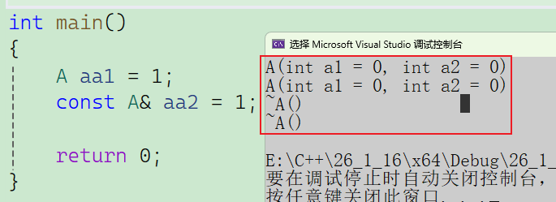


## 11.2 传值传参时的临时对象

当我们将一个临时对象（匿名对象）传值给函数参数时。

**代码示例**

```C++
void func(A x) // 参数是值传递
{ 
    // ...
}

int main() 
{
    func(A(1)); // 传一个匿名对象过去
    return 0;
}
```

**理论步骤：**

1. `A(1)`：主函数中构造一个匿名对象。
2. `func(A x)`：调用拷贝构造，把匿名对象拷贝给形参 `x`。
3. `~A()`：主函数中的匿名对象析构。

**编译器优化后**

编译器直接把形参 `x` 当作那个匿名对象来构造。

- 直接在 `func` 的栈帧上，用 `1` 构造形参 `x`。

- **结果：** 省略了中间的拷贝构造和匿名对象的一次析构，与隐式类型转换优化一致。

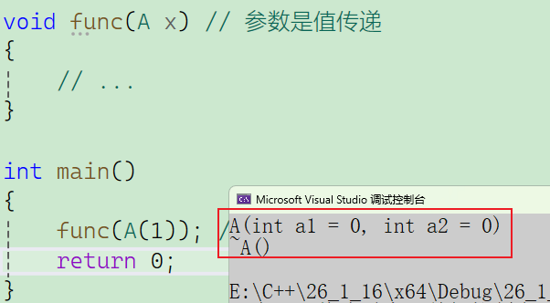

## 11.3 传返回值优化

分为 **RVO (Return Value Optimization)** 和 **NRVO (Named Return Value Optimization)**。

**代码示例**

```C++
A f2()
{
	A aa(1);
	++aa;
	return aa;
}
int main()
{
	f2().Print();
	cout <<"*********"<< endl << endl;
	return 0;
}
```

**如果没有优化**

- **`f2` 栈帧内：** 构造局部变量 `aa`。 (调用构造函数)
- **`return` 时：** 为了把 `aa` 带回 `main`，编译器会在 `main` 的栈帧上创建一个**临时对象**，把 `aa` 的值**拷贝**给这个临时对象。 (调用拷贝构造)
- **`f2` 结束：** 局部变量 `aa` 完成使命，被销毁。 (调用析构函数)
- **`main` 中：** 使用这个**临时对象**调用 `Print()`。
- **语句结束：** 分号 `;` 处，**临时对象**被销毁。 (调用析构函数)

**代价：** 1次构造 + **1次拷贝** + 2次析构。

**编译器优化后**

编译器非常聪明，它发现：

> “你在 `f2` 里造了个 `aa`，唯一的目的就是最后把它送给 `main` 里的那个临时对象。那我为什么要造两份呢？我直接在 `main` 的地盘上造 `aa` 不就行了吗？”

这就是 **NRVO** 的本质：**直接将 `f2` 中的局部变量 `aa`，映射到 `main` 函数中接收返回值的那个匿名临时对象的内存地址上。**

**详细执行流程：**

1. **秘密传参：** `main` 函数在调用 `f2` 之前，先在自己的栈上预留了一块空间（用于存放函数返回的临时对象）。然后，它把这块空间的**地址**悄悄传给了 `f2`。
2. **原地构造：** `f2` 执行 `A aa(1)` 时，它不再自己在栈上开空间了，而是直接利用 `main` 传进来的那个地址，在那块内存上调用构造函数。
	- *此时，`f2` 里的 `aa` 和 `main` 里的返回结果，物理上是同一个东西。*
3. **原地修改：** `++aa` 直接修改那块内存的数据。
4. **零拷贝返回：** 执行 `return aa` 时，不需要做任何拷贝，因为数据本来就已经在 `main` 的地盘上了。
5. **调用 Print：** `main` 拿到结果（其实一直就在它手里），调用 `Print()`。
6. **析构：** 语句 `f2().Print();` 结束，那个对象被析构。

**统计代价： 1 次构造** (直接造在目的地) + **0 次拷贝** + **1 次析构**。

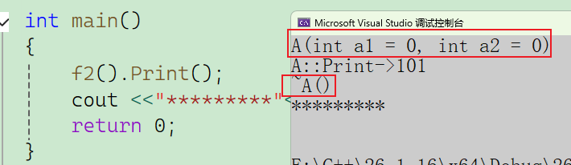

**总结**

| **场景**     | **代码**       | **优化前行为**         | **优化后行为**     |
| ------------ | -------------- | ---------------------- | ------------------ |
| **隐式转换** | `A a = 1;`     | 构造+拷贝+析构         | **直接构造**       |
| **匿名传参** | `func(A(1));`  | 构造+拷贝+析构         | **直接构造形参**   |
| **函数返回** | `A ret = f();` | 构造+拷贝+拷贝+析构... | **直接构造接收者** |


