# 一、内存区域划分

一个由 C/C++编译的程序所占用的内存可分为以下几个部分 ：

- **栈** (`stack`)，存放局部变量和函数的参数（动态生存期），由**编译器自动控制内存的分配与释放**。它的内存分配是连续的，当声明变量时，系统会自动在当前栈区的结尾处分配内存，只要剩余空间大于申请空间，系统将提供内存，否则将给出异常提示。栈是**从高地址向低地址**扩展，是一片连续的空间，遵循**先进后出** `FILO` 原则，不会产生碎片，读写效率高，但**空间通常比较小**。

- **堆** (heap)，管理持久动态内存（由 `new` 或 `malloc` 申请的内存），由**用户负责内存的分配与释放**（`delete` 或 `free`），如果没有释放，程序结束后，系统会自动回收。堆是从低地址向高地址扩展，类似于链表结构，遵循**先进先出** `FIFO` 原则，使用方便，空间可以很大，**但容易产生碎片**，读写速度较慢。堆空间一般是在程序**运行时分配**，**不一定是连续的空间**，由不同区域的内存块通过指针链接起来。一旦某节点从链中断开，我们要人为的把断开的节点从内存中释放。通常操作系统中有一个记录空闲内存地址的链表，当系统收到 `new`/`malloc` 的申请时，会遍历该链表，寻找第一个空间大于所申请空间的堆结点，然后将该结点从空闲结点链表中删除，并将该结点的空间分配给程序，另外，对于大多数系统，会在这块内存空间中的首地址处记录本次分配的大小，这样，代码中的 `delete`/`free` 语句才能正确的释放本内存空间。使用堆空间时，需要注意内存泄漏，即没有释放应该释放的内存空间。

- **全局区（静态区）**，存放**全局变量和静态变量**，在编译时分配。在以前的 C 语言中，全局变量又分为初始化的和未初始化的，在 C++里面没有这个区分了，他们共同占用同一块内存区。

- **常量区**，存放**常量**，编译时分配。

- **代码区，**存放函数体的**二进制代码**，编译时分配。

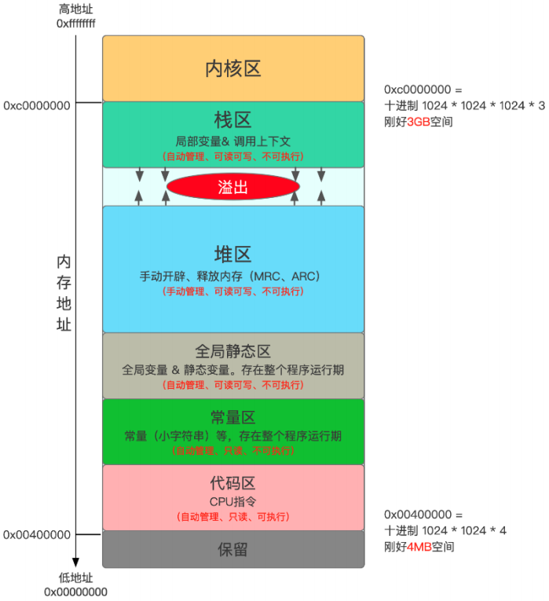

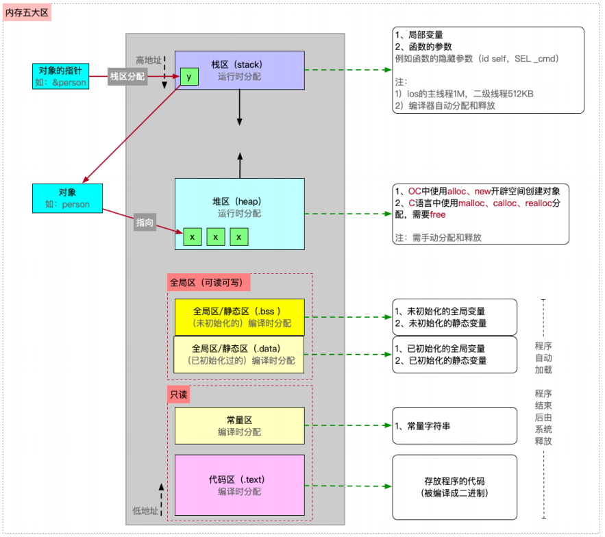

一个例子：

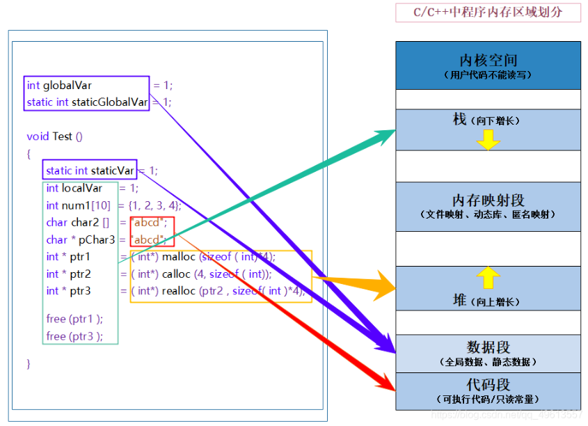

**总结：**

| **区域名称**          | **描述**       | **存储内容**                                                 | **增长方向**            | **管理方式**           |
| --------------------- | -------------- | ------------------------------------------------------------ | ----------------------- | ---------------------- |
| **内核空间 (Kernel)** | 操作系统驻留区 | 用户代码不可直接读写。                                       | N/A                     | OS 管理                |
| **栈 (Stack)**        | 函数调用栈     | 局部变量、函数参数、返回地址。                               | **向低地址增长** (向下) | 编译器自动分配/释放    |
| **堆 (Heap)**         | 动态内存区     | 程序员手动申请的内存 (`new`/`malloc`)。                      | **向高地址增长** (向上) | 程序员手动管理         |
| **数据段 (Data)**     | 静态存储区     | 全局变量、静态变量 (`static`)。分为已初始化 (`.data`) 和未初始化 (`.bss`)。 | N/A                     | 程序启动分配，结束释放 |
| **代码段 (Code)**     | 常量与指令区   | 编译后的机器指令、只读常量 (如字符串字面量)。                | N/A                     | 只读                   |

# 二、malloc / calloc / realloc / free

```c++
void Test()
{
	// 1.malloc/calloc/realloc的区别是什么？
	int* p2 = (int*)calloc(4, sizeof(int));
	int* p3 = (int*)realloc(p2, sizeof(int) * 10);
	
	// 这里需要free(p2)吗？
	free(p3);
}
```

**详细原理解析：**`realloc(p2, new_size)` 的工作机制决定了它会接管 `p2` 的“生杀大权”。它只有两种工作模式，但无论哪种，你都不能手动去 `free` `p2`（除非 `realloc` 失败）。

**情况一：原地扩容 (In-place Expansion)**

如果 `p2` 指向的内存块后面有足够的空闲空间：`realloc` 直接向后扩展内存。返回的地址 `p3` **等于** `p2`。此时 `p2` 和 `p3` 指向同一块地。你最后 `free(p3)` 已经把这块地退了。如果你再 `free(p2)`，就是把同一块地退两次（`Double Free`），程序崩溃。

**情况二：异地扩容 (Relocation) —— 最常见情况**

如果 `p2` 后面被占用了，没有足够的连续空间：`realloc` 会找一块新的、足够大的地盘（地址是 `p3`）。它会自动把 `p2` 里的旧数据 **拷贝 (memcpy)** 到 `p3`。且`realloc` 会自动帮你调用 `free(p2)`。结果`p2` 现在是一个**悬空指针 (Dangling Pointer)**，它指向的内存已经被系统回收了。如果你再手动 `free(p2)`，你在释放一块已经被释放的内存，程序崩溃。

## `malloc`, `calloc`, `realloc` 的区别

这三个函数都用于在 **堆 (Heap)** 上进行动态内存分配，但在参数、初始化行为和用途上有明显的区别。

### (1) `malloc`

- **函数原型**：`void* malloc(size_t size);`
- **行为**：分配指定字节数 `size` 的内存空间。
- **初始化**：**不初始化**。内存中的内容是随机的（垃圾值）。
- **效率**：最快，因为它不负责清零。
- **场景**：当你只关心申请空间，后续会立即覆盖写入数据时使用。

### (2) `calloc`

- **函数原型**：`void* calloc(size_t num, size_t size);`
- **行为**：为 `num` 个元素、每个元素 `size` 字节的数组分配空间（总大小 = `num * size`）。
- **初始化**：**自动初始化为 0**。会将分配的**每个比特都置为 0**。
- **效率**：比 `malloc` 稍慢，因为多了一步清零操作（底层类似 `memset`）。
- **场景**：需要申请数组，或者为了安全起见希望内存初始状态干净（如指针初始化为 `NULL`，整数初始化为 `0`）。

### (3) `realloc`

- **函数原型**：`void* realloc(void* ptr, size_t new_size);`
- **行为**：调整之前分配的内存块（`ptr` 指向的）的大小为 `new_size`。
- **工作机制**：
	1. **原地扩容**：如果原内存块后面有足够的空闲空间，直接向后扩展，返回原指针。
	2. **异地扩容**：如果后面空间不足，它会开辟一块新的内存，把旧数据**拷贝**过去，自动**释放**旧内存，并返回新指针。
- **特殊情况**：
	- 如果 `ptr` 为 `NULL`，相当于 `malloc(new_size)`。
	- 如果 `new_size` 为 `0`，相当于 `free(ptr)`。

**一表总结**

| **函数**    | **参数格式**               | **是否初始化** | **主要用途**         |
| ----------- | -------------------------- | -------------- | -------------------- |
| **malloc**  | `size` (总字节)            | (随机值)       | 高效申请，后续覆盖   |
| **calloc**  | `num`, `size` (个数, 单大) | (全0)          | 申请数组，需要默认值 |
| **realloc** | `ptr`, `new_size`          | (新区域随机)   | 扩容/缩容            |

## 三、new / delete

C语言内存管理方式在C++中可以继续使用，但有些地方就无能为力（比如类类型，C只能做到只申请和释放，但类类型需要调用构造和析构），而且使用起来比较麻烦，因此C++又提出了自己的内存管理方式：**通过new和delete操作符进行动态内存管理**。

## 3.1 内置类型

```c++
void Test()
{
	// 动态申请一个int类型的空间
	int* ptr1 = new int;
	// 动态申请一个int类型的空间并初始化为10
	int* ptr2 = new int(10);
	// 动态申请10个int类型的空间
	int* ptr3 = new int[10];
	// 动态申请10个int类型的空间并部分初始化，其余默认为0
	int* ptr4 = new int[10] {1,2,3,4,5};
	
	delete ptr1;
	delete ptr2;
	delete[] ptr3;
	delete[] ptr4;
}
```

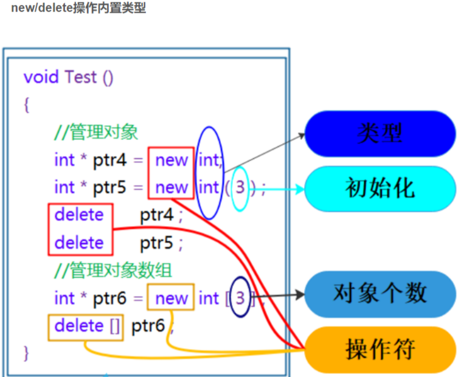

>注意：申请和释放单个元素的空间，使用**new**和**delete**操作符，申请和释放连续的空间，使用 **new[]** 和 **delete[]**，注意：匹配起来使用。

## 3.2 类类型 / 自定义类型

```c++
struct ListNode
{
	int val;
	ListNode* next;
	ListNode(int x)
		:val(x)
		, next(nullptr)
	{ }
};
int main()
{
	ListNode* n1 = new ListNode(1);
	ListNode* n2 = new ListNode(1);
	ListNode* n3 = new ListNode(1);
	ListNode* n4 = new ListNode(1);
	n1->next = n2;
	n2->next = n3;
	n3->next = n4;
	// 释放链表内存 必须遍历释放，不能只 delete n1，否则后面三个节点会内存泄漏
	ListNode* cur = n1;
	cur = n1;
	while (cur != nullptr)
	{
		ListNode* nextNode = cur->next; // 先保存下一个节点的地址
		delete cur;                     // 释放当前节点
		cur = nextNode;                 // 移动到下一个
	}
	// 指针置空，防止悬空指针
	n1 = n2 = n3 = n4 = nullptr;
	return 0;
}
```

>**注意：在申请自定义类型的空间时，new会调用构造函数，delete会调用析构函数，而malloc与free不会**。

```c++
class A
{
public:
	A(int a1 = 0, int a2 = 0)
		:_a1(a1)
		, _a2(a2)
	{ cout << "A(int a1 = 0, int a2 = 0)" << endl; }
	A(const A& aa)
		:_a1(aa._a1)
	{ cout << "A(const A& aa)" << endl;}
	~A()
	{ cout << "~A()" << endl;}
private:
	int _a1 = 1;
	int _a2 = 1;
};

int main()
{
	// 1. 标准的单个对象 new
	// 调用构造函数 A(1, 0)
	A* p1 = new A(1);
	// 调用构造函数 A(2, 2)
	A* p2 = new A(2, 2);
	cout << endl;

	// 准备三个已存在的对象
	A aa1(1, 1);
	A aa2(2, 2);
	A aa3(3, 3);
	// 2. new 对象数组 - 使用【拷贝构造】初始化
	// 语法：new A[3]{对象1, 对象2, 对象3}
	// 这里的数组元素是利用 aa1, aa2, aa3 【拷贝构造】出来的
	// 结果：调用 3 次拷贝构造函数
	A* p3 = new A[3]{ aa1, aa2, aa3 };
	cout << endl;

	// 3. new 对象数组 - 使用【匿名对象】初始化
	// 语法：手动构造 3 个匿名对象 A(1,1)...
	// 这里的逻辑是：先构造匿名对象，再拷贝构造给数组元素（编译器会优化掉拷贝，直接构造）
	A* p4 = new A[3]{ A(1,1), A(2,2), A(3,3) };
	cout << endl;

	// 4. new 对象数组 - 使用【隐式类型转换/列表初始化】 (C++11 最推荐写法)
	// 语法：{1,1} 会自动匹配构造函数 A(int, int)
	// 这里的 {1,1} 等价于 A(1,1)，但这是一种隐式类型转换
	// 结果：编译器直接调用构造函数初始化数组里的每个元素，代码最简洁
	A* p5 = new A[3]{ {1,1}, {2,2}, {3,3} };
	cout << endl;

	// 内存释放部分 (不要忘记释放数组指针需要用 delete[])
	delete p1;
	delete p2;
	delete[] p3; // 释放 p3 指向的数组，会调用 3 次析构
	delete[] p4; // 释放 p4 指向的数组，会调用 3 次析构
	delete[] p5; // 释放 p5 指向的数组，会调用 3 次析构
	return 0;
}
```

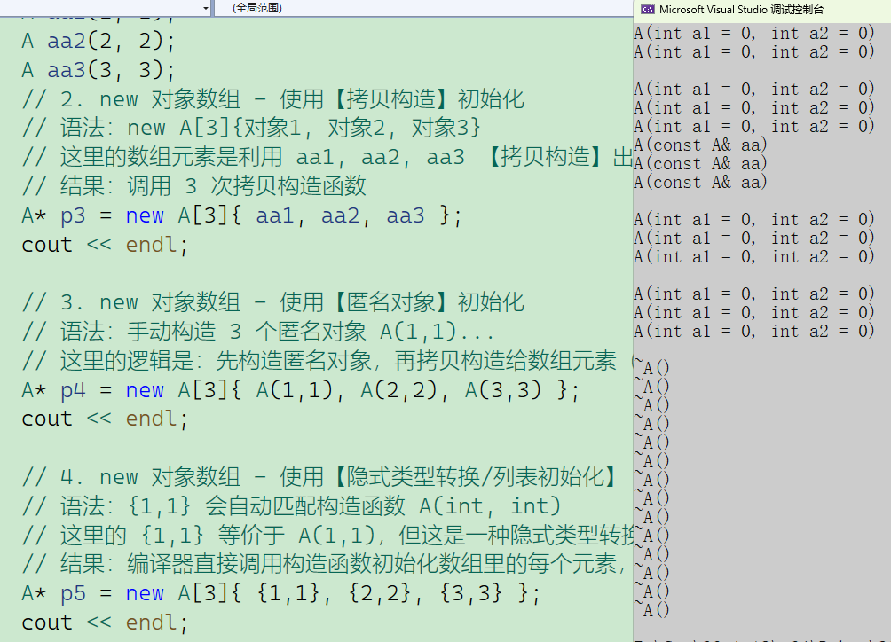

那一定会申请成功吗？很明显不一定，在面向对象编程中又抛出异常这个概念，这里简单了解一下，后续再深入了解。

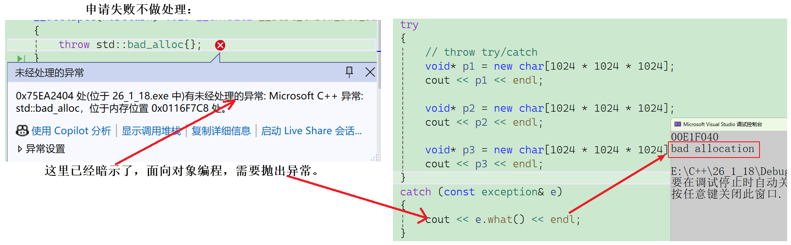

> 这里申请的是虚拟内存，经过测试：
> `x86`，最多可以申请**1899**左右MB。
> `x64`，最多可以申请**22038**左右MB

# 四、operator new / operator delete

可以把标准库中的 `operator new` 理解为对 `malloc` 的一层**面向对象封装**。它主要多了两件事：

1. 处理内存分配失败（抛出 `std::bad_alloc` 异常）。
2. 调用 `new_handler`（如果设置了的话）尝试清理内存。

```c++
/*
operator new：该函数实际通过malloc来申请空间，当malloc申请空间成功时直接返回；申请空间
失败，尝试执行空间不足应对措施，如果改应对措施用户设置了，则继续申请，否则抛异常。
*/
void* __CRTDECL operator new(size_t size) _THROW1(_STD bad_alloc)
{
	// try to allocate size bytes
	void* p;
	while ((p = malloc(size)) == 0)
	{
		if (_callnewh(size) == 0)
		{
			// report no memory
			// 如果申请内存失败了，这里会抛出bad_alloc 类型异常
			static const std::bad_alloc nomem;
			_RAISE(nomem);
		}
	}
	return (p);
}
```

当你写 `delete p;` 时，你是在对编译器下达指令。它负责协调整个清理流程：先拆房子（析构），再把地皮还给开发商（释放内存）。

**`operator delete` (函数)**：它的唯一职责是：**归还裸内存（Raw Memory）**。它完全不懂什么叫“对象”，也不懂什么叫“析构函数”，它只知道手里有一块地皮（`void*`），需要把它还回去（通常是还给堆）。

标准库提供的默认全局 `operator delete` 其实非常简单，几乎就是对 C 语言 `free` 的封装：

```c++
/*
operator delete: 该函数最终是通过free来释放空间的
*/
void operator delete(void* pUserData)
{
	_CrtMemBlockHeader* pHead;
	RTCCALLBACK(_RTC_Free_hook, (pUserData, 0));
	if (pUserData == NULL)
		return;
	_mlock(_HEAP_LOCK); /* block other threads */
	__TRY
		/* get a pointer to memory block header */
		pHead = pHdr(pUserData);
		/* verify block type */
		_ASSERTE(_BLOCK_TYPE_IS_VALID(pHead->nBlockUse));
		_free_dbg(pUserData, pHead->nBlockUse);
	__FINALLY
		_munlock(_HEAP_LOCK); /* release other threads */
	__END_TRY_FINALLY
	
	return;
}
```

> `free`实现：`#define free(p) _free_dbg(p, _NORMAL_BLOCK)`

既然系统默认的 `operator new` 也是调 `malloc`，我们为什么有时候要自己重载（重写）它？

主要有两个原因：**效率** 和 **调试**。

**(1) 专属内存池 (Memory Pool)**

默认的 `malloc` 是通用的，要处理各种大小的内存申请，效率中等。如果你的类 `A` 需要频繁创建和销毁，你可以给 `A` 写一个专属的 `operator new`，从一个预先分配好的大内存块（内存池）里切片，这样速度极快，且没有内存碎片。

**(2) 内存泄漏检测 (Debug)**

你可以重载全局的 `operator new`，在申请内存时记录文件名、行号和大小。在程序结束时，检查哪些记录没被 `delete`，从而定位内存泄漏。

**总结**

| **名称**              | **类型**          | **能否重载** | **职责**                                    |
| --------------------- | ----------------- | ------------ | ------------------------------------------- |
| **`new`**             | **关键字/操作符** | **不能**     | 总指挥：1.调 `operator new` 2.调构造函数    |
| **`operator new`**    | **函数**          | **能**       | 搬运工：只负责申请内存 (底层调 `malloc`)    |
| **`delete`**          | **关键字/操作符** | **不能**     | 总指挥：1.调析构函数 2.调 `operator delete` |
| **`operator delete`** | **函数**          | **能**       | 搬运工：只负责释放内存 (底层调 `free`)      |

# 五、new / delete实现原理

## 5.1 内置类型

如果申请的是内置类型的空间，`new`和`malloc`，`delete`和`free`基本类似，不同的地方是：`new`/`delete`申请和释放的是单个元素的空间，`new[]`和`delete[]`申请的是连续空间，而且`new`在申请空间失败时会抛异常，`malloc`会返回`NULL`。

## 5.2 自定义类型

**new的原理：**先调用operator new函数申请空间，在申请的空间上执行构造函数，完成对象的构造。

那么new是怎么既申请内存，又调用构造函数，其实是编译器底层转换成汇编时做的动作，将关键字加入汇编指令中：

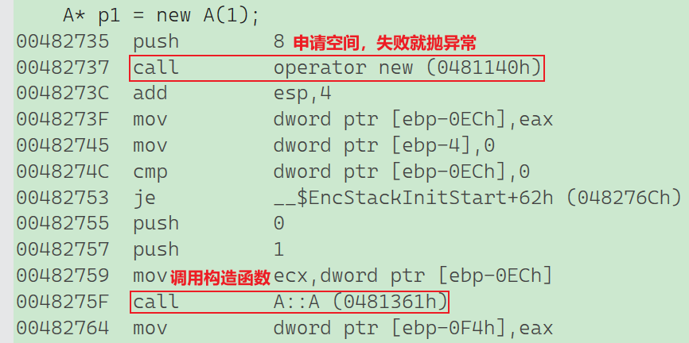

**delete的原理：**首先在空间上执行析构函数，完成对象中资源的清理工作，调用operator delete函数释放对象的空间

>这里也不难理解，首先你得把自定义类型进行析构，因为你自定义类型里也可能有自己申请的空间

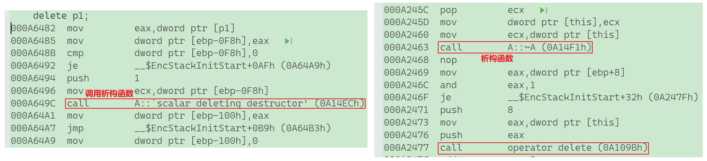

**new[]的原理：**调用`operator new[]`函数，在`operator new[]`中实际调用`operator new`函数完成`N`个对象空间的申请，在申请的空间上执行`N`次构造函数

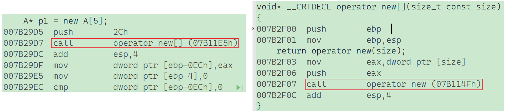

**delete[]的原理：**在释放的对象空间上执行**N次析构函数**，完成`N`个对象中资源的清理调用`operator delete[]`释放空间，实际在`operator delete[]`中调用`operator delete`来释放空间

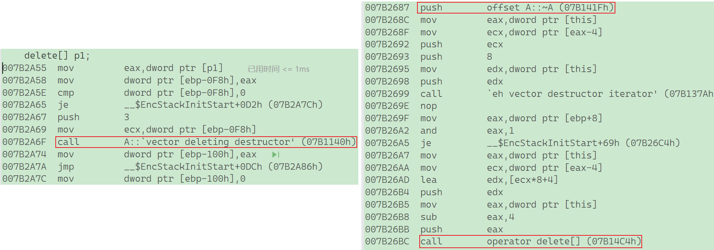

内置类型混用`new free`，完全没泄露问题，因为内置类型析构的话，编译器也不管。但不建议这么写！

如果是自定义类型呢？这里会少调用一次析构函数，有内存泄露风险（自定义类型中可能有申请的资源）。

## 5.3 一个例子

```c++
class A
{
public:
	A(int a1 = 0, int a2 = 0)
		:_a1(a1)
		, _a2(a2)
	{ cout << "A(int a1 = 0, int a2 = 0)" << endl; }
	A(const A& aa)
		:_a1(aa._a1)
	{ cout << "A(const A& aa)" << endl;}
	~A()
	{ cout << "~A()" << endl;}
private:
	int _a1 = 1;
	int _a2 = 1;
};
class B
{
private:
	int _b1 = 2;
	int _b2 = 2;
};
int main()
{
	B* p2 = new B[10];
	delete p2;
	A* p3 = new A[10];
	delete p3;
	return 0;
}
```

结果是这样的：

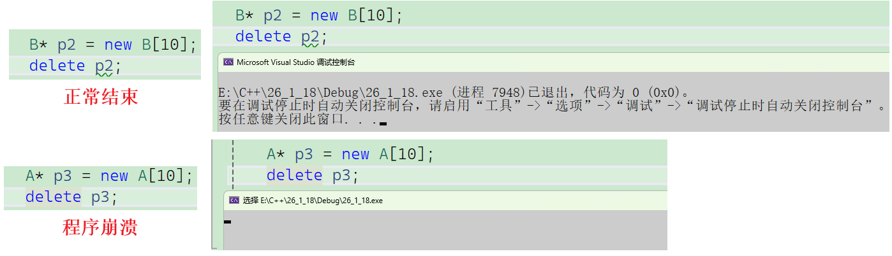

为什么都是内置类型的类，释放方式也是一致，但一个可以，另一个不可以呢？

首先`A`、`B`都是一样大的，都是八个字节，那么申请的空间应该都是八十字节：

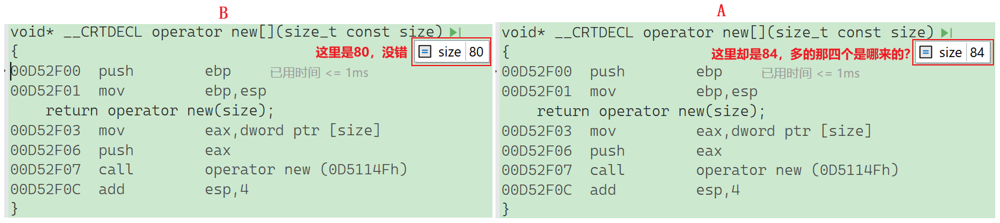

通过汇编可以清楚看见，这里`A`类型数组却是84字节，这是为啥？

编译器面对这种类型，会在头上多开四个字节，这四个字节用来存储元素个数。

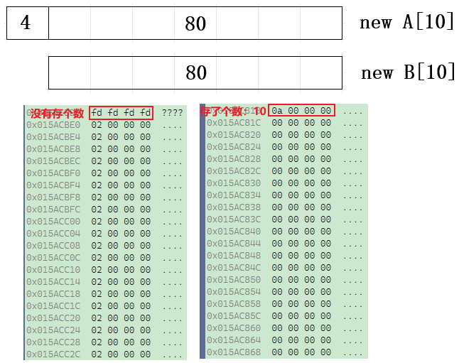

这里也就能看懂为什么A会崩溃了，因为**释放内存的位置不对**，A多申请了4个字节，但是**释放内存时并没有管这四个字节**，那为什么**A要多申请，B不多申请**呢？因为**编译器优化**了。根本原因是在于**B没有写析构函数**，因为`new[]`对应的`delete[]`中的`[]`，实际上是让编译器往上偏移四个字节，**拿到个数**，**开始调用总个数个析构函数**，但是**B没有写析构函数**，编译器认为不析构也可以，**因为没什么资源**，**内置类型编译器自己也不管**，所以就**一次性直接释放80个字节的资源**。

所以，**一定要匹配使用，不要错配**，因为对了也有可能是碰对的。

# 六、malloc free / new delete区别与联系

虽然它们都是用来在堆上申请内存的，但它们的“阶级属性”完全不同：**`malloc/free` 是 C 语言的库函数，而 `new/delete` 是 C++ 的操作符。**

## 6.1 区别总览

| **特性**     | **malloc / free**                        | **new / delete**                        |
| ------------ | ---------------------------------------- | --------------------------------------- |
| **本质属性** | **库函数** (需要头文件 `<stdlib.h>`)     | **操作符 / 关键字** (编译器原生支持)    |
| **内存位置** | 堆 (Heap)                                | 自由存储区 (Free Store，通常也是堆)     |
| **内存大小** | 需要**手动计算**字节数 (`sizeof(T) * N`) | **自动计算** (编译器根据类型推断)       |
| **返回类型** | `void*` (需要强转)                       | `Type*` (类型安全，无需强转)            |
| **初始化**   | **不调用构造函数** (只给内存)            | **自动调用构造函数** (给内存+初始化)    |
| **清理资源** | **不调用析构函数**                       | **自动调用析构函数**                    |
| **分配失败** | 返回 `NULL`                              | 抛出 `std::bad_alloc` 异常              |
| **数组处理** | 只是字节数的区别                         | 有专门的 `new[]` 和 `delete[]`          |
| **扩容机制** | 支持 `realloc`                           | 不支持直接扩容 (需手动 new新+拷旧+删旧) |
| **可重载性** | 不可重载                                 | **可重载** (`operator new/delete`)      |

## 6.2 深度差异解析

**1. 构造与析构 (本质区别)**

这是 C++ 对象生存的根本。

- **`malloc/free`**：是“纯物理”层面的操作。它只管把这一块内存划给你，里面是什么它不管（通常是随机垃圾值）。它不懂什么叫“对象”。
- **`new/delete`**：是“逻辑+物理”层面的操作。
	- `new` = `operator new` (申请内存) + **`placement new` (调用构造)**。
	- `delete` = **调用析构** + `operator delete` (释放内存)。

**代码对比：**

```C++
class A 
{
public:
    A() { cout << "A构造" << endl; }
    ~A() { cout << "~A析构" << endl; }
};

void Test() 
{
    // 【malloc】：只是挖了一块地，房子没盖
    // 输出：(无输出)
    A* p1 = (A*)malloc(sizeof(A)); 
    free(p1);
    // 【new】：挖了地，还把房子盖好了
    // 输出：A构造 -> ~A析构
    A* p2 = new A;
    delete p2;
}
```

**2. 类型安全与计算**

- **`malloc`** 返回 `void*`，这是不安全的。你需要显式地强转 `(int*)malloc(...)`。如果你算错了 `sizeof` 或者转错了类型，编译器很难发现。
- **`new`** 是类型安全的。`new A` 明确告诉编译器我要一个 `A`，编译器自动算出 `sizeof(A)`，并返回 `A*`。

**3. 失败处理机制**

- **`malloc`** 失败返回 `NULL`。写 C 语言代码时，标准的做法是每次 `malloc` 后都要 `if (p == NULL)` 判断。
- **`new`** 失败抛出 `std::bad_alloc` 异常。在 C++ 中，我们通常不检查 `new` 的返回值是否为空（因为它一般不返空），而是去捕获异常。

## 6.3 共同点 (关联性)

不要觉得它们是死对头，其实它们有血缘关系。

1. **都管理动态内存**：都在堆上分配，都需要手动释放。

2. `new` 的底层通常是 `malloc`：在 C++ 的默认实现中，`operator new` 函数内部基本上就是调用了 `malloc` 来申请原始内存的。`new` 是站在 `malloc` 肩膀上的高级封装。

## 6.4 经典误区

**千万不要混用！千万不要混用！**

- `new` 出来的，必须用 `delete`。
- `malloc` 出来的，必须用 `free`。
- `new[]` 出来的，必须用 `delete[]`。

**为什么不能混用？**

1. **`new` + `free`**：
	- 内存虽然还给系统了，但是**析构函数没执行**。
	- 如果对象内部打开了文件、连接了数据库或申请了其他堆内存，这些资源就全部泄露了。
2. **`malloc` + `delete`**：
	- `delete` 会尝试调用析构函数。如果对象内部依赖某些构造函数初始化过的状态（而 `malloc` 出来的对象是随机值），析构函数可能会崩溃。
	- 对于 `new[]` 和 `delete` 的混用，还会涉及到“数组大小记录 `cookie`”的问题，导致释放位置偏移，直接 `Crash`，参考上面5.3。

# 七、定位new

**定位 new (Placement New)** 是 C++ 赋予程序员的一项“上帝特权”：它允许你在**已经分配好的内存**（栈上或堆上）上构建对象。

简单来说：普通的 `new` 是“买地皮 + 盖房子”；**定位 `new` 是“在你自家的地皮上盖房子”。**

## 7.1 应用场景

你可能会问：*“直接 `new` 不好吗？为什么要搞这么麻烦？”*

主要为了**极致的性能**和**特殊的内存要求**：

1. **内存池 (Memory Pool)**：
	- 频繁申请/释放小内存（`new`/`delete`）会导致堆碎片，且系统调用开销大。
	- **优化方案**：一次性申请一大块内存（池子）。每次需要对象时，用 **Placement New** 在池子里切一块出来初始化。用完了不释放内存，只是析构对象，下次循环利用。
2. **STL 容器底层**：
	- `std::vector` 的 `reserve()` 分配了空间，但没有创建对象。当你 `push_back()` 时，它就是在那个预留空间上用 **Placement New** 构造元素的。
3. **硬件交互**：
	- 在嵌入式开发中，特定的硬件寄存器映射在固定的内存地址。你可以用 Placement New 强行在这个地址上构造一个对象来管理它。


## 7.2 语法格式

使用定位 new 需要包含头文件 `<new>`。

```C++
// 语法：
// new (地址指针) 类型(构造参数...);
char buffer[1024]; // 假设这是我们准备好的一块内存
A* p = new (buffer) A(10); // 在 buffer 的首地址上构造一个 A 对象
```

## 7.3 使用流程

使用 `Placement New` 分为三步走：**申请原始内存 -> 构造对象 -> 显式析构**。

**代码实战详解**


```C++
class A
{
public:
	A(int a = 0)
		: _a(a)
	{ cout << "A():" << this << endl; }
	~A() { cout << "~A():" << this << endl; }
private:
	int _a;
};

int main()
{
	// 第一部分：标准的 new / delete 使用
	// 这是我们在日常开发中使用的写法，编译器帮我们自动处理了细节。
	// 1. 申请内存 + 2. 调用构造函数
	// new 关键字会自动先调用 operator new 申请空间，再调用构造函数初始化
	A* p1 = new A(1);
	
	// 3. 调用析构函数 + 4. 释放内存
	// delete 关键字会自动先调用析构函数清理资源，再调用 operator delete 释放空间
	delete p1;

	cout << "-------------------------------------------" << endl;

	// 第二部分：手动模拟 new / delete 的全过程 (底层原理)
	// 这里将 new/delete 的动作拆解成了“内存”和“构造/析构”两个独立步骤。

	// --- 步骤 1：只申请内存 (Allocate) ---
	// 调用全局函数 operator new (底层通常是 malloc)。
	// 此时 p2 指向一块 sizeof(A) 大小的内存，但这里面是随机值（垃圾值）。
	// 注意：此时【没有】调用构造函数。
	A* p2 = (A*)operator new(sizeof(A));

	// --- 步骤 2：在已有内存上构造对象 (Construct) ---
	// 使用【定位 new (Placement New)】表达式。
	// 语法：new(地址) 类型(参数);
	// 它的作用是：不申请新内存，而是指定在 p2 指向的这块内存上执行 A 的构造函数。
	new(p2)A(1);

	// --- 此时 p2 已经是一个完整的、合法的对象了，可以正常使用 ---

	// --- 步骤 3：显式调用析构函数 (Destruct) ---
	// 因为内存是手动管理的，不能直接 delete p2（否则会重复调用 operator delete 且可能遗漏析构细节，或者如果在这里直接 operator delete 则会跳过析构）。
	// 我们必须手动调用析构函数来清理对象内部的资源。
	// 注意：析构后，对象“死”了，但内存还在。
	p2->~A();

	// --- 步骤 4：只释放内存 (Deallocate) ---
	// 调用全局函数 operator delete (底层通常是 free)。
	// 归还这块内存给操作系统。
	operator delete(p2);
	return 0;
}
```

## 7.4 易错点

1. 必须要手动调用析构函数 (`p->~T()`)：因为 `Placement New` 只是借用了内存，如果你对它使用 `delete p`，编译器会试图释放这块内存。

	- 如果这块内存是**栈**上的（如 `char buf[100]`），`delete` 会导致程序直接崩溃。
	- 如果这块内存是**内存池**里的，`delete` 会破坏内存池的结构。

2. 内存对齐 (Alignment)：如果你的 `buffer` 地址没有对齐（比如 `int` 需要 4 字节对齐，而你传了个奇数地址），可能会导致硬件异常或效率降低。通常用 `malloc` 或 `std::allocator` 出来的内存都是对齐好的。

**总结对比**

| **特性**     | **普通 new (new A)**     | **定位 new (new(p) A)**    |
| ------------ | ------------------------ | -------------------------- |
| **内存申请** | **申请** (调用 `malloc`) | **不申请** (使用现成指针)  |
| **构造函数** | 调用                     | 调用                       |
| **释放方式** | `delete p`               | **必须手动 `p->~A()`**     |
| **主要用途** | 通用对象创建             | 内存池、高性能库、硬件映射 |