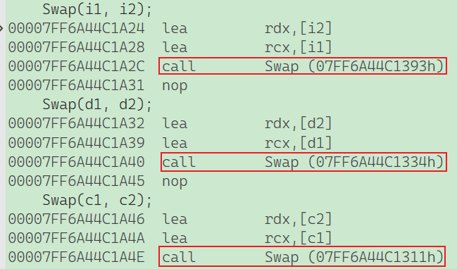
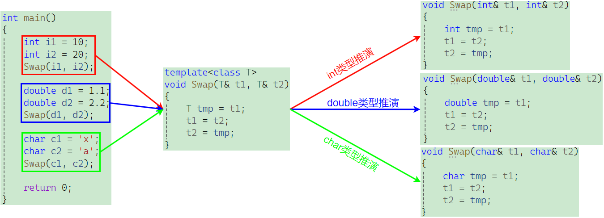
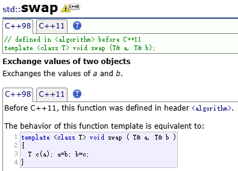
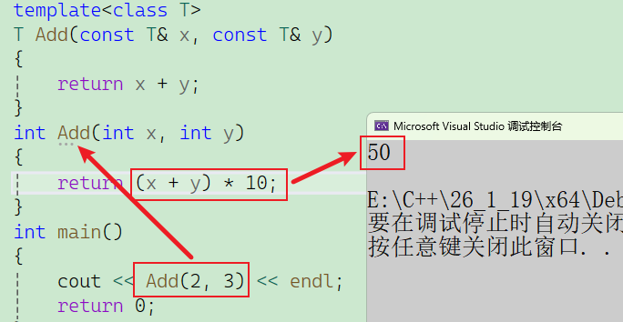
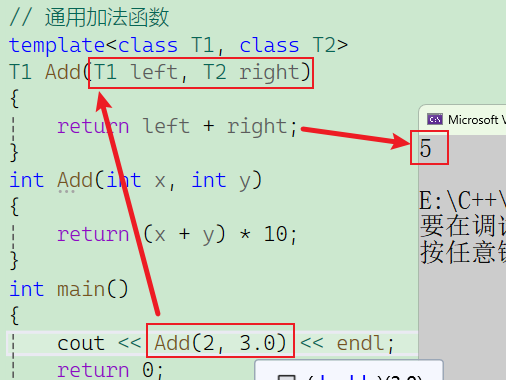
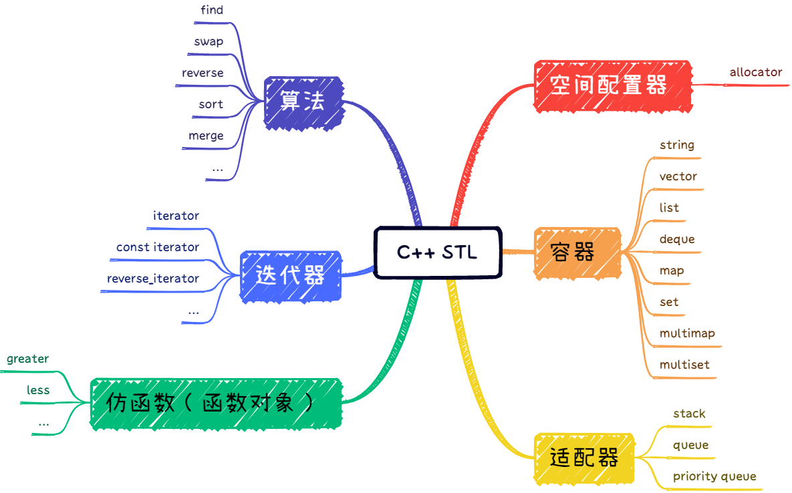

# 一、泛型编程

在没有模板之前，如果我们想实现一个通用的交换函数 `Swap`，必须通过**函数重载**来实现。例如，为了支持 `int`、`double` 和 `char`，我们需要写三份代码完全一样、仅类型不同的函数：

```C++
void Swap(int& left, int& right) { ... }
void Swap(double& left, double& right) { ... }
void Swap(char& left, char& right) { ... }
```

这种做法有两个明显的缺点：

1. **代码复用率低**：一旦有新类型出现，就需要手动增加对应的函数。
2. **可维护性低**：代码逻辑重复，一个地方出错可能导致所有重载版本都出错。

为了解决这个问题，C++ 引入了**泛型编程**，即编写与类型无关的通用代码。模板就是泛型编程的基础。

模板又分为**函数模板**和**类模板**。

# 二、函数模板

**函数模板代表了一个函数家族，它与类型无关。在使用时被参数化，根据实参类型产生函数的特定类型版本。**

## 2.1 概念及原理

语法如下：

```C++
//格式
template<typename T1, typename T2,......,typename Tn>
返回值类型 函数名(参数列表){}
//语法
template<typename T> // 也可以用 template<class T>
void Swap(T& left, T& right) 
{
    T temp = left;
    left = right;
    right = temp;
}
```

`typename` 是定义模板参数的关键字，也可以使用 `class`，但**不能**使用 `struct`。



可以看见经过模板推演后，会根据传进去的不同参数生成相应的函数，而不是同一个函数，只是同一个模板，**函数模板是一个蓝图，它本身并不是函数，是编译器用使用方式产生特定具体类型函数的模具。所以其实模板就是将本来应该我们做的重复的事情交给了编译器**。原理类似于这样：



**在编译器编译阶段**，对于模板函数的使用，**编译器需要根据传入的实参类型来推演生成对应类型的函数**以供调用。比如：当用**double类型使用函数模板**时，编译器通过**对实参类型的推演**，将**T确定为double类型**，然后产生一份**专门处理double类型的代码**，对于字符类型也是如此。

此外，这个`swap`函数有一个官方库的函数，也可以直接使用，就不用手写了，它所在的头文件是`<utility>`，不过也不用包头文件，编译器会间接包，如果报错，再写上就好了。



## 2.2 模板实例化

 模版的实例化：用函数模版生成对应的函数。

### 2.2.1 推导实例化

这是最常见的形式，当你使用模板时，如果没做特殊说明，编译器会自动根据你的调用情况进行实例化。

**函数模板的推导实例化**： 编译器通过 **模板实参推演** 来决定类型。

```C++
template <class T>
void func(T& t) { /* ... */ }
int main() 
{
    func(10); // 编译器推导 T 为 int，自动生成 void func(int) 的代码
    func(2.5); // 编译器推导 T 为 double，自动生成 void func(double) 的代码
}
```
```c++
template<class T>
T Add(const T& left, const T& right)
{
	return left + right;
}
int main()
{
	int a1 = 10, a2 = 20;
	double d1 = 10.0, d2 = 20.0;
	Add(a1, d1);
	return 0;
}
```

该语句**不能通过编译**，因为在编译期间，当编译器看到该实例化时，需要推演其实参类型**通过实参a1将T推演为int**，通过**实参d1将T推演为double类型**，但模板参数列表中**只有一个T**，编译器**无法确定此处到底该将T确定为int 或者 double类型**而报错，这个时候需要我们去手动进行控制。注意：在模板中，编译器**一般不会进行类型转换**操作，因为一旦转化出问题，编译器就需要背黑锅。

### 2.2.2 显式实例化

这部分需要强制编译器生成代码，或者为了减少编译时间（防止在每个 **cpp文件** 里都重复生成相同的模板实例），我们会使用显式实例化。

**指令语法**：**在函数名后的<>中指定模板参数的实际类型**

```C++
int main()
{
    int a = 10;
    double b = 20.0;
    // 显式实例化
    Add<int>(a, b);
    return 0;
}
```

这里还有一种必须显式实例化的案例：

```c++
template<class T>
T* func(int n)
{
	return new T[n];
}
int main()
{
	double* p = func<double>(10);
	return 0;
}
```

这段代码必须使用**显式实例化**（即 `func<double>(10)`），根本原因在于**模板参数推导（Template Argument Deduction）的局限性**。

C++ 编译器在进行隐式推导时，严格遵循**“只看入参，不看出参”**的规则：它只能根据你传入的实参（这里是 `int` 类型的 `10`）去反推函数参数列表中的模板类型。然而，你的函数签名 `T* func(int n)` 中，`T` 并没有出现在参数列表里（只出现在了返回值中）。因为编译器无法根据整数 `10` 猜出你想要返回的是 `double`、`int` 还是 `Car`（且 C++ 禁止通过左值的接收类型逆向推导），所以你必须通过 `<double>` 手动告诉编译器 `T` 具体是什么，否则编译必挂。

## 2.3 匹配原则

**一个非模板函数可以和一个同名的函数模板同时存在，而且该函数模板还可以被实例化为这个非模板函数。**

**对于非模板函数和同名函数模板，如果其他条件都相同，在调动时会优先调用非模板函数而不会从该模板产生出一个实例。**

```c++
template<class T>
T Add(const T& x, const T& y)
{
	return x + y;
}
int Add(int x, int y)
{
	return (x + y) * 10;
}
int main()
{
	cout << Add(2, 3) << endl;
	return 0;
}
```



**如果模板可以产生一个具有更好匹配的函数， 那么将选择模板。**

```c++
// 通用加法函数
template<class T1, class T2>
T1 Add(T1 left, T2 right)
{
	return left + right;
}
int Add(int x, int y)
{
	return (x + y) * 10;
}
int main()
{
	cout << Add(2, 3.0) << endl;
	return 0;
}
```



可以明显看见编译器选择了**模板函数**，因为模板实例化后能生成一个**“完全匹配（Exact Match）”**的函数，而那个普通的 `int` 函数需要进行**“隐式类型转换（Implicit Conversion）”**。在 C++ 规则中，**完全匹配 > 类型转换**。

- **`Add(2, 3.0)`** -> 选 **模板**（因为它不需要转类型，匹配度更好）。
- **`Add(2, 3)`** -> 选 **普通函数**（大家都能匹配，普通函数是“原配”，优先级更高）。

> **模板函数不允许自动类型转换，但普通函数可以进行自动类型转换。**

# 三、类模板

## 3.1 定义

类模板（Class Template）允许我们定义一个“蓝图”，这个蓝图可以用来生成各种具体的类。

- **普通类**：是具体的。`class IntStack` 只能存 `int`。
- **类模板**：是抽象的。`template<class T> class Stack` 可以存万物。

```c++
template<class T>
class Stack
{
public:
	Stack(int n = 4)
		:_array(new T[n])
		,_capacity(n)
		,_size(0)
	{ }
	~Stack()
	{
		delete[] _array;
		_size = _capacity = 0;
	}
	void Push(const T& x)
	{
		if (_size == _capacity)
		{
			T* tmp = new T[_capacity * 2];
			memcpy(tmp, _array, sizeof(T) * _size);
			delete[] _array;
			_capacity *= 2;
			_array = tmp;
		}
		_array[_size++] = x;
	}
private:
	T* _array;
	size_t _size;
	size_t _capacity;
};
```

想在同一文件进行声明与实现分离需要这么写：

```c++
template<class T>
void Stack<T>::Push(const T& x)
{
	if (_size == _capacity)
	{
		T* tmp = new T[_capacity * 2];
		memcpy(tmp, _array, sizeof(T) * _size);
		delete[] _array;
		_capacity *= 2;
		_array = tmp;
	}
	_array[_size++] = x;
}
```

> `T` 只是一个用来占位的形参符号（标识符），类似于函数参数中的变量名，编译器只要求声明和内部使用时保持符号一致即可；因此把它换成 `X`、`U` 甚至`MyType` 都不影响程序的任何逻辑，使用 `T` 仅仅是因为它代表 "Type" 这一单词的首字母，是约定俗成的命名习惯。

为什么这么写呢？因为类模板（`Stack`）本质上只是一个**编译器生成代码的“配方”**而非具体的类，当跳出类定义的 `{}` 作用域后，编译器就丢失了模板参数 `T` 的上下文，所以必须通过 **`template<class T>`** 重新声明模板参数，并通过 **`Stack<T>::`** 明确告知编译器该函数属于哪一个模板类实例，从而将函数体与类模板重新绑定。详细理解如下：

**重新声明模板参数 (`template<class T>`)**

在 `class Stack { ... };` 的大括号结束之后，模板参数 `T` 的作用域就结束了。 如果你直接写 `void Stack::Push(...)`，编译器会一脸懵逼：*“`T` 是谁？我不知道啊。”* 因此，必须在函数定义头顶加上 `template<class T>`，这就好比重新声明了一下变量 `T`，告诉编译器：“下面这个函数是个模板函数，里面用到的 `T` 是个泛型类型。”

**指定类模板的作用域 (`Stack<T>::`)**

普通类的成员函数在外定义时写 `Stack::Push`，但在模板中，`Stack` 只是一个名字（类名），而不是一个完整的类型。 **只有 `Stack<T>` 才是真正的类型（Type）**。 所以必须写成 `Stack<T>::Push`，意思是：*“我是属于 `Stack<T>` 这个特定类型蓝图下的 `Push` 函数”*。如果不加 `<T>`，编译器会以为你在定义一个叫 `Stack` 的普通非模板类的成员函数。

*注意*：类模板的声明和定义建议放在同一个文件中，分离可能导致链接错误。

**为什么？**虽然语法上这是“声明与定义分离”（一个在类里，一个在类外），但物理上它们通常**必须位于同一个头文件（.h）中**。 正如之前讨论的，模板需要**实例化**。当 `main` 函数调用 `Push` 时，编译器需要看到 `Push` 的完整源码才能生成对应的二进制代码。如果把这段定义扔到 `.cpp` 里，编译 `.cpp` 时没有具体类型，编译 `main` 时看不到源码，最后链接时就会报错。

**按需实例化**

**类模板的隐式实例化与“惰性机制”**： 这是类模板非常重要的一个特性：**类模板的成员函数只有在被真正调用时才会被实例化。**

这意味着：即使你实例化了一个模板类 `Stack<int>`，如果你没有调用它的 `pop()` 方法，编译器甚至根本不会去检查 `pop()` 内部的代码逻辑（除非有明显的语法错误），也不会生成 `pop()` 的二进制代码。

## 3.2 类模板的实例化

类模板实例化与函数模板实例化不同，类模板（如 `Stack`）本身不是一个类型，它只是一个“编译器如何制造类型”的说明书。 **实例化**就是编译器拿着这份说明书，填入具体的材料（比如 `int` 或 `double`），制造出真正的类（如 `Stack<int>`）的过程。也就是**需要在类模板名字后跟<>并将实例化的类型放在<>中**即可，**类模板名字不是真正的类**，而**实例化的结果才是真正的类**。

- **模板名**：`Stack`（这只是个名字，无法分配内存）。
- **具体的类**：`Stack<int>`（这是一个完整的类型，可以创建对象）。

# 四、STL简介

## 4.1 什么是 STL

STL 是 C++ 标准库的核心部分，它是一套**基于泛型编程** 的软件库。是C++标准库的**重要组成部分**，不仅是一个可复用的组件库，而且**是一个包罗数据结构与算法的软件框架**。

### 4.1.1 核心思想

STL 的设计目标是将 **数据** 和 **操作** 分离：

- **数据** 由容器（Containers）管理。
- **操作** 由算法（Algorithms）定义。
- 两者之间通过 **迭代器（Iterators）** 进行无缝连接。

这种设计使得你写一个 `sort` 算法，既可以给“数组”用，也可以给“链表”用，极大地实现了代码复用。

### 4.1.2 STL 的六大组件



理解 STL，就是理解这六个部件是如何协同工作的：

1. **容器 (Containers)**：
	- **作用**：存放数据的仓库。
	- **例子**：`vector`（动态数组）、`list`（链表）、`map`（红黑树结构）、`deque`（双端队列）。
	- **本质**：类模板 (**Class Templates**)。
2. **算法 (Algorithms)**：
	- **作用**：处理数据的逻辑（如排序、查找、拷贝）。
	- **例子**：`sort`、`find`、`copy`、`for_each`。
	- **本质**：函数模板 (**Function Templates**)。
3. **迭代器 (Iterators)**：
	- **作用**：**粘合剂**。它是算法和容器之间的桥梁。算法不直接访问容器，而是通过迭代器来遍历和操作数据。
	- **本质**：一种泛型的“指针”，重载了 `operator*`, `operator++` 等操作符。
4. **仿函数 (Functors / Function Objects)**：
	- **作用**：行为策略。如果算法需要某种特殊的“策略”（比如从大到小排序），我们就传一个仿函数进去。
	- **本质**：重载了 `operator()` 的类或结构体。
5. **配接器 (Adapters)**：
	- **作用**：接口转换器。将一个类的接口转换成另一个类的接口。
	- **例子**：`stack` 和 `queue` 其实不是原生容器，而是基于 `deque` 修改接口后的配接器。
6. **空间配置器 (Allocators)**：
	- **作用**：幕后英雄。负责内存的申请与释放。容器不需要自己管 `new/delete`，全交给它。
	- **本质**：封装了底层的内存管理细节。

## 4.2 几个重要的 STL 版本

虽然 C++ 标准只有一份，但 STL 是一套规范，不同的厂商（编译器）有不同的实现代码。在 C++ 历史上，有这么几份实现最为重要：

### 4.2.1 HP STL (鼻祖版本)

- **开发者**：Alexander Stepanov 和 Meng Lee。
- **背景**：在惠普 (Hewlett-Packard) 实验室完成。
- **地位**：**所有 C++ STL 实现的祖师爷**。
- **特点**：它是 C++ 标准委员会接纳 STL 时的参考蓝本。现在市面上所有的 STL 实现（包括下面提到的 SGI STL、Visual Studio 的 PJ STL 等）都是基于 HP STL 修改、扩展而来的。

### 4.2.2 SGI STL (学习与工程的巅峰)

- **开发者**：Alexander Stepanov (他又跳槽去了 SGI) 等人。
- **背景**：由 Silicon Graphics Computer Systems, Inc. (SGI) 开发。
- **地位**：**被公认为是最优秀的 STL 实现**，也是 **Linux 下 GCC** 编译器所采用的 STL 版本。
- **为什么它最重要？**
	- **极度优化**：SGI 对效率的追求到了极致（例如它著名的 `std::alloc` 二级空间配置器，为了解决内存碎片问题设计得非常精妙）。
	- **开源且可读性高**：它的命名规范、代码结构非常清晰，注释详尽。
	- **教材标准**：著名的《STL源码剖析》（侯捷 著）一书，就是基于 **SGI STL** 版本进行讲解的。如果你想深入研究 STL 底层，看的就是这个版本。

### 4.2.3 PJ STL (P.J. Plauger STL)

- **开发者**：Dinkumware 公司的P.J. Plauger（普劳格）。
- **地位**：它是 **Visual Studio (MSVC)** 和 IBM 编译器默认采用的 STL 实现。

- **商业化与继承**： 它也是基于最初的 HP STL 修改而来的，但是它是**商业版本**（Commercial），不是开源的（虽然你能在 VS 里看到源码，但有版权限制）。
- **Windows 程序员最熟悉**： 如果你是在 Windows 下用 VS 写 C++，那你平时调用的 `std::vector`、`std::map` 背后跑的全部都是 PJ STL 的代码。
- **代码风格（可读性极差）**： 这是 PJ STL 最著名的槽点。与 SGI STL 优美清晰的代码不同，PJ STL 的变量命名极其晦涩，充斥着大量的下划线（如 `_Myval`, `_Myptr`, `_Next`）和深层宏嵌套。
	- *目的*：为了严格遵守 C++ 标准（防止与用户定义的变量名冲突），但副作用是**极难阅读**，非常不适合初学者用来学习源码。

**三大版本对比总结** ：理解这三个版本，你就摸清了 C++ 标准库的历史脉络：

| **版本**    | **全称/开发者**           | **主要应用平台**            | **核心特点**                                                 |
| ----------- | ------------------------- | --------------------------- | ------------------------------------------------------------ | 
| **HP STL**  | Hewlett-Packard           | (已过时)                    | **鼻祖**。所有后续版本的蓝本，现在已很少直接使用。           |
| **SGI STL** | Silicon Graphics (SGI)    | **Linux (GCC/G++)**         | **被广泛推崇**。高度优化（如空间配置器），代码结构清晰，注释丰富。 | 
| **PJ STL**  | P.J. Plauger (Dinkumware) | **Windows (Visual Studio)** | **工业标准**。极其稳定，严格符合标准，但代码可读性极差，像是“天书”。 | 

使用的 STL，在 Windows 上默认是 PJ STL，在 Linux 上默认是 SGI STL。