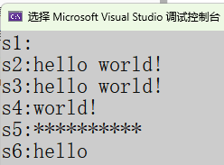
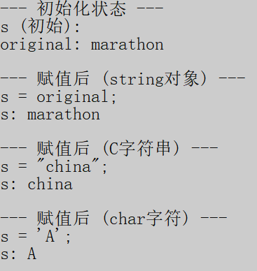
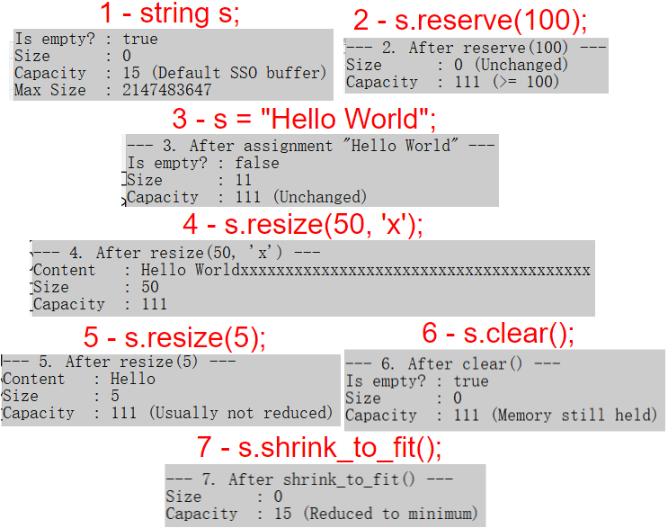
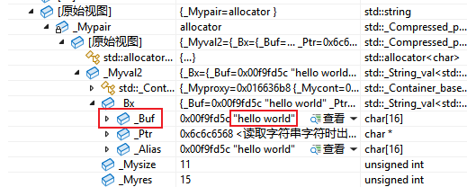
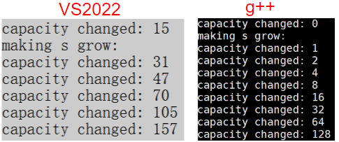
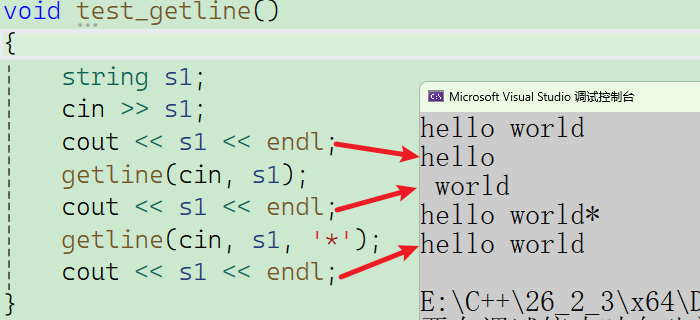
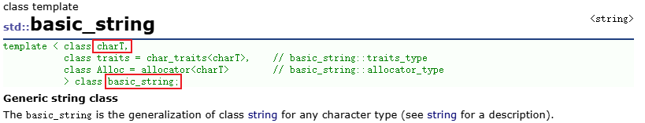
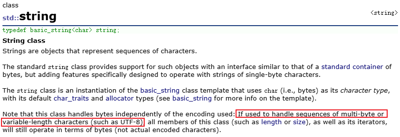

# std::string 标准库接口表

| **分类 (Category)**                                | **接口名称 (Interface)** | **接口含义 (Meaning)**                                       |
| -------------------------------------------------- | ------------------------ | ------------------------------------------------------------ |
| **Member constants** (成员常量)                    | `npos`                   | `size_t` 的最大值（通常为 -1），表示“未找到”或“直到末尾”。   |
| **Member functions** (基础成员函数)                | `constructor`            | **构造函数**：创建一个 string 对象（初始化字符串）。         |
| **Member functions**                               | `destructor`             | **析构函数**：销毁 string 对象，释放内存。                   |
| **Member functions**                               | `operator=`              | **赋值运算符**：为字符串赋值（如 `s = "abc"`）。             |
| **Iterators** (迭代器)                             | `begin`                  | 返回指向字符串**起始**位置的迭代器。                         |
| **Iterators**                                      | `end`                    | 返回指向字符串**末尾之后**（不含有效字符）的迭代器。         |
| **Iterators**                                      | `rbegin`                 | 返回指向**反向起始**位置（即原串最后一个字符）的迭代器。     |
| **Iterators**                                      | `rend`                   | 返回指向**反向末尾**位置（即原串第一个字符之前）的迭代器。   |
| **Iterators **(C++11)                              | `cbegin`                 | 返回 `const` 类型的**起始**迭代器（只读）。                  |
| **Iterators** (C++11)                              | `cend`                   | 返回 `const` 类型的**末尾**迭代器（只读）。                  |
| **Iterators **(C++11)                              | `crbegin`                | 返回 `const` 类型的**反向起始**迭代器（只读）。              |
| **Iterators** (C++11)                              | `crend`                  | 返回 `const` 类型的**反向末尾**迭代器（只读）。              |
| **Capacity** (容量管理)                            | `size`                   | 返回字符串当前的**有效字符长度**。                           |
| **Capacity**                                       | `length`                 | 与 `size()` 完全相同，返回字符串长度。                       |
| **Capacity**                                       | `max_size`               | 返回 string 理论上能容纳的最大字符数。                       |
| **Capacity**                                       | `resize`                 | **调整大小**：变长补默认值（或指定字符），变短则截断。       |
| **Capacity**                                       | `capacity`               | 返回当前**已分配**的内存存储空间大小（通常 $\ge$ size）。    |
| **Capacity**                                       | `reserve`                | **预留空间**：请求改变容量（减少频繁内存分配的开销）。       |
| **Capacity**                                       | `clear`                  | **清空**：删除所有字符，长度变为 0。                         |
| **Capacity**                                       | `empty`                  | **判空**：检查字符串是否为空（比 `size()==0` 语义更好）。    |
| **Capacity** (C++11)                               | `shrink_to_fit`          | 请求释放未使用的内存，让 capacity 适应 size。                |
| **Element access** (元素访问)                      | `operator[]`             | **下标访问**：获取指定位置字符，**不检查越界**。             |
| **Element access**                                 | `at`                     | **安全访问**：获取指定位置字符，**检查越界**（抛出异常）。   |
| **Element access** (C++11)                         | `back`                   | 访问**最后**一个字符。                                       |
| **Element access** (C++11)                         | `front`                  | 访问**最前**一个字符。                                       |
| **Modifiers** (修改器)                             | `operator+=`             | **追加**：在末尾追加字符串或字符。                           |
| **Modifiers**                                      | `append`                 | **追加**：功能比 `+=` 更丰富（如追加子串、追加 n 个字符）。  |
| **Modifiers**                                      | `push_back`              | **尾插**：在末尾追加一个字符。                               |
| **Modifiers**                                      | `assign`                 | **赋值**：替换当前内容（比 `=` 更灵活，可指定范围）。        |
| **Modifiers**                                      | `insert`                 | **插入**：在指定位置（下标或迭代器）插入字符或字符串。       |
| **Modifiers**                                      | `erase`                  | **删除**：删除指定位置或范围的字符。                         |
| **Modifiers**                                      | `replace`                | **替换**：将指定部分的字符替换为新的内容。                   |
| **Modifiers**                                      | `swap`                   | **交换**：交换两个 string 的内容（极快，仅交换指针）。       |
| **Modifiers** (C++11)                              | `pop_back`               | **尾删**：删除最后一个字符。                                 |
| **String operations** (字符串操作)                 | `c_str`                  | 获取 **C 风格字符串** (`const char*`)，以 `\0` 结尾。        |
| **String operations**                              | `data`                   | 获取字符串数据指针（C++11 后通常等同于 `c_str`）。           |
| **String operations**                              | `get_allocator`          | 获取关联的内存分配器（通常用于高阶内存管理）。               |
| **String operations**                              | `copy`                   | 将 string 中的字符序列**拷贝**到外部字符数组中。             |
| **String operations**                              | `find`                   | **查找**：从前向后查找子串或字符第一次出现的位置。           |
| **String operations**                              | `rfind`                  | **反向查找**：查找子串或字符最后一次出现的位置。             |
| **String operations**                              | `find_first_of`          | 查找参数集合中**任意一个**字符第一次出现的位置。             |
| **String operations**                              | `find_last_of`           | 查找参数集合中**任意一个**字符最后一次出现的位置。           |
| **String operations**                              | `find_first_not_of`      | 查找**第一个不属于**参数集合中字符的位置。                   |
| **String operations**                              | `find_last_not_of`       | 查找**最后一个不属于**参数集合中字符的位置。                 |
| **String operations**                              | `substr`                 | **取子串**：生成并返回一个新的子字符串。                     |
| **String operations**                              | `compare`                | **比较**：比较两个字符串（返回 0 表示相等，<0 小于，>0 大于）。 |
| **Non-member function overloads** (非成员函数重载) | `operator+`              | **拼接**：连接两个字符串（如 `s1 + s2`）。                   |
| **Non-member function overloads**                  | `relational operators`   | **关系运算**：判断大小/相等（`==`, `!=`, `<`, `>`, `<=`, `>=`）。 |
| **Non-member function overloads**                  | `swap`                   | **交换**：非成员版本的交换函数（推荐使用此版本）。           |
| **Non-member function overloads**                  | `operator>>`             | **流提取**：从输入流（如 `cin`）读取字符串（遇空格停止）。   |
| **Non-member function overloads**                  | `operator<<`             | **流插入**：将字符串输出到输出流（如 `cout`）。              |
| **Non-member function overloads**                  | `getline`                | **获取行**：从流中读取整行字符串（包含空格，直到换行符）。   |

# 一、string 标准库接口全解

## 1.1 成员常量

`std::string::npos` 是一个常量，表示边界`No Position`，是C++ 字符串处理中最重要的**哨兵值（Sentinel Value）**。

在标准库中是这么定义的：
```C++
static const size_t npos = -1;
```
但为什么是 `-1`？（底层原理：二进制补码特性）

`size_t` 是无符号的，不能表示负数。当我们把 `-1` 赋值给一个无符号变量时，会发生**下溢（Underflow）**，它会自动回绕到该类型能表示的**最大值**。

所以在 64 位系统中，`npos` 的实际值是：
$$
2^{64} - 1 = 18446744073709551615   ----->    (即二进制的 64 个 1)。
$$

> **简单理解**：`npos` 就是物理内存允许的最大索引值，实际上字符串永远不可能这么长，所以用它来代表“不存在”或“无穷大”非常安全。

`npos` 主要出现在两个场景中，含义截然不同。

**场景 A：表示“未找到” (Not Found)**

当使用 `find` 系列函数（`find`, `rfind`, `find_first_of` 等）查找失败时，函数不会返回 `-1`（虽然你看它是 -1，但它是无符号的），而是返回 `npos`。

```C++
std::string s = "Hello World";
size_t pos = s.find("Python"); // 找不到
if (pos == std::string::npos) 
{
    std::cout << "未找到该子串" << std::endl;
}
```

**场景 B：表示“直到末尾” (Until the End)**

当使用 `substr`, `erase`, `replace` 等函数时，如果涉及到长度参数，`npos` 代表**“从当前位置一直到字符串结束的所有字符”**。

```C++
std::string s = "Hello World";

// substr(起始位置, 长度)
// 如果第二个参数省略，或者显式传 npos，代表截取到末尾
std::string sub = s.substr(6); // 默认长度是 npos
// sub 结果: "World"

// 显式使用
s.erase(5, std::string::npos); 
// 结果: "Hello" (从下标5开始删除所有后续字符)
```

陷阱：慎用 `int`——这是一个不容易察觉到的潜在BUG。**错误示范：**

```C++
std::string s = "abc";
int pos = s.find("z"); // 危险！用 int 接收 size_t

// 在某些旧系统或特定编译选项下，可能还能工作（因为 -1 强转），
// 但这在逻辑上是错误的，且容易导致难以排查的 bug。
if (pos == -1) { ... } 
```

在学习C 语言时习惯用 `int` 来表示下标（因为 C 语言里往往用 `-1` 代表错误）。但在 C++ `std::string` 中，**用 `int` 接收下标是极度危险的**。

**危险 1：64 位系统下的截断与比较错误 (Type Mismatch)**

- **`std::string::npos` 类型**：$size\_t$ (通常是 `unsigned long long`, 64位, 8字节)
- **`int` 类型**：`signed int` (通常是 32位, 4字节)

当你写 `int pos = s.find(...)` 时，64 位的 npos ($0xFFFFFFFFFFFFFFFF$) 会被强制截断并塞进 32 位的 `int` 中。

虽然在 32 位补码表示法中，它看起来变成了 `-1`，这在某些情况下能“侥幸”工作（因为编译器比较时可能会做符号扩展），但这是一种**未定义行为（Undefined Behavior）**或依赖特定平台实现的行为。

**危险 2：大数据截断（Valid Index Corruption）—— 这是真正的 Bug**

这是最可怕的情况。如果你的程序在处理非常大的字符串（例如读取一个 3GB 的日志文件到内存中），字符串的合法索引可能会超过 `int` 的最大值 ($2^{31}-1 \approx 21$亿)。

假设字符串长度是 **30亿** (3GB)。

1. 我们要查找的字符位于索引 **25亿** 处。
2. `find` 返回 **25亿** (在 $size\_t$ 中完全合法)。
3. 你用 `int pos` 接收。
4. **25亿** 超过了 `int` 的上限，二进制发生溢出，`pos` 变成了一个**负数**（例如 -17亿）。
5. 如果你后面写了 `s[pos]`，实际上是在访问 `s[-1700000000]` —— **程序直接崩溃 (Segfault)**。

**危险 3：逻辑混淆**

`int` 是有符号的，意味着下标可以是负数。但在 C++ 标准库逻辑中，下标永远不可能是负数。使用 `int` 会给阅读代码的人造成困惑：*"这里会出现负索引吗？"*

**总结表**

| **特性**     | **说明**                              |
| ------------ | ------------------------------ |
| **值**       | `size_t` 的最大值 (全为1的二进制)                 |
| **含义 1**   | **查找失败**（作为返回值）                   |
| **含义 2**   | **直到字符串末尾**（作为长度参数）            |
| **最佳实践** | 永远使用 `std::string::npos` 进行比较，不要直接写 `-1`；接收返回值时使用 `size_t` 或 `auto`。 |

## 1.2 基础成员函数

### 1.2.1 构造函数

| **构造类型**      | **函数原型示例 (简化版)**                           | **含义与场景**                                            |
| ----------------- | --------------------------------------------------- | --------------------------------------------------------- |
| **默认构造**      | `string()`                                          | 创建一个**空字符串**，长度为 0，容量可能非 0。            |
| **C-String 构造** | `string(const char* s)`                             | 用 C 风格字符串（以 `\0` 结尾）初始化。**这是最常用的。** |
| **拷贝构造**      | `string(const string& str)`                         | 从另一个 `string` 对象**深拷贝**一份数据。                |
| **填充构造**      | `string(size_t n, char c)`                          | 生成由 `n` 个字符 `c` 组成的字符串（如分割线）。          |
| **子串构造**      | `string(const string& str, size_t pos, size_t len)` | 从 `str` 的 `pos` 位置开始，拷贝 `len` 个字符。           |
| **区间构造**      | `string(Iter begin, Iter end)`                      | 使用迭代器范围内的字符初始化。                            |

**代码示例**

```c++
void test_string1()
{
    // 1. 默认构造函数
    // 创建一个空字符串，size 为 0，不分配字符内存（但可能分配少许内部缓冲区）。
    string s1;

    // 2. C-String 构造函数
    // 使用 C 风格字符串常量初始化，自动计算长度并拷贝内容。
    string s2("hello world!");

    // 3. 拷贝构造函数
    // 创建 s2 的一份副本。s3 和 s2 内容相同，但内存地址独立（深拷贝）。
    string s3(s2);

    // 4. 子串构造函数
    // 原型: string(const string& str, size_t pos, size_t len = npos)
    // 含义: 从 s2 的下标 6 (即 'w') 开始，拷贝 npos (直到末尾) 个字符。
    // s2: "hello world!"
    //            ^ (下标6)
    string s4(s2, 6, std::string::npos);

    // 5. 填充构造函数
    // 原型: string(size_t n, char c)
    // 含义: 创建由 10 个字符 '*' 组成的字符串。
    string s5(10, '*');

    // 6. 区间构造函数
    // 原型: string(InputIterator first, InputIterator last)
    // 含义: 拷贝迭代器 [first, last) 区间内的字符。
    // 左闭右开原则：包含 begin()，但不包含 begin() + 5。
    // s3: "hello world!"
    //      ^    ^
    //    begin  begin+5 (指向空格) -> 空格不被拷贝
    string s6(s3.begin(), s3.begin() + 5);

    // --- 输出结果验证 ---
    cout << "s1:" << s1 << "\n"; // 输出空行
    cout << "s2:" << s2 << "\n"; // 输出: hello world!
    cout << "s3:" << s3 << "\n"; // 输出: hello world!
    cout << "s4:" << s4 << "\n"; // 输出: world!
    cout << "s5:" << s5 << "\n"; // 输出: **********
    cout << "s6:" << s6 << "\n"; // 输出: hello
}
```

**结果：**



### 1.2.2 析构函数

**详解**: 这是 C++ 自动内存管理的神器。当 `std::string` 对象**超出作用域**（例如函数结束、`if` 块结束）时，析构函数会被**自动调用**。 它负责释放字符串在堆（`Heap`）上动态分配的内存。你**永远不需要**手动调用它，也不需要手动 `free`。

### 1.2.3 赋值重载

构造函数只在对象**出生**时调用一次，而赋值运算符用于对象**存活期间**改变其内容。`std::string` 重载了 `=`，使其可以接受多种类型的赋值。

**支持的赋值类型**

| 操作类型        | 代码示例             | 说明                                                         |
| --------------- | -------------------- | ------------------------------------------------------------ |
| String 深拷贝   | `s1 = s2`            | 清空 s1 旧内容，将 s2 的内容深拷贝到 s1                      |
| C-String 赋值   | `s1 = "new content"` | 将字符串 s1 的内容替换为 "new content"                       |
| Char 赋值       | `s1 = 'A'`           | 将字符串 s1 的内容替换为单个字符 'A'                         |

**代码示例**

```C++
void test_string2()
{
    string s;                    // 默认构造：空字符串
    string original("marathon"); // 有参构造：初始化为 "marathon"

    cout << "--- 初始化状态 ---" << endl;
    cout << "s (初始): " << s << endl;          // 输出空串
    cout << "original: " << original << endl;   // 输出 marathon

    // 2. String 对象赋值: 将 original 的内容深拷贝给 s。此时 s 拥有独立的内存空间。
    s = original;

    cout << "\n--- 赋值后 (string对象) ---" << endl;
    cout << "s = original;" << endl;
    cout << "s: " << s << endl; // 输出: marathon

    // 3. C 风格字符串赋值: 将字符数组/常量字符串 "china" 赋值给 s。
    // 注意: s 原有的 "marathon" 内存会被释放或重用，内容被覆盖。
    s = "china";

    cout << "\n--- 赋值后 (C字符串) ---" << endl;
    cout << "s = \"china\";" << endl;
    cout << "s: " << s << endl; // 输出: china

    // 4. 单字符赋值: 将 s 的内容变成仅包含一个字符 'A'。
    s = 'A';

    cout << "\n--- 赋值后 (char字符) ---" << endl;
    cout << "s = 'A';" << endl;
    cout << "s: " << s << endl; // 输出: A
}
```

**结果：**



## 1.3 迭代器

迭代器（Iterator）在行为上非常像**指针**。

- **`begin()`**: 指向第一个有效字符。
- **`end()`**: 指向**最后一个有效字符的下一个位置**（哨兵位），**不是**最后一个字符，是`\0`的位置。
- **`*it`**: 解引用，获取当前位置的字符。
- **`++it`**: 移动到下一个位置。

> 关键原则：左闭右开 [begin, end)
>
> 这意味着 begin() 包含在范围内，但 end() 不包含。循环条件通常写作 it != s.end()。


**四种迭代器类型：**标准库根据**方向**和**读写权限**，提供了四种组合

| **类型名称**             | **对应接口**            | **方向**    | **权限**                |
| ------------------------ | ----------------------- | ----------- | ----------------------- |
| `iterator`               | `begin()` / `end()`     | 正向 (`->`) | **可读可写**            |
| `reverse_iterator`       | `rbegin()` / `rend()`   | 反向 (`<-`) | **可读可写**            |
| `const_iterator`         | `cbegin()` / `cend()`   | 正向 (`->`) | **只读** (不可修改字符) |
| `const_reverse_iterator` | `crbegin()` / `crend()` | 反向 (`<-`) | **只读** (不可修改字符) |

**代码演示：**典型的迭代器用法——**正向修改**、**反向遍历**、**只读遍历**。


```C++
void test_string3()
{
    string s("hello world");
    cout << "s:" << s << endl;
    // 1. 普通正向迭代器 (iterator)：可读、可写、从左向右
    cout << "--- 1. 正向遍历并加密 (+1) ---" << endl;
    // begin() 指向第一个字符 'h'
    string::iterator it = s.begin();
    while (it != s.end()) // end() 指向最后一个字符的 *后面*
    {
        *it += 1;         // 修改：将当前字符 ASCII 码 +1 (加密)
        cout << *it;      // 输出修改后的字符
        ++it;             // 步进：向后移动
    }
    cout << "\n(当前字符串变为: " << s << ")\n" << endl;

    // 2. 遍历验证修改
    cout << "--- 2. 验证修改后的字符串 ---" << endl;
    it = s.begin(); // 重新指向开头
    while (it != s.end())
    {
        cout << *it << " "; // 用空格分隔打印
        ++it;
    }
    cout << "\n" << endl;

    // 3. 反向迭代器 (reverse_iterator)：可读、可写、从右向左
    cout << "--- 3. 反向遍历并解密 (-1) ---" << endl;
    // rbegin() 指向最后一个有效字符  rend() 指向第一个字符的 *前面*
    string::reverse_iterator rit = s.rbegin();
    while (rit != s.rend())
    {
        *rit -= 1;        // 修改：将字符 -1 (还原/解密)
        cout << *rit;     // 此时打印的是还原后的字符，顺序是从后往前
        ++rit;            // 注意：反向迭代器的 ++ 在物理内存上是 向前 移动
    }
    cout << "\n(字符串内容已还原: " << s << ")\n" << endl;

    // 4. 常量迭代器 (const_iterator)：只读 (Read Only)、从左向右
    // 场景：用于 const 对象，或者为了安全不希望修改数据
    cout << "--- 4. const 字符串的正向遍历 ---" << endl;
    const string str("const hello world");
    // 必须使用 const_iterator，否则编译报错，因为 str 是 const 的
    // cbegin() 显式返回 const_iterator (C++11)
    string::const_iterator cit = str.cbegin();
    while (cit != str.cend())
    {
        // *cit += 1; // 错误！const 迭代器不允许修改指向的内容
        cout << *cit;
        ++cit;
    }
    cout << "\n" << endl;

    // 5. 常量反向迭代器 (const_reverse_iterator)：只读、从右向左
    cout << "--- 5. const 字符串的反向遍历 ---" << endl;
    // crbegin() 显式返回 const_reverse_iterator
    string::const_reverse_iterator crit = str.crbegin();

    while (crit != str.crend())
    {
        cout << *crit;
        ++crit;
    }
    cout << endl;
}
```

**为什么需要 const 迭代器？**

**`const` 迭代器的存在，是为了保证在遍历 `const` 对象时，不会因为使用了错误的工具（普通 iterator）而意外获得了修改数据的权限（权限放大），从而导致程序崩溃或逻辑错误。**

## 1.4 容量管理

一个核心认知：**Size（大小） $\neq$ Capacity（容量）**。

> **比喻**：
> - **Size**: 杯子里实际装了多少水（你真正存的字符数）。
> - **Capacity**: 杯子最大能装多少水（系统为你预分配的内存空间）。
> - **扩容**: 当水漫出来时，系统会被迫换一个更大的杯子，并把水倒过去（这是一个昂贵的“内存重分配 + 拷贝”过程）。

### 1.4.1 查询类接口 (只读)

| **接口**         | **详解**                                                  | **备注**                                                     |
| ---------------- | --------------------------------------------------------- | ------------------------------------------------------------ |
| **`size()`**     | 返回字符串当前实际包含的字符数。                          | 最常用。                                                     |
| **`length()`**   | 与 `size()` 完全一样。                                    | 为了兼容 C 语言语意而保留的历史产物，一般用`size()`的多一些。 |
| **`empty()`**    | 判断字符串是否为空。                                      | **推荐使用**。语义比 `s.size()==0` 更清晰，在某些复杂容器中效率更高。 |
| **`max_size()`** | 返回 `string` 理论上能达到的最大长度。                    | 通常是一个极大的数字(`int`最大值)，实际受限于物理内存。      |
| **`capacity()`** | 不重新分配内存时，`string` 能存的最大字符数(不包括`\0`)。 | **重点**：`capacity` 总是 $\ge$ `size`。                     |

### 1.4.2 变更内容类 (改变 Size)

| **接口**         | **详解**       | **内存行为**             |
| --------- | -------------- | ---------------------------- |
| **`clear()`**   | 清空字符串内容。        | **`size` 变为 0**，但 **`capacity` 通常不变**（为了复用内存，避免下次插入时再次申请）。 |
| **`resize(n)`** **`resize(n, c)`** | 强行改变字符串的 `size`。 1. **变短**：截断末尾字符。 2. **变长**：用 `\0` 或指定字符 `c` 填充新增部分。 | 如果 `n > capacity`，会触发扩容（重新分配内存）。            |

### 1.4.3 内存优化类 (只改变 Capacity，不改 Size)

| **接口**    | **详解**      | **场景**     |
| ----------- | ------------ | -------------------- |
| **`reserve(n)`**      | **预分配内存**。请求将 `capacity` 变为至少 `n`。 如果 `n < capacity`，通常什么都不做（不会缩容）。 | **性能神器**。在大量 `append` 或循环之前调用，避免频繁的内存搬家。 |
| **`shrink_to_fit()`** | (C++11) 请求系统回收未使用的内存，使 `capacity` 缩减到接近 `size`。 | 用于节省内存（例如一个大字符串处理完后变成了小字符串，你想归还多余内存）。 |

### 1.4.4 测试代码结果

| **步骤** | **操作 (Operation)** | **Size ** | **Capacity** | **Empty?** | **内存状态深度解析**                                         |
| -------- | -------------------- | --------- | ------------ | ---------- | ------------------------------------------------------------ |
| **1**    | `string s;`          | **0**     | **15**       | True       | **SSO 优化**：虽然是空串，但编译器默认给了一个 15 字节的小缓冲区（在栈上），避免堆内存分配。 |
| **2**    | `reserve(100)`       | **0**     | **111**      | True       | **预分配**：请求 100，实际分配 111（编译器策略通常会多给一点以对齐内存块）。注意 **Size 仍为 0**。 |
| **3**    | `s = "Hello World"`  | **11**    | **111**      | False      | **无扩容**：因为 11 < 111，直接放入预留空间，效率极高，没有发生内存搬运。 |
| **4**    | `resize(50, 'x')`    | **50**    | **111**      | False      | **填充**：Size 变大，多余位置填入了 `'x'`。容量依然够用，未触发扩容。 |
| **5**    | `resize(5)`          | **5**     | **111**      | False      | **截断**：内容只剩 "Hello"。**关键点：Capacity 依然是 111，没有自动缩小**，保留内存是为了应对未来可能的再次变长。 |
| **6**    | `clear()`            | **0**     | **111**      | True       | **假死**：`Size` 归零，逻辑上空了。但 **Capacity 仍为 111**，内存被对象死死抓住不放。 |
| **7**    | `shrink_to_fit()`    | **0**     | **15**       | True       | **归还**：显式请求缩容后，多余的堆内存被释放，容量回到了初始的 SSO 状态(15)。 |



**`resize` vs `reserve`**

这是面试和实战中最常见的坑。

- **`resize(n)`**: 是用来**开辟/删除元素**的。它会改变 `size`。如果变大了，它会真的在里面填入数据（默认是 `\0`）。
- **`reserve(n)`**: 是用来**占坑**的。它只改变 `capacity`，不改变 `size`。它虽然分配了物理内存，但**你不能访问这些内存**（因为逻辑上它们还不存在）。

### 1.4.4 扩容机制的秘密

由于开发环境的不同，所使用的编译器也不同，在`VS2022`和`Linux`下底层对`string`类的扩容机制也不太一样，现在就简易了解一下：

在调试时可以看到，在VS2022这个集成开发环境下，对`string`底层的实现实际上多了一个缓存`char[16]`，对于长度较短的串，一开始就是存在于缓存中。



这里给出一个插入字符的函数，看看扩容机制：

```c++
void TestPushBack()
{
    string s("hello world");
    size_t sz = s.capacity();
    cout << "capacity changed: " << sz << '\n';

    cout << "making s grow:\n";
    for (int i = 0; i < 100; ++i)
    {
        s.push_back('c');
        if (sz != s.capacity())
        {
            sz = s.capacity();
            cout << "capacity changed: " << sz << '\n';
        }
    }
}
```

这是上述代码在不同编译器下运行的结果，可以看到`Linux`的`g++`下是稳定的2倍扩容，而在`VS2022`下则是1.5倍(这里容量实际上都需要加1，还有一个空间是给`\0`，一开始的二倍扩容也是因为它特有的缓存数组，直接将数组上的内容挪到了堆上扩容的空间，那缓存数组后面就没有用了，是一种空间换时间的策略)。



**结论**：频繁扩容可能会影响代码的效率，如果你这时候知道大概要存多少数据，**一定要先用 `reserve()`**，这样可以把上述所有的“搬家”过程消灭掉，只分配一次内存。

## 1.5 元素访问

C++ 标准库的设计哲学是 **"不要为你不需要的东西付费" (Zero Overhead Principle)**，同时也提供了安全选项。

### 1.5.1 `operator[]` (下标操作符)

- **优点**：**极致的效率**。
	- 它内部通常只有一条指令：`return *(buffer + index);`。
	- **不进行**越界检查。如果你确定下标是合法的，用它最快。
	- **兼容性**：写法和 C 语言数组完全一致，符合程序员直觉。

### 1.5.2 `at()` (安全访问)

- **优点**：**安全性 (Bounds Checking)**。
	- 它在访问前会判断 `index >= size()`。
	- 如果越界，**保证**抛出 `std::out_of_range` 异常。
- **场景**：当你不能 100% 保证下标合法（比如下标是用户输入的），或者在调试阶段排查 Bug 时，使用 `at()` 能避免程序莫名其妙地崩溃或读脏数据。

### 1.5.3 `front()` 和 `back()` (C++11)

- **优点**：**语义清晰 (Readability)**。
	- **`s.back()`** 远比 `s[s.size() - 1]` 优雅且不易写错。
	- 很多时候写 `s[s.size()]` 会导致越界（访问了 `\0` 或野地），用 `back()` 可以完美避坑。
- **一致性**：`std::vector`、`std::list` 等容器都有这两个函数，统一了接口风格。

**总结**

| **接口**        | **安全性**      | **效率**          | **推荐场景**                                     |
| --------------- | --------------- | ----------------- | ------------------------------------------------ |
| **`s[i]`**      | 低 (不检查)     | **最高**          | 绝大多数循环遍历场景（当你能控制下标时）。       |
| **`s.at(i)`**   | **高 (抛异常)** | 稍低 (有检查开销) | 处理外部不可信输入，或排查越界 Bug 时。          |
| **`s.back()`**  | 低 (同 `[]`)    | **最高**          | 获取/修改**最后一个**字符时（取代 `size()-1`）。 |
| **`s.front()`** | 低 (同 `[]`)    | **最高**          | 获取/修改**第一个**字符时。                      |

## 1.6 修改器

### 1.6.1  insert (插入) 接口全集

| **类型 (Type)**    | **接口原型 (Interface Prototype)**                           | **接口含义 (Meaning)**                                       |
| ------------------ | ------------------------------------------------------------ | ------------------------------------------------------------ |
| **下标 (Index)**   | `string& insert(size_t pos, const string& str);`             | 在下标 `pos` 处插入整个 `str` 对象。                         |
| **下标 (Index)**   | `string& insert(size_t pos, const string& str, size_t subpos, size_t sublen);` | 在下标 `pos` 处，插入 `str` 中从 `subpos` 开始的 `sublen` 个字符（插入子串）。 |
| **下标 (Index)**   | `string& insert(size_t pos, const char* s);`                 | 在下标 `pos` 处插入 C 风格字符串 `s`。                       |
| **下标 (Index)**   | `string& insert(size_t pos, const char* s, size_t n);`       | 在下标 `pos` 处插入 C 风格字符串 `s` 的前 `n` 个字符。       |
| **下标 (Index)**   | `string& insert(size_t pos, size_t n, char c);`              | 在下标 `pos` 处插入 `n` 个字符 `c`。                         |
| **迭代器 [C++11]** | `iterator insert(const_iterator p, size_t n, char c);`       | 在迭代器 `p` 之前插入 `n` 个字符 `c`。**返回指向第一个新字符的迭代器**。 |
| **迭代器 [C++11]** | `iterator insert(const_iterator p, char c);`                 | 在迭代器 `p` 之前插入字符 `c`。**返回指向新插入字符的迭代器**。 |
| **迭代器 [C++11]** | `template <class InputIterator>` `iterator insert(const_iterator p, InputIterator first, InputIterator last);` | 在迭代器 `p` 之前插入区间 `[first, last)` 的内容。**返回指向第一个新字符的迭代器**。 |
| **迭代器 [C++11]** | `string& insert(const_iterator p, initializer_list<char> il);` | 在迭代器 `p` 之前插入初始化列表（如 `{'a','b'}`）。**注意：此重载返回 string&**。 |

```c++
void test_insert()
{
    string s = "Hello World";
    s.insert(5, " C++"); //指定位置插入字符串 "Hello C++ World"
    s.insert(0, 3, '!'); //插入重复字符 "!!!Hello C++ World"
    auto it = s.begin();// 插入并更新迭代器 目的: 在头部插入 '@'
    //insert 返回指向新插入字符 '@' 的迭代器 "@!!!Hello C++ World"
    it = s.insert(it, '@');// 如果不接返回值，旧的 it 可能会失效（取决于是否发生扩容）
    //插入区间 在 '@' 后面插入 "123" "@123!!!Hello C++ World"
    string sub = "123";
    s.insert(it + 1, sub.begin(), sub.end());//将迭代器+1，指向 '@' 的下一个位置
}
```

### 1.6.2 erase (删除) 接口全集

| **类型 (Type)**    | **接口原型 (Interface Prototype)**     | **接口含义 (Meaning)**        |
| ------------- | --------------- | ------------------ |
| **下标 (Index)**   | `string& erase(size_t pos = 0, size_t len = npos);`   | 从下标 `pos` 开始，删除 `len` 个字符。           |
| **迭代器 [C++11]** | `iterator erase(const_iterator p);`   | 删除迭代器 `p` 指向的字符。**参数接受 const_iterator**，返回指向被删元素**后一个**位置的迭代器。 |
| **迭代器 [C++11]** | `iterator erase(const_iterator first, const_iterator last);` | 删除迭代器区间 `[first, last)` 的所有字符。**参数接受 const_iterator**，返回指向最后被删元素**后一个**位置的迭代器。 |

**C++11 核心变化注记**

- **参数更加宽容 (`iterator` $ \to $ `const_iterator`)**：

	在 C++98 中，如果要用迭代器指定位置，必须传“可写迭代器”。C++11 允许传入“只读迭代器” (`const_iterator`) 来作为定位锚点（比如通过 `cbegin()` 获取的迭代器），这让代码编写更安全、方便。编译器会自动将 `const_iterator` 转换为内部可写的具体位置。

- **返回值更有用 (`void` $\to$ `iterator`)**：

	C++11 将原本返回 `void` 的 `insert` 重载版本全部改为返回 `iterator`，指向**新插入内容的第一个字符**。这解决了插入操作后无法快速定位新内容、以及原有迭代器失效后无法继续遍历的问题。

- **模板函数 `InputIt`**

	`insert` 的区间版本是一个**模板函数**。这意味着它不仅可以接受 `string::iterator`，还可以接受 `vector<char>::iterator`，甚至是 `istream_iterator`（从文件流直接插入），极大地提高了灵活性。

```c++
void test_erase()
{
    string s = "0123456789";
    s.erase(0, 2); // 删除从下标 0 开始的 2 个字符："23456789"
    s.erase(6); // 等同于 s.erase(6, npos)// 从下标 6 开始，删光后面所有："234567"
    auto it = s.begin();// 删除开头的 '2'："34567"
    it = s.erase(it);// erase 返回被删元素下一个位置的迭代器 此时 '2' 被删，it 更新指向 '3'
    it = s.erase(it, it + 2);//删除 [it, it+2) -> 即删除 "34"："567"
}
```

### 1.6.3 std::string 修改器接口汇总表

| **接口名称 (Interface)** | **含义 (Meaning)**      | **特性与使用场景 (Features & Usage)**                        |
| ------------------------ | ----------------------- | ------------------------------------------------------------ |
| **`operator+=`**         | 追加内容                | **最常用**。语法简洁，支持追加字符串 (`string`/`const char*`) 或单个字符 (`char`)。 |
| **`append`**             | 追加内容 (更灵活的参数) | **高阶追加**。当需要追加子串（如“只追加后半截”）或重复字符时使用，比 `+=` 提供更多参数控制。 |
| **`push_back`**          | 尾部追加一个字符        | **仅限字符**。只能追加单个 `char`，通常用于循环构造字符串或兼容 STL 容器接口。 |
| **`assign`**             | 重新赋值内容            | **重置**。类似 `=` 赋值，但支持像 `append` 那样灵活地从另一个串中截取一段来赋值。 |
| **`replace`**            | 替换部分内容            | **修改**。功能最强大，允许用一段新内容替换掉原字符串中指定范围的内容（长度可不一致）。 |
| **`swap`**               | 交换两个字符串的内容    | **高性能**。仅交换内部指针，不拷贝数据，效率极高 ($O(1)$)。常用于内存管理或快速数据转移。 |
| **`pop_back`**           | 删除最后一个字符        | **尾删**。**C++11 新增**。比 `erase(size()-1)` 更简洁、语义更清晰。 |

```c++
void test_modifiers_from_image()
{
    string s = "Hello";
    // operator+=: 追加内容 (支持 string, C-string, char)
    s += " ";        // 追加 C-string
    s += "World";    // 追加 string (隐式转换)
    s += '!';        // 追加 char
    string suffix = " cplusplus";// append: 追加内容 (提供比 += 更多的参数选项)
    s.append(suffix, 0, 4);// 只追加 suffix 的前 4 个字符 (" cpl")
    s.append(3, '.');// 追加 3 个 '.'
    s.push_back('A');// push_back: 尾部追加一个字符 (专门针对 char)
    s.assign("New Content");// assign 含义: 重新赋值内容 (就像把旧的扔了，换新的)
    string base = "123456789";// assign 的高级用法：取子串赋值
    s.assign(base, 2, 4); // 取 base 从下标2开始的4个字符 ("3456")
    s.replace(1, 2, "XX");
    string other = "I am Other";
    s.swap(other); // s 变成 "I am Other", other 变成 "3XX6"
    s.pop_back(); // 删掉 'r'
    s.pop_back(); // 删掉 'e'
}
```

**A. 追加三剑客：`+=` vs `append` vs `push_back`**

- **`operator+=`**:语法糖，代码最短，符合直觉。`s += 'a'` 和 `s += "abc"` 通吃。
- **`append`**: 当你不需要追加整个字符串，而是想追加“一部分”时使用。例如 `s.append(str, 0, 5)`。如果只是简单的追加，用 `append` 显得啰嗦。
- **`push_back`**:只能追加**单个字符**。通常在算法循环中逐个构造字符串时使用，为了配合 `vector` 等容器的统一接口。

**B. 赋值双雄：`operator=` vs `assign`**

- **`operator=`**: 日常赋值 `s = "abc"`，简单粗暴。
- **`assign`**: 类似于 `append` 对 `+=` 的补充。当你需要把一个长字符串中间的一段“抠出来”赋值给当前对象时，用 `assign` 可以避免中间产生临时的 string 对象，效率更高。

**C. 修改利器：`replace`**

- **核心逻辑**: “删除旧的 + 插入新的”。
- **强大之处**: 新内容的长度**不需要**等于旧内容的长度。比如把长度为 1 的 "a" 替换成长度为 100 的 "bcdef..."，`replace` 会自动处理内存搬运和扩容。

**D. 性能之王：`swap`**

- **原理**: 仅仅交换了两个对象内部的**指针**（`Start`, `Size`, `Capacity`），**没有发生任何数据的拷贝**。
- **用途**: 在处理大字符串（如读取的文件内容）时，如果你想把内容转移给别人并清空自己，`swap` 是最快的方法。

## 1.7 字符串操作

`c_str()` 是 `std::string` 中极其重要的一个函数，它是 **C++ 面向对象字符串 (`std::string`)** 与 **C 语言传统字符串 (`const char\*`)** 之间的**桥梁**。

即使在现代 C++ 开发中，我们依然需要频繁调用操作系统 API（如 `Windows API`、`Linux` 系统调用）或第三方 C 库（如 `OpenSSL`, `SQLite`），这些接口通常只接受 `const char*`，这时候 `c_str()` 就必不可少。

**核心定义**

- **函数原型**: `const char* c_str() const noexcept;`
- **返回值**: 返回一个指向**以空字符 `\0` 结尾**的字符数组（即 C 风格字符串）的指针。
- **内容**: 该指针指向的内容与 `std::string` 中的内容完全一致。

> **关键点**：`std::string` 内部不一定总是以 `\0` 结尾（它记录长度），但当你调用 `c_str()` 时，标准库保证返回的数组末尾一定有一个 `\0`，以兼容 C 语言标准。

**实战场景**

C++ 的 `std::string` 是一个类，而 C 语言的字符串只是一个字符指针。C 语言的函数（如 `printf`, `fopen`, `strcmp`）无法直接理解 C++ 的 `string` 对象。

**场景 A：文件操作 (`fopen`)**

C 语言的 `fopen` 需要 `const char*` 文件名。


```C++
std::string filename = "data.txt";

// fopen(filename, "r"); // 错误！fopen 不接受 string 对象
FILE* fp = fopen(filename.c_str(), "r"); // 正确！传回了 C 风格指针
```

**场景 B：格式化输出 (`printf`)**

`printf` 的 `%s` 占位符期望一个 `char*`，而不是对象。

**三大“致命”陷阱**

`c_str()` 返回的指针非常脆弱，它的生命周期和有效性完全依赖于原 `string` 对象。

**陷阱一：指针悬挂 (Dangling Pointer)**——如果 `string` 对象被销毁了，`c_str()` 返回的指针指向的内存就被释放了，变成了野指针。

**陷阱二：修改导致失效 (Invalidation)**——一旦你对 `string` 进行了**修改**（如 `insert`, `resize`, `append`, `+=`），可能会触发**内存重新分配 (Reallocation)**。旧的内存被释放，数据搬到了新地址，而你手里拿的 `c_str` 指针依然指向旧地址。

**陷阱三：强制去 const 修改 (Undefined Behavior)**——`c_str()` 返回的是 `const char*`，意味着它是**只读**的。不要试图强转去修改它。

*如果要修改，请使用 `s[i]` 或 `&s[0]` (C++17 以后)。*

**`c_str()` vs `data()`**

`data()` 这个函数，它和 `c_str()` 非常像。

| **特性**     | **c_str()**                         | **data()**                                           |
| ------------ | ----------------------------------- | ---------------------------------------------------- |
| **C++98**    | 返回 `const char*`，**保证有 `\0`** | 返回 `const char*`，**不保证有 `\0`** (仅用于数据块) |
| **C++11**    | 保证有 `\0`                         | **保证有 `\0`** (和 `c_str` 行为一致了)              |
| **C++17**    | 只读                                | 提供了非 const 重载 `char* data()`，**允许修改内容** |
| **推荐用法** | **兼容 C 字符串接口时首选**         | **需要读写底层内存块时使用**                         |

**总结建议**：

- 如果要传给 `const char*` 参数的 C 函数（如 `strlen`, `fopen`），**永远用 `c_str()`**，语义最清晰。
- 如果你需要直接读写内存（比如作为网络接收缓冲区），C++17 后可以用 `data()`。

**核心口诀**

> **c_str 指向内部，只读不可改。**
>
> **String 变动它失效，String 销毁它归西。**
>
> **用时现调现取，切莫长期保存。**

### 1.7.1 Find 系列与 Substr 接口详解表

| **接口名称 (Interface)** | **含义 (Meaning)**           | **典型应用场景 (Usage Case)**                                |
| ------------------------ | ---------------------------- | ------------------------------------------------------------ |
| **`find`**               | **正向查找**                 | 最基本的查找。例如：判断字符串中是否包含敏感词。             |
| **`rfind`**              | **反向查找**                 | 从后往前找。例如：**找文件路径中的文件名**（找最后一个 `/`），或**找文件后缀**（找最后一个 `.`）。 |
| **`find_first_of`**      | 查找任意字符**第一次**出现   | **“集合查找”**。给出一个字符集（如 `":/\"`），找到这些符号中**任意一个**最早出现的位置。常用于解析 URL 或分割字符串。 |
| **`find_last_of`**       | 查找任意字符**最后一次**出现 | 同上，但是找最后一次。例如：找到路径中最后一个分隔符（兼容 Windows `\` 和 Linux `/`）。 |
| **`find_first_not_of`**  | 查找第一个**不匹配**字符     | **“白名单查找”**。例如：检查字符串是否全由数字组成（找第一个**不是**数字的字符）。 |
| **`find_last_not_of`**   | 查找最后一个**不匹配**字符   | 同上，反向查找。常用于**去除字符串末尾的空格**（Trim Right）。 |
| **`substr`**             | **获取子字符串**             | `s.substr(pos, len)`。**最核心接口**。常配合上述 `find` 接口使用，先找到位置 `pos`，再截取内容。 |

**补充说明：**

- **返回值**: 所有 `find` 系列函数如果没有找到目标，都会返回一个特殊的常量 **`string::npos`** (通常是 -1 的无符号形式，即最大整数)。判断是否找到必须用 `if (pos != string::npos)`。
- **`c_str` vs `data`**: 在 C++11 之前，`data` 不保证末尾有 `\0`，`c_str` 保证有。但在 C++11 及以后，两者都保证有 `\0`，基本可以混用，但习惯上与 C 语言交互（如 `fopen`, `printf`）时使用 **`c_str()`**。

```c++
void test_string_operations()
{
    string s = "Hello World";
    const char* c_str_ptr = s.c_str();// 返回const char*，兼容 C 语言函数 (如printf)
    printf("c_str output: %s (len=%d)\n", c_str_ptr, (int)strlen(c_str_ptr));

    // data(): C++11 后与 c_str() 几乎一致，返回指向内存数据的指针(很少用)
    const char* data_ptr = s.data();

    // copy(buffer, len, pos): 把 string 的内容拷贝到用户提供的 buffer 中
    // 注意：copy 不会自动添加 '\0'，需要手动处理
    char buffer[20];
    size_t length = s.copy(buffer, 5, 0); // 从下标0开始，拷贝5个字符
    buffer[length] = '\0'; // 手动添加结束符！ "Hello"

    string str = "file.txt.tar.gz";
    cout << "目标字符串: " << str << endl;
    
    size_t pos = str.find("tar");// (1) find: 正向查找 "tar"
    if (pos != string::npos)
        cout << "find(\"tar\")          : " << pos << endl;

    pos = str.rfind('.');// (2) rfind: 反向查找 "." (找最后一个点)
    if (pos != string::npos) 
        cout << "rfind('.')            : " << pos << " (后缀名分割点)" << endl;

    // find_first_of: 查找 "aeiou" 中任意一个字符第一次出现的位置
    // 类似于: "这里面有没有元音字母？在哪？"
    string vowels = "aeiou";
    pos = str.find_first_of(vowels);
    cout << "find_first_of(vowels) : " << pos << " ('" << str[pos] << "')" << endl;

    // find_last_of: 查找 "aeiou" 中任意一个字符最后一次出现的位置
    pos = str.find_last_of(vowels);
    cout << "find_last_of(vowels)  : " << pos << " ('" << str[pos] << "')" << endl;

    // find_first_not_of: 查找第一个不是小写字母的字符
    // 比如找数字、点号等
    string lower = "abcdefghijklmnopqrstuvwxyz";
    pos = str.find_first_not_of(lower);
    cout << "find_first_not_of(a-z): " << pos << " ('" << str[pos] << "')" << endl;

    // find_last_not_of: 查找最后一个 *不是* 小写字母的字符
    pos = str.find_last_not_of(lower);
    cout << "find_last_not_of(a-z) : " << pos << " ('" << str[pos] << "')" << endl;

    // substr(pos, len): 截取子串 常用技巧:配合 rfind 获取文件后缀
    size_t dot_pos = str.rfind('.');
    if (dot_pos != string::npos) 
    {
        string suffix = str.substr(dot_pos); // 从点开始截取到末尾
        cout << "提取后缀名: " << suffix << endl; // ".gz"
    }
}
```

### 1.7.2 compare

`compare`是 `std::string` 中用于**字符串比较**的核心接口。

虽然我们在平时写代码时通常直接用 `==`, `!=`, `<`, `>` 这些操作符，但 `compare` 提供了更细粒度的控制（特别是针对**子串**的比较），且效率往往更高。

`compare` 的行为非常像 C 语言的 `strcmp`。它不返回 `bool`，而是返回一个 **整数 (int)**：

| **返回值** | **含义**             |  
| ---------- | -------------------- | 
| **`0`**    | 两个字符串**相等**   |
| **`< 0`**  | 调用者 **小于** 参数 | 
| **`> 0`**  | 调用者 **大于** 参数 | 

> **注**：通常 `< 0` 返回 `-1`，`> 0` 返回 `1`，但标准只规定了正负，建议与 0 比较。

**测试代码演示** ：这段代码演示了 `compare` 的三种常见用法：**整体比较**、**和 C 字符串比较**、**子串比较（最强功能）**。

```C++
void test_compare()
{
    string s1 = "apple";
    string s2 = "banana";
    string s3 = "apple";

    // "apple" vs "banana" -> 'a' < 'b' -> -1
    cout << "1. apple vs banana : " << s1.compare(s2) << " (< 0)" << endl;
    // "banana" vs "apple" -> 'b' > 'a' -> 1
    cout << "2. banana vs apple : " << s2.compare(s1) << " (> 0)" << endl;
    // "apple" vs "apple" -> 0
    cout << "3. apple vs apple  : " << s1.compare(s3) << " (== 0)" << endl;
    // 直接传 "const char*" 即可
    if (s1.compare("apple") == 0)
        cout << "4. s1 等于 \"apple\"" << endl;

    // 子串比较 (这是 compare 最强大的地方！)    
    // 场景：不想创建新 string 对象，只想比其中一部分
    string long_str = "This is a big apple tree";
    // 需求：判断 long_str 中从下标 14 开始的 5 个字符，是不是 "apple"
    // 原型: compare(pos, len, str)
    // 如果不使用 compare，你可能得写 long_str.substr(14, 5) == "apple" (产生了临时对象，慢)
    int result = long_str.compare(14, 5, "apple");
    if (result == 0)
        cout << "[高阶用法] 子串匹配成功: 找到了 apple" << endl;
    else
        cout << "[高阶用法] 子串匹配失败" << endl;
    // 更复杂的重载：子串 vs 子串
    // long_str(14, 5) vs s1(0, 5)
    if (long_str.compare(14, 5, s1, 0, 5) == 0)
        cout << "6. [骨灰用法] 子串 vs 子串: 匹配成功" << endl;
}
```

**什么时候用 `compare` ? **

- **场景**：你需要拿**一个字符串的一部分（子串）**去和另一个串比较。
- **优点**：**避免内存拷贝**。
	- 如果你写 `if (s.substr(0, 3) == "abc")`，系统需要先 `substr` 创建一个新的临时 string 对象（申请内存+拷贝数据），比完后再销毁。
	- 如果你写 `if (s.compare(0, 3, "abc") == 0)`，系统直接在原字符串上操作指针进行比较，**零拷贝，效率极高**。

```c++
void test_string_compare()
{
    string s1 = "apple";
    string tmp = "this is a long string apple";
    size_t pos = tmp.rfind('a');
    cout << tmp.compare(pos, 5, s1, 0, 5) << endl;
}
```

**总结表**

| **需求**     | **推荐方式**         | **理由**                        |
| ------------ | -------------------- | ------------------------------- |
| **判断相等** | `s1 == s2`           | 可读性好                        |
| **字典排序** | `s1 < s2`            | 配合 `std::sort` 或 `map` 使用  |
| **子串比较** | **`s.compare(...)`** | **性能最高** (无需构造临时对象) |

## 1.8 非成员函数重载

这些函数之所以定义为“非成员函数”（全局函数），通常是为了支持对称的操作（如 `char* + string`）或者因为左操作数不是 `string` 对象（如 `cout << s`，左操作数是流对象）。

| **接口名称 (Interface)**   | **含义 (Meaning)** | **关键特性**                                                 |
| -------------------------- | ------------------ | ------------------------------------------------------------ |
| **`operator+`**            | 字符串拼接         | 返回一个新的 `string` 对象。支持 `string + string`、`string + char*`、`char* + string` 等多种组合。 |
| **`relational operators`** | 关系运算符         | 包括 `==`, `!=`, `<`, `>`, `<=`, `>=`。用于比较字符串的字典序。 |
| **`swap`**                 | 全局交换函数       | `std::swap(s1, s2)`。底层调用成员函数 `swap`，用于适配标准库算法。 |
| **`operator>>`**           | 流提取 (输入)      | 从 `istream` (如 `cin`) 读取字符串，**遇到空格、制表符或换行符停止**。 |
| **`operator<<`**           | 流插入 (输出)      | 将字符串内容输出到 `ostream` (如 `cout`)。                   |
| **`getline`**              | 从流读取整行       | 从输入流读取字符直到遇到换行符(也可以自定义终止符`delim`)，**可以读取包含空格的字符串**。 |

### 1.8.1 operator+ (拼接)

- **为什么是非成员？** 为了支持 **"Hello " + s** 这种写法。如果它是成员函数，左边必须是 `string` 对象。作为非成员函数，只要两边有一边是 `string`，编译器就能自动转换。
- **注意**：`s = s1 + s2` 会产生一个新的临时对象，效率低于 `s1 += s2`。

### 1.8.2 relational operators (比较)

- **原理**：逐个字符比较 ASCII 码值（字典序）。
- **方便性**：你可以直接写 `if (s == "password")`，而不需要调用 `strcmp`。

### 1.8.3 swap (全局交换)

- **作用**：标准库算法（如 `std::sort`）在排序时会调用全局的 `swap`。`std::string` 特化了全局 `swap`，使其去调用成员 `swap`，从而只交换指针，避免深拷贝，保证高效。

### 1.8.4 operator>> vs getline (输入)

这是新手最容易混淆的地方：

- **`cin >> s`**：以**空白符**（空格、Tab、回车）为分隔符。如果你输入 `"Hello World"`，它只能读到 `"Hello"`，`"World"` 会**留在缓冲区**里。
- **`getline(cin, s)`**：以**换行符**为分隔符(也可以自定义)。如果你输入 `"Hello World"`，它能完整读入整个句子。

#### 缓冲区残留

这是学习时遇到的一段测试重载运算符输入输出的代码，遇到了一个小细节——也就是缓冲区残留问题。


```C++
void test_getline()
{
    string s1;

    // 假设用户输入: "hello world" 并按下回车
    // 缓冲区当前内容: ['h','e','l','l','o', ' ', 'w','o','r','l','d', '\n']

    // 1. cin >> (流提取)
    // 行为：跳过开头的空白，读到下一个空白符（空格/Tab/换行）就停止。
    // 关键点：它**不读取**那个停止符（这里是空格），把它留在了缓冲区里。
    cin >> s1; 
    cout << "cin读取结果: " << s1 << endl; // 输出: "hello"

    // 此时缓冲区剩余内容: [' ', 'w','o','r','l','d', '\n']
    // 注意开头有个空格！

    // 2. getline (默认读取一行)
    // 行为：从当前位置一直读，直到遇到 '\n'。
    // 关键点：它会把刚才 cin 剩下的空格和 world 全都读进去。
    getline(cin, s1);
    cout << "getline读取结果: " << s1 << endl; // 输出: " world" (注意前面有空格)

    // 3. getline (自定义分隔符)
    // 行为：一直读，直到遇到字符 '*' 才停止。
    // 如果你继续输入 "abc*def"，它会读取 "abc"，把 '*' 丢掉，剩下的 "def" 留给下次。
    getline(cin, s1, '*');
    cout << "getline('*')读取结果: " << s1 << endl;
}
```



为了理解为什么第二次输出会是 `" world"`（带空格），我们需要想象有一个 **“读取指针” (Cursor)** 在内存缓冲区里移动。

用户输入了字符串 `hello world` 然后按下了 **Enter (`\n`)**。

初始状态：缓冲区里装满了字符，读取指针在最开头。

```Plaintext
缓冲区: [ h | e | l | l | o |   | w | o | r | l | d | \n ]
指针:     ^
```

执行 `cin >> s1;`：`cin >>` 开始工作。它读取字符，直到遇到**分隔符**（这里是中间的空格）。

- 它把 `hello` 拿走了赋值给 `s1`。
- **关键：** 指针停在了空格**之前**还是**之后**？标准流的行为是读取到空格停止，**指针指向这个空格**。

```Plaintext
缓冲区: [ h | e | l | l | o |   | w | o | r | l | d | \n ]
已读走: "hello"             ^
当前指针位置: _______________|
```

执行 `getline(cin, s1);`：`getline` 也就是“获取行”，它的任务是从**当前指针位置**开始，一直读到换行符 `\n` 为止。

- 它看到指针指着一个 **空格**，它不管是空格还是字，直接读入。
- 接着读 `w`, `o`, `r`, `l`, `d`，最后读到 `\n`，结束。

```Plaintext
缓冲区: [ h | e | l | l | o |   | w | o | r | l | d | \n ]
                            |___________________________|
                               getline 读取的范围
```

**结果：** `s1` 里的内容就是 ` world`（空格 + world）。

关于 `getline(cin, s1, '*')`——这是 `getline` 的另一个重载版本，用于**自定义终止符**。

通常 `getline` 遇到换行符 `\n` 就结束，但你可以强制让它遇到 `*` 才结束。

**测试示例：**如果你在程序运行到这一步时输入：

```c++
I love C++* ending
```

1. `getline` 会读取 `I love C++`。
2. 遇到 `*`，它认为这句话结束了。
3. 它会**丢弃** `*`（既不给 s1，也不留在缓冲区）。
4. `s1` 的值变成 `I love C++`。
5. 缓冲区里还剩下 ` ending` 等待下一次读取。

**总结：**

- **`cin >>`**：读词，**不吃**结尾的空白符（留给下一个人）。
- **`getline`**：读行，**吃掉**结尾的换行符（不留给下一个人）。
- **混用后果**：`getline` 会吃到 `cin >>` 剩下的“残羹冷炙”（空格或回车）。

**测试代码**：这段代码演示了所有其他列出的非成员函数。

```C++
void test_non_member_functions()
{
    string s1 = "Hello";
    string s2 = "World";
    // operator+ (拼接)
    string ret1 = s1 + " " + s2;// 场景 A: string + string
    string ret2 = "My " + s2;// 场景 B: char* + string (成员函数做不到，只能靠非成员函数)
    // 关系运算符——字典序比较: "Hello" < "World"
    if (s1 != s2) cout << "  s1 != s2" << endl;
    if (s1 < s2) cout << "  s1 < s2 (H 在 W 前面)" << endl;
    if (s1 == "Hello") cout << "  s1 == \"Hello\"" << endl;
    std::swap(s1, s2);// Global Swap (全局交换)
}
```

## 1.9 auto和范围for

### 1.9.1`auto` 详解 (C++11)

- 在早期C/C++中`auto`的含义是：使用**auto**修饰的变量，是具有自动存储器的局部变量，后来这个不重要了。**C++11中，标准委员会变废为宝赋予了auto全新的含义即：**`auto`**不再是一个存储类型指示符，而是作为一个新的类型指示符来指示编译器，**`auto`**声明的变量必须由编译器在编译时期推导而得**。

- 用auto声明指针类型时，用**auto**和**auto\***没有任何区别，但用**auto声明引用类型时则必须加&**。

- **当在同一行声明多个变量时，这些变量必须是相同的类型，否则编译器将会报错，因为编译器实际只对第一个类型进行推导，然后用推导出来的类型定义其他变量**。

- **auto**不能作为函数的参数，可以做返回值，但是建议谨慎使用。

- `auto` 不能直接用来声明数组（例如 `auto arr[] = {1, 2};` 是非法的）。

```C++
void TestAutoCorrect()
{
    // 编译报错:rror C3531: “e”: 类型包含“auto”的符号必须具有初始值设定项
	//auto e;
    
    // 1. 基本类型推导 (必须初始化)
    int a = 10;
    auto b = a;      // b 自动推导为 int
    auto c = 'a';    // c 自动推导为 char
    
    // 2. 指针与引用 auto 声明指针时，auto 和 auto* 无区别
    auto* p1 = &a;   // p1 是 int*
    auto p2 = &a;    // p2 也是 int*
    // auto 声明引用时，必须显式加 &
    auto& r = a;     // r 是 int& (a 的别名)
    
    // 3. 同一行定义多个变量 (类型必须一致)
    auto x = 1, y = 2; // 正确：x 和 y 都是 int
 	// 编译报错：error C3538: 在声明符列表中，“auto”必须始终推导为同一类型
	//auto cc = 3, dd = 4.0;
   
    // 4. 简化复杂类型 (如迭代器)
    std::map<std::string, std::string> dict;
    // 原本写法太长：std::map<std::string, std::string>::iterator it = dict.begin();
    auto it = dict.begin(); // 自动推导为迭代器类型，简洁方便
    
    // 5. 范围 for 循环
    int array[] = {1, 2, 3};
    // 编译报错：error C3318: “auto []”: 数组不能具有其中包含“auto”的元素类型
	//auto array[] = { 4, 5, 6 };
    for (auto& e : array) // 使用引用遍历并修改
        e *= 2;
}
```

C++ 语法规定 `auto` **不能**作为函数的参数：

1. **编译器无法推导**：函数的参数类型决定了函数的签名（Signature）和调用约定。如果在定义函数时参数类型是 `auto`，编译器在编译该函数体时，无法确定参数到底占用多少内存、如何入栈。
2. **与模板混淆**：虽然函数模板（`template<class T> void func(T t)`）可以接受任意类型，但模板是在**调用时**根据传入实参实例化生成具体代码的。而普通函数必须在**定义时**就确定类型生成机器码。如果 `auto` 做参数，它实际上就变成了模板，C++ 标准为了区分普通函数和模板，禁止了这种写法（注：C++20 引入了简写函数模板允许 `auto` 参数，但在经典的 C++11/14 及本教材语境下是被禁止的）。

不建议 `auto` 作为函数返回值——`auto` 虽然**可以**做返回值（C++14 起支持更好），但是教材及工程实践中通常**建议谨慎使用**。

1. **可读性差（主要原因）**：
	- 函数声明本身就是接口文档。如果返回值是 `auto`，调用者一眼看不出函数到底返回什么（是 `int`？`string`？还是一个复杂的迭代器？）。
	- 调用者被迫去阅读函数内部的具体实现细节才能知道返回类型，破坏了封装性。
2. **头文件依赖问题**：
	- 如果函数返回值是 `auto`，编译器必须看到函数的**完整函数体**才能推导出返回类型。
	- 这意味着该函数的实现必须写在头文件中（类似内联函数或模板），而不能像普通函数那样声明在 `.h`、实现在 `.cpp`。这会增加头文件的包含负担，增加模块间的耦合度。

### 1.9.2 范围 `for` 详解

这是 C++11 引入的语法糖，专门用于简化对数组和容器的遍历，避免了手动控制循环边界带来的越界风险。

**1. 语法结构**

```C++
// declaration: 用于迭代的变量（通常配合 auto）
// range: 被迭代的范围（数组、容器等）
for (declaration : range) {  循环体  }

//例如
for(auto ch : s)
    cout >> ch;
```

**2. 底层原理**

- **自动化**：自动迭代，自动取数据，自动判断结束。
- **实现机制**：对于容器而言，范围 `for` 仅仅是替换为**迭代器**遍历的语法糖。它底层会自动调用容器的 `begin()` 和 `end()`。因此，支持范围 `for` 的前提是对象必须提供迭代器接口。

**3. 两种常见用法对比**

| **写法**       | **代码示例**       | **含义**                                                     | **适用场景**                                                |
| -------------- | ------------------ | ------------------------------------------------------------ | ----------------------------------------------------------- |
| **值拷贝遍历** | `for(auto e : s)`  | 将容器中的元素**拷贝**一份给 `e`。修改 `e` **不会**影响容器中的原数据。 | 只读访问，且元素较小（如 `int`, `char`）。                  |
| **引用遍历**   | `for(auto& e : s)` | `e` 是容器中元素的**别名**（引用）。修改 `e` **会**直接修改容器中的数据。 | 需要修改数据，或者元素较大（如 `string`）为了避免拷贝代价。 |

**代码示例：**

```C++
int array[] = {1, 2, 3, 4, 5};

// 1. 引用遍历（修改数据）
// e 是 array[i] 的别名，直接操作内存
for (auto& e : array) 
    e *= 2; // 数组内容变为 {2, 4, 6, 8, 10}

// 2. 值遍历（只读/拷贝）
// e 是 array[i] 的临时拷贝
for (auto e : array) 
    cout << e << " "; // 输出 2 4 6 8 10
```

## 1.10 模拟实现

### 1.10.1 insert

主要实现了，在`pos`位置之后插入一个字符或者一个字符串，这两个接口设计的**核心思想**可以概括为两点：

1. **目标导向 (Target-Oriented)**：循环变量 `i` 或 `end` 代表的是**“数据要搬去哪里”**（目标坑位），而不是“数据现在在哪里”（源坑位）。
2. **无符号安全 (Unsigned Safety)**：所有的比较条件和减法操作，都经过精心设计，**绝对避免** `size_t` 类型的变量减到 0 以下发生“回绕”（Underflow）。

####  插入单字符: insert(size_t pos, char ch)


```C++
void string::insert(size_t pos, char ch)
{
    assert(pos <= _size);
    if (_size == _capacity)
        reserve(_capacity == 0 ? 4 : 2 * _capacity);
    // 挪动数据
    size_t end = _size + 1;
    while (end > pos)
    {
        _str[end] = _str[end - 1];
        --end;
    }
    _str[pos] = ch;
    ++_size;
}
```

**边界逻辑详解 (Target-Oriented 思想)**

我们要把 `[pos, _size]` 这段区间的数据，整体向后移动 1 位，变成 `[pos+1, _size+1]`。

**起始`end`边界：**为什么是 `_size + 1`？——`end` 代表的是 **“数据搬运的目标坑位”** (Target Destination)。

**推导过程**：原字符串的有效字符下标是 `0` 到 `_size - 1`。原字符串的结束符 `\0` 在下标 `_size`。插入一个字符后，整体长度变长 1，原来的 `\0` 需要挪到下标 `_size + 1` 的位置。因此，**最远的一个搬运目标**就是 `_size + 1`。

**终止边界：**为什么是 `end > pos`？（最关键的设计）

这是为了解决 `size_t` **无符号数永远非负** 的特性而设计的。我们必须保证 `end` 永远不会减到 0 以后再继续减。

- **逻辑目标**：我们需要腾出的位置是 `pos`。这意味着原有的 `_str[pos]` 必须被搬运到 `_str[pos+1]`。
- **最后一次搬运**：当 `end == pos + 1` 时，执行 `_str[pos + 1] = _str[pos]`。这是必须执行的最后一步。执行完后，`--end`，此时 `end` 变成了 `pos`。
- **循环终止**：此时 `end` (即 `pos`) 已经不需要再作为目标了（因为 `pos` 是留给新字符的，不是留给搬运数据的）。条件 `end > pos` 恰好在此时变为假 (`pos > pos` 为 False)，循环完美终止。

**为什么不能写成 `end >= pos`？（死循环陷阱）**

假设我们将条件改为 `end >= pos`，并试图让 `end` 代表源下标或做其他调整，看看在 **`pos = 0` (头插)** 时会发生什么恐怖的事情：

假设 `pos = 0`。循环会一直执行，直到搬运完 `_str[1] = _str[0]`。此时 `end` 变为 0。如果条件是 `end >= pos` (即 `0 >= 0`)，条件依然成立！代码试图执行 `_str[0] = _str[-1]` —— **越界访问**。接着执行 `--end`。对于无符号数 `size_t`，`0 - 1` 不会变成 -1，而是变成 **18446744073709551615 (UINT64_MAX)**。这个巨大的数依然 `>= 0`，于是循环继续…… **死循环** 产生。

**结论**：使用 `end > pos` 的写法，利用 `end` 停在 `pos` 这一刻跳出循环，巧妙地避开了 `0 - 1` 的下溢风险，也就是避开了减为负数的情况。

#### 插入字符串: insert(size_t pos, const char* str)

```C++
void string::insert(size_t pos, const char* str)
{
    assert(pos <= _size);
    size_t len = strlen(str);
    if (len + _size > _capacity)
        reserve(_size + len > 2 * _capacity ? _size + len : 2 * _capacity);//太多的话需要多少扩多少，否则进行对齐
    size_t end = _size + len;
    while (end > pos + len - 1)
    {
        _str[end] = _str[end - len];
        --end;
    }
    for (size_t i = 0; i < len; i++)
        _str[pos + i] = str[i];
    _size += len;
}
```

**边界逻辑详解 (区间搬运思想)**——我们要把 `[pos, _size]` 这段区间的数据，整体向后移动 `len` 位。

原来 `pos` 位置的数据，新家在 `pos + len`。原来 `_size` 位置的数据（`\0`），新家在 `_size + len`。

- **起点 (Start)**：最远的那个目标坑位是哪里？是新字符串的末尾 `\0`，即下标 `_size + len`。所以初始化 `end = _size + len`。

- **终点 (End)**：从后往前挪数据，需要搬运的**最靠前**的一个数据是原本的 `_str[pos]`，它的目标坑位是 `pos + len`。这意味着，循环变量 `end` 必须能取到 `pos + len` 这个值。

- **循环条件 (`end > pos + len - 1`) 的推导**：要让 `end` 的最小值是 `pos + len`。代入条件测试：

	- 当 `end = pos + len` 时：`pos + len > pos + len - 1`  => **True (继续搬)**。此时执行 `_str[pos+len] = _str[pos]`，把最关键的头元素搬走了。

	- 当 `end` 再减 1 变为 `pos + len - 1` 时：`pos + len - 1 > pos + len - 1` => **False (停止)**。

- **结论**：这个条件精确地控制了 `end` 停在 `pos + len - 1`，从而让最后一次搬运发生在 `pos + len`。

**为什么是 `pos + len - 1` 而不是 `pos + len`?**

其实跟上面`insert`接口一样，就是为了避免进入 `0 - 1` 的下溢风险陷入死循环——对于无符号数 `size_t`，`0 - 1` 不会变成 -1，而是变成了**18446744073709551615 (UINT64_MAX)**。这个巨大的数依然 `>= 0`，于是循环继续…… **死循环** 产生。

**总结图谱**——**“目标锚点图”**：

场景：在 `pos` 插入长度 `N` (N=1 或 len)

```Plaintext
       源数据区域: [....... A ......................]
                          ^ (下标 pos)
                          |
             (我要把 A 搬到哪里去？)
                          |
                          v
       目标数据区域: [....... ? ? ? ? ? A ......................]
                                      ^ (下标 pos + N)
```

**通用公式：**

1. **循环变量 `i`**：代表下面那行的下标（目标位置）。
2. **初始值**：`_size + N` （最后的 `\0` 的新位置）。
3. **终止条件**：我们要搬运的最左边的目标是 `pos + N`。为了避免进入`0 - 1` 的下溢风险，故常写`i > pos + N - 1`。

**对应到具体代码：**

- **插入字符 (N=1)**: `end > pos + 1 - 1`  =>  `end > pos`
- **插入字符串 (N=len)**: `end > pos + len - 1`

### 1.10.2 reserve

它的作用是 **“未雨绸缪”**：手动请求开辟更大的堆空间，以避免后续频繁扩容带来的性能损耗。包含了内存管理的 4 个关键步骤：**开辟新空间 -> 搬运数据 -> 释放旧空间 -> 指向新空间**。

```c++
void string::reserve(size_t n)
{
    // 1. 扩容检查：只有当请求的空间 n 大于当前容量时才操作
    // 标准库的 reserve 一般不支持缩容（即 n < _capacity 时什么都不做）
    if (n > _capacity) 
    {
        // 2. 开辟新空间 (核心易错点)
        // 为什么是 n + 1 ？
        // 因为 _capacity 记录的是“能存多少个有效字符”，不包含结尾的 '\0'。
        // 但底层开辟物理内存时，必须给 '\0' 留一个字节的位置。
        char* tmp = new char[n + 1];
        // 3. 数据迁移 (深拷贝)
        // 将旧空间的数据拷贝到新空间。
        // 注意：这里使用 strcpy 是因为 _str 必定以 \0 结尾。
        strcpy(tmp, _str); 
        // 4. 释放旧空间 (防止内存泄漏)
        // 这是很多初学者容易忘记的一步。如果不 delete，旧的堆内存就成了孤儿，造成泄漏。
        delete[] _str;
        // 5. 更新成员变量
        _str = tmp;    // 让 _str 指向新房子
        _capacity = n; // 更新容量记录
    }
}
```

**核心逻辑**——这个过程就像“搬家”。假设现在的房子只能住 3 个人 (`_capacity=3`)，现在你想申请一个能住 10 个人的房子 (`n=10`)。

1. **Allocate (找新房)**: 系统在堆(`Heap`)上找到一块更大的连续内存区域 (`tmp`)。
2. **Copy (搬家)**: 把旧房子里的家具 (`"abc"`) 搬到新房子里。
3. **Deallocate (退旧房)**: 把旧房子退掉 (`delete[] _str`)，归还给操作系统。
4. **Update (改地址)**: 手里的钥匙 (`_str`) 现在的地址变成了新房子的地址。

**核心细节点**

**1. 为什么是 `new char[n + 1]` 而不是 `new char[n]`？**

这是 `string` 实现中最经典的 **Off-by-one Error (差一错误)**。

- **Capacity 的定义**: 它是容器能容纳的**有效元素**个数。
- **C 字符串的规则**: 必须以 `\0` 结尾。
- **结论**: 如果你 `reserve(100)`，意味着用户想存 100 个字符。为了让这 100 个字符合法，底层必须开辟 101 个字节的空间（最后一个放 `\0`）。如果这里写成 `new char[n]`，当填满 100 个字符时，`\0` 就会写入越界内存，导致程序崩溃。

**2. 为什么判断 `n > _capacity`？**

- **避免缩容**: `reserve` 的语义通常是“预留空间”。如果用户请求的空间比现在还小，标准库通常选择忽略，或者只在调用 `shrink_to_fit` 时才缩容。
- **避免无效搬运**: 内存分配和数据拷贝是非常耗时的操作。如果空间够用，绝对不要重新折腾。

### 1.10.3 构造函数

#### string(const char* str="")

```c++
string(const char* str="") // 缺省参数 "" 是一个空字符串（只包含 \0），不是 nullptr
{
    _size = strlen(str);             // 1. 计算有效字符长度
    _capacity = _size;               // 2. 初始容量等于大小（不包含 \0）
    _str = new char[_capacity + 1];  // 3. 开辟堆内存（必须 +1 存放 \0）
    strcpy(_str, str);               // 4. 拷贝数据（strcpy 会自动拷贝末尾的 \0）
}
```

**为什么缺省参数不给`nullptr` 而是 `""`** 

| **特性**          | **const char\* str = nullptr** | **const char\* str = ""**   |
| ----------------- | ------------------------------ | --------------------------- |
| **含义**          | 空指针 (指向 0x0)              | 空字符串 (指向某个合法地址) |
| **内存内容**      | 无有效内存                     | 包含一个字符 `\0`           |
| **`strlen(str)`** | **崩溃 (Segmentation Fault)**  | **返回 0** (安全)           |
| **`strcpy`**      | **崩溃**                       | 拷贝一个 `\0` (安全)        |

- **如果你给 `nullptr`**：当用户创建一个空对象 `string s1;` 时，`str` 是 `nullptr`。程序执行 `strlen(nullptr)`，试图访问 0 地址，直接导致程序崩溃（Crash）。
- **如果你给 `""`**：`""` 在常量区有一块内存，里面存的是 `\0`。`strlen("")` 会读取到第一个字符就是结束符，返回长度 0。程序逻辑完美运行。

- **`new char[_capacity + 1]`**:这是最核心的内存申请。`_capacity` 只记录有效字符（例如 "abc" 是 3），但在物理内存中，必须多开一个字节来存放 C 风格字符串的结束符 `\0`。

- **`strcpy`**:它会将源字符串的内容连同结尾的 `\0` 一起复制到堆内存 `_str` 中，确保 `_str` 是一个合法的 C 字符串。

#### string(const string& s)

```c++
// s 是被拷贝的对象（源），this 是正在创建的新对象（目标）
string(const string& s)
{
    _str = new char[s._capacity + 1]; // 1. 为新对象单独开辟一块新内存
    _size = s._size;                  // 2. 拷贝大小
    _capacity = s._capacity;          // 3. 拷贝容量
    strcpy(_str, s.c_str());          // 4. 将源对象的数据复制到新内存中
}
```

1. **独立门户**：它没有去“偷” `s` 的指针，而是自己 `new` 了一块一模一样大的地盘。
2. **数据复制**：它把 `s` 里的内容复制了一份放到自己的地盘里。
3. **结果**：`s` 和 `this` (新对象) 指向两块完全不同的内存地址，但内容相同。互不干扰。

**显式给出的原因**——**如果一个类需要手动管理资源（如 `new/delete`），那么它必须显式定义拷贝构造函数、赋值运算符和析构函数。**如果不写这两个函数（特别是拷贝构造），编译器会生成一个**默认拷贝构造函数**。默认行为是 **浅拷贝 (Shallow Copy)** / **值拷贝**。

### 1.10.4 运算符重载

#### operator<<  流插入

```c++
ostream& operator<<(ostream& out, const string& s)
{
    // 遍历字符串中的每一个字符
    // 范围 for 循环底层依赖的是 s.begin() 和 s.end() 迭代器
    for (auto ch : s)
    {
        out << ch; // 将字符逐个写入流中
    }
    return out; // 返回流对象的引用，为了支持连续输出 (如 cout << s1 << s2;)
}
```

**功能**：将自定义 `string` 对象的内容输出到控制台或文件。

**核心逻辑**：

- 它没有直接去访问 `string` 的内部私有成员（如 `char* _str`）。
- 它使用了 **范围 for 循环 (`for (auto ch : s)`)**。这种写法是 C++11 的语法糖，编译器会自动将其转换为调用 `s.begin()` 和 `s.end()` 迭代器的代码。
- 只要类公有地提供了 `begin()` 和 `end()` 接口，这个循环就能工作。

#### operator>>  流提取

```c++
istream& operator>>(istream& in, string& s)
{
    s.clear(); // 1. 清空原字符串 (输入是覆盖操作，不是追加)
    const int N = 256;
    char buff[N]; // 2. 栈上开辟缓冲区 (小桶)
    char ch;
    int i = 0;
    // 3. 读取第一个字符 
    ch = in.get(); 
    // 4. 处理前导空白 cin >> 的标准行为是：跳过开头的空格/换行，直到遇到第一个有效字符
    while (ch == ' ' || ch == '\n') 
    {
        ch = in.get(); 
    }
    // 5. 读取有效字符 只要不是空格或换行，就说明还在当前单词内
    while (ch != ' ' && ch != '\n')
    {
        buff[i++] = ch; // 先放到小桶里
        // 6. 缓冲区满了吗？
        if (i == N - 1) 
        {
            buff[i] = '\0'; // 补上结束符
            s += buff;      // 【关键优化】攒满255个字符，才调用一次 += (扩容)
            i = 0;          // 清空小桶，重新装
        }
        ch = in.get(); // 继续读下一个
    }
    // 7. 收尾工作 循环结束时，桶里可能还有没攒满的数据
    if (i > 0)
    {
        buff[i] = '\0';
        s += buff; // 把剩下的倒进 string
    }
    return in; // 支持链式输入 (cin >> s1 >> s2)
}
```

**为什么要用 `buff`？**

- 如果每次读到一个字符 `ch` 就调用 `s += ch`，那么输入长字符串时会频繁触发 `+=`。`+=` 可能会导致底层的动态数组频繁扩容（开新空间、拷贝、释放旧空间），效率极低。
- 使用 `buff` (栈数组) 就像用一个“勺子”去舀水，积攒满一勺再倒进大缸（`string`）里，极大地减少了内存分配次数。

**为什么要用 `in.get()`？**

- 普通的 `in >> ch` 也会自动跳过空格，导致无法精准控制何时停止（我们希望在单词之间的空格处停止）。`in.get()` 能读取一切字符，包括空格和换行，让我们能手动判断结束条件。

**为什么不需要友元 (friend) 声明也能使用？**

通常在教科书上看到 `operator<<` 和 `operator>>` 都要声明为 `friend`，但**这并不是语法强制要求的**，而是取决于**你的实现方式**。

**核心原则**：只有当你需要访问类的**私有成员 (private)** 时，才需要声明为友元。

```C++
for (auto ch : s) { ... }
```

- 它并没有写 `out << s._str;`（直接访问私有成员 `_str`）。
- 它使用的是 `for (auto ch : s)`。这依赖于公有接口 `begin()` 和 `end()`。
- **结论**：既然只用了 **公有接口 (Public Interface)**，它自然就不需要友元权限。它就像一个普通的外部辅助函数。

```C++
s.clear();
// ...
s += buff;
```

- 它调用了 `s.clear()`。这是 **Public** 函数。
- 它调用了 `s += buff`。这是 **Public** 的运算符重载函数。
- 它没有直接操作 `s._size` 或 `s._capacity`，也没有直接操作 `s._str` 指针。
- **结论**：同理，它只依赖公有接口完成工作，完全不需要破坏类的封装性去当“友元”。

**总结**

- **不需要友元的情况**：如果你的运算符重载函数**完全可以通过调用类的 Public 接口**（如 `c_str()`, `size()`, `operator[]`, `iterators`, `operator+=` 等）来实现功能，那么它就不需要是友元。这其实是更好的封装设计（High Cohesion, Low Coupling）。
- **需要友元的情况**：如果为了追求极致性能，或者类没有提供足够的 `Public` 接口（例如没有 `begin()` 也没有 `operator[]`），你必须直接操作底层的 `char* _str` 指针，这时就必须声明为 `friend`。

**一句话回答**：因为这两个函数的实现逻辑**仅依赖于 `string` 类对外公开的接口**（`begin/end`, `clear`, `+=`），没有触碰任何私有数据，所以不需要开“后门”（友元）。

## 1.11 编码知识扩展

### Unicode (万国码)

在 Unicode 出现之前，各国都在用自己的小字典：

- 美国人用 **ASCII**（只有128个字）。
- 中国人用 **GBK**（收录了汉字）。

**问题是**：同一个数字（比如二进制 `1100 0001`），在 GBK 字典里可能是一个汉字，在 Shift-JIS 里可能是个假名。这就是乱码的根源——**大家拿错了字典**。

**Unicode 的解决方案**：它是一个世界通用的巨大表格。它给世界上所有的字符（包括中文、英文、日文、甚至 Emoji 💩）都分配了一个**唯一的 ID**。这个 ID 叫做 **“码点” (Code Point)**，通常写成 `U+XXXX` 的形式。但是并没有规定这个 ID **在计算机内存里怎么存**（是存成2个字节？还是4个字节？）。

统一码是为了解决传统的字符编码方案的局限而产生的，它为每种语言中的每个字符设定了统一并且唯一的二进制编码，以满足跨语言、跨平台进行文本转换、处理的要求。

在统一码中，汉字“字”对应的数字是23383。在统一码中，我们有很多方式将数字23383表示成程序中的数据，包括：`UTF-8`、`UTF-16`、`UTF-32`。UTF是“UCS Transformation Format”的缩写，可以翻译成统一码字符集转换格式，即怎样将统一码定义的数字转换成程序数据。

这就引出了 **UTF (Unicode Transformation Format)** —— **“怎么存”** 的问题。

#### UTF-8编码

它是 **变长编码**，专门为网络传输和节省空间设计，完全兼容 ASCII。[UTF-8](https://baike.baidu.com/item/UTF-8/481798?fromModule=lemma_inlink)以字节为单位对统一码进行编码。从统一码到**UTF-8的编码方式**如下：

统一码编码（[十六进制](https://baike.baidu.com/item/十六进制/4162457?fromModule=lemma_inlink)）║UTF-8[字节流](https://baike.baidu.com/item/字节流/3196772?fromModule=lemma_inlink)（二进制）

F║0xxxxxxxx║110xxxxx 10xxxxxx║1110xxxx 10xxxxxx 10xxx10xxxx║11110xxx 10xxxxxx 10xxxxxx 10xxxxxx║

| 字节  | 格式                                | 实际编码位 | 码点范围        |
| ----- | ----------------------------------- | ---------- | --------------- |
| 1字节 | 0xxxxxxx                            | 7          | 0 ~ 127         |
| 2字节 | 110xxxxx 10xxxxxx                   | 11         | 128 ~ 2047      |
| 3字节 | 1110xxxx 10xxxxxx 10xxxxxx          | 16         | 2048 ~ 65535    |
| 4字节 | 11110xxx 10xxxxxx 10xxxxxx 10xxxxxx | 21         | 65536 ~ 2097151 |

- **英文**：1 个字节（和 ASCII 一模一样）。
- **欧洲字符**：2 个字节。
- **常用汉字**：3 个字节——`中` (U+4E2D) -> `E4 B8 AD` (注意：和码点数字完全不一样了，经过了数学转换)
- **Emoji**：4 个字节。
- **优点**：由于兼容 ASCII，老美的程序不用改就能用；空间利用率最高。
- **缺点**：不知道一个字占几个字节，想要找“第 5 个字”必须从头遍历。
- **C++ 类型**：`char` (传统)，`char8_t` (C++20)。

**C++ 类型与 Unicode 的对应关系**——为了解决编码问题，C++ 引入了多种字符类型，但这反而造成了割裂：

| **类型**       | **字节大小** | **用途**                          | **痛点**                                                     |
| -------------- | ------------ | --------------------------------- | ------------------------------------------------------------ |
| **`char`**     | 1 byte       | ASCII, UTF-8(Linux), 或 GBK (win) | 这是一个“字节桶”，它不知道自己装的是什么编码。               |
| **`wchar_t`**  | **不确定**   | 宽字符 (Wide Char)                | **最大坑点**：Windows 上是 2 字节 (UTF-16)，Linux 上是 4 字节 (UTF-32)。**不可移植！** |
| **`char16_t`** | 2 bytes      | UTF-16 (C++11 引入)               | 明确大小，解决 `wchar_t` 大小不定的问题。                    |
| **`char32_t`** | 4 bytes      | UTF-32 (C++11 引入)               | 对应 Unicode 码点，每个字符固定 4 字节，方便处理算法。       |
| **`char8_t`**  | 1 byte       | UTF-8 (C++20 引入)                | 专门用来标识“我是 UTF-8 字符串”，与普通 `char` 区分开。      |

了解到这里就知道`string`为什么要实现成模版了：



因为不一定是`char`，也有可能是上述别的类型，如果是`char`的话，就默认是`string`，支持的就是`UTF-8`。



[GBK字库_百度百科](https://baike.baidu.com/item/GBK字库/3910360)——GBK编码方案于1995年10月制定， 1995年12月正式发布，中文版的[WIN95](https://baike.baidu.com/item/WIN95/0?fromModule=lemma_inlink)、WIN98、[WINDOWS NT](https://baike.baidu.com/item/WINDOWS NT/0?fromModule=lemma_inlink)以及WINDOWS 2000、WINDOWS XP、WIN 7等都支持GBK编码方案。

**GBK 造成的经典乱码案例 —— “烫烫烫”与“屯屯屯”**

学 C++ 的人一定见过这几个字。这其实是内存未初始化时的乱码，但也跟 GBK 有关。

1. **“烫烫烫”**：
	- Visual Studio 在 Debug 模式下，会把未初始化的栈内存自动填充为 `0xCC`。
	- 两个 `CC` 拼在一起是 `0xCCCC`。
	- 在 **GBK** 字典里，`CCCC` 对应的字正好是 **“烫”**。
2. **“屯屯屯”**：
	- Visual Studio 把未初始化的堆内存填充为 `0xCD`。
	- `0xCDCD` 在 **GBK** 里对应 **“屯”**。

 
