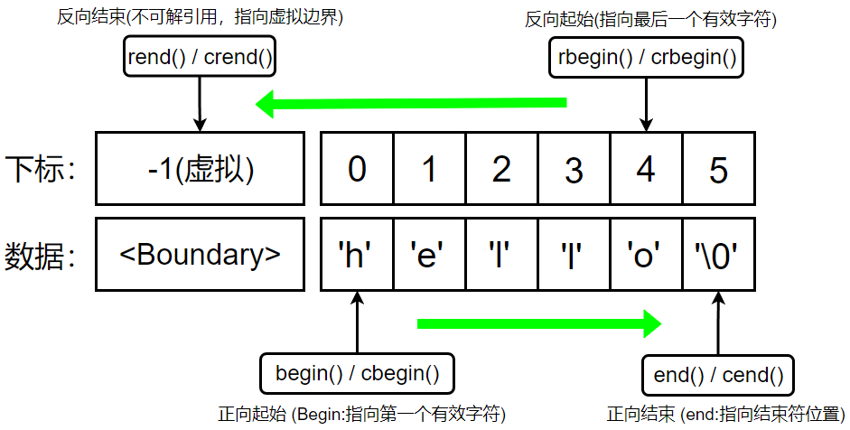
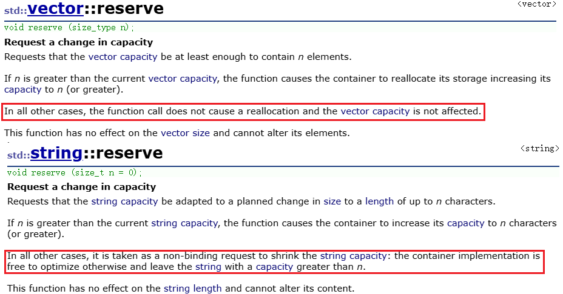
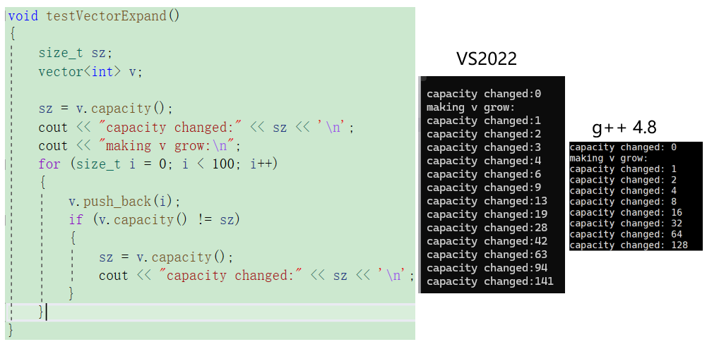
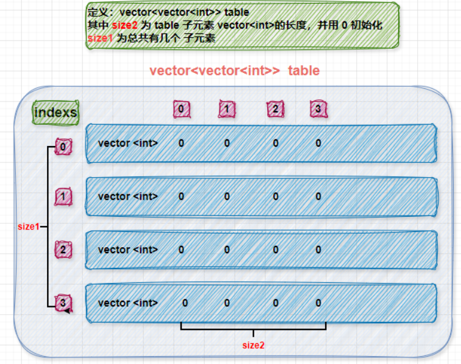

**Member types** 指的是该类内部定义的“类型别名”（Type Aliases）。这些别名是为了实现**泛型编程**，让外部代码（如算法和迭代器）能以统一的方式获取容器的特征（例如它存储的是什么类型、如何表示长度等）。

# `vector` Member types 详解表

| **成员类型 (Member type)**   | **定义 (Definition)**                    | **含义解释**                                                 |
| ---------------------------- | ---------------------------------------- | ------------------------------------------------------------ |
| **`value_type`**             | `T`                                      | **元素类型**。即 `vector<T>` 中的 `T`。例如 `vector<int>` 的 `value_type` 就是 `int`。 |
| **`allocator_type`**         | `Allocator`                              | **分配器类型**。负责内存管理的类，默认为 `std::allocator<T>`。 |
| **`size_type`**              | 通常为 `size_t`                          | **大小类型**。一个无符号整数，用来表示容器的大小、索引。在 64 位系统上通常是 `uint64_t`。 |
| **`difference_type`**        | 通常为 `ptrdiff_t`                       | **差值类型**。一个有符号整数，用来表示两个迭代器之间的距离。 |
| **`reference`**              | `value_type&`                            | **引用**。元素的引用类型，即 `T&`。                          |
| **`const_reference`**        | `const value_type&`                      | **常量引用**。只读引用，即 `const T&`。                      |
| **`pointer`**                | `allocator_traits<Alloc>::pointer`       | **指针**。指向元素的指针，通常是 `T*`。                      |
| **`const_pointer`**          | `allocator_traits<Alloc>::const_pointer` | **常量指针**。指向常量元素的指针，通常是 `const T*`。        |
| **`iterator`**               | 取决于具体实现                           | **迭代器**。指向元素，可读可写，行为类似 `T*`。              |
| **`const_iterator`**         | 取决于具体实现                           | **常量迭代器**。指向元素，只读，不能修改指向的内容。         |
| **`reverse_iterator`**       | `std::reverse_iterator<iterator>`        | **反向迭代器**。用于从后往前遍历。                           |
| **`const_reverse_iterator`** | `std::reverse_iterator<const_iterator>`  | **常量反向迭代器**。反向遍历且不可修改元素。                 |

**为什么要学习这些类型？**

你可能会觉得直接用 `int` 或 `int*` 就行了，为什么非要用 `value_type` 或 `iterator`？

1. **代码的可移植性和解耦**：

	如果你写一个处理容器的函数，使用 `vector<T>::size_type` 可以确保你的代码在任何操作系统（32位或64位）上都能正确匹配容器的长度类型，而不会出现溢出或匹配错误。

2. **泛型编程（模板）**：

	当你编写自己的函数模板处理各种容器时，你可以通过这些别名获取必要的信息。

# 一、**成员函数**（Member functions）

| **函数形式**   | **含义解释**      |
| -------------- | ------------------- |
| `explicit vector(const Allocator& = Allocator())`            | 创建一个**空**的 `vector`。可以传入自定义分配器，通常忽略。  |
| `explicit vector(size_type n, const T& val = T(), const Allocator& = Allocator())` |  创建一个包含 **`n`** 个元素的容器，每个元素都初始化为 **`val`**。 |
| `template <class InputIterator> vector(InputIterator first, InputIterator last, const Allocator& = Allocator())` | 使用两个迭代器指定的范围 `[first, last)` 来复制内容。        |
| `vector(const vector& x)`                                    |  创建一个与 `x` 完全相同的副本（深拷贝）。                    |
| **`(destructor)`**  | 析构函数。销毁容器并释放占用的内存。                         |
| **`operator=`**     | 赋值运算符。将一个 vector 的内容拷贝到另一个中。             |

```c++
// 1. 默认构造函数--创建一个空的 vector
vector<int> v1;
cout << "v1 size: " << v1.size() << " (Expected: 0)" << endl;

// 2. 填充构造函数--创建包含 5 个元素，每个值都为 100 的 vector
vector<int> v2(10, 100);
cout << "v2[0]: " << v2[0] << ", size: " << v2.size() << endl;

// 3. 范围构造函数--C++98 中常用数组指针作为迭代器来初始化 vector
int myInts[] = { 10, 20, 30, 40, 50 };
//vector<int> v3(++v2.begin(),--v2.end());
vector<int> v3(myInts, myInts + 5); // 复制数组中从开始到第 5 个元素之前的内容
cout << "v3 front: " << v3.front() << ", back: " << v3.back() << endl;

// 4. 拷贝构造函数--创建一个与 v3 完全相同的副本
vector<int> v4(v3);
cout << "v4 size: " << v4.size() << " (Should be same as v3)" << endl;

// 5. 赋值运算符--将 v2 的内容（10个100）覆盖掉 v4 原有的内容，满了会扩容
v4 = v2;
cout << "v4 after assignment, size: " << v4.size() << ", first element: " << v4[0] << endl;

// 6. 析构函数--当作用域结束（即执行到下面的 }）时，v1, v2, v3, v4 会自动调用析构函数释放内存
```

# 二、迭代器 (Iterators)

迭代器就像是“智能指针”，让你能指向并遍历容器内的元素。

| **函数**                | **功能描述**                                               |
| ----------------------- | ---------------------------------------------------------- |
| **`begin` / `end`**     | 返回指向**第一个元素**和**最后一个元素之后**位置的迭代器。 |
| **`rbegin` / `rend`**   | 返回**反向**迭代器，用于从后往前遍历。                     |
| **`cbegin` / `cend`**   | 返回只读（const）迭代器，不能通过它修改元素。              |
| **`crbegin` / `crend`** | 返回只读的反向迭代器。                                     |



迭代器这里，与之前学习的`string`基本一致，所以不做过多介绍，直接放一张图就ok，只需要将string那块的知识迁移过来就好了。

# 三、容量 (Capacity)

这些函数用于查询或调整 `vector` 占用的内存空间。

| **函数**            | **功能描述**                                                 |
| ------------------- | ------------------------------------------------------------ |
| **`size`**          | 返回当前容器中**实际存储的元素个数**。                       |
| **`max_size`**      | 返回系统支持的最大元素数量。                                 |
| **`resize`**        | 调整 `size`。如果变大，填充默认值；如果变小，截断多余元素。  |
| **`capacity`**      | 返回当前**已分配内存**能容纳的最大元素数（通常 $\ge size$）。 |
| **`empty`**         | 检查容器是否为空（`size == 0`）。                            |
| **`reserve`**       | **预留内存**。提前分配空间，防止后续插入时频繁触发内存重分配。 |
| **`shrink_to_fit`** | （C++11）请求释放多余的容量，使 `capacity` 等于 `size`。     |

这里主要对`resize`和`reserve`接口进行重点学习，这里与之前学习的接口略有出入：

## 3.1 resize

`std::vector::resize` 是一个非常核心的修改器接口。它的作用是改变容器中**有效元素的个数（`size`）**。

### 3.1.1 `resize` 接口详解 (C++98)

接口形式：`void resize (size_type n, value_type val = value_type());`

| **参数**  | **含义**                                                     |
| --------- | ------------------------------------------------------------ |
| **`n`**   | 你期望容器达到的新大小（新的 `size`）。                      |
| **`val`** | **可选参数**。如果 `n` 大于当前的 `size`，新增加的空位将用 `val` 的拷贝来填充。如果不传，则调用该类型的默认构造函数（如 `int` 默认为 `0`）。 |

### 3.1.2 `resize` 的三种逻辑情况

假设当前容器的 `size` 为 `old_size`：

- **情况 A：`n < old_size` (缩小)**

	容器会保留前 `n` 个元素，并**销毁**（调用析构函数）多出的元素。此时 `capacity` 通常保持不变。

- **情况 B：`old_size < n <= capacity` (扩容但不搬家)**

	容器会在现有内存的空闲区（size 之后，capacity 之前）直接构造新元素。`size` 变为 `n`。

- **情况 C：`n > capacity` (扩容且搬家)**

	容器必须先向分配器（Allocator）申请更大的内存块，将原有的元素**拷贝**过去，再构造新的元素。这会触发类似“容量改变”的逻辑。

### 3.1.3 特殊情况与易错点

#### ① `resize` vs `reserve`

这是最经典的混淆点：

- `reserve(n)` 只改 **Capacity**。它只是把地圈下来，并不盖房子（不创建对象）。
- `resize(n)` 同时改 **Size** 和 **Capacity**（如果需要）。它会实实在在地创建 `n` 个对象。

#### ② 缩容并不释放内存

当你调用 `v.resize(0)` 时，`v.size()` 会变成 0，所有元素都被析构了，但 `v.capacity()` 依然维持原样。

#### ③ 对“仅有无参构造函数”的要求

如果你自定义了一个类，但没有写默认构造函数（无参构造），那么你不能直接调用 `v.resize(10)`，因为 `vector` 不知道该怎么填充那些新位置。你必须显式传入一个对象：`v.resize(10, MyClass(arg));`。

### 3.1.4 测试代码演示

```C++
void test_vector3()
{
	vector<int> v(10, 5);
	v.reserve(20);
	cout << v.size() << endl;
	cout << v.capacity() << endl;

	v.resize(15,2);
	cout << v.size() << endl;
	cout << v.capacity() << endl;

	v.resize(25, 3);
	cout << v.size() << endl;
	cout << v.capacity() << endl;

	v.resize(5);
	cout << v.size() << endl;
	cout << v.capacity() << endl;
}
```

## 3.2 reserve

在 C++ STL 中，`std::vector` 和 `std::string` 的 `reserve` 接口虽然目标一致（都是为了预分配内存，减少重分配次数），但在具体实现细节和不同编译环境下的表现上存在细微差别。

### 3.2.1 `reserve` 接口的基本功能对比



| **特性**           | **std::vector::reserve**                    | **std::string::reserve**                                    |
| ------------------ | ------------------------------------------- | ----------------------------------------------------------- |
| **主要目的**       | 预留空间以存储特定数量的**元素**。          | 预留空间以存储特定数量的**字符**。                          |
| **对 Size 的影响** | 不改变 `size()`，只可能改变 `capacity()`。  | 不改变 `length()`/`size()`。                                |
| **缩减请求**       | 在 C++98 中，传入比当前小的容量通常被忽略。 | 在某些实现中，传入 0 或小于当前大小的值可能被视为缩减请求。 |

### 3.2.2 核心区别简述

1. **单位不同**：`vector<T>::reserve(n)` 预留的是 $n$ 个 `T` 类型对象的空间；`string::reserve(n)` 预留的是 $n$ 个字符的空间。
2. **空字符处理**：`std::string` 内部通常需要额外一个字节来存储结束符 `\0`（以兼容 C 风格字符串），因此 `string::reserve(n)` 实际分配的内存往往是 $n+1$。而 `vector` 则是精确分配。
3. **缩容行为**：
	- 对于 `vector`，调用 `reserve` 且参数小于当前 `capacity` 时，标准规定**不会**发生内存释放。
	- 对于 `string`，在旧标准（C++98/03）中，调用 `reserve()`（不带参数或带 0）被允许作为一种缩减容量的提示（尽管编译器不一定执行）。

### 3.2.3 不同环境下的表现差异

```c++
void testVectorExpand()
{
	size_t sz;
	vector<int> v;
	sz = v.capacity();
	cout << "capacity changed:" << sz << '\n';
	cout << "making v grow:\n";
	for (size_t i = 0; i < 100; i++)
	{
		v.push_back(i);
		if (v.capacity() != sz)
		{
			sz = v.capacity();
			cout << "capacity changed:" << sz << '\n';
		}
	}
}
```

使用这个测试代码验证不同环境下接口的表现，得到了如下结果：



扩容结果对比分析，从运行结果来看，虽然 `push_back` 的逻辑一致，但 `capacity`（容量）的增长倍率完全不同：

| **编译器环境**    | **扩容倍率（增长因子）** | **特点分析**                                                 |
| ----------------- | ------------------------ | ------------------------------------------------------------ |
| **VS2022 (MSVC)** | **约 1.5 倍**            | 序列为：1, 2, 3, 4, 6, 9, 13, 19, 28... 增长相对平缓。       |
| **g++ 4.8 (GCC)** | **2 倍**                 | 序列为：1, 2, 4, 8, 16, 32, 64, 128... 严格按 2 的幂次方增长。 |

我们可以总结出 `reserve` 的核心价值：

1. **避免频繁搬家**：由结果图可知，在不使用 `reserve` 时，插入 100 个元素，VS 触发了约 **12 次** 内存重分配，g++ 触发了 **7 次**。每次重分配都涉及“开辟新空间 -> 拷贝旧数据 -> 释放旧空间”，代价昂贵。
2. **性能预测**：如果你提前知道需要存储 100 个元素，直接调用 `v.reserve(100)`，那么 `capacity` 会直接跳到 100，后续 100 次 `push_back` 将零成本运行。

# 四、元素访问 (Element access)

这些函数用于获取容器中存储的具体值。

| **函数**         | **功能描述**                                                 |
| ---------------- | ------------------------------------------------------------ |
| **`operator[]`** | 下标访问，如 `v[0]`。速度最快，但不检查索引是否越界。        |
| **`at`**         | 带安全检查的访问。如果索引越界，会抛出 `out_of_range` 异常。 |
| **`front`**      | 返回第一个元素的引用。                                       |
| **`back`**       | 返回最后一个元素的引用。                                     |
| **`data`**       | 返回指向底层数组首地址的原始指针（`T*`）。                   |

对于嵌套容器 `std::vector<std::vector<int>> vv`，访问方式 `vv[i][j]` 的逻辑顺序是由内向外解析，但在内存布局上是**连续中的不连续**。



## 4.1 访问顺序的逻辑拆解

当你书写 `vv[i][j]` 时，编译器实际上执行了两步操作：

- **第一步：`vv[i]`**
	- 访问外层 `vector` 的第 `i` 个元素。
	- 返回的是一个 **`std::vector<int>` 对象的引用**（即代表了第 `i` 行）。
- **第二步：`[j]`**
	- 在第一步返回的那个 `vector` 对象上，继续访问它的第 `j` 个元素。
	- 返回的是最终的 **`int` 值的引用**。

## 4.2 内存布局：行与行之间不连续

这是理解嵌套 `vector` 最核心的点。与 C 语言的二维数组 `int arr[3][4]` 不同：

- **C 语言二维数组**：所有元素在内存中是**一整块连续**的。
- **嵌套 Vector**：
	- 外层 `vector` 存储的是多个 `vector` 对象，这些对象在内存中是连续的。
	- **关键点**：每个内层 `vector` 内部的 `int` 数据是连续的，但**行与行之间的内存地址通常是不连续的**，因为每一行都是独立通过 `Allocator` 申请的堆空间。

## 4.3 性能优化的“遍历顺序”

虽然逻辑上 `vv[i][j]` 先找行再找列，但在编写循环时，**顺序极其重要**：

#### 行优先遍历（最快）

这种方式符合 CPU 缓存逻辑，因为在处理同一行时，内存地址是连续的。

```C++
for (size_t i = 0; i < vv.size(); ++i)
{
    for (size_t j = 0; j < vv[i].size(); ++j) 
    {
        // 连续访问内存，命中率高
        cout << vv[i][j] << " ";
    }
}
```

#### 列优先遍历（最慢）

这种方式会导致 CPU 频繁在不同的堆内存块之间跳转（Cache Miss），性能大幅下降。

```C++
// 假设每行长度相同
for (size_t j = 0; j < vv[0].size(); ++j) {
    for (size_t i = 0; i < vv.size(); ++i) {
        // 每次访问都要跳到另一个独立的内存块
        cout << vv[i][j] << " ";
    }
}
```

## 4.4 配合范围 For 循环（带引用）

访问嵌套容器时，外层循环**必须使用引用**，否则每一行都会发生深拷贝：

```C++
for (const auto& row : vv) 
    // row 是第 i 行的引用，无拷贝
    for (const auto& val : row) 
        cout << val << " ";// 访问行内的元素
```

**总结：** `vv[i][j]` 的访问顺序是 **“先定位行容器的对象，再定位该容器内的元素”**。虽然写起来像二维数组，但在底层，它更像是一组散落在内存各处的“小抽屉”。

# 五、修改器 (Modifiers)

这些是动态改变 `vector` 内容最核心的函数。

| **函数**           | **功能描述**                                             |
| ------------------ | -------------------------------------------------------- |
| **`push_back`**    | 在末尾追加一个元素。                                     |
| **`pop_back`**     | 删除最后一个元素。                                       |
| **`insert`**       | 在指定位置插入一个或多个元素（会导致后续元素后移）。     |
| **`erase`**        | 删除指定位置或范围内的元素（会导致后续元素前移）。       |
| **`swap`**         | 交换两个 vector 的全部内容（效率极高）。                 |
| **`clear`**        | 清空所有元素，但通常不释放内存。                         |
| **`emplace`**      | （C++11）在指定位置**原地构造**元素，减少拷贝开销。      |
| **`emplace_back`** | （C++11）在末尾**原地构造**元素，比 `push_back` 更高效。 |

## 5.1 常用接口

```c++
void test_vector4()
{
	// 1. 初始化：创建一个包含 10 个 5 的 vector
	vector<int> v(10, 5);
	for (auto e : v) { cout << e << ' '; }
	cout << endl; // 输出: 5 5 5 5 5 5 5 5 5 5

	// 2. 插入与尾部追加
	// v.begin() 指向第一个 5 的位置，在其之前插入 100
	v.insert(v.begin(), 100);
	// 在容器当前末尾添加 99
	v.push_back(99);
	for (auto e : v) { cout << e << ' '; }
	cout << endl; // 输出: 100 5 5 5 5 5 5 5 5 5 5 99

	// 3. 定点插入
	// v.begin() + 2 指向索引为 2 的位置（即第三个元素）
	// 在该位置插入 88，原位置及之后的元素后移
	v.insert(v.begin() + 2, 88);
	for (auto e : v) { cout << e << ' '; }
	cout << endl; // 输出: 100 5 88 5 5 5 5 5 5 5 5 5 99

	// 4. 删除操作
	// 删除 v.begin() + 1 位置的元素（即删除第一个 5）
	v.erase(v.begin() + 1);

	// 区间删除：v.erase(first, last) 删除 [first, last) 范围内的元素
	// v.begin() + 2 指向当前的第二个 5
	// v.end() - 1 指向最后一个元素 99 的位置
	// 因此这里删除了中间所有的 5，但保留了最后的 99（因为是左闭右开区间）
	v.erase(v.begin() + 2, v.end() - 1);

	for (auto e : v) { cout << e << ' '; }
	cout << endl; // 输出: 100 88 99
    
    //尾删两次
	v.pop_back();
	v.pop_back();
	for (auto e : v) { cout << e << ' '; }
	cout << endl; // 输出: 100
}
```
输出结果：
```
5 5 5 5 5 5 5 5 5 5
100 5 5 5 5 5 5 5 5 5 5 99
100 5 88 5 5 5 5 5 5 5 5 5 99
100 88 99
100
```

## 5.2 复杂类型遍历中的“拷贝代价”与“引用之美”

在 C++ 中，`std::vector` 作为一个通用容器，其元素类型（`value_type`）具有极强的包容性。它不仅可以存储 `int`、`double` 等内置类型，还可以存储复杂的**自定义类对象**（如 `Student`、`Widget`）甚至是**嵌套容器**（如 `vector<vector<int>>`）。

在处理这些复杂类型时，使用 C++11 引入的**范围 for 循环（Range-based for loop）**，是否添加引用符号 `&` 会对程序性能和逻辑产生巨大影响。

### 5.2.1 为什么必须加引用？

当 `vector` 存储的是非内置类型时，范围 for 的底层逻辑会有所不同：

- **不加引用 `for (auto x : v)`**：

	循环的每一次迭代都会调用该类型的**拷贝构造函数**。如果容器内是 `vector<string>` 或 `vector<vector<int>>`，这意味着每一行数据都会被完整地“深拷贝”一份到临时变量 `x` 中。

- **加上引用 `for (auto& x : v)`**：

	循环变量 `x` 仅仅是容器内原数据的一个**别名**。没有内存分配，没有数据拷贝，只有指针层面的地址访问。

### 5.2.2 复杂类型对比表

| **元素类型**       | **不加引用 (auto x) 的开销**             | **加上引用 (auto& x) 的开销** |
| ------------------ | ---------------------------------------- | ----------------------------- |
| **`int` / `char`** | 拷贝 4/1 字节（几乎无感）                | 访问地址（性能相近）          |
| **`std::string`**  | **高**。涉及堆内存申请和字符串复制。     | **极低**。直接访问原字符串。  |
| **`vector<int>`**  | **极高**。整行数据在内存中重新排布复制。 | **极低**。直接操作原行数据。  |
| **自定义大对象**   | **极高**。调用复杂的构造函数。           | **极低**。无构造函数开销。    |

### 5.2.3 测试代码：复杂类型与嵌套 vector

下面的代码进行对比后可以让你直观看到，当 `vector` 存储 `string` 或 `vector<int>` 等复杂类型时，加不加 `&` 在性能和逻辑上的巨大差异。

```C++
void test_vector5()
{
	// 准备数据：存储复杂类型 string
	vector<string> v1;
	v1.push_back("apple");
	v1.push_back("banana");
	v1.push_back("cherry");

	// --- 示范 1：【错误/低效】传值遍历 (auto e) ---
	// 缺点：每一轮循环都会调用 string 的拷贝构造函数，产生一个临时副本 e。
	// 影响：如果字符串很长，或者 vector 很大，会消耗大量内存和 CPU 时间。
	cout << "Bad (Copy): ";
	for (auto e : v1)
	{
		e += "!"; // 修改的是副本 e，不会影响容器 v1 里的原字符串
		cout << e << " ";
	}
	cout << "\n验证 v1 是否被修改: " << v1[0] << " (原封不动)" << endl;

	// --- 示范 2：【正确/高效】引用遍历 (auto& e) ---
	// 优点：e 是原字符串的别名，没有拷贝开销。
	// 场景：当你需要修改容器内的元素时，必须用这个。
	cout << "Good (Ref): ";
	for (auto& e : v1)
	{
		e += " (fixed)"; // 直接修改容器内的原数据
		cout << e << " | ";
	}
	cout << "\n验证 v1 是否被修改: " << v1[0] << " (已修改)" << endl;

	// --- 示范 3：【最推荐/只读】常量引用遍历 (const auto& e) ---
	// 优点：既保证了零拷贝的高效率，又防止了在循环内不小心误改数据。
	// 场景：90% 的只读遍历场景都应该这样写。
	cout << "Best (Const Ref): ";
	for (const auto& e : v1)
		// e += "?"; // 如果取消注释，编译器会报错，保证了数据安全
		cout << e << " ";
	cout << endl;

	// --- 示范 4：嵌套容器场景 (vector<vector<int>>) ---
	vector<vector<int>> matrix(3, vector<int>(5, 1)); // 3行5列的1
	// 极其重要：外层循环如果不加引用，每行都会被深拷贝！
	for (const auto& row : matrix) // 必须用引用
	{
		for (auto val : row) // 内层是 int，加不加引用影响不大
			cout << val << " ";
		cout << endl;
	}
}
```

**核心笔记要点：**

1. **内置类型（int, char, double）**：直接用 `auto` 即可，因为拷贝一个整数比处理引用（指针）可能还快。
2. **复杂类型（string, vector, 自定义结构体）**：
	- **只想看数据**：用 `const auto&`（安全、高效）。
	- **需要改数据**：用 `auto&`（高效、直接）。
	- **坚决避免直接用 `auto`**：因为它会触发深拷贝，导致程序在处理大数据量时瞬间变慢。
3. **逻辑陷阱**：如果不加 `&`，你在循环体里对元素做的任何修改，在循环结束后都会**随着副本的销毁而消失**。

# 六、非成员函数重载 (Non-member overloads)

虽然不是成员函数，但它们在文档中常被提及，用于处理两个 vector 的关系。

- `relational operators`：如 `==`, `!=`, `<`, `>` 等，用于比较两个 vector。
- `std::swap`：特化版的全局交换函数。

# 七、源码阅读及模拟实现

```c++
#include <iostream>
```

