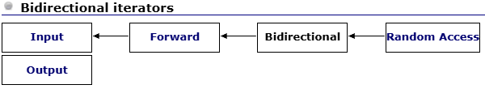
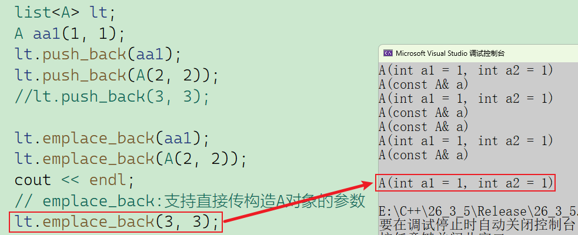
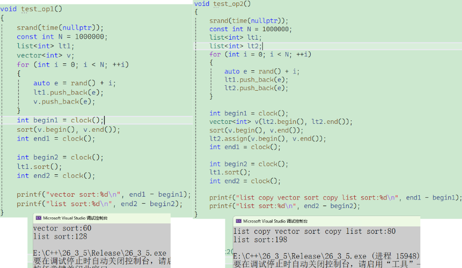
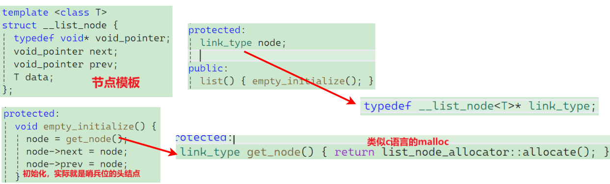
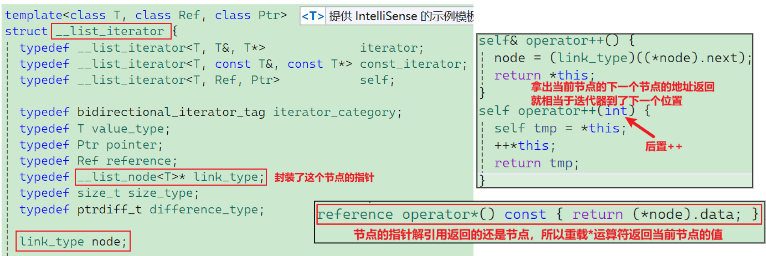
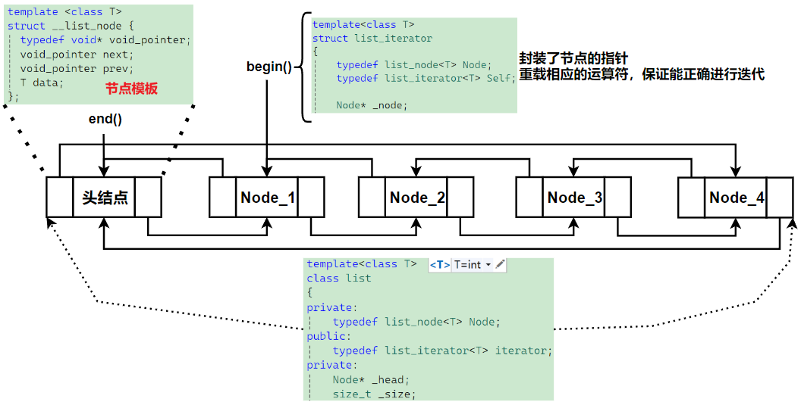
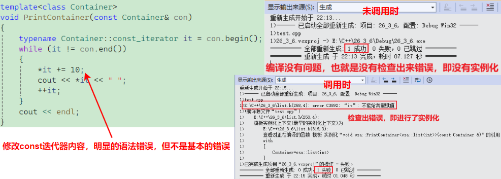
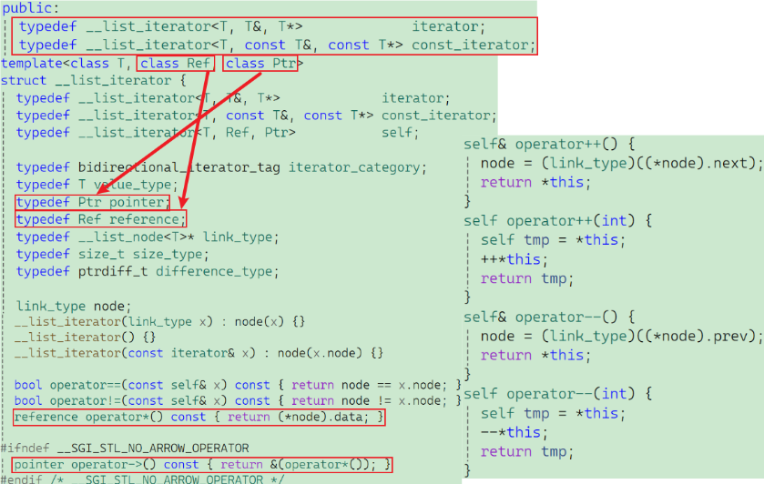
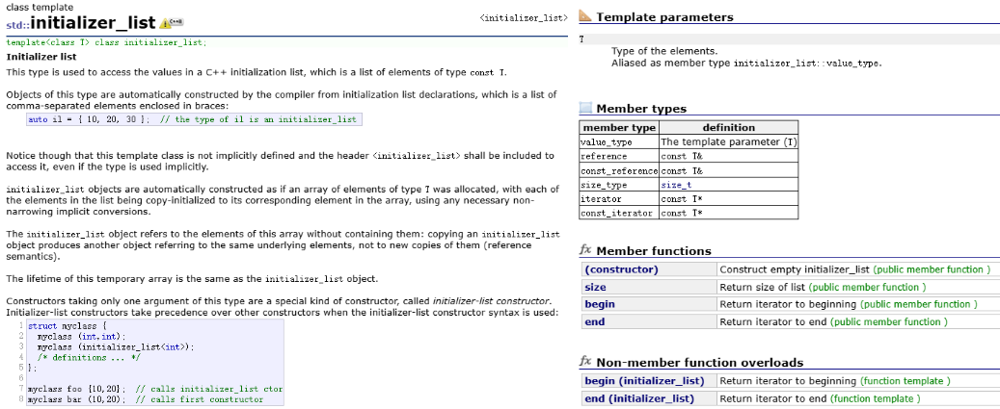

# 一、`std::list` Member types

| **成员类型**                 | **定义 (Definition)**                                        | **备注 (Notes)**                      |
| ---------------------------- | ------------------------------------------------------------ | ------------------------------------- |
| **`value_type`**             | 第一个模板参数 `(T)`                                         | 容器中存储的元素类型。                |
| **`allocator_type`**         | 第二个模板参数 `(Alloc)`                                     | 默认为 `allocator<value_type>`。      |
| **`reference`**              | `allocator_type::reference`                                  | 对于默认分配器：`value_type&`。       |
| **`const_reference`**        | `allocator_type::const_reference`                            | 对于默认分配器：`const value_type&`。 |
| **`pointer`**                | `allocator_type::pointer`                                    | 对于默认分配器：`value_type*`。       |
| **`const_pointer`**          | `allocator_type::const_pointer`                              | 对于默认分配器：`const value_type*`。 |
| **`iterator`**               | 指向 `value_type` 的**双向迭代器**                           | 可转换为 `const_iterator`。           |
| **`const_iterator`**         | 指向 `const value_type` 的**双向迭代器**                     | 用于只读操作。                        |
| **`reverse_iterator`**       | `reverse_iterator<iterator>`                                 | 反向迭代器。                          |
| **`const_reverse_iterator`** | `reverse_iterator<const_iterator>`                           | 只读反向迭代器。                      |
| **`difference_type`**        | 带符号整型，等同于： `iterator_traits<iterator>::difference_type` | 通常与 `ptrdiff_t` 相同。             |
| **`size_type`**              | 无符号整型，可以表示 `difference_type` 的任何非负值          | 通常与 `size_t` 相同。                |

## 1.1 迭代器分类

在 STL 中，迭代器是连接**容器**（数据）和**算法**（操作）的桥梁。根据迭代器的移动能力和操作权限，STL 将其分为五大类。以下是迭代器分类的总结表格及其代表性容器：

| **迭代器类型**     | **英文名称**           | **移动能力**       | **允许的操作**        | **代表性容器 / 对象**                                     |
| ------------------ | ---------------------- | ------------------ | --------------------- | --------------------------------------------------------- |
| **输入迭代器**     | Input Iterator         | ++                 | 只读，一次性操作      | `istream_iterator` (从输入流读取)                         |
| **输出迭代器**     | Output Iterator        | ++                 | 只写，一次性操作      | `ostream_iterator` (向输出流写入)                         |
| **前向迭代器**     | Forward Iterator       | ++                 | 读/写，支持多次遍历   | `forward_list` (单向链表), `unordered_set/map`            |
| **双向迭代器**     | Bidirectional Iterator | ++,--              | 读/写，双向移动       | **`list` (双向链表)**, `set / map`, `multiset / multimap` |
| **随机访问迭代器** | Random Access Iterator | ++, --, +, -, <, > | 读/写，像指针一样偏移 | `vector`, `deque`, `string`, 数组                         |

在 STL 的设计中，迭代器（Iterator）是对“指针”的一种抽象。为了让算法（如排序、查找、翻转）能适配不同的容器（如数组、链表、树），STL 根据迭代器的**移动能力**和**访问权限**将其严谨地分为五个等级。

针对三种最核心的迭代器，我们从**底层结构、操作符支持、性能特性**三个维度进行深度拆解：

### 1.1.1 前向迭代器

前向迭代器是单向移动的最基本形式，它保证了可以多次遍历同一范围（区别于输入/输出迭代器的一次性性质）。

- **底层物理模型**：**单链表 (`std::forward_list`)**。
- **移动限制**：只能执行 `++`。一旦跳过某个节点，除非重新从 `begin()` 开始，否则无法回到之前的节点。
- **支持的操作**：
	- `++it`, `it++` (向后移动)
	- `*it`, `it->` (读写访问)
	- `==`, `!=` (相等比较)
- **典型局限**：不支持 `--it`，不支持 `it + n`。
- **代表算法**：`std::replace`（替换）、`std::find`（查找）。这些算法只需要从头到尾扫一遍即可。

### 1.1.2 双向迭代器

`std::list`、`std::set` 和 `std::map` 所使用的迭代器类型。它在物理上要求容器的节点必须有指向“前驱”和“后继”的两个指针。

- **底层物理模型**：**双向链表 (`std::list`)** 或 **红黑树 (关联容器)**。
- **移动限制**：支持 `++` 和 `--`。你可以前后穿梭，但依然只能“一步一个脚印”。
- **支持的操作**：
	- **新增**：`--it`, `it--` (向前移动)
	- 继承自前向迭代器的所有操作（`++`, `*`, `==` 等）。
- **典型局限**：不支持随机跳转。如果你想访问中间位置，必须手动执行 `n` 次自增。例如：执行 `it = it + 5;` 会导致编译错误。
- **代表算法**：`std::reverse`（翻转）。翻转算法需要一个头指针往后走，一个尾指针往前走，直到相遇，因此必须支持 `--`。

### 1.1.3 随机访问迭代器

最高级的迭代器，拥有和原生指针（Raw Pointer）完全一致的能力。

- **底层物理模型**：**连续内存布局 (`std::vector`, `std::deque`, `std::string`)**。
- **移动特性**：支持 $O(1)$ 时间内的任意跨度跳转。
- **支持的操作**：
	- **新增跳转**：`it + n`, `it - n`, `it += n`, `it -= n`
	- **新增距离计算**：`it1 - it2` (计算两个迭代器之间差了几个元素)
	- **新增关系比较**：`<`, `>`, `<=`, `>=` (判断谁在谁的前面)
	- **下标访问**：`it[n]`
- **性能优势**：它是唯一能支撑“对数时间复杂度”算法的迭代器。
- **代表算法**：`std::sort`（排序）、`std::binary_search`（二分查找）。二分查找需要瞬间定位到 `mid`，只有随机访问迭代器能做到。

**总结与对比**



| **特性**        | **前向迭代器 (Forward)** | **双向迭代器 (Bidirectional)** | **随机访问 (Random Access)**     |
| --------------- | ------------------------ | ------------------------------ | -------------------------------- |
| **类比**        | **单行道上的路人**       | **可以后退的人**               | **瞬间移动的法师**               |
| **步进**        | 只能一步步向前           | 可以一步步前后移动             | 可以直接跳到任意目的地           |
| **代表容器**    | `forward_list`           | `list`, `set`, `map`           | `vector`, `deque`, `array`       |
| **计算 `dist`** | $O(n)$                   | $O(n)$                         | **$O(1)$**                       |
| **核心操作符**  | `++`                     | `++`, `--`                     | `++`, `--`, `+`, `-`, `<`, `[ ]` |

> 深度思考：为什么 `list` 不提供随机访问？
>
> 因为 `list` 的节点散落在内存各处，没有数学规律可循。如果你强行给 `list` 增加一个 `it + 5` 的操作，其实其内部还是要跑一个循环去数 5 个节点，这会给开发者一种“这个操作很快”的**错觉**。STL 的设计原则是：**不提供效率极低且容易误导的接口**。

## 1.2 迭代器选择

在 STL 的设计哲学（Generic Programming）中，**算法不关心容器是谁，只关心迭代器能做什么**。

要根据接口选择正确的迭代器，最核心的技巧是：**看算法模板参数的命名**和**看函数对位置操作的描述**。

### 1.4.1 识破接口背后的“潜规则”

`STL` 源码和文档在定义函数模板时，参数名通常直接揭示了它需要的迭代器等级。

| **模板参数命名示例**  | **隐含的迭代器要求** | **判断依据**                                                 |
| --------------------- | -------------------- | ------------------------------------------------------------ |
| `InputIt` / `InIt`    | **输入迭代器**       | 算法只会读取数据，且只遍历一次（如 `std::find`, `std::count`）。 |
| `ForwardIt` / `FwdIt` | **前向迭代器**       | 算法需要多次经过同一个位置（如 `std::replace`, `std::unique`）。 |
| `BidirIt` / `BiIt`    | **双向迭代器**       | 算法内部需要用到 `--it`（如 `std::reverse`, `std::next_permutation`）。 |
| `RandomIt` / `RanIt`  | **随机访问迭代器**   | 算法涉及距离计算或跨步跳转（如 `std::sort`, `std::nth_element`, `std::binary_search`）。 |

> 当你看到 `std::reverse(BidirIt first, BidirIt last)` 时，你就知道它需要从后往前走，所以你的容器必须支持反向移动。`list`（双向）可以，但 `forward_list`（单向）就不行。

### 1.4.2 依据操作逻辑进行“逻辑推理”

如果手头没有文档，可以通过算法的工作逻辑来反推：

**场景 A：需要“跳跃”或“算距离”**

- **逻辑**：算法里有没有 `+n`、`-n` 或者判断 `it1 < it2`？
- **结论**：只要涉及这些，**必须**使用 **随机访问迭代器**（`vector`, `deque`）。
- **典型错误**：尝试对 `list` 使用 `std::sort` 或 `std::binary_search`。因为这两个算法为了效率必须“跳着走”。

**场景 B：需要“后退”**

- **逻辑**：算法是否需要从末尾向开头处理？
- **结论**：只要有 `--it` 操作，**至少**需要 **双向迭代器**（`list`, `set`, `map`）。
- **典型算法**：`std::reverse`（翻转）。

**场景 C：只需要“路过”**

- **逻辑**：算法只是从头到尾扫一遍，改个值或者找个值。
- **结论**：**前向迭代器** 即可满足（所有常用容器都能胜任）。
- **典型算法**：`std::find`, `std::for_each`。

### 1.4.3 总结：三步选择法

当面对一个全新的 STL 接口时：

1. **查参数名**：看它是叫 `InputIt` 还是 `RandomIt`。
2. **看容器类型**：
	- `vector` / `deque` $\rightarrow$ 随便用，它是“全能选手”。
	- `list` / `set` / `map` $\rightarrow$ 只能用标注为 `Input`, `Forward`, `Bidir` 的算法。
	- `forward_list` $\rightarrow$ 只能用标注为 `Input`, `Forward` 的算法。
3. **找成员函数替代品**：如果一个全局算法（如 `std::sort`）不支持你的迭代器类型，**立刻检查容器是否有同名的成员函数**（如 `myList.sort()`）。

> 想象随机迭代器为3级，双向为2级，单向为1级，要求为双向迭代器的时候，就可以传2级或者3级迭代器，不可以传1级迭代器，也就是只能传 ≥ 当前需求等级的迭代器。

# 二、部分接口学习

`list` 的操作核心在于其**双向链表**的本质：不支持随机访问，但支持高效的节点转移和插入删除。

## 2.1 接口功能总表

| **接口**           | **分类** | **含义解析**                     | **关键特性**                                 |
| ------------------ | -------- | -------------------------------- | -------------------------------------------- |
| **`emplace_back`** | 修改器   | 在末尾直接构造元素。             | 避免临时对象拷贝，比 `push_back` 更高效。    |
| **`insert`**       | 修改器   | 在指定迭代器位置**前**插入元素。 | 插入后迭代器不失效。                         |
| **`erase`**        | 修改器   | 删除指定位置或区间的元素。       | 只有被删除节点的迭代器失效。                 |
| **`sort`**         | 成员操作 | 对链表元素进行排序。             | **必须使用成员函数版**，不能用 `std::sort`。 |
| **`merge`**        | 成员操作 | 合并两个**已排序**的链表。       | 合并后被合并的链表变为空。                   |
| **`unique`**       | 成员操作 | 连续去重（删除相邻重复元素）。   | 通常在 `sort` 之后调用。                     |
| **`splice`**       | 成员操作 | 节点接合（转移节点）。           | **$O(1)$** 性能，不涉及元素拷贝。            |

## 2.2 接口详解

### 2.2.1 emplace_back

在容器末尾就地构造元素，利用变参模板完美转发参数。(目前先了解这些，接口处有右值引用，后续接着学习)

**示例代码（结合结构体 A）：**

```C++
list<A> lt;
A aa1(1, 1);
lt.emplace_back(aa1);      // 传对象：调用拷贝构造
lt.emplace_back(3, 3);     // 传参数：直接调用构造函数，无拷贝/移动 (推荐)
```



### 2.2.2 insert

在**指定位置前**插入新元素。

| **重载形式**                    | **说明**                                        |
| ------------------------------- | ----------------------------------------------- |
| `iterator insert(pos, val)`     | 在 `pos` 前插入 `val`，返回指向新元素的迭代器。 |
| `void insert(pos, n, val)`      | 在 `pos` 前插入 `n` 个 `val`。                  |
| `void insert(pos, first, last)` | 在 `pos` 前插入 `[first, last)` 区间。          |

**示例代码：**

```C++
void test_list3()
{
	list<int> lt;
	lt.push_back(1);
	// ...
	lt.push_back(5);

	lt.insert(lt.begin(), 10);
	for (auto& e : lt)
		cout << e << " ";
	cout << endl;
	int x;
	cin >> x;
	it = find(lt.begin(), lt.end(), x);
	if (it != lt.end())
		lt.insert(it, 30);

	for (auto& e : lt)
		cout << e << " ";
	cout << endl;
}
```

### 2.2.3 erase

删除元素并释放空间。

| **重载形式**                  | **说明**                                          |
| ----------------------------- | ------------------------------------------------- |
| `iterator erase(pos)`         | 删除 `pos` 处的元素，返回**下一个位置**的迭代器。 |
| `iterator erase(first, last)` | 删除 `[first, last)` 区间，返回 `last`。          |

**注意**：在循环中使用 `erase` 时，必须用 `it = lt.erase(it)` 来更新迭代器，防止迭代器失效。

### 2.2.4 sort

由于 `list` 迭代器不是随机访问类型，无法使用 `std::sort`。

| **重载形式**                                       | **说明**                                            |
| -------------------------------------------------- | --------------------------------------------------- |
| `void sort()`                                      | 默认升序（使用 `<` 比较）。                         |
| `template <class Compare> void sort(Compare comp)` | 使用自定义谓词（如 `greater<int>()`）进行降序排序。 |

**性能补充**：

`list::sort` 在处理百万级数据时比 `vector` 排序慢得多。你的代码展示了一个极佳的技巧：**先拷贝到 `vector` 排序，再写回 `list`**，这通常比直接用 `list::sort` 更快。



> 测试性能的时候**不要使用debug版本**，不具有参考价值，优化没有全开，优化不到位。
>
> `vector`底层`sort`是快排，是递归，需要增加很多调试信息和栈帧等很多东西，所以递归在debug版本上很吃亏，所以**算法库的`sort`**还不及`list`的`sort`。

### 2.2.5 merge & unique

这两者通常与排序配套使用。

| **接口**              | **说明**                                                     |
| --------------------- | ------------------------------------------------------------ |
| `void merge(list& x)` | 将 `x` 合并入当前链表。**前提：两者必须已经有序**。          |
| `void unique()`       | 删除**连续**重复元素。（如果不是有序情况，不能将所有重复去除干净） |

**示例代码：**

```C++
l1.sort(); 
l2.sort();
l1.merge(l2); // l1 现在包含所有元素且有序，l2 为空
l1.unique();  // 去除重复
```

### 2.2.6 splice (接合)

`list` 的灵魂接口。它可以将一个链表的节点“剪切”并“粘贴”到另一个位置，而不产生任何内存分配或拷贝。

| **重载形式**                           | **说明**                                   |
| -------------------------------------- | ------------------------------------------ |
| `void splice(pos, other)`              | 将 `other` 全体转移到 `pos` 前。           |
| `void splice(pos, other, it)`          | 将 `other` 中的 `it` 节点转移到 `pos` 前。 |
| `void splice(pos, other, first, last)` | 将 `other` 的 `[first, last)` 区间转移。   |

**代码妙用**：“将选定元素移至开头”的功能，这是 **LRU 缓存**等算法的核心逻辑，就可以使用`splice`接口实现。

上面只是对接口进行简单的学习使用，在接下来的模拟实现再去了解底层和一些坑点。

# 三、模拟实现

## 3.1 stl源码阅读



从源码可以看出`list`底层就是类似于**双向带头循环链表**，只不过分别对节点，链表，迭代器进行了不同的封装和`typedef`。



## 3.2 具体实现逻辑

> 这个图是大致实现后画的！



通过前期对数据结构和C++的学习，可以简单将整个`list`拆分为这几个板块（不全，后面学完会在后面补）：节点、链表、迭代器。

### 3.2.1 节点设计

这是链表的物理基础，负责存储数据和维持链接关系。

```C++
template<class T>
struct list_node
{
    T _data;
    list_node<T>* _next;
    list_node<T>* _prev;
    // ... 构造函数
};
```

- **核心亮点**：使用了 `struct` 而不是 `class`。在 C++ 中，`struct` 的默认访问权限是 `public`，这非常适合作为内部节点使用，因为 `list` 和 `list_iterator` 需要频繁直接访问它的 `_next` 和 `_prev` 指针。
- **缺省值初始化**：`list_node(const T& data = T())`，利用匿名对象 `T()` 作为缺省值，兼容了内置类型（如 `int()` 为 0）和自定义类型的无参构造，也解决了有时候写了带参数构造，但没有合适的默认构造可用。

### 3.2.2 迭代器设计

为什么原生指针 `Node*` 不能直接做迭代器？因为 `Node*` 执行 `++` 操作时，它在**内存**中只会**往后挪动一段字节**，而**链表的物理内存是不连续的**！

所以必须**将 `Node*` 封装成了 `list_iterator` 类，并重载了运算符**，让它“看起来和用起来”像个指针：

```c++
template<class T>
struct list_iterator
{
    typedef list_node<T> Node;
    typedef list_iterator<T> Self;
    Node* _node;
    
    list_iterator(Node* node)
        :_node(node)
    { }
    
    T& operator*() { return _node->_data; }
    Self& operator++() { _node = _node->_next; return *this; }
    Self& operator--() { _node = _node->_prev; return *this; }
    bool operator!=(const Self& it) const { return _node != it._node; }
    bool operator==(const Self& it) const { return _node == it._node; }
};
```

- **`operator*()`**：

	```C++
	T& operator*() { return _node->_data; }
	```

	当执行 `*it` 时，它返回的是节点内部数据的**引用**（`T&`）。这意味着不仅能读取数据，还能直接修改数据（比如 `*it = 10;`）。

- **`operator++()` 和 `operator--()`**：

	```C++
	Self& operator++() { _node = _node->_next; return *this; }
	```

	这就是迭代器的魔法所在！表面上是 `++it`，底层其实是 `_node = _node->_next`，完美实现了顺着指针往下走的操作。实现的是**前置递增/递减**，返回的是自身的引用。

- **比较运算符 `!=` 和 `==`**： 本质上就是比较内部包装的 `Node*` 指针的地址是否相同。

> 这里没有实现`const_iterator`！

### 3.3.3 容器管理：`list` 核心类

这里需要实现一个**带哨兵位头节点（Dummy Head）的双向循环链表**。

```c++
template<class T>
class list
{
private:
	typedef list_node<T> Node;
public:
	typedef list_iterator<T> iterator;
	iterator begin() { return iterator(_head->_next); }
	iterator end() { return iterator(_head); }
	// 无参构造初始化
	list()
	{
		_head = new Node(T());
		_head->_next = _head;
		_head->_prev = _head;
		_size = 0;
	}
private:
	Node* _head;
	size_t _size;
};
```

> 源码中是没有`_size`这个变量的，这里只是为了到时候实现`size()`和`empty()`的时候方便一点，实现的时候就不需要去遍历迭代器了。

**构造函数与迭代器边界**

```C++
list() {
    _head = new Node(T());
    _head->_next = _head;
    _head->_prev = _head;
    _size = 0;
}
iterator begin() { return iterator(_head->_next); }
iterator end()   { return iterator(_head); }
```

- **哨兵位 `_head`**：这个节点不存储有效数据。它的存在极大地方便了插入和删除操作，因为再也不用写单链表中的 `if (head == nullptr)` 这种特判逻辑了。
- **`begin()` 与 `end()` 的精妙之处**：
	- 第一个有效元素是 `_head->_next`，所以 `begin()` 返回它。
	- 最后一个有效元素是 `_head->_prev`。在 STL 中，`end()` 必须指向**最后一个元素的下一个位置**。因为是循环链表，最后一个元素的下一个位置刚好又是 `_head`！所以 `end()` 返回 `_head` 非常方便。

**高复用: `insert` 与 `erase`**

链表操作的本质：**所有的插入最后都是在某个节点前插入（`insert`），所有的删除最后都是删除某个节点（`erase`）**。

- 在 `insert(pos, val)` 中，只需要熟练的进行 4 次指针修改，将 `newnode` 挂接在了 `prev` 和 `cur` 之间。
- 在 `erase(pos)` 中，只需要将`pos`位置前后的节点连接，并将`pos`的节点`delete`掉。
- 在 `push_back`, `push_front`, `pop_back`, `pop_front` 中，你直接复用了 `insert` 和 `erase`，代码极其优雅：
	- 尾插 `push_back`：就是在 `end()` 之前插入。
	- 尾删 `pop_back`：就是删除 `end()` 的前一个节点（用了 `--end()`）。

> 此时就很好的凸显了结构的优势，此结构就可以实现在常数级的复杂度下插入删除。

### 3.3.4 补充 : operator->

在 C++ 中，`->`（箭头运算符）的重载机制与其他所有运算符（如 `+`, `-`, `*`）都不同。它具有一种**“传递性（Cascading / Drilling down）”**。

**物理意义：它到底返回了什么？**

```C++
const T* operator->() { return &_node->_data; }
```

- **动作解析**：`_node->_data` 取出了当前节点里存放的实际对象（比如你的 `AA` 对象）。然后前面加个 `&`，取到了这个**对象的原生内存地址**。
- **返回值**：它返回的是一个标准的 C/C++ 原生指针（Raw Pointer），即 `T*`（或者像你代码里写的 `const T*`）。

**消失的第二个箭头去哪了？**按照正常的 C++ 运算符重载逻辑，当我们写下 `ita->_a1` 时，编译器应该这样生硬地翻译：

- `ita->` 等价于函数调用 `ita.operator->()`。既然 `ita.operator->()` 返回的是一个 `AA*` 原生指针。那么要访问指针指向的 `_a1` 成员，我们就必须**再写一个箭头**！理论上极其反人类的严格写法：`ita->->_a1`。

**但为什么我们只需要写一个 `->` 呢？**

这是因为 C++ 祖师爷在设计这门语言时，为了让**迭代器和智能指针的行为看起来和原生指针一模一样**，特意给 `->` 运算符开了一个巨大的“后门”（特例规则）：

> **C++ 标准规定：**
>
> 当对一个对象使用 `->` 运算符时，如果重载的 `operator->` 返回的是一个**原生指针**，编译器会自动帮你再追加一个隐式的 `->` 操作，去解引用那个原生指针。

所以，编译器的内部翻译过程是这样的：

1. 你写下：`ita->_a1`
2. 编译器展开第一层（调用重载函数）：`ita.operator->()` $\Rightarrow$ 得到 `AA*`
3. 编译器自动追加第二层（解引用原生指针）：`(AA*)->_a1`
4. 最终完全展开的形态，就是你代码里注释写的那行：`ita.operator->()->_a1`

**为什么一定要重载 `operator->`？**

你可能会问：既然我已经重载了 `operator*`，我用 `(*ita)._a1` 不也能访问吗？为什么非要搞个 `->`？确实，`(*ita)._a1` 在语法上是完全可行的：

- `*ita` 调用 `operator*` 返回 `AA&`（对象的引用）。
- 通过 `.` 运算符访问成员 `_a1`。

**答案还是为了“代码的自然与可读性”：**

在 C/C++ 程序员的肌肉记忆里，操作指针最自然的方式就是 `ptr->member`，而不是加上括号的 `(*ptr).member`。如果没有 `operator->` 的重载，当我们在容器里存放结构体或类对象时，代码会被满屏幕的 `(*it).xxx` 淹没，非常难看。

如果你在普通的 `iterator` 里返回 `const T*`，那么用户就只能读取数据，不能修改数据（比如 `ita->_a1 = 10;` 会报错）。

在标准的 STL 实现中，通常会拆分成两个版本：

1. **普通迭代器 (`iterator`)**：

	```C++
	T* operator->() { return &_node->_data; }
	```
	
2. **常迭代器 (`const_iterator`)**：

	```C++
	const T* operator->() const { return &_node->_data; }
	```

**总结一下**：通过重载 `operator->` 返回对象的地址，配合 C++ 编译器的“自动追加箭头”魔法，完美模拟了原生指针的行为。

实现了`const`迭代器和普通迭代器之后，就可以实现一个通用的打印容器的模板函数了：

```c++
template<class Container>
void PrintContainer(const Container& con)
{
    typename Container::const_iterator it = con.begin();
    while (it != con.end())
    {
        cout << *it << " ";
        ++it;
    }
    cout << endl;
}
```

这样就不会出现传入普通对象而无法支持范围for的情况了。

### 3.3.5 补充：按需实例化

C++ 模板机制中有一个极其核心且充满智慧的设计，叫做**按需实例化（On-demand Instantiation）**，也被称为**隐式实例化（Implicit Instantiation）**或“延迟编译”。

简单来说就是：**编译器非常“懒”，对于模板类，你用到了哪个成员函数，它就只编译（实例化）哪个成员函数。你没用到的代码，哪怕里面有荒谬的语法错误（只要不属于基本的词法/语法格式错误），编译器都会直接无视它。**

当编译器遇到一个模板类（比如打印容器的模板函数）时，它会进行两次检查：

1. **第一阶段（模板定义阶段，发生在实例化之前）**：
	- 编译器只做最基础的**语法骨架检查**。比如有没有漏写分号、括号匹不匹配、关键字拼写对不对。
	- 它**不会**去检查跟模板参数 `T` 相关的深层逻辑，因为它此时还不知道 `T` 是什么。

2. 第二阶段（模板实例化阶段，发生在你调用时）

	1. **实例化函数模板本身**： 当你写下 `PrintContainer(lt);` 时，编译器推导出了 `lt` 的具体类型（假设是 `list<int>`），于是它提取模板图纸，**实例化了 `PrintContainer<list<int>>` 这个函数本身**。
	2. **按需实例化被调用的类成员函数**： **关键点来了**：虽然编译器为了执行这个函数，已经知道了 `lt` 是 `list<int>` 类，但此时它**依然没有**实例化 `list<int>` 类的所有成员函数！ 在 `PrintContainer` 函数内部，因为你只写了 `c.begin()`、`c.end()` 以及迭代器的 `++` 和 `*` 操作，编译器就**顺藤摸瓜，只去编译并生成** `list<int>::begin()`、`list<int>::end()` 以及迭代器相关操作的机器码。
	3. **其他未调用的成员依然是“空气”**： 只有当你在代码的其他地方（比如 `main` 函数里）明确写下 `lt.push_back(1);` 时，编译器才去把 `list` 类中 `push_back` 这个函数的代码里的 `T` 替换成 `int`，并生成最终的机器码。 如果你从头到尾都没写过 `lt.insert()` 或者 `lt.erase()`，那么在编译器眼里，`list<int>` 的 `insert` 和 `erase` 就如同不存在一样，根本不会产生任何汇编指令。




### 3.3.6 补充：迭代器优化

目前实现的 `list_iterator` 已经完全抓住了链表迭代器的**核心灵魂**：即通过封装节点指针（`Node*`），并在内部重载 `++`、`--`、`*`、`->` 等运算符，使得离散的链表节点能够在语法上像连续数组的指针一样被遍历。但在真正的 STL 源码中，标准库的迭代器实现要比现在实现的版本多出几个关键的“工业级”设计。在之前实现的迭代器，是两个模板，但实际只有部分接口的返回值不一样。

**核心差异：**

- **痛点**：写了两个几乎一模一样的 `struct`，总计近 200 行代码，只为了区分 `T&` 和 `const T&`。

- **STL 的解法**：STL 源码中**绝不会**出现 `list_const_iterator` 这种独立的类。它通过引入三个模板参数 `template<class T, class Ref, class Ptr>`，将两个类完美融合成了一个！

**STL 风格的代码演示：**

```C++
// 增加 Ref 和 Ptr 模板参数
template<class T, class Ref, class Ptr>
struct list_iterator
{
    typedef list_node<T> Node;
    typedef list_iterator<T, Ref, Ptr> Self; // 自身类型
    
    Node* _node;

    list_iterator(Node* node) : _node(node) {}
    // 返回值由写死的 T& 变成了模板参数 Ref
    Ref operator*() { return _node->_data; }
    // 返回值由写死的 T* 变成了模板参数 Ptr
    Ptr operator->() {  return &_node->_data; }
    // ... 其他 ++, --, ==, != 逻辑与你写的完全一致
};
```



**在 `list` 类中的配合：**

```C++
template<class T>
class list {
public:
    // 一键生成两种迭代器，拒绝代码复制！
    typedef list_iterator<T, T&, T*>             iterator;
    typedef list_iterator<T, const T&, const T*> const_iterator;
    // ...
};
```

### 3.3.7 补充：迭代器失效

迭代器失效的本质是：**迭代器底层包装的指针所指向的内存空间被释放了，或者其逻辑意义发生了改变，导致该迭代器变成了一个“野指针（悬空指针）”。**但是，得益于 `std::list` **底层是双向链表**的物理结构，它的迭代器失效规则比 `std::vector` 要简单和宽松得多！

**List 的失效规则总结**——对比 `vector` 动不动就“全军覆没”的失效机制，`list` 可以说是非常坚挺了：

| **操作类型**                            | **迭代器是否失效**           | **底层原因剖析**                                             |
| --------------------------------------- | ---------------------------- | ------------------------------------------------------------ |
| **插入操作** (`insert`, `push_back` 等) | **绝不失效**                 | 只是在堆区 `new` 了一个新节点并修改了相邻节点的前后指针，**原有的节点内存地址全都没有变**。 |
| **转移操作** (`splice`)                 | **绝不失效**                 | 节点从一个链表被“摘下”挂到另一个链表，节点本身的物理内存没变，迭代器依然指向那个节点。 |
| **删除操作** (`erase`, `pop_back` 等)   | **仅被删除的那个迭代器失效** | 被删除的节点执行了 `delete` 操作，内存归还给了系统。指向它的迭代器变成了野指针。其他节点的迭代器不受影响。 |
| **清空操作** (`clear`)                  | **全部失效**                 | 所有有效节点都被释放了（除了哨兵位头节点 `end()`）。         |

**场景一：插入不失效**

在 `vector` 中，如果发生扩容，底层数组会整体搬家，之前所有的迭代器全部作废。即使不扩容，在中间 `insert` 也会导致插入点之后的所有元素往后挪，后面的迭代器逻辑意义也会失效。但 `list` 完全没有这个烦恼：

```C++
void test_list2()
{
    list<int> lt;
    lt.push_back(1);
    lt.push_back(2);
    lt.push_back(3);
    lt.push_back(4);	
    auto it = lt.begin();   // 指向1
    lt.push_front(10);      // list:10 1 2 3 4
    *it += 100;             // list:10 101 2 3 4
    PrintContainer(lt);     // 10 101 2 3 4
}
```

**删除导致的失效（最常见的Bug）**——虽然 `list` 只有被删除的节点会失效，但在**循环中边遍历边删除**时，极其容易写出导致程序崩溃的代码。

典型的错误写法——假设要删除链表里所有的偶数：

```C++
list<int> lt = {1, 2, 3, 4, 5};
auto it = lt.begin();
while (it != lt.end())
{
    if (*it % 2 == 0)
        lt.erase(it);   // 此时节点已经被释放，所以这个指针已经成为了野指针
    it++;               // 如果此时继续对 it 进行 ++，标准的野指针访问
}
```

**底层原理解析**：当你调用 `erase(it)` 时，底层执行了 `delete it._node;`。此时 `it` 内部的指针已经指向了一片被操作系统回收的垃圾内存。你再对它执行 `++it`（即 `_node = _node->_next`），就是在访问非法内存。

**正确写法**——为了解决这个问题，STL 的 `erase` 接口设计得非常有心机：**它会返回被删除元素的下一个位置的迭代器。**所以我们修改已经实现的`erase`接口，将迭代器位置更新。

```c++
iterator erase(iterator pos)
{
    assert(pos != end());
    Node* prev = pos._node->_prev;
    Node* next = pos._node->_next;
    prev->_next = next;
    next->_prev = prev;
    delete pos._node;
    --_size;
    return iterator(next);//返回被删除元素的下一个迭代器
}
```

这里顺手也就给`insert`接口一起修改，使用文档显示插入后返回一个指针，指向新插入元素中的第一个元素(这里只实现了一个`insert`方法，所以只需要返回插入的这个元素的迭代器就好，如果写了别的重载接口，可能就不是插入的这个元素的迭代器，而是第一个插入的元素的迭代器)：

```C++
iterator insert(iterator pos, const T& val)
{
    Node* cur = pos._node;
    Node* prev = cur->_prev;
    Node* newnode = new Node(val);

    newnode->_next = cur;
    cur->_prev = newnode;
    prev->_next = newnode;
    newnode->_prev = prev;
    ++_size;
    return iterator(newnode);//返回插入这个元素的迭代器
}
```

**vector 和 list 的迭代器失效问题。**

1. **对于 `vector` (连续内存)**：插入操作可能导致扩容，使所有迭代器失效；即使不扩容，插入和删除也会导致该位置及**其后**的所有迭代器失效（因为元素发生了内存搬移）。
2. **对于 `list` (离散节点)**：因为底层是双向链表，节点的内存是独立分配的。所以**插入操作绝对不会导致任何迭代器失效**。**删除操作只会导致当前被删除的那个迭代器失效**，其他迭代器依然有效。
3. **解决方案**：在循环删除时，千万不能对已经被 `erase` 的迭代器执行 `++`。必须使用 `it = list.erase(it);` 来接住它返回的下一个安全位置的迭代器。

### 3.3.8 补充：构造、析构、赋值重载

```c++
void empty_init() 
{
    _head = new Node(T());
    _head->_next = _head;
    _head->_prev = _head;
    _size = 0;
}
```

- **核心动作**：分配一个**不存储有效数据**的头节点（哨兵位/Dummy Node），并让它的前驱和后继指针都指向自己，形成一个**闭环**。
- **为什么一定要抽离出来？**——不仅“无参构造函数”需要创建一个空链表，“拷贝构造函数”在拷贝别人之前，也必须先把自己初始化为一个合法的空链表！如果没有这个函数，你就会在两个构造函数里写重复的代码。

**无参构造与深拷贝**

**默认构造 (Default Constructor)**

```c++
list() { empty_init(); }
```

非常干净利落，直接调用 `empty_init()`。此时链表处于合法且为空的状态，`begin()` 和 `end()` 都指向 `_head`。

**拷贝构造 (Copy Constructor)**

```c++
list(const list<T>& lt) 
{
    empty_init();
    for (auto& e : lt)
        push_back(e);
}
```

这里有**两个细节**：

1. **必须先调用 `empty_init()`**：在进入拷贝构造函数时，`_head` 还是一个未初始化的野指针。如果不先初始化哨兵位，直接调用 `push_back(e)`，程序会立刻崩溃（因为 `push_back` 内部会访问 `_head->_prev`）。
2. **深拷贝 (Deep Copy)**：链表不能像数组那样直接用 `memcpy` 拷贝内存。通过基于范围的 `for` 循环（底层是迭代器遍历），将源链表 `lt` 中的数据依次取出，并通过 `push_back` **重新 `new` 出新的节点**挂到自己的链表上。这就保证了两个链表拥有完全独立的物理内存。

**资源清理：`clear()` 与 `~list()` 的分工**

很多人会把清空数据和销毁对象混为一谈，但实际上它们的职责必须划分得非常清晰：

**① `clear()` —— “清空数据”**

```C++
void clear() 
{
    auto it = begin();
    while (it != end())
        it = erase(it); //会自动指向下一个元素
}
```

- **语义**：把链表里的**有效数据全部杀光**，但是**保留哨兵位 `_head`**。
- **状态变化**：调用 `clear()` 后，恢复到了刚调用完 `empty_init()` 时的状态。依然可以继续往里面 `push_back` 新数据，并没有释放所有占用的堆区内存。

**② `~list()`**

```C++
~list() 
{
    clear();
    delete _head;
    _head = nullptr;
}
```

- **语义**：对象的生命周期结束，必须释放所有占用的堆区内存，连哨兵位也一并清除。指针置空 (`_head = nullptr`)，防止悬空指针引发二次释放错误。

**赋值重载**——通过之前学习的高效写法，直接将底层指针进行交换。

**① `swap` 函数**

```C++
void swap(list<T>& lt) 
{
    std::swap(_head, lt._head);
    std::swap(_size, lt._size);
}
```

- **原理解析**：链表的核心就是那个哨兵位头指针 `_head`。交换两个链表，根本不需要挨个节点去搬运数据，只需要交换它们的 `_head` 指针和记录大小的 `_size` 即可。这是一个极其高效的 **$O(1)$** 操作。

**② `operator=` (Copy-and-Swap)**

```C++
// 注意看这里的参数：是传值 (list<T> lt)，而不是传引用！
list<T>& operator=(list<T> lt) 
{
    swap(lt);
    return *this;
}
```

假设你执行了 `lt1 = lt2;`，编译器在底层的执行流程是：

1. **第一步：利用拷贝构造进行克隆**

	因为参数是传值的 `list<T> lt`，所以当你把 `lt2` 传进来时，编译器会自动调用你之前写的**拷贝构造函数**，在栈区生成一个局部的、完全独立的 `lt`（它是 `lt2` 的完美克隆体），这里传引用会破坏掉之前`lt2`的数据。

2. **第二步：利用 `swap`**进行交换

	进入函数体后，执行 `swap(lt);`。此时，`lt1`（就是 `this`）迅速把自己的旧数据塞给了局部的 `lt`，然后拿到了 `lt` 刚克隆好的全新数据。

3. **第三步：利用析构函数清理克隆体**

	函数执行到 `}` 结束，局部对象 `lt` 的生命周期到期，自动调用 `~list()` 函数，此时 `lt` 里正好是 `lt1` 以前的数据，析构函数清理掉这些堆空间内存！

**优势总结：**

- **代码复用率极高**：没有写一行重复的深拷贝逻辑，全靠压榨拷贝构造和析构函数。
- **绝对安全**：如果 `lt1 = lt1`，虽然多了一次无意义的拷贝，但绝对不会像传统写法那样因为先 `clear` 自己而导致数据彻底丢失。

**宏观汇总：自定义 `list` 的生命周期闭环**

| **阶段** | **触发条件**        | **调用的函数**   | **核心动作**                                 | **依赖的底层函数**                   |
| -------- | ------------------- | ---------------- | -------------------------------------------- | ------------------------------------ |
| **诞生** | `list<int> l1;`     | **无参构造**     | 开辟一片纯净的领地。                         | `empty_init()`                       |
| **繁衍** | `list<int> l2(l1);` | **拷贝构造**     | 先开辟领地，再把 `l1` 的数据逐个深拷贝过来。 | `empty_init()`, `push_back()`        |
| **交接** | `l1 = l3;`          | **赋值重载**     | 召唤局部克隆体，夺取新数据，甩锅旧数据。     | **拷贝构造**, `swap()`, **析构函数** |
| **清空** | `l1.clear();`       | **普通成员函数** | 杀光所有数据节点，但保留哨兵位。             | `erase()`                            |
| **消亡** | 对象离开作用域      | **析构函数**     | 先清空数据，最后连哨兵位一起销毁。           | `clear()`, `delete`                  |

### 3.3.9 补充：initializer_list

这是 C++11 引入的一项极其重要的跨时代特性，叫做 **统一初始化 (Uniform Initialization)**。

而支撑这个大括号 `{...}` 语法的幕后功臣，就是一个非常轻量级的标准库模板类：`std::initializer_list`。



**什么是 `initializer_list`？**

简单来说，当编译器在代码中看到用大括号 `{}` 括起来的一组同类型数据时，它会自动在后台做两件事：

1. **开辟一块临时的连续内存（常量数组）**，把大括号里的数据存进去。
2. **生成一个 `std::initializer_list<T>` 对象**，这个对象本质上只是一个“轻量级的视图”，它内部包了两个指针，指向刚才那块临时数组的开头和结尾。

它的接口非常极简，因为它的定位只是一个“临时搬运工”，所以它的接口少得可怜：

| **接口名称**  | **作用解析**                                         |
| ------------- | ---------------------------------------------------- |
| **`size()`**  | 返回大括号里元素的个数。                             |
| **`begin()`** | 返回指向临时数组第一个元素的常量指针（`const T*`）。 |
| **`end()`**   | 返回指向临时数组末尾后一个位置的常量指针。           |

> **⚠️ 致命限制（必考点）：**
>
> `std::initializer_list` 里的元素永远是 **`const`（只读）** 的！你只能遍历它、拷贝它，绝对不能修改大括号里的值（比如 `*il.begin() = 10;` 会直接编译报错）。

**STL 容器是怎么利用它的？**

STL 中所有的容器（`vector`, `list`, `set`, `map` 等）在 C++11 之后，都默默增加了一个**以 `std::initializer_list` 为参数的构造函数**。

当你写下 `std::list<int> lt = { 1,2,3,4,5 };` 时，编译器实际的执行流程是这样的：

1. 识别到 `{ 1,2,3,4,5 }`，自动打包成 `std::initializer_list<int>`。
2. 查找 `std::list` 中有没有匹配的构造函数。
3. 找到了！调用 `list(std::initializer_list<int> il)`。
4. 在构造函数内部，通过遍历这个 `il`，把数据一个个 `push_back` 到链表中。

**在自定义`list`实现**

只需要在 `list` 类里包含 `<initializer_list>` 头文件，并实现这个构造函数：

```C++
#include <initializer_list>

// 在你 list 类里加上这个构造函数
list(std::initializer_list<T> il)
{
    empty_init();
    for (auto& e : il)
        push_back(e);
}
```

加了这段代码后，自定义 `list` 就可是进行统一初始化了，测试函数：

```c++
void test_list4()
{
    // 直接构造
    list<int> lt0({ 1,2,3,4,5,6 });
    // 隐式类型转换
    list<int> lt1 = { 1,2,3,4,5,6,7,8 };
    const list<int>& lt3 = { 1,2,3,4,5,6,7,8 };
    PrintContainer(lt1);
}
```

**为什么能用 `for (auto& e : il)`？**——因为 `std::initializer_list` 提供了 `begin()` 和 `end()` 接口，这刚好又触发了 C++ 范围 `for` 循环的语法糖！

**总结**：`initializer_list` 就是 C++ 编译器为了少写几行 `push_back` 而专门设计的“大括号翻译官”。
