# 一、容器适配器

在现实生活中，电源适配器（变压器）的作用是把 220V 的交流电“转换”成手机需要的充电电压。它本身不“发电”，只是对现有的电进行了“重新包装”。

在 C++ STL 中，**适配器模式**也是同样的意思。`stack`、`queue` 和 `priority_queue` 被称为“容器适配器”，因为它们**本身并不直接管理内存或存储数据**，而是把现有的基础容器（比如 `vector`、`list`、`deque`）作为底层支撑，封装/屏蔽掉一部分功能，只暴露出特定的接口。

- 比如，把一个 `vector` 的头部操作封死，只允许在尾部进行插入和删除，它就变成了一个栈（Stack）。

# 二、Stack

栈的核心特征是**后进先出 (LIFO, Last-In-First-Out)**，这里因为之前学C预言时，模拟实现过栈，所以就不过多介绍了，直接学习新内容

## 2.1 核心接口及详解

在使用文档中，栈的接口主要有以下几个：

| **接口原型**                          | **功能分类** | **接口含义与作用**                                           |
| ------------------------------------- | ------------ | ------------------------------------------------------------ |
| `void push(const T& val);`            | 修改操作     | **压栈**：将元素 `val` 添加到栈顶。                          |
| `void pop();`                         | 修改操作     | **出栈**：移除当前的栈顶元素（注意：它不返回被移除的元素）。 |
| `T& top();` / `const T& top() const;` | 访问操作     | **取栈顶**：返回当前栈顶元素的引用，但不移除它。             |
| `bool empty() const;`                 | 容量操作     | **判空**：检查栈是否为空。如果为空返回 `true`，否则返回 `false`。 |
| `size_t size() const;`                | 容量操作     | **获取大小**：返回当前栈中元素的个数。                       |

## 2.2 为什么 top 和 pop 不能合为一个接口？

C++ STL 将获取栈顶 (`top`) 和弹出栈顶 (`pop`) 拆分成两个独立的函数，且强制让 `pop()` 的返回值为 `void`，最核心的考量是为了**异常安全 (Exception Safety)**。

### 2.2.1 如果 `pop` 可以返回值

假设 C++ 允许 `pop()` 像这样设计：

```C++
// 假设的 pop 设计，返回弹出的元素
T pop() 
{
    T temp = _con.back(); // 1. 获取栈顶元素的值
    _con.pop_back();      // 2. 从栈中删除它
    return temp;          // 3. 返回刚才保存的值
}
```

看起来很顺理成章，对吧？当栈里存的是 `int`、`double` 这种内置基础类型时，这代码跑起来毫无问题。

### 2.2.2 致命危机：拷贝时抛出异常

危险潜伏在栈里存储**复杂对象**（比如 `vector<int>`、自定义的 `String` 类或包含大量数据的对象）的时候。

当你调用这个假设的 `T pop()` 时，发生了以下事情：

1. **获取数据**：程序找到了栈顶元素。
2. **删除数据**：底层容器（比如 `deque` 或 `vector`）把这个元素删除了。
3. **返回数据**：重点来了！C++ 在将 `temp` 返回给调用者时，通常需要调用对象 `T` 的**拷贝构造函数**（或移动构造函数）来创建一个新的对象传给外面。

**如果在这个拷贝/移动的过程中，由于内存不足或其他原因，拷贝构造函数抛出了异常 (Exception) 怎么办？**

- **结果是灾难性的**：弹出的元素已经在第 2 步被彻底删除了（永远从栈里消失了），但是在第 3 步返回给调用者时失败了。
- **数据丢失**：调用者没有拿到这个元素，栈里也找不回这个元素了。这违背了 C++ 极其看重的**强异常保证 (Strong Exception Guarantee)** —— 即一个操作如果失败了，程序的状态必须回退到操作发生前的样子，绝不能把数据弄丢。

为了彻底杜绝这种“数据凭空蒸发”的风险， 祖师爷做出了取舍，将这个动作拆成了两步：

1. **`top()` 只负责“看”**：
	- 它返回的是栈顶元素的**引用** (`T&` 或 `const T&`)。
	- 因为是引用，所以**不发生任何数据的拷贝**，自然也就不可能因为拷贝失败而抛出异常。
	- 如果调用者想自己拷贝这个值（比如 `T myData = st.top();`），如果此时抛出异常，没关系，栈顶的元素依然安安全全地待在栈里，没有被删掉。
2. **`pop()` 只负责“删”**：
	- 它的返回值是 `void`。
	- 它仅仅执行析构和指针/大小的调整。在 C++ 中，析构函数是默认不允许抛出异常的（`noexcept`）。
	- 因此，单纯的“删除”操作是绝对安全的。

这个行为牺牲了一点点代码的简洁性（本来一行 `T x = st.pop();` 能搞定的事，现在必须写成 `T x = st.top(); st.pop();` 两行），换来的是**在任何极端情况下都不会丢失数据的绝对安全性**。

## 2.3 模拟实现

```c++
#pragma once
#include <vector>
#include <deque>
namespace csa 
{
    template<class T, class Container = vector<T>>
    class stack 
    {
    public:
        void push(const T& x) { _con.push_back(x); }
        void pop() { _con.pop_back(); }
        const T& top() const { return _con.back(); }
        bool empty() const { return _con.empty(); }
        size_t size() const { return _con.size(); }
    private:
        Container _con;
    };
}
```

这里你想用`vector`或者`deque`随便一个基础容器都可以，这里只为了体验一下容器适配器封装部分接口的玩法而已！

# 三、Queue

队列的核心特征是**先进先出 (FIFO, First-In-First-Out)**。

## 3.1 核心接口及详解

和栈一样，标准库中的 `queue` 也将获取元素和删除元素严格拆分，以保证异常安全。以下是核心接口原型：

| **接口原型**                              | **功能分类** | **接口含义与作用**                                           |
| ----------------------------------------- | ------------ | ------------------------------------------------------------ |
| `void push(const T& val);`                | 修改操作     | **入队**：将新元素 `val` 添加到队列的**尾部**。              |
| `void pop();`                             | 修改操作     | **出队**：移除队列**头部**的第一个元素（无返回值）。         |
| `T& front();` / `const T& front() const;` | 访问操作     | **取队首**：返回队列头部第一个元素的引用（最早进去的那个）。 |
| `T& back();` / `const T& back() const;`   | 访问操作     | **取队尾**：返回队列尾部最后一个元素的引用（最晚进去的那个）。 |
| `bool empty() const;`                     | 容量操作     | **判空**：检查队列是否为空。                                 |
| `size_t size() const;`                    | 容量操作     | **获取大小**：返回当前队列中元素的个数。                     |

> 这里跟`stack`一样，把获取元素和删除元素严格拆分，也是为了保证异常安全。

## 3.2 模拟实现

```c++
#pragma once
#include <list>
#include <deque>
namespace csa 
{
    template<class T, class Container = list<T>>
    class queue 
    {
    public:
        void push(const T& x) { _con.push_back(x); }
        void pop() { _con.pop_front(); }
        const T& front() const { return _con.front(); }
        const T& back() const { return _con.back(); }
        bool empty() const { return _con.empty(); }
        size_t size() const { return _con.size(); }
    private:
        Container _con;
    };
}
```

这里也是一样，想使用`deque`或者`list`都可以。

# 四、Duque(双端队列)

## 4.1 Vector、List 缝合怪

在认识 `deque` 之前，我们先看看它的两位“前辈”的痛点：

- **`vector` (动态数组)**：物理空间绝对连续。优点是支持随机访问（`v[i]` 极快），缓存命中率极高；缺点是头部插入/删除极其痛苦（需要挪动所有数据），且扩容时需要把旧数据全部拷贝到新空间，代价巨大。
- **`list` (双向链表)**：空间完全不连续。优点是在任何位置插入/删除都极快（只需改变指针）；缺点是完全不支持随机访问，且每个节点都需要额外的指针空间，内存碎片多，缓存命中率低。

### 4.1.1 `vector` (动态数组) 总结

正如模拟实现的 `Stack` 和 `PriorityQueue` 中默认选用它作为底层容器一样，`vector` 是 C++ 日常开发中最常打交道的“好朋友”。

**核心机制：物理上的绝对连续**——`vector` 的本质是一块**连续分配的内存空间**。它维护了三个核心指针（或相当于指针的变量）：指向起始位置的 `start`，指向有效数据末尾的 `finish`，以及指向已分配空间末尾的 `end_of_storage`。

**绝对优势 (优点)**

- **极致的随机访问速度**：因为它在物理内存上是挨个排队的，所以可以通过下标（如 `v[i]`）直接算出对应元素的内存地址。时间复杂度是完美的 $O(1)$。
- **尾部操作极快**：只要没超过分配的容量（Capacity），在尾部追加（`push_back`）或删除（`pop_back`）元素只需要移动一下尾指针，时间复杂度是 $O(1)$。
- **CPU 高速缓存 (Cache) 亲和性极高**：这是它最大的隐形优势。现代 CPU 读取内存时，会把目标地址附近的一大块数据顺便加载到极速的 Cache 中。因为 `vector` 数据是连续的，所以“顺便”加载进来的全是马上要用的数据，运行效率直接起飞。
- **空间利用率高 (无额外开销)**：除了本身存储的数据外，不需要像链表那样存储额外的指针信息。

**致命劣势 (缺点)**

- **头部和中部插入/删除代价惨重**：如果你想在 `vector` 的最前面插一个队，后面所有的元素都必须乖乖往后挪一个位置。时间复杂度是 $O(N)$。
- **扩容代价高昂**：当空间不够用时，`vector` 必须去内存里找一块更大的新地盘，把所有老数据**挨个拷贝或移动**过去，然后再把老地盘拆掉（释放内存）。这个过程极其耗时。
- **迭代器极易失效**：一旦发生扩容，原来的内存地址全作废了，所有指向旧 `vector` 的迭代器都会瞬间失效。即使不扩容，在中间插入或删除元素，也会导致该位置之后的所有迭代器失效。

**最佳适用场景**——需要**频繁随机访问**（通过下标查数据），且元素的**增加和删除主要集中在尾部**时，无脑选 `vector`。

### 4.1.2 `list` (双向带头循环链表) 总结

在你实现的 `Queue` 中，你精准地将底层容器修改为了 `list`。这正是看中了它与 `vector` 完全互补的特性。

**核心机制：物理上的极度分散**——`list` 的数据在内存中是**随机散落**的。它依靠每个节点内部自带的两个指针（`prev` 指向前一个节点，`next` 指向后一个节点）像手拉手一样连在一起。通常它还有一个哨兵（哑）节点，把头尾连起来形成环。

**绝对优势 (优点)**

- **任意位置的极致插入与删除**：想在任何地方插入或删除一个元素，都不需要挪动其他数据！只需要把前后两个节点的指针重新指一下就可以了。时间复杂度是 $O(1)$（前提是你的迭代器已经走到了那个位置）。
- **按需分配，零扩容代价**：加一个元素，就向操作系统申请一个节点的内存；删一个，就释放一个。永远不会出现 `vector` 那种“整体大搬家”的灾难。
- **迭代器极其稳定**：因为节点的物理地址一旦分配就不会变，所以在 `list` 中插入元素不会让任何迭代器失效；删除元素也仅仅只会让**被删除的那一个**迭代器失效，其他完全不受影响。

**致命劣势 (缺点)**

- **彻底告别随机访问**：想找第 1000 个元素？对不起，不能用 `[]`，你只能从第 1 个节点开始，顺藤摸瓜往后跳 1000 次。时间复杂度是 $O(N)$。
- **CPU 缓存命中率极差**：因为节点是散落在内存各处的，CPU 把当前节点加载进缓存时，周围的数据大概率是没用的垃圾。找下一个节点时，经常会发生 Cache Miss，导致它在某些遍历操作上比 `vector` 慢很多。
- **空间开销大**：为了维持“手拉手”的结构，每一个数据节点都必须额外背负两个指针的重量。在 64 位系统下，哪怕你只存一个 4 字节的 `int`，每个节点也要额外浪费 16 字节去存指针。

**最佳适用场景**——不需要随机访问，但需要**非常频繁地在任意位置（尤其是头部和中间）进行插入和删除**操作，或者要求**迭代器绝对不能因为其他操作而失效**时，选择 `list`。

## 4.2 底层架构：分段连续空间

`deque`(双端队列)：是一种双开口的" 连续 "空间的数据结构，双开口的含义是：可以在头尾两端进行插入和删除操作，且**时间复杂度为O(1)**，与vector比较，头插效率高，不需要搬移元素；与list比较，空间利用率比较高,不太容易造成内存碎片。

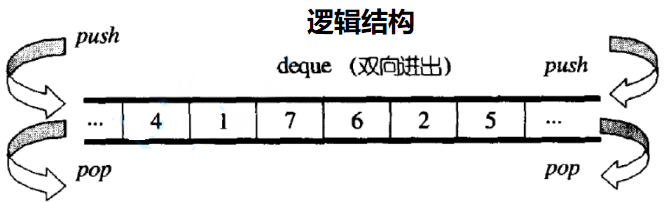

那实际上`deque` 是怎么做到合二为一的呢？它的终极奥秘在于：**它在逻辑上是连续的，但在物理内存上是“分段连续”的。**

你可以把 `deque` 的底层结构想象成一个**动态的二维数组**。它主要由两部分组成：

1. **中控器 (Map)**：
	- 这本质上是一个**存放在连续空间里的指针数组**。
	- 这个数组里的每一个元素，都是一个指针，指向一块真正在物理上连续的内存块。
2. **缓冲区 (Buffer/Node)**：
	- 这些是由中控器指针指向的、真正用来存储数据的内存块（通常大小是固定的，比如 512 字节）。
	- 数据就按照顺序依次存放在这些缓冲区里。


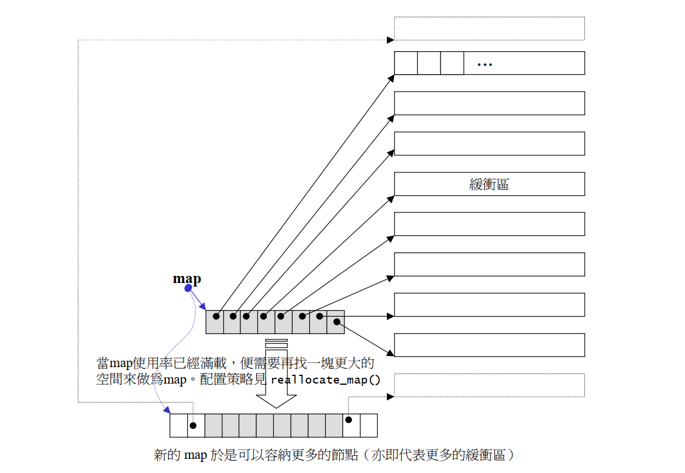

## 4.3 底层架构：迭代器

**双端队列底层是一段假象的连续空间，实际是分段连续的**，为了维护其“整体连续”以及随机访问的假象，落在了`deque`的迭代器身上，因此`deque`的迭代器设计就比较复杂，如下图所示：

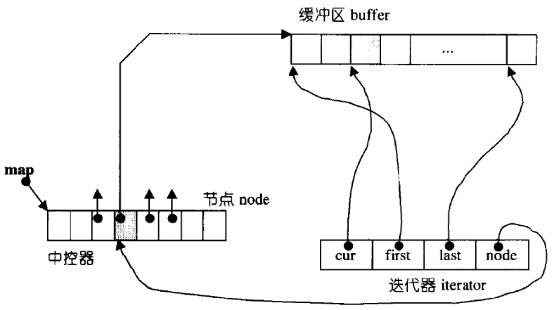

| **指针名称** | **全称/概念**          | **具体指向的位置**                                           | **核心作用与大白话解释**                                     |
| ------------ | ---------------------- | ------------------------------------------------------------ | ------------------------------------------------------------ |
| **`cur`**    | Current (当前元素指针) | 指向当前缓冲区 (Buffer) 中，**正在被访问的那个具体元素**。   | **“你现在踩在哪”**。当你在代码里写 `*it` 去获取数据时，实际上就是拿出了 `cur` 所指向的值。迭代器在缓冲区内的一步步移动，本质上就是 `cur` 的加减。 |
| **`first`**  | First (缓冲区头指针)   | 指向当前所在的那个缓冲区 (Buffer) 的**物理起始位置**。       | **“这块砖的起点”**。主要用于向后倒退（`it--`）时的边界检查。如果 `cur == first`，说明当前缓冲区已经退到底了，准备呼叫 `node` 切换到上一个缓冲区。 |
| **`last`**   | Last (缓冲区尾指针)    | 指向当前所在的那个缓冲区 (Buffer) 的**物理末尾位置**（最后一个有效元素的下一个位置）。 | **“这块砖的终点”**。主要用于向前推进（`it++`）时的边界检查。如果 `cur == last`，说明当前缓冲区已经走到头了，准备呼叫 `node` 切换到下一个缓冲区。 |
| **`node`**   | Node (中控器节点指针)  | 指向**中控器 (Map) 数组**中，负责管理当前这个缓冲区的那个**控制节点**。 | **“跨界导航仪”**。它是迭代器能实现“分段连续”魔法的关键！当 `cur` 撞到 `first` 或 `last` 的边界时，必须通过 `node` 回到中控器，找到上一个或下一个缓冲区的地址，从而完成完美的“跨界跳跃”。 |

## 4.4 工作原理

如果说上一张图是 `deque` 迭代器的“微观特写”，那么这张图 就是 `deque` 整个容器的“宏观全景图”。

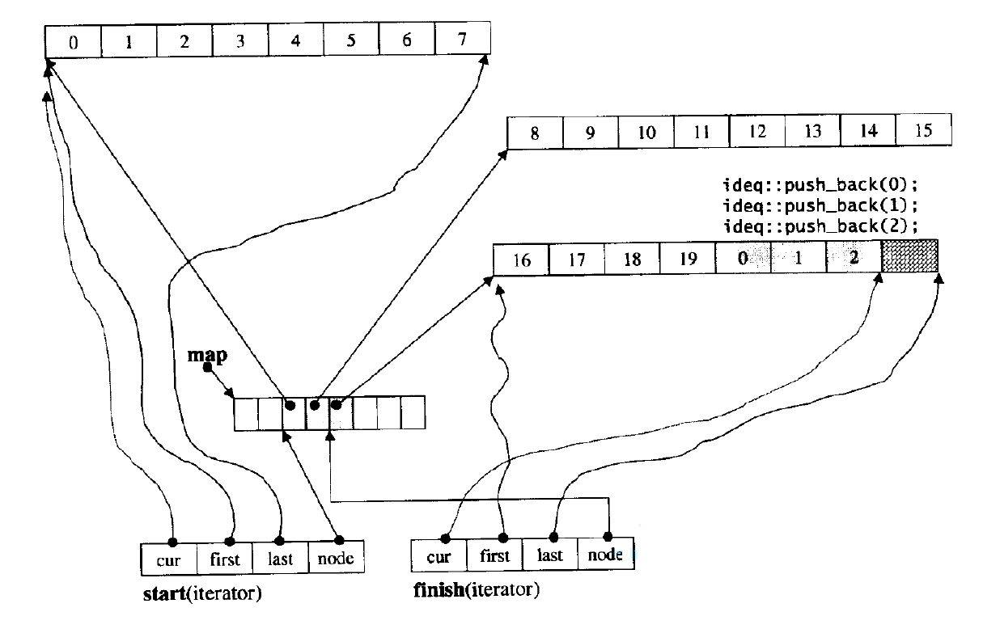

这张图完美地展示了当一个 `deque` 存满了好几个缓冲区时，它的内部到底长什么样。结合这张图，就可以把 `deque` 最核心的工作逻辑和常用操作串起来！

从图中可以清晰地看到，`deque` 容器本身其实**只需要维护两个非常核心的迭代器**（外加一个中控器信息）：

1. **`start` 迭代器**：它永远指向 `deque` 中的**第一个有效元素**，差不多就是`begin()`。
2. **`finish` 迭代器**：它永远指向 `deque` 中**最后一个有效元素的下一个位置**（也就是下一个即将被填入数据的位置），差不多就是`end()`。

借助 `start` 和 `finish`，来看看日常操作是怎么运转的：

### 4.4.1 插入 (Insertion)

- **`push_back(val)` (尾部插入)**：
	- **逻辑**：直接把值写进 `finish.cur` 指向的阴影格子里。然后 `finish.cur` 往后挪一格。如果这个缓冲区满了（`cur == last`），就去申请一个新缓冲区，把地址挂到中控器 `map` 的下一个节点，然后更新 `finish` 的四个指针跨过去。
- **`push_front(val)` (头部插入)**：
	- **逻辑**：和尾插反过来。先让 `start.cur` 往前退一格（`--start.cur`），然后把值写进去。如果退到了缓冲区的头部（`cur == first`），就申请新缓冲区挂在 `map` 的前面，然后更新 `start` 跨过去。

> 如果在中间插入呢？
>
> 不管`stl`是什么版本，大家都默认是跟`vector`类似的插入操作，也就是移动元素，满的话开空间，为什么不重新开个缓冲区挂上去呢？成本太高了，而且实现难度也不小。

### 4.4.2 删除 (Deletion)

- **`pop_back()` (尾部删除)**：
	- **逻辑**：把 `finish` 迭代器往回退一格，然后销毁那个元素。如果退到了缓冲区的开头，就顺便把那个空掉的缓冲区释放掉，并更新中控器。
- **`pop_front()` (头部删除)**：
	- **逻辑**：销毁 `start.cur` 指向的元素，然后把 `start` 往后挪一格。同样，如果一个缓冲区全删空了，就释放它。

### 4.4.3 遍历 (Traversal)

- **正向遍历 (`begin()` 到 `end()`)**：
	- `deque::begin()` 返回的就是图中的 `start` 迭代器。
	- `deque::end()` 返回的就是图中的 `finish` 迭代器。
	- **逻辑**：当你写 `for(auto it = d.begin(); it != d.end(); ++it)` 时，迭代器就会从`start` 迭代器的`cur`指针位置开始，一路向后遍历，若当前缓冲区已经遍历完了，更新迭代器四个指针位置，直到撞上右下角 `finish`迭代器的`cur`指针位置停下。

### 4.4.4 其他高频/重要操作

除了增删查改，`deque` 还有几个非常依赖底层架构的常用接口：

- **`operator[](size_t n)` (随机访问)**：
	- **逻辑**：你想找第 $n$ 个元素？`deque` 会拿着这个 $n$，根据每个缓冲区的大小做数学运算。它会算出你要找的元素在 `map` 的第几个节点（哪块地砖），以及在这个缓冲区的第几个偏移量。虽然比 `vector` 慢，但依然算得上是 $O(1)$ 的时间复杂度。

|     | **目标 ** | **数学公式 / 底层逻辑** | **大白话通俗解释**   |
| ---- | --------- | --------------- | ------------------- |
| **1** | **算总距离 (修正偏移量)** | $TotalOffset = i + StartOffset$             | 因为头部的缓冲区可能前面空了几个格子（被 `pop_front` 删掉了）。要想算得准，必须把这几个“空位”加回来，算出目标元素距离**第一个缓冲区物理开头**的真实格子数。 |
| **2** | **找目标缓冲区 (找地砖)** | $NodeIndex = TotalOffset  /  BufferSize$    | **除法运算**。算出总距离后，除以每个缓冲区的固定大小。得出的商，就是你要跨越几个缓冲区。比如商是 1，说明目标在下一个缓冲区里。 |
| **3** | **找具体位置 (找格子)**   | $ElementIndex = TotalOffset \% BufferSize$  | **取模运算 (求余数)**。总距离除以缓冲区大小剩下的余数，精准定位了这个元素在目标缓冲区里的具体下标位置。 |
| **4** | **合体取数据 (内存寻址)** | `map[start_node + NodeIndex][ElementIndex]` | 拿着算好的结果去找中控器 (`map`)：先找到对应控制节点的指针，拿到那块物理连续的缓冲区的首地址，然后用算出的格子下标直接把数据取出来！ |

- **`size() const` (获取元素总数)**：
	- **逻辑**：它不是简单地维护一个 `count` 变量。它实际上是用 `finish` 迭代器减去 `start` 迭代器算出来的。迭代器相减的内部重载运算会算出：**跨越了几个完整的缓冲区 $\times$ 缓冲区大小 $+$ 尾部缓冲区的元素量 $+$ 头部缓冲区的元素量**。
- **`clear()` (清空容器)**：
	- **逻辑**：它会保留中控器和至少一个初始缓冲区（为了以后继续用），然后把其他的缓冲区全部遍历销毁并释放内存，最后把 `finish` 拉回到和 `start` 同一个位置。

## 4.5 源码阅读

这里就不实现了，有点复杂。简单快速看些源码了解了解吧

**主要结构和迭代器实现：**

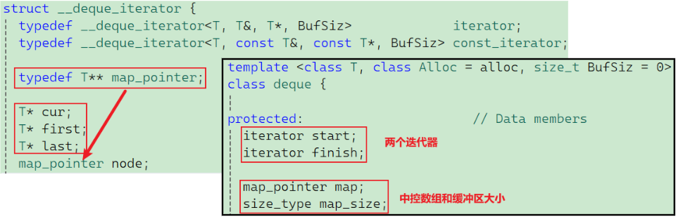

**后置++运算符重载：**

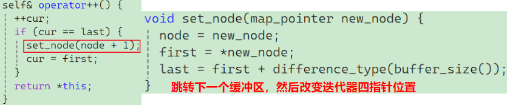

**`[]、+=、+`运算符重载：**

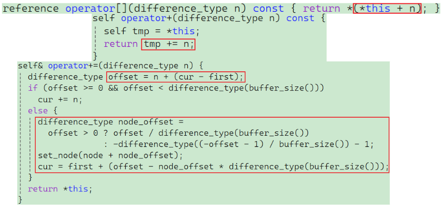

最上面的两段代码，展示了 C++ 运算符重载中经典的“套娃”操作：

1. **`operator[](difference_type n)`**——把迭代器自己加上 `n` 步，然后解引用（`*`）取值。
2. **`operator+(difference_type n)`**——`+` 操作不改变原迭代器，所以它内部复用了 `+=` 的逻辑，它先拷贝出一个临时迭代器 `tmp`，然后 `return tmp += n;`

**结论**：一切随机访问的重头戏，全都在最下面的 **`operator+=`** 里面！

这段代码是整个 `deque` 寻址的灵魂，它完美处理了“同缓冲区内移动”和“跨缓冲区跳跃”两种情况。

**算总账：算出相对于当前缓冲区起点的总偏移量**

```C++
difference_type offset = n + (cur - first);
```

- 你想要前进 `n` 步。但是当前指针 `cur` 可能不在缓冲区的起始位置（`first`）。为了统一计算，必须把 `cur` 到 `first` 的距离加进去，算出目标位置距离**当前缓冲区绝对起点**的总长度 `offset`，这样就保证了每个缓冲区在空间一致的情况下随机访问的效率，也就是为什么选择牺牲插入删除接口的效率。

**目标在同一个缓冲区内**

```C++
if (offset >= 0 && offset < difference_type(buffer_size()))
    cur += n;
```

- 如果算出来的总长度 `offset` 大于等于 0，并且**没有超过一个缓冲区的最大容量**，说明步子迈得不够大，目标还在当前这块地砖上。

**目标在其他缓冲区**

如果 `if` 不成立，说明 `n` 太大了（或者是个负数退得太多了），必须要跨越缓冲区。进入 `else` 分支：

**第一步：算算要跨几个缓冲区 (`node_offset`)**

```C++
difference_type node_offset =
    offset > 0 ? offset / difference_type(buffer_size())
               : -difference_type((-offset - 1) / buffer_size()) - 1;
```

- 这里用了一个三目运算符来分别处理向前跳和向后跳。
	- **向前跳 (`offset > 0`)**：直接用总距离除以缓冲区大小，这就是我们要跨越的缓冲区数量。
	- **向后跳 (负数逻辑)**：因为 C++ 早期整数除法对负数的取整规则问题，这里做了一个非常巧妙的数学处理 `-((-offset - 1) / buffer_size()) - 1`，确保向左跨界时能准确落到前几个节点上。

**第二步：切换中控器节点 (重新定位)**

```C++
set_node(node + node_offset);
```

- 调用内部函数 `set_node`。拿着算出来的跨界步数，让 `node` 指针在中控器数组里跳跃到新的控制节点上，同时会把迭代器的 `first` 和 `last` 刷新为新缓冲区的头尾边界。

**第三步：在新地盘上精准降落 (定位 `cur`)**

```C++
cur = first + (offset - node_offset * difference_type(buffer_size()));
```

- 虽然我们跳到了新的缓冲区（`first` 已经更新），但目标元素并不一定在新缓冲区的最开头。
- **公式**：$目标在新缓冲区的相对位置 = 总偏移量 - 跨过的所有完整缓冲区的总长度$。(**相当于取模运算**)
- 把这个余数加到新的 `first` 上，`cur` 就精准地踩在了最终的目标数据上！

**`insert`接口：**

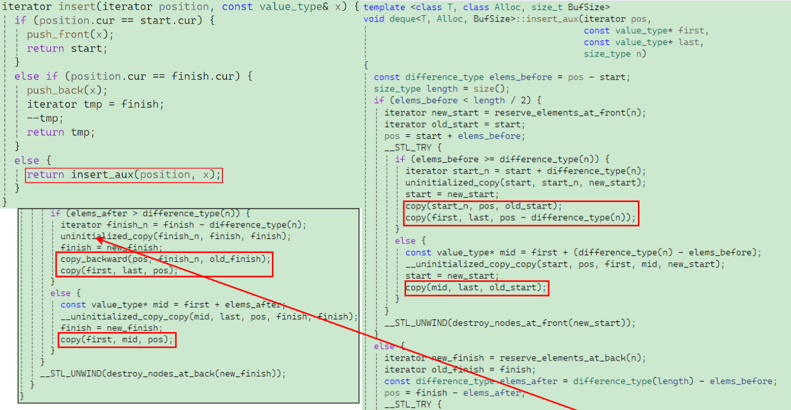

**这里的insert接口很复杂，还有两个函数重载没截，但是这个copy函数一看就是在挪数据**

## 4.6 Deque 的优缺点

了解了“中控器 + 分段缓冲区”的架构，就能完全看透 `deque` 的优缺点了。

**1. Deque 的优点**

- **头尾操作极其强悍 ($O(1)$)**：无论是头插/头删，还是尾插/尾删，都只需要在对应的缓冲区进行。如果缓冲区满了/空了，也只需处理一个定长的内存块，**绝对不需要像 `vector` 那样挪动大量历史数据**。
- **扩容代价极低**：`deque` 扩容时，绝大多数情况下原有的数据都不需要移动。只有当中控器 (Map) 本身的指针数组存满时，才需要对 Map 进行扩容和拷贝，但拷贝一堆指针的代价，比起拷贝海量的实际对象，简直是九牛一毛。
- **支持随机访问**：你想访问第 `N` 个元素？`deque` 的迭代器内部会做一道简单的数学题：先用 `N` 除以单个缓冲区的大小，算出你要找的元素在**中控器的哪个指针（哪一块）**；再用 `N` 对缓冲区大小取模，算出你要找的元素在**这块缓冲区的第几个位置**。

**2. Deque 的缺点**

- **随机访问有折损**：虽然它支持 `operator[]`，但正如上面所说，每次访问都需要经历两步寻址（先找 Map，再找 Buffer），还要做除法和取模运算。这导致**它的随机访问速度比纯粹连续的 `vector` 慢了不止一个数量级**。
- **中部插入/删除是灾难**：如果你想在 `deque` 的正中间插入一个数据，为了保持“分段连续”的特性，它不得不挪动大量数据，跨越多个缓冲区去调整，极其低效。
- **迭代器极其复杂笨重**：`deque` 的迭代器为了能“无缝”跨越不同的缓冲区，内部维护了多个指针（指向当前元素、当前缓冲区的头、尾、以及对应的中控器节点）。这也是为什么对其进行重度依赖迭代器的操作（如排序）时，性能极其拉垮。

## 4.7 测试效率

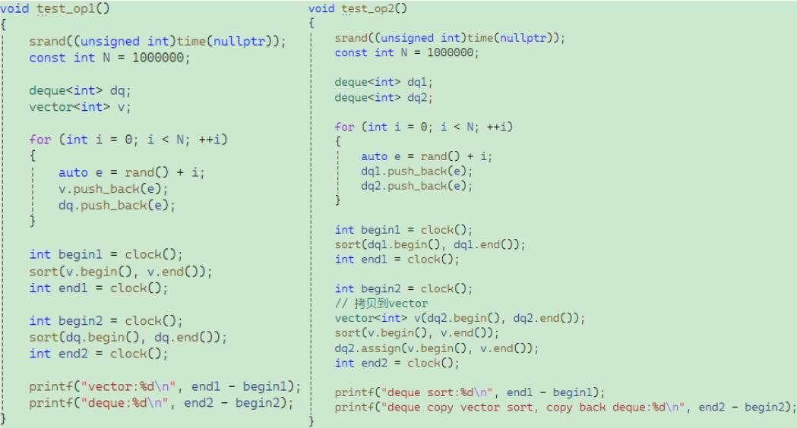

**测试结果：**

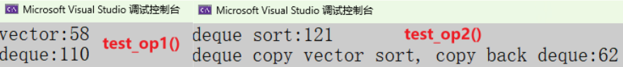

- **为什么对 `deque` 排序比对 `vector` 排序慢得多？**

	因为 `std::sort` 是快速排序，它需要极其频繁地使用迭代器进行前后的移动、比对和交换。`deque` 复杂的迭代器在海量运算中成为了巨大的性能瓶颈，而 `vector` 的迭代器本质上就是原生指针，跑得飞快。

- **为什么“拷贝到 vector 排序再拷贝回 deque” 反而更快？**

	这就是经典的优化手段。虽然两次拷贝付出了代价，但 `vector` 在排序时省下来的时间，远远超过了这两次数据拷贝所消耗的时间！

## 4.8 为什么是 Stack 和 Queue 的默认标配

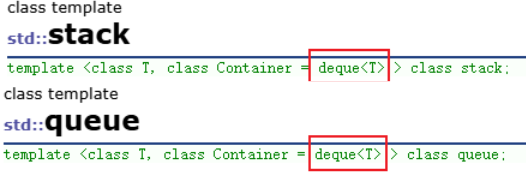

最后，为什么 `stack` 和 `queue` 不用 `vector` 或 `list`，偏偏选中了 `deque`？

因为 `stack` 和 `queue` 的使用场景，**完美避开了 `deque` 的所有缺点，同时压榨尽了它的所有优点**：

1. 栈和队列**不需要在中间插入/删除**。
2. 栈和队列**不需要随机访问**（甚至连遍历都不提供）。
3. 栈和队列极度依赖头尾的插入和删除。`deque` 相比 `vector`，避免了大量的扩容搬运成本；相比 `list`，极大地减少了内存碎片，提高了空间利用率和缓存命中率。

可以说，`deque` 简直就是为了给 `stack` 和 `queue` 当“幕后大佬”而量身定制的！

# 五、Priority Queue (优先队列) 

优先队列虽然名字里带“队列”，但它的底层数据结构其实是一棵**完全二叉树**，具体来说是**堆 (Heap)**。之前也有学习堆的经历，所以这里直接写了，堆就是用数组去 存放，把它当做一棵完全二叉树看。每次取出的元素都不是最早放进去的，而是“优先级最高”（最大或最小）的元素。

## 5.1 核心接口及详解

和 `stack`、`queue` 一样，为了保证“异常安全”，优先队列也将获取元素和删除元素进行了严格的拆分。

| **接口原型**               | **接口含义与作用**                                           | **对应你的源码逻辑**                                         |
| -------------------------- | ------------------------------------------------------------ | ------------------------------------------------------------ |
| `void push(const T& val);` | **入队**：将新元素加入队列，并**自动将其调整到合适的位置**。 | 放到底层 `vector` 的尾部，然后执行 `AdjustUp`（向上调整）算法。 |
| `void pop();`              | **出队**：移除当前**优先级最高**的那个元素（无返回值）。     | 将首尾元素交换，删掉尾部，然后对新的头部执行 `AdjustDown`（向下调整）算法。 |
| `const T& top() const;`    | **取队首 (取最值)**：返回当前**优先级最高**的元素的引用。    | 直接返回底层 `vector` 的第 0 个元素 `_con[0]`。              |
| `bool empty() const;`      | **判空**：检查队列是否为空。                                 | 调用底层容器的 `empty()`。                                   |
| `size_t size() const;`     | **获取大小**：返回当前队列中元素的个数。                     | 调用底层容器的 `size()`。                                    |

因为在一棵完全二叉树中，如果把根节点放在数组下标 `0` 的位置，那么对于任意一个下标为 $i$ 的节点，可以直接用纯数学公式瞬间算出它的亲戚在哪：

- **左孩子下标**：$2 \times i + 1$
- **右孩子下标**：$2 \times i + 2$
- **父节点下标**：$(i - 1) / 2$

`vector` 完美的 $O(1)$ 随机访问能力，让这种通过下标找亲戚的操作快如闪电。

## 5.2 堆相关操作

### 5.2.1 插入元素、向上调整 (AdjustUp)

当你 `push` 一个新元素时，为了不破坏原有的堆结构，优先队列会这么做：

1. **先上车**：把新元素直接 `push_back` 扔到 `vector` 的最后面（也就是二叉树的最后一个叶子节点）。
2. **向上调整**：调用 `AdjustUp`。让这个新节点和它的父节点比大小。
3. 如果新节点比父节点大（假设是大堆），就交换它们的位置（篡位）。
4. 一直往上比，直到它比父节点小，或者自己当上了根节点（下标为 0）才停下来。

```c++
void AdjustUp(size_t child)
{
    Compare com;
    size_t parent = (child - 1) / 2;
    while (child)
    {
        if (com( _con[parent], _con[child]))
        {
            std::swap(_con[child], _con[parent]);
            child = parent;
            parent = (child - 1) / 2;
        }
        else
            break;	
    }
}
```

### 5.2.2 删除元素、向下调整 (AdjustDown)

当你 `pop` 掉优先级最高的老大（根节点，即 `_con[0]`）时，如果直接把 `vector` 里的第 0 个元素删掉，后面的所有数据都要往前挪，树的结构就全毁了！大师们的解法极其巧妙：

1. **偷梁换柱**：把根节点 `_con[0]` 和数组最后一个叶子节点 `_con[size - 1]` 交换位置。
2. **过河拆桥**：此时老大已经被换到了数组末尾，直接 `pop_back()` 把它删掉，时间复杂度 $O(1)$。
3. **重新选老大（向下调整）**：此时根节点坐着一个很弱的叶子节点，需要把它赶下去。调用 `AdjustDown`。
4. 让这个弱节点和它的两个孩子中**较强（较大）的那个**比，如果它不如孩子强，就和强孩子交换位置。一直往下沉，直到它比自己的孩子都强，或者变成了叶子节点为止。

```c++
void AdjustDown(size_t parent)
{
    size_t child = 2 * parent + 1;
    Compare com;
    while (child < _con.size())
    {
        if (child + 1 < _con.size() && com( _con[child],_con[child + 1] ))
            child++;
        if (com(_con[parent] , _con[child]))
        {
            std::swap(_con[child], _con[parent]);
            parent = child;
            child = parent * 2 + 1;
        }
        else
            break;
    }
}
```

## 5.3 仿函数 (Functor) 与 Compare 参数

在使用文档，类的模板定义是这样的：

```c++
template <class T, class Container = vector<T>,
  class Compare = less<typename Container::value_type> > class priority_queue;
```

这就是优先队列的灵魂所在！到底什么是“优先级最高”？是由 `Compare` 决定的：

- **大顶堆 (Max Heap)**：每次 `pop` 出最大值。标准库中默认使用的是 `std::less<T>`。这听起来有点反直觉（为什么用 `less` 反而是大堆？），因为底层在比较父子节点时，如果 `父节点 < 子节点` 成立，就会触发交换把子节点换上去，导致大的元素全浮在上面。
- **小顶堆 (Min Heap)**：每次 `pop` 出最小值。只需要在定义时传入 `std::greater<T>`。如果 `父节点 > 子节点`，就把小孩子换上去，最终最小的元素霸占堆顶。

**仿函数（Functor），全称是“函数对象（Function Object）”。**从字面上理解，它是一个**对象（属于某个类）**，但是它的行为表现得**像一个函数**。它的底层逻辑其实非常简单粗暴：**只要一个类（或结构体）重载了函数调用运算符 `operator()`，它实例化的对象就被称为仿函数。**

一个最纯粹的泛型例子：

```C++
// 这是一个类
struct Multiplier {
    int operator()(int a, int b) // 重载了 () 运算符
        return a * b;
};

// 使用场景
Multiplier multiply;       // 1. 实例化一个普通对象
int result = multiply(3, 4); // 2. 像调用普通函数一样，在对象名后面加括号！结果是 12。
```

从外表看，`multiply(3, 4)` 和普通的函数调用毫无区别，但实际上编译器把它悄悄转换成了 `multiply.operator()(3, 4)`。

**仿函数的优势**——仿函数拥有普通函数望尘莫及的三大优势：

**（1）仿函数可以拥有“状态”（Stateful）**

普通函数是“无情”的机器，执行完一次就结束了，内部的局部变量也会销毁。如果想让普通函数记住点什么，只能用极不安全的全局变量或静态变量。但仿函数本质上是**类**！它可以拥有自己的**成员变量**。这就意味着，仿函数在被调用时，可以携带自己的“私货”或历史记忆。普通函数绝对做不到这种极其优雅的状态隔离。

**（2）极致的性能（内联优化的天作之合）**

这是 C++ STL 彻底抛弃 C 语言 `qsort`（使用函数指针）并全面拥抱仿函数的最根本原因。

- **函数指针的痛点**：当你把一个普通函数作为指针传给算法（比如排序算法）时，编译器在编译阶段通常不知道这个指针到底指向哪段代码。因此，每次比较大小，CPU 都要老老实实地执行一次真实的“函数调用”（压栈、跳转、返回），开销极大。
- **仿函数的降维打击**：当你把仿函数作为模板参数传给 STL 算法时，你传的是一个**明确的类型**。编译器在编译时，对这个类的 `operator()` 代码一清二楚。只要代码够短（比如简单的 `<` 或 `>`），编译器会直接把代码**内联（Inline）展开**到算法内部。
- **结果**：使用仿函数的 C++ `std::sort`，在很多场景下比 C 语言的 `qsort` 速度快得多，就是因为省去了海量的函数调用开销。

**（3）融入类型系统，更安全**

普通函数的类型仅仅由返回值和参数列表决定（比如 `bool(*)(int, int)`）。而仿函数是具体的类（比如 `class Less` 和 `class Greater` 是两个完全不同的类型）。这意味着 C++ 的模板可以在编译期严格检查类型，防止你把“从大到小”的规则错误地传给需要“从小到大”规则的容器。

在整个 C++ 标准库中，仿函数无处不在：

1. **作为排序/比较规则**：用在 `std::sort`、`std::set`、`std::map`、`std::priority_queue` 中，决定数据的先后顺序。
2. **作为条件判断**：配合 `<algorithm>` 库里的 `std::find_if`、`std::count_if`、`std::remove_if`，用来筛选符合条件的数据。
3. **算术运算**：`<functional>` 头文件里自带了一大批写好的仿函数，比如 `std::plus`（加法）、`std::less`（小于）等，随拿随用。

抛开具体的代码细节，仿函数的本质就是：**用面向对象的“类”，封装了面向过程的“行为”，从而兼顾了灵活性与极致的性能。**

## 5.4 模拟实现

```c++
#pragma once
#include <vector>

template <class T>
class Less {
public:
    bool operator()(const T& x, const T& y) { return x < y; }
};
template <class T>
class Greater {
public:
    bool operator()(const T& x, const T& y) { return x > y; }
};

namespace csa {
    template<class T, class Container = vector<T>, class Compare = Less<T>>
    class priority_queue {
    public:
        void AdjustUp(size_t child) {
            Compare com;
            size_t parent = (child - 1) / 2;
            while (child) {
                if (com(_con[parent], _con[child])) {
                    std::swap(_con[child], _con[parent]);
                    child = parent;
                    parent = (child - 1) / 2;
                } else {
                    break;
                }
            }
        }
        void push(const T& x) {
            _con.push_back(x);
            AdjustUp(_con.size() - 1);
        }
        void AdjustDown(size_t parent) {
            size_t child = 2 * parent + 1;
            Compare com;
            while (child < _con.size()) {
                if (child + 1 < _con.size() && com(_con[child], _con[child + 1]))
                    child++;
                if (com(_con[parent], _con[child])) {
                    std::swap(_con[child], _con[parent]);
                    parent = child;
                    child = parent * 2 + 1;
                } else
                    break;
            }
        }
        void pop() {
            std::swap(_con[0], _con[_con.size() - 1]);
            _con.pop_back();
            AdjustDown(0);
        }
        const T& top() const { return _con[0]; }
        bool empty() const { return _con.empty(); }
        size_t size() const { return _con.size(); }
    private:
        Container _con;
    };
}
```

这是整个 C++ STL 设计中最反直觉、最容易绕晕的地方了。

按照人类的正常直觉，既然叫 `Less`（小），那不就应该把小的放上面（小顶堆）吗？既然叫 `Greater`（大），那不就应该把大的放上面（大顶堆）吗？

但在 STL 中，**结果恰恰完全相反：传 `Less` 建出来的是大堆，传 `Greater` 建出来的反而是小堆！**

在 `AdjustUp` 和 `AdjustDown` 代码中，最核心的比较逻辑就只有这一句：

```C++
if (com(_con[parent], _con[child])) {
    std::swap(_con[child], _con[parent]); // 交换（篡位）
}
```

**理解法则：把 `com` 翻译成“需要发生交换（篡位）的条件”。**

**1. 当传入 `Less` 时（默认情况）**

- **替换公式**：`com(parent, child)` 就变成了 `parent < child`。如果**“父节点 < 子节点”**，子节点就谋权篡位（发生 `swap`），把弱小的父亲踩下去，自己当爹。**结果**：大的节点疯狂往上爬，小的节点全被踩在下面。谁最大谁就坐皇位（堆顶）。
- **结论**：**大顶堆！**

**2. 当传入 `Greater` 时**

- **替换公式**：`com(parent, child)` 就变成了 `parent > child`。如果**“父节点 > 子节点”**，子节点就篡位（发生 `swap`），把强大的父亲拉下马。**结果**：小的节点踩着大的节点往上爬。谁最小谁就坐皇位（堆顶）。
- **结论**：**小顶堆！**

只要明白了这个逻辑，以后就不太会晕了，实际上就是 $>$ 和$<$的函数重载，只不过是严格按照第一个参数跟第二个参数的位置，而不是当时模拟实现`qsort`时要自己写两个参数之间的比较逻辑。

| **传入的仿函数**    | **触发 swap 的条件** | **谁能往上爬？**   | **最终皇位(堆顶)是谁** | **结果是什么堆**      |
| ------------------- | -------------------- | ------------------ | ---------------------- | --------------------- |
| **`Less` (`<`)**    | 父 `<` 子            | 越**大**的越往上爬 | 最大值                 | **大顶堆 (Max Heap)** |
| **`Greater` (`>`)** | 父 `>` 子            | 越**小**的越往上爬 | 最小值                 | **小顶堆 (Min Heap)** |