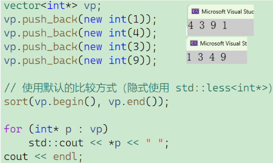
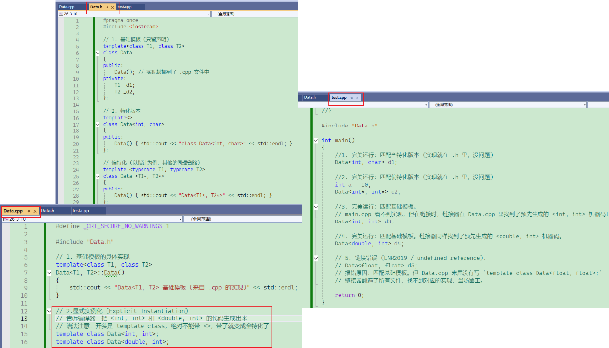

# 一、知识回顾

## 1.1 迭代器兼容原生数组指针

当我们在用 `std::sort(arr, arr + 5)` 时会觉得理所当然，但稍微深入一步就会疑惑：**STL 算法明明是为各种容器（如 `std::vector`、`std::list`）的迭代器设计的，凭什么最原始的 C 语言原生数组指针也能完美无缝地插进去用？**——**不是原生指针兼容了迭代器，而是迭代器的设计初衷就是为了“模仿”和“泛化”原生指针。** 同时，C++ 通过模板的**萃取（Traits）机制**在底层做好了极其优雅的桥接。

STL 算法（如 `std::find`、`std::sort`）本质上都是函数模板。它们根本不在乎你传进来的“迭代器”到底是个什么类，它们只在乎这个类型**支不支持特定的操作符**。STL 算法 `std::find` 的简化实现：

```C++
template <typename InputIterator, typename T>
InputIterator find(InputIterator first, InputIterator last, const T& value) {
    while (first != last) {
        if (*first == value) { // 需要支持解引用 *
            return first;
        }
        ++first;               // 需要支持前置递增 ++
    }
    return last;
}
```

对于容器的迭代器（比如 `std::vector<int>::iterator`），它重载了 `*`、`++` 和 `!=` 运算符。

而对于**原生指针**（比如 `int*`），它天生就支持解引用（`*p`）、指针偏移（`++p`）和地址比较（`p != q`）。

所以，从纯粹的语法行为上看，原生指针完美满足了 STL 算法对迭代器的所有要求。对于算法来说，原生指针就是一种**随机访问迭代器（Random Access Iterator）**。

## 1.2 STL 堆操作

在 C++ 标准模板库（STL）中，堆排序（Heap Sort）的设计非常精妙。它并没有像 `std::sort` 那样只提供一个大包大揽的函数，而是将堆的操作拆解成了几个底层的原语。这种设计赋予了开发者极大的灵活性：你不仅可以用它来排序，还可以用它来维护优先队列（`std::priority_queue` 的底层就是这些函数）、求解 Top-K 问题等。

在 STL 中，**堆是直接建立在普通数组或 `std::vector` 之上的。** STL 默认构建的是**最大堆（Max-Heap）**，即父节点的值总是大于或等于其子节点的值。根节点（数组的第一个元素）总是最大值。由于完全二叉树的特性，这种映射非常紧凑，没有任何内存浪费，且利用随机访问迭代器（Random Access Iterator）就能极其高效地找到父子节点。这也是为什么 STL 的堆操作要求传入的迭代器必须是随机访问迭代器（如原生指针、`vector::iterator` 等），而不能是 `list` 的迭代器。

在 `<algorithm>` 头文件中，STL 提供了四个专门用于操作堆的函数模板。完整的堆排序实际上是这几个函数的组合。

### 1.2.1 `make_heap`：建堆

- **作用**：将一个无序的区间 `[first, last)` 重新排列，使其满足最大堆的性质。
- **原理**：采用自底向上的“下沉（Sift-down）”策略。从最后一个非叶子节点开始，依次将每个节点向下调整到合适的位置。
- **复杂度**：这是一个非常高效的操作，时间复杂度为 $O(N)$。

### 1.2.2 `pop_heap`：弹出堆顶（核心排序动作）

- **作用**：将堆顶元素（最大值）移动到区间的最后位置 `last - 1`，并将原来在末尾的元素移到堆顶，然后对新的堆顶执行下沉操作，恢复 `[first, last - 1)` 区间的堆性质。
- **注意**：它**并没有**真正把元素从容器中删除，只是把它移到了末尾。
- **复杂度**：$O(\log N)$。

### 1.2.3 `push_heap`：推入元素

- **作用**：假设 `[first, last - 1)` 已经是一个有效的堆，新加入的元素放在了 `last - 1` 的位置。该函数会将这个新元素“上浮”到堆中合适的位置。
- **复杂度**：$O(\log N)$。

### 1.2.4 `sort_heap`：完成堆排序

- **作用**：将一个**已经是堆**的区间转化为按升序排列的有序区间。
- **原理**：本质上就是一个循环，不断地调用 `std::pop_heap`，每次把当前最大的元素放到堆的末尾，直到堆的范围缩小为 1。

理解了上面的原语，堆排序的实现就非常清晰了。在 C++ 中执行一次完整的堆排序，通常分为两步：**先建堆**：调用 `std::make_heap`。**后排序**：调用 `std::sort_heap`。

### 1.2.5 使用

下面是一个如何使用 STL 进行堆排序的完整示例，以及展示中途状态的变化：

```C++
void test_heap() 
{
    vector<int> data = { 3, 1, 4, 1, 5, 9, 2, 6, 5 };
    for (auto e : data)  cout << e << " ";
    cout << endl;
    // 第一步：将普通数组转化为最大堆 O(N)
    make_heap(data.begin(), data.end());
    for (auto e : data) cout << e << " ";
    cout << endl;
    // 第二步：执行堆排序 O(N log N)
    // 注意：sort_heap 要求传入的区间必须已经是一个堆！
    sort_heap(data.begin(), data.end());
    for (auto e : data) cout << e << " ";
    cout << endl;
}
```

## 1.3 仿函数“失控”？

假设我们有一个指针数组，里面存了几个分配在堆上的整数。我们想对它们进行排序：



当你多次运行这段代码时，输出结果可能是 `4 3 9 1`，也可能是 `1 3 4 9`，或者是别的。排序结果**完全不可控**，看起来像是在随机洗牌。

**为什么会失控？底层原因解析**

STL 算法（如 `std::sort`）默认使用的是 `std::less<T>` 这个仿函数。当你的容器类型是 `vector<int*>` 时，模板被实例化为 `std::less<int*>`。

`std::less<int*>` 的底层逻辑非常简单：

```C++
bool operator()(int* a, int* b) const
    return a < b; // 直接比较指针的值
```

**关键点在于：指针的值是什么？是内存地址！** 你实际上是在比较 `0x00A12340 < 0x00A12580`。

当你使用 `new` 动态分配内存时，操作系统/堆分配器返回的内存地址顺序是**不确定的**。

- 先 `new` 出来的对象，其内存地址不一定比后 `new` 出来的对象小。
- 受到内存碎片、操作系统 ASLR（地址空间布局随机化）等安全机制的影响，每次运行程序时，分配给这些整数的物理/虚拟地址都在变。

因此，仿函数并没有“坏掉”，它只是在非常忠实地对**内存地址的高低**进行排序，而内存地址的高低与指针所指向的**实际数值大小**毫无关系。

**如何重新掌控局面？**——要解决这个问题，我们必须明确告诉容器或算法：**“请解引用（Dereference）这些指针，去比较它们指向的值！”**

我们需要手写一个仿函数，并在 `operator()` 中加入 `*` 运算符。

```C++
// 专门用来比较指针所指内容的仿函数
template<class T>
struct Less
{
    bool operator()(const T& x, const T& y) const // 传入的是指针，但比较的是解引用后的值
    {
        return *x < *y; // 核心：加上了 * 号
    }
};
```

**应用到排序：**

```C++
// 显式传入自定义仿函数对象
sort(vp.begin(), vp.end(),Less<int*>());
// 现在肯定能稳定输出 1 3 4 9 了
```

# 二、模板参数

C++ 模板的强大之处在于它的“参数化”机制。就像普通函数在运行时接受**变量**作为参数一样，模板在编译期接受**类型**或**常量**作为参数。

## 2.1 类型模板参数

这是最常见、最基础的模板参数。它相当于一个**占位符**，代表一种具体的“数据类型”（如 `int`、`double`、`std::string` 或你自定义的类）。

使用 `typename` 或 `class` 关键字声明（在此处两者完全等价，现代 C++ 更推荐使用 `typename` 以区分普通类的定义）。

```C++
// T 和 U 都是类型模板参数
template <typename T, class U>
class Pair {
private:
    T first;
    U second;
public:
    Pair(T f, U s) : first(f), second(s) {}
};
```

- **解决的问题**：代码复用。你只需要写一套逻辑，编译器会根据传入的具体类型，自动“复刻”出多个版本的代码。
- **实例化**：当你写 `Pair<int, double>` 时，编译器在后台生成了一个用 `int` 替换 `T`，用 `double` 替换 `U` 的全新类。

## 2.2 非类型模板参数

如果说类型参数传递的是“物种”，那么非类型参数传递的就是具体的“数值”。它允许你将一个**编译期常量**作为参数传递给模板。

- **运行时常量**：虽然值不可修改，但其值要到运行时才确定（例如通过函数返回值、用户输入等初始化）。这类常量不能在编译时使用。
- **编译期常量**：值是硬编码或通过常量表达式计算得出，编译器可以直接将其嵌入代码中，提高效率。

直接使用具体的类型来声明（就像普通函数的参数列表一样）。

```c++
// T 是类型参数，Size 是非类型参数
template<class T, size_t size = 10>
class array
{
public:
    T& operator[](size_t index) { return _array[index]; }
    const T& operator[](size_t index)const { return _array[index]; }
    size_t size() const { return _size; }
    bool empty() const { return _size == 0; }
private:
    T _array[size];
    size_t _size;
};
```

> 这里有缺省参数，推荐写法：`array<> a;`。

非类型模板参数不能是随便什么值，它**必须在编译期就能确定**。

在 C++20 对非类型模板参数（Non-Type Template Parameters, 简称 NTTP）进行大刀阔斧的“松绑”之前，C++ 标准对能够作为 NTTP 的类型有着**非常严格的限制**。在 C++20 以前（即 C++98 到 C++17），非类型模板参数的核心设计哲学是：**它必须是一个在编译期就能绝对确定的“整型数值”或“具有稳定地址的实体”。**

 **C++20 以前，非类型模板参数合法的类型全家福：**

**1. 整型家族**——这是最基础、最常用的非类型模板参数。只要是底层用整数表示的类型都可以。

- **具体类型**：`int`、`char`、`short`、`long`、`long long`、`unsigned` 版本、`bool` 以及 `size_t` 等。
- **原因**：编译器在编译期可以非常轻松地比较两个整数是否相等，从而决定是否需要生成新的模板实例（例如 `Array<int, 5>` 和 `Array<int, 10>` 是完全不同的两个类）。

**2. 枚举类型**——包括传统的 `enum` 和 C++11 引入的强类型枚举 `enum class`。

- **原因**：枚举在底层本质上也是整型数值。

**C++20 以前绝对禁止的类型（作为对比）**

以下这些在 C++20 以前是**绝对不能**作为非类型模板参数的：

1. **浮点数 (`float`, `double`)**：因为浮点数在不同架构下有精度问题（比如 `+0.0` 和 `-0.0` 算不算同一个模板实例？`NaN` 怎么处理？），标准委员会以前一直不敢放开。
2. **类的对象（如 `std::string`, `std::vector`, 或自定义的 `struct`）**：你不能把一个对象的值传给模板（比如 `template <MyClass obj>`）。
3. **直接的字符串字面量**：虽然本质上是 `const char*`，但由于不同编译单元相同的字符串字面量可能地址不同，直接传 `"string"` 是非法的。

直到 C++20，标准委员会才终于解决了这些历史遗留问题，允许了浮点数和满足条件的“字面量类类型（Literal Class Types）”作为参数。

**核心差异对比**——用一张表将两者区分开来：

| **特性**           | **类型模板参数 (Type)**                  | **非类型模板参数 (Non-Type)**                           |
| ------------------ | ---------------------------------------- | ------------------------------------------------------- |
| **代表的意义**     | 一种数据类型（如 `int`, `MyClass`）      | 一个具体的数值/常量（如 `10`, `&myGlobalVar`）          |
| **声明关键字**     | `typename` 或 `class`                    | 具体的类型名（如 `int`, `size_t`, `bool`）              |
| **主要用途**       | 实现与类型无关的泛型逻辑（如容器、算法） | 编译期确定大小（如 `std::array`）、优化循环、标志位控制 |
| **经典标准库代表** | `std::vector<T>` 中的 `T`                | `std::array<T, N>` 中的 `N`                             |

# 三、std::array

C++11 引入的 `std::array` 是现代 C++ 极力推荐的容器之一。**`std::array` 是对 C 风格数组的一层“零开销（Zero-overhead）”面向对象封装。**

它们在底层的内存布局上是**完全一样**的（都是在栈上分配的连续内存，没有额外开销），但在语法行为、安全性以及与 STL 的兼容性上，`std::array` 对传统数组进行了全方位的降维打击。

**数组退化（Array Decay）与类型安全**——这是两者最本质的区别。

- **C 风格数组**：极度容易“退化”为指针。当你把一个 C 数组传递给函数时，它会自动丢失长度信息，变成一个普通的指针。这被称为 Array Decay，是 C/C++ 中无数越界 Bug 的万恶之源。
- **`std::array`**：**绝不**隐式退化。它是一个严格的类类型，包含了元素的类型和数量信息。

```C++
void processCArray(int* arr) {
    // 完蛋了，我不知道这个 arr 有多长！只能靠调用者额外传一个 size 参数
}
void processStdArray(std::array<int, 5>& arr) {
    // 非常安全，我知道它精确包含 5 个 int
    // 如果传入 array<int, 6> 会在编译期直接报错，类型不匹配！
}
```

**赋值与拷贝行为（Value Semantics）**——C 风格数组在语言层面上是“二等公民”，不支持直接的赋值操作。而 `std::array` 表现得像一个普通的变量（一等公民）。

- **C 风格数组**：不能直接赋值，不能直接作为函数的返回值。如果想拷贝，必须手动用循环或 `memcpy`。
- **`std::array`**：支持直接使用 `=` 进行深拷贝赋值，也支持直接作为函数的返回值（按值返回）。

```C++
int c_arr1[5] = {1, 2, 3, 4, 5};
int c_arr2[5];
// c_arr2 = c_arr1; // 编译报错！不能直接赋值
std::array<int, 5> std_arr1 = {1, 2, 3, 4, 5};
std::array<int, 5> std_arr2;
std_arr2 = std_arr1; // 完全合法，执行深拷贝
```

**获取大小信息**

- **C 风格数组**：需要使用宏或 `sizeof` 黑魔法 `sizeof(arr) / sizeof(arr[0])` 来计算大小，而且一旦数组退化为指针，这个公式就会静默失效，返回错误的结果。
- **`std::array`**：直接调用 `.size()` 方法。因为大小是模板非类型参数，`.size()` 其实是一个 `constexpr`（编译期常量），没有任何运行期开销。

**越界检查**

- **C 风格数组**：使用 `arr[i]` 访问。如果你访问 `arr[100]`，C++ 不会阻拦你，它会默默地去读取甚至修改那块不属于你的内存，导致程序崩溃或出现幽灵 Bug。
- **`std::array`**：同样支持 `[]` 操作符（为了追求极致性能，不检查越界）。但它额外提供了 `.at(i)` 方法。如果使用 `.at()` 发生越界，它会立刻抛出 `std::out_of_range` 异常，让你在调试时瞬间定位问题所在。

**与 STL 生态的融合**

- **C 风格数组**：虽然可以通过原生指针（天然的迭代器）勉强使用 STL 算法（如 `std::sort(arr, arr + 5)`），但它缺乏面向对象的接口。
- **`std::array`**：完美融入 STL 生态。它拥有 `begin()`, `end()`, `front()`, `back()`, `empty()`, `fill()` 等标准容器方法。

**总结对比表**


| **特性**   | **C 风格静态数组 (int arr[N])** | **std::array<T, N>**      | **std::vector<T>**      |
| ---------- | --------- | ------ | --------------- |
| **大小确定时机** | 编译期 (Compile-time)  | 编译期 (Compile-time)  | **运行期 (Runtime)**           |
| **内存分配位置**   | 栈（极快）                      | 栈（极快）                  | **堆（较慢，有分配开销）**     |
| **大小能否改变**   | 绝对不能                        | 绝对不能                    | **可以自动扩容/缩容**          |
| **数据量上限**     | 受限于栈空间（极易溢出）        | 受限于栈空间（极易溢出）    | 受限于可用内存（可装海量数据） |
| **是否有大小信息** | 无（退化为指针后丢失）          | 有 (`.size()` 是编译期常量) | 有 (`.size()` 是运行期变量)    |
| **越界安全检查**   | 无（直接内存越界）              | 有 (`.at()` 抛出异常)       | 有 (`.at()` 抛出异常)          |
| **支持直接赋值**   | 否                              | 是（深拷贝整个数组）        | 是（深拷贝堆上的所有数据）     |
| **内存连续性**     | 是                              | 是                          | 是                             |

# 四、模板特化

## 4.1 函数模板特化

当你写了一个通用的函数模板后，如果想针对某个极其特殊的类型（比如传入指针时需要解引用），你可以为它提供一个全特化版本。

**语法规则**：

- 必须以空尖括号 `template <>` 开头，告诉编译器这是一个全特化。
- 函数签名必须与它所特化的**基础模板（Primary Template）**完全一致。

**C++ 模板的类型推导和替换，绝不是简单的宏替换（文本替换）！**

```c++
template<class T>
bool Lessfunc(const T& left, const T& right)
{
    return *left < *right;
}
//模板特化
template<>
bool Lessfunc<Date*>(Date* const& left, Date* const& right)
{
    return *left < *right;
}
```

**基础模板分析**

- **设计意图**：这个函数预期传入两个指针（或迭代器），然后它比较的是**指针指向的内容**（通过 `*left` 和 `*right`），而不是比较指针的内存地址。
- **参数类型**：`const T&`。这是一个对类型 `T` 的常引用，意味着在这个函数内部，不能修改 `left` 和 `right` 这两个参数本身。

**特化版本分析**

- **设计意图**：当传入的具体类型 `T` 是 `Date*`（日期类的指针）时，执行这段特殊的代码。
- **参数签名**：注意看，这里的参数类型变成了 `Date* const&`。这就是全场最大的亮点，也是必须严格遵守的语法。

**最大的坑点：为什么是 `Date* const&` 而不是 `const Date* &`？**

我们的直觉应该是这样的：

> “既然基础模板的参数是 `const T&`，现在我把 `T` 换成 `Date*`，那直接把 `T` 擦掉写成 `Date*` 不就行了吗？写出来不就是 `const Date* &` 吗？”

但是如果真这么写了，编译器会无情地抛出一个错误：**“特化版本的函数签名与基础模板不匹配”**。

**根本原因：`const` 到底修饰了谁？**——要明白 C++ 中 `const` 修饰指针时的“就近原则”（从右往左读）：

1. **`const Date*`**（或者 `Date const*`）：修饰指向的内容。是一个**指向常量的指针**。意味着**不能通过指针修改 Date 对象**，但**指针本身的指向是可以改变的**。
2. **`Date* const`**：修饰指针本身。是一个**常量指针**。意味着指针一旦指向了某个地址，就**再也不能指向别的地方了**，**但可以修改它指向的 Date 对象的内容**。

**现在回到模板的替换逻辑：**

- 基础模板规定参数是 **`const T &`**。这里的 `const` 是用来修饰整个 `T` 的，意思是“`T` 这个类型本身是不可变的”。
- 当声明特化版本 `Lessfunc<Date*>` 时，告诉编译器：**`T` 就是 `Date*`（一个普通的指针）**。
- 编译器将 `Date*` 代入 `const T&` 时，`const` 必须修饰整个指针类型。所以它变成了“一个常量指针的引用”，即 **`Date* const &`**。

在处理模板特化，尤其是涉及指针和引用的 `const` 修饰时，请牢记以下法则：

- **类型替换不是宏替换**：千万不要在脑子里做简单的字符串拼接。
- **`const T` 当 `T` 是指针时**：如果 `T = Type*`，那么 `const T` 永远等价于 `Type* const`（指针本身是常量），**绝不是** `const Type*`（指向的内容是常量）

但是当你传入`const date*`对象时，依旧匹配不上，因为会出现权限放大问题，所以这时候需要再特化一个：

```c++
//模板特化
template<>
bool Lessfunc<const Date*>(const Date* const& left, const Date* const& right)
{
    return *left < *right;
}
```

这是函数模板最死板的规则：**C++ 语法严格禁止对函数模板进行偏特化。** 如果想固定一部分类型，或者限制参数必须是指针/引用，直接写“偏特化”语法会导致编译报错：

```C++
template <typename T, typename U>
void doSomething(T a, U b) {}
// 编译致命错误！函数模板不允许偏特化
// template <typename T>
// void doSomething<T, int>(T a, int b) {} 
```

**官方的替代方案**：

如果你需要类似偏特化的效果，请直接写一个**重载的基础函数模板**。

```C++
// 重载一个新的基础模板
template <typename T>
void doSomething(T a, int b) { 
    std::cout << "匹配了重载版本\n"; 
}
```

**为什么不建议特化函数**——这是函数模板特化中最反直觉、最容易出 Bug 的地方。当编译器遇到一个函数调用时，它的匹配过程是**分两步走**的。**最要命的是，特化版本在第一轮选拔中是隐身的！**

**编译器的两步匹配法：**

1. **第一步（选重载版本）**：编译器把所有的**普通函数**和**基础函数模板**摆在桌面上，根据你传入的参数，挑出一个最匹配的“基础候选人”。（注意：此时编译器根本不看任何 `template <>` 写出来的特化版本）。
2. **第二步（查特化）**：一旦第一步选中了某一个“基础模板”，编译器才会去检查：**这个特定的基础模板**名下，有没有针对当前类型的全特化版本？如果有，就执行特化代码；如果没有，就老老实实实例化那个基础模板。

**最佳实践：用“普通函数重载”取代“函数特化”**——正是因为上述极其复杂的匹配顺序，C++ 界的教父级人物给出了一个明确的编码规范：**尽量不要显式特化（`template <>`）函数模板。**

如果你想为某个特定类型（比如 `int*`）定制函数行为，最稳妥、最清晰的做法是：**直接写一个普通的非模板函数。**

```C++
template <typename T>
void myFunc(T val) { std::cout << "泛型处理\n"; }
// 直接写普通函数重载，而不是写 template <>
void myFunc(int* val) { std::cout << "针对 int* 的普通函数处理\n"; }
```

**为什么普通函数是无敌的？**

因为在编译器的第一步选拔赛中，**普通函数的优先级永远是最高的**。只要你的参数完全匹配（比如确实传了一个 `int*`），普通函数一定会把所有的泛型模板都按在地上摩擦，毫无悬念地被编译器选中。这就彻底避开了模板特化匹配不到的陷阱。

**总结来说：函数模板可以全特化，绝对不能偏特化；但为了避免复杂的重载决议陷阱，实战中遇到需要特化函数的情况，请优先考虑直接重载。**

## 4.2 类模板特化

在 C++ 中，**类模板的特化（Class Template Specialization）**是泛型编程的灵魂。与函数模板那“死板”的规则（绝对不能偏特化、容易被重载决议坑）不同，**类模板不仅可以全特化，还可以极其灵活地进行偏特化（局部特化）！**

原始类模板：

```c++
template<class T1, class T2>
class Data
{
public:
    Data() { cout << "Data<T1, T2>" << endl; }
private:
    T1 _d1;
    T2 _d2;
};
```

### 4.2.1 类模板的全特化

全特化是指：**你为模板参数列表中的所有参数，都指定了极其具体的类型。**

```c++
template<>
class Data<int, char>
{
public:
    Data() { cout << "class Data<int, char>" << endl; }
};
```

当编译器发现你传入的类型与全特化版本完全匹配时，它会**直接抛弃泛型版本，使用你量身定制的版本**。

**语法规则：**

- 开头必须是极其干净的 `template <>`（告诉编译器：我这里没有未知的泛型参数了）。
- 在类名后面用 `<...>` 明确写出你要特化的具体类型。

#### 补充

**特化的参数匹配（推导）是严格按照“基础模板（Primary Template）”声明的参数顺序来“对号入座”的。** 但是，这里有一个极具迷惑性的**巨大陷阱**：**特化版本自己 `template <...>` 里面声明的参数顺序，根本不重要！真正决定推导顺序的，是类名后面的那个 `<...>`！**

**基础模板是绝对的“权威”**——**基础模板**定义了所有参数的“坑位”和“顺序”。任何特化版本，都必须老老实实地拿着自己的类型，去挨个填基础模板留下的坑。

来看这个极其经典的例子：


```C++
// 1. 基础模板：定义了两个坑位，1号坑是 T1，2号坑是 T2
template <typename T1, typename T2>
class MagicBox {
public:
    MagicBox() { std::cout << "调用了基础模板 MagicBox<T1, T2>\n"; }
};

// 2. 偏特化版本：注意看这里的变量名和顺序！
template <typename U, typename V>   // <--- (A处) 这里的顺序无所谓，只是声明占位符
class MagicBox<V, U> {              // <--- (B处) 这里的顺序才是命门！严格对应 1号坑和2号坑
public:
    MagicBox() { std::cout << "调用了偏特化，反转了类型！\n"; }
    void printTypes() {
        // 我们用一种不严谨但直观的方式打印类型大小来验证
        std::cout << "V 的大小: " << sizeof(V) << " 字节\n";
        std::cout << "U 的大小: " << sizeof(U) << " 字节\n";
    }
};
int main() {
    // 实例化：1号坑填入 char(1字节)，2号坑填入 double(8字节)
    MagicBox<char, double> box; 
    box.printTypes();
    return 0;
}
```

当编译器看到 `MagicBox<char, double> box;` 时，它是这么思考的：

1. **查基础模板：** 基础模板有两个坑，现在 1号坑是 `char`，2号坑是 `double`。
2. **查偏特化版本：** 编译器去检查那个偏特化版本 `class MagicBox<V, U>`。
3. **严格按位置匹配（核心步骤）：**
	- 偏特化版本的 **1号位置** 是 `V`，它必须对应基础模板 1号坑的 `char`。**所以推导出 `V = char`。**
	- 偏特化版本的 **2号位置** 是 `U`，它必须对应基础模板 2号坑的 `double`。**所以推导出 `U = double`。**
4. **无视 (A) 处的声明顺序：** 至于 `template <typename U, typename V>` 这里谁写在前面、谁写在后面，编译器**根本不在乎**。它只认 `class MagicBox<...>` 尖括号里的位置顺序！

**最终程序的输出结果是：**

```
调用了偏特化，反转了类型！
V 的大小: 1 字节
U 的大小: 8 字节
```

虽然在偏特化的 `template` 声明里 `U` 在前面，但因为在 `<V, U>` 里 `V` 占据了第一个位置，所以 `V` 吸收了 `char`。

1. 特化传参**绝对是严格按照位置顺序**进行的。
2. 匹配的基准永远是**基础模板的参数列表**。
3. 特化版本最上面的 `template <...>` 只是一个“变量声明大厅”，名字随便起，顺序随便放；但紧跟在类名后面的 `<...>` 则是“填坑现场”，这里的顺序决定了谁去匹配基础模板的哪个参数。

### 4.2.2 类模板的偏特化

这是类模板的独门绝技（函数模板做不到）。偏特化意味着：**模板参数列表中，还有部分参数是未知的，或者你对参数的“形状”做出了限制（比如必须是指针、必须是数组等）。**

```C++
template<class T1, class T2>
class Data
{
public:
    Data() { cout << "Data<T1, T2>" << endl; }
};
```

基于基础模板代码，类模板的偏特化可以精准划分为以下两种玩法：

#### 固定部分参数

这种偏特化的思路是：**不管别的参数是什么，只要其中某一个参数是我指定的类型，就按我的规矩办。**

```C++
// 偏特化 1：只要第二个参数是 double
template<class T1>
class Data<T1, double> { ... };

// 偏特化 2：只要第二个参数是 char
template<class T1>
class Data<T1, char> { ... };
```

**原理解析：**

1. `template<class T1>`：这里只剩下一个 `T1` 了，说明这是还需要使用者去指定的**未知类型**。
2. `class Data<T1, double>`：这是**匹配规则（填坑现场）**。它告诉编译器：“当基础模板的 1号坑 是任意类型，且 2号坑 必须严格是 `double` 时，请调用这个版本。”

```C++
Data<int, string> d1; // 匹配基础模板 Data<T1, T2>
Data<int, double> d2; // 匹配偏特化 Data<T1, double>，T1 被推导为 int
Data<string, char> d3; // 匹配偏特化 Data<T1, char>，T1 被推导为 string
```

#### 限制参数的“形状/修饰符”

这种偏特化极其强大，它是 C++ 标准库实现底层黑魔法（如 `type_traits`）的基石。它的思路是：**不写死具体的类型（如 `int` 或 `double`），但要求传进来的类型必须长着某种特定的“形状”（比如必须是指针，或者必须是引用）。**

```C++
// 偏特化 3：两个参数都必须是指针
template <typename T1, typename T2>
class Data <T1*, T2*> { ... };
// 偏特化 4：两个参数都必须是左值引用
template <typename T1, typename T2>
class Data <T1&, T2&> { ... };
// 偏特化 5：第一个是引用，第二个是指针
template <typename T1, typename T2>
class Data <T1&, T2*> { ... };
```

**原理解析：**——当编译器尝试匹配这些版本时，它不仅仅是匹配，还在做**“类型解包（Type Deduction）”**。

以偏特化 5 `Data<T1&, T2*>` 为例，假设你在 `main` 函数里这样调用：

```C++
Data<int&, double*> d4;
```

编译器会进行如下思考：

1. 拿着 `int&` 和 `double*` 去找匹配项，发现偏特化 5 `<T1&, T2*>` 的“形状”完美契合（第一个是引用，第二个是指针）。
2. **核心反推：** 既然传入的是 `int&`，匹配规则是 `T1&`，那么编译器就会把 `&` 剥离掉，**反向推导出 `T1 = int`**。
3. 同理，传入的是 `double*`，匹配规则是 `T2*`，编译器**反向推导出 `T2 = double`**。

这意味着，在偏特化版本内部，依然可以使用非常干净的基础类型 `T1` 和 `T2` 来声明变量或做其他操作，编译器已经帮你把底层的脏活儿（剥离指针/引用）干完了。

**综合测试：**

```c++
int main() 
{
    Data<int, int> d1;       // 输出: Data<T1, T2> 基础模板 (什么偏特化都没中)
    Data<int, double> d2;    // 输出: Data<T1, double> (命中偏特化 1)
    Data<int*, int*> d3;     // 输出: Data<T1*, T2*> (命中偏特化 3，T1=int, T2=int)
    Data<int&, char&> d4;    // 输出: Data<T1&, T2&> (命中偏特化 4，T1=int, T2=char)
    Data<double&, int*> d5;  // 输出: Data<T1&, T2*> (命中偏特化 5，T1=double, T2=int)
    return 0;
}
```

关于类模板的特化，有一个让无数人吃过苦头的硬核规则：**特化版本和基础版本，在代码层面上是完全独立的两个类！**

**总结一句话：一旦你特化了一个类模板，你就必须为这个特化版本从零开始重写所有你需要的成员变量和函数。基础模板里的一切都不会“继承”过来。**

如果一个类同时拥有基础模板、偏特化、全特化，编译器会怎么选？——**答案：最特化原则（The Most Specialized Rule）。**

优先级从高到低排列：

1. **全特化**（最具体，优先级最高）
2. **偏特化**（比泛型更具体一点）
3. **基础模板**（什么都匹配不上时的最终备胎）

如果编译器发现有两个偏特化版本匹配度一模一样（也就是产生了**歧义**），编译器会当场罢工，报出 `ambiguous partial specializations` 的编译错误。

#### 类型剥离

**`T1` 和 `T2` 是被编译器“脱掉”了引用（`&`）和指针（`*`）外衣后的“纯粹的基础类型（Base Type）”！**

```c++
// 实例化一个 Data 对象
Data<int&, double*> myData; 
```

当编译器看到这行代码时，它会在底层进行一场极其严谨的**模式匹配（Pattern Matching）**推导。以下是类内部发生的一切：

编译器的推导过程

- 你传入的第一个参数是 `int&`。编译器拿着它去匹配你的偏特化参数 `<T1&>`。编译器发现：“哦！两边都有 `&`，那我把 `&` 都去掉，剩下的部分就相等了！”于是，**编译器推导出 `T1 = int`**。
- 你传入的第二个参数是 `double*`。编译器拿着它去匹配 `<T2*>`。同样地，两边都有 `*`，抵消掉！于是，**编译器推导出 `T2 = double`**。

既然我们知道在这个假设下 `T1` 是 `int`，`T2` 是 `double`，把类内部的代码“翻译”一下：

```C++
// 假设实例化的是 Data<int&, double*>
Data()
{
    cout << "Data<T1&, T2*>" << endl;
    int a = 0;
    // T1 是 int，所以这里就是：int& x = a; 
    // 非常合理，x 是 a 的引用。
    T1& x = a; 
    // T2 是 double，所以这里本应该是：double* y = &a;
    // 注意：如果你真传了 double*，这里会编译报错！因为不能把 int* 赋给 double*。
    // 为了让你代码里的 T2* y = &a; 编译通过，你实例化时第二个参数必须也是 int*，
    // 即 Data<int&, int*>，此时 T2 被推导为 int。
    T2* y = &a; 
    // T1 是 int，所以这里就是：int z = a;
    // 这行代码最能证明 T1 已经被“脱衣”了！z 只是一个普通的 int 变量，产生了一次值拷贝。
    T1 z = a; 
    // typeid 运算时会忽略顶层的引用，所以 typeid(x).name() 打印的是 int 的内部名称 int
    cout << typeid(x).name() << endl; 
    // y 是指针，打印的是 int* 的内部名称  int*
    cout << typeid(y).name() << endl; 
}
```

**解析`Push` 函数**

```C++
void Push(const T1& x) {}
```

这又是偏特化大显神威的地方。

- 如果偏特化**没有**进行类型剥离（假设 `T1` 还是 `int&`），那这个参数就会变成 `const (int&)&`。
- 但因为偏特化已经把 `T1` 剥离成 `int`，所以这个函数签名变成了：**`void Push(const int& x) {}`**。这就是一个标准的、高效的常引用传参！

在偏特化 `template <typename T1, typename T2> class Data <T1&, T2*>` 中：

- **`<T1&, T2*>`**：这是对外的“捕鼠夹”（匹配模式），专门用来捕获长得像引用和指针的类型。
- **`T1` 和 `T2`**：这是留在夹子上的“奶酪”（剥离后的原始类型）。你在类内部使用 `T1` 和 `T2` 时，拿到的是最干净、最基础的类型（如 `int`、`double`、`MyClass`），你可以极其方便地用它们来重新组装新的指针、引用、或者直接声明普通变量（就像你的 `T1 z = a;`）。

这就是 C++ 模板偏特化被誉为“编译期反射”和“类型手术刀”的根本原因。它允许你在编译期把类型拆开、重组！

# 五、模板的分离编译

一个程序（项目）由若干个源文件共同实现，而每个源文件单独编译生成目标文件，最后将所有目标文件链接起来形成单一的可执行文件的过程称为分离编译模式。

这是 C++ 模板最常遇到的坑。在普通的 C++ 开发中，我们习惯将声明放在 `.h` 文件，实现放在 `.cpp` 文件。**但如果对模板这么做，通常会导致链接错误 (Linker Error, LNK2019 或 undefined reference)。**

## 5.1 报错原因

1. 模板本身不是真正的代码，只有在被**实例化**（如 `Box<int>`）时，编译器才会生成真正的汇编代码。
2. C++ 的编译模型是**单文件编译（Translation Unit）**。
3. 当编译器编译 `main.cpp` 时，它看到了模板的声明，知道怎么调用，但找不到实现，于是把任务交给链接器。
4. 当编译器编译 `template.cpp` 时，因为没有任何代码去实例化它（比如没有任何地方调用 `Box<int>`），编译器什么都不会生成。
5. 最后链接器在寻找 `Box<int>` 的机器码时，什么也找不到，报错。

## 5.2 解决方案

### 5.2.1 放同一个头文件（推荐）

将模板的声明和实现全部放在同一个头文件（通常后缀为 `.h` 或 `.hpp`）中。当其他文件 `#include` 这个头文件时，编译器就能同时看到声明和实现，从而顺利完成实例化。

### 5.2.2 显式实例化（不推荐）

坚持将声明和实现分开（`.h` 和 `.cpp`），但在模板的 `.cpp` 文件末尾，**手动告诉编译器**你需要实例化哪些类型。

- **优点**：可以隐藏实现细节，减少编译时间。
- **缺点**：模板失去了“泛型”的灵活性，只能使用提前显式实例化过的类型。



在 C++ 模板的世界里，**显式实例化（Explicit Instantiation）**就像是一个“提前备货”的指令。理解它的最好方式是做一个比喻：

- **模板**是一张“汽车图纸”。
- **隐式实例化**（我们平常用的最多的一种）：客户下了一个订单说“我要一辆红色的车”（代码里写了 `Data<int>`），工厂（编译器）才拿出图纸，临时开始按红色去造车。
- **显式实例化**：不管现在有没有客户下订单，厂长直接下达死命令：“现在立刻马上，按照图纸给我造一批红色的车、一批蓝色的车，存到仓库里备用！”

显式实例化的语法极其严格，核心原则就是：**`template` 关键字后面绝对不能带 `<>`。**

**类模板的显式实例化**——直接实例化整个类。这会强制编译器实例化该类中**所有的**成员函数和静态成员变量。

```C++
template <typename T1, typename T2>
class Data { ... };

// 显式实例化整个类
template class Data<int, double>; 
template class Data<std::string, int>;
```

**函数模板的显式实例化**——对于独立的函数模板，语法类似，需要写出完整的签名（如果编译器能推导，尖括号里的类型可以省略）。

```C++
template <typename T>
void myPrint(T val) { ... }

// 显式实例化函数
template void myPrint<int>(int val);
template void myPrint(double val); // 简写：编译器通过参数推导出 <double>
```

**类模板中特定成员函数的显式实例化**——有时候不想把整个类都实例化，只想提前生成某一个函数的代码，这也是支持的：

```C++
// 只显式实例化 Data<int, int> 的 Push 函数，不实例化其他成员
template void Data<int, int>::Push(const int&);
```

**为什么需要显式实例化？**——显式实例化在大型 C++ 工程中扮演着举足轻重的角色，它主要解决三个痛点：

- **价值一：拯救“分离编译”导致的链接错误**——这是最常见的用法。为了保护源码或加快编译，把模板的实现放进 `.cpp` 文件。为了让链接器在最后能找到机器码，在 `.cpp` 的末尾用显式实例化“提前备货”。

- **价值二：担任“守门员”，严格限制类型**——如果你写了一个极其复杂的底层数学库，里面的矩阵模板 `Matrix<T>` 只对 `float` 和 `double` 做了安全测试。不希望其他程序员瞎搞，传个 `std::string` 或者自定义的 `Person` 类进去导致底层崩溃。
	- **做法：**把 `Matrix` 的实现塞进 `.cpp`，并且**只显式实例化** `float` 和 `double` 版本。如果别人在 `main.cpp` 里写 `Matrix<std::string> m;`，编译能过，但在最后链接时会直接报错。这就强制在架构层面限制了模板的滥用。

- **价值三：大幅缩减编译时间和二进制文件体积**——如果采用“全部写在头文件”的包含模型，每次 `#include "Data.h"`，编译器都会在当前 `.cpp` 里进行一次隐式实例化。假设你有 50 个 `.cpp` 文件都用到了 `Data<int, int>`，编译器就会在底层傻乎乎地生成 **50 份完全一样的机器码**。虽然最终链接器（Linker）很聪明，会把重复的 49 份删掉只留一份，但这极其浪费**编译时间**和**内存**。通过显式实例化，你可以把生成机器码的工作**集中并固定在唯一的一个 `.cpp` 文件中**，其他文件只需链接即可。

# 六、模版总结

模板（Templates）是 C++ 迈向“图灵完备”编译期计算的基石。它本质上是**“用来生成代码的代码”**（代码生成器），通过将类型参数化，实现了极度强大的抽象能力。

## 6.2 模板优点

模板为 C++ 带来了无可替代的优势：

1. **极致的代码复用与 STL 的诞生**：
	- 模板让我们无需为 `int`、`double`、`string` 重复编写相同的逻辑。
	- 它直接催生了 C++ 标准模板库（STL）。无论是底层的 `std::array`（编译期大小固定、栈分配）、运行期的 `std::vector`（动态扩容、堆分配），还是精妙的堆排序算法（`make_heap` / `sort_heap`），都因模板而获得了无限的通用性。
2. **零开销抽象与高度的灵活性**：
	- **类型与非类型模板参数（NTTP）**：不仅能传类型，还能传编译期常量（如 `std::array<int, 5>`），甚至在 C++20 中支持了浮点数和对象。这让极端的编译期优化成为可能。
	- **完美兼容 C 语言资产**：通过鸭子类型和 `std::iterator_traits` 的偏特化，STL 算法完美且零性能损耗地兼容了 C 风格的原生数组指针。

## 6.2 模板深水区知识点

有这几个决定了模板行为走向的核心机制：

1. **特化（Specialization）—— 编译期的“多态”**：
	- **全特化**：为特定类型（如 `const char*`）提供完全定制的实现。
	- **偏特化（局部特化）**：类模板的独门绝技。它可以限定部分参数（如 `Data<T1, double>`），或者限定类型的“形状”（如 `Data<T1&, T2*>`）。
2. **神奇的模式匹配与类型剥离**：
	- 在偏特化 `Data<T1&, T2*>` 中，当传入 `int&` 和 `double*` 时，编译器会自动剥离外层的引用和指针，反向推导出极其干净的基础类型 `T1=int`，`T2=double`。这是 C++ 类型元编程的真正利器。
3. **函数模板的严格禁区**：
	- 函数模板**绝对不能偏特化**。
	- 为了避免反直觉的“重载决议 vs 特化匹配”陷阱，最佳实践是：**永远不要显式特化函数模板，请直接使用普通的函数重载！**
4. **隐秘的语法陷阱**：
	- 指针特化时的 `const` 修饰：`const T&` 当 `T` 是 `Date*` 时，推导结果是常指针引用 `Date* const &`，而不是指向常量的指针 `const Date* &`。
	- 仿函数与指针：对指针容器（如 `vector<int*>` 或 `set<int*>`）使用默认仿函数，比较的是随机的内存地址。必须手写解引用仿函数来夺回控制权。

## 6.3 模板缺陷

1. **代码膨胀（Code Bloat）与编译时间灾难**：
	- **代码膨胀**：模板本身不占内存，但在实例化时，如果传入了 10 种不同的类型，编译器就会在底层物理生成 10 份高度相似但独立的机器码汇编文件。这会导致最终的二进制可执行文件体积急剧增大。
	- **编译耗时**：编译器需要进行海量的类型推导、模式匹配和代码生成。同时，因为**分离编译模型**的限制，模板的声明和实现通常被迫塞进同一个 `.hpp` 头文件中，导致每个 `#include` 它的源文件都要重复编译一次该模板，极大地拖慢了大型项目的构建速度。
2. **“天书”级别的编译错误信息**：
	- 模板的错误定位非常反人类。因为错误通常不发生在模板定义处，而是发生在几十层嵌套的“实例化”和“类型替换（推导）”深处。
	- 一旦传错了一个类型，编译器会把整个实例化的调用栈全部喷发出来，动辄成百上千行的乱码（报错信息通常被称为 "Template Error Novel"），让开发者极难定位真正的语法错误点。
