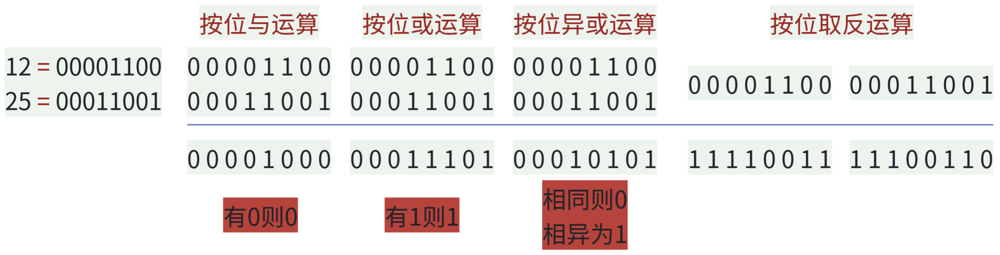
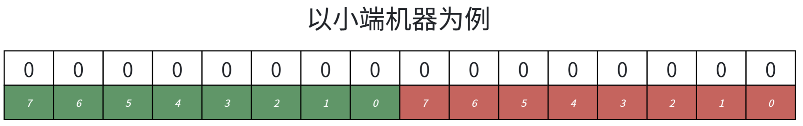
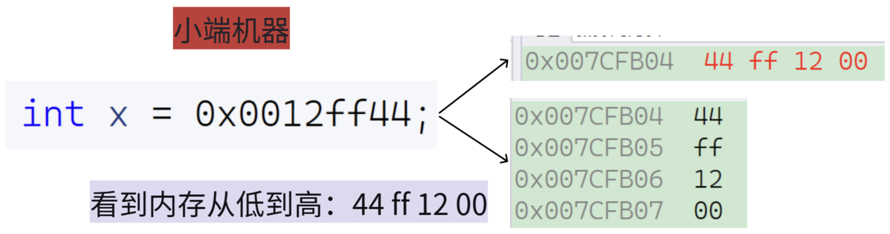
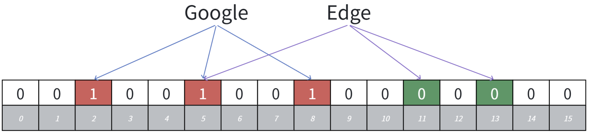

# 位运算

| **运算符** | **运算规则（底层逻辑）**                                     | **核心作用与特点**                                           | **经典业务/算法用法**                                        |
| ---------- | ------------------------------------------------------------ | ------------------------------------------------------------ | ------------------------------------------------------------ |
| **`&`**    |  对齐位**都是 1，结果才为 1**。 （遇 0 则 0）                 | **掩码提取**、**强制清零**。 与 0 结合必为 0，与 1 结合保留原值。 | **1. 判断奇偶**：`x & 1` **2. 提取指定位**：`x & 15` **3. 判 2 的幂**：`x & (x-1) == 0` |
| **`|`**    |  对齐位**只要有 1，结果就是 1**。 （遇 1 则 1）               | **强制置 1**。 与 1 结合必为 1，与 0 结合保留原值。          | **组合/增加标志位**（权限控制）： `flag = READ | WRITE`      |
| **`^`**    |  对齐位**相同为 0，不同为 1**。 （不进位的加法）              | **自身抵消性质**（`x ^ x = 0`）、 与 0 结合保持不变（`x ^ 0 = x`）。 | **1. 找单次出现的数字**（全部异或） **2. 无额外变量交换两个数** **3. 翻转指定位** |
| **`~`**    |  单目运算。**所有 0 变 1，1 变 0**。                          | **求反码**。 注意受数据类型位数（如 32 位）影响极大。        | **配合 `&` 进行反向掩码清零**： `x & ~(1 << n)`（将第 n 位清零） |
| **`<<`**   |  二进制整体左移，**右侧空位补 0**。                           | 在不溢出的情况下， **左移 $n$ 位等价于乘以 $2^n$**。         | **1. 快速乘法**：`x << 1` 代替 `x * 2` **2. 快速构造掩码**：`1 << n` |
| **`>>`**   |  二进制整体右移。**无符号数左侧补 0；有符号数左侧补符号位**（算术右移）。 | **右移 $n$ 位等价于整除 $2^n$** （向下取整）。               | **快速除法**：二分查找中常用 `(left + right) >> 1` 代替 `/ 2` 以压榨性能 |



| **操作目的**                     | **核心单行代码**              | **简要说明**                          |
| -------------------------------- | ----------------------------- | ------------------------------------- |
| **获取** 第 `i` 位的值（0 或 1） | `(n >> i) & 1`                | 将目标位移到最低位，然后用 1 截取     |
| **设置** 第 `i` 位为 1           | `n ｜ (1 << i)`               | 构造掩码，按位或                      |
| **清零** 第 `i` 位（设为 0）     | `n & ~(1 << i)`               | 构造第 `i` 位为 0 的掩码，按位与      |
| **翻转** 第 `i` 位（0变1，1变0） | `n ^ (1 << i)`                | 构造掩码，按位异或实现翻转            |
| **判断奇数**                     | `n & 1`                       | 结果为 1 则是奇数（比 `% 2` 效率高）  |
| **判断偶数**                     | `(n & 1) == 0`                | 最低位为 0 则是偶数                   |
| **消除最低位的 1**               | `n & (n - 1)`                 | 经典技巧，常用于统计二进制中 1 的个数 |
| **提取最低位的 1** (Lowbit)      | `n & (-n)`                    | 利用补码特性保留最右侧的 1，其他清零  |
| **判断是否为 2 的幂次方**        | `n > 0 && (n & (n - 1)) == 0` | 2的幂只有一个 1，消除后必然为 0       |

# 一、位图

## 1.1 核心概念与原理

位图的本质是一个**直接定址法的哈希表**，它通过让每个整型值映射到一个 bit 位来记录信息。

- **设计思想**：判断一个数据是否存在，结果只有“在”或“不在”两种状态。我们刚好可以使用一个二进制的比特位（bit）来代表这两种状态：如果比特位为 1 代表存在，为 0 代表不存在。
- **底层映射实现**：由于 C/C++ 没有直接对应 bit 的类型，通常借助 `int` 或 `char` 等整型数组（如 `vector<int>`），通过位运算去控制对应的比特位。假设数据存放在 `vector<int>` 中，对于一个整型值 `x`：
	- 计算所在的数组下标（即第几个 `int`）：`i = x / 32`。
	- 计算所在 `int` 中的具体位：`j = x % 32`。
	- 这说明 `x` 映射的值在 vector 的第 `i` 个整型数据的第 `j` 位。

这里以小端机器进行举例：



> [!NOTE]
>
> 这里怎么判断是不是小端模式呢？
>
> 
>
> **低位在低地址，高位在高地址！！！**

## 1.2 C++ 标准库：`std::bitset`

在 C++ 中，`std::bitset` 是标准库提供的一个非常强大且高效的位图容器，定义在 `<bitset>` 头文件中。与我们手动写位运算相比，它封装了各种复杂的位操作，并提供了极其丰富的接口。

它的最大特点是：**大小在编译时就必须确定（非动态扩容）**。如果需要在运行时动态改变大小的位图，通常会使用 `std::vector<bool>` 或第三方库如 `boost::dynamic_bitset`。

> [!IMPORTANT]
>
> 可以认为库里的实现就是原生的C风格数组。

### 1.2.1 `std::bitset` 的核心 API 与用法

> [!IMPORTANT]
>
> 在 C++ 的 `std::bitset` 中，`set`、`reset` 和 `test` 是最核心、最常用的三个基础接口，它们分别对应了位图的**改为1**、**改为0**和**查询**操作。
>
> 需要特别牢记的一个前提是：`std::bitset` 的索引是从右向左数的（即最右边是第 0 位，代表最低有效位）。
>
> ### 1. `set` 接口：置位（设为 1 或指定值）
>
> `set` 的主要作用是将位图中的某些位修改为 `1`（或者根据传入的参数修改为 `0`）。它有几种不同的重载形式：
>
> - **`set()`**：不传任何参数时，将位图中的**所有位**都设置为 `1`。
> - **`set(pos)`**：将指定位置 `pos` 的位设置为 `1`。
> - **`set(pos, val)`**：将指定位置 `pos` 的位设置为布尔值 `val`（`true` 为 1，`false` 为 0）。
>
> **代码演示：**
>
> ```C++
> #include <iostream>
> #include <bitset>
> int main() 
> {
>     std::bitset<4> bs("0000");
>     // 1. 设置指定位
>     bs.set(1);       // 变成 0010 (第1位变成1)
>     // 2. 设置指定位为特定值
>     bs.set(3, true); // 变成 1010
>     bs.set(1, false);// 变成 1000 (将刚刚设为1的第1位又改成了0)
>     // 3. 全部置为 1
>     bs.set();        // 变成 1111
>     return 0;
> }
> ```
>
> **安全说明**：如果传入的 `pos` 越界（即 `pos >= 位图大小`），`set(pos)` 会抛出 `std::out_of_range` 异常，这保证了内存安全。
>
> ### 2. `reset` 接口：复位 / 清零（设为 0）
>
> `reset` 的作用非常专一，就是将位图中的位强制清零（设为 `0`）。它对应底层的按位与和取反操作。
>
> - **`reset()`**：不传任何参数时，将位图中的**所有位**都清零为 `0`。
> - **`reset(pos)`**：将指定位置 `pos` 的位清零为 `0`。
>
> **代码演示：**
>
> ```C++
> #include <iostream>
> #include <bitset>
> int main() 
> {
>     std::bitset<4> bs("1111");
>     // 1. 清零指定位
>     bs.reset(2);     // 变成 1011 (第2位变成0)
>     // 2. 全部清零
>     bs.reset();      // 变成 0000
>     return 0;
> }
> ```
>
> **安全说明**：与 `set` 一样，如果 `pos` 越界，`reset(pos)` 会抛出 `std::out_of_range` 异常。
>
> ### 3. `test` 接口：测试 / 查询
>
> `test` 用于检查指定位置的位是否被设置成了 `1`。
>
> - **`test(pos)`**：如果位置 `pos` 的位是 `1`，返回 `true`；如果是 `0`，返回 `false`。
>
> **代码演示：**
>
> ```C++
> #include <iostream>
> #include <bitset>
> int main() 
> {
>     std::bitset<4> bs("1010");
>     bool bit0 = bs.test(0); // 返回 false (0)
>     bool bit1 = bs.test(1); // 返回 true  (1)
>     bool bit2 = bs.test(2); // 返回 false (0)
>     bool bit3 = bs.test(3); // 返回 true  (1)
>     return 0;
> }
> ```
>
> #### `test(pos)` 与 `operator[pos]` 的区别
>
> 在查询位图时，我们也可以使用中括号 `[]`（例如 `bs[1]`）。它们的结果是一样的，但底层逻辑有关键区别：
>
> 1. **安全性（越界检查）**：
> 	- `test(pos)` **会进行边界检查**。如果你写了 `bs.test(100)` 而位图只有 4 位，程序会抛出 `std::out_of_range` 异常，防止程序崩溃或读取脏数据。
> 	- `operator[pos]` **不进行边界检查**。如果你写了 `bs[100]`，属于未定义行为（Undefined Behavior），可能会导致越界访问，但执行速度略快。
> 2. **可修改性**：
> 	- `test(pos)` 是只读的，仅仅返回一个 `bool` 值。
> 	- `operator[pos]` 返回的是一个代理对象的引用（Proxy Reference），**可以直接修改该位**（例如 `bs[1] = true;` 等同于 `bs.set(1);`）。
>
> **最佳实践**：如果仅仅是为了**查询**且不能 100% 保证索引绝对安全，强烈建议优先使用 `test()`。
>
> > [!NOTE]
> >
> > 后面我们自己模拟实现的时候，也就主要实现这三个接口！！！

### 1.2.2 `std::bitset` 的底层原理

> [!IMPORTANT]
>
> 了解底层原理，能帮助我们写出更高性能的代码。虽然 `std::bitset` 的具体实现细节因编译器（如 GCC、Clang、MSVC）的 STL 源码而异，但其核心思想是高度一致的。
>
> #### 1. 底层内存布局（它是如何存数据的？）
>
> 计算机硬件最小的寻址单位是字节（8 bits），而不能单独开辟 1 个 bit。因此，`std::bitset` 底层其实是**维护了一个无符号整数（Unsigned Integer）的静态数组**。
>
> 在主流的 64 位机器上（以 GCC 为例），它通常底层使用的是 `unsigned long` 或者 `unsigned long long` 类型的数组，每个元素包含 64 个位（即 8 字节）。这个基本单位我们称之为一个 **Word（字）**。
>
> - 如果是 `std::bitset<32>`，底层只需要 1 个 `unsigned long long`。内存占用 8 字节。
>
> - 如果是 `std::bitset<100>`，底层需要 2 个 `unsigned long long`（$64 \times 2 = 128 > 100$）。多出来的 28 位会被闲置并保持为 0。内存占用 16 字节。
>
> - **计算所需数组长度的数学公式**：`长度 = (N - 1) / (sizeof(Word) * 8) + 1`
>
> > 这里的N是位的数量 
>
> #### 2. 底层位操作的实现（它是如何读写指定位的？）
>
> 当你调用 `bs.set(pos)` 或 `bs.test(pos)` 时，底层的 C++ 源码需要做两步映射：
>
> 1. **定位属于哪个 Word（数组下标定位）：**
>
> 	使用除法：`pos / 64`（位运算优化为 `pos >> 6`）。
>
> 2. **定位在 Word 中的第几个 Bit（位内定位）：**
>
> 	使用取模：`pos % 64`（位运算优化为 `pos & 63`）。
>
> **源码级等价逻辑演示：**
>
> ```C++
>// 假设底层数组为 unsigned long long _M_w[...];
> // set(pos) 的底层等价操作：
> _M_w[pos >> 6] |= (1ULL << (pos & 63));
> // reset(pos) 的底层等价操作：
> _M_w[pos >> 6] &= ~(1ULL << (pos & 63));
> // test(pos) 的底层等价操作：
> return (_M_w[pos >> 6] & (1ULL << (pos & 63))) != 0;
> ```
> 
> 由于这些都是极其轻量级的位运算（移位、与、或），因此 `std::bitset` 的单点操作速度几乎等同于直接的寄存器操作，非常快。
> 

## 1.3 位图的优缺点

位图作为一种极具特色的底层数据结构，在处理特定类型的海量数据时有着无可比拟的优势，但同时也存在极其明显的局限性。

### 1.3.1 位图的优点

> [!IMPORTANT]
>
> 位图的核心优势可以概括为四个字：**多、快、好、省**。
>
> #### 1. 极致的空间压缩（针对密集型数据）
>
> 在传统的 `int` 数组中，1 个 32 位的整型变量只能存 1 个数字（占用 4 字节）。而在位图中，1 个比特（bit）就能代表 1 个数字的存在状态，1 个 32 位的 `int` 可以表示 32 个数字的状态。
>
> - **空间缩小为原来的 1/32**。
> - **海量数据处理利器**：例如，要记录 40 亿个不重复的无符号整数的状态，如果用传统数组大约需要 16 GB 内存（大部分普通电脑直接 OOM）；而使用位图，只需要 $40亿 \div 8 \approx 500 \text{ MB}$ 内存，轻松装入内存。
>
> #### 2. 查询与修改速度极快
>
> 位图的所有操作（增、删、查）本质上都是通过计算数组下标，然后执行 CPU 原生的位运算（与 `&`、或 `|`、非 `~`、异或`^`）。
>
> - **时间复杂度为绝对的 $O(1)$**，不涉及树的遍历或哈希冲突的链表查找。
> - 由于数据紧密排列在连续内存中，**CPU 缓存命中率极高**，实际执行速度甚至快于大多数哈希表（`std::unordered_set`）。
>
> #### 3. 极其高效的集合运算
>
> 在业务场景中，我们经常需要求两个大集合的**交集、并集或差集**（例如：寻找两个微博大 V 的共同粉丝）。
>
> - **求交集**：直接对两个位图的底层数组执行**按位与 (`&`)**。
> - **求并集**：执行**按位或 (`|`)**。
> - 由于 64 位的 CPU 可以一次性并行处理 64 个元素的集合运算，这种操作比逐个遍历对比要快上几十甚至上百倍。

### 1.3.2 位图的缺点

> [!IMPORTANT]
>
> 位图并不是万能的“银弹”，它的底层逻辑决定了它有以下几个明显的缺陷：
>
> #### 1. 数据稀疏时极度浪费空间（最致命缺点）
>
> 位图开辟的内存大小，**仅取决于数据范围的最大值（上限），而与实际存入的数据量无关**。
>
> - **举个极端的例子**：如果你的集合里只有两个数字：`1` 和 `2000000000`（20亿）。为了存这个 `20亿`，位图仍然需要硬生生开辟约 250 MB 的连续内存空间。而这 250 MB 中，绝绝大多数的位都是 `0`，造成了巨大的空间浪费。
> - **应对方案**：在数据极度稀疏的情况下，传统的哈希表（Hash Set）或红黑树（Tree Set）是更好的选择；
>
> #### 2. 数据类型受限（只能处理整型）--------致命伤
>
> 位图的本质是将数据的值作为“索引”直接映射到比特位上。
>
> - 它**只能天然支持无符号整型（非负整数）**。
> - 如果你要判断的是字符串（如 URL、邮箱、身份证号）或其他复杂对象是否存在，位图直接瘫痪。
> - **应对方案**：如果要处理字符串，必须先用哈希函数将字符串转为整数。但这会带来哈希冲突的问题，为了解决这个问题，就演化出了基于位图的**布隆过滤器（Bloom Filter）**。
>
> #### 3. 只能表达“有/无”，无法携带更多信息
>
> - **无法统计频率**：标准位图的一个位只能是 `0` 或 `1`。如果数字 `5` 插入了 10 次，位图里依然只是第 5 位为 `1`，你无法知道它到底出现了几次。
> 	- *(注：可以通过扩展为“双位图”或“多位图”来解决，比如用 2 个 bit 代表 0~3 次，但这样又会增加空间消耗)*。
> - **不能做 Key-Value 映射**：位图只是一个“集合（Set）”，不能像 Map 那样给元素绑定附加信息（比如存了用户 ID，但不能同时存用户的名字）。

### 1.3.3 总结

- **何时用位图？** 当你的数据是**整型**，且数据量**巨大**、分布相对**密集**，只需要判断**存在与否**时，位图是无敌的。
- **何时不用位图？** 当数据跨度极大且**稀疏**（如存几个巨长无比的 ID），或者你需要统计**出现次数**，亦或者你需要存储的是**非整型数据**时，请避开位图。

## 1.4 经典面试题及解题思路

### 面试题 1：海量数据判断存在问题（腾讯/百度经典面试题）

- **题目**：给 40 亿个不重复的无符号整数，没排过序。给一个无符号整数，如何快速判断一个数是否在这 40 亿个数中？
- **深入分析**：如果采用“排序+二分查找”的思路，40 亿个整数大约需要占据 16G 内存（$1G \approx 10亿 \text{ Byte}$），这些数据无法直接放到内存中，只能放到硬盘里，而二分查找只能针对内存数组中的有序数据。
- **位图题解**：
	- 使用位图解决。注意，不需要开辟 40 亿个位，而是要**按数据大小范围开空间**。无符号整数的范围是 $0$ 到 $2^{32}-1$，因此需要开 $2^{32}$ （4,294,967,296）个位。
	- 依次从文件中读取每个数据并设置到位图中，之后就可以以 $O(1)$ 的时间复杂度快速判断该值是否存在。

### 面试题 2：海量数据求交集

- **题目**：给两个文件，分别有 100 亿个整数，我们只有 1G 内存，如何找到两个文件交集？
- **位图题解**：
	- 将两个文件的数据读出来，分别放进两个独立的位图（`bs1` 和 `bs2`）中。
	- 依次遍历数据范围，如果某一个值在两个位图中同时存在（即对应位均为 1），那么这个值就是交集。

### 面试题 3：统计海量数据的出现次数（双位图扩展）

- **题目**：一个文件有 100 亿个整数，1G 内存，设计算法找到出现次数不超过 2 次的所有整数。
- **位图题解**：
	- 常规位图一个位只能标记“在或不在”，为了统计具体的次数，可以**为每个值分配两个位**来进行标记。
	- 状态定义：
		- `00` 代表出现 0 次。
		- `01` 代表出现 1 次。
		- `10` 代表出现 2 次。
		- `11` 代表出现 2 次以上。
	- 最后，只需遍历所有的标记状态，统计出所有标记为 `01` 和 `10` 的值，即可得到出现次数不超过 2 次的整数。

## 1.5 模拟实现

### 1.5.1 单位图

```c++
template<size_t N>
class bitset
{
public:
	bitset() { _bs.resize(N / 32 + 1); }
	void set(size_t x)
	{
		size_t i = x / 32;
		size_t j = x % 32;
		// 1左移j位——实际上就是从低位移至高位
		// 按位或——遇见1就是1，其他就是0
		_bs[i] |= (1 << j);
	}
	void reset(size_t x)
	{
		size_t i = x / 32;
		size_t j = x % 32;
		// 1左移j位——实际上就是从低位移至高位
		// 按位与——遇见0就是0，其他就是1
		_bs[i] &= (~(1 << j));
	}
	bool test(size_t x)
	{
		size_t i = x / 32;
		size_t j = x % 32;

		return _bs[i] & (1 << j);
	}
private:
	std::vector<int> _bs;
};
```

### 1.5.2 双位图

复用单位图的接口即可。

```c++
template<size_t N>
class twobitset
{
public:
	void set(size_t x)
	{
		bool bit1 = _bs1.test(x);
		bool bit2 = _bs2.test(x);
		if (!bit1 && !bit2) // 00 -> 01
		{
			_bs2.set(x);
		}
		else if (!bit1 && bit2)// 01 -> 10
		{
			_bs1.set(x);
			_bs2.reset(x);
		}
		else if (bit1 && !bit2) // 10 -> 11
		{
			_bs2.set(x);
		}
	}
	// 返回0 出现0次数
	// 返回1 出现1次数
	// 返回2 出现2次数
	// 返回3 出现2次及以上
	int get_count(size_t x)
	{
		bool bit1 = _bs1.test(x);
		bool bit2 = _bs2.test(x);

		if (!bit1 && !bit2)// 00
			return 0;
		else if (!bit1 && bit2) // 01
			return 1;
		else if (bit1 && !bit2) // 10
			return 2;
		else // 11
			return 3;
	}
private:
	bitset<N> _bs1;
	bitset<N> _bs2;
};
```

# 二、布隆过滤器

**布隆过滤器（Bloom Filter）** 是位图（Bitmap）的一种极其巧妙且重要的演进版本。

之前实现的位图有一个致命缺陷：**它只能处理整数**。如果你想判断一个字符串（如一个 URL、一个邮箱地址或一个用户名）是否存在，位图就无能为力了。如果强行把字符串通过哈希函数转成整数存入位图，由于哈希冲突的存在，必定会发生严重的误判。

为了在**节省极致空间**的同时，能够**处理任何类型的数据**并**将误判率控制在可接受范围内**，布隆过滤器应运而生。

## 2.1 核心概念及原理

> [!IMPORTANT]
>
> 布隆过滤器的本质是：**一个超大的位数组（Bit Array） + 多个不同的哈希函数（Hash Functions）**。
>
> #### 1. 初始化
>
> 布隆过滤器在初始状态下，是一个包含 $m$ 个比特位的数组，所有位都被初始化为 `0`。
>
> #### 2. 插入元素（Set）
>
> 当我们要把一个元素（例如字符串 `"google"`）加入布隆过滤器时：
>
> 1. 将这个字符串分别通过 $k$ 个不同的哈希函数进行计算。
> 2. 得到 $k$ 个不同的哈希值。
> 3. 将这 $k$ 个哈希值对数组长度 $m$ 取模，得到 $k$ 个位置索引。
> 4. 将位数组中这 $k$ 个位置上的位**全部置为 `1`**。
>
> #### 3. 查询元素（Test）
>
> 当我们要判断一个元素（例如 `"baidu"`）是否存在时：
>
> 1. 用同样的 $k$ 个哈希函数对该字符串进行计算，得到 $k$ 个位置索引。
>
> 2. 检查位数组中这 $k$ 个位置的状态：
>
> 	- **情况 A：只要有任何一个位是 `0`**。
>
> 		结论：**绝对不存在**。（因为如果它曾经被插入过，这 $k$ 个位肯定早就被全置为 1 了）。
>
> 	- **情况 B：如果这 $k$ 个位全部是 `1`**。
>
> 		结论：**可能存在**。（注意，这里是“可能”，因为这 $k$ 个位上的 1，可能是由之前插入的其他几个不同元素凑巧共同点亮的。这就是所谓的**误判 / False Positive**）。

> [!CAUTION]
>
> 布隆过滤器的思路就是把key先映射转成哈希整型值，再映射⼀个位，**如果只映射⼀个位的话，冲突率会比较多，所以可以通过多个哈希函数映射多个位，降低冲突率**。 布隆过滤器这⾥跟哈希表不⼀样，它**无法解决哈希冲突**的，因为**他压根就不存储这个值**，只标记映射的位。它的**思路是尽可能降低哈希冲突**。**判断⼀个值key在是不准确的**，**判断⼀个值key不在是准确的**。



这里就可以明显看见，如果你查`Edge`这个字符串在不在布隆过滤器里面，这时候就是不准的，因为他有一个哈希函数映射的值刚好与在布隆过滤器里面的字符串重合了。

## 2.2 布隆过滤器器误判率推导

> [!TIP]
>
> ### 一、 假设与变量定义
>
> 首先，定义布隆过滤器的三个核心变量：
>
> - $m$：布隆过滤器的比特位（bit）总长度。
> - $n$：插入过滤器的总元素个数。
> - $k$：哈希函数的个数。
>
> ### 二、 单个比特位的状态概率推导
>
> **1. 插入单个元素时，某个特定比特位的状态概率：**
>
> - 在哈希函数等概率映射的条件下，某一个特定的位被 1 个哈希函数**设置为 1 的概率**为：$$\frac{1}{m}$$
> - 反之，该位**不被设置为 1 的概率**为：$$1 - \frac{1}{m}$$
> - 一个元素会经过 $k$ 次哈希函数计算，经过这 $k$ 次哈希后，某个特定位置**依旧不为 1 的概率**为：$$(1 - \frac{1}{m})^k$$
>
> **2. 引入极限公式进行近似化简：**
>
> 根据自然对数底数 $e$ 的极限定义：$$\lim_{m \to \infty} (1 - \frac{1}{m})^{-m} = e$$
>
> 我们可以对上面的概率公式进行变换和近似处理（因为 $m$ 通常非常大）：$$(1 - \frac{1}{m})^k = ((1 - \frac{1}{m})^m)^{\frac{k}{m}} \approx e^{\frac{-k}{m}}$$
>
> **3. 插入 $n$ 个元素后的概率：**
>
> - 当添加 $n$ 个元素后（相当于执行了 $k \times n$ 次哈希），某个特定位置**依然不为 1 的概率**为：$$(1 - \frac{1}{m})^{kn} \approx e^{\frac{-kn}{m}}$$
> - 由上可知，添加 $n$ 个元素后，某个特定位置**已经被置为 1 的概率**（即 1 减去不为 1 的概率）为：$$1 - (1 - \frac{1}{m})^{kn} \approx 1 - e^{\frac{-kn}{m}}$$
>
> ### 三、 整体误判率公式推导
>
> 当我们**查询**一个本来**不存在**的元素时，需要通过 $k$ 个哈希函数检查 $k$ 个位。
>
> **发生误判的条件**是：这 $k$ 个位恰好都已经因为之前插入的其他元素被设置为了 1。
>
> 因此，这 $k$ 个位**全部命中 1 的概率**（即误判率 $f(k)$）为单个位为 1 的概率的 $k$ 次方：
>
> $$
> f(k) = (1 - (1 - \frac{1}{m})^{kn})^k \approx (1 - e^{\frac{-kn}{m}})^k
> $$
>
> ### 四、 核心结论与最优参数公式
>
> 根据上述推导，我们得出布隆过滤器的最终误判率公式：
>
> $$
> f(k) = (1 - e^{\frac{-kn}{m}})^k = (1 - \frac{1}{e^{\frac{kn}{m}}})^k
> $$
>
> 从公式中可以得出以下直观结论：
>
> - **在 $k$（哈希函数个数）一定的情况下**：
> 	- 当 $n$（插入元素个数）增加时，误判率增加。
> 	- 当 $m$（位图长度）增加时，误判率减少。
> 	- 也就是当$\frac{m}{n}$变大时，误判率减少。
>
> **工程应用中的两个重要公式：**
>
> 1. **最优哈希函数个数 $k$**：
>
> 	在 $m$ 和 $n$ 一定的情况下，如果对误判率公式求导，使其取极小值，可以得到让误判率最低的哈希函数个数：$$k = \frac{m}{n} \ln 2$$
>
> 2. **最优位图长度 $m$**：
>
> 	在给定期望的误判率 $p$ 和计划插入的数据个数 $n$ 的情况下，将最优 $k$ 代入原公式反推，可以计算出需要开辟的位图总长度 $m$：
> 	$$
> 	m = -\frac{n \times \ln p}{(\ln 2)^2}
> 	$$
>

[布隆过滤器（Bloom Filter）- 原理、实现和推导布隆过滤器原理](https://blog.csdn.net/hlzgood/article/details/109847282)

[[布隆过滤器BloomFilter\] 举例说明+证明推导_bloom filter 最佳hash函数数量 推导](https://blog.csdn.net/quiet_girl/article/details/88523974)

## 2.3 布隆过滤器的优缺点

> [!IMPORTANT]
>
> #### 优点：多、快、好、省
>
> - **空间利用率极高**：相比于哈希表（如 `std::unordered_set`）存储实际的字符串，布隆过滤器不存储数据本身，只存储数据的“指纹（状态）”，极其节省内存。
> - **查询速度极快**：只需要执行 $k$ 次哈希计算和位运算，时间复杂度为 $O(k)$，常数级别，与数据量无关。
> - **保密性极好**：因为不存储原始数据，即使被黑客拖库，也无法还原出原本存了哪些字符串。
>
> #### 缺点：不可逆的先天缺陷
>
> - **存在误判率（False Positive）**：它会把不存在的说成存在，但绝不会把存在的说成不存在（即**在是不准确的，不在是绝对准确的**）。
>
> - **无法删除元素（核心痛点）**：
>
> 	假设元素 A 和元素 B 共同映射到了第 5 个比特位（该位被置为 1）。现在如果你想从过滤器中删除元素 A，你不能简单地把第 5 位置为 0，因为这会直接导致原本存在的元素 B 在查询时被判定为“不存在”。
>
> 	*(注：如果要支持删除，需要对结构进行改造，升级为**计数布隆过滤器 Counting Bloom Filter**，用多个位组成一个计数器代替单一的 0/1)*。

## 2.4 布隆过滤器的模拟实现

[各种字符串Hash函数 - clq - 博客园](https://www.cnblogs.com/-clq/archive/2012/05/31/2528153.html)这是一些字符串常见的哈希函数，挑几个就好了。

```c++
#include"BitSet.h"
#include <string>
struct HashFuncBKDR
{
	// @detail 本 算法由于在Brian Kernighan与Dennis Ritchie的《The CProgramming Language》
	// 一书被展示而得 名，是一种简单快捷的hash算法，也是Java目前采用的字符串的Hash算法累乘因子为31。
	size_t operator()(const std::string& s)
	{
		size_t hash = 0;
		for (auto ch : s)
		{
			hash *= 31;
			hash += ch;
		}
		return hash;
	}
};
struct HashFuncAP
{
	// 由Arash Partow发明的一种hash算法。  
	size_t operator()(const std::string& s)
	{
		size_t hash = 0;
		for (size_t i = 0; i < s.size(); i++)
		{
			if ((i & 1) == 0) // 偶数位字符
				hash ^= ((hash << 7) ^ (s[i]) ^ (hash >> 3));
			else              // 奇数位字符
				hash ^= (~((hash << 11) ^ (s[i]) ^ (hash >> 5)));
		}
		return hash;
	}
};
struct HashFuncDJB
{
	// 由Daniel J. Bernstein教授发明的一种hash算法。 
	size_t operator()(const std::string& s)
	{
		size_t hash = 5381;
		for (auto ch : s)
			hash = hash * 33 ^ ch;
		return hash;
	}
};

template<size_t N,
    class K = std::string, 
    size_t X = 5, 
    class Hash1 = HashFuncBKDR,
    class Hash2 = HashFuncAP,
    class Hash3 = HashFuncDJB>
class BloomFilter
{
public:
    void Set(const K& key)
    {
        size_t hash1 = Hash1()(key) % M;
        size_t hash2 = Hash2()(key) % M;
        size_t hash3 = Hash3()(key) % M;
        _bs.set(hash1);
        _bs.set(hash2);
        _bs.set(hash3);
    }
    bool Test(const K& key)
    {
        size_t hash1 = Hash1()(key) % M;
        if (!_bs.test(hash1)) return false;
        size_t hash2 = Hash2()(key) % M;
        if (!_bs.test(hash2)) return false;
        size_t hash3 = Hash3()(key) % M;
        if (!_bs.test(hash3)) return false;
        return true;
    }
    // 获取公式计算出的误判率
    double getFalseProbability()
    {
        double p = pow((1.0 - pow(2.71, -3.0 / X)), 3.0);
        return p;
    }
private:
    static const size_t M = N * X;
    csa::bitset<M> _bs;
};
```

## 2.5 经典应用场景

布隆过滤器（Bloom Filter）之所以在工业界大放异彩，正是因为它用**极小的空间代价**解决了**海量数据下的存在性判断问题**。

在实际应用中，引入布隆过滤器通常是为了**挡掉大量无效请求，保护底层重型系统（如数据库、磁盘）**。只要业务场景能够容忍“极小概率的误判（把没有的说成有）”，它就是神器。

> [!IMPORTANT]
>
> ### 1. 解决 Redis 缓存穿透问题（最经典、最高频面试题）
>
> - **痛点**：在“客户端 -> Redis 缓存 -> MySQL 数据库”的架构中，如果有黑客恶意疯狂请求一个**数据库里根本不存在的 ID**（比如 `id = -1`）。Redis 查不到，就会把请求透传给 MySQL；MySQL 也查不到，自然也没法把结果写回 Redis。最终大量请求直接砸在 MySQL 上，导致数据库瞬间崩溃。这就是“缓存穿透”。
> - **布隆过滤器的解法**：
> 	1. 系统启动时，将 MySQL 中所有真实存在的 ID 全部初始化到 Redis 的布隆过滤器中。
> 	2. 当请求到来时，先过布隆过滤器。
> 	3. 如果布隆过滤器判定为“不存在”，直接拦截并返回，**请求根本摸不到 Redis 和 MySQL**。
> 	4. 如果布隆过滤器判定为“可能存在”，才允许去查 Redis 和 MySQL。即使发生极小概率的误判（把不存在的 ID 判为存在），也只有极少数请求会漏到 MySQL，完全在数据库的可承受范围内。
>
> ### 2. 网页爬虫的 URL 去重 (URL Deduplication)
>
> - **痛点**：像百度、谷歌这样的搜索引擎，每天需要爬取上百亿、千亿个网页。爬虫在抓取网页时，会解析出成千上万的新 URL。为了防止死循环和重复抓取，必须记录哪些 URL 已经爬过。如果用哈希表（Set）存上百亿个长字符串，需要 TB 级别的内存，成本极高。
> - **布隆过滤器的解法**：
> 	- 使用布隆过滤器记录所有已爬取的 URL。
> 	- 每次遇到新 URL，先问布隆过滤器。如果回答“存在”，直接跳过；如果回答“不存在”，才去抓取并将它加入布隆过滤器。
> 	- **误判的影响**：误判只会导致“极少数原本没爬过的网页，被系统误认为爬过了而跳过”。对于庞大的互联网而言，漏掉千万分之一的边缘网页，对搜索引擎的体验几乎零影响，但却省下了成百上千台服务器的内存开销。
>
> ### 3. 数据库与存储引擎的内部优化（LSM-Tree）
>
> - **痛点**：现代分布式数据库和键值存储（如 HBase, Cassandra, RocksDB, LevelDB）大多采用 LSM-Tree 结构。数据是被分层存储在磁盘的多个文件（SSTable）中的。如果要查询一个键，可能需要扫描多个磁盘文件，磁盘 I/O 极慢。
> - **布隆过滤器的解法**：
> 	- 在每个磁盘文件（SSTable）的内存索引中，都附加一个布隆过滤器。
> 	- 查询时，先查布隆过滤器：这个键在这个文件里吗？如果回答“不在”，直接跳过这个文件，根本不需要读磁盘。
> 	- 只有布隆过滤器说“可能在”时，才真正发起磁盘 I/O 去读取数据。这极大地减少了不必要的磁盘扫描操作。
>
> ### 4. 垃圾邮件与钓鱼网站拦截
>
> - **痛点**：浏览器（如 Chrome）或邮件服务商需要维护一个庞大的“恶意网址黑名单”或“垃圾邮件发送者黑名单”。由于名单巨大，每次收到邮件或访问网页都去远程查库会非常慢。
> - **布隆过滤器的解法**：
> 	- Chrome 浏览器的 Safe Browsing 功能早期就使用了布隆过滤器。
> 	- 把庞大的黑名单特征压入一个布隆过滤器，并随浏览器更新下载到用户的本地电脑。
> 	- 用户访问网页时，本地布隆过滤器瞬间判断是否是恶意网站。如果判断为“不存在（安全）”，直接放行；如果判断为“可能存在（危险）”，浏览器再向谷歌服务器发起一次二次确认请求。既保护了隐私，又保证了速度。
>
> ### 5. 注册时的“用户名已占用”检测
>
> - **痛点**：在大流量平台（如微博、B站、游戏注册）创建新账号时，输入用户名后，系统需要立刻提示你“该名字已被注册”。如果每次键盘敲击都去查 MySQL，数据库压力会非常大。
> - **布隆过滤器的解法**：
> 	- 将所有已注册的用户名放进布隆过滤器。
> 	- 用户输入时，先查布隆过滤器。如果说“不在”，直接显示绿色打勾（可以使用）。
> 	- 如果说“可能在”，系统再查一次数据库（或者直接委屈一下用户，哪怕这个名字其实没被注册，系统也提示被占用了，让用户换一个名字即可）。

# 三、海量数据处理问题

## 问题 3.1：10亿个整数里面求最大的前100个（Top K 问题）

- **问题核心**：在极大数据量中寻找极少数的极值。
- **图片给出的解法**：这是一个**经典的 Top K 问题，用堆解决**。
- **详细原理解释**：在内存有限的情况下，不需要将 10 亿个整数全部读入内存并排序。只需要在内存中维护一个大小为 100 的**小顶堆**。先读入前 100 个数建堆，然后依次读取后续的数：如果读到的数比堆顶元素（堆中最小的数）大，就把堆顶弹出，将新数插入堆中。遍历完 10 亿个数后，堆里剩下的 100 个数就是最大的前 100 个。

## 问题 3.2：位图相关题目（存在性与状态问题）

- **问题核心**：位图章节的位图相关题目。
- **详细原理解释**：结合海量数据的背景，这类问题通常是指在海量且密集的整数中查找某个数是否存在，或者进行去重。解法是使用**位图（Bitmap）**，通过 1 个 bit 的 `0` 或 `1` 状态来代表一个数字是否存在，从而将内存占用压缩到原来的数十分之一。

## 问题 3.3：100亿个 query 找交集（哈希切分问题）

- **题目背景**：给两个文件，分别有 100 亿个 query（查询词），只有 1G 内存，如何找到两个文件交集？
- **难点分析**：假设每个 query 字符串平均占 50 byte，100 亿个 query 大约需要 500GB 的空间。传统的内存数据结构（如哈希表、红黑树）在 1G 内存面前无能为力。

### 解决方案 1：布隆过滤器

- **思路**：将其中一个文件的 query 全部映射并放入布隆过滤器中；然后依次读取另一个文件的 query 在布隆过滤器中进行查找，如果判定“在”，则认为是交集。
- **优缺点**：这种方法能保证真正的交集**一定会被找到**，但缺点是**不够准确**，因为布隆过滤器存在假阳性（误判），可能会把实际上不在交集里的 query 也误认为在交集里。

### 解决方案 2：哈希切分—— 核心精确解法

- **核心思想**：既然大文件放进内存搞不定，就考虑切分为小文件，再放进内存处理。但**绝对不能平均切分**，否则每个小文件都需要与其他所有小文件依次暴力比对，效率太低。

> 而且平均切分也达不到最终想要的效果，如果刚好错开在不同区间，此时答案错误率就高。

- **切分方法**：

	1. 依次读取大文件中的 query，对其计算哈希值并取模：`i = HashFunc(query) % N`（`N` 的大小取决于需要切分多少份才能将小文件放进 1G 内存中）。
	2. 将计算出索引为 `i` 的 query 放进第 `i` 号小文件中。对两个大文件 A 和 B 分别执行此操作，得到一系列小文件 $A_0, A_1 \dots A_{n}$ 和 $B_0, B_1 \dots B_{n}$。

- **为什么这种切分有效？（本质）**：

	使用相同的哈希函数切分后，A 和 B 中**相同的 query 算出的 hash 值 i 绝对是一样的**。这意味着，相同的 query 绝对会双双进入编号相同的小文件（例如都进入 $A_5$ 和 $B_5$）。

- **后续处理**：因为相同的词不可能串流到编号不同的小文件中，所以**只需要对编号相同的小文件（如 $A_i$ 和 $B_i$）进行一一对应的求交集即可**（此时小文件已足够小，可以直接读入内存使用哈希表求交集），完全不需要交叉寻找，极大提升了效率。

	> [!CAUTION]
	>
	> 这种切分也有可能会爆内存，有可能某个小文件内容特别多，此时可以选择不同的哈希函数对这个小文件再进行哈希切分。