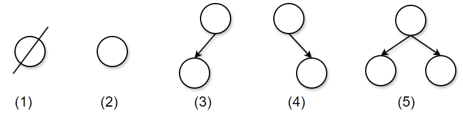
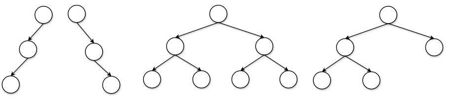
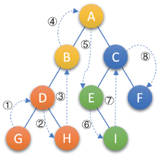
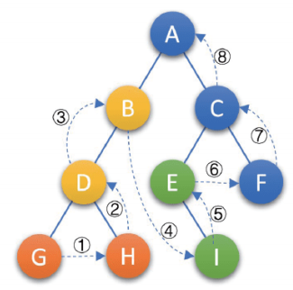
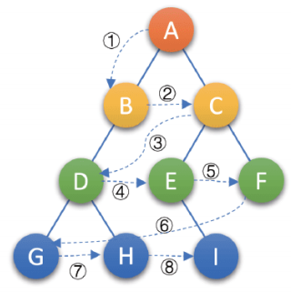

# 二叉树全栈进阶指南：从内存布局到递归本质的深度复盘

# 一、二叉树的底层逻辑与核心概念

二叉树是一种重要的数据结构，它具有一些独特的性质，这些性质在算法设计和数据结构的优化中非常有用。以下是二叉树的一些基本性质：

## 1.1 核心定义与特点

- **节点（Node）**：二叉树的最小单元。通常定义为一个结构体，包含数据域和两个指针域。
- **深度（Depth）与高度（Height）**：
  - **深度**是从根节点自顶向下看（根为1）。
  - **高度**是从叶子节点自底向上看。
  - *公式推导*：在一棵高度为 $h$ 的二叉树中，最多有 $2^h - 1$ 个节点。

- **每个结点最多有两棵子树**，所以二叉树中不存在度大于 2 的结点。**注意不是只有两棵子树，而是最多有**。没有子树或者有一棵子树都是可以的。
- **左子树和右子树是有顺序的**，次序不能任意颠倒。就像人有双手、双脚，但显然左手、左脚和右手、右脚是不一样的，右手戴左手套、右脚穿左鞋都会极其别扭和难受。
- **即使树中某结点只有一棵子树，也要区分它是左子树还是右子树**。下图中，树 1 和树 2 是同一棵树，但它们却是不同的二叉树。就好比你一不小心，摔伤了手，伤的是左手还是右手，对你的生活影响度是完全不同的。

## 1.2 二叉树的五种基本形态

**空树**、**只有根节点**、**根节点只有左子树**、**根节点只有右子树**，以及**根节点同时有左子树和右子树**，这五种形态构成了所有二叉树的逻辑基础，其递归定义是根据这些基本单元构建的。 

**五种基本形态详解：**

1. **空二叉树 (Empty Binary Tree)**：不含任何节点的树，是递归的基准情况。
2. **只有根节点 (A Single Node)**：只包含一个根节点，没有子节点。
3. **根节点只有左子树 (Root with Left Subtree)**：根节点有左孩子，但没有右孩子，左孩子可能本身又是另一个二叉树。
4. **根节点只有右子树 (Root with Right Subtree)**：根节点有右孩子，但没有左孩子，右孩子可能本身也是一个二叉树。
5. **根节点既有左子树又有右子树 (Root with Both Left and Right Subtrees)**：根节点同时拥有左子树和右子树。 



> 这五种基本形态是后续二叉树相关算法的基础。

## 1.3 特殊二叉树

再来介绍一些特殊的二叉树。这些树可能暂时你不知道他们有什么用处，但还是先了解一下，后续会提到它们的具体用处。

1. 斜树：顾名思义，斜树是指所有结点都向一侧偏转的二叉树：

  - **左斜树**：所有结点都只有左子树。
  - **右斜树**：所有结点都只有右子树。
  - **特点**：斜树每一层只有一个结点，其结点总数等于树的深度。在某种程度上，斜树可以看作是线性表的一种特殊表现形式。
2. 满二叉树：满二叉树被视为一种“完美”的结构。在一棵二叉树中，如果所有分支结点都存在左子树和右子树，并且所有的叶子结点都在同一层上，这样的树就称为**满二叉树**。核心特点：
   1. 叶子只能出现在最下一层。
   2. 非叶子结点的度一定为 2。
   3. 在同样深度的二叉树中，满二叉树的结点个数最多，叶子数也最多。

3. 完全二叉树：对一棵具有 $n$ 个结点的二叉树按层序编号，如果编号为 $i$ ($1 \le i \le n$) 的结点与同样深度的满二叉树中编号为 $i$ 的结点在二叉树中位置完全相同，则这棵二叉树称为完全二叉树。
	- 叶子结点只能出现在最下两层。 
	- 最下层的叶子一定集中在左部连续位置。
	- 倒数两层，若有叶子结点，一定都在右部连续位置。
	- 如果结点度为 1，则该结点只有左孩子，即不存在只有右孩子的情况。
	- 同样结点数的二叉树，完全二叉树的深度最小。
>首先从字面上要区分，“完全”和“满”的差异，满二叉树一定是一棵完全二叉树，但完全二叉树不一定是满的。 其次，完全二叉树的所有结点与同样深度的满二叉树，它们按层序编号相同的结点，是一一对应的。这里有个关键词是**按层序编号**。

其中完全二叉树还算是相对较了解的，因为这是之前我们实现的**堆**结构的物理基础。



## 1.4 二叉树的五条性质

**性质 1：在二叉树的第 $i$ 层上至多有 $2^{i-1}$ 个节点 ($i \ge 1$)。**

- **解析**：第一层是 $2^0 = 1$ 个节点，第二层是 $2^1 = 2$ 个节点，第三层是 $2^2 = 4$ 个节点。以此类推，每层节点的上限遵循几何级数。

**性质 2：深度为 $k$ 的二叉树至多有 $2^k - 1$ 个节点 ($k \ge 1$)。**

- **解析**：这是一个等比数列求和的结果。如果每一层都达到最大节点数（即满二叉树），总节点数即为 $\sum_{i=1}^{k} 2^{i-1} = 2^k - 1$。

**性质 3：对任何一棵二叉树 $T$，如果其终端节点数为 $n_0$，度为 2 的节点数为 $n_2$，则 $n_0 = n_2 + 1$。**

- **解析**：
  - 设 $n$ 为总结点数，$n_1$ 为度为 1 的节点数，则 $n = n_0 + n_1 + n_2$。
  - 从分支线（连线）的角度看，连线总数等于 $n-1$（除了根节点，每个节点上方都有一条连线），同时也等于 $n_1 + 2n_2$（度为 1 的节点引出 1 条线，度为 2 的节点引出 2 条线）。
  - 通过方程 $n_0 + n_1 + n_2 - 1 = n_1 + 2n_2$，可推导出 $n_0 = n_2 + 1$。

**性质 4：具有 $n$ 个节点的完全二叉树的深度为 $\lfloor \log_2 n \rfloor + 1$。**

- **解析**：根据性质 2，深度为 $k$ 的满二叉树节点数为 $2^k - 1$。对于完全二叉树，其节点数 $n$ 满足：$2^{k-1} - 1 < n \le 2^k - 1$。通过对数运算可得 $k = \lfloor \log_2 n \rfloor + 1$。

**性质 5：如果对一棵有 $n$ 个节点的完全二叉树的节点按层序编号，对任一节点 $i$ ($1 \le i \le n$) 有：**

- **根节点判断**：如果 $i=1$，则节点 $i$ 是二叉树的根，无双亲；如果 $i>1$，则其双亲是节点 $\lfloor i/2 \rfloor$。
- **左孩子判断**：如果 $2i > n$，则节点 $i$ 无左孩子（节点 $i$ 为叶子节点）；否则其左孩子是节点 $2i$。
- **右孩子判断**：如果 $2i + 1 > n$，则节点 $i$ 无右孩子；否则其右孩子是节点 $2i + 1$。

## 1.5 存储结构

⽤链表来表⽰⼀棵⼆叉树，即⽤链来指⽰元素的逻辑关系。 通常的⽅法是链表中每个结点由三个域组成，数据域和左右指针域，左右指针分别⽤来给出该结点左孩⼦和右孩⼦所在的链结点的存储地址 ，其结构如下：

```c
typedef struct BinaryTreeNode 
{
    BTDataType data;//数据
    struct BinaryTreeNode* left;//左孩子
    struct BinaryTreeNode* right;//右孩子
} BTNode;
```

# 二、遍历的递归之美

**二叉树的遍历原理：**假设，我手头有 20 张 100 元的和 2000 张 1 元的奖券，同时撒向了空中，大家比赛看谁最终捡的最多。如果是你，你会怎么做？

相信所有同学都会说，一定先捡 100 元的。道理非常简单，因为捡一张 100 元等于 1 元的捡 100 张，效率高的不是一点点。所以可以得到这样的结论，同样是捡奖券，在有限时间内，要达到最高效率，**次序**非常重要。对于二叉树的遍历来讲，次序同样显得很重要。

> **二叉树的遍历（traversing binary tree）是指从根结点出发，按照某种次序依次访问二叉树中的所有结点，使得每个结点被访问一次且仅被访问一次。**

这里有两个关键词：**访问**和**次序**。

**访问**其实是要根据实际的需要来确定具体做什么，比如对每个结点进行相关计算，输出打印等，它算作是一个抽象操作。在这里我们可以简单地假定访问就是输出结点的数据信息。

二叉树的遍历次序不同于线性结构，最多也就是从头至尾、循环、双向等简单的遍历方式。树的结点之间不存在唯一的初始前驱和后继关系，在访问一个结点后，下一个被访问的结点面临着不同的选择。主要分为以下的形式

## 2.1 前序遍历

逻辑顺序可以总结为：**根结点 -> 左子树 -> 右子树**。

```c
void PreOrder(BTNode* root) 
{
    if (root == NULL) 
    {
        printf("NULL ");
        return;
    }
    printf("%d ", root->data); // 访问根
    PreOrder(root->left);      // 递归左子树
    PreOrder(root->right);     // 递归右子树
}
```

规则是若二叉树为空，则空操作返回，否则先访问根结点，然后前序遍历左子树，再前序遍历右子树。如下图所示，遍历的顺序为 **ABDGHCEIF**。


## 2.2 中序遍历 (In-order Traversal)

逻辑顺序可以总结为：**左子树 -> 根节点 -> 右子树**。

```c
void InOrder(BTNode* root) 
{
    if (root == NULL) 
    {
        printf("NULL ");
        return;
    }
    InOrder(root->left);
    printf("%d ", root->data);
    InOrder(root->right);
}
```

规则是若树为空，则空操作返回，否则从根结点开始（注意并不是先访问根结点），中序遍历根结点的左子树，然后是访问根结点，最后中序遍历右子树。如下图所示，遍历的顺序为 **GDHBAEICF**。



## 2.3 后序遍历 (Post-order Traversal)

逻辑顺序可以总结为：**左子树 -> 右子树 -> 根节点**。

```c
void PostOrder(BTNode* root) 
{
    if (root == NULL) 
    {
        return;
    }
    PostOrder(root->left);
    PostOrder(root->right);
    printf("%d ", root->data);
}
```

规则是若树为空，则空操作返回。否则从左到右先叶子后结点的方式遍历访问左右子树，最后是访问根结点。如下图所示，遍历的顺序为 **GHDBIEFCA**。



## 2.4 层序遍历

- **规则**：若树为空，则空操作返回。
- **顺序**：否则从树的第一层，也就是根结点开始访问，从上而下逐层遍历，在同一层中，按从左到右的顺序对结点逐个访问。
- **示例顺序**：**ABCDEFGHI**。



> 层序遍历需要借助队列，这里就不给源码了，给出参考思路：
>
> 若树为空则返回，否则从根结点开始，按从上到下、从左到右的顺序逐层访问每个结点。在实际算法实现中，通常利用**队列**这一数据结构，先将根结点入队，然后循环执行“出队一个结点进行访问，并将该结点的左、右孩子（若存在）依次入队”的操作，直到队列为空为止。

# 三、经典 OJ 题解析

二叉树的题目几乎全靠**递归**。递归的精髓在于：**不要试图在大脑里压入所有的执行栈，而是要相信函数的功能，并处理好边界条件。**

## 3.1 求二叉树的高度 

一棵树的高度是多少？它取决于它的左子树和右子树中较那个“更高”的一个，再加上根节点本身的一层。

**详细逻辑推导：**

1. **子问题**：求左子树高度 `leftHeight`，求右子树高度 `rightHeight`。
2. **结束条件**：如果节点为空，高度为 0。
3. **返回逻辑**：比较左右高度，取最大值 + 1。

```c
int TreeHeight(BTNode* root) 
{
    if (root == NULL) 
    {
        return 0;
    }
    
    // 注意：一定要定义变量存储结果，否则会导致指数级的重复计算！
    int leftHeight = TreeHeight(root->left);
    int rightHeight = TreeHeight(root->right);
    
    return leftHeight > rightHeight ? leftHeight + 1 : rightHeight + 1;
}
```

**深度性能优化笔记**：在 C 语言中，如果不使用变量记录 `leftHeight` 而是在 `return` 时写 `TreeHeight(root->left) > TreeHeight(root->right) ? ...`，会导致在比较时调用一次递归，在返回加一时又调用一次递归。这会使时间复杂度从 $O(N)$ 降级为 $O(2^N)$，在 `OJ` 测试中会**超时**。

## 3.2 求节点个数

如何统计一棵森林里有多少棵树？数数叶子，数数中间。

对于二叉树：总节点数 = 左子树节点数 + 右子树节点数 + 1（根节点）。

```c
int TreeSize(BTNode* root) 
{
    // 递归出口：空树节点数为0
    return root == NULL ? 0 : TreeSize(root->left) + TreeSize(root->right) + 1;
}
```

**解析**：这段代码极其简洁，体现了递归的分治思想。每一次调用 `TreeSize` 都在解决一个小规模的“根+左右”问题。

## 3.3 判断两个二叉树是否相同

要判断两棵树 p 和 q 是否相同，必须满足：

1. 结构相同（该有节点的地方都有）。
2. 数值相同。

**递归逻辑拆解：**

- **如果都为空**：说明这一侧比较到底了，依然一致，返回 `true`。
- **其中一个为空，另一个不为空**：结构不对等，返回 `false`。
- **值不相等**：内容不对等，返回 `false`。
- **递归检查**：只有当 `left` 相同 **且** `right` 也相同时，整棵树才相同。


```c
bool isSameTree(struct BinaryTreeNode* p, struct BinaryTreeNode* q) 
{
    // 1. 同时为空，是真的相同
    if (p == NULL && q == NULL) 
    {
        return true;
    }
    // 2. 一个为空，一个不为空，或者值不同，则不同
    if (p == NULL || q == NULL || p->val != q->val)
    {
        return false;
    }
    
    // 3. 递归比较左右子树
    return isSameTree(p->left, q->left) && isSameTree(p->right, q->right);
}
```

# 四、递归的代价与内存风险

虽然二叉树的递归解法非常优雅，但在 C 语言中，我们必须时刻关注**栈溢出（Stack Overflow）**风险。

1. **空间复杂度**：二叉树递归的空间复杂度取决于树的高度 $h$。在最坏情况下（树退化成链表），$h = N$，此时递归深度为 $N$，极易导致系统栈空间耗尽。
2. **尾递归优化**：虽然部分编译器支持尾递归优化，但由于二叉树通常需要两次递归调用（左和右），无法直接应用标准尾递归优化。


# 五、 总结

二叉树的学习不仅仅是掌握几种遍历算法，更是对**递归思想**的一次洗礼。通过 C 语言的手动内存管理和指针操作，你能更清晰地看到节点是如何在堆区诞生的，以及递归是如何在系统栈上起舞的。

- **前中后序**是底功，决定了你观察树的角度。
- **高度与节点数**是分治法的典型应用。
- **相同树的判断**则是对多路递归边界条件的极致考察。

