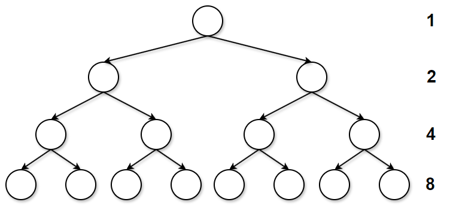
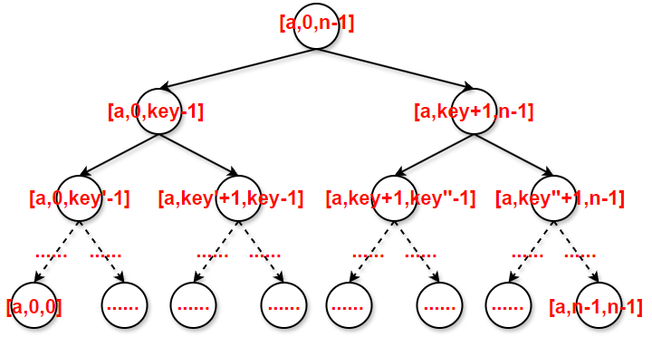

# 【排序算法全家桶 Level 3】交换排序：从“冒泡升腾”到“快速分治天下”

**前言**

如果说上一篇我们聊的选择排序是“点兵点将”，那么今天聊的**交换排序**就是“同台竞技”。

交换排序的核心逻辑非常纯粹：通过两个元素之间的**比较**与**位置交换**，让有序的序列逐渐浮现。

本篇我们将深度拆解：

1. **冒泡排序**：最基础的入阶算法，以及它的极致优化。
2. **快速排序**：算法界的工业级标杆。我们将一口气讲透 **hoare版本、挖坑法、lomuto前后指针** 以及 **非递归实现**。

# 一、 冒泡排序

## 1.1 算法思想：气泡升腾的奥秘

**形象比喻**：想象在一个装满水的玻璃管里，有一堆大小不一的气泡。最大的气泡受到的浮力最大，它会不断推开上方的“小气泡”，直到浮到水面。

冒泡排序之所以叫“冒泡”，是因为它模拟了水中气泡上升的过程。大的气泡（大的数值）会通过相邻位置的比较，一层一层地往“水面”（数组末尾）浮动。冒泡排序是“温柔”的，它不跨级，只和邻居讲道理。

**核心步骤：**

1. 比较相邻的两个元素。如果第一个比第二个大，就交换它们。
2. 对每一对相邻元素做同样的工作，从第一对到最后一对。
3. 每一轮结束，最大的数都会被挪到当前待排序列的最后一位。
4. 重复上述步骤，直到没有任何一对数字需要比较。


## 1.2 为什么你的冒泡排序总是比别人慢？

很多教科书给出的冒泡排序是“死”的。如果数组已经有序了，它依然会傻傻地跑完所有循环。

极致优化思路：设置一个标记。如果在一轮遍历中没有发生任何交换，说明数组已经有序，直接提前关机！

## 1.3 代码实现

```c
void BubbleSort(int* a, int n)
{
    // 外层循环：控制排序的轮数
    // 每执行完一轮，待排序序列中最大的那个数就会被“冒泡”到数组的最后一位
    // n 个元素通常需要比较 n-1 轮
    for (int i = 0; i < n; i++)
    {
        // 【优化关键】：设置一个标记变量 flag
        // 初始设为 0，假设这一轮遍历中没有发生任何交换（即数组已经有序）
        int flag = 0;

        // 内层循环：负责在当前待排序区间内进行相邻两数的比较
        // 随着 i 的增加，数组末尾已经排好序的元素越来越多
        // 因此内层循环的边界是 n - i - 1
        for (int j = 0; j < n - i - 1; j++)
        {
            // 如果前一个数比后一个数大，则说明顺序不对，需要交换
            if (a[j] > a[j + 1])
            {
                // 调用交换函数，将大的数往后挪
                Swap(&(a[j]), &(a[j + 1]));
                // 只要发生了交换，就说明此时数组可能还没完全有序
                // 将 flag 置为 1
                flag = 1;
            }
        }

        // 一轮比较结束后，检查 flag 的状态
        // 如果 flag 依然为 0，说明在这一轮整趟遍历中没有发生任何数据交换
        // 这意味着数组已经完全有序了，不需要再进行后续的轮数，直接提前结束循环
        if (flag == 0)
            break;
    }
}
```

------

# 二、快速排序

快速排序（`Quick Sort`）是计算机科学领域最伟大的算法之一。它的核心是一种**“分而治之”**的策略：选一个基准值（key），通过一次排序将待排记录分割成独立的两部分，其中一部分记录的关键字均比另一部分小，则可分别对这两部分记录继续进行排序，以达到整个序列有序。

## 2.1 初始版本：Hoare 版

快排的创始人 `Tony Hoare` 最初设计的逻辑非常简洁：选取一个基准值（key），通过左右指针的“对冲”交换，实现左右分区。

**算法逻辑：**

1. **选基准**：通常取区间最左侧元素为 `key`。
2. **右指针（R）先行**：从右向左寻找比 `key` 小的值。
3. **左指针（L）后行**：从左向右寻找比 `key` 大的值。
4. **交换**：将 `L` 和 `R` 指向的元素对调。
5. **相遇归位**：当 `L` 与 `R` 相遇时，将 `key` 与相遇点的值交换。


这里就得问问为什么了，为什么相遇的位置一定是`key`的准确位置呢？为什么必须是 $R$ 先走呢？当 $L$ 和 $R$ 相遇时，只有两种情况，而这两种情况在 $R$ 先走的前提下都是安全的：

**情况 A：$R$ 撞上 $L$**

- **过程**：$L$ 在上一轮交换后停下的位置，或者就在初始位置。由于 $L$ 停下的位置要么是 `key` 本身，要么是刚刚换过来的比 `key` 小的值。
- **结果**：$R$ 向左移动寻找比 `key` 小的值，直到撞上 $L$。此时相遇点的值是 $L$ 停留的值（即 $\le key$ 的值），交换是安全的。

**情况 B：$L$ 撞上 $R$**

- **过程**：$R$ 先走，已经找出了一个比 `key` 小的值并停了下来。
- **结果**：随后 $L$ 向右移动寻找大值，如果没有找到，最终会撞上停在“小值点”的 $R$。此时相遇点正是 $R$ 停下的位置，该值必然 $< key$，交换也是安全的。

这个逻辑可以总结为一个对称的原则：

- **左边作 `key`，右边先走**：保证相遇点 $\le key$。
- **右边作 `key`，左边先走**：保证相遇点 $\ge key$。

**一句话总结**：先走的那一方，实际上是在为最后一次交换“踩点”，确保交换回来的数符合分区的要求。

### 2.1.1 初始代码

```c
void QuickSort(int* a, int left, int right)
{
	// 递归终止条件：区间只有一个元素或区间非法
	if (left >= right)
		return;

	int begin = left;
	int end = right;
	// 选定左边第一个数为基准值，记录其位置
	int key_pos = left; 

	while (begin < end)
	{
		// 关键点 1：必须右边先走！寻找比基准值小的值
		while (begin < end && a[end] >= a[key_pos])
			end--;
		// 关键点 2：左边再走 寻找比基准值大的值
		while (begin < end && a[begin] <= a[key_pos])
			begin++;
		// 找到后，交换左右两个“不听话”的元素 使得小的去左边，大的去右边
		Swap(&(a[begin]), &(a[end]));
	}
	// 此时 begin == end，即指针相遇，将相遇点的值与基准值位置的值交换
	// 由于是右边先走，保证了 a[begin] 一定小于等于 a[key_pos]
	Swap(&(a[begin]), &(a[key_pos]));
	// 更新基准值在数组中的最终正确位置
	key_pos = begin;
	// 递归处理左子区间 [left, key_pos - 1]
	QuickSort(a, left, key_pos - 1);
	// 递归处理右子区间 [key_pos + 1, right]
	QuickSort(a, key_pos + 1, right);
}
```

### 2.1.2 优化一：三数取中

在快速排序中，“三数取中”（Median-of-Three）是一项极其关键的优化技术。它的核心目的只有一个：**防止算法在处理“最差情况”时退化，确保排序效率的稳定性**。

以下是为什么要采取这一策略的深层原因：

1. 规避 $O(N^2)$ 的“性能陷阱”：快速排序的平均时间复杂度是 $O(N \log N)$，但这取决于基准值（Pivot）能否将数组大致**对半分**。

   - **理想情况**：每次基准值都能落在区间的中位数附近，递归树是平衡的，层数为 $\log N$。

   - **最差情况**：如果数组已经有序（升序或降序），而你总是选最左边的数作为基准值。此时，基准值每次都是最大或最小值，导致划分出的子区间一个为空，另一个包含 $N-1$ 个元素。递归树会变成一根“长棍”，时间复杂度直接退化到 $O(N^2)$。


2. 提高“基准值”的代表性：“三数取中”通过取区间**左端、右端和中间位置**的三个数，并选出其中的**中位数**作为基准值。

   - **逻辑**：通过这三个位置的采样，极大地降低了选到“极端值”（最大或最小）的概率。

   - **效果**：它强制让基准值更趋向于整个区间的平均水平，从而保证递归划分更加均匀。


代码比较简单，就判断即可。

### 2.1.2 优化二：小区间优化

为什么要进行小区间优化？

快速排序是一个递归算法。随着递归的深入，子区间的长度会越来越短。当区间长度减小到一定程度（例如 10 左右）时，继续使用快排会带来两个负面影响：

1. **递归开销过大**：每一层递归都需要建立函数栈帧，涉及参数传递、寄存器保护等操作。对于只有几个元素的区间，递归带来的系统开销远超排序本身的计算开销。
2. **效率递减**：在数据量极小时，快排 $O(N \log N)$ 的复杂性优势并不明显，而简单的排序算法（如插入排序）因为逻辑简单，在小规模数据下表现更好。



假设此图为快速排序递归树，如果每一次递归都进行到区间只有一个元素为止，那么最后一层将产生最多的函数调用，按照图示算一下，仅仅最后一层就占用函数递归次数的$50\%$以上。而图示中最后一层的节点数仅为 8，在实际大规模排序中，假设递归树有 15 层，最后一层会有 $2^{14} = 16,384$ 次调用。那对于只有 10 个左右元素的区间，快排仍需建立多层函数栈帧。根据统计，**递归树最后 3 到 4 层的节点数占了整棵树总节点数的 80% 以上**。

那就可以将最后几层优化掉，也就是使用别的排序替换掉最后几层的快排。你可以选择任何你喜欢的排序算法，这里我选**插入排序**。

```c
// 小区间优化：当区间长度小于 10 时，采用插入排序
if ((right - left + 1) < 10)
{
    // 注意：传入的地址是 a + left，长度是区间个数
    InsertSort(a + left, right - left + 1);
    return; 
}
```

当子区间的 `right - left + 1` 小于某个阈值（通常设定为 10~15）时，我们不再进行划分，而是直接调用**插入排序（Insertion Sort）**。

**为什么选择插入排序？**

- **趋于有序**：在快排的过程中，数据已经在大体上变得有序了。而插入排序在处理“接近有序”的数据时，效率极高，接近 $O(N)$。
- **空间开销小**：插入排序是原地排序，没有额外的递归成本。

## 2.2 版本二：前后指针法

在快速排序的多种单趟排序实现中，**前后指针法**以其代码极其精简、逻辑高度一致的特点，成为现代工程实践中最受推崇的版本之一。

### 2.2.1 核心思想：推土机策略

前后指针法的核心思想可以形象地比喻为**“推土机”**或**“区域划分”**：

- **`key` (基准值)**：作为参照的标杆，通常选定为区间的第一个元素。
- **`prev` (后指针)**：它是**小于 `key` 区域的边界**。它的左边（包括它自己）存放的都是已经发现的比 `key` 小的值。
- **`cur` (前指针)**：它是**侦察兵**。它从左向右扫描数组，寻找比 `key` 小的元素。


### 2.2.2 算法执行步骤

1. **初始化**：通过“三数取中”优化选出基准值并换到 `left` 位置。令 `prev` 指向 `left`，`cur` 指向 `left + 1`。
2. **侦察阶段 (`cur` 移动)**：
   - 如果 `a[cur]` 大于或等于 `key`，`cur` 直接继续向后走。
   - 如果 `a[cur]` 小于 `key`，说明找到了一个需要被“归位”的小数：
     - `prev` 向前移动一步（扩展小于区边界）。
     - 交换 `a[prev]` 和 `a[cur]`，将这个小数扔进 `prev` 维护的“安全区”内。
3. **基准值归位**：当 `cur` 遍历完整个区间后，`prev` 所在的位置就是小于 `key` 区域的最后一个位置。此时交换 `a[prev]` 和 `a[key_pos]`，`key` 正好落在了大小数的分界点上。

### 2.2.3 实现代码

```c
int PartSort3(int* a, int left, int right)
{
	// 1. 三数取中优化：从左、中、右三个位置选出中间值
	// 目的：防止在处理有序数组时快排退化为 O(N^2)
	int midi = getMidi(a, left, right);
	// 将选出的中间值交换到左边界，作为基准值(key)
	Swap(&(a[midi]), &(a[left]));
	int key_pos = left;   // 记录基准值的位置
	int prev = left;      // prev 指向小于 key 区域的最后一个元素
	int cur = left + 1;   // cur 作为探路指针，寻找比 key 小的元素
	// 2. 探路阶段：cur 遍历整个区间
	while (cur <= right)
	{
		// 如果 cur 发现了一个比基准值小的数
		if (a[cur] < a[key_pos])
		{
			// 小于 key 的区域向后扩展一位
			prev++;
			// 将 cur 发现的小数交换到 prev 的新位置
			// 只有在 prev 和 cur 不相等时才交换，减少无效自换
			if (prev != cur)
				Swap(&(a[cur]), &(a[prev]));
		}
		// cur 无论是否发现小数，都继续向后探测
		cur++;
	}
	// 3. 基准值归位
	// 此时 prev 及其左边都是小于 key 的数，prev 右边都是大于等于 key 的数
	// 将基准值交换到 prev 的位置，使其回到序列正中间
	Swap(&(a[prev]), &(a[key_pos]));
	// 返回基准值的正确下标，用于后续递归分裂区间
	return prev;
}
```

## 2.3 版本三：挖坑法 (最易理解)


挖坑法是 `Hoare` 版本的变体，以其极其直观的逻辑逻辑，成为了最容易理解的版本。通过“填坑”的动作，形象地展示了数据如何根据基准值（key）进行左右分流，**不需要纠结谁先走**。

### 2.3.1 核心思想：填空游戏

挖坑法的核心在于利用一个临时变量存出基准值，从而在数组中制造一个“坑位”，随后通过左右指针交替填坑。

- **基准值 (key)**：通常选定区间第一个元素，将其取出保存，此时该位置（`left`）形成第一个坑。
- **右指针 (right)**：从右向左移动，寻找比 `key` 小的数，将其填入左边的坑中，随后 `right` 位置变成新坑。
- **左指针 (left)**：从左向右移动，寻找比 `key` 大的数，将其填入右边的坑中，随后 `left` 位置变成新坑。


### 2.3.2 算法执行步骤

1. **初始挖坑**：首先进行三数取中优化，将中位数交换至 `left`。将 `a[left]` 赋值给变量 `key`，令 `hole = left`。
2. **右填左**：从 `right` 开始向左找比 `key` 小的数。找到后，将 `a[right]` 填入 `a[hole]`，并更新坑位 `hole = right`。
3. **左填右**：从 `left` 开始向右找比 `key` 大的数。找到后，将 `a[left]` 填入 `a[hole]`，并更新坑位 `hole = left`。
4. **循环终止**：重复上述步骤直到 `left` 与 `right` 相遇。
5. **回填基准**：最后将 `key` 填入相遇点的坑位 `a[hole]`。

### 2.2.3 实现代码

```c
int PartSort2(int* a, int left, int right)
{
	// 1. 三数取中优化：在左、中、右三个数中选出数值大小排在中间的那一个
	// 这样可以有效防止在面对有序数组时，基准值选到极值导致效率退化为 O(N^2)
	int midi = getMidi(a, left, right);
	Swap(&(a[midi]), &(a[left])); // 将选出的中间值交换到左边界，作为基准值

	// 2. 形成初始坑位
	// 将基准值保存在变量 key 中，此时 a[left] 逻辑上形成了一个“坑”
	int hole = left; 
	int key = a[left];

	// 左右指针开始向中间靠拢，直到 left 和 right 相遇
	while (left < right)
	{
		// 3. 右边找小，填左坑
		// 右指针向左移动，跳过所有大于或等于 key 的元素
		while (left < right && a[right] >= key)
			--right;
        
		// 找到比 key 小的数后，将其填入左边的“坑” a[hole] 中
		// 此时 a[right] 位置空了出来，成为新的“坑”
		a[hole] = a[right];
		hole = right;

		// 4. 左边找大，填右坑
		// 左指针向右移动，跳过所有小于或等于 key 的元素
		while (left < right && a[left] <= key)
			++left;

		// 找到比 key 大的数后，将其填入右边的“坑” a[hole] 中
		// 此时 a[left] 位置空了出来，再次成为新的“坑”
		a[hole] = a[left];
		hole = left;
	}
	// 5. 回填基准值
	// 当循环结束（left == right），将最初保存的 key 填入最后的坑位
	a[hole] = key;
	// 返回基准值最终所在的下标，供外层递归划分区间
	return hole;
}
```

------

## 2.4 版本四：非递归版本 (栈的妙用)

在面对海量数据时，深度递归可能会导致**栈溢出（Stack Overflow）**，因为系统栈的空间是有限的。为了提高算法的稳健性，我们可以利用**堆区（Heap）**上开辟的自定义栈（Stack）来手动模拟递归过程。

为什么在处理工业级大数据时，非递归版本更受青睐？这涉及到计算机底层内存的布局差异：

| **内存区域** | **递归（系统栈）**                    | **非递归（自定义栈）**            |
| ------------ | ------------------------------------- | --------------------------------- |
| **所属位置** | **栈区 (Stack)**                      | **堆区 (Heap)**                   |
| **空间大小** | 极小，通常为 **1MB ~ 8MB**            | 极大，取决于**物理内存** (GB级别) |
| **溢出风险** | 高（深度递归易导致 `Stack Overflow`） | 极低（通过 `realloc` 动态扩容）   |
| **管理方式** | 操作系统自动分配与回收                | 程序员手动初始化与销毁            |



把每次函数递归时不一样的部分画在递归树上可以得到，每次就是待排序数组的边界不一样，也就是区间，那就只需要把区间存起来就好了，然后每次取出需要用的那个区间就好，现在要考虑的就是存取顺序而已，在递归版本的代码，首先是对左部分区间进行递归排序，那就跟递归版本保持一致，也从左区间可是存取，但栈是**后进先出**，所以怎么压栈就是最大的难题。

先排左，那就代表需要先取出左，那就只能先压右，注意这里区间有左右两个数，这个顺序也很重要，不要取反了。

### 2.4.1 核心操作接口

- **`STInit(ST\* pst)`**：初始化栈。将数组指针置空，容量与栈顶位置归零。
- **`STDestroy(ST\* pst)`**：销毁栈。释放动态开辟的内存空间，防止内存泄漏。
- **`STPush(ST\* pst, STDataType x)`**：入栈。
  - **关键点**：当栈满时（`top == capacity`），利用 `realloc` 进行扩容。
  - **在快排中的作用**：将待处理子区间的 `left` 和 `right` 下标压入栈中。
- **`STPop(ST\* pst)`**：出栈。
  - **关键点**：需要断言（`assert`）栈不为空，直接将 `top` 减 1 即可实现逻辑删除。
- **`STTop(ST\* pst)`**：获取栈顶元素。
  - **关键点**：返回 `a[top - 1]` 位置的值。在快排中，这用于获取当前要处理的区间边
- **`isEmpty(ST\* pst)`**：判空。
  - 这是 `while` 循环的终止条件。只要栈不为空，就说明还有待排序的子区间。

这些接口之前都已经实现过了，所以这里只给出接口，代码参考我之前的[栈（Stack）的约束之美](https://blog.csdn.net/2501_93679849/article/details/155708973?spm=1001.2014.3001.5501)博客。

### 2.4.2 核心执行流程

非递归快排的执行逻辑可以概括为以下步骤：

- **初始入栈**：将整个待排序数组的左右边界下标压入栈中（例如先入 `right` 再入 `left`）。
- **循环迭代**：只要栈不为空，就说明还有待处理的任务。
- **出栈分区**：从栈中成对取出 `begin` 和 `end`，调用单趟排序函数（如 `singleTripSort`）确定基准值的位置 `key_pos`。
- **任务拆分**：根据 `key_pos` 将原区间拆分为左右两个子区间。
- **入栈子区间**：如果子区间依然合法（即包含多个元素），则将子区间的边界再次压入栈中，等待下一轮循环处理（注意入栈顺序）。

### 2.4.3 实现代码

```c
void QuickSortNonR(int* a, int left, int right)
{
	// 1. 初始化自定义栈（ST 为动态数组实现的栈结构）
	ST st;
	STInit(&st); 
	// 2. 初始区间入栈
	// 策略：先进右边界，后进左边界。
	// 根据栈“后进先出”的特性，出栈时会先拿到左边界，符合我们的思维习惯。
	STPush(&st, right); 
	STPush(&st, left);
	// 3. 循环处理栈中的任务
	// 只要栈不为空，说明还有待划分的子区间
	while (!isEmpty(&st))
	{
		// 4. 出栈获取当前待排序的区间下标 [begin, end]
		// 先拿出来的 top 是左边界，后拿出来的是右边界
		int begin = STTop(&st);
		STPop(&st);
		int end = STTop(&st);
		STPop(&st);

		// 5. 执行单趟排序（singleTripSort）
		// singleTripSort 会选定基准值并完成分区，返回基准值的最终下标位置 key_pos
		// 此时 a[key_pos] 已经处于其最终正确位置
		int key_pos = singleTripSort(a, begin, end);

		// 6. 分裂子区间并入栈（分治思想的体现）
		// 原区间 [begin, end] 被 key_pos 分为左右两部分：
		// 左区间：[begin, key_pos - 1]
		// 右区间：[key_pos + 1, end]

		// --- 压入右子区间 ---
		// 如果右区间包含至少两个元素（key_pos + 1 < end），则入栈等待处理
		if (key_pos + 1 < end)
		{
			STPush(&st, end);
			STPush(&st, key_pos + 1);
		}

		// --- 压入左子区间 ---
		// 如果左区间包含至少两个元素（key_pos - 1 > begin），则入栈等待处理
		if (key_pos - 1 > begin)
		{
			STPush(&st, key_pos - 1);
			STPush(&st, begin);
		}
		
		// 注意：由于栈是 LIFO（后进先出），我们后压入左区间，
		// 那么下一次循环会优先处理左区间，逻辑上模拟了递归的前序遍历。
	}

	// 7. 任务完成，销毁栈并释放动态内存
	STDestroy(&st);
}
```

------

# 三、总结

## 3.1 算法哲学的跨越：从“渐进有序”到“分治天下”

- **冒泡排序（Bubble Sort）**：本质是**局部有序化**。它像慢速的推土机，通过相邻交换稳步推进。即便加入了 `flag` 优化，其本质仍未脱离 $O(N^2)$ 的限制，适用于小规模数据或教学入门。
- **快速排序（Quick Sort）**：本质是**全局平衡化**。它通过“跨越式交换”迅速缩减问题规模。每一次分区（Partition）都是在确立一个元素的最终物理位置，这种**“一战定乾坤”**的思想是其高效的根源。

## 3.2 快排单趟排序的三重境界

三种单趟排序方法，反映了对数据移动的不同理解：

- **Hoare 版本（对冲逻辑）**：最原始、最经典的指针碰撞，通过左右指针向中间逼近。**技术要点**是必须由“基准值对侧”的指针先走，以确保相遇点的安全交换。
- **挖坑法（填补逻辑）**：通过“取值成坑、对向填补”将逻辑解耦，规避了 Hoare 版本中复杂的先后手限制，是**最易于代码落地和教学演示**的版本。
- **前后指针法（搬运逻辑）**：利用 `prev` 和 `cur` 像推土机一样线性推进。这种方法逻辑高度一致，代码最为精简，且对 CPU 缓存（Cache）更加友好，是**工业级实现的首选**。

## 3.3 量化调优：剪枝与避坑

- **三数取中（Median-of-three）**：通过物理采样规避了有序数组导致 $O(N^2)$ 的“性能陷阱”，强行保证递归树的平衡。
- **小区间优化（Small Subarray Optimization）**：
  - **量化支撑**：递归树最后 3-4 层的节点数占整棵树的 **80% 以上**。
  - **策略**：当区间长度小于阈值（如 10）时切换为**插入排序**，相当于直接砍掉了 80% 的函数栈帧开销，让算法在微观层面也保持高效。

## 3.4 内存模型：从系统栈到堆区的突围

**非递归版本**的剖析加深了对计算机体系结构的理解：

- **物理突破**：将区间任务从只有几个 MB 的**系统栈区（Stack）转移到了 GB 级别的 堆区（Heap）**。
- **逻辑模拟**：利用 `LIFO` 栈结构手动维护待处理的区间，模拟了**深度优先搜索（DFS）**的遍历路径。这是处理**千万级、亿级**海量数据时防止程序崩溃的终极保障。

## 3.5 综合性能对比表

| **特性**           | **冒泡排序（优化版）** | **快速排序（递归+优化）** | **快速排序（非递归）**  |
| ------------------ | ---------------------- | ------------------------- | ----------------------- |
| **平均时间复杂度** | $O(N^2)$               | $O(N \log N)$             | $O(N \log N)$           |
| **空间复杂度**     | $O(1)$                 | $O(\log N)$（栈帧消耗）   | $O(\log N)$（堆区开销） |
| **核心风险**       | 效率极低               | 深度递归导致栈溢出        | 需要手动管理内存        |
| **最佳应用场景**   | 教学、极小规模数据     | 通用高性能排序            | 工业级、海量数据处理    |


