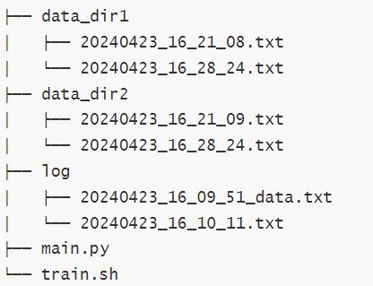
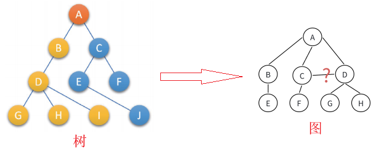
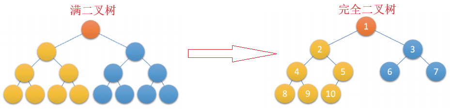
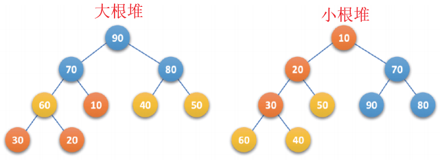
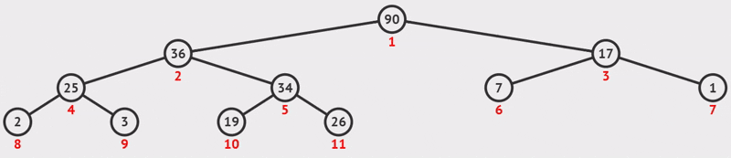
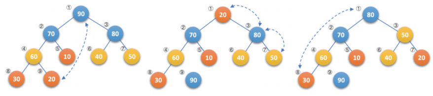

# 从树到堆：C语言数据结构深度实战教程

>前言：在计算机科学的浩瀚海洋中，数据结构是承载算法的基石。我们熟悉的数组和链表是线性的，它们简单直观，但在面对复杂的层级关系或特定的动态排序需求时，往往显得力不从心。本教程将带你从线性的世界迈入非线性的**树（Tree）的世界，并最终聚焦于一种特殊的完全二叉树——堆（Heap）**。

# 一、树——非线性结构的基石

在数组和链表的世界里，数据是一对一的线性关系。但在现实世界（如文件系统、组织架构）中，更多的是**层次关系**。



## 1.1 树的严谨定义

树是由 $n (n \ge 0)$ 个有限结点组成的一个具有层次关系的集合。

- **递归定义**：树中有一个特殊的结点称为**根（Root）**。除根外，其余结点被分成 $M (M>0)$ 个互不相交的集合 $T_1, T_2, ..., T_m$，其中每一个集合又是一棵结构与树类似的子树。

> **注意**：子树之间绝对不能相交，如果相交，那就变成了`图（Graph）`。




## 1.2 树的定义与术语

**树（Tree）** 是一种非线性的数据结构，它是由 $n$ ($n \geq 0$) 个节点组成的有限集合。

- 如果 $n=0$，它是一棵空树。
- 如果 $n>0$，它有一个特定的节点被称为**根（Root）**，其余节点被分成 $m$ ($m \geq 0$) 个互不相交的集合，每个集合本身又是一棵树，被称为根的**子树（SubTree）**。

与数组（一对一）不同，树结构通过“一对多”的关系模拟了现实世界中的层级结构（如文件系统、组织架构）。

**核心术语表：**

| **术语**                | **定义及图例说明**                                           |
| ----------------------- | ------------------------------------------------------------ |
| **父结点/双亲结点**     | 若一个结点含有子结点，则这个结点称为其子结点的父结点；       |
| **子结点/孩子结点**     | 一个结点含有的子树的根结点称为该结点的子结点；               |
| **结点的度**            | 一个结点有几个孩子，它的度就是多少；                         |
| **树的度**              | 一棵树中，最大的结点的度称为树的度；                         |
| **叶子结点/终端结点**   | 度为 **0** 的结点称为叶结点；                                |
| **分支结点/非终端结点** | 度不为 **0** 的结点；                                        |
| **兄弟结点**            | 具有相同父结点的结点互称为兄弟结点（亲兄弟）；               |
| **结点的层次**          | 从根开始定义起，根为第 **1** 层，根的子结点为第 **2** 层，以此类推。 |
| **树的高度或深度**      | 树中结点的最大层次；                                         |
| **结点的祖先**          | 从根到该结点所经分支上的所有结点；                           |
| **路径**                | 一条从树中任意结点出发，沿父结点-子结点连接，达到任意结点的序列； |
| **子孙**                | 以某结点为根的子树中任一结点都称为该结点的子孙。             |
| **森林**                | 由 $m (m>0)$ 棵互不相交的树的集合称为森林。                  |

## 1.3 树的复杂表示：孩子兄弟表示法

树不像二叉树那样每个节点只有两个叉，一个节点可能有 $N$ 个孩子。如何存储？

最通用且优美的方法是 **孩子兄弟表示法**（`Left-Child Right-Brother Representation`）。

```c
struct Node {
    int data;
    struct Node* child;    // 指向左边第一个孩子
    struct Node* brother;  // 指向右边的下一个亲兄弟
};
```

这种设计巧妙地将任意复杂的树转化为了二叉结构，便于统一处理。


# 二、二叉树——规则的艺术

## 2.1 二叉树的特殊规则

二叉树不是简单的**度为2的树**，它要求：

1. 不存在度大于 2 的结点。
2. **有序性**：子树有左右之分，次序不能颠倒。
## 2.2 两种特殊的二叉树（堆的物理基础）

这是本教程最关键的理论部分，请务必区分：

1. **满二叉树 (Full Binary Tree)**：
   - **定义**：每一层的结点数都达到最大值。
   - **公式**：深度为 $k$ 的满二叉树，结点总数 $N = 2^k - 1$。
2. **完全二叉树 (Complete Binary Tree)**：
   - **定义**：深度为 $k$ 的二叉树，前 $k-1$ 层是满的，第 $k$ 层（最后一层）的结点**从左到右连续排列**，中间没有空隙。
   - **意义**：完全二叉树是效率极高的数据结构，**它是数组存储二叉树的最佳形态**。



## 2.3 二叉树的重要性质

对于任意二叉树，如果度为 0 的叶结点个数为 $n_0$，度为 2 的分支结点个数为 $n_2$，则有：

$$n_0 = n_2 + 1$$

即：叶子永远比分叉多的结点多一个。这一性质常用于快速计算节点数量。


# 三、从逻辑到物理——堆的数组映射

## 3.1 为什么堆使用顺序存储？

二叉树通常用链表存储（二叉链表），包含 left 和 right 指针。

但是，对于完全二叉树，我们可以使用数组（顺序结构） 存储，且不会有任何空间浪费。

**堆（Heap）**，本质上就是一棵采用数组存储的完全二叉树。

## 3.2 下标映射公式

假设我们将完全二叉树的节点从上到下、从左到右依次存入数组 `a` 中，且下标从 0 开始：

- **父节点找子节点**：
  - 如果父节点索引为 $i$
  - **左孩子索引**：$LeftChild = 2 \times i + 1$
  - **右孩子索引**：$RightChild = 2 \times i + 2$
- **子节点找父节点**：
  - 如果子节点索引为 $i$（无论左右）
  - **父节点索引**：$Parent = (i - 1) / 2$ （整数除法，向下取整）

这个公式是堆算法高效运行的核心引擎。

```
       逻辑结构(树)                物理结构(数组)
           10 (idx:0)
         /    \                  -------------------------------------
       15      30                | 10 | 15 | 30 | 40 | 50 | 100 | 70 |
      /  \    /  \               -------------------------------------
    40   50 100  70          idx:   0    1    2    3    4    5    6

    验证公式：
    节点 15 的索引是 1。
    其左孩子 40：2*1 + 1 = 3 (正确)
    其父节点 10：(1-1) / 2 = 0 (正确)
```

## 3.3 堆的定义

堆，本质上就是一棵**满足特定排序规则的完全二叉树**。根据排序规则的不同，分为两类：

- **小根堆 (Min Heap)**：$K_i \le K_{2i+1}$ 且 $K_i \le K_{2i+2}$。即任意父节点 $\le$ 子节点，**堆顶是最小值**。
- **大根堆 (Max Heap)**：$K_i \ge K_{2i+1}$ 且 $K_i \ge K_{2i+2}$。即任意父节点 $\ge$ 子节点，**堆顶是最大值**。

> **注意**：堆只保证“父子”有序，不保证“兄弟”有序。左孩子可能比右孩子大，也可能小。



**为什么需要堆？** 你可能会问：“如果我要找最小值，遍历数组不行吗？”

| **数据结构**  | **插入 (Insert)**   | **删除堆顶 (Pop)**            | **获取堆顶 (Top)** |
| ------------- | ------------------- | ----------------------------- | ------------------ |
| **有序数组**  | $O(N)$ (需移动元素) | $O(1)$ (尾删) / $O(N)$ (头删) | $O(1)$             |
| **无序数组**  | $O(1)$              | $O(N)$ (需遍历找最值)         | $O(N)$             |
| **堆 (Heap)** | **$O(\log N)$**     | **$O(\log N)$**               | **$O(1)$**         |

堆在“插入”和“删除”之间取得了完美的平衡，是**插入**与**查找**性能平衡的艺术大师。

# 四、堆的底层原理与核心算法

堆的运作依赖两个核心算法：**上浮（Shift Up）** 和 **下沉（Shift Down）**。所有的 `API`（`Push`, `Pop`）本质上都是对这两个算法的封装。

数据结构定义如下：

```c
typedef int HDataType; // 方便后续一键替换为 float 或结构体

typedef struct Heap
{
	HDataType* a;  // 指向动态分配的数组
	int size;      // 有效数据个数（也是下一个插入位置的下标）
	int capacity;  // 数组当前的总容量
} HP;
```

## 4.1 核心算法一：上浮 (AdjustUP)

场景：当我们向堆中插入一个新元素时。

策略：我们将新元素放在数组的末尾（维持完全二叉树结构），但这可能会破坏堆序性（例如，在小根堆里插入了一个极小值）。因此，我们需要让这个新元素“上浮”到合适的位置。

**步骤**：

1. 比较当前节点与父节点。
2. 若 `当前节点 < 父节点`（小根堆规则），则交换两者。
3. 将当前位置更新为父节点位置，重复步骤1。
4. 若 `当前节点 >= 父节点`，或已到达根节点（索引0），停止。

```c
// 向上调整：确保子节点 >= 父节点
void AdjustUP(HDataType* a, int child)
{
	int parent = (child - 1) / 2; // 计算父节点
	
	while (child > 0) // 循环直到根节点
	{
		// 小根堆逻辑：若孩子比父亲小，交换
		if (a[parent] > a[child])
		{
			swap(&(a[parent]), &(a[child]));
			child = parent; // 向上爬一层
			parent = (child - 1) / 2;
		}
		else
		{
			break; // 满足堆序，停止
		}
	}
}
```




## 4.2 核心算法二：下沉 (AdjustDown)

当我们删除堆顶元素时。

1. 直接删除堆顶会破坏树结构（变成两棵树）。
2. **巧妙做法**：将堆顶元素与**堆尾**元素交换，然后直接删除堆尾（操作数组大小减1）。
3. 此时，新的堆顶元素（原堆尾）通常很大，破坏了小根堆性质。我们需要让它“下沉”。

**步骤**：

1. 从当前节点（初始为根）开始，找到其**左右孩子中较小**的那个（对于小根堆）。
2. 若 `当前节点 > 较小的孩子`，则交换两者。
3. 更新当前节点为该孩子节点的位置，重复步骤1。
4. 若 `当前节点 <= 较小的孩子`，或没有子节点，停止。

```c
void AdjustDown(HDataType* a, int n, int parent)
{
	// 1. 预判左孩子
	int child = parent * 2 + 1;
	
	while (child < n) // 只要还有孩子
	{
		// 2. 选出左右孩子中更小的那个
        // 必须先判断 child+1 < n 确保右孩子存在
		if (child + 1 < n && a[child] > a[child + 1])
		{
			child++; // 右孩子更小，child 指向右孩子
		}

		// 3. 父节点与较小孩子比较
		if (a[parent] > a[child])
		{
			swap(&(a[parent]), &(a[child]));
			parent = child; // 继续向下沉
			child = parent * 2 + 1;
		}
		else
		{
			break; // 位置正确
		}
	}
}
```

例如下图所示，图1是一个**大顶堆**，90为最大值，将90与20(末尾元素)互换，如图2所示，此时90就成了整个堆序列的最后一个元素，也就是逻辑删除，将20经过下沉调整，使得除90以外的结点继续满足大顶堆定义(所有结点都大于等于其孩子)，见图3，然后再考虑将30与80互换……



# 五、堆的高级应用

## 5.1 堆排序 (Heap Sort)

堆排序的精髓在于利用堆顶的最值特性。

1. **建堆**：使用 `AdjustDown` 从最后一个非叶子节点开始调整，复杂度 $O(N)$。
2. **排序**：不断交换堆顶与堆尾，缩小堆范围，并下沉堆顶。复杂度 $O(N \log N)$。

## 5.2 Top-K 问题（海量数据处理）

面试必问：如何在 100 亿个整数中找到最大的 $K$ 个数？

方案：

1. 取前 $K$ 个元素建立一个**小根堆**。
2. 遍历剩余元素，若 `当前元素 > 堆顶`，则替换堆顶，并执行 `AdjustDown`。
3. 遍历结束后，堆中剩余的 $K$ 个元素即为最大的 $K$ 个。

> 为什么求最大值要用小根堆？
>
> 因为小根堆的堆顶是当前 $K$ 个数中的“门槛”。只有比门槛大的数才有资格进入，进入后门槛可能会提高（下沉调整）。

# 六、结语

从树的递归定义，到二叉树的数学性质，再到堆的数组实现，我们看到数据结构是如何在空间与时间之间寻找平衡的。

- **满二叉树** 是理论的完美。
- **完全二叉树** 是工程的妥协与高效。
- **堆** 则是利用这种结构特性解决最值问题的神兵利器。

掌握了 `AdjustUp` 和 `AdjustDown`，你不仅学会了堆，更打开了优先队列、堆排序以及海量数据处理的大门。