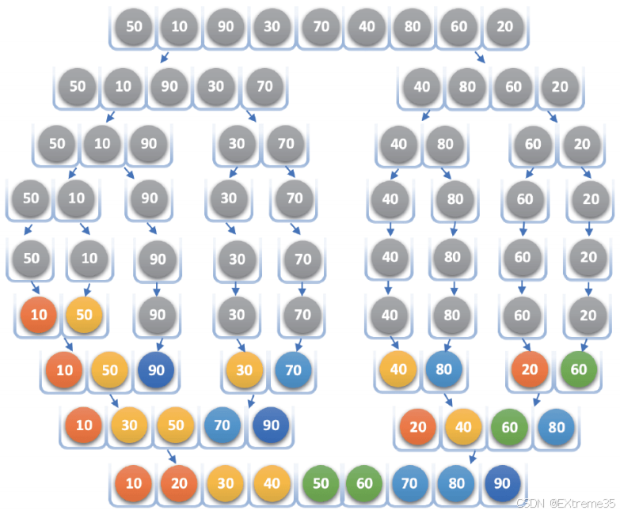
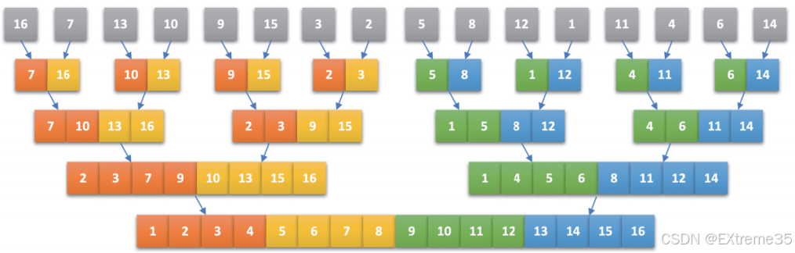
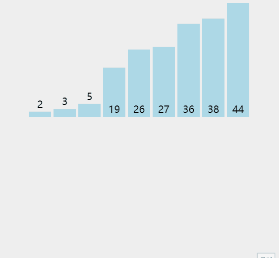
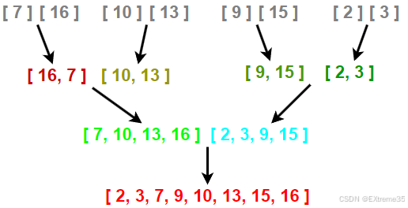

# 一、归并排序的思想

“归并”一词在中文中意为**合并、并入**。在数据结构中，归并是指将两个或两个以上的**有序表**组合成一个新的**有序表**。

归并排序就是利用**归并**的思想实现的排序方法。其原理如下：

1. 假设初始序列含有 `n` 个记录，可视为 `n` 个长度为 1 的有序子序列。
2. 将这些子序列**两两归并**，得到 `⌈n/2⌉`（表示不小于 `x` 的最小整数）个长度为 2 或 1 的有序子序列。
3. 继续对有序子序列**两两归并**，重复此过程。
4. 直至最终合并成一个长度为 `n` 的有序序列。

这种方法称为 **2路归并排序**，本文也只讲二路归并排序。

为了更清晰地说明归并排序的思想，以下通过一个具体示例进行展示。初始无序数组序列为： `{16, 7, 13, 10, 9, 15, 3, 2, 5, 8, 12, 1, 11, 4, 6, 14}`，通过多次 **两两合并排序**，最终得到一个完全有序的数组。若观察合并过程中的结构形状，它**像极了一棵倒置的完全二叉树**。  通常涉及**完全二叉树结构**的排序算法，其效率一般较高——这正是归并排序法的优势所在。



归并排序（`Merge Sort`）不仅仅是一种排序算法，它是计算机科学中 **“分而治之”（Divide and Conquer）** 策略的教科书级范例。

要真正掌握归并排序，必须理解它如何将一个复杂任务拆解为原子操作：

1. **分解（Divide）**：将当前长度为 $n$ 的待排序列，从中间位置（$midi$）一分为二，拆分为两个长度约为 $n/2$ 的子序列。
2. **解决（Conquer）**：递归地对两个子序列进行归并排序。当子序列长度减小到 1 时，根据排序定义，单个元素自然是有序的，递归开始回溯。
3. **合并（Combine）**：这是算法的精髓。将两个已排好序的子序列合并成一个有序的序列，直到最终合并为原始长度的有序数组。

为了让大家更清晰地看到递归调用的全貌，我们观察下方的逻辑结构图。这张图完整展示了数据是如何从一堆散沙逐步凝聚成金字塔的过程。



**逻辑解读**：

 - **上半部分（灰球）**：展示了“递归分解”的过程。数组不断减半，直到每个节点只剩下一个球。这对应了我们代码中的递归下探逻辑。
 - **下半部分（彩球）**：展示了“归并合并”的过程。可以看到 10 和 50 合并为有序对，30 和 70 合并... 最终这些局部的有序块像拼图一样，通过双指针比较逻辑，汇聚成底部的完整有序长龙。

类似于下面这个动图的过程


# 二、递归版本：递归树的平衡之美

递归版本的二路归并排序展示了分治算法的纯粹之美。整个过程可以概括为三个步骤：

1. **分**：通过 `midi` 将区间一分为二。
2. **治**：递归排序左右子区间。
3. **合**：合并两个有序子区间。

## 2.1 代码实现

```c
void _MergeSort(int* a, int* tmp, int left, int right)
{
	// 1. 递归终止条件
	// 当区间只有一个元素（left == right）或区间非法（left > right）时停止划分
	if (left >= right)
		return;

	// 2. 分解（Divide）
	// 计算中间位置，将区间对半平分。使用 (right - left) / 2 是为了防止数值溢出
	int midi = left + (right - left) / 2;
	
	// 递归下探：确保左子区间 [left, midi] 和右子区间 [midi + 1, right] 各自有序
	_MergeSort(a, tmp, left, midi);
	_MergeSort(a, tmp, midi + 1, right);

	// 3. 解决与合并（Conquer & Combine）
	// 此时左右两个子区间已经分别有序，准备进行归并
	int left_first = left;      // 第一组有序序列起点
	int right_first = midi;     // 第一组有序序列终点
	int left_second = midi + 1; // 第二组有序序列起点
	int right_second = right;   // 第二组有序序列终点
	int i = left;               // 辅助数组 tmp 的起始填入位置

	// 双指针比较：依次从两组中挑出较小的元素放入 tmp 数组
	while (left_first <= right_first && left_second <= right_second)
	{
		// 稳定性保障：使用 <= 确保相等元素在原序列中的相对位置不变
		if (a[left_first] <= a[left_second])
			tmp[i++] = a[left_first++];
		else
			tmp[i++] = a[left_second++];
	}

	// 收尾工作：处理其中一组已经遍历完，而另一组还有剩余数据的情况
	while(left_first <= right_first)
		tmp[i++] = a[left_first++];
	while (left_second <= right_second)
		tmp[i++] = a[left_second++];

	// 4. 数据拷贝
	// 将合并好的有序序列从辅助数组 tmp 拷贝回原数组 a 的对应位置
	memcpy(a + left, tmp + left, sizeof(int) * (right - left + 1));
}

void MergeSort(int* a, int n)
{
	// 提前在堆区开辟辅助空间，避免在递归中频繁 malloc 导致效率低下
	int* tmp = (int*)malloc(sizeof(int) * n);
	if (tmp == NULL)
	{
		perror("malloc");
		exit(-1);
	}

	// 调用递归子函数开始排序
	_MergeSort(a, tmp, 0, n - 1);

	// 任务完成，释放堆区空间
	free(tmp);
	tmp = NULL;
}
```

## 2.2 核心细节解析：为什么这样划分区间？

在计算中间下标时，我们使用 `left + (right - left) / 2` 而非 `(left + right) / 2`。这是为了**防止整数溢出**。如果 `left` 和 `right` 都很大，相加可能会超过 `int` 的最大范围，导致结果变负，从而引发程序崩溃。

在归并排序的递归实现中，区间的划分方式（即 `[left, midi]` 和 `[midi + 1, right]`）是经过严密逻辑论证的。看似微小的边界差异，实际上关乎到**递归是否能正常终止**以及**子问题是否能覆盖全集**。

以下是深度解析：

### 2.2.1 核心原因：整数除法的“向下取整”特性

在 C 语言中，整型除法 `(left + right) / 2` 或是 `left + (right - left) / 2` 都是**向下取整**的。

- **场景模拟**：假设当前区间只有 **2 个元素**，下标分别为 `left = 0`, `right = 1`。
- **计算 midi**：$midi = 0 + (1 - 0) / 2 = 0$。

**如果按照 `[left, midi]` 和 `[midi + 1, right]` 划分：**

- **左子区间**：`[0, 0]`（长度为 1，触发 `left >= right` 递归终止）
- **右子区间**：`[1, 1]`（长度为 1，触发 `left >= right` 递归终止）

递归成功拆分并能正常停止。

### 2.2.2 逻辑陷阱？

刚开始应该有人跟我一样疑惑，为什么不能分给 `[left, midi - 1]` 和 `[midi, right]`，尝试将 $midi$ 划归给右半部分，但在向下取整的规则下，这会导致**死循环（栈溢出）**。

同样以 `left = 0`, `right = 1` 为例（$midi = 0$）：

- **左子区间**：`[0, -1]`（非法区间，虽然会停止，但逻辑错误）

- **右子区间**：`[0, 1]`（**致命问题**：子问题的规模依然是 2，与原问题完全一致！）

程序会不断地对 `[0, 1]` 进行递归，永远无法到达终止条件 `left >= right`，最终导致**系统栈溢出（Stack Overflow）**。

### 2.2.3 结构对称性：确保“不重不漏”

归并排序要求将集合 $S$ 划分为两个不相交的子集 $S_1$ 和 $S_2$，且 $S_1 \cup S_2 = S$。

- **连续性**：在连续的整数下标中，`midi` 和 `midi + 1` 是天然的分割点。
- **完全覆盖**：
  - 左区间结束于 `midi`。
  - 右区间起始于 `midi + 1`。
  - 这两个区间合起来恰好完整覆盖了从 `left` 到 `right` 的所有下标，没有遗漏任何一个元素，也没有重复包含任何一个元素。

### 2.2.4 物理映射：递归树的平衡性

采用 `[left, midi]` 和 `[midi + 1, right]` 划分，配合向下取整，能保证递归树是一棵**完全二叉树**或其近似形态。

- **数据量为偶数**：两半完全相等。
- **数据量为奇数**：左半部分比右半部分恰好少一个元素（或多一个，取决于总数）。
- **量化收益**：这种高度平衡的结构确保了递归深度严格控制在 $\log N$ 层，从而保证了 $O(N \log N)$ 的时间复杂度稳定性。

### 2.2.5 区间划分避坑总结

| **划分方式**                             | **结果**   | **原因分析**                                            |
| ---------------------------------------- | ---------- | ------------------------------------------------------- |
| **`[left, midi]` & `[midi+1, right]`**   | **正确**   | 满足向下取整逻辑，能将 2 个元素拆分为 1+1，递归可终止。 |
| **`[left, midi-1]` & `[midi, right]`**   | **死循环** | 在 2 个元素时，右区间依然为 2 个元素，导致无限递归。    |
| **`[left, midi-1]` & `[midi+1, right]`** | **漏项**   | 丢失了下标为 `midi` 的那个关键元素。                    |

# 三、非递归版本：自底向上的“搭建”

归并排序的递归实现，优雅地展现了分治思想。但在大数据处理中，递归深度的增加意味着**系统栈开销**的增大。非递归归并排序避开了递归，直接从最小规模开始“搭建”。为了提高算法的稳健性，我们需要掌握**非递归（迭代版）归并排序**。它的核心逻辑不再是“自顶向下”的拆分，而是 **“自底向上”的搭建** 。它直接从最小单位开始合并，避免了递归调用，将任务管理从几 MB 的“栈区”移到了空间巨大的“堆区”。

**自顶向下（递归版）**：逻辑像是一个 **“向上请示”** 的过程。

  - 为了排好整个数组，它先问：“左半边有序了吗？”；为了让左半边有序，它又去问：“左半边的左半边有序了吗？”。
  - 直到拆分到最底层（每个区间只有 1 个元素）时，才开始真正干活。

**自底向上（非递归版）**：逻辑像是一个 **“积木搭建”** 的过程。

  - 它不需要询问，直接默认最底层的 1 个元素就是有序的。
  - 它直接从最底层开始，把每 2 个元素合并，再把每 4 个元素合并……一步一个脚印往上“盖楼”，直到覆盖全数组。

“自顶向下”是**先拆分再合并**，它的深度受限于系统栈的大小；而“自底向上”是**直接从原子单位开始合并**，它利用 `gap` 步长的线性翻倍，在逻辑上完全模拟了递归树的层级，但在物理上却逃离了递归栈的束缚。

## 3.1 核心思想

非递归归并排序的核心在于利用一个步长变量 `gap` 来模拟递归树的合并层级。

- **Gap = 1**：[0,0] 和 [1,1] 合并，[2,2] 和 [3,3] 合并...（1对1归并）
- **Gap = 2**：[0,1] 和 [2,3] 合并，[4,5] 和 [6,7] 合并...（2对2归并）
- **Gap 翻倍**：每一轮循环后 `gap *= 2`，直到 `gap >= n` 为止。


## 3.2 深度解析：边界越界的“逻辑闭环”

非递归归并最核心的挑战在于处理**非 $2^k$ 长度数组**。当 `i + 2*gap` 向后跳跃时，下标极易冲出数组边界。

我们将每一组归并拆分为两部分：

- **第一组**：`[left_first, right_first]`
- **第二组**：`[left_second, right_second]`

| **越界场景** | **触发条件**            | **深度逻辑拆解**                                             | **处理对策**                                                 |
| ------------ | ----------------------- | ------------------------------------------------------------ | ------------------------------------------------------------ |
| **场景 A**   | `right_first >= n`      | 数组剩余元素不足一个 `gap` 规模，第一组都不完整，更无第二组。 | **直接 break**：由于采取“归并一组、回填一组”策略，第一组数据在原数组中已经是上一轮合并后的局部有序状态，直接保留即可。 |
| **场景 B**   | **`left_second >= n`**  | 第一组完整或不完整，但**第二组完全不存在**。                 | **直接 break**：由于没有对手可以归并，无需进入 `while` 循环，该组维持现状。 |
| **场景 C**   | **`right_second >= n`** | 第二组存在（`left_second < n`），但其**人数不足**一个完整 `gap`。 | **修正右边界**：强行将 `right_second` 设为数组末尾 `n - 1`，确保残余数据能参与本轮合并。 |


```c
for (int i = 0; i < n; i += 2 * gap)
{
    int left_first = i, right_first = i + gap - 1;
    int left_second = i + gap, right_second = i + 2 * gap - 1;

    // --- 关键判断一 ---
    if (left_second >= n)
        break;

    // --- 关键判断二 ---
    if (right_second >= n)
        right_second = n - 1;

    // ... 执行归并与 memcpy ...
}
```

**详解一：`if (left_second >= n) break;`**

- **原因**：归并的前提是必须有**两组**序列。
- **逻辑**：只要 `left_second >= n` 成立，就意味着无论 `right_first` 处于什么状态，**第二组都已经完全不存在了**。说明第二组的起点已经超出了数组范围。此时第一组 `[left_first, right_first]` 已经是有序的（由上一轮 gap 保证），且没有第二组可以与其合并。
- **动作**：我们直接 `break`，不做任何处理，保留第一组在原数组中的顺序即可。

**详解二：`if (right_second >= n) right_second = n - 1;`**

- **原因**：第二组虽然存在，但“人不满”。
- **逻辑**：当 `right_second >= n` 时，说明第二组的结尾超出了数组边界，但起点 `left_second` 还在数组内。
- **动作**：此时我们只需将 `right_second` 强行修正为数组的最后一个下标 `n - 1`，然后让第一组与这一组“残缺”的第二组继续进行归并。

## 3.3 实现代码

```c
void MergeSortNonR(int* a, int n)
{
	// 1. 辅助空间申请
	// 归并排序无法原地完成数据覆盖，需在堆区开辟等大辅助数组
	int* tmp = (int*)malloc(sizeof(int) * n);
	if (tmp == NULL)
	{
		perror("malloc");
		exit(-1);
	}
	// 2. 步长控制逻辑
	// gap 代表当前待归并的“子序列”长度，从 1 开始，每轮翻倍
	int gap = 1;

	// 外层循环：控制合并的层数，模拟递归树的高度
	while (gap < n)
	{
		// 内层循环：以 2*gap 为一组进行跳跃，处理每一层的所有子序列
		for (int i = 0; i < n; i += 2 * gap)
		{
			// 3. 边界计算
			// 计算待合并的两组有序区间的范围：[left_first, right_first] 和 [left_second, right_second]
			int left_first = i;
			int right_first = i + gap - 1;
			int left_second = i + gap;
			int right_second = i + 2 * gap - 1;
			int j = i; // tmp 数组的同步填入下标

			// 4. 边界修正（算法的灵魂）
			// 情况 A & B：如果第二组的左边界已经越界
			// 说明当前 i 之后只剩下一组数据，无法进行归并逻辑
			// 此时直接跳出循环，该组数据在原数组中由于上一轮合并已保持局部有序
			if (left_second >= n)
				break;
			// 情况 C：如果第二组的右边界越界
			// 说明第二组存在但数据量不足 gap 个
			// 修正其右边界为数组末尾下标 n - 1，确保残余数据能参与合并
			if (right_second >= n)
				right_second = n - 1;

			// 5. 归并操作（双指针比较）
			// 将两组有序区间合并到 tmp 数组中
			while (left_first <= right_first && left_second <= right_second)
			{
				if (a[left_first] <= a[left_second])
					tmp[j++] = a[left_first++];
				else
					tmp[j++] = a[left_second++];
			}

			// 处理第一组或第二组中剩余的元素
			while (left_first <= right_first)
				tmp[j++] = a[left_first++];
			while (left_second <= right_second)
				tmp[j++] = a[left_second++];

			// 6. 局部回写（即时同步）
			// 将当前这一组归并好的结果从 tmp 拷贝回原数组 a 的对应区间
			// 拷贝长度为 (当前修正后的右边界 - 起始位置 + 1)
			memcpy(a + i, tmp + i, sizeof(int) * (right_second - i + 1));
		}
		// 步长翻倍：1->2, 2->4, 4->8... 直到覆盖全数组
		gap *= 2;
	}
	// 7. 资源回收
	free(tmp);
}
```

# 四、内存调控：栈区与堆区的终极较量

为什么我们要费劲写非递归版本？

| **维度**     | **递归版本**           | **非递归版本**          |
| ------------ | ---------------------- | ----------------------- |
| **内存位置** | **栈区 (Stack)**       | **堆区 (Heap)**         |
| **空间容量** | 极小 (通常 1MB~8MB)    | 极大 (取决于物理内存)   |
| **管理开销** | 需频繁创建函数栈帧     | 手动管理 `tmp` 辅助数组 |
| **安全阈值** | 处理千万级数据可能溢出 | 极度稳健，适合海量数据  |

**Tips：**

非递归归并是对数组下标控制力的终极考核，理解了边界修正的“顺口溜”：**左二越界（left_second）直接撤退，右二越界（right_second）原地修正**，就能写出完美的二路归并排序。

**量化提升小技巧**： 在非递归版本中，依然可以结合**小区间优化**。当 `gap` 较小时（例如合并结果长度小于 10），直接在局部调用**插入排序**，可以减少约 **80%** 的繁琐归并操作，让性能更上一层楼。
