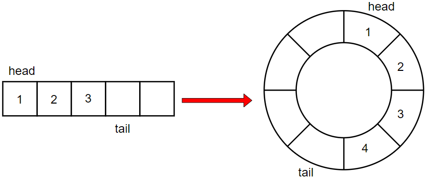
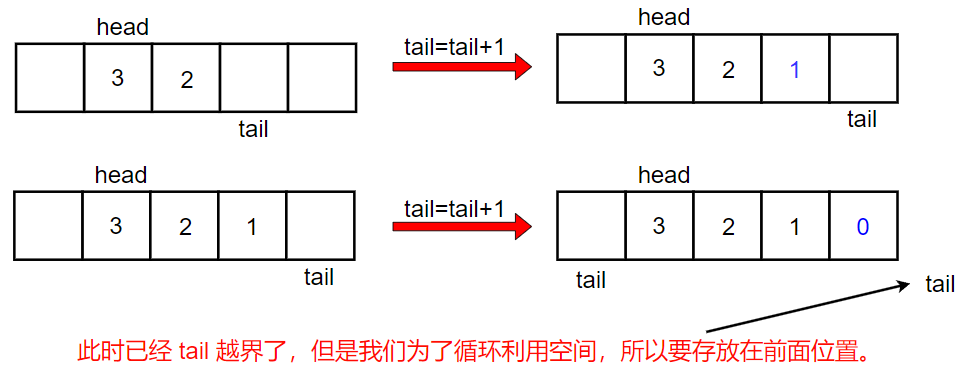
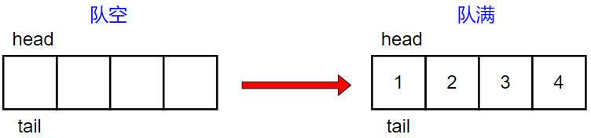
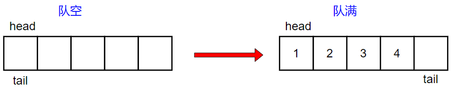
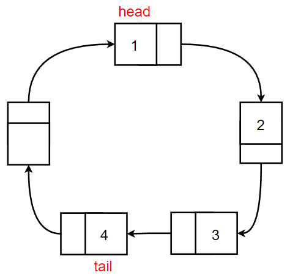

# 循环队列完全指南：从核心原理到两种实现

循环队列是计算机科学中一个基础且至关重要的数据结构，它通过巧妙地**将线性存储空间首尾相接，形成逻辑上的环形结构**，有效解决了传统顺序队列（基于数组的队列）的“假溢出”和空间浪费问题。本指南将从队列的抽象定义出发，深度剖析循环队列的设计哲学、核心实现细节，并提供完整的C语言代码示例，对比数组和链表两种实现方式。


# 一、队列基础与问题引出

## 1.1 队列的基本概念

这里简单回顾一下，也可以看我之前的博客。todo！

队列是一种特殊的线性表，它只允许在表的前端（`front`）进行删除操作（**出队，Dequeue**），而在表的后端（`rear`）进行插入操作（**入队，Enqueue**）。这种严格的限制造就了队列最本质的特性：**FIFO（First In, First Out）**，即先进先出。就如同排队结账一样，第一个排队的人也是第一个离开队列的人。

**数学表达**

如果将一个队列 $Q$ 视为一个有序序列 $Q = (a_1, a_2, \dots, a_n)$，其中 $a_1$ 是队头元素（最先入队的元素），$a_n$ 是队尾元素（最后入队的元素），那么其基本操作的数学意义为：

- **入队**（Enqueue）：在序列尾部添加一个元素 $x$，新的队列为 $Q' = (a_1, a_2, \dots, a_n, x)$。
- **出队**（Dequeue）：删除序列头部的元素 $a_1$，新的队列为 $Q'' = (a_2, a_3, \dots, a_n)$。

## 1.2 抽象数据类型的定义

队列的ADT定义了一组操作，而不关心底层的实现细节。

| **操作名称**    | **功能描述**                          | **理想时间复杂度** |
| --------------- | ------------------------------------- | ------------------ |
| `Enqueue(Q, x)` | 将元素 $x$ 插入到队列 $Q$ 的队尾      | **$O(1)$**         |
| `Dequeue(Q)`    | 移除并返回队列 $Q$ 的队头元素         | **$O(1)$**         |
| `Front(Q)`      | 返回队列 $Q$ 的队头元素（不移除）     | **$O(1)$**         |
| `IsEmpty(Q)`    | 判断队列 $Q$ 是否为空                 | **$O(1)$**         |
| `IsFull(Q)`     | 判断队列 $Q$ 是否已满（仅对定长实现） | **$O(1)$**         |

时间复杂度分析：

对于一个高效的队列实现而言，所有核心操作（Enqueue、Dequeue、Front）都应该能够在常数时间内完成，即 $O(1)$。这要求我们避免任何需要线性遍历或移动大量元素的底层操作。

## 1.3 普通队列局限性

普通顺序队列通常使用**数组**作为底层存储结构，使用两个指针：`front`（队头指针）指向队头元素，`rear`（队尾指针）指向下一个插入位置。

### 1.3.1 假溢出问题

**“假溢出”(False Overflow)**，又称“带状溢出”或“伪溢出”，是数组实现的普通顺序队列**最核心的缺陷**。

当队列执行一系列入队和出队操作后，`front` 指针会向前移动，在数组的起始位置留下空闲空间。然而，`rear` 指针却会持续向数组尾部移动。一旦 `rear` 到达数组的末尾（即 $rear = capacity - 1$），队列就会被判定为满，即使数组起始位置仍有大量空间可用。

**具体例子说明：**

假设有一个容量为 $C=5$ 的数组实现的队列 $Q$（索引 $0$ 到 $4$）。

1. **初始化**：$Q = [ ]$, $front=0, rear=0$.
2. **3次入队**：`Enqueue(10)`, `Enqueue(20)`, `Enqueue(30)`.
   - $Q = [10, 20, 30, \_, \_]$, $front=0, rear=3$.
3. **2次出队**：`Dequeue()`, `Dequeue()`.（元素10和20被移除）
   - $Q = [\_, \_, 30, \_, \_]$, $front=2, rear=3$. (索引0和1的空间被释放)
4. **继续入队**：`Enqueue(40)`, `Enqueue(50)`.
   - $Q = [\_, \_, 30, 40, 50]$, $front=2, rear=5$.
   - **问题出现**：如果数组索引最大是 $4$，那么当 `rear` 尝试指向索引 $5$ 时，就会触发“溢出”判定，即使索引 $0$ 和 $1$ 仍然是空闲的。此时，虽然队列的实际元素个数仅为 3，但逻辑上却无法再插入新元素。这就是“假溢出”。

### 1.3.2 低效的出队操作

为了**解决假溢出**，一种**不推荐**的简单方法是在每次出队操作后，将队头元素之后的所有元素向前移动一个位置。

- **出队操作步骤（低效版）**：
  1. 保存队头元素。
  2. 将 $A[front+1]$ 到 $A[rear-1]$ 的所有元素向前移动一个位置。
  3. 更新 $rear$ 指针。
- **时间复杂度分析**：这个移动操作涉及 $n-1$ 个元素的复制，其中 $n$ 是当前队列中的元素个数。因此，出队操作的时间复杂度退化为 $O(n)$。这严重违背了队列 `ADT` 中 $O(1)$ 的设计目标。

### 1.3.3 空间浪费量化

由于假溢出问题的存在，**数组前端被释放的空间不能被后端利用**，导致**内存使用效率低下**。

**空间浪费率的计算公式：**

$$Waste = \frac{front\_position}{total\_capacity} \times 100\%$$

例如，在一个容量为 100 的队列中，如果执行了 90 次入队和 80 次出队操作，此时 $front\_position = 80$。

$$Waste = \frac{80}{100} \times 100\% = 80\%$$

虽然队列中只有 10 个元素，但数组却有 80% 的空间因为 `front` 指针的位置而无法被利用。

### 1.3.4 内存碎片化

频繁的入队和出队操作，虽然在数组内释放和占用了空间，但如果考虑**动态扩容**的普通队列（当队满时需要创建一个更大的新数组），频繁的内存分配和释放会导致操作系统级别的**内存碎片化**。虽然数组本身的连续性得以保持，但在更宏观的堆内存层面，动态增长和收缩的队列会增加内存管理的负担。

**循环队列的价值**：为了解决这些问题，我们引入了**循环队列**，它的核心思想就是通过取模运算，**将队尾移动到队头被释放的空间，实现空间的循环利用**，从而将所有核心操作的时间复杂度稳定在 $O(1)$。

# 二、循环队列的设计原理

循环队列（`Circular Queue`）的本质在于**将线性存储空间的首尾在逻辑上相连**，形成一个环形结构。这个环形结构使得被释放的队头空间能够被队尾重新利用，彻底消除了“假溢出”问题。

但在实现的时候还是借助数组，只不过把它抽象成了循环的样子，类似于下图这样



## 2.1 指针的循环移动机制

在循环队列中，`front` 和 `rear` 指针的移动不再是简单的 $pointer = pointer + 1$，而是通过**取模运算**来实现“折返”效果，确保它们始终在 $[0, capacity-1]$ 的索引范围内循环。

**使用取模运算实现指针循环：**假设数组的实际分配的总大小（即数组长度）为 $N$（注意，这通常是用户指定容量 $k$ 加上 1）。

当指针需要向前移动一个位置时，其更新公式为：$$\text{pointer} = (\text{pointer} + 1) \mod{N}$$。

**详细解释取模运算如何实现“折返”效果：**

1. **正常移动**：如果当前 `pointer` 小于 $N-1$，则 $(\text{pointer} + 1) \mod{N} = \text{pointer} + 1$。指针正常向前移动。
2. **折返**：当 `pointer` 位于数组的最后一个索引位置 $N-1$ 时，$\text{pointer} + 1 = N$。此时，$N \mod{N} = 0$。指针从最后一个位置瞬间“折返”到数组的起始位置 $0$，从而实现了逻辑上的首尾相接，形成环形。



**对比线性移动与循环移动的差异：**

- **线性移动**：指针单向递增，一旦达到最大索引即停止，导致假溢出。
- **循环移动**：指针通过取模运算在 $[0, N-1]$ 范围内循环往复，有效利用了所有空间。

## 2.2 空满判断的核心难题

循环队列的设计挑战在于其空状态和满状态的判断。我们仍然使用 `front` 指针指向队头元素，`rear` 指针指向下一个待插入的位置。

### 为什么 `front == rear` 产生歧义？

- **队列空时**：在初始化或所有元素都被出队后，`front` 和 `rear` 都会指向同一个位置（通常是 $0$）。此时，`front == rear` 表示**队列空**。
- **队列满时**：如果 `rear` 经过一轮循环后追上了 `front`，也可能出现 `front == rear` 的情况。



因此，**仅凭 `front == rear` 无法唯一确定队列是空还是满**。

### 提出三种解决方案并进行对比

| **解决方案**        | **空判断**                          | **满判断**                           | **空间/时间代价**   | **优点**                                   | **缺点**                                             |
| ------------------- | ----------------------------------- | ------------------------------------ | ------------------- | ------------------------------------------ | ---------------------------------------------------- |
| **a) count 计数器** | `count == 0`                        | `count == k`                         | +1 整数变量（空间） | 逻辑最清晰，判断最直接                     | 需要额外维护 `count` 变量，增加入队/出队操作的复杂度 |
| **b) 标志位**       | `front == rear && is_empty == true` | `front == rear && is_empty == false` | +1 布尔变量（空间） | 避免额外存储空间浪费                       | 判断逻辑略微复杂，需要确保标志位与操作同步更新       |
| **c) 牺牲一个单元** | `front == rear`                     | `(rear + 1) % N == front`            | +1 存储单元（空间） | 判断逻辑简洁，无额外变量维护，**本文重点** | 浪费一个存储单元，实际容量比指定容量少1              |

## 2.3 重点讲解“牺牲一个存储单元”的设计

**这是在实际中最常用、最优雅的循环队列解决方案。**

### 为什么这是最优雅的解决方案？

通过牺牲一个存储单元，我们人为地保证了队空和队满状态的**唯一性**：

1. 队空：当队列中没有元素时，front 和 rear 指针指向同一个位置。即：$$\text{front} = \text{rear}$$。

2. 队满：当队列中还差一个元素就满时，我们不允许插入这个元素，故意保持一个空闲单元。此时，队尾指针 rear 的下一个位置正好是队头指针 front。即：$$(\text{rear} + 1) \mod{N} = \text{front}$$，其中，$N$ 是数组的总大小，也就是实际最大容量$+1$。




**关键在于**：当队列满时，`front` 和 `rear` 之间总会隔着一个空闲单元。这个空闲单元就像一个“缓冲器”，保证了满状态和空状态的判断公式不会重合。

### 详细的状态判断逻辑

假设用户指定容量为 $k$，则实际分配的数组总大小 $N = k+1$。

- 队空判断：$$\text{isEmpty} : (\text{front} == \text{rear})$$

- 队满判断：$$\text{isFull} : ((\text{rear} + 1) \mod{N} == \text{front})$$

- 元素个数计算：$$\text{size} : (\text{rear} - \text{front} + N) \mod{N}$$


### 证明：为什么这种方法能唯一确定队列状态

我们来证明在 $N=k+1$ 的设计下，空状态和满状态是互斥的。

1. **队空**：$front = rear$。此时，元素个数 $size = (rear - front + N) \mod{N} = 0 \mod{N} = 0$。

2. **队满**：$(\text{rear} + 1) \mod{N} = \text{front}$。

   - 这意味着 $rear+1 = front + m \cdot N$，其中 $m$ 为某个整数。
   - 将 $\text{front}$ 移项，得到 $\text{rear} - \text{front} = m \cdot N - 1$。
   - 计算元素个数：

       $$\text{size} = (\text{rear} - \text{front} + N) \mod{N}$$
       将 $\text{rear} - \text{front}$ 代入：
       $$\text{size} = (m \cdot N - 1 + N) \mod{N} = ( (m+1) \cdot N - 1 ) \mod{N}$$
       因为 $(m+1) \cdot N$ 是 $N$ 的整数倍，所以 $((m+1) \cdot N - 1) \mod{N} = N - 1$。
       因此，队满时的元素个数 $size = N - 1 = k$。
   

结论：在 $N=k+1$ 的总大小下，当队列有 $k$ 个元素时，$(\text{rear} + 1) \mod{N} = \text{front}$ 成立。

   - 空状态下 $size=0$。
   
   - 满状态下 $size=k$。

由于 $k \ge 1$，所以 $0 \ne k$，因此两种状态不会重合。

### 空间代价分析

- **用户指定容量**：$k$
- **实际存储空间**：$k+1$
- **空间开销**：多一个单元的空间开销，即 $\frac{1}{k+1}$ 的存储浪费。对于大型队列，这个浪费可以忽略不计。


# 三、完整实现

本章将提供基于数组实现的循环队列（使用“牺牲一个存储单元”方案）的完整C语言代码，并对核心函数进行详细的原理说明。

## 3.1 数据结构定义

我们使用一个结构体来封装循环队列所需的所有核心数据。


```c
/**
 * 循环队列结构体定义
 * 采用“牺牲一个存储单元”的方案：
 * front == rear 表示队空
 * (rear + 1) % capacity == front 表示队满
 */
typedef struct 
{
    int *data;      // 存储数据的动态数组
    int front;      // 队头指针，指向队列的第一个元素
    int rear;       // 队尾指针，指向下一个插入位置
    int capacity;   // 数组总大小 N (用户指定容量 k + 1)
} CircularQueue;

// data: 存储实际数据，动态分配，保证内存连续性。
// front: 总是指向队头元素的索引。出队时后移。
// rear: 总是指向下一个元素要插入的索引。入队时后移。
// capacity: 存储数组的总大小 N。取模运算的模数。
```

## 3.2 创建与初始化函数

```c
/**
 * 创建并初始化一个循环队列
 * k 用户指定的队列最大存储元素个数
**/
CircularQueue* createCircularQueue(int k) {
    // 1. 分配 CircularQueue 结构体本身
    CircularQueue* obj = (CircularQueue*)malloc(sizeof(CircularQueue));
    if (obj == NULL) 
    {
        // 内存分配失败
        perror("malloc");
        return NULL;
    }

    // 我们采用“牺牲一个存储单元”的策略来区分队空和队满。
    // 因此，为了存储 k 个元素，我们需要分配 k + 1 个数组空间 N。
    int N = k + 1; 
    obj->data = (int*)malloc(N * sizeof(int));
    if (obj->data == NULL)
    {
        // 数组内存分配失败，需释放结构体
        perror("malloc");
        free(obj);
        return NULL;
    }
    // 队头和队尾指针都指向数组的起始位置 0，表示队列为空状态。
    obj->front = 0;
    obj->rear = 0;
    obj->capacity = N; // capacity 存储的是数组总大小 N

    return obj;
}
// 时间复杂度：O(1)，仅包含指针初始化和两次内存分配。
```
## 3.3 判空与判满函数

这两个函数是循环队列操作的基础，时间复杂度均为 $O(1)$。

```c
/**
 * 判断队列是否为空
 * true 队列为空
 */
bool isEmpty(CircularQueue* obj) 
{
    // 判空条件：front 和 rear 指向同一位置
    return obj->front == obj->rear;
}

/**
 * 判断队列是否已满
 * true 队列已满
 */
bool isFull(CircularQueue* obj) 
{
    // 判满条件：队尾指针 rear 的下一个位置是队头指针 front
    // (rear + 1) % N == front
    // N 是数组的总大小 obj->capacity
    return (obj->rear + 1) % obj->capacity == obj->front;
}
```

## 3.4 入队操作（Enqueue）

入队操作在队尾执行。

```c
/**
 * 将元素值插入到循环队列的队尾
 * value 待插入的值
 * true 插入成功
 * false 队列已满，插入失败
 */
bool enQueue(CircularQueue* obj, int value) 
{
    // 1. 检查队列是否已满
    if (isFull(obj)) 
    {
        // 详细注释判满条件：(rear + 1) % N == front
        // 如果满足此条件，表示队列中已有 N-1 个元素，不可再插入
        return false;
    }

    // 2. 插入新元素
    // rear 指向当前下一个待插入的位置，直接赋值
    obj->data[obj->rear] = value;
    
    // 3. 指针更新逻辑：rear 环形移动到下一个位置
    // rear = (rear + 1) % N
    obj->rear = (obj->rear + 1) % obj->capacity;
    
    // 4. 入队成功
    return true;
}
// 时间复杂度：O(1)，仅包含一次判断、一次赋值和一次指针更新（取模运算）。
```

## 3.5 出队操作（Dequeue）

出队操作在队头执行。

```c
/**
 * 从循环队列中删除队头元素
 * true 删除成功
 * false 队列为空，删除失败
 */
bool deQueue(CircularQueue* obj) 
{
    // 1. 检查队列是否为空
    if (isEmpty(obj))
        return false;

    // 2. 删除元素（逻辑删除）：
    // 实际上不需要真正删除或移动元素，只需要移动 front 指针。
    // front 指向的元素即被“逻辑”移除。
    // 3. 指针更新逻辑：front 环形移动到下一个位置
    // front = (front + 1) % N
    obj->front = (obj->front + 1) % obj->capacity;
    // 4. 出队成功
    return true;
}
// 时间复杂度：O(1)，仅包含一次判断和一次指针更新。
```

## 3.6 获取队头元素（Front）

获取队头元素，不移除。


```c
/**
 * 获取循环队列的队头元素（不移除）
 * 队头元素值，若队列为空返回 -1（或抛出错误）
 */
int Front(CircularQueue* obj) 
{
    // 1. 处理队列空的情况
    if (isEmpty(obj)) 
        // 返回一个特殊值（如-1），或根据语言规范抛出异常
        return -1; 

    // 2. 直接返回 front 指向的元素
    return obj->data[obj->front];
}
// 时间复杂度：O(1)。
```

## 3.7 获取队尾元素（Rear）

获取队尾元素，需要计算 `rear` 的前一个位置。

```c
/**
 * 获取循环队列的队尾元素（不移除）
 * 队尾元素值，若队列为空返回 -1（或抛出错误）
 */
int Rear(CircularQueue* obj) {
    // 1. 处理队列空的情况
    if (isEmpty(obj)) 
        return -1; 

    // 2. 重点讲解：为什么不能直接返回 rear-1
    // 如果 rear == 0，则 rear-1 为 -1，会导致数组越界。
    // 此时队尾元素位于数组的最后一个索引 N-1 处。
    // 3. 通用公式：使用取模运算来处理“折返”到数组尾部的情况。
    // 队尾元素索引是 (rear - 1 + N) % N。
    // 这里的 N 是 obj->capacity
    int tail_index = (obj->rear + obj->capacity - 1) % obj->capacity;

    // 更简洁但需要理解的公式：(rear - 1) 的模运算
    // 当 rear = 0 时, (0 - 1) % N 在C语言中可能返回 0 或负值，
    // 所以 (rear - 1 + N) % N 是更安全的写法。
    return obj->data[tail_index];
}
// 时间复杂度：O(1)。
```

## 3.8 内存释放

```c
/**
 * 释放循环队列占用的所有内存
 */
void freeCircularQueue(CircularQueue* obj) 
{
    if (obj) {
        // 1. 先释放存储数据的动态数组
        if (obj->data) 
            free(obj->data);
        // 2. 再释放结构体本身
        free(obj);
    }
}
// 时间复杂度：O(1)，仅包含两次内存释放操作。
```

## 3.9 测试用例（略）

此处自己可以写一些测试调用循环队列函数，看看结果，重点可以多测试在边界的情况。

# 四、链表实现循环队列

虽然数组实现高效且缓存友好，但链表实现为循环队列提供了另一种视角，尤其在**无需预知容量**或**需要动态扩容**的场景下更具优势。链表实现的循环队列通常采用**单向循环链表**。

## 4.1 链表节点的设计

链表实现的第一步是定义节点结构体。

```c
typedef struct ListNode {
    int val;
    struct ListNode* next;
} ListNode;
```

## 4.2 循环队列结构体

为了简化操作和判断，链表实现的循环队列结构体通常包含队头和队尾指针，以及一个 `size` 变量来追踪元素个数和判断空满。

```c
typedef struct {
    ListNode* front;  // 队头节点
    ListNode* rear;   // 队尾节点
    int capacity;     // 最大容量（如果需要限制大小）
    int size;         // 当前元素个数（简化空满判断）
} LinkedCircularQueue;
```

**设计要点**：

- `front` 指向队头元素。
- `rear` 指向队尾元素。
- 链表的尾部（`rear` 节点）的 `next` 指针指向头部（`front` 节点），形成一个**环**。



> 这里因为不是采用多一个空间进行辅助判断，而是直接记录`size`进行判断，故队头队尾直接指相应元素。

## 4.3 核心实现细节

### 4.3.1 如何创建环形链表

初始化时，`front` 和 `rear` 均设为 `NULL`，`size` 设为 $0$。

### 4.3.2 入队操作（Enqueue）

入队操作在队尾进行，时间复杂度 $O(1)$。

1. **检查是否已满**：如果 `size == capacity`，则插入失败。
2. **创建新节点** $x$。
3. **空队列情况**：如果 `size == 0`，新节点 $x$ 既是队头也是队尾。
   - `front = x`、`rear = x`、$x \to next = x$ (指向自身成环)
4. **非空队列情况**：
   - $x \to next = front$ (新节点指向队头)、$\text{rear} \to next = x$ (原队尾指向新节点)、$\text{rear} = x$ (更新队尾指针)
5. `size++`。

### 4.3.3 出队操作（Dequeue）

出队操作在队头进行，时间复杂度 $O(1)$。

1. **检查是否为空**：如果 `size == 0`，则出队失败。
2. **保存队头**：`temp = front`。
3. **只有一个元素情况**：`front = NULL`、`rear = NULL`。
4. **多个元素情况**：
   - `front = front -> next` (队头移动)、$\text{rear} \to next = front$ (队尾指向新队头，保持环形)
5. **释放旧节点**：`free(temp)`。
6. `size--`。

### 4.3.4 空满判断

由于维护了 `size` 变量，判断逻辑变得极其简单直接：

- **队空**：`size == 0`
- **队满**：`size == capacity`

### 4.3.5 内存管理

链表实现的核心优势也是挑战在于内存管理：

- **动态分配**：每次入队都需要 `malloc` 一个新节点。

- 动态释放：每次出队都需要 free 释放被移除的节点。

  虽然避免了数组扩容的整体移动，但频繁的 malloc/free 可能会增加系统开销和内存碎片。

## 4.4 与数组实现的对比（重点）

| **特性**       | **数组实现（牺牲空间）** | **链表实现（循环链表）**                         |
| -------------- | ------------------------ | ------------------------------------------------ |
| **空满判断**   | 复杂（需取模运算）       | **简单**（基于 $size$ 变量）                     |
| **预留空间**   | 需要预留一个存储单元     | 无需预留（或使用 $size$ 变量）                   |
| **空间开销**   | 数组头尾的1个单元浪费    | 每个节点有额外的 $next$ **指针开销**             |
| **容量限制**   | 固定容量，扩容困难       | 动态增长（如果 `capacity` 不限制），**扩容容易** |
| **内存连续性** | **连续**                 | 不连续（碎片化）                                 |
| **缓存友好性** | **优秀**（局部性原理）   | 较差                                             |

**核心差异总结**：

- **数组**：以**牺牲一个空间单元**的代价，换取 $O(1)$ 的所有操作，并拥有**优异的缓存性能**。
- **链表**：以**每个节点额外的指针开销**和**较差的缓存性能**为代价，换取**简单直观的空满判断**和**灵活的容量控制**。


# 五、两种实现的系统对比

对循环队列的数组实现和链表实现进行系统性的对比，可以帮助我们根据具体场景选择最合适的方案。

| **对比维度**   | **数组实现**                                      | **链表实现**                                 |
| -------------- | ------------------------------------------------- | -------------------------------------------- |
| **空间效率**   | 有1个单元浪费，但数据紧凑                         | 每个节点有额外的 $next$ **指针开销**         |
| **时间效率**   | 所有操作**$O(1)$**                                | 所有操作**$O(1)$**                           |
| **内存分配**   | 一次性分配（初始化），连续内存                    | 动态分配（每次入队），内存不连续             |
| **缓存友好性** | **优秀**（连续内存，高缓存命中率）                | 较差（内存碎片，低局部性）                   |
| **实现复杂度** | 中等（需处理取模运算和空满状态）                  | 简单（直接指针操作和 $size$ 变量）           |
| **扩容难度**   | **困难**（需要重新分配、复制数据）                | 容易（动态添加节点，无需复制）               |
| **适用场景**   | 固定大小、**高性能**（如硬件驱动、高性能网络I/O） | 大小不确定、需要**动态调整容量**、内存不敏感 |

> **重要结论**：在对性能（尤其是**缓存性能**）有严格要求的场景下，如果队列的最大容量可以预估，**数组实现**的循环队列是毫无疑问的首选。链表实现则适用于对容量变化有较高要求，且对内存局部性不敏感的场景。


# 六、常见问题与解答

循环队列是面试中的高频考点，以下是几个典型的问答和扩展问题。

## 6.1 基础问题

### 1. 为什么循环队列要空出一个单元？

**解答**：是为了**区分队空（`front == rear`）和队满（`(rear + 1) % N == front`）两种状态**。如果不空出一个单元，当队列满时也会出现 `front == rear` 的情况，导致逻辑歧义，无法确定队列是空还是满。牺牲一个单元是最简洁优雅的解决方案。

### 2. 如何判断循环队列是空还是满？

**解答**：

- **队空**：`front` 指针等于 `rear` 指针，即 $\text{front} == \text{rear}$。
- **队满**：`rear` 指针的下一个位置等于 `front` 指针，即 $(\text{rear} + 1) \pmod{\text{capacity}} == \text{front}$。其中 `capacity` 是数组的总大小 $N$。

### 3. 循环队列的容量为什么是 $k+1$？

**解答**：这里的 $k$ 是指用户实际能存储的**最大元素个数**。由于我们牺牲了一个存储单元来解决空满状态的歧义，因此，要存储 $k$ 个元素，实际需要的数组总大小 $N$ 必须是 $k+1$。

## 6.2 实现问题

### 1. 如何获取循环队列的队尾元素？

**解答**：队尾元素是 `rear` 指针前一个位置的元素。不能简单地使用 `rear - 1`，因为当 `rear = 0` 时会越界。正确的、能够处理指针回绕情况的索引计算公式是：$$\text{tail\_index} = (\text{rear} + \text{capacity} - 1) \mod{\text{capacity}}$$，其中 `capacity` 是数组总大小 $N$。然后返回 $data[\text{tail\_index}]$。

### 2. 如何处理队列的扩容？

**解答**：

- **数组实现**：扩容是困难且昂贵的。需要创建一个新的、更大的数组 $A'$，然后将原数组 $A$ 中的有效元素**按顺序**复制到 $A'$ 中。这个过程的时间复杂度是 $O(k)$，其中 $k$ 是当前元素个数。复制后，需要更新 `front` 为 $0$，`rear` 为 $k$，并释放原数组内存。
- **链表实现**：扩容非常简单，只需更新 `capacity` 限制即可，无需移动元素。


# 七、性能优化与最佳实践

虽然循环队列本身的操作是 $O(1)$ 的，但在实际应用和系统级编程中，仍有进一步优化的空间。

## 7.1 容量选择策略

**如何根据应用场景选择合适的容量？**

- **流量峰值预测**：队列容量应至少能容纳应用在**正常工作周期内**的**最大流量峰值**，以避免频繁的队满阻塞或拒绝服务。
- **容忍延迟**：容量决定了缓冲区能存储多少数据。容量越大，系统能容忍的生产者与消费者速度不匹配的时间就越长，但也会增加内存占用和数据处理的延迟。
  - **高吞吐低延迟**：倾向于选择较小的容量，快速消费。
  - **抗突发流量**：倾向于选择较大的容量，平滑流量。
- **内存成本**：在嵌入式或内存受限系统（如内核驱动），容量必须严格控制，此时 $k+1$ 的空间开销也需要权衡。

## 7.2 内存对齐优化

对于数组实现的循环队列，其内存是连续的，利用**内存局部性原理**本身就具有优势。进一步的优化可以考虑：

- **结构体对齐技巧**：如果循环队列结构体 `CircularQueue` 被频繁访问，确保其内部字段（如 `int *data`, `int front`, `int rear`）按照机器字长进行内存对齐，可以提高 CPU 读取速度。
- **缓存行对齐**：在高性能场景，可以将 `CircularQueue` 结构体或其核心数据 `data` 数组的起始地址对齐到**CPU 缓存行（通常是 64 字节）**的边界，以最大化缓存命中率，避免伪共享。


# 八、总结与展望

循环队列是数据结构领域中一个“小而精”的典范，它以优雅的设计解决了传统队列的固有缺陷，是许多系统编程中不可或缺的基础组件。

## 8.1 循环队列的核心价值

1. **空间效率**：通过**首尾相接的逻辑环形结构**，实现了对数组空间的循环利用，彻底消除了“假溢出”问题。
2. **时间效率**：无论是基于数组还是基于链表的实现，所有核心操作 `Enqueue`、`Dequeue`、`Front` 都能在**$O(1)$**的常数时间内完成，满足高性能系统的要求。
3. **实现简洁**：相比需要复杂内存操作（如元素前移或动态扩容）的普通队列，循环队列的实现逻辑（基于取模运算）更简洁且稳定。
4. **应用广泛**：作为 `Ring Buffer` 的核心实现，它在操作系统内核、网络驱动、日志系统、高性能计算等领域具有不可替代的地位。

## 8.2 未来发展方向

1. **并发循环队列的优化**：随着多核时代的到来，如何设计和实现**极低延迟、高吞吐量**的无锁循环队列（尤其是 MPMC 模型）仍然是系统编程中的热点问题。例如，利用不同的 `front` 和 `rear` 缓存行来避免伪共享，是重要的优化方向。
2. **持久化循环队列的设计**：在分布式系统和微服务架构中，队列作为消息缓冲，需要具备**持久化**能力以防宕机丢失数据。将循环队列的结构与持久化存储技术（如 `mmap/Page Cache` 或 `SSD`）结合，设计出既高效又可靠的持久化循环队列，是未来的一个趋势。
3. **在分布式系统中的应用**：循环队列的固定容量和高效率使其成为分布式任务调度、限流器和分布式追踪系统中的理想缓冲区。将其思想扩展到分布式 `Ring Buffer`，以实现**分布式共享内存或高性能的日志同步**，将是重要的技术突破。


