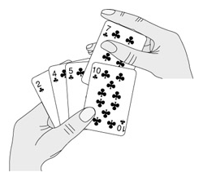
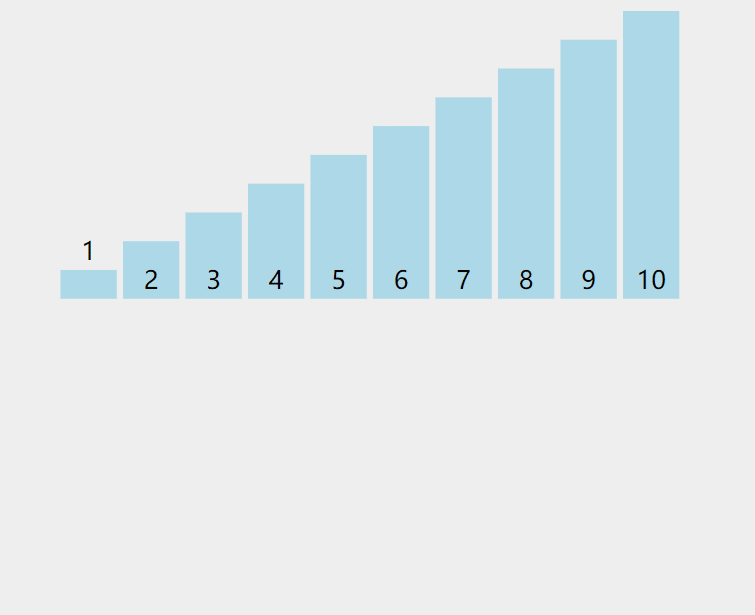
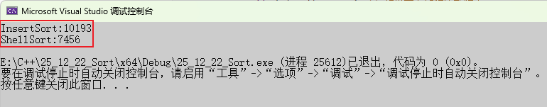

**学习导航**： 根据算法实现的逻辑，常见的排序算法可分为以下四大类

| **分类**     | **包含算法**           |
| ------------ | ---------------------- |
| **插入排序** | 直接插入排序、希尔排序 |
| **选择排序** | 直接选择排序、堆排序   |
| **交换排序** | 冒泡排序、快速排序     |
| **归并排序** | 归并排序               |

插入排序家族主要由**直接插入排序**和**希尔排序**组成。

------

## 一、 直接插入排序 —— 像抓牌一样思考

### 1.1 核心思想

想象你在打扑克牌：

1. 你的左手已经是排好序的牌。
2. 右手摸一张新牌。
3. 将新牌与左手的牌**从右向左**依次比较，如果左手的牌比新牌大，就让左手的牌往右挪一格。
4. 直到找到比新牌小（或相等）的位置，把新牌放进去。



### 1.2 逻辑详解

也许你没有意识到，但其实你的思考过程是这样的：现在抓到一张7，把它和手里的牌从右到左依次比较，7比10小，应该再往左插，7比5大，好，就插这里。为什么比较了10和5就可以确定7的位置？为什么不用再比较左边的4和2呢？因为这里有一个重要的前提：手里的牌已经是排好序的。现在我插了7之后，手里的牌仍然是排好序的，下次再抓到的牌还可以用这个方法插入。

编程对一个数组进行插入排序也是同样道理，但和插入扑克牌有一点不同，不可能在两个相邻的存储单元之间再插入一个单元，因此要将插入点之后的数据依次往后移动一个单元。排序逻辑如下：

- **有序区间**：数组的前 $i$ 个元素。
- **待插入元素**：下标为 $i+1$ 的元素（ `tmp`）。
- **挪动过程**：如果前面的元素比 `tmp` 大，就把前面的元素覆盖到后一个位置，腾出空位。




### 1.3 代码深度解析

```c
void InsertSort(int* a, int n)
{
    // n 是数组的总长度，i 只需要走到 n-2 的位置
    // 因为待插入的元素是 a[i+1]，当 i = n-2 时，a[i+1] 正好是最后一个元素 a[n-1]
    for (int i = 0; i < n - 1; i++)
    {
        int end = i;          // [0, end] 是已经排好序的区间
        int tmp = a[end + 1]; // 拿出待插入的那个“新牌”

        // 在有序区间 [0, end] 中寻找 tmp 的合适位置
        while (end >= 0)
        {
            if (a[end] > tmp) // 如果前面的牌比新牌大
            {
                a[end + 1] = a[end]; // 把前面的牌往后挪一个位置
                end--;               // 继续往前看
            }
            else
                // 找到了！此时 a[end] <= tmp，说明 tmp 应该插在 end 的后面
                break; 
        }
        // 插入 tmp。注意：由于循环内 end 减了1，所以实际位置是 end + 1
        a[end + 1] = tmp; 
    }
}
```

------


## 二、 希尔排序 —— 跳跃式的飞跃

希尔排序是由 **D.L. Shell** 于 1959 年提出的一种排序算法。在此之前，排序算法的时间复杂度基本都是 $O(n^2)$，希尔排序是突破这个时间复杂度的第一批算法之一。

### 2.1 为什么要学希尔排序？

直接插入排序有一个致命弱点：如果一个很小的数字在数组的最末尾，它需要一步一步“挪”到最前面，效率很低。

希尔排序的改进点： 通过引入 **`gap` (增量)** 的概念，先让数字“大步跳跃”，快速接近它该去的位置，最后再进行微调，打破了“只能挨着挪”的限制。

### 2.2 核心思想：预排序 + 插入排序

希尔排序分为两个阶段：

1. **预排序**（`gap > 1`）：将数组分组，每组之间进行插入排序，让数据快速变得“基本有序”。
2. **正式排序**（`gap = 1`）：当数组已经基本有序时，最后进行一次直接插入排序，效率会极高。

### 2.3 如何选择 `gap`？

采用经典方案：`gap = gap / 3 + 1`。

- **除以 3**：是为了让 `gap` 快速缩小。
- **加 1**：是为了保证最后一次循环 `gap` 一定等于 1（直接插入排序的要求）。

### 2.4 代码深度解析

```c
void ShellSort(int* a, int n)
{
	int gap = n;
	while (gap > 1)
	{
		// 每次缩小 gap。+1 是为了确保最后一次循环 gap 必定等于 1
		gap = gap / 3 + 1;

        // 这里是多组并排：i 每次自增 1，处理的是当前 gap 下的所有逻辑分组
		for (int i = 0; i < n - gap; i++)
		{
			int end = i;
			int tmp = a[end + gap]; // 拿出本组中的下一个元素

			while (end >= 0)
			{
                // 注意：你提供的代码中此处逻辑是 (tmp > a[end])，这将实现【从大到小】排序
                // 如果需要普通的从小到大排序，请改为 (a[end] > tmp)
				if (tmp > a[end]) 
				{
					a[end + gap] = a[end]; // 组内挪动
					end -= gap;            // 步长为 gap
				}
				else
				{
					break;
				}
			}
			a[end + gap] = tmp;
		}
	}
}
```

------

## 三、 深度总结：新手必看

为了方便记忆，我们将这两个算法进行对比：

| **算法名称**     | **核心逻辑**               | **优势场景**                           | **复杂度**      |
| ---------------- | -------------------------- | -------------------------------------- | --------------- |
| **直接插入排序** | 逐个比较、挨个挪动         | 数据量小，且已经**接近有序**时最快     | $O(N^2)$        |
| **希尔排序**     | 先大步跳（预排），再挨个挪 | 数据量大，且**随机分布**时效率远超前者 | 约 $O(N^{1.3})$ |

这么说可能不太直观，接下来将随机生成10w个数据的数组，分别使用这两种算法进行排序，并给出算法运行时间：



这里可以明显看见希尔排序比插入排序快得多。

> 因为我忘记切换`release`版本了，所以看着不是快了很多。

希尔排序的时间复杂度是一个关于 `gap` 的函数。

- **最坏情况**：$O(N^2)$（但在实际应用中极难遇到）。
- **平均情况**：**$O(N^{1.3})$** 左右。
- **空间复杂度**：始终为 **$O(1)$**，因为它是原地排序。


