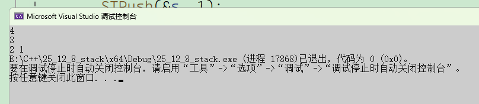
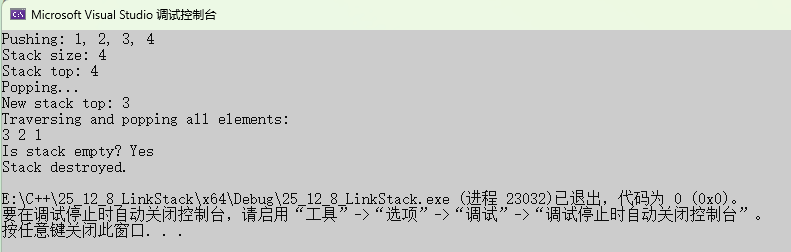
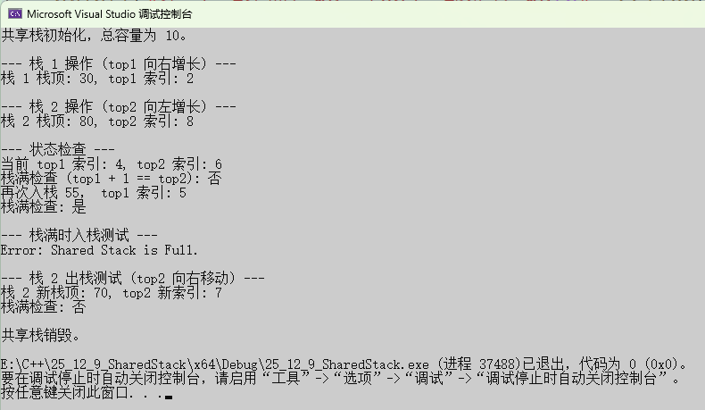

# 约束之美：深度解析数据结——“栈”（Stack）

**绪论：从计算哲学到问题抽象**

在计算机科学的广袤疆域中，数据结构如同建筑的钢筋骨架，支撑起上层应用的万丈高楼。它们不仅是存储数据的容器，更是一种**组织和处理数据的方法论**，体现着我们解决问题的智慧和效率。从纷繁复杂的现实世界中提炼出计算模型，是编程艺术的核心。

当我们面对一类特殊的、具备**严格时间顺序**依赖性的问题时，例如：如何追踪一系列操作的撤销与重做？如何确保数学表达式中的括号成对出现？如何管理函数嵌套调用的返回路径？

这些问题背后的共同模式，指向了一个最基础、最优雅的数据结构——**栈（Stack）**。

栈，这个词汇本身就带着强烈的物理意象：一叠盘子、一摞文件、或者一堆集装箱。它并非仅仅是一种数据的线性排列，而是一种**对操作行为施加了严格约束的线性结构**。正是这种约束，赋予了栈以独特而强大的解决特定问题的能力。

## 一、核心概念

**栈（Stack）**作为一种基本且关键的**抽象数据类型（ADT）**，其魅力在于其简洁而**强制性**的存取规则。

### 1.1 栈的定义与抽象数据类型

**栈（Stack）是一种受限的线性表**。这里的“受限”至关重要，它意味着数据元素的插入和删除操作都只能在表的**同一端**进行。这唯一的端点被称为**栈顶（Top）**，而线性表的另一端被称为**栈底（Bottom）**。

当我们将栈作为一个**抽象数据类型 (ADT)** 来讨论时，我们关注的是它的**行为**而非其具体的底层实现。栈的 ADT 至少应包含以下基本操作：

| **操作名称** | **描述**                     | **别名/备注**    |
| ------------ | ---------------------------- | ---------------- |
| `STInit`     | 初始化一个空栈               | `createStack()`  |
| `STDestroy`  | 释放栈所占用的内存空间       | `disposeStack()` |
| `STPush`     | 在栈顶插入一个新元素         | **入栈**         |
| `STPop`      | 移除栈顶元素                 | **出栈**         |
| `STTop`      | 获取栈顶元素的值，但不移除它 | **取顶**         |
| `STIsEmpty`  | 判断栈是否为空               |                  |
| `STSize`     | 返回栈中元素的数量           |                  |

### 1.2 LIFO原则：时间依赖性的本质

栈最核心的特征体现在其操作原则上，即：**后进先出（Last-In, First-Out, LIFO）**。

想象一下前面提到的“一叠盘子”的比喻 。你只能在最上面添加新盘子，也只能从最上面取走盘子。

- **“后进”**：元素 $A$ 在元素 $B$ 之后入栈，则 $A$ 处于 $B$ 之上，更靠近栈顶。
- **“先出”**：当执行出栈操作时，总是最后入栈的元素 $A$ 先于 $B$ 被移除。

从**时间依赖性**的视角来看，LIFO 原则意味着：**最近发生的操作，将是第一个被撤销或处理的操作。** 这种时间上的严格反序性，正是栈能够解决“回溯”和“配对”问题的底层逻辑：

1. **回溯（Undo/Redo）**：如果你执行了操作 $X \to Y \to Z$，想要撤销，必须先撤销 $Z$（最近的操作），然后是 $Y$，最后是 $X$。栈的 LIFO 机制天然匹配了这种逆序恢复的需求。
2. **配对（Matching）**：在括号匹配中，一个**内层**的左括号（后进）必须先于**外层**的左括号（先进）被它对应的右括号匹配并“消除”。栈在处理完“后进”的内层结构后，才能回到“先进”的外层结构。

因此，栈不仅仅是一种数据存储结构，它更是一种**内存和操作序列的临时性管理器**，其目的在于**强制性地保持操作的时间顺序依赖**。


## 二、实现剖析：顺序栈

栈作为 `ADT`，可以基于不同的底层数据结构实现，最常见的是**顺序存储（数组实现，即顺序栈）和链式存储（链表实现，即链栈）**。现在我们将采用的是**动态数组**来实现栈，这是一种典型的**顺序栈**实现，同时具备了在需要时扩展容量的能力。

### 2.1 顺序栈的结构定义


```C
typedef int STDataType; // 假设栈元素类型为整型
typedef struct Stack
{
	STDataType* a;      // 指向动态数组的指针
	int top;            // 栈顶指针，指向栈顶元素的下一个位置
	int capacity;       // 栈的容量（数组a的长度）
}ST;
```

这段代码揭示了栈的设计哲学：

1. **动态数组 `a`**：用于存储实际的栈元素。
2. **容量 `capacity`**：记录当前动态数组 `a` 的大小。
3. **栈顶指针 `top`**：采用了**指向栈顶元素的下一个位置**的策略。
     - 当 `top` 为 0 时，栈为空，判断简单。
     - `top` 的值正好等于栈中元素的个数（即 `STSize()` 函数的返回值）。
     - 入栈操作可以直接使用 `pst->a[pst->top++] = x;`，简洁高效。
     - 出栈操作只需 `pst->top--;`，不需要额外处理数据。
     - 获取栈顶元素（`STTop`）时，需要访问 `pst->a[pst->top - 1]`。

### 2.2 栈的初始化与销毁

栈的初始化和销毁操作确保了栈的内存安全和状态一致性。

#### 2.2.1 初始化 (`STInit`)


```C
// 初始化
void STInit(ST* pst)
{
	pst->a = NULL;
	pst->capacity = 0;
	pst->top = 0;//top指向栈顶元素下一个位置
}
```

初始化时，所有成员都被置为**零值/空值**。数组指针 `a` 置为 `NULL`，`capacity` 和 `top` 置为 0。这是一种“延迟分配”策略——**内存不会在初始化时分配，而是在第一次入栈时才分配**，这节省了不必要的内存开销。

#### 2.2.2 销毁 (`STDestroy`)

```C
// 销毁栈
void STDestroy(ST* pst)
{
	assert(pst);
	free(pst->a);
	pst->a = NULL;
	pst->capacity = 0;
	pst->top = 0;
}
```

`STDestroy` 遵循了**内存管理的核心原则**：首先释放动态分配的数组内存 `pst->a`，然后将 `pst` 结构体内的指针和计数器全部重置为初始状态（`NULL` 和 0），**防止出现野指针（Dangling Pointer）和重复释放**。

### 2.3 入栈 (`STPush`) 与动态扩容

入栈操作是顺序栈中最复杂的一步，因为它必须处理**容量不足（上溢）**的问题，这也是顺序栈与链栈的主要区别之一。

```C
// 入栈 (Push) 操作，功能：向顺序栈的栈顶插入一个新元素。
void STPush(ST* pst, STDataType x)
{
	// 断言：确保传入的栈指针 pst 非空，保证操作的有效性。
	assert(pst);

	// 1. 检查是否需要扩容：当栈满时 (top == capacity)
	// top 指向栈顶元素的下一个位置，当 top 与 capacity 相等时，表示数组已满。
	if (pst->capacity == pst->top)
	{
		// 计算新的容量 (newcapacity)
		// 动态扩容策略：
		// - 首次分配（容量为 0 时）：初始容量设置为 4。
		// - 非首次分配：容量翻倍 (2 * pst->capacity)，采用倍增策略确保 O(1) 均摊时间复杂度。
		int newcapacity = (pst->capacity == 0) ? 4 : (2 * pst->capacity);

		// 使用 realloc 重新分配内存。
		// realloc(ptr, size)：尝试改变 ptr 指向的内存块大小为 size 字节。
		// 如果 ptr 为 NULL（即首次分配），realloc 行为等同于 malloc。
		// 参数 sizeof(STDataType) * newcapacity 是所需的总字节数。
		// 返回值需要强制类型转换为 STDataType*。
		STDataType* tmp = (STDataType*)realloc(pst->a, sizeof(STDataType) * newcapacity);

		// 内存分配失败检查：
		// realloc 失败时会返回 NULL，并且不会释放原内存。
		if (tmp == NULL)
		{
			// 打印错误信息 (通常是 OOM - Out Of Memory)
			perror("realloc failed");
			// 终止程序，因为无法分配必要的内存
			exit(-1);
		}

		// 更新栈结构体的成员：
		// 1. 将新的内存地址赋给栈的数组指针。
		pst->a = tmp;
		// 2. 更新栈的容量。
		pst->capacity = newcapacity;
	}

	// 2. 元素入栈，并移动栈顶指针
	// 先将元素 x 放入当前 top 指向的位置（这是栈顶元素的下一个空位）。
	// 然后执行自增操作 (pst->top++)，使 top 指向新的栈顶元素的下一个空位。
	pst->a[pst->top++] = x;
}
```

#### 动态扩容策略分析

1. **触发条件**：`pst->capacity == pst->top`，即栈已满。
2. **扩容机制**：
   - **初始容量**：当 `pst->capacity == 0` 时，新容量 `newcapacity` 初始化为 **4**。
   - **倍增策略**：否则，新容量为旧容量的两倍（`2 * pst->capacity`）。这种**几何级数（倍增）的扩容策略，在分摊时间复杂度分析（Amortized Analysis）中被证明是高效的，它使得平均时间复杂度保持在 O(1)**，尽管单次扩容可能达到 $O(N)$。
3. **内存分配**：使用 `realloc` 进行内存重分配。`realloc` 能够高效地：
   - 如果当前内存块后有足够的空间，则直接扩展。
   - 否则，分配一块新的、更大的内存，将旧数据复制过去，并释放旧内存。
4. **错误处理**：对 `realloc` 的返回值进行检查，若为 `NULL`，则表示内存分配失败，此时打印错误信息并退出程序，保证程序的健壮性。


### 2.4 出栈 (`STPop`) 与取顶 (`STTop`)

这两个操作的实现利用了 `top` 指针的特性，非常简洁高效。

#### 2.4.1 出栈 (`STPop`)

```C
// 出栈
void STPop(ST* pst)
{
	assert(pst && pst->top > 0);
	pst->top--;
}
```

- **断言（Assertion）**：`assert(pst && pst->top > 0)` 确保了栈指针非空，且栈中**至少有一个元素**（即栈非空）。若为空栈（下溢），程序将中止，这体现了编程的**契约精神**——操作前置条件必须满足。
- **操作**：由于 `top` 指向栈顶元素的下一个位置，出栈操作只需要简单地将 `top` 减一。**数据本身（即 `pst->a[pst->top]` 处的值）不需要被清除**，它只是被逻辑上“废弃”了，下次入栈时会被覆盖。这是数组实现的又一高效之处。

#### 2.4.2 取顶 (`STTop`)

```C
// 获取栈顶元素
STDataType STTop(ST* pst)
{
	assert(pst && pst->top > 0);
	return pst->a[pst->top - 1];
}
```

- **断言**：同样需要检查栈是否为空（`pst->top > 0`）。
- **操作**：因为 `top` 指向栈顶的**下一个**位置，所以栈顶元素位于数组的 `top - 1` 索引处。直接返回该位置的元素值即可。

### 2.5 时间复杂度与性能评估

基于动态数组的顺序栈，其时间复杂度分析如下表所示：

| **操作名称**  | **最佳时间复杂度** | **最坏时间复杂度** | **均摊时间复杂度** | **空间复杂度** | **备注**                 |
| ------------- | ------------------ | ------------------ | ------------------ | -------------- | ------------------------ |
| **STInit**    | $O(1)$             | $O(1)$             | $O(1)$             | $O(1)$         | 仅初始化结构体成员       |
| **STDestroy** | $O(1)$             | $O(1)$             | $O(1)$             | $O(1)$         | 释放内存，不依赖元素数量 |
| **STPush**    | $O(1)$             | $O(N)$             | $O(1)$             | $O(N)$         | $O(N)$ 发生在需要扩容时  |
| **STPop**     | $O(1)$             | $O(1)$             | $O(1)$             | $O(1)$         | 仅移动指针               |
| **STTop**     | $O(1)$             | $O(1)$             | $O(1)$             | $O(1)$         | 仅访问数组元素           |
| **STIsEmpty** | $O(1)$             | $O(1)$             | $O(1)$             | $O(1)$         | 仅判断 `top == 0`        |

**顺序栈的优缺点**

| **优点**                                                     | **缺点**                                                     |
| ------------------------------------------------------------ | ------------------------------------------------------------ |
| **存取效率极高**：Push, Pop, Top 操作通常为 $O(1)$。由于数组是连续存储，**缓存局部性好**，实际性能优秀。 | **空间预分配问题**：在数组满时需要进行 $O(N)$ 的**动态扩容**，涉及新内存分配和数据拷贝。 |
| **空间效率高**：除了存储数据，只需要极少的额外空间（`top` 和 `capacity` 变量），**没有链表节点的指针开销**。 | **存储容量有限**：虽然采用了动态扩容，但内存的分配和释放依然是一个开销点。 |


## 三、链栈的实现与分析

与采用顺序存储（动态数组）的顺序栈不同，**链栈**是基于链式存储结构实现的栈。

### 3.1 核心结构与 LIFO 原则的体现

在链栈中，我们通常采用**带头节点的单链表**来实现，但为了 $O(1)$ 的操作效率，更常见且更优化的方法是**不带头节点的单链表**，并让**栈顶**位于链表的**头部**。

1. **节点定义**：链栈的基本单元是节点，包含数据域和指向下一个节点的指针域。
2. **栈顶指针**：用一个指针 `top`（或 `pst`）指向链表的第一个节点，即**栈顶元素**。
3. **栈底**：链表的尾节点即为栈底元素，其指针域指向 `NULL`。

```c
// 栈中存储的数据类型
typedef int LSTDataType;
// 链栈的节点结构
typedef struct LinkStackNode
{
    LSTDataType data;             // 数据域
    struct LinkStackNode* next;   // 指针域，指向下一个节点
}LSNode;
// 链栈的结构体（仅包含栈顶指针）
typedef struct LinkStack
{
    LSNode* top;                  // 栈顶指针，指向栈顶元素（链表的第一个节点）
    int size;                     // 记录栈中元素个数
}LST;
```

### 3.2 链栈的核心操作

由于所有操作都在链表头部进行，链栈的操作始终保持 $O(1)$ 的时间复杂度。

#### 3.2.1 入栈（Push）

入栈操作等同于链表的**头插法**：

1. 为新元素分配一个新的节点。
2. 让新节点的指针域指向当前的栈顶节点（即 `new_node->next = pst->top`）。
3. 将栈顶指针 `top` 指向新节点（即 `pst->top = new_node`）。

```c
// 入栈 (Push) - 时间复杂度 O(1)  相当于单链表的头插法
void LSTPush(LST* plst, LSTDataType x)
{
    assert(plst);
    // 1. 创建新节点
    LSNode* newNode = (LSNode*)malloc(sizeof(LSNode));
    if (newNode == NULL)
    {
        perror("malloc");
        exit(-1);
    }
    // 2. 填充数据
    newNode->data = x;
    // 3. 执行头插操作：
    // 新节点的 next 指向原栈顶节点
    newNode->next = plst->top;
    // 4. 更新栈顶指针：
    // 栈顶指针指向新节点
    plst->top = newNode;
    // 5. 更新栈大小
    plst->size++;
}
```

#### 3.2.2 出栈（Pop）

出栈操作等同于链表的**头删除法**：

1. 检查栈是否为空（`top` 是否为 `NULL`）。
2. 用一个临时指针记住当前的栈顶节点（待删除的节点）。
3. 将栈顶指针 `top` 移动到下一个节点（即 `pst->top = pst->top->next`）。
4. 释放原栈顶节点所占用的内存。

```c
// 出栈 (Pop) - 时间复杂度 O(1) 相当于单链表的头删除法
void LSTPop(LST* plst)
{
    // 断言：栈指针非空，且栈非空 (plst->top != NULL)
    assert(plst && !LSTIsEmpty(plst));
    // 1. 暂存原栈顶节点（待删除的节点）
    LSNode* tmp = plst->top;
    // 2. 更新栈顶指针：
    // 栈顶指针指向原栈顶节点的下一个节点
    plst->top = plst->top->next;
    // 3. 释放原栈顶节点的内存
    free(tmp);
    tmp = NULL; // 避免野指针
    // 4. 更新栈大小
    plst->size--;
}
```

### 3.3 链栈的优缺点

| **优点**                                                     | **缺点**                                                     |
| ------------------------------------------------------------ | ------------------------------------------------------------ |
| **无需担心溢出**：只要内存允许，链栈可以无限增长，不存在顺序栈的 $O(N)$ 扩容开销。 | **空间开销大**：每个节点都需要额外的指针域来存储地址，空间效率低于顺序栈。 |
| **操作效率稳定**：入栈和出栈操作始终为 $O(1)$，没有最坏情况的 $O(N)$。 | **无法随机访问**：无法通过索引随机访问栈中的元素，这是链式存储的固有缺陷。 |

------

## 四、共享栈的实现与分析

**共享栈**是一种巧妙利用顺序存储结构（数组）来同时管理**两个栈**的数据结构。它主要用于空间有限、需要管理两个生命周期和大小变化的栈的应用场景。

### 4.1 核心思想：对向存储

共享栈利用一个足够大的数组空间，让**两个栈从数组的两端向中间延伸**。

- **栈 $S_1$**：从数组的**低端**（索引 0）开始，向**高端**增长。
- **栈 $S_2$**：从数组的**高端**（索引 $N-1$）开始，向**低端**增长。

```c
// 栈中存储的数据类型
typedef int SSTDataType;
// 共享栈结构体
typedef struct SharedStack
{
    SSTDataType* a;  // 指向存储数据的数组
    int capacity;    // 数组的总容量
    int top1;        // 栈 1 的栈顶指针 (从 0 开始向右增长)
    int top2;        // 栈 2 的栈顶指针 (从 capacity-1 开始向左增长)
}SST;
```

### 4.2 栈顶指针的定义

为了实现这种对向存储：

- 栈 $S_1$ 的栈顶指针 `top1` 初始值为 **-1**（或 0，取决于实现，通常指向栈顶元素）。如果 `top1` 指向栈顶元素，则栈空时为 -1。
- 栈 $S_2$ 的栈顶指针 `top2` 初始值为 **$N$**（数组长度），如果 `top2` 指向栈顶元素，则栈空时为 $N$。

### 4.3 栈满（Stack Full）条件

当两个栈的栈顶指针**相遇**时，整个共享栈空间才真正被填满：

$$\text{栈满条件: } \quad top1 + 1 = top2$$

**关键优势**：只有当整个数组空间都用完时，才会发生溢出。这使得两个栈的空间可以动态分配，相互竞争，充分利用内存空间，避免了分别给两个栈预留固定大小空间的浪费。


## 五、应用全景：栈在算法与系统中的深度应用

栈的应用是其理论价值的集中体现。它解决了大量需要“**时间逆序**”或“**配对匹配**”的经典问题。结合您提供的板书/笔记，我们将对栈的经典应用进行深入解析。

### 5.1 表达式求值与中缀转后缀（波兰表达式）

在编译原理和程序设计中，计算机处理数学表达式需要遵循特定的运算顺序（优先级和结合性）。人类习惯的表达式是**中缀表达式**（如：$A + B \times C$），而计算机处理起来更高效的通常是**后缀表达式**（逆波兰表达式，如：$A B C \times +$）或**前缀表达式**（波兰表达式）。栈是实现这种转换和求值的核心工具。

#### 5.1.1 中缀转后缀的栈算法（逆波兰式）

中缀表达式转后缀表达式（或称逆波兰式）需要用到一个**操作符栈**来暂存操作符。其核心流程是：

1. **扫描**中缀表达式。
2. **遇到操作数**：直接输出（加入后缀表达式）。
3. **遇到操作符**：
   - 如果栈为空或栈顶是左括号，直接入栈。
   - 如果当前操作符的**优先级高于**栈顶操作符，直接入栈。
   - 否则（当前操作符优先级**低于或等于**栈顶操作符），将栈中优先级高或相等的操作符依次出栈并输出，直到不满足条件或遇到左括号，然后将当前操作符入栈。
4. **遇到括号**：
   - **左括号 `(`**：直接入栈。
   - **右括号 `)`**：将栈中操作符依次出栈并输出，直到遇到匹配的左括号为止；然后将这对括号同时出栈（不输出）。
5. **扫描结束**：将栈中剩余的操作符依次出栈并输出。

##### 转换示例

| **步骤** | **输入字符** | **操作符栈** | **后缀表达式**      | **解释**                                                     |
| -------- | ------------ | ------------ | ------------------- | ------------------------------------------------------------ |
| 1        | `9`          | 空           | `9`                 | 操作数，直接输出。                                           |
| 2        | `+`          | `+`          | `9`                 | 栈为空，`+` 入栈。                                           |
| 3        | `(`          | `+( `        | `9`                 | 左括号，直接入栈。                                           |
| 4        | `3`          | `+( `        | `9 3`               | 操作数，直接输出。                                           |
| 5        | `*`          | `+(* `       | `9 3`               | `*` 优先级高于 `( `，`*` 入栈。                              |
| 6        | `2`          | `+(* `       | `9 3 2`             | 操作数，直接输出。                                           |
| 7        | `-`          | `+(`         | `9 3 2 * `          | `*` 优先级高于 `-`，`*` 出栈。`-` 优先级低于 `*`，但栈顶是 `(`，`-` 入栈。 |
| 8        | `5`          | `+(- `       | `9 3 2 * 5`         | 操作数，直接输出。                                           |
| 9        | `)`          | `+`          | `9 3 2 * 5 - `      | 遇到 `)`，弹出直到 `(`。`(` 被丢弃。                         |
| 10       | `/`          | `+/`         | `9 3 2 * 5 - `      | `/` 优先级高于 `+`，`/` 入栈。                               |
| 11       | `1`          | `+/`         | `9 3 2 * 5 - 1`     | 操作数，直接输出。                                           |
| 12       | **结束**     | 空           | `9 3 2 * 5 - 1 / +` | 栈中剩余 `/` 和 `+` 依次出栈。                               |

中缀表达式： $9 + (3 * 2 - 5) / 1$

后缀表达式： $9 \quad 3 \quad 2 \quad * \quad 5 \quad - \quad 1 \quad / \quad +$

#### 5.1.2 后缀表达式的求值

后缀表达式的求值过程则只需要一个**操作数栈**：

1. **扫描**：从左到右扫描后缀表达式。
2. **操作数**：遇到操作数，直接将其压入 **`OPND` 栈**。
3. **操作符**：遇到操作符，从 **`OPND` 栈**中**连续弹出两个操作数**：
   - 先弹出的是**右操作数 $B$**。
   - 后弹出的是**左操作数 $A$**。
4. **计算**：执行运算 $A \text{ op } B$。
5. **结果入栈**：将运算结果重新压入 **`OPND` 栈**。
6. **结束**：表达式扫描完成后，栈中唯一剩下的元素即为最终结果。

栈在这里的作用是**临时存储和调度**操作数的执行顺序，完美体现了 LIFO 在调度中的作用。

##### 求值示例

求值上面转换得到的后缀表达式：$9 \quad 3 \quad 2 \quad * \quad 5 \quad - \quad 1 \quad / \quad +$

| **步骤** | **输入元素** | **操作数栈** | **运算 / 结果**  | **解释**                                |
| -------- | ------------ | ------------ | ---------------- | --------------------------------------- |
| 1        | `9`          | `[9]`        | -                | `9` 入栈。                              |
| 2        | `3`          | `[9, 3]`     | -                | `3` 入栈。                              |
| 3        | `2`          | `[9, 3, 2]`  | -                | `2` 入栈。                              |
| 4        | `*`          | `[9, 6]`     | $3 * 2 = 6$      | 弹出 2, 3。计算 $3 * 2$，结果 6 入栈。  |
| 5        | `5`          | `[9, 6, 5]`  | -                | `5` 入栈。                              |
| 6        | `-`          | `[9, 1]`     | $6 - 5 = 1$      | 弹出 5, 6。计算 $6 - 5$，结果 1 入栈。  |
| 7        | `1`          | `[9, 1, 1]`  | -                | `1` 入栈。                              |
| 8        | `/`          | `[9, 1]`     | $1 / 1 = 1$      | 弹出 1, 1。计算 $1 / 1$，结果 1 入栈。  |
| 9        | `+`          | `[10]`       | $9 + 1 = 10$     | 弹出 1, 9。计算 $9 + 1$，结果 10 入栈。 |
| 10       | **结束**     | `[10]`       | **最终结果：10** | 栈中只剩 10。                           |

通过栈的 LIFO 特性，后缀表达式的求值流程变得线性且高效，无需回溯和优先级判断，这是栈在编译器和计算器设计中至关重要的应用。

### 5.2 括号匹配

括号匹配（如 `{}`, `[]`, `()` 的配对）是一个典型的 LIFO 问题：**最近遇到的左括号，必须是第一个被匹配的右括号**。

1. **初始化**：创建一个空栈。
2. **扫描**：遍历输入的字符串。
3. **遇到左括号**（如 `(`, `{`, `[`）：将其**压入栈**。这代表我们“记下”了一个等待匹配的起始点。
4. **遇到右括号**（如 `)`, `}`, `]`）：
   - 首先检查**栈是否为空**。若栈空，则为无效匹配（右括号过多），直接失败。
   - 若栈非空，则**弹出栈顶元素**（最近的左括号）。
   - 检查弹出的左括号是否与当前的右括号**类型匹配**。若不匹配，则为无效匹配（括号类型不符），失败。
5. **扫描结束**：
   - 最后检查**栈是否为空**。若栈非空，则为无效匹配（左括号过多未被匹配），失败。
   - 若栈为空，则匹配成功。

这个简单的算法完美模拟了编译器或解释器在语法分析（`Parsing`）阶段对代码结构的检查。这种 **LIFO** 机制确保了结构的**嵌套正确性**。

### 5.3 递归与函数调用栈

这是栈在计算机系统中最重要、最隐蔽的应用。

每一次函数调用（包括递归调用）的背后，都是由**程序运行时栈（Call Stack）**在默默支撑。这里可以参考我之前的[函数栈帧博客](https://blog.csdn.net/2501_93679849/article/details/154493561)

#### 5.3.1 栈帧（Stack Frame）

当一个函数 $A$ 调用另一个函数 $B$ 时：

1. 系统会为函数 $B$ 在调用栈上分配一块内存，称为**栈帧（Stack Frame）**或活动记录（Activation Record）。
2. 这个栈帧中保存了函数 $B$ 运行所需的所有上下文信息，包括：
   - **返回地址**：函数 $B$ 执行完毕后，程序应该回到函数 $A$ 的哪一行继续执行。
   - **参数**：调用 $B$ 时传递给它的值。
   - **局部变量**：函数 $B$ 内部声明的变量。
   - **保存的寄存器状态**：确保 $A$ 和 $B$ 不会相互干扰。

当函数 $B$ **返回**时，它的栈帧会被**弹出**，程序根据栈帧中保存的**返回地址**回到函数 $A$ 的调用点继续执行。

#### 5.3.2 递归的本质

递归（Recursion）是函数调用栈最直观的体现。一个函数在自己的执行过程中调用自己。

- **入栈**：每进行一次递归调用，就会在调用栈上压入一个新的**栈帧**。
- **出栈**：当递归满足**终止条件**开始返回时，栈帧会依次弹出，执行返回操作，这天然地保证了“最后一次调用”最先返回，完美符合 LIFO 原则。

**系统风险**：如果递归没有正确的终止条件，或终止条件永远无法满足，调用栈会不断增长，最终耗尽系统分配的栈空间，导致著名的 **栈溢出（Stack Overflow）** 错误。

### 5.4 深度优先搜索（DFS）的非递归实现

在后续学到数据结构中的图论和树结构中，**深度优先搜索（DFS）**是一种重要的遍历策略。

- **递归实现**：天然地利用了系统调用栈的 LIFO 特性。
- **非递归实现**：需要我们**手动维护一个栈**来模拟递归调用的过程。

当访问到一个节点 $N$ 时：

1. 将 $N$ **入栈**（记录该节点）。
2. **检查** $N$ 的所有邻接节点/子节点。
3. 选择一个**未访问过**的邻接节点 $M$，并递归/迭代地从 $M$ 开始搜索。
4. 当 $N$ 的所有邻接节点都访问完毕后，**将 $N$ 出栈**（表示以 $N$ 为根的子树/子图已搜索完毕），然后回溯到上一个节点。

手动栈确保了算法可以正确地**回溯**到最近访问过的、且还有未探索分支的节点，完全体现了栈的 LIFO 逻辑。

### 5.5 系统级应用示例

这里就是一些平时常常使用的操作，没想到与栈也息息相关吧。

| **应用场景**   | **栈的角色与作用**                 | **LIFO体现**                                                 |
| -------------- | ---------------------------------- | ------------------------------------------------------------ |
| **浏览器历史** | 维护**前进/后退**的页面链接栈。    | 最近访问的页面，是点击“后退”时第一个返回的。                 |
| **文本编辑器** | 维护**撤销（Undo）**操作序列。     | 最近的操作**（Last-In）**，是第一个被撤销的**（First-Out）**。 |
| 内存管理       | 程序的运行时栈**（Call Stack）**。 | 函数调用是层层嵌套的，最后被调用的函数必须最先返回。         |

------

## 六、设计哲学：约束之美与临时性

栈作为一种数据结构，它所蕴含的设计思想远比其 LIFO 规则本身更为深刻，它体现了计算领域中“**约束即力量**”的哲学。

### 6.1 最小化接口，最大化效能

栈的核心特性在于其对操作的**强制约束**：元素只能在栈顶进行存取。

| **栈（Stack）**                        | **线性表（List）**                 |
| -------------------------------------- | ---------------------------------- |
| **仅支持**栈顶操作（Push, Pop, Top）。 | 支持在任意位置的插入、删除、访问。 |
| **接口最小化**，行为可预测且单一。     | 接口复杂，功能强大但容易出错。     |

正是这种**极简的、不可妥协的约束**，使得栈具有以下独特的优势：

1. **高效性**：消除了在表中任意位置操作的复杂性（$O(N)$），将所有核心操作的时间复杂度限制在了 $O(1)$（均摊）。
2. **安全性/健壮性**：LIFO 规则杜绝了对数据序列的**随机访问和修改**，从而避免了大量因索引错误导致的 Bug，使得代码逻辑更简洁、行为更可预测。
3. **模式匹配**：这种约束天然地与需要**逆序处理**的问题模式（如回溯、嵌套、配对）完美匹配。

栈的美，在于它**放弃了线性表在非特定场景下的所有灵活性**，只为**特定问题**（LIFO问题）提供了**最优解**。

### 6.2 临时性与局部性原则

栈中的数据天然具有**临时性（Temporality）**。栈底元素比栈顶元素“老”，但它们被访问的机会却更少。这种结构使得栈非常适合处理那些**生命周期短暂**的数据和操作。

例如在函数调用栈中：局部变量和参数只在函数执行的**临时时间窗口**内有效。一旦函数返回，它们所属的栈帧就被销毁。

这种**临时性/局部性**的特性，与计算机体系结构中的**缓存（Cache）设计理念高度契合。数组实现的顺序栈，由于其连续的内存分配，天然地提高了空间局部性**，使得栈帧的加载和存取效率极高。栈可以说是**为现代硬件执行模型量身定制**的内存管理方式之一。

------

## 七、现代延伸：栈在并发与高级编程中的作用

除了经典的算法应用，栈在现代计算机系统、操作系统和高级编程语言的运行时环境中，扮演着不可替代的角色。

### 7.1 线程栈与并发控制

在多线程或多进程的并发环境中，每个独立的执行流（如一个线程）都会拥有自己**私有的、独立的调用栈**（即**线程栈**）。

- **隔离性**：每个线程栈独立维护自己的局部变量、参数和返回地址。这意味着一个线程的函数调用不会干扰到另一个线程的执行流，确保了**隔离性**。
- **并发安全**：由于局部变量存储在线程栈中，它们天然是**线程安全**的（即不需要额外的锁机制保护）。

这进一步强化了栈的**局部性和临时性**设计思想。只有需要共享的数据（如堆上的对象或全局变量）才需要同步机制，而栈上的数据由于其生命周期短且私有，使得线程并发得以高效实现。

### 7.2 表达式求值与编译器设计

我们前面讨论了中缀转后缀。在更复杂的**编译器**或**解释器**中，栈的应用远超于此：

- **语法分析（Parsing）**：LL(k) 或 LR(k) 分析器（Parse Table）在处理文法时，都会使用栈来**记录已经匹配的符号和当前期望匹配的符号**，以指导程序进行正确的规约（Reduction）或移进（Shift）操作。这是一种更高级的“括号匹配”——**语法结构的匹配**。
- **虚拟机（JVM/CLR）**：Java 虚拟机（JVM）和 .NET 公共语言运行时（CLR）中的代码执行，都是在基于**操作数栈（Operand Stack）的架构上进行的。指令（如 `iadd`）会从操作数栈中取出操作数，计算结果后再压回栈中。这是一种零地址指令集**架构，使得字节码指令集更紧凑、易于传输和解释。

### 7.3 闭包与环境捕获

在支持**闭包**（`Closure`）的高级语言（如 `JavaScript`, `Python`, `Swift`）中，栈的概念被延伸到**环境（Environment）**的捕获。

- 当一个内部函数引用了其外部函数的局部变量时，即使外部函数已经执行完毕，该局部变量也不能从栈帧中被简单销毁。
- 系统必须确保这些**被引用的变量**能够“逃逸”出栈帧的生命周期，并被闭包捕获和持有。这通常通过将这些变量提升到**堆（Heap）上或通过特殊的引用机制来完成，但其作用域**的界定和生命周期的管理，仍然是以最初的**函数调用栈**模型为基础进行扩展的。

------

## 八、总结与展望：栈——永恒的基石

栈，作为计算机科学中最古老、最基础的数据结构之一，其魅力在于其**极简的 LIFO 约束**。正是这种约束，将其功能聚焦于解决那些具有**严格时间逆序依赖**和**嵌套结构**的问题。

栈不仅仅是一种数据结构，它更是计算机科学中**“简洁、优雅、高效”**的设计哲学的完美体现。它教会我们：**对自由施加适当的限制，往往能换来结构上的清晰、逻辑上的严谨，以及性能上的巨大提升**。

在未来，无论是面对更复杂的并发模型、更深层的编译器优化，还是更抽象的函数式编程范式，**栈的 LIFO 原则将始终是计算模型中不可动摇的基石**。掌握栈，就是掌握了计算思维的核心脉络之一。


## 九、源码

### 9.1 动态顺序栈

#### 9.1.1 Stack.h

```c
#pragma once
#include <stdio.h>
#include <stdlib.h>
#include <assert.h>
#include <stdbool.h>

typedef int STDataType;
typedef struct Stack
{
	STDataType* a;
	int top;
	int capacity;
}ST;

//初始化
void STInit(ST* pst);
//销毁栈
void STDestroy(ST* pst);

//入栈
void STPush(ST* pst, STDataType x);
//出栈
void STPop(ST* pst);

//获取栈顶元素
STDataType STTop(ST* pst);
//获取元素个数
int STSize(ST* pst);

//判断栈是否为空
bool STIsEmpty(ST* pst);
```

#### 9.1.2 Stack.c

```c
#define _CRT_SECURE_NO_WARNINGS 1

#include "Stack.h"

//初始化
void STInit(ST* pst)
{
	pst->a = NULL;
	pst->capacity = 0;
	pst->top = 0;//top指向栈顶元素下一个位置
}
//销毁栈
void STDestroy(ST* pst)
{
	assert(pst);
	free(pst->a);
	pst->a = NULL;
	pst->capacity = 0;
	pst->top = 0;
}

//入栈
void STPush(ST* pst, STDataType x)
{
	assert(pst);
	if (pst->capacity == pst->top)
	{
		int newcapacity = (pst->capacity == 0) ? 4 : (2 * pst->capacity);
		STDataType* tmp = (STDataType*)realloc(pst->a, sizeof(STDataType) * newcapacity);
		if (tmp == NULL)
		{
			perror("realloc");
			exit(-1);
		}
		pst->a = tmp;
		pst->capacity = newcapacity;
	}
	pst->a[pst->top++] = x;
}

//出栈
void STPop(ST* pst)
{
	assert(pst && pst->top > 0);
	pst->top--;
}

//获取栈顶元素
STDataType STTop(ST* pst)
{
	assert(pst && pst->top > 0);
	return pst->a[pst->top - 1];
}
//获取元素个数
int STSize(ST* pst)
{
	assert(pst);
	return pst->top;
}

//判断栈是否为空
bool STIsEmpty(ST* pst)
{
	assert(pst);
	return pst->top == 0;
}
```

#### 9.1.3 test.c

```c
#define _CRT_SECURE_NO_WARNINGS 1

#include "Stack.h"

void test01()
{
		ST s;
		STInit(&s);
		STPush(&s, 1);
		STPush(&s, 2);
		STPush(&s, 3);
		STPush(&s, 4);
	
		printf("%d\n", STTop(&s));
		STPop(&s);
		printf("%d\n", STTop(&s));

		STPop(&s);

		while (!STIsEmpty(&s))
		{
			printf("%d ", STTop(&s));
			STPop(&s);
		}
	
		//printf("%d\n", STTop(&s));
	
		STDestroy(&s);
}

int main()
{
	test01();
	return 0;
}
```



### 9.2 链栈

#### 9.2.1 LinkStack.h

```c
#pragma once

#include <stdio.h>
#include <stdlib.h>
#include <stdbool.h>
#include <assert.h>

// 栈中存储的数据类型
typedef int LSTDataType;

// 链栈的节点结构
typedef struct LinkStackNode
{
    LSTDataType data;             // 数据域
    struct LinkStackNode* next;   // 指针域，指向下一个节点
}LSNode;

// 链栈的结构体（仅包含栈顶指针）
typedef struct LinkStack
{
    LSNode* top;                  // 栈顶指针，指向栈顶元素（链表的第一个节点）
    int size;                     // 记录栈中元素个数
}LST;

// 初始化
void LSTInit(LST* plst);

// 销毁栈
void LSTDestroy(LST* plst);

// 入栈 (头插法)
void LSTPush(LST* plst, LSTDataType x);

// 出栈 (头删除法)
void LSTPop(LST* plst);

// 获取栈顶元素
LSTDataType LSTTop(LST* plst);

// 判断栈是否为空
bool LSTIsEmpty(LST* plst);

// 获取元素个数
int LSTSize(LST* plst);
```

#### 9.2.2 LinkStack.c

```c
#define _CRT_SECURE_NO_WARNINGS 1

#include "LinkStack.h"

// 初始化链栈
void LSTInit(LST* plst)
{
    // 断言检查指针
    assert(plst);
    // 栈顶指针置空
    plst->top = NULL;
    // 元素个数置零
    plst->size = 0;
}

// 销毁链栈
void LSTDestroy(LST* plst)
{
    assert(plst);

    // 遍历链表，依次释放所有节点内存
    LSNode* current = plst->top;
    LSNode* next;

    while (current)
    {
        next = current->next; // 记录下一个节点
        free(current);        // 释放当前节点
        current = next;       // 移动到下一个节点
    }

    // 重置栈状态
    plst->top = NULL;
    plst->size = 0;
}

// 入栈 (Push) - 时间复杂度 O(1)
// 相当于单链表的头插法
void LSTPush(LST* plst, LSTDataType x)
{
    assert(plst);

    // 1. 创建新节点
    LSNode* newNode = (LSNode*)malloc(sizeof(LSNode));
    if (newNode == NULL)
    {
        perror("malloc failed");
        exit(-1);
    }

    // 2. 填充数据
    newNode->data = x;

    // 3. 执行头插操作：
    // 新节点的 next 指向原栈顶节点
    newNode->next = plst->top;

    // 4. 更新栈顶指针：
    // 栈顶指针指向新节点
    plst->top = newNode;

    // 5. 更新栈大小
    plst->size++;
}

// 出栈 (Pop) - 时间复杂度 O(1)
// 相当于单链表的头删除法
void LSTPop(LST* plst)
{
    // 断言：栈指针非空，且栈非空 (plst->top != NULL)
    assert(plst && !LSTIsEmpty(plst));

    // 1. 暂存原栈顶节点（待删除的节点）
    LSNode* tmp = plst->top;

    // 2. 更新栈顶指针：
    // 栈顶指针指向原栈顶节点的下一个节点
    plst->top = plst->top->next;

    // 3. 释放原栈顶节点的内存
    free(tmp);
    tmp = NULL; // 避免野指针

    // 4. 更新栈大小
    plst->size--;
}

// 获取栈顶元素 - 时间复杂度 O(1)
LSTDataType LSTTop(LST* plst)
{
    // 断言：栈指针非空，且栈非空
    assert(plst && !LSTIsEmpty(plst));

    // 返回栈顶节点的数据域
    return plst->top->data;
}

// 判断栈是否为空 - 时间复杂度 O(1)
bool LSTIsEmpty(LST* plst)
{
    assert(plst);
    // 栈顶指针为 NULL 则栈为空
    return plst->top == NULL;
}

// 获取元素个数 - 时间复杂度 O(1)
int LSTSize(LST* plst)
{
    assert(plst);
    return plst->size;
}
```

#### 9.2.3 test.c

```c
#define _CRT_SECURE_NO_WARNINGS 1
#include "LinkStack.h"

void test_linkstack()
{
    LST s;
    LSTInit(&s);

    printf("Pushing: 1, 2, 3, 4\n");
    LSTPush(&s, 1);
    LSTPush(&s, 2);
    LSTPush(&s, 3);
    LSTPush(&s, 4);

    printf("Stack size: %d\n", LSTSize(&s)); // Output: 4
    printf("Stack top: %d\n", LSTTop(&s));   // Output: 4 (LIFO)

    printf("Popping...\n");
    LSTPop(&s);
    printf("New stack top: %d\n", LSTTop(&s)); // Output: 3

    printf("Traversing and popping all elements:\n");
    // 遍历栈：不断检查栈是否为空，然后弹出元素并打印
    while (!LSTIsEmpty(&s))
    {
        printf("%d ", LSTTop(&s)); // 先取顶
        LSTPop(&s);                // 后弹出
    }
    printf("\n"); // Output: 3 2 1 

    printf("Is stack empty? %s\n", LSTIsEmpty(&s) ? "Yes" : "No"); // Output: Yes

    LSTDestroy(&s);
    printf("Stack destroyed.\n");
}

int main()
{
    test_linkstack();
    return 0;
}
```



### 9.3 共享栈

#### 9.3.1 SharedStack.h

```c
#pragma once

#include <stdio.h>
#include <stdlib.h>
#include <stdbool.h>
#include <assert.h>

// 栈中存储的数据类型
typedef int SSTDataType;
// 共享栈结构体
typedef struct SharedStack
{
    SSTDataType* a;  // 指向存储数据的数组
    int capacity;    // 数组的总容量
    int top1;        // 栈 1 的栈顶指针 (从 0 开始向右增长)
    int top2;        // 栈 2 的栈顶指针 (从 capacity-1 开始向左增长)
}SST;

// 初始化共享栈
void SSTInit(SST* psst, int totalCapacity);

// 销毁共享栈
void SSTDestroy(SST* psst);

// 入栈操作 (stackID: 1 或 2)
void SSTPush(SST* psst, int stackID, SSTDataType x);

// 出栈操作 (stackID: 1 或 2)
void SSTPop(SST* psst, int stackID);

// 获取栈顶元素 (stackID: 1 或 2)
SSTDataType SSTTop(SST* psst, int stackID);

// 判断栈是否为空 (stackID: 1 或 2)
bool SSTIsEmpty(SST* psst, int stackID);

// 检查共享栈是否满
bool SSTIsFull(SST* psst);
```
#### 9.3.2 SharedStack.c

```c
#define _CRT_SECURE_NO_WARNINGS 1

#include "SharedStack.h"

// 初始化共享栈
void SSTInit(SST* psst, int totalCapacity)
{
    assert(psst);
    if (totalCapacity <= 0)
    {
        totalCapacity = 2;
    }

    // 分配数组内存
    psst->a = (SSTDataType*)malloc(sizeof(SSTDataType) * totalCapacity);
    if (psst->a == NULL)
    {
        perror("malloc failed");
        exit(-1);
    }

    psst->capacity = totalCapacity;

    // 【关键】初始化栈顶指针：
    // 栈 1 (top1) 指向栈 1 栈顶元素，栈空时为 -1
    psst->top1 = -1;
    // 栈 2 (top2) 指向栈 2 栈顶元素，栈空时为 capacity (数组越界后的第一个位置)
    psst->top2 = totalCapacity;
}

// 销毁共享栈
void SSTDestroy(SST* psst)
{
    assert(psst);
    if (psst->a)
    {
        free(psst->a);
        psst->a = NULL;
    }
    psst->capacity = 0;
    psst->top1 = -1;
    psst->top2 = 0;
}

// 检查共享栈是否满
bool SSTIsFull(SST* psst)
{
    assert(psst);
    // 【关键】栈满条件：栈 1 的栈顶指针紧挨着栈 2 的栈顶指针
    // 即 top1 的下一个位置 (top1 + 1) 等于 top2 的位置
    return (psst->top1 + 1 == psst->top2);
}

// 判断栈是否为空 (stackID: 1 或 2)
bool SSTIsEmpty(SST* psst, int stackID)
{
    assert(psst);
    if (stackID == 1)
    {
        return psst->top1 == -1;
    }
    else if (stackID == 2)
    {
        return psst->top2 == psst->capacity;
    }
    // 错误处理... (此处省略，假定调用正确)
    return false;
}

// 入栈操作 (Push)
void SSTPush(SST* psst, int stackID, SSTDataType x)
{
    assert(psst);

    // 检查共享栈是否已满
    if (SSTIsFull(psst))
    {
        fprintf(stderr, "Error: Shared Stack is Full.\n");
        return;
    }

    if (stackID == 1)
    {
        // 【栈 1 入栈】：top1 增大 (向右移动)
        psst->top1++;
        psst->a[psst->top1] = x;
    }
    else if (stackID == 2)
    {
        // 【栈 2 入栈】：top2 减小 (向左移动)
        psst->top2--;
        psst->a[psst->top2] = x;
    }
}

// 出栈操作 (Pop)
void SSTPop(SST* psst, int stackID)
{
    assert(psst);

    if (stackID == 1)
    {
        if (SSTIsEmpty(psst, 1))
        {
            fprintf(stderr, "Error: Stack 1 is Empty, cannot pop.\n");
            return;
        }
        // 【栈 1 出栈】：top1 减小 (向左移动)
        psst->top1--;
    }
    else if (stackID == 2)
    {
        if (SSTIsEmpty(psst, 2))
        {
            fprintf(stderr, "Error: Stack 2 is Empty, cannot pop.\n");
            return;
        }
        // 【栈 2 出栈】：top2 增大 (向右移动)
        psst->top2++;
    }
}

// 获取栈顶元素 (Top)
SSTDataType SSTTop(SST* psst, int stackID)
{
    assert(psst);

    if (stackID == 1)
    {
        if (SSTIsEmpty(psst, 1))
        {
            fprintf(stderr, "Error: Stack 1 is Empty.\n");
            exit(-1);
        }
        // 栈 1 栈顶元素位于 top1 处
        return psst->a[psst->top1];
    }
    else if (stackID == 2)
    {
        if (SSTIsEmpty(psst, 2))
        {
            fprintf(stderr, "Error: Stack 2 is Empty.\n");
            exit(-1);
        }
        // 栈 2 栈顶元素位于 top2 处
        return psst->a[psst->top2];
    }
    
    return (SSTDataType)-1;
}
```
#### 9.3.3 test.c

```c
#define _CRT_SECURE_NO_WARNINGS 1

#include "SharedStack.h"

void test_sharedstack()
{
    // 初始化一个总容量为 10 的共享栈
    SST sst;
    int capacity = 10;
    SSTInit(&sst, capacity);
    printf("共享栈初始化，总容量为 %d。\n\n", capacity);

    // 栈 1 入栈 (top1: -1 -> 0 -> 1 -> 2)
    printf("--- 栈 1 操作 (top1 向右增长) ---\n");
    SSTPush(&sst, 1, 10); // top1 = 0
    SSTPush(&sst, 1, 20); // top1 = 1
    SSTPush(&sst, 1, 30); // top1 = 2
    printf("栈 1 栈顶: %d, top1 索引: %d\n", SSTTop(&sst, 1), sst.top1);

    // 栈 2 入栈 (top2: 10 -> 9 -> 8)
    printf("\n--- 栈 2 操作 (top2 向左增长) ---\n");
    SSTPush(&sst, 2, 90); // top2 = 9
    SSTPush(&sst, 2, 80); // top2 = 8
    printf("栈 2 栈顶: %d, top2 索引: %d\n", SSTTop(&sst, 2), sst.top2);

    // 继续让栈 1 和栈 2 靠近，直到栈满
    SSTPush(&sst, 1, 40); // top1 = 3
    SSTPush(&sst, 2, 70); // top2 = 7
    SSTPush(&sst, 1, 50); // top1 = 4
    SSTPush(&sst, 2, 60); // top2 = 6

    // 此时栈 1 占用索引 0-4 (5个元素), 栈 2 占用索引 6-9 (4个元素)
    // 数组索引 5 是空闲的。 top1=4, top2=6
    printf("\n--- 状态检查 ---\n");
    printf("当前 top1 索引: %d, top2 索引: %d\n", sst.top1, sst.top2);
    printf("栈满检查 (top1 + 1 == top2): %s\n", SSTIsFull(&sst) ? "是" : "否"); // 4 + 1 != 6 -> 否

    // 关键入栈，使栈满
    SSTPush(&sst, 1, 55); // top1 = 5
    // 此时 top1=5, top2=6. 栈满 (5 + 1 == 6)
    printf("再次入栈 55， top1 索引: %d\n", sst.top1);
    printf("栈满检查: %s\n", SSTIsFull(&sst) ? "是" : "否"); // 是

    // 尝试在栈满时入栈
    printf("\n--- 栈满时入栈测试 ---\n");
    SSTPush(&sst, 1, 99); // 打印错误信息

    // 栈 2 出栈 (top2: 6 -> 7)
    printf("\n--- 栈 2 出栈测试 (top2 向右移动) ---\n");
    SSTPop(&sst, 2); // 60 出栈
    printf("栈 2 新栈顶: %d, top2 新索引: %d\n", SSTTop(&sst, 2), sst.top2); // 70, 索引 7
    printf("栈满检查: %s\n", SSTIsFull(&sst) ? "是" : "否"); // 5 + 1 != 7 -> 否

    // 销毁栈
    SSTDestroy(&sst);
    printf("\n共享栈销毁。\n");
}

int main()
{
    test_sharedstack();
    return 0;
}
```




