# 链表

## [189. 轮转数组](https://leetcode.cn/problems/rotate-array/)

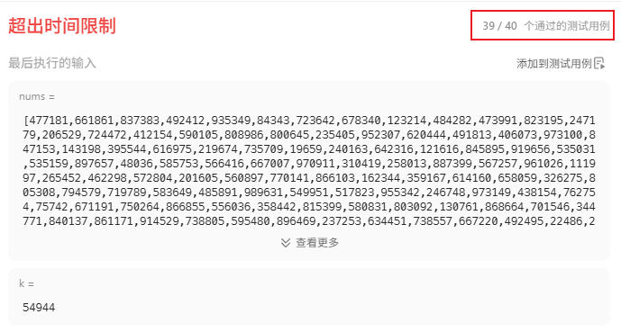

最后一个测试用例会非常大，卡你暴力解题的这个思路，那现在就需要换个新的思路。也就是三次转置，什么叫三次转置呢？请看下图

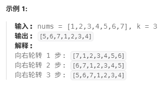

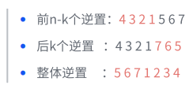


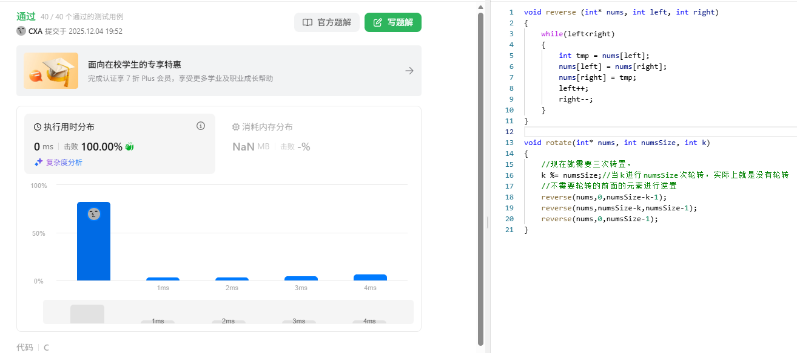

```c
void reverse (int* nums, int left, int right)
{
    while(left<right)
    {
        int tmp = nums[left];
        nums[left] = nums[right];
        nums[right] = tmp;
        left++;
        right--;
    }
}
void rotate(int* nums, int numsSize, int k) 
{
    //现在就需要三次转置，
    k %= numsSize;//当k进行numsSize次轮转，实际上就是没有轮转
    //不需要轮转的前面的元素进行逆置
    reverse(nums,0,numsSize-k-1);
    reverse(nums,numsSize-k,numsSize-1);
    reverse(nums,0,numsSize-1);
}
```


## [234. 回文链表](https://leetcode.cn/problems/palindrome-linked-list/)

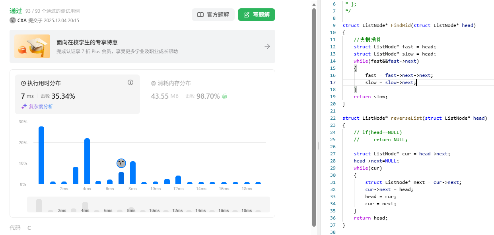

```c
/**
 * Definition for singly-linked list.
 * struct ListNode {
 *     int val;
 *     struct ListNode *next;
 * };
 */
struct ListNode* FindMid(struct ListNode* head)
{
    //快慢指针
    struct ListNode* fast = head;
    struct ListNode* slow = head;
    while(fast&&fast->next)
    {
        fast = fast->next->next;
        slow = slow->next;
    }
    return slow;
}
struct ListNode* reverseList(struct ListNode* head)
{
    // if(head==NULL)
    //     return NULL;
    
    struct ListNode* cur = head->next;
    head->next=NULL;
    while(cur)
    {
        struct ListNode* next = cur->next;
        cur->next = head;
        head = cur;
        cur = next;
    }   
    return head;
}
bool isPalindrome(struct ListNode* head) 
{
    //首先找到中间节点
    //这里需要注意的是如果是偶数个节点，那么需要指向后一个中间节点
    struct ListNode* mid = FindMid(head);
    //拿到中间节点后，进行反转后半部分链表
    struct ListNode* after = reverseList(mid);
    
    while(head && after)
    {
        if(head->val != after->val)
            return false;
        head = head->next;
        after = after->next;
    }
    return true;
}
```

## [160. 相交链表](https://leetcode.cn/problems/intersection-of-two-linked-lists/)


```c
/**
 * Definition for singly-linked list.
 * struct ListNode {
 *     int val;
 *     struct ListNode *next;
 * };
 */
int ListNodeLength(struct ListNode* head)
{
    int len = 0;
    struct ListNode* cur = head;
    while(cur)
    {
        cur = cur->next;
        len++;
    }
    return len;
}
struct ListNode *getIntersectionNode(struct ListNode *headA, struct ListNode *headB) 
{
    //空链表直接就没有交点
    if(headA==NULL||headB==NULL)
        return NULL;
    //求出链表长度差值，相交的地方肯定在除差值外的长度
    int lenA = ListNodeLength(headA);
    int lenB = ListNodeLength(headB);

    int more = abs(lenA-lenB);

    //假设A是长的那个
    struct ListNode* longlist = headA;
    struct ListNode* shortlist = headB;
    //如果假设错误，那么交换过来就好了
    if(lenA < lenB)
    {
        longlist = headB;
        shortlist = headA;
    }
    //长的先走差值个，然后保证在同一起跑线上
    while(more--)
    {
        longlist = longlist->next;
    }
    //一起走
    while(longlist&&shortlist)
    {
        if(longlist == shortlist)
            return longlist;
        longlist = longlist->next;
        shortlist = shortlist->next;
    }
    return NULL;
}
```

## [141. 环形链表](https://leetcode.cn/problems/linked-list-cycle/)


### 1. 问题描述
给你一个链表的头节点 `head` ，判断链表中是否有环。

如果链表中有某个节点，可以通过连续跟踪 `next` 指针再次到达，则链表中存在环。 为了表示给定链表中的环，评测系统内部使用整数 `pos` 来表示链表尾连接到链表中的位置（索引从 0 开始）。**注意：`pos` 不作为参数进行传递** 。仅仅是为了标识链表的实际情况。

如果链表中存在环 ，则返回 `true` 。 否则，返回 `false` 。

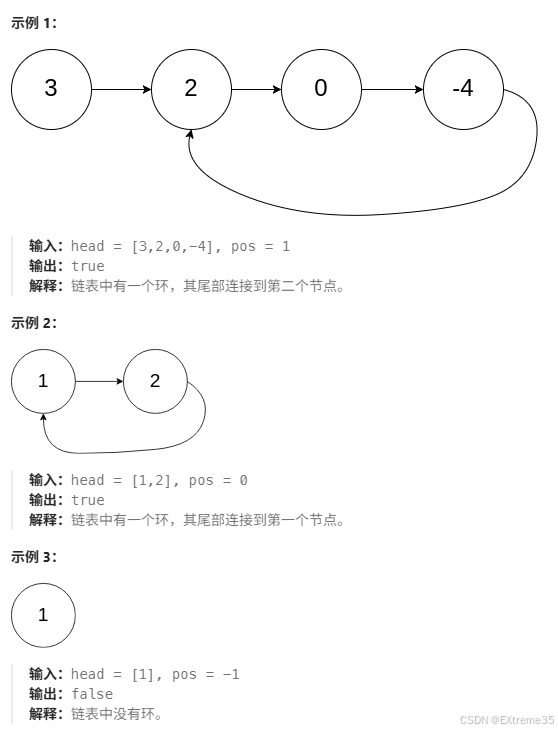

### 2. 核心思路：快慢指针法

我们定义两个指针：
  * **慢指针 (`slow`)**：一次走 1 步。
  * **快指针 (`fast`)**：一次走 2 步。

**算法流程**：

1.  初始化 `slow` 和 `fast` 都指向头节点 `head`。
2.  只要 `fast` 和 `fast->next` 不为空，循环执行：
      * `slow` 前进 1 步。
      * `fast` 前进 2 步。
      * 如果 `fast == slow`，说明相遇，链表存在环。
3.  如果循环结束（`fast` 遇到 NULL），说明无环。

**代码实现 (C语言)**
```c
/**
 * Definition for singly-linked list.
 * struct ListNode {
 * int val;
 * struct ListNode *next;
 * };
 */
bool hasCycle(struct ListNode *head) 
{
    if (head == NULL || head->next == NULL) 
        return false;
    //快慢指针
    struct ListNode *slow = head;
    struct ListNode *fast = head;
    while (fast != NULL && fast->next != NULL) 
    {
        slow = slow->next;      // 慢走1步
        fast = fast->next->next; // 快走2步
        if (slow == fast)
            return true; // 相遇，有环
    }
    return false; // 走到尽头，无环
}
```
### 3. 数学证明（重点）
#### Q1: 为什么快指针走2步，慢指针走1步，两者一定会相遇？

**证明（相对速度法）：**

我们假设在慢指针**刚刚进入环**的那一时刻，快指针开始追，这时候不知道快指针已经走多少圈了，就假设在此时我图中标记的位置。
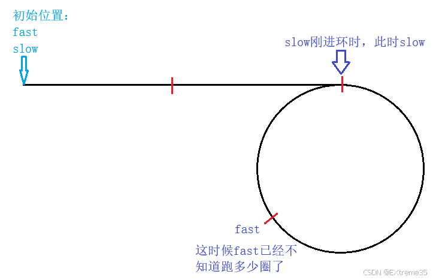
下来我们为了证明是否一定能追上，定义几个距离，看看最后是否能推出一个**数学表达式**。
- 假设从初始位置到刚进入环的距离是`L`。
- 假设 `slow` 进入环时，`fast` 追上 `slow` 的距离为 $N$（沿链表运行方向）。
- 假设链表环长度为`C`。

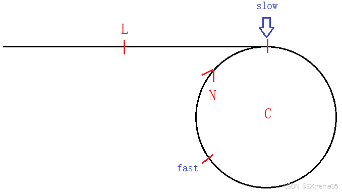
现在`fast`速度是`slow`的两倍，也就是每次**多走1**，也就是在`N`这个距离中，每次距离**会少1**，直至为0，一定会追上。
$$
N \rightarrow N-1 \rightarrow  N-2 \rightarrow  ... \rightarrow  1 \rightarrow  0
$$
**证明总结：**
  * 当 `slow` 进入环之后，`fast` 已经在环内了。
  * 假设 `slow` 进入环时，`fast` 领先 `slow` 的距离为 $N$（沿链表运行方向）。
  * 我们将 `slow` 看作静止，那么 `fast` 相对于 `slow` 的移动速度是 $2 - 1 = 1$ 步/次。
  * 每一次迭代，`fast` 都会把它和 `slow` 之间的距离缩短 1。
  * 距离变化过程：$N, N-1, N-2, ..., 1, 0$。

**结论**：因为距离每次减 1，必然会减到 0（相遇），绝对不会跳过去。
#### Q2: 如果不按照当前设定走呢？还能保证相遇吗？

这是一个非常好的进阶面试题。

**分析**：

  * 在刚才的分析中，我们是找到了相对速度，每次会少一步。
  	* 如果快指针走 3 步，慢指针走 1 步，**相对速度**是 $3 - 1 = 2$。
  	* 如果快指针走 4 步，慢指针走 1 步，**相对速度**是 $4 - 1 = 3$。
  * 这意味着 `fast` 每次把距离缩短一个相对速度的距离。
  * 还是按照上面的假设进行推演，得到每次相距的距离。

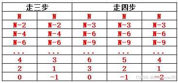
这里为什么有这么多情况呢？因为不知道`N`到底有多大，它有可能是`奇数、偶数、0`，都有可能。
所以需要对每一个结果进行讨论，当最后距离为0的时候，显然已经追上了，那么`-1`代表什么意思呢？很显然，代表这时候已经进入下一轮追击了，且快指针就在慢指针前面一个位置。那个`-2`也是一样的道理。

那我们之前设的圆环长度还一直没用呢，这时候就派上用场了。`-1`、`-2`，那这时候相对距离就是`C-1`、`C-2`。

**走三步的情况下：**

- N为偶数，第一轮追上。
- N为奇数，第一轮错过，看环长度。
	- $C-1$ 为奇数，那么永远追不上。
	- $C-1$为偶数，那么下一轮就追上了。

**走四步的情况：**

走四步就不能看奇偶了，而是是不是三的倍数，因为每次距离会少三，所以三的倍数一定会追上。
- `N % 3 = 0`，首轮就追上。
- `N % 3 = 1`，首轮错过，看环长。
	- `(C-1) % 3 = 0` ，下一轮追上。
	- `(C-1) % 3 = 1` ，永远追不上。
	- `(C-1) % 3 = 2` ，看下述情况。
- `N % 3 = 2` `，首轮错过，看环长。
	- `(C-1) % 3 = 0` ，下一轮追上。
	- `(C-1) % 3 = 1` ，看上述情况。
	- `(C-1) % 3 = 2` ，永远追不上。

那么有没有一个稍微通用的结论呢？尝试一下

- 设慢指针 `slow` 进环时，快指针 `fast` 与 `slow` 的距离为 **N**
- 设 `slow` 进环前走的距离为：**L**
- `fast` 在 `slow` 进环前已经绕环转了 **x** 圈

**距离关系分析**
- `fast` 走的总距离为：**L + x*C + (C - N)**。
- `slow` 走的距离为： **L**。

这时候就算是有个半成品的等式了，现在只需要带入速度关系就可，以3倍为例：
- **3L = L + (x+1)\*C - N**
- 化简后：**2L = (x+1)\*C - N**，这时候就可以用奇偶关系判断了。

**关键分析：** 如果同时存在以下两个条件：**N 是奇数**、**C 是偶数**。

那么根据公式：  **偶数 = (x+1)\*偶数 - 奇数**

**逻辑矛盾推导**
- `(x+1)*偶数` 的结果一定是**偶数**
- 只有 **奇数 - 奇数 = 偶数** 才成立
- 但等式中是 **偶数 - 奇数**，这在整数范围内不可能成立，故一定追不上。

**结论：**  如果步同时存在 **N 是奇数** 且 **C 是偶数** 的情况，永远追不上的条件不成立，因此快慢指针**一定能相遇**。

**相遇情况总结**

1. 当 **N 是偶数**：第一轮追击就能相遇
2. 当 **N 是奇数**、**C 是偶数**，一定追不上。
3. 其他情况都会在后面几轮追上。


## [142. 环形链表 II](https://leetcode.cn/problems/linked-list-cycle-ii/)


### 1. 问题描述
给定一个链表的头节点  `head` ，返回链表开始入环的第一个节点。 如果链表无环，则返回 `null`。
如果链表中有某个节点，可以通过连续跟踪 `next` 指针再次到达，则链表中存在环。 为了表示给定链表中的环，评测系统内部使用整数 `pos` 来表示链表尾连接到链表中的位置（**索引从 0 开始**）。如果 `pos` 是 `-1`，则在该链表中没有环。**注意：`pos` 不作为参数进行传递**，仅仅是为了标识链表的实际情况。
**不允许修改 链表。**
### 2. 核心思路：双指针二次相遇

1.  **第一次相遇**：使用快慢指针判断是否有环，若有环，记录相遇点。
2.  **寻找入口**：
      * 让一个指针从 **头节点 (Head)** 出发。
      * 让另一个指针从 **相遇点 (Meeting Node)** 出发。
      * 两个指针都每次走 1 步。
      * 它们最终会在 **环入口 (Entry Node)** 相遇。

**代码实现 (C语言)**
```c
struct ListNode *detectCycle(struct ListNode *head) 
{
    struct ListNode *slow = head;
    struct ListNode *fast = head;
    
    // 步骤一：判断是否有环
    while (fast != NULL && fast->next != NULL) {
        slow = slow->next;
        fast = fast->next->next;
        
        if (slow == fast) 
        {
            // 步骤二：发现环，寻找入口
            // 1. 定义两个指针，index1在头，index2在相遇点
            struct ListNode *index1 = head;
            struct ListNode *index2 = slow;
            // 2. 两人每次都走一步，直到相遇
            while (index1 != index2) 
            {
                index1 = index1->next;
                index2 = index2->next;
            } 
            // 3. 相遇点即为环入口
            return index1; 
        }
    }
    return NULL;
}
```

### 3. 数学推导（图解逻辑）

设：

  * $L$ = 头节点到环入口的距离。
  * $C$ = 环的长度。
  * $N$ = 环入口到相遇点的距离（沿运行方向）。
  * 相遇时，慢指针在环内走了$N$ 的距离。

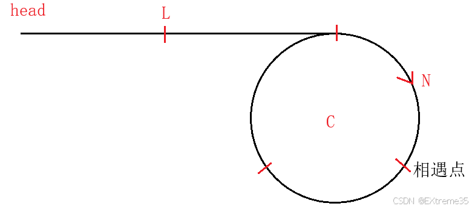


**推导过程**：

1.  **慢指针 `slow` 走的距离**：$S_{slow} = L + N$
    *(注意：通常慢指针在入环第一圈内就会被追上)*

2.  **快指针 `fast` 走的距离**：$S_{fast} = L + N + nC$
    *($n$ 是快指针在环内绕的圈数，且 $n \ge 1$)*

3.  **速度关系**：快指针速度是慢指针的 2 倍。
    $$2 \times (L + N) = L + N + nC$$

4.  **化简公式**：
    $$2L + 2N = L + N + nC$$
    $$L + N = nC$$
    $$L = nC - N$$

5.  **关键变换**：
    为了直观理解，我们将 $nC$ 拆解为 $(n-1)C + C$：
    $$L = (n-1)C + (C - N)$$

**公式含义解析**：

  * $L$ 是从头走到入口的距离。
  * $(C - N)$ 恰好是从相遇点继续往前走，回到环入口的距离。
  * $(n-1)C$ 表示在环里转了 $n-1$ 圈（这对最终位置没有影响）。

  **结论**：**从头节点出发走 $L$ 步，和从相遇点出发走 $L$ 步（实际上是转几圈后走了 $C-N$），会同时到达环入口。**


## [138. 随机链表的复制](https://leetcode.cn/problems/copy-list-with-random-pointer/)

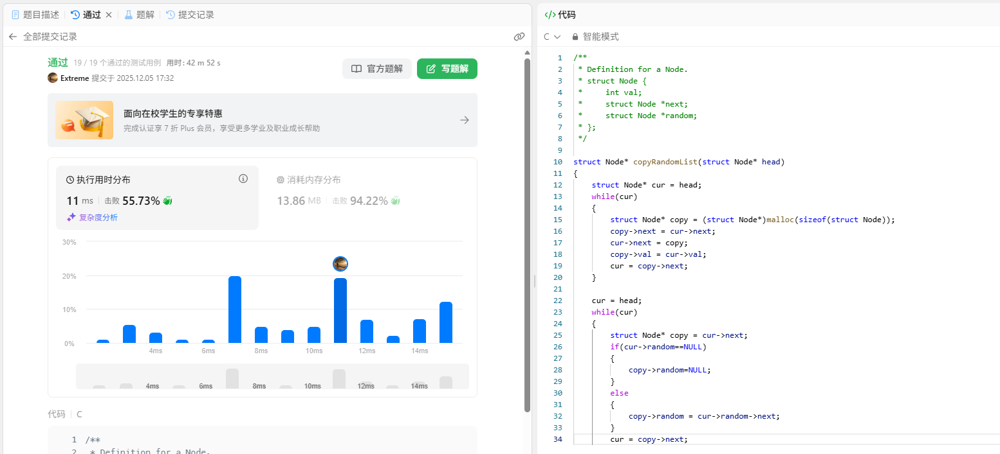


今天我们来看一道非常经典的链表题：**随机链表的复制**。第一次看到这道题时，有点蒙圈。但经过一番挣扎、画图和思考，最终领悟了其中“O(1) 空间复杂度”的精妙解法。

这篇博客将完全以一个初学者的视角展开，记录我每一步的困惑、尝试和突破，希望能给你带来启发。


### 1. 初次读题，一脸懵圈

给你一个长度为 `n` 的链表，每个节点包含一个额外增加的随机指针 `random` ，该指针可以指向链表中的任何节点或空节点。

构造这个链表的 **`深拷贝`**。 深拷贝应该正好由 `n` 个 **全新** 节点组成，其中每个新节点的值都设为其对应的原节点的值。新节点的 `next` 指针和 `random` 指针也都应指向复制链表中的新节点，并使原链表和复制链表中的这些指针能够表示相同的链表状态。**复制链表中的指针都不应指向原链表中的节点** 。

例如，如果原链表中有 `X` 和 `Y`两个节点，其中 `X.random --> Y` 。那么在复制链表中对应的两个节点 `x` 和 `y` ，同样有 `x.random --> y` 。

返回复制链表的头节点。

用一个由 `n` 个节点组成的链表来表示输入/输出中的链表。每个节点用一个 `[val, random_index]` 表示：
- `val`：一个表示 `Node.val` 的整数。
- `random_index`：随机指针指向的节点索引（范围从 `0` 到 `n-1`）；如果不指向任何节点，则为  `null` 。

你的代码 **只** 接受原链表的头节点 head 作为传入参数。
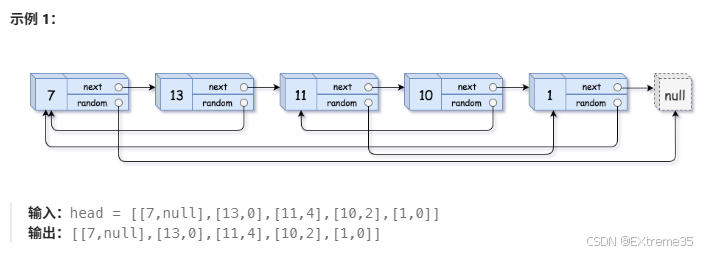

当我看到题目要求：给你一个链表，除了常规的 `next` 指针外，每个节点还有一个 `random` 指针，它可能指向链表中的**任意节点**或 **`NULL`**。要求你**深拷贝**这个链表。
#### 困难点：`random` 指针
  * **常规链表复制**：简单，遍历一次，创建新节点，把 `next` 指针连起来就行了。
  * **随机链表**：麻烦就在于这个 `random` 指针。它的指向毫无规律，就无法用常规思路去写。

**为什么麻烦？**

假设原链表是 $\text{A} \to \text{B}$。我们创建了拷贝链表 $\text{A'} \to \text{B'}$。

1.  当我创建 $\text{A'}$ 时，我怎么知道 $\text{A'}$ 的 `random` 应该指向谁？
2.  如果 $\text{A.random} = \text{B}$，那么 $\text{A'.random}$ 应该指向 $\text{B'}$。
3.  但当我创建 $\text{A'}$ 时，$\text{B'}$ **可能还没创建**！我怎么指向一个不存在的东西？

故**浅拷贝不行！** 新节点必须完全独立。不能简单地让 $\text{A'.random} = \text{A.random}$，因为 $\text{A.random}$ 指向的是**原链表中的节点**，而不是新链表中的拷贝节点。


**第一反应**：**画图！**

画图就可以清楚地认识到：我们需要一个**映射关系**，来告诉我在原链表中 A 对应的拷贝是 A'。
### 2. 第一版尝试——用哈希表

既然需要映射关系，我立刻想到了最直接、最笨的方法：**哈希表（Hash Map）**。
#### 思路：两遍遍历

1.  **第一次遍历（创建节点和映射）**：

      * 遍历原链表，每遇到一个原节点 $Cur$，就创建一个拷贝节点 $Cur'$。
      * 将这对关系存入哈希表：$\text{Map}[Cur] = Cur'$。
      * （这时候只创建了节点，还没连接 $\text{next}$ 和 $\text{random}$）

2.  **第二次遍历（连接指针）**：

      * 再次遍历原链表，每遇到一个原节点 $Cur$。
      * 从哈希表中取出它的拷贝节点 $Cur'$。
      * 设置 $Cur'$ 的 `next`： $\text{Cur'.next} = \text{Map}[Cur.next]$
      * 设置 $Cur'$ 的 `random`： $\text{Cur'.random} = \text{Map}[Cur.random]$

> 这个方法**非常有效且容易理解**。时间复杂度 $O(N)$（两次遍历），空间复杂度 $O(N)$（哈希表存储 $N$ 个节点）。
> 它能解决问题，但还能继续优化吗？**能不能不用额外空间，达到 $O(1)$ 空间复杂度？** 

### 3. 灵光一闪——在原链表上做文章

我盯着链表结构图发呆，心想：既然 $O(N)$ 空间是浪费在哈希表上，那有没有一种**天然的映射**，可以替代哈希表？

**为什么不把拷贝节点直接插到原节点的旁边呢？**
#### 嵌入式映射

1.  **原链表：** $\text{A} \to \text{B} \to \text{C} \to \text{NULL}$
2.  **嵌入后：** $\text{A} \to \text{A'} \to \text{B} \to \text{B'} \to \text{C} \to \text{C'} \to \text{NULL}$

##### 关键优势：

  * **映射是天然的！** 对于任意原节点 $\text{Cur}$，它的拷贝节点 $\text{Cur'}$ 永远是 $\text{Cur.next}$。
  * **公式成立：** $\text{Cur'} = \text{Cur.next}$

有了这个天然的 $O(1)$ 查找映射，我就可以进入最难的部分了！

-----

### 4. 解决 random 指针——最烧脑的部分

现在，我的链表是混合的，我需要设置拷贝节点 ($\text{A'}, \text{B'}, \text{C'}$) 的 $\text{random}$ 指针。

假设原节点 $\text{A}$ 的 $\text{random}$ 指向 $\text{C}$。即 $\text{A.random} = \text{C}$。
那么，它的拷贝节点 $\text{A'}$ 的 $\text{random}$ 应该指向 $\text{C'}$。即 $\text{A'.random} = \text{C'}$。

#### 如何找到 $\text{C'}$？

1.  **第一步**：从 $\text{A}$ 找到它 $\text{random}$ 指向的原节点 $\text{C}$：
    $$\text{cur\_random} = \text{A.random} \implies \text{C}$$
2.  **第二步**：利用“嵌入式映射”，我们知道 $\text{C'}$ 就在 $\text{C}$ 的隔壁：
    $$\text{C'} = \text{C.next}$$

#### 核心公式的诞生！
$$\text{A'.random} = \text{A.random.next}$$

画图辅助写代码：
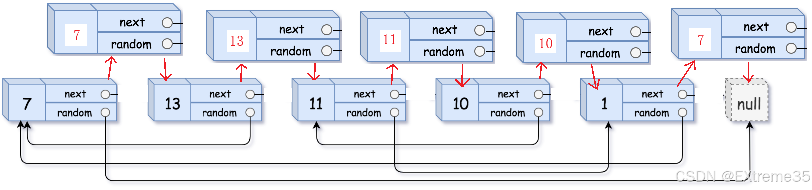
用代码来表达就是：

```c
// 当前节点是 cur (原节点), 它的拷贝节点是 copy (cur->next)
struct Node* copy = cur->next;

if (cur->random != NULL) {
    // 假设 cur->random 指向 C，那么 C 的拷贝 C' 就在 C 的 next
    copy->random = cur->random->next;
} else {
    // 边界情况：如果原节点的 random 是 NULL，那么拷贝的 random 也是 NULL
    copy->random = NULL;
}
```

至此，$\text{random}$ 指针的问题在 $O(N)$ 的时间复杂度下解决了！

### 5. 拆分链表——最后的难关

现在，我有一个完美复制了 $\text{next}$ 和 $\text{random}$ 的混合链表：$\text{A} \to \text{A'} \to \text{B} \to \text{B'} \to \text{C} \to \text{C'}$。

我最后的任务是：

1.  **恢复原链表：** $\text{A} \to \text{B} \to \text{C}$
2.  **构建新链表：** $\text{A'} \to \text{B'} \to \text{C'}$
#### 同时拆分与重连
我们可以在一次遍历中完成这两件事。我们用两个指针 $cur$ 和 $copy$ 来分别维护原链表和新链表.

1.  $cur$ 负责恢复原链表的 $\text{next}$：`cur->next = cur->next->next` (即 $\text{A} \to \text{B}$)
2.  $copy$ 负责构建新链表的 $\text{next}$：`copy->next = copy->next->next` (即 $\text{A'} \to \text{B'}$)

### 6. 完整代码实现

将这三个阶段整理成一个清晰的**三步走**流程，并用 C 语言实现，添加详细的注释来解释每一步的思考。

```c
struct Node* copyRandomList(struct Node* head) 
{
    if (head == NULL)
        return NULL; // 边界情况1：空链表，返回 NULL
    // --- 步骤 1: 插入拷贝节点 (建立 O(1) 映射) ---
    // 我需要一个天然的映射，代替 O(N) 的哈希表。
    // 策略：把拷贝节点插在原节点后面，即 A -> A' -> B -> B'
    struct Node* cur = head;
    while (cur != NULL) 
    {
        // 创建 A' 节点，值和 A 一样
        struct Node* copy = (struct Node*)malloc(sizeof(struct Node));
        copy->val = cur->val;
        // A' 的 next 指向 B
        copy->next = cur->next;        
        // A 的 next 指向 A'
        cur->next = copy;
        // 移动到下一个原节点 B (即 A' 的 next)
        cur = copy->next; 
    }
    // --- 步骤 2: 复制 random 指针 (利用 O(1) 映射) ---
    // 现在我们有 A -> A' -> B -> B' 的结构
    // 核心公式：A'.random = A.random->next (因为 A.random->next 就是 A.random 的拷贝节点)
    cur = head;
    while (cur != NULL) 
    {
        struct Node* copy = cur->next;
        // 边界情况2：如果原节点的 random 是 NULL
        if (cur->random != NULL) {
            // A.random 假设是 C，那么 C 的拷贝 C' 就是 C.next
            copy->random = cur->random->next;
        else 
            copy->random = NULL;
        // 移动到下一个原节点 B (即 A' 的 next)
        cur = copy->next;
    }
    // --- 步骤 3: 拆分链表 (恢复原链表结构并构建新链表) ---
    // 拆分：A -> A' -> B -> B' 变成 A -> B 和 A' -> B'
    struct Node* new_head = head->next; // 新链表的头节点 (即 A')
    cur = head;
    // 为什么要用 new_head 作为新链表的头？
    // 因为 head (A) 永远是原链表的头，它的 next (A') 永远是新链表的头。
    while (cur != NULL) 
    {
        struct Node* copy = cur->next; // 拷贝节点 (A')
        // 1. 恢复原链表的 next: A -> B
        cur->next = copy->next; 
        // 2. 构建新链表的 next: A' -> B'
        if (copy->next != NULL)
            // copy->next 此时指向 B。B 的拷贝 B' 就在 B 的 next 位置
            copy->next = copy->next->next; 
        else
            // 边界情况3：如果是最后一个拷贝节点 C'，它的 next 应该指向 NULL
            copy->next = NULL;

        // 移动到下一个原节点 B
        cur = cur->next;
    }
    // 返回新链表的头节点
    return new_head; 
}
```
### 7. 测试与验证 ✅

为了验证算法，手动构造了一个小例子，并画出每一步的链表状态：

**测试用例：** $\text{A} \to \text{B} \to \text{NULL}$。且 $\text{A.random} = \text{B}$，$\text{B.random} = \text{A}$。

#### 步骤一：插入拷贝节点

| 节点     | 初始状态     | 插入后                           |
| :------- | :----------- | :------------------------------- |
| **A**    | $A \to B$    | $A \to A' \to B$                 |
| **B**    | $B \to NULL$ | $B \to B' \to NULL$              |
| **结果** |              | $A \to A' \to B \to B' \to NULL$ |

#### 步骤二：复制 random 指针

| 当前节点 $\text{cur}$ | 拷贝节点 $\text{copy}$ | $\text{cur.random}$ | $\text{copy.random}$ 设置为 | 验证公式                                                 |
| :-------------------- | :--------------------- | :------------------ | :-------------------------- | :------------------------------------------------------- |
| **A**                 | A'                     | B                   | B' ($\text{B.next}$)        | $\text{A.random.next} = \text{B.next} = \text{B'}$ **✓** |
| **B**                 | B'                     | A                   | A' ($\text{A.next}$)        | $\text{B.random.next} = \text{A.next} = \text{A'}$ **✓** |

#### 步骤三：拆分链表

| 当前节点 $\text{cur}$ | 拷贝节点 $\text{copy}$ | 恢复 $\text{cur.next}$          | 构建 $\text{copy.next}$          |
| :-------------------- | :--------------------- | :------------------------------ | :------------------------------- |
| **A**                 | A'                     | $\text{A.next} \to \text{B}$    | $\text{A'.next} \to \text{B'}$   |
| **B**                 | B'                     | $\text{B.next} \to \text{NULL}$ | $\text{B'.next} \to \text{NULL}$ |

**最终结果：**

  * **原链表：** $\text{A} \to \text{B} \to \text{NULL}$（结构已恢复）
  * **新链表：** $\text{A'} \to \text{B'} \to \text{NULL}$，且 $\text{A'.random} \to \text{B'}$，$\text{B'.random} \to \text{A'}$（复制成功）
### 8. 总结
#### 三步法的核心思想：

1.  **插入（Embed）**：建立**原节点-拷贝节点的物理相邻关系**。这用 $O(1)$ 的时间替代了 $O(N)$ 空间的哈希表映射。这是从 $O(N)$ 空间到 $O(1)$ 空间的关键一步。
2.  **复制（Utilize）**：利用这种相邻关系，通过 `cur->random->next`  的公式，快速定位 $\text{random}$ 对应的拷贝节点.
3.  **拆分（Separate）**：优雅地将混合链表分离，**边拆分边重连**，同时恢复原链表，构建新链表。
#### 建议 
  * **遇到难题，先画图！** 相信我，画图思考比干想代码有效 100 倍。
  * **从最简单的情况开始。** 比如，先只考虑 $\text{next}$ 指针，再引入 $\text{random}$ 指针。
  * **多问自己“能不能更好？”** 如果我一开始满足于哈希表 $O(N)$ 的解法，就不会去探索这个 $O(1)$ 空间的精妙技巧了。

#  队列

## [622. 设计循环队列](https://leetcode.cn/problems/design-circular-queue/)

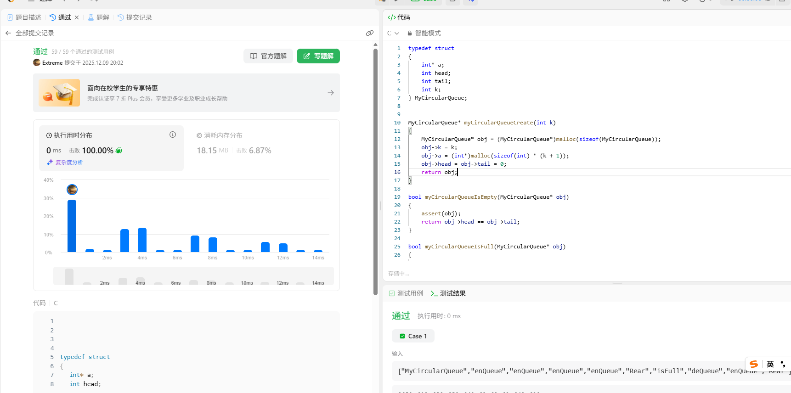

```c
typedef struct
{
	int* a;
	int head;
	int tail;
	int k;
} MyCircularQueue;

MyCircularQueue* myCircularQueueCreate(int k) 
{
	MyCircularQueue* obj = (MyCircularQueue*)malloc(sizeof(MyCircularQueue));
	obj->k = k;
	obj->a = (int*)malloc(sizeof(int) * (k + 1));
	obj->head = obj->tail = 0;
    return obj;
}

bool myCircularQueueIsEmpty(MyCircularQueue* obj) 
{
	assert(obj);
	return obj->head == obj->tail;
}

bool myCircularQueueIsFull(MyCircularQueue* obj) 
{
	assert(obj);
	int rear = (obj->tail + 1) % (obj->k + 1);
	return rear == obj->head;
}

bool myCircularQueueEnQueue(MyCircularQueue* obj, int value) 
{
	if (myCircularQueueIsFull(obj))
		return false;
	obj->a[obj->tail] = value;
	obj->tail = (obj->tail + 1) % (obj->k + 1);
	return true;
}

bool myCircularQueueDeQueue(MyCircularQueue* obj) 
{
	if (myCircularQueueIsEmpty(obj))
		return false;
	obj->head = (obj->head + 1) % (obj->k + 1);
	return true;
}

int myCircularQueueFront(MyCircularQueue* obj) 
{
	assert(obj);
	if (myCircularQueueIsEmpty(obj))
		return -1;
	else
		return obj->a[obj->head];
}

int myCircularQueueRear(MyCircularQueue* obj) 
{
	assert(obj);
	if (myCircularQueueIsEmpty(obj))
		return -1;
	else
		return obj->a[(obj->tail + obj->k) % (obj->k + 1)];
}

void myCircularQueueFree(MyCircularQueue* obj) 
{
	assert(obj);
	free(obj->a);
	free(obj);
}

/**
 * Your MyCircularQueue struct will be instantiated and called as such:
 * MyCircularQueue* obj = myCircularQueueCreate(k);
 * bool param_1 = myCircularQueueEnQueue(obj, value);

 * bool param_2 = myCircularQueueDeQueue(obj);

 * int param_3 = myCircularQueueFront(obj);

 * int param_4 = myCircularQueueRear(obj);

 * bool param_5 = myCircularQueueIsEmpty(obj);

 * bool param_6 = myCircularQueueIsFull(obj);

 * myCircularQueueFree(obj);
*/
```

[【数据结构】万字深度解析 | 循环队列：为什么数组实现要牺牲一个单元？-CSDN博客](https://blog.csdn.net/2501_93679849/article/details/155751674?spm=1011.2415.3001.5331)


# 堆

## [17.14. 最小K个数](https://leetcode.cn/problems/smallest-k-lcci/)

```c
/**
 * Note: The returned array must be malloced, assume caller calls free().
 */

typedef int HDataType;

typedef struct Heap
{
	HDataType* a;
	int size;
	int capacity;
}HP;

void HPInit(HP* php)
{
	assert(php);
	php->a = NULL;
	php->capacity = php->size = 0;
}
void HPDestroy(HP* php)
{
	assert(php);
	free(php->a);
	php->a = NULL;
}

void swap(HDataType* p1, HDataType* p2)
{
	HDataType tmp = *p1;
	*p1 = *p2;
	*p2 = tmp;
}

void AdjustUP(HDataType* a, int child)
{
	int parent = (child - 1) / 2;
	
	while (child > 0)
	{
		//小根堆
		if (a[parent] > a[child])
		{
			swap(&(a[parent]), &(a[child]));
			child = parent;
			parent = (child - 1) / 2;
		}
		else
		{
			break;
		}
	}
}

void HPPush(HP* php, HDataType x)
{
	assert(php);

	if (php->capacity == php->size)
	{
		int newcapacity = php->capacity == 0 ? 4 : 2 * php->capacity;
		HDataType* tmp = (HDataType*)realloc(php->a,sizeof(HDataType) * newcapacity);
		if (tmp == NULL)
		{
			perror("malloc");
			exit(-1);
		}
		php->a = tmp;
		php->capacity = newcapacity;
	}

	php->a[php->size] = x;
	php->size++;

	AdjustUP(php->a,php->size-1);
}

void AdjustDown(HDataType* a, int n,int parent)
{
	//假设左孩子小
	int child = parent * 2 + 1;
	while (child < n)
	{
		//找到值小的孩子节点
		if (child + 1 < n && a[child] > a[child + 1])
		{
			child++;
		}
		if (a[parent] > a[child])
		{
			swap(&(a[parent]), &(a[child]));
			parent = child;
			child = parent * 2 + 1;
		}
		else
		{
			break;
		}
	}

}

void HPPop(HP* php)
{
	assert(php);
	assert(php->size > 0);
	swap(&(php->a[0]), &(php->a[php->size - 1]));
	php->size--;

	AdjustDown(php->a,php->size,0);
}

HDataType HPTop(HP* php)
{
	assert(php);
	return (php->a[0]);
}
bool HPEmpty(HP* php)
{
	assert(php);
	return php->size == 0;
}

int* smallestK(int* arr, int arrSize, int k, int* returnSize) 
{
    int* res = (int*)malloc(sizeof(int)*k);
    *returnSize=k;
    HP heap;
    HPInit(&(heap));
    int i=0;
    while(i<arrSize)
    {
        HPPush(&(heap),arr[i]);
        i++;
    }
    i=0;
    while(k--)
    {
        res[i++] = HPTop(&(heap));
        HPPop(&(heap));
    }
    
    return res;
}
```

## TopK

```c
#define _CRT_SECURE_NO_WARNINGS 1

#include<time.h>
#include<stdio.h>
#include<assert.h>
#include<stdlib.h>
#include<stdbool.h>

typedef int HPDataType;

void Swap(HPDataType* p1, HPDataType* p2)
{
	HPDataType tmp = *p1;
	*p1 = *p2;
	*p2 = tmp;
}
void AdjustDown(HPDataType* a, int n, int parent)
{
	// 先假设左孩子小
	int child = parent * 2 + 1;

	while (child < n)  // child >= n说明孩子不存在，调整到叶子了
	{
		// 找出小的那个孩子
		if (child + 1 < n && a[child + 1] < a[child])
		{
			++child;
		}

		if (a[child] < a[parent])
		{
			Swap(&a[child], &a[parent]);
			parent = child;
			child = parent * 2 + 1;
		}
		else
		{
			break;
		}
	}
}
void CreateNDate()
{
	// 造数据
	int n = 100000;
	srand((unsigned int)time(NULL));
	const char* file = "data.txt";
	FILE* fin = fopen(file, "w");
	if (fin == NULL)
	{
		perror("fopen error");
		return;
	}

	for (int i = 0; i < n; ++i)
	{
		int x = (rand() + i) % 10000000;
		fprintf(fin, "%d\n", x);
	}

	fclose(fin);
	fin = NULL;
}

void TestHeap3()
{
	int k;
	printf("请输入k>:");
	scanf("%d", &k);
	int* kminheap = (int*)malloc(sizeof(int) * k);
	if (kminheap == NULL)
	{
		perror("malloc fail");
		return;
	}
	const char* file = "data.txt";
	FILE* fout = fopen(file, "r");
	if (fout == NULL)
	{
		perror("fopen error");
		return;
	}

	// 读取文件中前k个数
	for (int i = 0; i < k; i++)
	{
		fscanf(fout, "%d", &kminheap[i]);
	}

	// 建K个数的小堆
	for (int i = (k - 1 - 1) / 2; i >= 0; i--)
	{
		AdjustDown(kminheap, k, i);
	}

	// 读取剩下的N-K个数
	int x = 0;
	while (fscanf(fout, "%d", &x) != EOF)
	{
		if (x > kminheap[0])
		{
			kminheap[0] = x;
			AdjustDown(kminheap, k, 0);
		}
	}

	printf("最大前%d个数：", k);
	for (int i = 0; i < k; i++)
	{
		printf("%d ", kminheap[i]);
	}
	printf("\n");
}

int main()
{
	//CreateNDate();

	TestHeap3();

	return 0;
}
```

