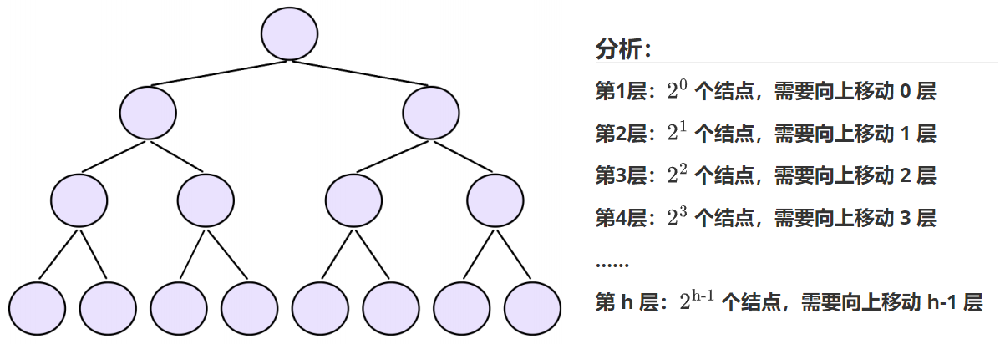

# 深入解析堆排序的调整操作与 Top-K 问题的实现

## 引言

**堆（Heap）**是一种特殊的**完全二叉树**数据结构，通常用于实现**优先队列**。堆的性质要求：在大顶堆中，任意节点的值都大于或等于其子节点的值；在小顶堆中，任意节点的值都小于或等于其子节点的值。堆排序（Heap Sort）是基于堆这种数据结构的一种高效排序算法，其核心操作在于元素的**向上调整（AdjustUp）和向下调整（AdjustDown）**，这两种操作对于维护堆的性质至关重要。

本文将首先深入探究堆排序中向上调整和向下调整操作的**时间复杂度**，通过详细的数学分析证明其效率。随后，我们将利用堆的特性，结合您提供的 C 语言代码，详细阐述和实现一个经典的算法问题——**Top-K 问题**，即从一个大规模数据集中找出最大的 K 个元素。

## I. 堆操作的时间复杂度分析

在堆中，向上调整和向下调整操作是维持堆性质的基础，尤其在插入元素（向上调整）和删除堆顶元素（向下调整）时。

### 1. 堆的基本性质与高度

一个包含 $N$ 个元素的完全二叉树（即堆）的高度 $H$ 是 $O(\log N)$。
$$
H = \lfloor \log_2 N \rfloor
$$
证明：假设一个满二叉树有 $N$ 个节点，其高度为 $H$ (根节点所在的层记为第 1 层，则叶子节点在第 $H-1$ 层)。则节点总数 $N$ 满足：
$$
N = 1 + 2 + 4 + \dots + 2^\text{H-1} = 2^{H} - 1
$$

解出  $H$ :  $$N+1 = 2^{H+1}$$ $\rightarrow$ $$\log_2(N+1) = H+1$$ $\rightarrow$  $$H = \log_2(N+1)$$

对于一个具有 $N$ 个节点的完全二叉树，其节点数 $N$ 满足：

$$
2^H \le N \le 2^{H+1} - 1
$$


其中 $H$ 是其高度（最高层的索引）。

从左侧不等式 $2^H \le N$ 可得： $$H \le \log_2 N$$

从右侧不等式 $N \le 2^{H+1} - 1$ 可得：


$$
N+1 \le 2^{H+1} \rightarrow \log_2(N+1) \le H+1 \rightarrow  H \ge \log_2(N+1) - 1
$$

综合这两个不等式，完全二叉树的高度 $H$ 满足：
$$
\log_2(N+1) - 1 \le H \le \log_2 N
$$


因此，对于足够大的 $N$，堆的高度 $H$ 渐进地趋近于 $\log_2 N$，记为 $O(\log N)$。


### 1. 向上调整（AdjustUp）的建堆时间复杂度：$O(N \log N)$

**向上调整**操作用于在堆尾插入一个新元素后，恢复堆的性质。新元素位于子节点位置，通过与其父节点比较，如果新元素不满足堆的性质（例如，在小顶堆中，子节点小于父节点），则交换它们的位置，并继续向上比较，直到根节点或满足堆性质为止。

**操作过程分析：**

1. **比较与交换：** 循环内，比较 `a[child]` 和 `a[parent]`，若 `a[child] < a[parent]`，则执行一次交换操作。
2. **移动：** 交换后，`child` 变为原来的 `parent`，`parent` 重新计算为新的 `(child - 1) / 2`。

在每一次循环中，元素至多向上移动一层，即：

$$
\text{操作次数} \le 1
$$
$$
\text{移动距离} = 1 \text{ 层}
$$

该过程从叶子节点（最深层 $H$）开始，一直向上追溯到根节点。最坏情况是元素从最底层一直移动到根节点，路径长度恰好等于堆的高度 $H$。


**推导过程：** 为简化计算，我们以 $h$ 层满二叉树为例进行分析，若规定根结点层数为 1。




则第 $i$ 层的结点数 $n_i = 2^{i-1}$，该层结点向上调整的最大移动层数为 $i-1$，总移动步数 $T(h)$ 是：每层结点个数 * 向上调整次数（第⼀层调整次数为0）

$$
T(h) = \sum_{i=1}^{h} 2^{i-1} \cdot (i-1)
$$

展开求和项，并令 $j = i-1$:

$$
T(h) = \sum_{j=0}^{h-1} 2^j \cdot j = 2^1 \cdot 1 + 2^2 \cdot 2 + 2^3 \cdot 3 + \dots + 2^{h-1} \cdot (h-1) \quad (\text{1})
$$

使用错位相减法。将 $\text{(1)}$ 式乘以公比 $r=2$:

$$
2 \cdot T(h) = 2^2 \cdot 1 + 2^3 \cdot 2 + 2^4 \cdot 3 + \dots + 2^{h-1} \cdot (h-2) + 2^h \cdot (h-1) \quad (\text{2} )
$$

用 $\text{(2)}$ 式减去 $\text{(1)}$ 式：$T(h) = 2 \cdot T(h) - T(h)$

$$
T(h) = -2^1 \cdot 1 + (2^2 \cdot 1) + (2^3 \cdot 1) + \dots + (2^{h-1} \cdot 1) + 2^h \cdot (h-1)
$$

为了凑成完整的等比数列求和 $\sum_{i=0}^{h-1} 2^i = 2^h - 1$，我们将 $2^0=1$ 加到等式两边：

$$T(h) = -(2^0 + 2^1 + 2^2 + \dots + 2^{h-1}) + 2^h \cdot (h-1) + 2^0$$

$$T(h) = -\sum_{i=0}^{h-1} 2^i + 2^h \cdot (h-1) + 1$$

$$T(h) = -(2^h - 1) + 2^h \cdot (h-1) + 1$$

$$T(h) = -2^h + 1 + h \cdot 2^h - 2^h + 1$$

$$T(h) = h \cdot 2^h - 2 \cdot 2^h + 2$$

$$T(h) = 2^h (h - 2) + 2$$

将结点总数 $N = 2^h - 1$ 和高度 $h = \log_2(N+1)$ 代入得：
$$
F(N) = (N+1)(\log_2(N+1) - 2) + 2
$$
因此，向上调整算法的建堆时间复杂度为：
$$
T_{AdjustUp\_Build} = O(N \log N)
$$

### 2. 向下调整（AdjustDown）的建堆时间复杂度：$O(N)$

**向下调整**操作通常用于删除堆顶元素（用堆尾元素替换堆顶后）或在建堆过程中，用于将一个不符合堆性质的子树调整为堆。操作从父节点开始，与其左右孩子节点中**满足条件的那个孩子**进行比较，如果不满足堆性质，则交换，并向下递归，直到满足堆性质或到达叶子节点。

**操作过程分析：**

1. **确定孩子：** 确定左右孩子中较小的那个孩子 `child`。
2. **比较与交换：** 比较 `a[child]` 和 `a[parent]`。若 `a[child] < a[parent]`，则执行一次交换操作。
3. **移动：** 交换后，`parent` 变为原来的 `child`，`child` 重新计算为新的 `parent * 2 + 1`。

在每一次循环中，元素至多向下移动一层，即：
$$
\text{操作次数} \le 1
$$
$$
\text{移动距离} = 1 \text{ 层}
$$
该过程从根节点（第 1 层）开始，一直向下追溯到叶子节点（最深层 $H$）。最坏情况是元素从根节点一直向下移动到最底层，路径长度恰好等于堆的高度 $H$。

该方法从最后一个非叶子结点开始，依次对所有非叶子结点执行一次向下调整操作。

**推导过程：** 同样以 $h$ 层满二叉树为例。若规定根结点层数为 1，则第 $i$ 层的结点数 $n_i = 2^{i-1}$，该层结点向下调整的最大移动层数为 $h-i$。


总移动步数 $T(h)$ 是每层结点数与其最大向下调整次数的乘积之和：

$$
T(h) = \sum_{i=1}^{h-1} 2^{i-1} \cdot (h-i)
$$
展开求和项，并令 $j = i-1$:

$$
T(h) = \sum_{j=1}^{h-1} 2^j \cdot (h-1-j) = 2^0\cdot(h-1) + 2^1\cdot(h-2) + 2^2\cdot(h-3) +2^3\cdot(h-4)+ \dots + 2^{h-3}\cdot2+2^{h-2}\cdot1 \quad (\text{1})
$$

使用错位相减法。将 $\text{(1)}$ 式乘以公比 $r=2$：

$$
2 \cdot T(h) = 2^1\cdot(h-1) + 2^2\cdot(h-2) + 2^3\cdot(h-3) +2^4\cdot(h-4)+ \dots + 2^{h-2}\cdot2+2^{h-1}\cdot1 \quad (\text{2})
$$

用 $\text{(2)}$ 式减去 $\text{(1)}$ 式：$T(h) = 2 \cdot T(h) - T(h)$

$$
T(h) = -2^0(h-1) + 2^1 + 2^2 + 2^3 + 2^4+  \dots +2^{h-2}+ 2^{h-1}
$$

为了凑成完整的等比数列 $\sum_{i=0}^{h-1} 2^i = 2^h - 1$，我们将 $2^0=1$ 加到第一部分，并进行整理：

$$T(h) = 2^0 + 2^1 + 2^2 + \dots + 2^{h-1} - h$$

$$T(h) = \sum_{i=0}^{h-1} 2^i - h$$

$$T(h) = (2^h - 1) - h$$

将结点总数 $N = 2^h - 1$ 和高度 $h = \log_2(N+1)$ 代入：
$$
T(N) = N - \log_2(N+1)
$$

由于 $N$ 远大于 $\log_2(N+1)$，因此该建堆方法的时间复杂度为：
$$
T_{AdjustDown\_Build} = O(N)
$$


## II. Top-K 问题

**TOP-K问题：**即从 $N$ 个数据中找出前$K$个最⼤的元素或者最⼩的元素，⼀般情况下数据量都⽐较⼤。

⽐如：专业前10名、世界500强、富豪榜、游戏中前100的活跃玩家等。

对于**Top-K问题**，能想到的最简单直接的⽅式就是排序，但是：如果数据量⾮常⼤，排序就不太可取了(可能数据都不能⼀下⼦全部加载到内存中)。最佳的⽅式就是⽤堆来解决，基本思路如下：

1. ⽤数据集合中前K个元素来建堆

   - 前$K$个**最⼤**的元素，则建**小堆**。

   - 前$K$个**最⼩**的元素，则建**大堆。**

2. ⽤剩余的$N-K$个元素依次与**堆顶元素**来⽐较，不满⾜则**替换堆顶元素**。

将剩余$N-K$个元素依次与堆顶元素⽐完之后，堆中剩余的$K$个元素就是所求的前$K$个最小或者最大的元素。

### 1. 核心策略

为了高效地找出前 $K$ 个最大的元素，我们维护一个大小为 $K$ 的**小顶堆**（`Min-Heap`）。

**为什么选择小顶堆？**

- 小顶堆的堆顶元素是这 $K$ 个数中的**最小值**。
- 我们想要找到的是最大的 $K$ 个数。当遍历到一个新的数 $X$ 时，如果 $X$ 比堆顶的最小值还要大，说明 $X$ 有资格成为前 $K$ 大的数之一。此时，我们用 $X$ 替换掉堆顶的最小值，然后对堆进行向下调整，确保堆中仍然是当前遍历到的所有数中的最大 $K$ 个数。

**具体步骤：**

- **阶段一：** 读取数据流中的前 $K$ 个数，并用这 $K$ 个数建立一个大小为 $K$ 的**小顶堆**，使用向下调整算法，时间复杂度为$O(N)$。

```c
  // 阶段一：读取文件中前k个数并建堆
  for (int i = 0; i < k; i++)
  {
      fscanf(fout, "%d", &kminheap[i]);
  }
  
  // 建立K个数的小顶堆
  // 从最后一个非叶子节点开始向下调整
  for (int i = (k - 1 - 1) / 2; i >= 0; i--) 
  {
      AdjustDown(kminheap, k, i);
  }
```


- **阶段二：遍历与调整**

  - 从第 $K+1$ 个数开始，依次读取剩下的 $N-K$ 个数 $X$。
  - **判断：** 如果 $X > \text{堆顶元素}$（即 $X$ 大于当前已知的 $K$ 个最大数中的最小值），则执行替换。
  - **替换与调整：** 将堆顶元素替换为 $X$，然后对新的堆顶执行**向下调整（AdjustDown）**操作，以恢复小顶堆的性质。
  - 向下调整的时间复杂度：$O(\log K)$。

```c
// 阶段二：读取剩下的N-K个数并调整堆
int x = 0;
while (fscanf(fout, "%d", &x) > 0)
{
    // 核心判断：如果新读取的数比堆顶（K个数中的最小值）大
    if (x > kminheap[0]) 
    {
        // 替换堆顶
        kminheap[0] = x;
        // 向下调整，恢复小顶堆性质
        AdjustDown(kminheap, k, 0); 
    }
}
```

- **阶段三：**遍历结束后，堆中剩下的 $K$ 个元素即为原数据流中最大的 $K$ 个数。

```c
// 阶段三：输出结果
printf("最大前%d个数：", k);
for (int i = 0; i < k; i++)
{
    printf("%d ", kminheap[i]);
}
printf("\n");
```

### 2.Top-K 问题的时间复杂度分析

假设数据流中的总数据量为 $N$，我们需要找出最大的 $K$ 个数。

1. **阶段一：建堆**
   - 读取前 $K$ 个数：$O(K)$
   - 建立大小为 $K$ 的小顶堆（通过 $O(K)$ 次 `AdjustDown` 操作）：$O(K)$
   - **总时间：** $T_{Init} = O(K)$
2. **阶段二：遍历与调整**
   - 需要处理 $N-K$ 个数。
   - 对于每个数 $X$，判断是否大于堆顶 $O(1)$。
   - 如果需要替换，则执行一次向下调整 `AdjustDown` 操作。
   - `AdjustDown` 操作在大小为 $K$ 的堆上，时间复杂度为 $O(\log K)$。
   - **总时间：** $T_{Loop} = (N-K) \times O(\log K) = O((N-K) \log K)$
3. **最终时间复杂度**
   - $$T_{Total} = T_{Init} + T_{Loop} = O(K) + O((N-K) \log K)$$
   - 由于 $N$ 往往远大于 $K$，所以 $N-K \approx N$。
   - $$T_{TopK} \approx O(N \log K)$$

优势分析：

相比于直接对所有 $N$ 个元素进行排序（时间复杂度 $O(N \log N)$），堆方法的时间复杂度 $O(N \log K)$ 要高效得多，尤其当 $K \ll N$ 时。例如，在一个包含十亿（$10^9$）个数据的集合中找前 100 个最大的数：

- $O(N \log N) \approx 10^9 \times \log_2(10^9) \approx 10^9 \times 30$
- $O(N \log K) \approx 10^9 \times \log_2(100) \approx 10^9 \times 6.6$

可见，使用堆解决 Top-K 问题的效率提升是巨大的，这使得该算法成为处理大数据集中 Top-K 问题的首选方法。

## III. 总结

本文对堆排序的核心调整操作进行了严格的时间复杂度分析：

- **向上调整建堆（AdjustUp）：** 最坏时间复杂度为 $O(N \log N)$。
- **向下调整建堆（AdjustDown）：** 最坏时间复杂度为 $O(N)$。
- **建堆操作（Build Heap）：** 通过 $N$ 次 $O(\log N)$ 的**向下调整**的求和分析，证明其总时间复杂度为线性的 $O(N)$。

在此基础上，我们利用堆的特性，实现了 Top-K 问题的最优解法。通过维护一个大小为 $K$ 的小顶堆，算法避免了对全数据集的完全排序，将时间复杂度优化至 $O(N \log K)$，使其成为处理大规模数据集中 Top-K 问题的最有效策略之一。

