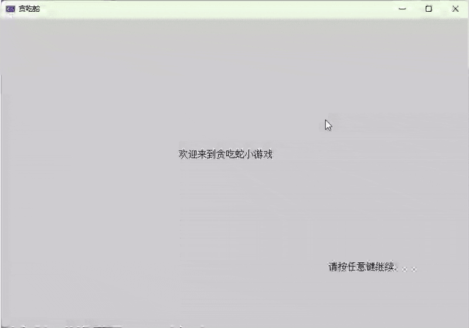
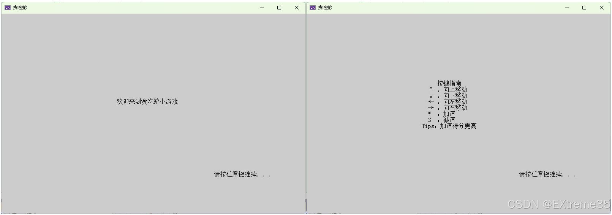
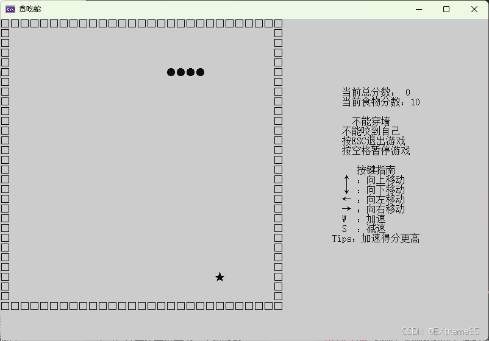
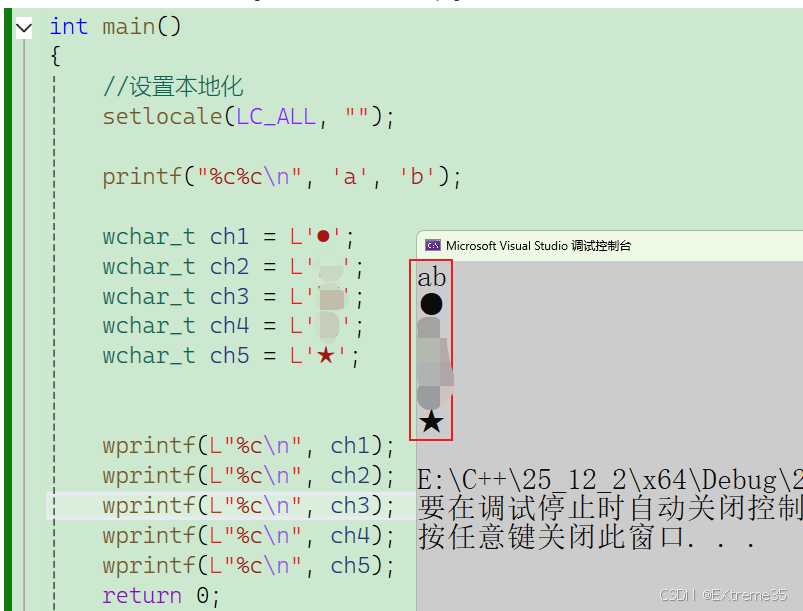
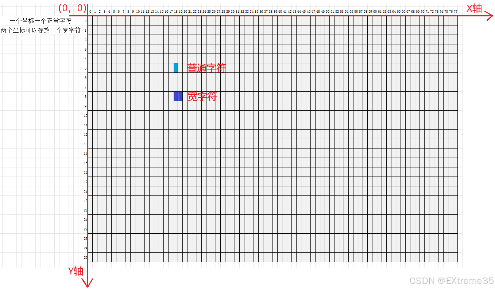
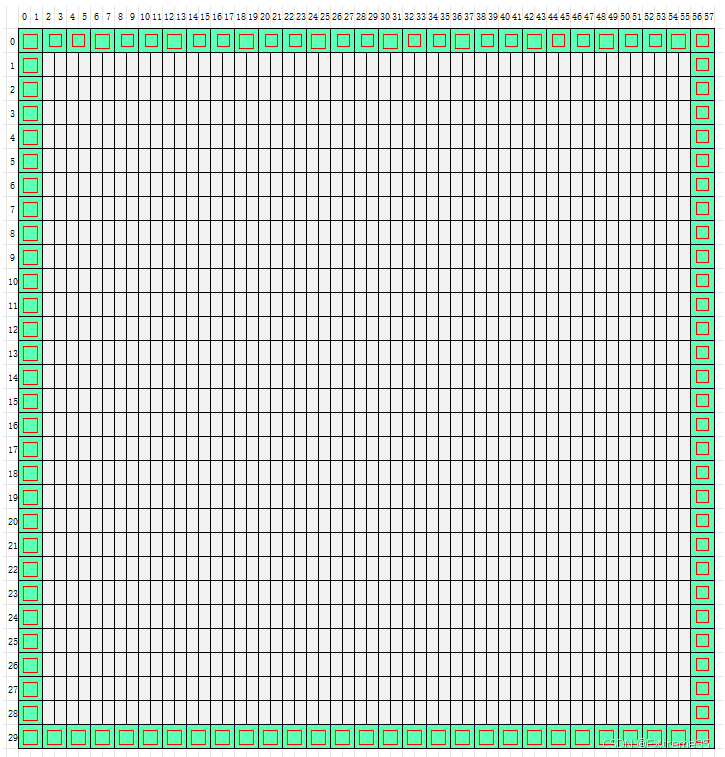
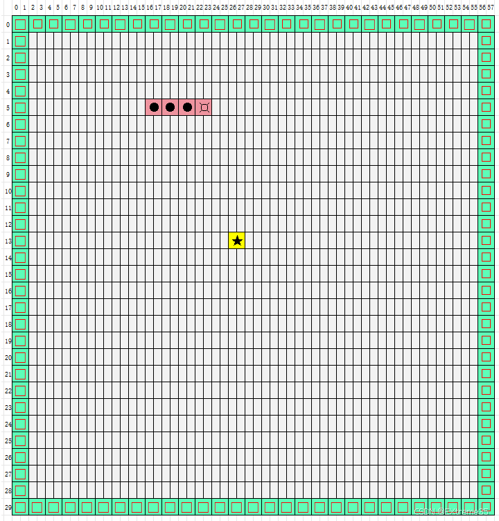
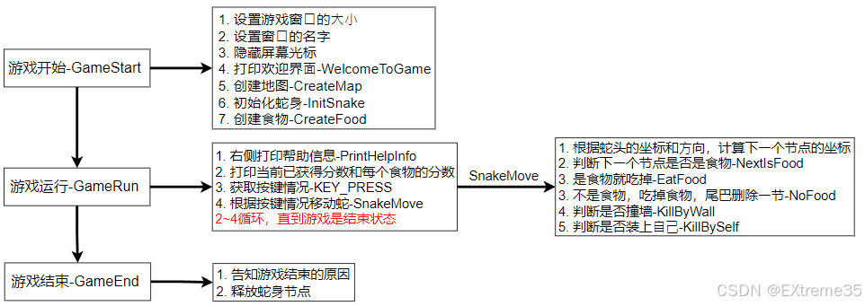
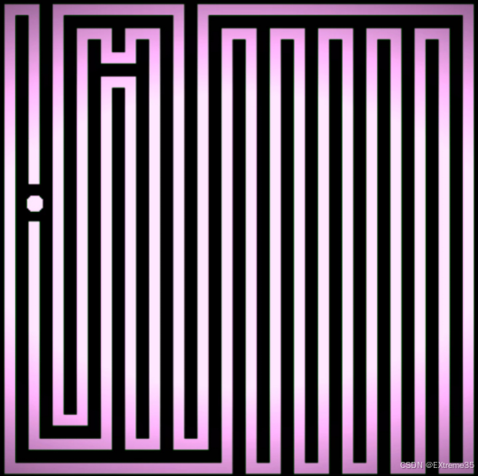

# 一、游戏演示与界面设计
## 1.1 成果演示

从这个成果预览我们可以看出，这个小游戏不仅有刚开始的**欢迎页面**，还有给用户交互的**键盘提示页面**，还包括**游戏的边界框**，**游戏得分**，以及蛇、食物、加速减速等。

那这几个页面我们需要全部实现，接下来就对每个页面实现进行拆解。
## 1.2 游戏界面分解

我们的贪吃蛇游戏界面主要由以下几个部分构成：

  * **欢迎界面和操作指南：**
    在游戏开始前，`WelcomeToGame` 函数会打印出欢迎信息和详细的**按键指南**（↑, ↓, ←, → 移动；W 加速；S 减速；ESC 退出）。
  * **主游戏界面布局：**
    `CreateMap` 函数绘制了游戏的边框（`WALL` 字符 `L'□'`）。蛇身（`BODY` 字符 `L'●'`）和食物（`FOOD` 字符 `L'★'`）在边界内部移动。
  * **信息面板展示：**
    在游戏区域的右侧，实时显示游戏的**当前总分数**  和**当前食物分数** ，以及操作提示。

### 1.2.1 欢迎界面和操作指南

在这个页面我们发现就是一些信息打印，那么现在最重要的也就是**设置光标**，然后输出就可以了。（细心的可以发现光标也已经隐藏了哦！)

这里为了便于后续设置光标位置和游戏边界，那就统一将我们的操作界面设置为一个大小，那么后续也就不回出现乱码的情况了。
```c
	//0.先设置窗口大小，后光标隐藏
	system("mode con cols=100 lines=33");
	system("title 贪吃蛇");
	HANDLE houtput = GetStdHandle(STD_OUTPUT_HANDLE);
	CONSOLE_CURSOR_INFO cursor_info = { 0 };
	GetConsoleCursorInfo(houtput, &cursor_info);  //获取控制台光标信息
	cursor_info.bVisible = false;                 //隐藏控制台光标
	SetConsoleCursorInfo(houtput, &cursor_info);  //设置控制台光标状态
```
这里我们将大小确定好之后，光标也已经进行隐藏了，那只需要大概找到屏幕正中间位置就可以开始**打印信息**了。这里可以一点一点去试试，不难，一会就好了，至于这里为啥长和宽比例如此离谱，请**耐心往下读！！！**

这里有个小细节，那就是切换界面时，需要让用户自己操作，那就进行一个`system("pause");`暂停操作。前一个界面会影响第二个界面的观感，那就进行一次`system("cls");`清屏操作。

这里给出伪码，部分可能看不懂，别着急，往下接着看：
```c
void WelcomeToGame()
{
	SetPos(38, 14);//注意 第一个坐标是列，不是行
	wprintf(L"欢迎来到贪吃蛇小游戏\n");
	SetPos(70, 26);//按任意键继续信息的位置
	system("pause");//切换屏幕
	system("cls");//清理屏幕

	SetPos(43, 11);
	wprintf(L"按键指南\n");
    ......

	SetPos(70, 26);//按任意键继续信息的位置
	system("pause");//切换屏幕
	system("cls");//清理屏幕
}
```
### 1.2.2 主游戏界面布局

很明显这个界面信息多的就不是一星半点了，别着急，一步一步来，首先最明显就是这一圈的框框，那这到底是啥，这是咋打印的？

在游戏地图上，我们打印墙体使⽤**宽字符：□**，打印蛇使⽤**宽字符●**，打印⻝物使⽤**宽字符★**普通的字符是占⼀个字节的，这类**宽字符是占⽤2个字节**。

>这⾥再简单的讲⼀下C语⾔的国际化特性相关的知识，过去C语⾔并不适合⾮英语国家（地区）使⽤。C语⾔最初假定字符都是但⾃⼰的。但是这些假定并不是在世界的任何地⽅都适⽤。C语⾔字符默认是采⽤ASCII编码的，ASCII字符集采⽤的是单字节编码，且只使⽤了单字节中的低7位，最⾼位是没有使⽤的，可表⽰为0xxxxxxxx；可以看到，ASCII字符集共包含128个字符，在英语国家中，128个字符是基本够⽤的，但是，在其他国家语⾔中，⽐如，在法语中，字⺟上⽅有注⾳符号，它就⽆法⽤ ASCII 码表⽰。于是，⼀些欧洲国家就决定，利⽤字节中闲置的最⾼位编⼊新的符号。⽐如，法语中的é的编码为130（⼆进制10000010）。这样⼀来，这些欧洲国家使⽤的编码体系，可以表⽰最多256个符号。但是，这⾥⼜出现了新的问题。不同的国家有不同的字⺟，因此，哪怕它们都使⽤256个符号的编码⽅式，代表的字⺟却不⼀样。⽐如，130在法语编码中代表了é，在希伯来语编码中却代表了字⺟Gimel ，在俄语编码中⼜会代表另⼀个符号。但是不管怎样，所有这些编码⽅式中，0--127表⽰的符号是⼀样的，不⼀样的只是128--255的这⼀段。⾄于亚洲国家的⽂字，使⽤的符号就更多了，汉字就多达10万左右。⼀个字节只能表⽰256种符号，肯定是不够的，就必须使⽤多个字节表达⼀个符号。⽐如，简体中⽂常⻅的编码⽅式是 GB2312，使⽤两个字节表⽰⼀个汉字，所以理论上最多可以表⽰ 256 x 256 = 65536 个符号。

>后来为了使C语⾔适应国际化，C语⾔的标准中不断加⼊了国际化的⽀持。⽐如：加⼊和宽字符的类型wchar_t 和宽字符的输⼊和输出函数，加⼊和<locale.h>头⽂件，其中提供了允许程序员针对特定地区（通常是国家或者说某种特定语⾔的地理区域）调整程序⾏为的函数。

**1、<local.h>本地化**
<locale.h>提供的函数⽤于控制C标准库中对于不同的地区会产⽣不⼀样⾏为的部分。在标准可以中，依赖地区的部分有以下⼏项：

- 数字量的格式
- 货币量的格式
- 字符集
- ⽇期和时间的表⽰形式

**2、类项**
通过修改地区，程序可以改变它的⾏为来适应世界的不同区域。但地区的改变可能会影响库的许多部分，其中⼀部分可能是我们不希望修改的。所以C语⾔⽀持针对不同的类项进⾏修改，下⾯的⼀个宏，指定⼀个类项：

- `LC_COLLATE`：影响字符串比较函数`strcoll()`和`strxfrm()`。
- `LC_CTYPE`：影响字符处理函数的行为。
- `LC_MONETARY`：影响货币格式。
- `LC_NUMERIC`：影响`printf()`的数字格式。
- `LC_TIME`：影响时间格式`strftime()`和`wcsftime()`。
- `LC_ALL` - 针对所有类项修改，将以上所有类别设置为给定的语言环境。

**3、setlocale函数**

```c
char* setlocale (int category, const char* locale);
```
`setlocale 函数`⽤于修改当前地区，可以针对⼀个类项修改，也可以针对所有类项。
`setlocale` 的第⼀个参数可以是前⾯说明的类项中的⼀个，那么每次只会影响⼀个类项，如果第⼀个参数是`LC_ALL`，就会**影响所有的类项**。
C标准给第⼆个参数仅定义了**2种可能取值**：`C`（**正常模式**）和 ` `（**本地环境**）。
在任意程序执⾏开始，都会隐藏式执⾏调⽤:
```c
setlocale(LC_ALL, "C");
```
当地区设置为"C"时，库函数按正常⽅式执⾏，⼩数点是⼀个点。

当程序运⾏起来后想**改变地区**，就**只能显⽰调⽤setlocale函数**。⽤`" "`作为第2个参数，调⽤**setlocale函数**就可以切换到本地模式，这种模式下程序会**适应本地环境**。⽐如：切换到我们的本地模式后就⽀持宽字符（汉字）的输出等。

```c
setlocale(LC_ALL, " ");//切换到本地环境
```
`setlocale`的返回值是一个字符串指针，表示已经设置好的格式。如果调用失败，则返回空指针`NULL`。
`setlocale()`可以用来查询当前地区，此时第二个参数设置为`NULL`就好了。

可以得到当调用 `setlocale(LC_ALL, NULL)` 查询当前设置，或在程序启动后未做任何设置时，生效的就是这个默认环境。它的核心特征是：

- **字符集**：基于 **ASCII**（或非常简单的字符集）。
- **格式化规则**：
  - **数字**：小数点使用点号 `.`。
  - **时间/日期格式**：遵循 **C/POSIX 标准格式**（例如 `%a %b %d %H:%M:%S %Y`）。
  - **货币符号**：通常只有基本的美元符号 `$`，没有本地化格式。
  - **字符串比较（排序）**：严格基于 **ASCII 码值**（例如 `'Z'` 排在 `'a'` 前面）。

当调用 `“”` 空字符串 ：是程序主动“入乡随俗”，去适应操作系统用户所在的语言和文化环境。也就是`CHINA`。

#### 宽字符的打印
那如果想在屏幕上打印宽字符，怎么打印呢？
宽字符的字面量必须加上前缀`L`，否则C语言会把字面量当作窄字符类型处理。宽字符的打印不使用`printf()`，而是`wprintf()`。
- 前缀`L`在单引号前面，表示宽字符，对应`wprintf()`的占位符为`%lc`；
- 前缀`L`在双引号前面，表示宽字符串，对应`wprintf()`的占位符为`%ls`；
- 格式串前面也要加上前缀`L`。


我的名字我就码住了，现在根据结果可以看到**一个宽字符占到两个字节**。

#### 游戏边界的打印
那实际上在我们的**终端**上也就是**这个页面**（假设我标出边框的是终端界面）：

那么我们现在想在终端上实现一个**30行，58列**的棋盘（行和列可以根据自己喜好修改)，再围绕地图画出墙，就是如下效果：

这时候最难的也就是算这个坐标，细心设置好光标，然后打印就好了。

#### 蛇和食物的打印
现在就开始创建初始蛇的长度和食物的位置，这里我们还是固定一下蛇的初始位置好一点，免得随机在墙边，来不及反应就撞上去了，体验感不好，这里唯一注意的也就是蛇、食物、边界的这些宽字符，别设置一样的就好了。

到这里，这些界面就已经全部设置好了，剩下的靠右那些提示和打印分数，只要定位光标，直接打印就好了，没什么需要特别注意的。

## 1.3 数据结构设计

贪吃蛇最核心的就是对**蛇身**的表示，我们选择使用**单向链表**，因为蛇的移动是典型的头部插入、尾部删除操作。

  * **链表节点的设计：**
    每个节点代表蛇身的一个部分，存储其在屏幕上的坐标以及指向下一个节点的指针。
    ```c
    typedef struct SnakeNode {
        int x; // 坐标X（列）
        int y; // 坐标Y（行）
        struct SnakeNode* next; // 下一个节点指针
    }SnakeNode, *pSnakeNode; 
    ```
  * **`Snake` 结构体详解：**
    `Snake` 结构体是整个游戏的**上下文**，它包含了游戏的所有状态信息。
    ```c
	typedef struct Snake
	{
		pSnakeNode _pSnake;            //指向蛇头的指针
		pSnakeNode _pFood;             //指食物节点的指针
		enum DIRECTION _dir;           //蛇的方向
		enum GAME_STATUS _status;      //游戏状态
		int _food_weight;              //一个食物的分数
		int _score;                    //游戏总分数
		int _sleep_time;               //休息时间，时间越短速度越快，时间越长速度越快
	}Snake,* pSnake;
    ```
  * **枚举类型定义：**
    我们使用枚举 (`enum`) 来清晰地定义蛇的**方向** (`DIRECTION`) 和游戏的**状态** (`GAME_STATUS`)。
	```c
	//蛇行进的方向
	enum DIRECTION
	{
		UP = 1,
		DOWN,
		LEFT,
		RIGHT
	};
	//蛇的状态：正常、撞墙、撞自己、esc退出
	enum GAME_STATUS
	{
		OK,             //正常
		KILL_BY_WALL,   //撞墙
		KILL_BY_SELF,   //撞到自己
		END_NORMAL      //正常退出
	};
	```
## 1.4 操作说明
  * **蛇的移动过程：**
    蛇每走一步，就相当于在**头部方向**多了一个新节点，并在**尾部**少了一个旧节点，从而实现“移动”的视觉效果。
  * **食物生成和得分机制：**
    食物在非墙壁、非蛇身的位置随机生成。当蛇头移动到食物位置时，它会**吃掉**食物，然后长度会变长，总分数增加，并在地图上立即重新生成一个新的食物。
  * **加速减速效果：**
    通过按 **W** 和 **S** 键，可以动态调整游戏的速度，这通过改变 `_sleep_time` 参数来实现。`_sleep_time` 越短，蛇移动越快，同时食物分数 (`_food_weight`) 也会相应变化，实现了**加速得分更高**的Tips。
## 1.5 游戏流程设计


# 二、核心逻辑实现分析
这里就是一些核心函数的实现了，就不一一展开了，只展示一些核心的内容，完了给出我的源码链接（文末），有兴趣的可以自己去拿一下。
## 2.1 创建地图
创建地图就是将墙打印出来，因为是宽字符打印，所有使⽤wprintf函数，打印格式串前使⽤L
打印地图的关键是要算好坐标，才能在想要的位置打印墙体。
墙体打印的宽字符：
```c
#define WALL L'□'
```
创建地图函数`CreateMap`
```c
void CreateMap()
{
	//上 58列 宽字符占2字节
	for (int i = 0; i < 29; i++)
		wprintf(L"%lc", WALL);
	
	//下 58列 宽字符占2字节
	SetPos(0, 29);
	for (int i = 0; i < 29; i++)
		wprintf(L"%lc", WALL);

	//左
	for (int i = 1; i < 29; i++)
	{
		SetPos(0, i);
		wprintf(L"%lc", WALL);
	}

	//右
	for (int i = 1; i < 29; i++)
	{
		SetPos(56, i);
		wprintf(L"%lc", WALL);
	}
}
```
这里就需要根据个人定义的边界条件具体判断了，我定义的是30行。
## 2.2 初始化蛇身
蛇最开始长度为4节，每节对应链表的⼀个节点，蛇⾝的每⼀个节点都有⾃⼰的坐标。创建4个节点，然后将每个节点存放在链表中进⾏管理。创建完蛇⾝后，将蛇的每⼀节打印在屏幕上。（这里我定义的是四节，你可以自己改）

再设置当前游戏的状态，蛇移动的速度，默认的⽅向，初始成绩，蛇的状态，每个⻝物的分数。

蛇⾝打印的宽字符：`#define BODY L'●'`

初始化蛇⾝函数：`InitSnake`
```c
void InitSnake(pSnake ps)
{
	pSnakeNode cur = NULL;
	for (int i = 0; i <= 3; i++)
	{
		cur = (pSnakeNode)malloc(sizeof(SnakeNode));
		//创建失败
		if (cur == NULL)
		{
			perror("malloc");
			exit(-1);
		}
		//node串起来
		cur->next = NULL;
		cur->x = POS_X + 2 * i;
		cur->y = POS_Y;
		//头插法
		if (ps->_pSnake == NULL)
			ps->_pSnake = cur;
		else
		{
			//始终往蛇头插入
			cur->next = ps->_pSnake;
			ps->_pSnake = cur;
		}
	}
	//打印蛇
	cur = ps->_pSnake;
	while (cur)
	{
		SetPos(cur->x, cur->y);
		wprintf(L"%lc", BODY);
		cur = cur->next;
	}
	ps->_dir = RIGHT;//默认向右
	ps->_score = 0;
	ps->_food_weight = 10;
	ps->_sleep_time = 200;//毫秒
	ps->_status = OK;
}
```
我们使用**头插法**创建初始蛇身（例如4个节点）。初始时，蛇头位于链表的第一个节点。

## 2.3 创建食物

先随机⽣成⻝物的坐标
- x坐标**必须是2的倍数**。
- ⻝物的坐标**不能**和蛇⾝每个节点的坐标**重复**。

这里说详细一些，**为什么必须是2的倍数呢？**
因为每一个蛇头都占据1个宽字符，两个字节，后续需要用食物坐标和蛇头坐标进行判断，判断是否吃到食物，那如果不是2的倍数，蛇头永远到不了这个食物的坐标，这游戏也就没法继续下去了。
**为什么不能重复呢？** 重复了你连食物都找不到，那还玩啥？
```c
void CreateFood(pSnake ps)
{
	int x = 0;
	int y = 0;
	//食物坐标
	//x 2的倍数 2-54
	//y 2的倍数 1-28
again:
	do
	{
		//食物坐标不能出内场范围
		x = rand() % 53 + 2;
		y = rand() % 28 + 1;
	} while (x%2!=0);
	//x和y不能和蛇身蛇头坐标一样
	pSnakeNode cur = ps->_pSnake;
	while (cur)
	{
		if (x == cur->x && y == cur->y)
		{
			goto again;
		}
		cur = cur->next;
	}
	//创建食物节点
	pSnakeNode pFood = (pSnakeNode)malloc(sizeof(SnakeNode));
	if (pFood == NULL)
	{
		perror("malloc");
		exit(-1);
	}
	pFood->x = x;
	pFood->y = y;
	pFood->next = NULL;
	SetPos(pFood->x, pFood->y);
	wprintf(L"%lc", FOOD);
	ps->_pFood = pFood;
}
```

## 2.4 游戏状态
游戏运行期间，右侧打印帮助信息提示玩家，根据游戏状态检查游戏是否继续，如果是状态是`OK`，**游戏继续**，**否则游戏结束**。如果游戏继续，就是检测按键情况，确定蛇**下⼀步的⽅向**，或者是否加速减速，是否暂停或者退出游戏。确定了蛇的⽅向和速度，蛇就可以移动了。

这里最重要的就是把交互做好，也就是键盘响应，很多代码都是一样的，可以定义宏进行简化代码，完整代码就只给个伪码了。
```c
void GameRun(pSnake ps)
{
	do
	{
		//打印总分数和食物分值
		SetPos(70, 7);
		printf("当前总分数：%2d\n",ps->_score);
		SetPos(70, 8);
		printf("当前食物分数：%2d\n", ps->_food_weight);

		if (KEY_PRESS(VK_UP) && ps->_dir != DOWN)
			ps->_dir = UP;
		
	    //这里省略了自定义的某些键盘代码
	    
		else if (KEY_PRESS(0x57))
		{
			//加速
			if (ps->_sleep_time > 80)
			{
				ps->_food_weight += 2;
				ps->_sleep_time -= 30;
			}
		}
		else if (KEY_PRESS(0x53))
		{
			//减速
			if (ps->_food_weight > 2)
			{
				ps->_food_weight -= 2;
				ps->_sleep_time += 30;
			}
		}
		//蛇走一步
		SnakeMove(ps);
		Sleep(ps->_sleep_time);
	} while (ps->_status==OK);
}
```
这里加速减速，也实现的没有那么复杂，就是将沉睡时间加长或者减少，但也不能无限制，在范围内就可以。
## 2.5 蛇的移动
 **蛇的移动算法 (`SnakeMove`)：** 这是游戏的核心逻辑。
   1.  根据当前方向 (`_dir`)，计算出下一个位置的坐标，并创建一个**新节点** `pNextNode`。
   2.  **判断下一个位置是否为食物** (`NextIsFood`)。
         * **如果是食物 (`EatFood`)：** 将 `_pFood` 节点直接连接到蛇头（**头插**），让它成为新的蛇头。**不进行尾部删除**，从而实现蛇身变长。然后重新创建食物。
         * **如果不是食物 (`NoFood`)：** 将 `pNextNode` 连接到蛇头（**头插**）。找到链表的**倒数第二个节点**，释放它的 `next` 节点（即**删除旧尾巴**），并将其 `next` 置为 `NULL`。

```c
void SnakeMove(pSnake ps)
{
	//创建一个结点，表示蛇即将到的下一个节点
	pSnakeNode pNextNode = (pSnakeNode)malloc(sizeof(SnakeNode));
	if (pNextNode == NULL)
	{
		perror("SnakeMove()::malloc()");
		return;
	}
	//这里需要修改 保持头结点不变 ，然后更新位置 接着打印
	switch (ps->_dir)
	{
	case UP:
		pNextNode->x = ps->_pSnake->x;
		pNextNode->y = ps->_pSnake->y - 1;
		break;
	case DOWN:
		pNextNode->x = ps->_pSnake->x;
		pNextNode->y = ps->_pSnake->y + 1;
		break;
	case LEFT:
		pNextNode->x = ps->_pSnake->x - 2;
		pNextNode->y = ps->_pSnake->y;
		break;
	case RIGHT:
		pNextNode->x = ps->_pSnake->x + 2;
		pNextNode->y = ps->_pSnake->y;
		break;
	}
	//下一位置是不是食物
	if (NextIsFood(pNextNode, ps))
		//是食物
		EatFood(pNextNode, ps);
	else
		//不是食物
		NoFood(pNextNode, ps);
	//检测蛇是否撞墙
	KillByWall(ps);
	//检测蛇是否撞到自己
	KillBySelf(ps);
}
```
### 2.5.1 `EatFood` 函数详解
`EatFood` 函数处理蛇吃到食物的逻辑，其核心操作是让蛇身**增长**并更新游戏状态。

首先，它通过**头插法**将食物节点 (`ps->_pFood`) 插入到蛇头 (`ps->_pSnake`) 的前面，使食物节点成为新的蛇头，从而实现蛇身的增长，因为这次移动没有移除尾部节点。接着，它释放了原本为下一个位置预分配的临时节点 `pn`，避免内存泄漏。

随后，函数从新的蛇头开始遍历整个蛇身链表，并在控制台上重新打印蛇身的每个节点，确保蛇身的新状态在屏幕上正确显示 (`wprintf(L"%lc", BODY)`)。

最后，它根据当前食物的分值 (`ps->_food_weight`) 更新总得分 (`ps->_score`)，并调用 `CreateFood(ps)` 在地图上生成一个新的食物.
```c
void EatFood(pSnakeNode pn, pSnake ps)
{
	//头插法
	ps->_pFood->next = ps->_pSnake;
	ps->_pSnake = ps->_pFood;
	//释放下一个位置的节点
	free(pn);
	pn = NULL;
	pSnakeNode cur = ps->_pSnake;
	//打印蛇
	while (cur)
	{
		SetPos(cur->x, cur->y);
		wprintf(L"%lc", BODY);
		cur = cur->next;
	}
	ps->_score += ps->_food_weight;
	//重新创建食物
	CreateFood(ps);
}
```
### 2.5.2 `NoFood` 函数详解（未吃到食物）

当蛇移动到的下一个位置不是食物时，`NoFood` 函数执行蛇身**平移**逻辑：

1. **头插法**将代表新位置的节点 `pn` 连接到蛇头 (`ps->_pSnake`) 的前面，使其成为新的蛇头；
2. 遍历链表，找到**倒数第二个节点** (`cur`)，并在遍历过程中重新打印除尾部外的所有蛇身节点；
3. 函数定位到最后一个节点（旧尾巴），先在屏幕上将其位置打印成两个空格 (`"  "`) 来清除旧尾巴的痕迹，然后在内存中释放该节点 (`free(cur->next)`)；
4. 将倒数第二个节点的 `next` 指针设置为 `NULL` (`cur->next = NULL`)，正式截断链表，使蛇的长度保持不变，完成一步移动。

```c
void NoFood(pSnakeNode pn, pSnake ps)
{
	//头插法
	pn->next = ps->_pSnake;
	ps->_pSnake = pn;
	pSnakeNode cur = ps->_pSnake;
	while (cur->next->next != NULL)
	{
		SetPos(cur->x, cur->y);
		wprintf(L"%lc", BODY);
		cur = cur->next;
	}
	//把最后一个结点打印成空格
	SetPos(cur->next->x, cur->next->y);
	printf("  ");
	//释放最后一个结点
	free(cur->next);
	//把倒数第二个节点的地址置为NULL
	cur->next = NULL;
}
```
这里打印空格的目的是为了在控制台屏幕上**清除蛇身旧尾巴的痕迹**，**实现蛇的平滑移动**效果。
### 2.6 碰撞检测函数

`KillByWall`、`KillBySelf` 这两个函数共同实现了贪吃蛇游戏的**碰撞检测**机制，用于判断游戏是否结束。

`KillByWall` 函数检查蛇头 (`ps->_pSnake`) 的坐标是否触及地图边界（X坐标为 $0$ 或 $56$，Y坐标为 $0$ 或 $28$）(这里就是判断边界，如果你的边界不是我的这个大小，自己修改一下就好了)，如果触墙，则立即将游戏状态 `ps->_status` 设置为 `KILL_BY_WALL`。

`KillBySelf` 函数则通过遍历蛇头后面的所有蛇身节点 (`pSnakeNode cur = ps->_pSnake->next;`)，检查是否有任何一个节点 (`cur`) 的坐标与当前蛇头坐标完全重合；如果发生重合（即蛇头咬到自己），则将游戏状态 `ps->_status` 设置为 `KILL_BY_SELF`。

一旦任一函数检测到碰撞，就会设置相应的状态，导致 `GameRun` 函数中的循环终止，游戏结束。

```c
void KillByWall(pSnake ps)
{
	if (ps->_pSnake->x == 0 || ps->_pSnake->x == 56 || ps->_pSnake->y == 0 || ps->_pSnake->y == 28)
	{
		ps->_status = KILL_BY_WALL;
	}
}
```
```c
void KillBySelf(pSnake ps)
{
	pSnakeNode cur = ps->_pSnake->next;
	while (cur)
	{
		if (cur->x == ps->_pSnake->x && cur->y == ps->_pSnake->y)
		{
			ps->_status = KILL_BY_SELF;
			break;
		}
		cur = cur->next;
	}
}
```
每次蛇移动都要检测是否结束哦！
## 2.6 游戏结束
游戏状态不再是OK（游戏继续）的时候，要告知游戏结束的原因，然后直接退出？

**不不不！！！**

你的蛇是链表啊！链表节点是动态申请的啊，它在**堆**上，直接退出只把**栈区**的内存空间归还给操作系统，你还得干啥呢？对喽，把**节点释放**了，把内存还给人家，有借有还，再借不难啊！

```c
void GameEnd(pSnake ps)
{
	SetPos(30, 14);
	switch (ps->_status)
	{
	case END_NORMAL:
		wprintf(L"主动结束游戏\n");
		break;
	case KILL_BY_WALL:
		wprintf(L"撞到墙上，游戏结束\n");
		break;
	case KILL_BY_SELF:
		wprintf(L"撞到了自己，游戏结束\n");
		break;
	}
	//释放蛇身的链表
	pSnakeNode cur = ps->_pSnake;
	while (cur)
	{
		pSnakeNode del = cur;
		cur = cur->next;
		free(del);
	}
}
```


# 三、总结

这里没写判断获胜的条件，因为我们当前这个空间有限，所以从概率上来讲，是由获胜的可能的，类似于这样：

这里呢，就当作一个小优化思路吧，还可以把蛇头用不一样的宽字符，每次都在蛇尾新增节点，这样视觉效果会更好！


通过实现C语言贪吃蛇小游戏，不仅将理论知识转化为实际代码，更深入理解了几个关键点：

1.  **链表**是处理动态、顺序数据的理想结构，其头部插入和尾部删除的特性完美契合了蛇的移动需求。
2.  **Win32 API**是控制台程序交互的关键，它让我们能够突破标准C库的限制，实现对光标、窗口和键盘的精细控制。
3. 正确的内存管理至关重要，特别是对链表的动态操作。
	  * **链表的动态内存分配：** 无论是初始化蛇身 (`InitSnake`)、创建食物 (`CreateFood`)、还是蛇移动时创建新的头节点 (`SnakeMove`)，都需要使用 `malloc` 进行动态内存分配，确保每次操作都有足够的空间。
	  * **节点添加和删除：** 在 `NoFood` 中，我们通过 `free(cur->next)` 释放了尾部节点，防止内存泄漏。
	  * **游戏结束时的资源释放 (`GameEnd`)：** 无论游戏是正常退出还是失败，都必须调用 `GameEnd` 函数。该函数会**遍历整个蛇身链表**，逐个释放所有动态分配的节点，彻底清理占用的内存。


如果你对这个感兴趣，可以尝试添加更多功能，例如墙体穿透、不同颜色区分蛇头与蛇身，或实现多种不同的食物类型！

希望这篇博客能帮助你更好地理解和掌握链表与Win32 API的知识！

# 四、全部源码

## snake.h

```c
#pragma once

#include<locale.h>
#include<stdio.h>
#include<stdlib.h>
#include<windows.h>
#include<stdbool.h>
#include<time.h>

//类型的声明
#define POS_X 16
#define POS_Y 5

#define WALL L'□'
#define BODY L'●'
#define HEAD L'¤'
#define FOOD L'★'

//蛇行进的方向
enum DIRECTION
{
	UP = 1,
	DOWN,
	LEFT,
	RIGHT
};

//蛇的状态
//正常、撞墙、撞自己、esc退出
enum GAME_STATUS
{
	OK,             //正常
	KILL_BY_WALL,   //撞墙
	KILL_BY_SELF,   //撞到自己
	END_NORMAL      //正常退出
};

//蛇身节点类型
typedef struct SnakeNode
{
	//坐标
	int x;
	int y;
	//下一个节点指针
	struct SnakeNode* next;
}SnakeNode,* pSnakeNode;//声明蛇头指针

//贪吃蛇
typedef struct Snake
{
	pSnakeNode _pSnake;            //指向蛇头的指针
	pSnakeNode _pFood;             //指食物节点的指针
	enum DIRECTION _dir;           //蛇的方向
	enum GAME_STATUS _status;      //游戏状态
	int _food_weight;              //一个食物的分数
	int _score;                    //游戏总分数
	int _sleep_time;               //休息时间，时间越短速度越快，时间越长速度越快
}Snake,* pSnake;

//函数的声明
//游戏初始化
void GameStart(pSnake ps);
//欢迎界面的打印
void WelcomeToGame();
//创建地图
void CreateMap();
//初始化蛇身
void InitSnake(pSnake ps);
//创建食物
void CreateFood(pSnake ps);

//游戏开始
void GameRun(pSnake ps);

//蛇移动逻辑
void SnakeMove(pSnake ps);

//下个坐标是否是食物
int NextIsFood(pSnakeNode pn, pSnake ps);

//是食物就吃掉食物
void EatFood(pSnakeNode pn, pSnake ps);

//不是食物
void NoFood(pSnakeNode pn, pSnake ps);

//检测蛇是否撞墙
void KillByWall(pSnake ps);

//检测蛇是否撞到自己
void KillBySelf(pSnake ps);

//游戏善后的工作
void GameEnd(pSnake ps);
```

## snake.c

```c
#define _CRT_SECURE_NO_WARNINGS 1

#include"snake.h"

void SetPos(short x, short y)
{
	//拿到标准输出设备句柄
	HANDLE houtput = GetStdHandle(STD_OUTPUT_HANDLE);
	//定义光标位置
	COORD pos = { x,y };
	//设置光标位置
	SetConsoleCursorPosition(houtput, pos);
}

void WelcomeToGame()
{
	SetPos(38, 14);//注意 第一个坐标是列，不是行
	wprintf(L"欢迎来到贪吃蛇小游戏\n");
	SetPos(70, 26);//按任意键继续信息的位置
	system("pause");
	system("cls");//清理屏幕

	SetPos(43, 11);
	wprintf(L"按键指南\n");
	SetPos(40, 12);
	wprintf(L"↑ ：向上移动\n");
	SetPos(40, 13);
	wprintf(L"↓ ：向下移动\n");
	SetPos(40, 14);
	wprintf(L"← ：向左移动\n");
	SetPos(40, 15);
	wprintf(L"→ ：向右移动\n");
	SetPos(40, 16);
	wprintf(L"W  ：加速\n");
	SetPos(40, 17);
	wprintf(L"S  ：减速\n");
	SetPos(38, 18);
	wprintf(L"Tips：加速得分更高\n");

	SetPos(70, 26);//按任意键继续信息的位置
	system("pause");
	system("cls");//清理屏幕
}

void CreateMap()
{
	//上 58列 宽字符占2字节
	for (int i = 0; i < 29; i++)
		wprintf(L"%lc", WALL);
	
	//下 58列 宽字符占2字节
	SetPos(0, 29);
	for (int i = 0; i < 29; i++)
		wprintf(L"%lc", WALL);

	//左
	for (int i = 1; i < 29; i++)
	{
		SetPos(0, i);
		wprintf(L"%lc", WALL);
	}

	//右
	for (int i = 1; i < 29; i++)
	{
		SetPos(56, i);
		wprintf(L"%lc", WALL);
	}
}

void InitSnake(pSnake ps)
{
	pSnakeNode cur = NULL;

	for (int i = 0; i <= 3; i++)
	{
		cur = (pSnakeNode)malloc(sizeof(SnakeNode));
		//创建失败
		if (cur == NULL)
		{
			perror("malloc");
			exit(-1);
		}
		//node串起来
		cur->next = NULL;
		cur->x = POS_X + 2 * i;
		cur->y = POS_Y;
		
		//头插法
		if (ps->_pSnake == NULL)
		{
			ps->_pSnake = cur;
		}
		else
		{
			//始终往蛇头插入
			cur->next = ps->_pSnake;
			ps->_pSnake = cur;
		}
	}

	//打印蛇
	cur = ps->_pSnake;
	while (cur)
	{
		SetPos(cur->x, cur->y);
		wprintf(L"%lc", BODY);
		cur = cur->next;
	}

	ps->_dir = RIGHT;//默认向右
	ps->_score = 0;
	ps->_food_weight = 10;
	ps->_sleep_time = 200;//毫秒
	ps->_status = OK;

}

void CreateFood(pSnake ps)
{
	int x = 0;
	int y = 0;
	//食物坐标
	//x 2的倍数 2-54
	//y 2的倍数 1-28
again:
	do
	{
		//食物坐标不能出内场范围
		x = rand() % 53 + 2;
		y = rand() % 28 + 1;
	} while (x%2!=0);
	//x和y不能和蛇身蛇头坐标一样
	pSnakeNode cur = ps->_pSnake;
	while (cur)
	{
		if (x == cur->x && y == cur->y)
		{
			goto again;
		}
		cur = cur->next;
	}

	//创建食物节点
	pSnakeNode pFood = (pSnakeNode)malloc(sizeof(SnakeNode));
	if (pFood == NULL)
	{
		perror("malloc");
		exit(-1);
	}
	pFood->x = x;
	pFood->y = y;
	pFood->next = NULL;

	SetPos(pFood->x, pFood->y);
	wprintf(L"%lc", FOOD);

	ps->_pFood = pFood;

}

void GameStart(pSnake ps)
{
	//0.先设置窗口大小，后光标隐藏
	system("mode con cols=100 lines=33");
	system("title 贪吃蛇");
	HANDLE houtput = GetStdHandle(STD_OUTPUT_HANDLE);
	CONSOLE_CURSOR_INFO cursor_info = { 0 };
	GetConsoleCursorInfo(houtput, &cursor_info);  //获取控制台光标信息
	cursor_info.bVisible = false;                 //隐藏控制台光标
	SetConsoleCursorInfo(houtput, &cursor_info);  //设置控制台光标状态
	//1.欢迎界面 功能介绍
	WelcomeToGame();
	//2.绘制地图
	CreateMap();
	//3.创建蛇
	InitSnake(ps);
	//4.创建食物
	CreateFood(ps);
}

void PrintHelpInfo()
{
	SetPos(70, 10);
	wprintf(L"  不能穿墙\n");
	SetPos(70, 11);
	wprintf(L"不能咬到自己\n");
	SetPos(70, 12);
	wprintf(L"按ESC退出游戏\n");
	SetPos(70, 13);
	wprintf(L"按空格暂停游戏\n");

	SetPos(73, 15);
	wprintf(L"按键指南\n");
	SetPos(70, 16);
	wprintf(L"↑ ：向上移动\n");
	SetPos(70, 17);
	wprintf(L"↓ ：向下移动\n");
	SetPos(70, 18);
	wprintf(L"← ：向左移动\n");
	SetPos(70, 19);
	wprintf(L"→ ：向右移动\n");
	SetPos(70, 20);
	wprintf(L"W  ：加速\n");
	SetPos(70, 21);
	wprintf(L"S  ：减速\n");
	SetPos(68, 22);
	wprintf(L"Tips：加速得分更高\n");

	//SetPos(70, 28);//按任意键继续信息的位置
	//getchar();
}

#define KEY_PRESS(vk) ((GetAsyncKeyState(vk)&1)?1:0)

void Pause()
{
	while (1)
	{
		Sleep(200);
		if (KEY_PRESS(VK_SPACE))
			break;
	}
}

int NextIsFood(pSnakeNode pn, pSnake ps)
{
	return ((ps->_pFood->x == pn->x) && (ps->_pFood->y == pn->y));
}

void EatFood(pSnakeNode pn, pSnake ps)
{
	//头插法
	ps->_pFood->next = ps->_pSnake;
	ps->_pSnake = ps->_pFood;

	//释放下一个位置的节点
	free(pn);
	pn = NULL;

	pSnakeNode cur = ps->_pSnake;
	//打印蛇
	while (cur)
	{
		SetPos(cur->x, cur->y);
		wprintf(L"%lc", BODY);
		cur = cur->next;
	}
	ps->_score += ps->_food_weight;

	//重新创建食物
	CreateFood(ps);
}

void NoFood(pSnakeNode pn, pSnake ps)
{
	//头插法
	pn->next = ps->_pSnake;
	ps->_pSnake = pn;

	pSnakeNode cur = ps->_pSnake;
	while (cur->next->next != NULL)
	{
		SetPos(cur->x, cur->y);
		wprintf(L"%lc", BODY);
		cur = cur->next;
	}

	//把最后一个结点打印成空格
	SetPos(cur->next->x, cur->next->y);
	printf("  ");

	//释放最后一个结点
	free(cur->next);

	//把倒数第二个节点的地址置为NULL
	cur->next = NULL;
}

void KillByWall(pSnake ps)
{
	if (ps->_pSnake->x == 0 || ps->_pSnake->x == 56 || ps->_pSnake->y == 0 || ps->_pSnake->y == 28)
	{
		ps->_status = KILL_BY_WALL;
	}
}

void KillBySelf(pSnake ps)
{
	pSnakeNode cur = ps->_pSnake->next;
	while (cur)
	{
		if (cur->x == ps->_pSnake->x && cur->y == ps->_pSnake->y)
		{
			ps->_status = KILL_BY_SELF;
			break;
		}
		cur = cur->next;
	}
}

void SnakeMove(pSnake ps)
{
	//创建一个结点，表示蛇即将到的下一个节点
	pSnakeNode pNextNode = (pSnakeNode)malloc(sizeof(SnakeNode));
	if (pNextNode == NULL)
	{
		perror("SnakeMove()::malloc()");
		return;
	}
	//这里需要修改 保持头结点不变 ，然后更新位置 接着打印
	switch (ps->_dir)
	{
	case UP:
		pNextNode->x = ps->_pSnake->x;
		pNextNode->y = ps->_pSnake->y - 1;
		break;
	case DOWN:
		pNextNode->x = ps->_pSnake->x;
		pNextNode->y = ps->_pSnake->y + 1;
		break;
	case LEFT:
		pNextNode->x = ps->_pSnake->x - 2;
		pNextNode->y = ps->_pSnake->y;
		break;
	case RIGHT:
		pNextNode->x = ps->_pSnake->x + 2;
		pNextNode->y = ps->_pSnake->y;
		break;
	}
	//下一位置是不是食物
	if (NextIsFood(pNextNode, ps))
	{
		//是食物
		EatFood(pNextNode, ps);
	}
	else
	{
		//不是食物
		NoFood(pNextNode, ps);
	}

	//检测蛇是否撞墙
	KillByWall(ps);
	//检测蛇是否撞到自己
	KillBySelf(ps);
}

void GameRun(pSnake ps)
{
	//打印帮助信息
	PrintHelpInfo();
	do
	{
		//打印总分数和食物分值
		SetPos(70, 7);
		printf("当前总分数：%2d\n",ps->_score);
		SetPos(70, 8);
		printf("当前食物分数：%2d\n", ps->_food_weight);

		if (KEY_PRESS(VK_UP) && ps->_dir != DOWN)
		{
			ps->_dir = UP;
		}
		else if (KEY_PRESS(VK_DOWN) && ps->_dir != UP)
		{
			ps->_dir = DOWN;
		}
		else if (KEY_PRESS(VK_LEFT) && ps->_dir != RIGHT)
		{
			ps->_dir = LEFT;
		}
		else if (KEY_PRESS(VK_RIGHT) && ps->_dir != LEFT)
		{
			ps->_dir = RIGHT;
		}
		else if (KEY_PRESS(VK_ESCAPE))
		{
			//正常退出游戏
			ps->_status = END_NORMAL;
		}
		else if (KEY_PRESS(VK_SPACE))
		{
			//暂停
			Pause();
		}
		else if (KEY_PRESS(0x57))
		{
			//加速
			if (ps->_sleep_time > 80)
			{
				ps->_food_weight += 2;
				ps->_sleep_time -= 30;
			}
		}
		else if (KEY_PRESS(0x53))
		{
			//减速
			if (ps->_food_weight > 2)
			{
				ps->_food_weight -= 2;
				ps->_sleep_time += 30;
			}
		}
		//蛇走一步
		SnakeMove(ps);
		Sleep(ps->_sleep_time);

	} while (ps->_status==OK);
}

void GameEnd(pSnake ps)
{
	SetPos(30, 14);
	switch (ps->_status)
	{
	case END_NORMAL:
		wprintf(L"主动结束游戏\n");
		break;
	case KILL_BY_WALL:
		wprintf(L"撞到墙上，游戏结束\n");
		break;
	case KILL_BY_SELF:
		wprintf(L"撞到了自己，游戏结束\n");
		break;
	}
	
	//释放蛇身的链表
	pSnakeNode cur = ps->_pSnake;
	while (cur)
	{
		pSnakeNode del = cur;
		cur = cur->next;
		free(del);
	}
}
```

## test.c

```c
#define _CRT_SECURE_NO_WARNINGS 1

#include "snake.h"

void test01()
{
	int ch = 0;
	do
	{
		system("cls");
		//创建贪吃蛇
		Snake snake = { 0 };
		//初始化游戏
		//1. 打印环境界面
		//2. 功能介绍
		//3. 绘制地图
		//4. 创建蛇
		//5. 创建食物
		//6. 设置游戏的相关信息
		GameStart(&snake);

		//运行游戏
		GameRun(&snake);
		//结束游戏 - 善后工作
		GameEnd(&snake);
		SetPos(20, 15);
		printf("再来一局吗?(Y/N):");
		ch = getchar();
		getchar();

	} while (ch == 'Y' || ch == 'y');
	SetPos(0, 29);
}

int main()
{
	//设置本地环境，也就是引入宽字符。
	setlocale(LC_ALL, "");
	//食物坐标随机
	srand((unsigned int)time(NULL));
	//测试游戏
	test01();

	return 0;
}
```


