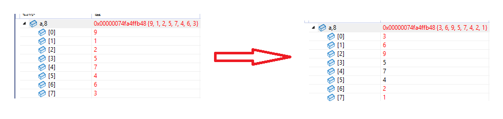
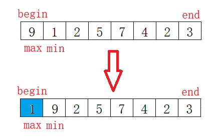

在排序算法的学习之路上，**选择排序**和**堆排序**是两座必须翻越的大山。前者是直觉的延伸，后者是数据结构的精妙运用。

选择排序是一种非常简单直观的排序算法，工作原理可以概括为“每次从未排序的队伍中，选出最优者，让它归位”。具体来说，算法在每一轮都会遍历所有还未排序的元素，从中找出最小（或最大）的一个，然后将其与未排序部分的第一个元素交换位置。这个操作能确保每一轮过后，都有一个元素被精准地放在它最终的正确位置上。接着，算法会缩小范围，在剩下的元素中重复这个“选择与交换”的过程，直到整个序列完全有序。

------

## 一、双向选择排序

### 1.1 为什么要“双向”？

传统的选择排序每次遍历只找一个最小值，效率较低。既然无论如何都要遍历一遍，为什么不顺便把最大值也找出来呢？于是便有了**双向选择排序**的思想：

- **左边放最小值**
- **右边放最大值**
- **向中间靠拢**，效率直接提升一倍。

### 1.2 核心思想：温水煮青蛙

想象你在排队，你站在队首（`begin`），你的同伴站在队尾（`end`）。

1. 在 `begin` 到 `end` 之间扫视一遍，记住最高的人（`max_pos`）和最矮的人（`min_pos`）。
2. 把最矮的人换到 `begin`。
3. 把最高的人换到 `end`。
4. `begin` 往右走一步，`end` 往左走一步，重复上述步骤。

### 1.3 实现代码

依据上述核心思想，将它转化为可执行代码如下：


```c
void SelectSort(int* a, int n)
{
    // 定义当前待排序区间的左右边界
    int begin = 0;
    int end = n - 1;
    
    // 当左右边界重合或越过时，排序完成
    while (begin < end)
    {
        // 初始时，假设当前区间的第一个元素既是最大值也是最小值
        int min_pos = begin;
        int max_pos = begin;

        // 遍历当前区间 [begin+1, end]，寻找真正的最大值和最小值的下标
        for (int i = begin + 1; i <= end; i++)
        {
            // 如果发现更大的数，更新最大值下标
            if (a[i] > a[max_pos])
                max_pos = i;
            // 如果发现更小的数，更新最小值下标
            if (a[i] < a[min_pos])
                min_pos = i;
        }

        // --- 核心交换逻辑 ---
        // 1. 先将找到的最小值换到区间的起始位置（begin）
        Swap(&(a[min_pos]), &a[begin]);
        // 2. 将找到的最大值换到区间的末尾位置（end）
        Swap(&(a[max_pos]), &a[end]);

        // --- 收缩区间 ---
        // 已经排好了两个数，左边界向右移，右边界向左移
        ++begin;
        --end;
    }
}
```
本以为到这里这个排序就算结束了，但是在某次使用时，发现了一个小`bug`。

### 1.4 详解致命的Bug

```c
int a[] = { 9,1,2,5,7,4,6,3 };
SelectSort(a, sizeof(a) / sizeof(a[0]));
```



依据调试结果，可以明显看出代码有误，于是一步一步去调试，有了这么个发现：



假设数组是`[9, 1, 2, 5, 7, 4, 2, 3]`。

- 此刻 `begin` 指向 9，`max_pos` 也是 0（指向 9）。
- 我们先交换最小值：把 1 和 9 交换。
- 数组变成了 `[1, 9, 2, 5, 7, 4, 2, 3]`。
- **危机出现**：此时 `max_pos` 依然记录的是下标 0，但下标 0 现在存的是 1！如果你直接执行交换最大值的逻辑，你会把 1 换到末尾，也就是一开始调试出1在数组末尾的原因。
- **解决方案**：如果最大值刚好在 `begin` 位置，而 `begin` 刚才被换走了，那么最大值现在一定在刚才 `min_pos` 所在的位置，所以必须先把`max_pos`更新，再进行更换。

即在两次交换中间插入这个修正即可。
```c
/* * 2. 关键修正：处理最大值位置被“误挪”的情况
     * 如果原先的最大值下标 max_pos 恰好就是 begin，
     * 那么在执行完上面的 Swap 后，最大值已经被换到了 min_pos 的位置。
     * 此时如果不修正 max_pos，接下来的交换会把最小值重新换回后面。
*/
    if (begin == max_pos)
    {
        max_pos = min_pos;
    }
```


## 二、堆排序

如果说选择排序是“肉眼观察”，那么堆排序就是利用“严密的组织架构”。

### 2.1 什么是堆？

堆在物理上是一个**数组**，但在逻辑上是一棵**完全二叉树**。

- **大根堆**：任一父节点都大于等于子节点（用于升序排列）。
- **下标关系**：左孩子 = `parent * 2 + 1`，右孩子 = `parent * 2 + 2`。

### 2.2 核心武器：向下调整建堆

这是堆排序的灵魂。它的前提是：**左右子树已经是堆了**，只有根节点不老实。

1. 比较左右孩子，找出最大的那个。
2. 如果孩子比父亲大，交换，并顺着孩子往下走，继续比较。
3. 如果孩子比父亲小，说明已经符合堆要求，停止。

选择向下调整建堆的核心原因在于其**效率极高（时间复杂度为 $O(N)$）**：它利用了完全二叉树“底层节点多、顶层节点少”的特性，让**节点数量最庞大的底层叶子节点完全不参与调整**，而让节点数量最少的顶层节点承担较多的调整层数，这种“多对少”的策略在累加总调整次数时远优于向上调整的 $O(N \log N)$。这部分参考我的[建堆操作：向上调整与向下调整的数学推导与性能对比](https://blog.csdn.net/2501_93679849/article/details/155945394?spm=1001.2014.3001.5502)博客。

### 2.3 第一阶段：建堆 

```c
// --- 第一阶段：建堆（自底向上） ---
// 计算最后一个非叶子节点的下标：最后一个元素下标是 n-1，其父节点是 (n-1-1)/2
int parent = (n - 2) / 2; 
for (int i = parent; i >= 0; i--)
{
    // 从下往上，依次将每棵子树调整为大堆
    AdjustDown(a, n, i);
}
```

为什么从 $(n-1)/2$ 开始？

因为叶子节点没有孩子，不需要调整。我们要从最后一个“有孩子的家长”开始，由下而上，把每一棵子树都调成堆，最终整棵树就成了大根堆。

### 2.4 第二阶段：排序逻辑

建好大根堆后，根节点（`a[0]`）一定是最大的。

1. 将 `a[0]` 与最后一个元素交换。
2. **缩减规模**：把最后一个元素排除在堆之外。
3. 对剩下的元素重新进行一次 `AdjustDown`。

```c
// --- 第二阶段：排序（选数交换） ---
int end = n - 1; // 始终指向当前待排序区间的最后一个位置
while (end > 0)
{
    // 1. 将堆顶（当前最大值）交换到数组末尾
    Swap(&(a[0]), &(a[end]));
    // 2. 重新调整：将剩下的 end 个元素再次调成大堆
    AdjustDown(a, end, 0);
    // 3. 缩小区间，处理下一个最大值
    --end;
}
```

**关键点：为什么传 `end` 而不是 `end - 1`？**

```c
Swap(&(a[0]), &(a[end]));
AdjustDown(a, end, 0); // 这里 end 代表剩余待排序个数
```

当 `end` 是 10 时，`Swap` 后我们还剩 10 个元素需要调整（下标 0 到 9）。`AdjustDown` 的第二个参数是“个数”，所以传入 `end` 正好覆盖了前面的所有元素。

------

### 2.5 实现代码

```c
void AdjustDown(int* a, int n, int parent)
{
	// 根据完全二叉树性质，先定位到左孩子下标
	int child = parent * 2 + 1;

	// 只要孩子下标还在有效个数内，就继续向下比较
	while (child < n)
	{
		// 1. 在左、右孩子中挑选“最强”的一个
		// 确认有右孩子（child + 1 < n）且右孩子比左孩子大
		if (child + 1 < n && a[child + 1] > a[child])
			child++; // 此时 child 指向右孩子

		// 2. 将最强孩子与父节点比较
		if (a[parent] < a[child])
		{
			// 如果孩子比父亲大，不符合大堆定义，执行交换
			Swap(&(a[parent]), &(a[child]));
			// 3. 迭代：父亲下沉到孩子的位置，继续向下检查
			parent = child;
			child = parent * 2 + 1;
		}
		else
			// 如果父亲已经比最大的孩子还大，说明此时该子树已符合堆性质，跳出
			break;
	}
}

void HeapSort(int* a, int n)
{
	// 计算最后一个非叶子节点的下标：最后一个元素下标是 n-1，其父节点是 (n-1-1)/2
	int parent = (n - 2) / 2; 
	for (int i = parent; i >= 0; i--)
		// 从下往上，依次将每棵子树调整为大堆
		AdjustDown(a, n, i);

	int end = n - 1; // 始终指向当前待排序区间的最后一个位置
	while (end > 0)
	{
		// 1. 将堆顶（当前最大值）交换到数组末尾
		Swap(&(a[0]), &(a[end]));
		// 2. 重新调整：将剩下的 end 个元素再次调成大堆
		AdjustDown(a, end, 0);
		// 3. 缩小区间，处理下一个最大值
		--end;
	}
}
```


## 三、算法对比与深度总结

在掌握了双向选择排序的“修正细节”和堆排序的“架构思维”后，我们需要跳出代码本身，去思考更深层的问题：为什么在现代软件工程中，堆排序被广泛应用，而选择排序往往只存在于教科书中？

### 3.1 复杂度与性能的“降维打击”

虽然两者在逻辑上都属于“选择类”排序（即每轮选出一个最值），但它们获取最值的方式有着天壤之别。

| **维度**           | **双向选择排序**               | **堆排序**    |
| ------------------ | ------------------------------ | ------------- |
| **平均时间复杂度** | $O(N^2)$                       | $O(N \log N)$ |
| **最坏时间复杂度** | $O(N^2)$                       | $O(N \log N)$ |
| **空间复杂度**     | $O(1)$                         | $O(1)$        |

**深度解析：**

- **选择排序的“笨”**：它像是一个没有记忆的人。每一轮为了找最值，它必须盲目地遍历剩余的所有元素。即便前面已经比较过某些数字的关系，它也无法利用这些信息。
- **堆排序的“灵”**：堆结构本质上是一种**有记忆的选择**。在建堆之后，元素间的父子关系已经帮我们过滤了大量的无效比较。每次“向下调整”只需 $O(\log N)$ 的代价，这种对数级增长与 $O(N)$ 的线性增长在数据量达到万级以上时，效率差距会达到成百上千倍。

### 3.2 写作感悟：写代码就是“画地图”

在完成这两个算法的实现后，我最大的感悟是：**写好排序算法的关键不在于背诵代码，而在于脑海中有一张动态的图。**

- **选择排序**：它的图是**“两支箭”**。`begin` 和 `end` 是两支对向射击的箭，它们不断收缩阵地，直到在中间相遇。
- **堆排序**：它的图是**“搭架子与拆架子”**。建堆是给凌乱的数据搭建起一套严密的官僚体系（父管子，子管孙）；排序则是拆除这个体系的过程，每拆掉一个最高层，就通过向下调整选拔出新的继任者。

掌握了这两种思想，你就不仅学会了如何给数字排序，更学会了如何管理和组织数据。算法之美，莫过于此。
