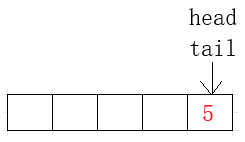
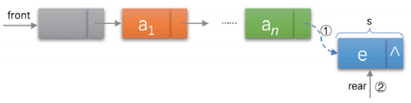
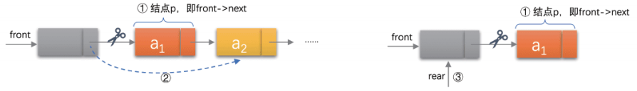
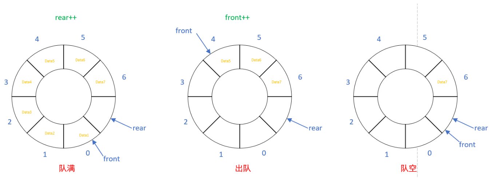
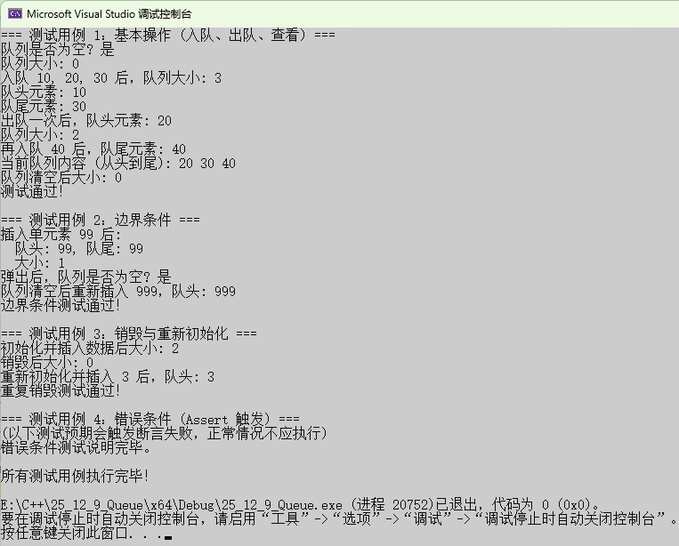

# 深入浅出C语言实现队列：从基础概念到高级应用的全景解析

# 一、基础概念详述：队列的本质与约定 

数据结构是计算机科学的基石，而**队列（Queue）**作为一种线性表，在操作系统、网络通信、算法设计等领域扮演着至关重要的角色。本节将从队列的定义、核心原则、抽象数据类型（ADT）规范，直至与另一种常见数据结构——栈（Stack）——进行对比，全面构建对队列的认识。


## 1.1 队列的定义与核心原则：FIFO

**队列**是一种特殊的线性表，它只允许在表的前端（**队头，Front**）进行删除操作，而在表的后端（**队尾，Rear**）进行插入操作。形象地说，队列就像日常生活中排队等候的队伍：先来的人先得到服务并离开。

队列遵循**“先进先出”（First In, First Out, 简称FIFO）**原则。

**【知识点】** FIFO原则是队列的灵魂。这意味着，第一个进入队列的元素将是第一个离开队列的元素。它保证了数据处理的顺序性，这在需要维持输入/输出顺序的场景中至关重要，例如任务调度和I/O缓冲。


## 1.2 队列的抽象数据类型规范

在理论层面，队列作为一种**抽象数据类型（ADT）**，定义了一组可以在其上执行的操作，而不用关心底层是如何实现的。一个标准的**队列ADT**通常包含以下基本操作：

| **操作名称**       | **C实现函数 **                      | **描述**                     |
| ------------------ | ----------------------------------- | ---------------------------- |
| **初始化**         | `QueueInit(Queue* pq)`              | 创建并清空一个队列。         |
| **入队 (Enqueue)** | `QueuePush(Queue* pq, QDataType x)` | 在队尾添加一个新元素 $x$。   |
| **出队 (Dequeue)** | `QueuePop(Queue* pq)`               | 移除队头元素。               |
| **取队头**         | `QueueFront(Queue* pq)`             | 获取队头元素的值，但不移除。 |
| **取队尾**         | `QueueBack(Queue* pq)`              | 获取队尾元素的值，但不移除。 |
| **判空**           | `QueueEmpty(Queue* pq)`             | 检查队列是否为空。           |
| **获取大小**       | `QueueSize(Queue* pq)`              | 返回队列中元素的个数。       |
| **销毁**           | `QueueDestroy(Queue* pq)`           | 释放队列占用的所有内存资源。 |

**【知识点】** 队列的实现可以基于**数组**（静态或动态）或**链表**。本篇提供的源码采用**带头/尾指针的单向链表**实现，这使得入队和出队操作的时间复杂度能保持在 $O(1)$。


## 1.3 队列与栈的对比：LIFO vs FIFO

队列和栈（Stack）都是**受限制的线性表**，但它们在数据**访问的顺序上存在本质区别**。

| **特性**     | **队列 (Queue)**                            | **栈 (Stack)**                             |
| ------------ | ------------------------------------------- | ------------------------------------------ |
| **核心原则** | **FIFO** (First In, First Out) **先进先出** | **LIFO** (Last In, First Out) **后进先出** |
| **操作限制** | 两端操作：队头出队，队尾入队                | 一端操作：栈顶入栈、出栈                   |
| **主要应用** | 任务调度、消息缓冲、广度优先搜索 (BFS)      | 函数调用栈、括号匹配、深度优先搜索 (DFS)   |
| **形象比喻** | 排队、输油管道                              | 叠盘子、弹夹                               |

**总结**：队列强调**顺序性**和**公平性**，而栈强调**回溯性**和**最近操作**。理解这种差异对于选择合适的数据结构解决特定问题至关重要。


## 1.4 队列的两种常见实现方式

### 1.4.1 数组实现 (顺序存储)

使用固定大小的数组实现队列，通常需要两个指针/索引：`front` 指向队头，`rear` 指向队尾的下一个位置（或队尾元素）。

- **优点**：存储密度大，访问速度快。
- **缺点**：存在**“假溢出”**问题（当队尾到达数组末端，但队头前部仍有空闲空间时，类似于下图这样），且容量固定，需要采用**循环队列**来解决假溢出。


### 1.4.2 链表实现 (链式存储)

使用**单向链表**实现，正如您提供的源码所示。队列结构体 `Queue` 中包含指向队头节点 `phead` 和队尾节点 `ptail` 的指针。

- **优点**：**动态扩展**，容量不受限制（仅受限于内存），不存在假溢出。
- **缺点**：需要额外的内存来存储节点指针 `next`，存储密度略低，内存分配和释放略有开销。


**【知识点】** 本次分析的源码采用链表实现，通过维护 `phead` 和 `ptail` 两个指针，使得**入队 (QueuePush)** 和**出队 (QueuePop)** 都能在 $O(1)$ 时间内完成，效率极高。


# 二、源码分析与实现：链表队列的精雕细琢 

本部分将结合您提供的 `Queue.h` 和 `Queue.c` 源码，对基于单向链表实现的队列进行逐函数解析，深入理解其设计哲学和实现细节。


## 2.1 队列结构体的定义 (`Queue.h`)


```c
//队列数据类型
typedef int QDataType;
//队列节点
typedef struct QNode
{
	QDataType val;
	struct QNode* next;
}QNode;
//队列结构体定义
typedef struct Queue
{
	QNode* phead;
	QNode* ptail;
	int size;
}Queue;
```

**解析：**

1. **`QDataType`**：定义了队列中存储的数据类型，当前为 `int`。通过 `typedef` 方便未来修改为其他类型（如 `char*` 或自定义结构体）。
2. **`QNode`**：这是链表的基本单元，包含两部分：
   - `QDataType val`：存储数据本身。
   - `struct QNode* next`：指向下一个节点的指针。
3. **`Queue`**：队列的主结构体，包含三个关键成员：
   - `QNode* phead`：指向队头节点。
   - `QNode* ptail`：指向队尾节点。
   - `int size`：记录队列中有效元素的个数。这是实现 `QueueSize` 和 `QueueEmpty` 的高效手段。


## 2.2 队列的初始化与销毁

### 2.2.1 初始化 (`QueueInit`)


```c
void QueueInit(Queue* pq)
{
	assert(pq); // 确保指针非空
	pq->phead = NULL;
	pq->ptail = NULL;
	pq->size = 0;
}
```

**解析：** 初始化操作是所有操作的基石。它将队头和队尾指针都置为 `NULL`，表示队列为空，并将 `size` 初始化为 `0`。`assert(pq)` 是一个重要的**断言（Assertion）**，用于在调试阶段检查传入的队列指针是否有效，防止对空指针进行操作导致程序崩溃。

### 2.2.2 销毁 (`QueueDestroy`)


```c
void QueueDestroy(Queue* pq)
{
	assert(pq);
	
	QNode* cur = pq->phead;
	while (cur)
	{
		QNode* next = cur->next;
		free(cur); // 释放当前节点
		cur = next;
	}

	pq->phead = NULL; // 释放完所有节点后，重置指针和大小
	pq->ptail = NULL;
	pq->size = 0;
}
```

**解析：**销毁操作旨在释放所有动态分配的节点内存，避免**内存泄漏（Memory Leak）**。它使用一个循环遍历整个链表：

1. 用 `cur` 指针从 `phead` 开始。
2. 在释放当前节点 `cur` 之前，先用 `next` 临时存储 `cur->next` 的地址。
3. `free(cur)` 释放当前节点。
4. `cur` 移动到下一个节点 `next`。

循环结束后，**必须**将 `phead`、`ptail` 和 `size` 重置，使得队列结构体回到初始状态。这对于后续的**重新初始化与复用**至关重要，如 `TestCase_DestroyAndReinit` 所示。


## 2.3 核心操作：入队与出队

### 2.3.1 入队 (`QueuePush`)：在队尾插入


```c
void QueuePush(Queue* pq, QDataType x)
{
	assert(pq);
	QNode* newNode = (QNode*)malloc(sizeof(QNode));
	if (newNode == NULL)
	{
		perror("malloc"); // 内存分配失败
		exit(-1);
	}

	newNode->next = NULL;
	newNode->val = x;

	if (pq->phead == NULL) // 队列为空的情况 (插入第一个节点)
	{
		pq->phead = newNode;
		pq->ptail = newNode;
	}
	else // 队列非空的情况 (在队尾 ptail 后面插入)
	{
		pq->ptail->next = newNode;
		pq->ptail = newNode;
	}
	pq->size++;
}
```



**解析：**入队操作的关键在于**动态内存分配**和**队尾指针的维护**：

1. `malloc` 为新元素分配内存，并进行错误检查。
2. 设置新节点的 `val` 和 `next`（`next` 必然为 `NULL`，因为它成为新的队尾）。
3. **边界条件处理**：
   - **空队列** (`pq->phead == NULL`): 新节点既是队头也是队尾，`phead` 和 `ptail` 都指向它。
   - **非空队列**: 将原队尾节点的 `next` 指向新节点，然后将 `ptail` 更新为新节点。
4. `size` 增加。
5. **时间复杂度：** $O(1)$，因为它不需要遍历链表。

### 2.3.2 出队 (`QueuePop`)：在队头删除


```c
void QueuePop(Queue* pq)
{
	assert(pq);
	assert(pq->phead); // 检查队列是否为空 (空队列出队是错误操作)
	// 只有一个节点的情况
	if (pq->phead->next == NULL) 
	{
		free(pq->phead);
		pq->phead = pq->ptail = NULL; // 队列变空
	}
	else // 多个节点的情况
	{
		QNode* next = pq->phead->next; // 暂存新的队头
		free(pq->phead); // 释放当前队头
		pq->phead = next; // 更新队头
	}
	pq->size--;
}
```



**解析：**出队操作的关键在于**释放队头节点内存**和**更新队头指针**：

1. `assert(pq->phead)` 确保队列非空。如果对空队列执行 `Pop`，程序会触发断言并终止（如 `TestCase_ErrorConditions` 中所述）。
2. **边界条件处理**：
   - **只剩一个节点（图右）**: 释放 `phead` 后，`phead` 和 `ptail` 必须**同时**置为 `NULL`，确保队列状态正确地变为空。
   - **多个节点（图左）**: 暂存下一个节点 (`next`)，释放当前 `phead`，然后将 `phead` 指针移动到 `next`。
3. `size` 减小。
4. **时间复杂度：** $O(1)$，因为它不需要遍历链表。


## 2.4 辅助操作：查看与状态判断

### 2.4.1 查看队头/队尾 (`QueueFront`, `QueueBack`)


```c
QDataType QueueFront(Queue* pq)
{
	assert(pq && pq->phead);
	return pq->phead->val;
}
QDataType QueueBack(Queue* pq)
{
	assert(pq && pq->ptail);
	return pq->ptail->val;
}
```

这两个函数仅返回队头或队尾节点的值，**不修改队列结构**。它们的核心在于断言检查 (`assert(pq && pq->phead/ptail)`)，防止在空队列上进行读取操作。

### 2.4.2 状态判断 (`QueueEmpty`, `QueueSize`)


```c
bool QueueEmpty(Queue* pq)
{
	assert(pq);
	return pq->size == 0;
}
int QueueSize(Queue* pq)
{
	assert(pq);
	return pq->size;
}
```

通过维护 `size` 计数器，判断队列是否为空 (`QueueEmpty`) 和获取队列大小 (`QueueSize`) 都可以在 $O(1)$ 时间内完成，非常高效。


# 三、高级队列变体：超越基础的扩展 

基础队列虽然应用广泛，但在特定需求场景下，其变体能提供更优的解决方案。本节将深入探讨几种重要的队列变体。


## 3.1 循环队列 (Circular Queue)（后续会写，期待一下）

**循环队列**主要用于**数组实现**的队列，以解决普通数组队列的 **假溢出** 问题。它将队列想象成一个环形结构。

- **实现原理**：当队尾指针 `rear` 达到数组末尾时，它会“回绕”到数组的起始位置继续存储数据（前提是队头 `front` 腾出了空间）。
- **判空/判满**：
  - 为了区分队空和队满（两者都可能表现为 `front == rear`），通常采取以下策略之一：
    1. 牺牲一个存储单元，即队列满的条件是 `(rear + 1) % MaxSize == front`。
    2. 使用一个额外的 `size` 变量或 `flag` 标志位来区分。
- **应用场景**：固定大小的缓冲区、操作系统中的CPU调度（如时间片轮转）。



**【知识点】** 循环队列通过模运算 ($N \pmod M$) 来实现首尾相接的逻辑，是数组实现队列的核心优化。


## 3.2 双端队列 (Deque - Double-Ended Queue)

**双端队列**，简称**Deque**（或Double-ended Queue），是允许在**队头和队尾两端**进行插入和删除操作的线性表。

- **操作**：它集成了栈和队列的所有功能。
  - 可以在头部插入/删除。
  - 可以在尾部插入/删除。
- **分类**：
  - **输入受限双端队列 (Input-Restricted Deque)**：只允许在一端插入，两端删除。
  - **输出受限双端队列 (Output-Restricted Deque)**：只允许在两端插入，一端删除。
- **实现**：通常使用**双向链表**实现，以保证在两端操作都是 $O(1)$ 的时间复杂度。
- **应用场景**：实现栈和普通队列、存储一系列操作的历史记录（可撤销/重做），以及某些高效的算法（如滑动窗口的最大/最小值问题）。


## 3.3 优先队列 (Priority Queue)

**优先队列**是一种特殊的队列，其中元素的出队顺序**不是**严格遵循FIFO原则，而是根据元素的**优先级 (Priority)**。

- **原则**：优先级最高的元素先出队。如果优先级相同，则遵循FIFO原则。
- **实现**：优先队列最常用的高效实现是使用**堆 (Heap)**，特别是**二叉堆**（最大堆或最小堆）。
  - **入队**：对应于堆的插入操作 (通常是 $O(\log N)$)。
  - **出队**：对应于取出并移除堆顶元素（通常是 $O(\log N)$)。
- **应用场景**：
  - **任务调度**：根据任务的紧急程度进行调度。
  - **贪心算法**：如Dijkstra最短路径算法和Prim最小生成树算法。
  - **数据压缩**：如Huffman编码。

**【知识点】** 优先队列打破了传统的FIFO顺序，是“堆”这一数据结构最典型的应用形式。


## 3.4 阻塞队列 (Blocking Queue)

**阻塞队列**是并发编程中的一个核心概念，它通常用于**多线程环境**下线程之间的数据共享。

- **特点**：
  - 当队列**为空**时，尝试出队（消费）的线程会被**阻塞**，直到其他线程入队（生产）元素。
  - 当队列**为满**时（如果是有限容量），尝试入队（生产）的线程会被**阻塞**，直到其他线程出队（消费）腾出空间。
- **实现**：需要使用**锁 (Lock)** 和**条件变量 (Condition Variable)** 等并发原语来实现线程的安全同步和阻塞/唤醒机制。
- **应用场景**：**生产者-消费者模型**，这是并发设计中最常见的设计模式之一，用于解耦生产数据和处理数据的流程。


## 3.5 消息队列 (Message Queue)

**消息队列（MQ）是一个更宏观、系统级别的概念，常用于分布式系统**中的进程间通信（IPC）或系统间通信。

- **作用**：它提供了一种**异步通信**机制，允许不同的进程或服务在不直接互相依赖的情况下发送和接收消息。
- **关键特性**：**持久化**（消息可以存储在磁盘上）、**高可用性**、**解耦**、**流量削峰**（在高并发下平衡系统负载）。
- **常见实现**：RabbitMQ, Kafka, ActiveMQ等专业的消息中间件。
- **应用场景**：**异步处理**（如用户注册后的邮件发送）、**应用解耦**、**日志处理**。


# 四、性能与应用深度分析：高效利用队列

本节将从计算复杂度的角度对队列操作进行量化分析，探讨内存管理的重要性，并提供选择不同实现方式的建议。


## 4.1 核心操作的复杂度分析

对于**链表实现**的队列，所有基本操作的时间复杂度都极其优秀。

| **操作**              | **复杂度 (链表实现)** | **复杂度 (数组/循环队列)** | **空间复杂度** | **备注**                                |
| --------------------- | --------------------- | -------------------------- | -------------- | --------------------------------------- |
| **QueuePush (入队)**  | $O(1)$                | $O(1)$                     | $O(N)$         | 链表实现只需操作队尾指针。              |
| **QueuePop (出队)**   | $O(1)$                | $O(1)$                     | $O(N)$         | 链表实现只需操作队头指针。              |
| **QueueFront/Back**   | $O(1)$                | $O(1)$                     | $O(1)$         | 直接返回指针所指节点的值。              |
| **QueueEmpty/Size**   | $O(1)$                | $O(1)$                     | $O(1)$         | 直接返回 `size` 变量的值。              |
| **QueueInit/Destroy** | $O(1)$ / $O(N)$       | $O(1)$ / $O(1)$            | $O(N)$         | 销毁操作需要遍历 $N$ 个节点并释放内存。 |

> **重要结论：** 链表实现队列提供了**恒定时间 $O(1)$** 的入队和出队性能，这使其成为处理高频数据流或 I/O 缓冲的首选数据结构。


## 4.2 内存管理与优化技巧

### 4.2.1 内存分配与释放

在链表实现中，内存管理是性能和稳定性的关键。

- **`malloc` 和 `free`**：`QueuePush` 中使用 `malloc`，`QueuePop` 和 `QueueDestroy` 中使用 `free`。频繁的内存分配和释放（尤其在多线程环境下）会带来系统开销和内存碎片化问题。
- **优化技巧（内存池）**：在高并发或性能敏感的场景，可以考虑使用**内存池（Memory Pool）**。提前分配一大块内存，然后从中快速分配节点，而不是每次都调用耗时的 `malloc`。

### 4.2.2 队头/队尾指针的价值

维护 **`phead` 和 `ptail`** 两个指针是链表队列实现 $O(1)$ 性能的关键。

- 如果没有 `ptail`，`QueuePush` 操作将需要从 `phead` 开始遍历到链表末尾，时间复杂度退化为 $O(N)$，这将是不可接受的性能瓶颈。
- **`size` 计数器**：维护 `size` 变量避免了在获取队列大小时遍历整个链表，将 `QueueSize` 的复杂度从 $O(N)$ 优化到了 $O(1)$。


## 4.3 队列实现的选择建议

| **场景需求**                 | **推荐实现**                | **理由**                                       |
| ---------------------------- | --------------------------- | ---------------------------------------------- |
| **容量不确定，追求极高效率** | **链表实现 (本源码)**       | $O(1)$ 操作，动态容量，性能稳定。              |
| **容量固定，内存敏感**       | **循环数组队列**            | 无额外指针开销，存储紧凑，解决了假溢出。       |
| **多线程并发环境**           | **阻塞队列 / 线程安全队列** | 需加入锁和条件变量确保操作的原子性和线程安全。 |
| **需要按优先级处理**         | **优先队列 (堆实现)**       | 满足非FIFO顺序的业务需求。                     |
| **需要双向操作**             | **双端队列 (双向链表)**     | 兼具栈和队列的特性。                           |


# 五、实战与扩展：应用、面试与未来趋势


## 5.1 真实世界应用案例

队列不仅仅是理论概念，它在计算机系统的各个层面都有实际应用：

### 5.1.1 操作系统中的任务调度

- **CPU 调度**：操作系统内核使用队列来维护等待执行的进程。例如，**就绪队列**中包含了所有准备运行的进程，调度器按照一定的策略（如时间片轮转，其中就绪队列通常是普通队列）从队头取出进程执行。
- **I/O 缓冲**：打印机、磁盘等慢速设备的输入/输出请求会被放入队列（**I/O 缓冲队列**）中，系统按顺序处理这些请求，平衡速度差异。

### 5.1.2 计算机网络与数据传输

- **网络数据包**：路由器和交换机中的缓冲区使用队列来临时存储进出的数据包。当流量超出处理能力时，数据包会在队列中等待（**拥塞**），遵循先入先出的原则。
- **TCP/IP 协议栈**：在接收端，数据包可能会乱序到达，协议栈需要使用队列来缓存这些乱序包，直到可以按正确顺序重组成完整数据。

### 5.1.3 算法领域：广度优先搜索 (BFS)

在后续的图论和树形结构中，**广度优先搜索 (BFS)** 是一种遍历或搜索算法，它**必须**使用**队列**来实现。

- **原理**：BFS 从起点开始，首先访问其所有邻居（第一层），然后访问邻居的邻居（第二层），以此类推。这完美符合队列的FIFO特性：先发现的节点先被访问。


```c
// BFS 伪代码
Queue q;
QueuePush(&q, startNode);

while (!QueueEmpty(&q)) {
    Node* current = QueueFront(&q);
    QueuePop(&q);
    
    // 访问 current 节点
    // ...
    
    // 将所有未访问的邻居节点入队
    for (Node* neighbor : current->neighbors) {
        if (!neighbor->visited) {
            QueuePush(&q, neighbor);
            neighbor->visited = true;
        }
    }
}
```


## 5.2 经典面试题解析

### 5.2.1 考察点：用两个栈实现一个队列（马上会写，期待一下）

这是考察对栈和队列操作特性的经典问题。

- **实现思路**：需要两个栈，**Stack_In** 用于入队，**Stack_Out** 用于出队。
  - **入队 (Push)**：直接将元素压入 **Stack_In**。
  - **出队 (Pop)**：
    1. 如果 **Stack_Out** 不为空，直接弹出 **Stack_Out** 栈顶元素。
    2. 如果 **Stack_Out** 为空，将 **Stack_In** 中的所有元素依次弹出并压入 **Stack_Out**，直到 **Stack_In** 为空。然后弹出 **Stack_Out** 栈顶元素。
- **核心原理**：Stack_In 将数据按 A-B-C 的顺序压入，Stack_Out 通过反转操作，将 C-B-A 的顺序变成 A-B-C，从而实现了 FIFO。

### 5.2.2 考察点：滑动窗口最大值 (使用双端队列)

这个问题需要使用**双端队列 (Deque)** 来优化，将复杂度从 $O(N^2)$ 降到 $O(N)$。

- **原理**：双端队列中存储的是数组元素的**索引**。
  1. **保证 Deque 单调递减**：新元素加入时，如果它大于 Deque 尾部的元素，则将尾部元素全部弹出。这样 Deque 头部始终是当前窗口内的**最大值**的索引。
  2. **维护窗口大小**：当队头索引超出当前滑动窗口范围时，将队头元素弹出。


## 5.3 队列的学习路径与趋势展望

### 5.3.1 学习路径建议

1. **基础实现**：熟练掌握**链表**和**循环数组**两种实现方式，并能清晰分析其 $O(1)$ 的性能优势。
2. **高级变体**：理解并实现**双端队列**和**优先队列（基于堆）**，这是进阶算法和数据结构学习的必备项。
3. **并发应用**：深入理解**阻塞队列**和**生产者-消费者模型**，这是现代多核编程和系统设计的核心。

### 5.3.2 趋势展望

随着分布式系统和高并发计算成为主流，队列的重要性日益凸显：

1. **高可用/分布式队列**：消息队列（如Kafka）已成为微服务架构中的标准组件，用于服务间的**异步通信**和**解耦**。
2. **无锁队列**：为了在极高并发环境下进一步提升性能，**无锁队列（Lock-Free Queue）**，通过原子操作（如CAS, Compare-And-Swap）代替传统的互斥锁，成为高性能系统（如高频交易系统、高性能网络栈）的研究和应用热点。

**【知识点】** 队列不仅是一种基本数据结构，更是实现高效、健壮并发和分布式系统的基础工具。

# 六、结语

本文从队列的**FIFO原则**和**ADT规范**出发，结合C语言源码，详细解析了**链表实现**的每个细节，涵盖了**初始化、入队、出队**等核心操作及其**边界条件**处理。随后，探讨了**循环队列、双端队列、优先队列、阻塞队列**等高级变体，并进行了严谨的**性能分析**和**应用案例**探讨。队列，以其简单而强大的顺序性，持续在计算机科学的各个角落发挥着基石作用。


# 七、源码

## 7.1 Queue.h

```c
#pragma once

#include <stdio.h>
#include <stdlib.h>
#include <assert.h>
#include <stdbool.h>

//队列数据类型
typedef int QDataType;

//队列节点
typedef struct QNode
{
	QDataType val;
	struct QNode* next;
}QNode;

//队列结构体定义
typedef struct Queue
{
	QNode* phead;
	QNode* ptail;
	int size;
}Queue;

//初始化队列
void QueueInit(Queue* pq);
//销毁队列
void QueueDestroy(Queue * pq);
//入队
void QueuePush(Queue * pq, QDataType x);
//出队
void QueuePop(Queue * pq);
//取出队头元素
QDataType QueueFront(Queue * pq);
//取出队尾元素
QDataType QueueBack(Queue * pq);
//判断队列是否为空
bool QueueEmpty(Queue * pq);
//队列中有效元素个数
int QueueSize(Queue * pq);
```

## 7.2 Queue.c

```c
#define _CRT_SECURE_NO_WARNINGS 1

#include "Queue.h"

//初始化队列
void QueueInit(Queue* pq)
{
	assert(pq);
	pq->phead = NULL;
	pq->ptail = NULL;
	pq->size = 0;
}
//销毁队列
void QueueDestroy(Queue* pq)
{
	assert(pq);
	
	QNode* cur = pq->phead;
	while (cur)
	{
		QNode* next = cur->next;
		free(cur);
		cur = next;
	}

	pq->phead = NULL;
	pq->ptail = NULL;
	pq->size = 0;
}
//入队
void QueuePush(Queue* pq, QDataType x)
{
	assert(pq);
	QNode* newNode = (QNode*)malloc(sizeof(QNode));
	if (newNode == NULL)
	{
		perror("malloc");
		exit(-1);
	}

	newNode->next = NULL;
	newNode->val = x;

	if (pq->phead == NULL)
	{
		pq->phead = newNode;
		pq->ptail = newNode;
	}
	else
	{
		pq->ptail->next = newNode;
		pq->ptail = newNode;
	}
	pq->size++;
}
//出队
void QueuePop(Queue* pq)
{
	assert(pq);
	assert(pq->phead);
	//只有一个节点
	if (pq->phead->next == NULL)
	{
		free(pq->phead);
		pq->phead = pq->ptail = NULL;
	}
	else
	{
		QNode* next = pq->phead->next;
		free(pq->phead);
		pq->phead = next;
	}
	pq->size--;
}
//取出队头元素
QDataType QueueFront(Queue* pq)
{
	assert(pq && pq->phead);
	return pq->phead->val;
}
//取出队尾元素
QDataType QueueBack(Queue* pq)
{
	assert(pq && pq->ptail);
	return pq->ptail->val;
}
//判断队列是否为空
bool QueueEmpty(Queue* pq)
{
	assert(pq);

	return pq->size == 0;
}
//队列中有效元素个数
int QueueSize(Queue* pq)
{
	assert(pq);
	return pq->size;
}
```

## 7.3 test.c

```c
void TestCase_BasicOperations() 
{
    printf("=== 测试用例 1：基本操作 (入队、出队、查看) ===\n");
    Queue q;
    QueueInit(&q);

    // 测试空队列属性
    printf("队列是否为空? %s\n", QueueEmpty(&q) ? "是" : "否");
    printf("队列大小: %d\n", QueueSize(&q));

    // 连续入队
    QueuePush(&q, 10);
    QueuePush(&q, 20);
    QueuePush(&q, 30);
    printf("入队 10, 20, 30 后，队列大小: %d\n", QueueSize(&q));
    printf("队头元素: %d\n", QueueFront(&q));
    printf("队尾元素: %d\n", QueueBack(&q));

    // 出队一次
    QueuePop(&q);
    printf("出队一次后，队头元素: %d\n", QueueFront(&q));
    printf("队列大小: %d\n", QueueSize(&q));

    // 继续入队出队
    QueuePush(&q, 40);
    printf("再入队 40 后，队尾元素: %d\n", QueueBack(&q));

    printf("当前队列内容 (从头到尾): ");
    while (!QueueEmpty(&q)) {
        printf("%d ", QueueFront(&q));
        QueuePop(&q);
    }
    printf("\n");
    printf("队列清空后大小: %d\n", QueueSize(&q));

    QueueDestroy(&q);
    printf("测试通过！\n\n");
}

void TestCase_EdgeConditions() 
{
    printf("=== 测试用例 2：边界条件 ===\n");
    Queue q;
    QueueInit(&q);

    // 测试单元素队列
    QueuePush(&q, 99);
    printf("插入单元素 99 后:\n");
    printf("  队头: %d, 队尾: %d\n", QueueFront(&q), QueueBack(&q)); // 应该相同
    printf("  大小: %d\n", QueueSize(&q));

    QueuePop(&q); // 弹出后队列应为空
    printf("弹出后，队列是否为空? %s\n", QueueEmpty(&q) ? "是" : "否");

    // 测试连续插入删除后的再插入
    for (int i = 0; i < 5; ++i) 
    {
        QueuePush(&q, i * 100);
    }
    while (!QueueEmpty(&q)) {
        QueuePop(&q);
    }
    // 此时队列再次为空，测试是否能正确接受新元素
    QueuePush(&q, 999);
    printf("队列清空后重新插入 999，队头: %d\n", QueueFront(&q));

    QueueDestroy(&q);
    printf("边界条件测试通过！\n\n");
}

void TestCase_DestroyAndReinit() 
{
    printf("=== 测试用例 3：销毁与重新初始化 ===\n");
    Queue q;
    QueueInit(&q);
    QueuePush(&q, 1);
    QueuePush(&q, 2);
    printf("初始化并插入数据后大小: %d\n", QueueSize(&q));

    QueueDestroy(&q); // 显式销毁
    printf("销毁后大小: %d\n", QueueSize(&q)); // 应打印出 Destroy 函数设置的 0

    // 重新初始化并使用
    QueueInit(&q); // 关键步骤：内存已释放，结构体可以重新初始化
    QueuePush(&q, 3);
    printf("重新初始化并插入 3 后，队头: %d\n", QueueFront(&q));

    QueueDestroy(&q); // 再次销毁
    printf("重复销毁测试通过！\n\n");
}

// 此函数用于演示 assert 触发的错误情况（运行时需注意）
void TestCase_ErrorConditions() 
{
    printf("=== 测试用例 4：错误条件 (Assert 触发) ===\n");
    printf("(以下测试预期会触发断言失败，正常情况不应执行)\n");
    Queue q;
    QueueInit(&q);

    // 1. 对空队列进行 Pop 操作 (应触发 assert)
    // QueuePop(&q); // 取消注释以测试

    // 2. 对空队列获取 Front/Back (应触发 assert)
    // int val = QueueFront(&q); // 取消注释以测试
    // int val = QueueBack(&q);  // 取消注释以测试

    QueuePush(&q, 42);

    // 3. 传递 NULL 指针给队列函数 (应触发 assert)
    // QueuePush(NULL, 100); // 取消注释以测试
    // QueueFront(NULL);     // 取消注释以测试

    QueueDestroy(&q);
    printf("错误条件测试说明完毕。\n\n");
}

int main() 
{
    TestCase_BasicOperations();   // 测试基本功能
    TestCase_EdgeConditions();    // 测试边界情况
    TestCase_DestroyAndReinit();  // 测试销毁与复用
    TestCase_ErrorConditions();   // 说明错误情况

    printf("所有测试用例执行完毕！\n");
    return 0;
}
```


