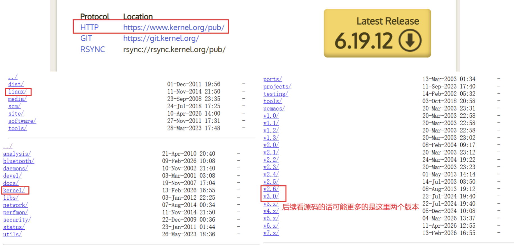
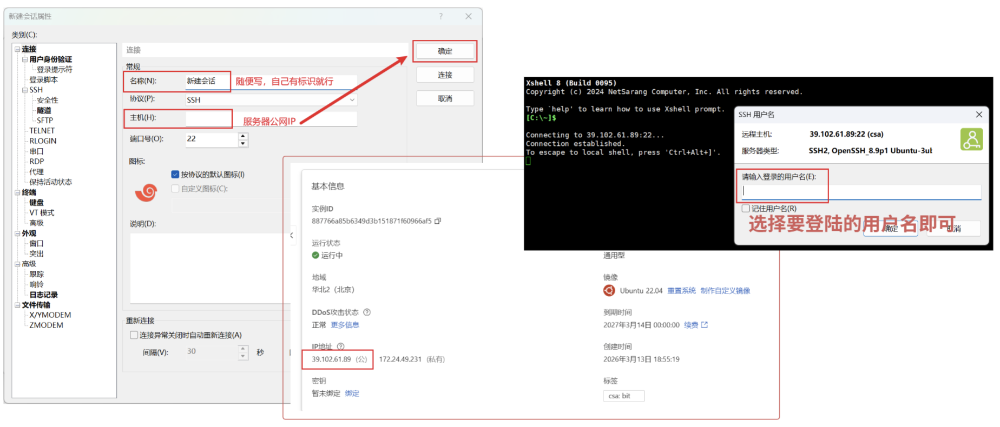
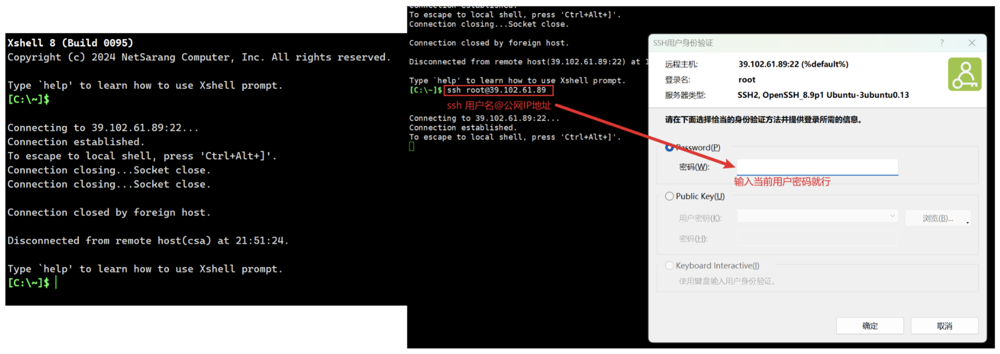
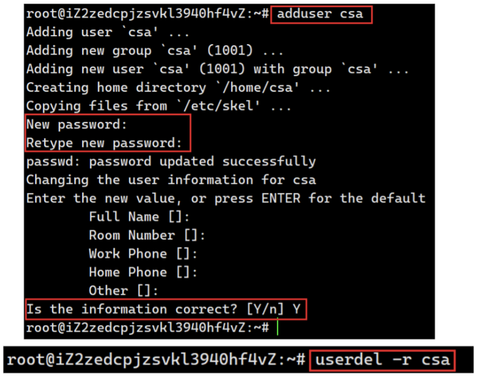

# 一、源码下载地址

`Linux` 操作系统是开源的操作系统，其源代码是公开的：

```
官网地址：https://kernel.org/
```



# 二、Linux 认识

## 2.1 不同的版本

### 2.1 技术角度：以“内核”为核心

技术层面的差异主要体现在 **Kernel（内核）版本**上。

- **内核的作用：** 连接硬件（CPU、内存、驱动）与软件。
- **版本演进：** 比如在开源代码官网上看见的 `2.6.16`、`2.6.32` 到现在的 `6.X.X`。
	- **老内核（2.6时代）：** 是 `Linux` 历史上极为经典的稳定版本，很多工业设备至今仍在使用。
	- **新内核（6.X时代）：** 增加了对最新显卡、新型文件系统以及更强多核处理器的支持。

### 2.2 商业角度：以“发行版”区分

商业角度其实就是“谁在维护、谁在用、怎么赚钱”。

- **一些常见的版本：**
	- **Ubuntu / Kali：** 侧重于个人开发和渗透测试（Debian 系）。
	- **CentOS / RedHat：** 企业级服务器的霸主。
	- **红旗 (RedFlag)：** 国产 Linux 的代表。
- **商业逻辑：** 不同的用户群决定了操作系统的“性格”。例如 Ubuntu 追求好用、更新快；RHEL（RedHat）追求极致稳定，哪怕软件版本旧一点也行。

**不同种类的操作系统是由使用它的大量用户进行区分的**

> 简单来说，操作系统的本质并非单纯的代码堆砌，而是**用户需求的集合体**：开发者根据特定人群的痛点（如服务器的稳、桌面的美、安全测试的专）对内核进行剪裁和包装，最终形成的发行版其实是该群体共同意志的产物。
>
> **Linux 内核就像是“基础款白面粉”，而不同的发行版则是“各地特色的面食”。**
>
> - **RHEL/CentOS** 像是**压缩饼干**：不好看也不好吃，但在极端环境下最能扛饿，是军队和远航者的首选。
>
> - **Ubuntu** 则是**精致的面包店**：加了黄油和糖（图形界面和驱动），门槛低、味道好，深受大众和白领欢迎。
>
> - **Kali Linux** 好比是**加了烈酒的面点**：普通人吃了会醉，但专门提供给需要“刺激”和“破壁”的特定专家。
>
> - **Arch Linux** 则是**DIY面粉包**：只给你面粉和酵母，想吃什么自己揉、自己烤，适合那些追求极致掌控感的“大厨”。
>
>**正是因为吃面的人口味不同，才诞生了琳琅满目的 Linux 世界。**


## 2.2 内核版本名称的含义

示例：

```
3.10.0-957.21.3.el7.x86_64
```

### 2.2.1 版本号构成
- **主版本号 (3)：** 核心架构发生重大改变时才会跳号。
- **次版本号 (10)：** 
  - **偶数（如 10, 12）：** **稳定版本**，适合生产环境。
  - **奇数（如 11, 13）：** **测试/开发版本**，增加新功能，可能不稳定。

- **修订次数 (0)：** 在当前次版本下的补丁和微小调整。

### 2.2.2 后缀标识

- **打补丁 (957.21.3)：** 针对安全漏洞或性能修复进行的细小更新。
- **el7 (Enterprise Linux 7)：** 表示这是专为 **CentOS 7** 或 **RHEL 7** 编译的版本。
- **体系结构 (x86_64)：** 说明这是为 64 位 Intel/AMD 处理器编译的系统。

> 平时实际只知道前三个就好了，后缀标识

## 2.3 内核越新越好吗

答案是：**不一定，取决于你的应用场景。**

| **维度** | **新内核 (Latest Kernel)**                           | **旧/稳定内核 (LTS Kernel)**                     |
| -------- | ---------------------------------------------------- | ------------------------------------------------ |
| **优势** | 支持最新硬件、性能优化、新特性（如更好的容器支持）。 | **极度稳定**、经过长时间大规模验证、兼容旧软件。 |
| **劣势** | 可能存在未发现的 Bug，部分旧软件或驱动可能不兼容。   | 不支持最新的 CPU/GPU 架构，缺少某些前沿特性。    |
| **场景** | 个人电脑、前沿开发者、最新的 AI 服务器。             | **企业生产服务器**、银行系统、核心数据库。       |

# 三、Xshell 连接 Linux

这里有两种办法：新建会话和`ssh`

## 3.1 新建会话

打开`xshell`后，新建会话，关键就是填上服务器公网ip，然后选择你要登录的角色即可：



## 3.2 ssh 连接

这个就比较简单了，如果你打开`xshell`后是下图左边的这个界面，那就可以直接**ssh连接**，只需要用户名和相应的密码就行，也很简单：

```
ssh 你选择的用户名@你的服务器公网IP
```



# 四、创建多用户

这里就只是学了这几个简单的命令进行试验而已：

```linux
adduser 用户名
```

然后给用户名进行设置密码就行（注意`Linux`下密码不回显），注意这里必须是`root`用户，别的用户没有权限，`root`用户也可以使用：

```linux
passwd 用户名
```

这个命令进行对用户名进行修改，注意删除的时候，必须携带`-r`，也就是这样：

```linux
userdel -r 用户名
```

`-r`、`-r`、 `-r`！！！不能丢！！！


